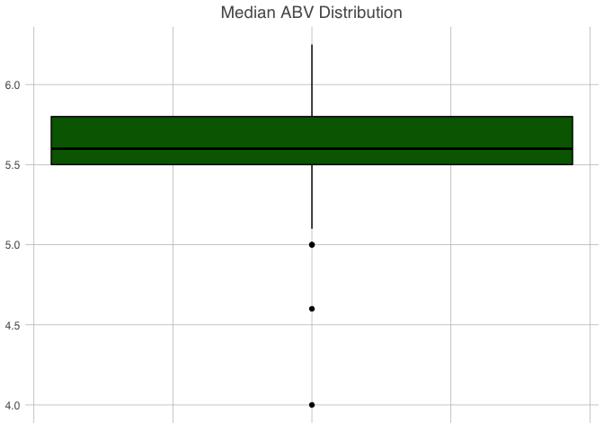
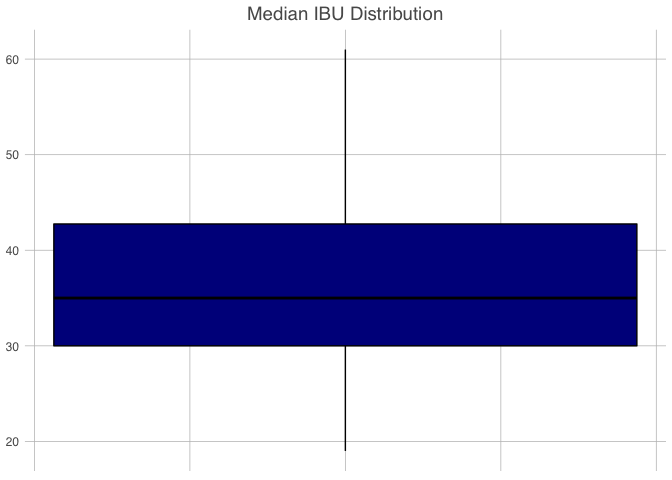
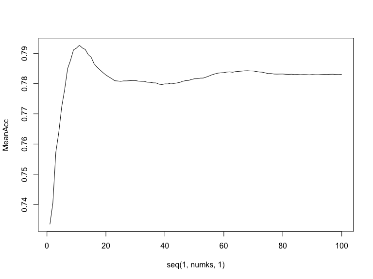

# Budweiser an InBev Company {data-background="https://i.ibb.co/M6Yh3pg/In-Bev-Background.png"}
## Budweiser {data-background="https://i.ibb.co/M6Yh3pg/In-Bev-Background.png"}
- Microbrewery Analysis
- Recommended beer releases for microbrewery market entry

# Contributors {data-background="https://i.ibb.co/M6Yh3pg/In-Bev-Background.png"}
## Huy Hoang Nguyen {data-background="https://i.ibb.co/M6Yh3pg/In-Bev-Background.png"}
- Data Cruncher
- Hype Crew

## Jaclyn Coate {data-background="https://i.ibb.co/M6Yh3pg/In-Bev-Background.png"}
- Architect
- Visualization Lover


# Brewery Geo Distribution {data-background="https://i.ibb.co/M6Yh3pg/In-Bev-Background.png"}
## Breweries by State {data-background="https://i.ibb.co/M6Yh3pg/In-Bev-Background.png"}
<!--html_preserve--><div id="htmlwidget-ac7f63b0bca4711e5af0" style="width:100%;height:500px;" class="highchart html-widget"></div>
<script type="application/json" data-for="htmlwidget-ac7f63b0bca4711e5af0">{"x":{"hc_opts":{"title":{"text":null},"yAxis":{"title":{"text":null}},"credits":{"enabled":true},"exporting":{"enabled":false},"plotOptions":{"series":{"label":{"enabled":false},"turboThreshold":0},"treemap":{"layoutAlgorithm":"squarified"}},"series":[{"mapData":{"title":"United States of America","version":"1.1.2","type":"FeatureCollection","copyright":"Copyright (c) 2015 Highsoft AS, Based on data from Natural Earth","copyrightShort":"Natural Earth","copyrightUrl":"http://www.naturalearthdata.com","crs":{"type":"name","properties":{"name":"urn:ogc:def:crs:EPSG:102004"}},"hc-transform":{"default":{"crs":"+proj=lcc +lat_1=33 +lat_2=45 +lat_0=39 +lon_0=-96 +x_0=0 +y_0=0 +datum=NAD83 +units=m +no_defs","scale":0.000151481324748,"jsonres":15.5,"jsonmarginX":-999,"jsonmarginY":9851,"xoffset":-2361356.09818,"yoffset":1398996.77886},"us-all-hawaii":{"xpan":190,"ypan":417,"hitZone":{"type":"Polygon","coordinates":[[[1747,3920],[3651,2950],[3651,-999],[1747,-999],[1747,3920]]]},"crs":"+proj=aea +lat_1=8 +lat_2=18 +lat_0=13 +lon_0=-157 +x_0=0 +y_0=0 +datum=NAD83 +units=m +no_defs","scale":0.000123090941806,"jsonres":15.5,"jsonmarginX":-999,"jsonmarginY":9851,"xoffset":-338610.47557,"yoffset":1022754.31736},"us-all-alaska":{"rotation":-0.0174532925199,"xpan":5,"ypan":357,"hitZone":{"type":"Polygon","coordinates":[[[-999,5188],[-707,5188],[1747,3920],[1747,-999],[-999,-999],[-999,5188]]]},"crs":"+proj=tmerc +lat_0=54 +lon_0=-142 +k=0.9999 +x_0=500000 +y_0=0 +ellps=GRS80 +towgs84=0,0,0,0,0,0,0 +units=m +no_defs","scale":5.84397059179e-05,"jsonres":15.5,"jsonmarginX":-999,"jsonmarginY":9851,"xoffset":-1566154.00853,"yoffset":1992671.14918}},"features":[{"type":"Feature","id":"US.MA","properties":{"hc-group":"admin1","hc-middle-x":0.36,"hc-middle-y":0.47,"hc-key":"us-ma","hc-a2":"MA","labelrank":"0","hasc":"US.MA","woe-id":"2347580","state-fips":"25","fips":"US25","postal-code":"MA","name":"Massachusetts","country":"United States of America","region":"Northeast","longitude":"-71.99930000000001","woe-name":"Massachusetts","latitude":"42.3739","woe-label":"Massachusetts, US, United States","type":"State"},"geometry":{"type":"MultiPolygon","coordinates":[[[[9430,7889],[9476,7878],[9436,7864],[9417,7844],[9430,7889]]],[[[9314,7915],[9312,7927],[9304,7921],[9278,7938],[9254,7990],[9177,7968],[8997,7925],[8860,7896],[8853,7901],[8856,8080],[8922,8096],[9005,8115],[9005,8115],[9222,8166],[9242,8201],[9300,8236],[9318,8197],[9357,8186],[9312,8147],[9299,8081],[9324,8091],[9365,8074],[9428,7985],[9483,7974],[9525,8007],[9501,8067],[9535,8028],[9549,7982],[9504,7965],[9420,7906],[9411,7955],[9371,7921],[9373,7898],[9339,7878],[9327,7915],[9314,7915]]]]}},{"type":"Feature","id":"US.WA","properties":{"hc-group":"admin1","hc-middle-x":0.56,"hc-middle-y":0.52,"hc-key":"us-wa","hc-a2":"WA","labelrank":"0","hasc":"US.WA","woe-id":"2347606","state-fips":"53","fips":"US53","postal-code":"WA","name":"Washington","country":"United States of America","region":"West","longitude":"-120.361","woe-name":"Washington","latitude":"47.4865","woe-label":"Washington, US, United States","type":"State"},"geometry":{"type":"MultiPolygon","coordinates":[[[[-77,9797],[-56,9768],[-91,9757],[-86,9712],[-136,9751],[-111,9756],[-77,9797]]],[[[-52,9689],[-85,9658],[-66,9645],[-43,9568],[-77,9588],[-74,9635],[-89,9664],[-52,9690],[-60,9697],[-61,9737],[-31,9701],[-12,9731],[-9,9774],[-33,9788],[-46,9839],[-32,9851],[926,9593],[767,8925],[779,8870],[774,8822],[398,8914],[378,8905],[289,8922],[163,8905],[94,8923],[38,8914],[-10,8925],[-22,8950],[-113,8979],[-207,8965],[-283,9014],[-271,9096],[-280,9134],[-321,9167],[-357,9171],[-365,9207],[-400,9226],[-436,9219],[-460,9259],[-436,9333],[-441,9279],[-416,9297],[-401,9347],[-434,9357],[-429,9395],[-369,9396],[-424,9436],[-424,9523],[-410,9624],[-433,9678],[-428,9749],[-385,9790],[-313,9713],[-183,9655],[-161,9666],[-146,9623],[-100,9637],[-95,9567],[-135,9518],[-77,9566],[-112,9491],[-89,9426],[-154,9433],[-175,9394],[-167,9449],[-222,9394],[-157,9376],[-124,9418],[-82,9426],[-82,9476],[-66,9527],[-18,9570],[-37,9644],[-24,9661],[-52,9689]]]]}},{"type":"Feature","id":"US.CA","properties":{"hc-group":"admin1","hc-middle-x":0.51,"hc-middle-y":0.67,"hc-key":"us-ca","hc-a2":"CA","labelrank":"0","hasc":"US.CA","woe-id":"2347563","state-fips":"6","fips":"US06","postal-code":"CA","name":"California","country":"United States of America","region":"West","longitude":"-119.591","woe-name":"California","latitude":"36.7496","woe-label":"California, US, United States","type":"State"},"geometry":{"type":"Polygon","coordinates":[[[-833,8186],[-50,7955],[-253,7203],[32,6779],[261,6430],[593,5936],[620,5788],[660,5730],[598,5702],[559,5661],[555,5605],[510,5537],[489,5536],[476,5452],[519,5416],[492,5355],[451,5357],[-76,5426],[-69,5467],[-95,5476],[-84,5583],[-110,5649],[-224,5792],[-276,5799],[-265,5822],[-284,5881],[-342,5885],[-417,5946],[-422,5975],[-484,6035],[-539,6046],[-588,6077],[-659,6091],[-686,6135],[-647,6273],[-691,6316],[-672,6333],[-720,6428],[-742,6442],[-793,6601],[-820,6637],[-816,6709],[-775,6726],[-761,6756],[-778,6807],[-821,6819],[-855,6888],[-842,6929],[-853,6979],[-833,7041],[-810,7042],[-816,6985],[-764,6931],[-772,6991],[-797,7030],[-787,7089],[-738,7083],[-782,7126],[-806,7122],[-833,7050],[-892,7126],[-903,7243],[-983,7395],[-967,7420],[-969,7507],[-943,7553],[-936,7629],[-964,7712],[-999,7766],[-993,7813],[-890,7943],[-849,8038],[-844,8118],[-860,8134],[-833,8186]]]}},{"type":"Feature","id":"US.OR","properties":{"hc-group":"admin1","hc-middle-x":0.47,"hc-middle-y":0.52,"hc-key":"us-or","hc-a2":"OR","labelrank":"0","hasc":"US.OR","woe-id":"2347596","state-fips":"41","fips":"US41","postal-code":"OR","name":"Oregon","country":"United States of America","region":"West","longitude":"-120.386","woe-name":"Oregon","latitude":"43.8333","woe-label":"Oregon, US, United States","type":"State"},"geometry":{"type":"Polygon","coordinates":[[[-50,7955],[-833,8186],[-851,8223],[-847,8281],[-817,8362],[-827,8415],[-793,8455],[-756,8527],[-714,8570],[-672,8648],[-594,8829],[-582,8877],[-494,9051],[-493,9108],[-468,9158],[-460,9216],[-396,9192],[-367,9202],[-359,9169],[-321,9167],[-280,9134],[-271,9096],[-283,9014],[-207,8965],[-113,8979],[-22,8950],[-10,8925],[38,8914],[94,8923],[163,8905],[289,8922],[378,8905],[398,8914],[774,8822],[785,8775],[821,8744],[823,8698],[776,8646],[718,8545],[624,8450],[615,8403],[662,8361],[616,8265],[510,7813],[-50,7955]]]}},{"type":"Feature","id":"US.WI","properties":{"hc-group":"admin1","hc-middle-x":0.41,"hc-middle-y":0.38,"hc-key":"us-wi","hc-a2":"WI","labelrank":"0","hasc":"US.WI","woe-id":"2347608","state-fips":"55","fips":"US55","postal-code":"WI","name":"Wisconsin","country":"United States of America","region":"Midwest","longitude":"-89.5831","woe-name":"Wisconsin","latitude":"44.3709","woe-label":"Wisconsin, US, United States","type":"State"},"geometry":{"type":"MultiPolygon","coordinates":[[[[6206,8297],[6197,8237],[6159,8156],[6136,8180],[6161,8249],[6206,8297]]],[[[5575,7508],[5561,7544],[5494,7563],[5465,7670],[5479,7702],[5445,7758],[5431,7866],[5405,7892],[5360,7903],[5273,7994],[5217,8029],[5181,8035],[5136,8072],[5146,8117],[5144,8214],[5158,8253],[5117,8285],[5116,8322],[5147,8375],[5220,8422],[5214,8573],[5245,8603],[5303,8589],[5410,8635],[5449,8660],[5489,8656],[5481,8617],[5508,8583],[5554,8572],[5588,8553],[5611,8510],[5795,8473],[5849,8447],[5968,8437],[5993,8394],[6045,8372],[6042,8286],[6080,8287],[6071,8242],[6096,8224],[6058,8180],[6028,8078],[6049,8076],[6099,8156],[6129,8170],[6153,8151],[6124,8019],[6136,7996],[6101,7916],[6110,7860],[6082,7742],[6089,7679],[6116,7626],[6119,7543],[5780,7519],[5606,7509],[5575,7508]]]]}},{"type":"Feature","id":"US.ME","properties":{"hc-group":"admin1","hc-middle-x":0.43,"hc-middle-y":0.4,"hc-key":"us-me","hc-a2":"ME","labelrank":"0","hasc":"US.ME","woe-id":"2347578","state-fips":"23","fips":"US23","postal-code":"ME","name":"Maine","country":"United States of America","region":"Northeast","longitude":"-69.1973","woe-name":"Maine","latitude":"45.148","woe-label":"Maine, US, United States","type":"State"},"geometry":{"type":"MultiPolygon","coordinates":[[[[9623,8727],[9643,8763],[9665,8747],[9641,8690],[9623,8727]]],[[[9225,8399],[9079,8830],[9115,8824],[9130,8917],[9168,8971],[9177,9035],[9160,9062],[9160,9140],[9176,9161],[9166,9236],[9238,9459],[9272,9467],[9292,9423],[9319,9415],[9428,9491],[9519,9435],[9630,9097],[9697,9099],[9717,9017],[9747,8995],[9778,9009],[9851,8939],[9818,8875],[9789,8883],[9784,8851],[9706,8811],[9712,8773],[9690,8747],[9669,8782],[9611,8766],[9590,8707],[9615,8647],[9554,8716],[9552,8761],[9517,8719],[9529,8622],[9505,8581],[9483,8586],[9467,8544],[9433,8531],[9420,8493],[9387,8524],[9346,8471],[9362,8439],[9314,8347],[9298,8291],[9235,8354],[9225,8399]]]]}},{"type":"Feature","id":"US.MI","properties":{"hc-group":"admin1","hc-middle-x":0.71,"hc-middle-y":0.67,"hc-key":"us-mi","hc-a2":"MI","labelrank":"0","hasc":"US.MI","woe-id":"2347581","state-fips":"26","fips":"US26","postal-code":"MI","name":"Michigan","country":"United States of America","region":"Midwest","longitude":"-84.9479","woe-name":"Michigan","latitude":"43.4343","woe-label":"Michigan, US, United States","type":"State"},"geometry":{"type":"MultiPolygon","coordinates":[[[[6802,8561],[6808,8523],[6764,8521],[6774,8565],[6802,8561]]],[[[5863,9010],[5834,8966],[5759,8913],[5758,8947],[5863,9010]]],[[[6976,7443],[6815,7415],[6718,7400],[6716,7416],[6323,7372],[6364,7423],[6399,7509],[6417,7630],[6409,7695],[6330,7861],[6345,7903],[6322,7979],[6361,8059],[6352,8141],[6381,8159],[6381,8204],[6423,8217],[6453,8283],[6469,8252],[6460,8196],[6479,8180],[6501,8221],[6497,8298],[6533,8342],[6567,8348],[6542,8410],[6593,8461],[6646,8436],[6627,8469],[6669,8467],[6654,8434],[6698,8433],[6726,8400],[6837,8377],[6863,8359],[6884,8307],[6860,8285],[6902,8213],[6903,8115],[6872,8094],[6868,8040],[6821,8014],[6824,7934],[6868,7920],[6900,7950],[6937,8030],[6993,8059],[7042,8027],[7097,7866],[7128,7802],[7124,7704],[7066,7697],[7061,7631],[7021,7590],[7008,7500],[6976,7443]]],[[[5874,8741],[5900,8700],[5901,8651],[5938,8693],[6017,8689],[6049,8673],[6107,8596],[6174,8609],[6192,8589],[6244,8596],[6318,8663],[6430,8674],[6485,8705],[6529,8713],[6518,8645],[6560,8631],[6591,8646],[6609,8627],[6633,8653],[6688,8665],[6692,8589],[6745,8536],[6723,8521],[6631,8516],[6606,8530],[6598,8476],[6541,8514],[6480,8529],[6444,8521],[6426,8490],[6320,8470],[6302,8429],[6244,8388],[6264,8448],[6227,8437],[6192,8395],[6185,8444],[6096,8224],[6071,8242],[6080,8287],[6042,8286],[6045,8372],[5993,8394],[5968,8437],[5849,8447],[5795,8473],[5611,8510],[5588,8553],[5554,8572],[5623,8604],[5661,8642],[5731,8656],[5776,8696],[5805,8702],[5860,8764],[5868,8750],[5893,8802],[5958,8837],[6017,8829],[5931,8757],[5903,8703],[5900,8738],[5874,8741]]]]}},{"type":"Feature","id":"US.NV","properties":{"hc-group":"admin1","hc-middle-x":0.46,"hc-middle-y":0.38,"hc-key":"us-nv","hc-a2":"NV","labelrank":"0","hasc":"US.NV","woe-id":"2347587","state-fips":"32","fips":"US32","postal-code":"NV","name":"Nevada","country":"United States of America","region":"West","longitude":"-117.02","woe-name":"Nevada","latitude":"39.4299","woe-label":"Nevada, US, United States","type":"State"},"geometry":{"type":"Polygon","coordinates":[[[-50,7955],[510,7813],[897,7727],[1073,7690],[929,6975],[818,6420],[777,6221],[752,6180],[669,6227],[631,6217],[631,6159],[611,6068],[614,5982],[593,5936],[261,6430],[32,6779],[-253,7203],[-50,7955]]]}},{"type":"Feature","id":"US.NM","properties":{"hc-group":"admin1","hc-middle-x":0.51,"hc-middle-y":0.5,"hc-key":"us-nm","hc-a2":"NM","labelrank":"0","hasc":"US.NM","woe-id":"2347590","state-fips":"35","fips":"US35","postal-code":"NM","name":"New Mexico","country":"United States of America","region":"West","longitude":"-106.024","woe-name":"New Mexico","latitude":"34.5002","woe-label":"New Mexico, US, United States","type":"State"},"geometry":{"type":"Polygon","coordinates":[[[1841,6242],[3091,6104],[3083,6007],[3081,5975],[3072,5970],[2976,4810],[2181,4887],[2208,4823],[1830,4873],[1815,4756],[1630,4782],[1736,5514],[1841,6242]]]}},{"type":"Feature","id":"US.CO","properties":{"hc-group":"admin1","hc-middle-x":0.51,"hc-middle-y":0.5,"hc-key":"us-co","hc-a2":"CO","labelrank":"0","hasc":"US.CO","woe-id":"2347564","state-fips":"8","fips":"US08","postal-code":"CO","name":"Colorado","country":"United States of America","region":"West","longitude":"-105.543","woe-name":"Colorado","latitude":"38.9998","woe-label":"Colorado, US, United States","type":"State"},"geometry":{"type":"Polygon","coordinates":[[[3091,6104],[1841,6242],[1966,7108],[1990,7269],[2964,7155],[3357,7124],[3339,6866],[3329,6696],[3290,6089],[3091,6104]]]}},{"type":"Feature","id":"US.WY","properties":{"hc-group":"admin1","hc-middle-x":0.51,"hc-middle-y":0.5,"hc-key":"us-wy","hc-a2":"WY","labelrank":"0","hasc":"US.WY","woe-id":"2347609","state-fips":"56","fips":"US56","postal-code":"WY","name":"Wyoming","country":"United States of America","region":"West","longitude":"-107.552","woe-name":"Wyoming","latitude":"42.9999","woe-label":"Wyoming, US, United States","type":"State"},"geometry":{"type":"Polygon","coordinates":[[[2964,7155],[1990,7269],[1600,7329],[1643,7585],[1677,7785],[1750,8226],[1772,8355],[3056,8191],[3019,7770],[3010,7672],[3002,7575],[2964,7155]]]}},{"type":"Feature","id":"US.KS","properties":{"hc-group":"admin1","hc-middle-x":0.3,"hc-middle-y":0.49,"hc-key":"us-ks","hc-a2":"KS","labelrank":"0","hasc":"US.KS","woe-id":"2347575","state-fips":"20","fips":"US20","postal-code":"KS","name":"Kansas","country":"United States of America","region":"Midwest","longitude":"-98.3309","woe-name":"Kansas","latitude":"38.5","woe-label":"Kansas, US, United States","type":"State"},"geometry":{"type":"Polygon","coordinates":[[[3339,6866],[4682,6826],[4769,6780],[4726,6705],[4767,6667],[4781,6624],[4824,6600],[4833,6050],[3290,6089],[3329,6696],[3339,6866]]]}},{"type":"Feature","id":"US.NE","properties":{"hc-group":"admin1","hc-middle-x":0.43,"hc-middle-y":0.5,"hc-key":"us-ne","hc-a2":"NE","labelrank":"0","hasc":"US.NE","woe-id":"2347586","state-fips":"31","fips":"US31","postal-code":"NE","name":"Nebraska","country":"United States of America","region":"Midwest","longitude":"-99.68550000000001","woe-name":"Nebraska","latitude":"41.5002","woe-label":"Nebraska, US, United States","type":"State"},"geometry":{"type":"Polygon","coordinates":[[[4682,6826],[3339,6866],[3357,7124],[2964,7155],[3002,7575],[3010,7672],[4071,7611],[4148,7558],[4194,7574],[4297,7577],[4330,7551],[4409,7521],[4453,7479],[4469,7474],[4478,7398],[4515,7341],[4533,7291],[4529,7228],[4559,7206],[4571,7165],[4579,7031],[4592,6986],[4592,6981],[4592,6981],[4591,6981],[4591,6981],[4619,6915],[4682,6826]]]}},{"type":"Feature","id":"US.OK","properties":{"hc-group":"admin1","hc-middle-x":0.78,"hc-middle-y":0.52,"hc-key":"us-ok","hc-a2":"OK","labelrank":"0","hasc":"US.OK","woe-id":"2347595","state-fips":"40","fips":"US40","postal-code":"OK","name":"Oklahoma","country":"United States of America","region":"South","longitude":"-97.1309","woe-name":"Oklahoma","latitude":"35.452","woe-label":"Oklahoma, US, United States","type":"State"},"geometry":{"type":"Polygon","coordinates":[[[3290,6089],[4833,6050],[4833,6017],[4835,5920],[4877,5632],[4875,5180],[4790,5207],[4714,5260],[4685,5235],[4632,5257],[4595,5233],[4559,5242],[4474,5191],[4405,5248],[4360,5237],[4347,5258],[4312,5234],[4304,5199],[4283,5247],[4248,5227],[4181,5268],[4121,5246],[4093,5310],[4007,5296],[3908,5334],[3856,5341],[3842,5388],[3753,5388],[3686,5437],[3707,5936],[3081,5975],[3083,6007],[3091,6104],[3290,6089]]]}},{"type":"Feature","id":"US.MO","properties":{"hc-group":"admin1","hc-middle-x":0.48,"hc-middle-y":0.51,"hc-key":"us-mo","hc-a2":"MO","labelrank":"0","hasc":"US.MO","woe-id":"2347584","state-fips":"29","fips":"US29","postal-code":"MO","name":"Missouri","country":"United States of America","region":"Midwest","longitude":"-92.446","woe-name":"Missouri","latitude":"38.5487","woe-label":"Missouri, US, United States","type":"State"},"geometry":{"type":"Polygon","coordinates":[[[4835,5920],[4833,6017],[4833,6050],[4824,6600],[4781,6624],[4767,6667],[4726,6705],[4769,6780],[4682,6826],[4619,6915],[4591,6981],[4591,6981],[4592,6981],[4846,6977],[5120,6985],[5389,7006],[5449,6947],[5449,6947],[5449,6947],[5436,6893],[5454,6813],[5475,6774],[5540,6711],[5588,6679],[5616,6596],[5642,6567],[5672,6592],[5735,6561],[5692,6420],[5752,6350],[5792,6336],[5873,6276],[5898,6211],[5886,6165],[5918,6121],[5975,6097],[5976,6033],[5956,5988],[5932,6005],[5921,5968],[5911,5955],[5907,5967],[5890,5980],[5893,5966],[5901,5936],[5869,5898],[5888,5872],[5868,5834],[5731,5821],[5790,5904],[5767,5957],[4835,5920]]]}},{"type":"Feature","id":"US.IL","properties":{"hc-group":"admin1","hc-middle-x":0.56,"hc-middle-y":0.45,"hc-key":"us-il","hc-a2":"IL","labelrank":"0","hasc":"US.IL","woe-id":"2347572","state-fips":"17","fips":"US17","postal-code":"IL","name":"Illinois","country":"United States of America","region":"Midwest","longitude":"-89.1991","woe-name":"Illinois","latitude":"39.946","woe-label":"Illinois, US, United States","type":"State"},"geometry":{"type":"Polygon","coordinates":[[[6119,7543],[6121,7488],[6192,7351],[6247,6739],[6226,6674],[6254,6638],[6266,6585],[6244,6520],[6222,6503],[6194,6422],[6176,6404],[6179,6328],[6159,6283],[6171,6241],[6102,6218],[6105,6131],[6015,6162],[5987,6157],[5962,6117],[5975,6097],[5918,6121],[5886,6165],[5898,6211],[5873,6276],[5792,6336],[5752,6350],[5692,6420],[5735,6561],[5672,6592],[5642,6567],[5616,6596],[5588,6679],[5540,6711],[5475,6774],[5454,6813],[5436,6893],[5449,6947],[5449,6947],[5449,6947],[5458,7004],[5496,7020],[5535,7098],[5536,7132],[5509,7160],[5523,7224],[5579,7232],[5646,7276],[5671,7332],[5672,7411],[5625,7441],[5575,7508],[5575,7508],[5606,7509],[5848,7523],[6119,7543]]]}},{"type":"Feature","id":"US.IN","properties":{"hc-group":"admin1","hc-middle-x":0.49,"hc-middle-y":0.43,"hc-key":"us-in","hc-a2":"IN","labelrank":"0","hasc":"US.IN","woe-id":"2347573","state-fips":"18","fips":"US18","postal-code":"IN","name":"Indiana","country":"United States of America","region":"Midwest","longitude":"-86.1396","woe-name":"Indiana","latitude":"39.8874","woe-label":"Indiana, US, United States","type":"State"},"geometry":{"type":"Polygon","coordinates":[[[6192,7351],[6239,7329],[6323,7372],[6716,7416],[6718,7400],[6732,7296],[6797,6730],[6792,6683],[6808,6651],[6737,6617],[6682,6619],[6693,6572],[6657,6540],[6652,6507],[6622,6498],[6608,6438],[6583,6411],[6531,6450],[6485,6413],[6485,6390],[6444,6379],[6426,6401],[6359,6356],[6303,6376],[6269,6350],[6209,6363],[6179,6328],[6176,6404],[6194,6422],[6222,6503],[6244,6520],[6266,6585],[6254,6638],[6226,6674],[6247,6739],[6192,7351]]]}},{"type":"Feature","id":"US.VT","properties":{"hc-group":"admin1","hc-middle-x":0.42,"hc-middle-y":0.43,"hc-key":"us-vt","hc-a2":"VT","labelrank":"0","hasc":"US.VT","woe-id":"2347604","state-fips":"50","fips":"US50","postal-code":"VT","name":"Vermont","country":"United States of America","region":"Northeast","longitude":"-72.7317","woe-name":"Vermont","latitude":"44.0886","woe-label":"Vermont, US, United States","type":"State"},"geometry":{"type":"Polygon","coordinates":[[[8922,8096],[8856,8080],[8807,8284],[8772,8287],[8772,8328],[8740,8402],[8748,8453],[8739,8514],[8720,8537],[8695,8646],[8811,8677],[9024,8736],[9020,8661],[9045,8629],[9033,8585],[8978,8526],[8986,8490],[8981,8392],[8964,8320],[8979,8261],[8979,8148],[9005,8115],[9005,8115],[8922,8096]]]}},{"type":"Feature","id":"US.AR","properties":{"hc-group":"admin1","hc-middle-x":0.47,"hc-middle-y":0.43,"hc-key":"us-ar","hc-a2":"AR","labelrank":"0","hasc":"US.AR","woe-id":"2347562","state-fips":"5","fips":"US05","postal-code":"AR","name":"Arkansas","country":"United States of America","region":"South","longitude":"-92.14279999999999","woe-name":"Arkansas","latitude":"34.7563","woe-label":"Arkansas, US, United States","type":"State"},"geometry":{"type":"Polygon","coordinates":[[[4975,5016],[4971,5157],[4910,5157],[4875,5180],[4877,5632],[4835,5920],[5767,5957],[5790,5904],[5731,5821],[5868,5834],[5871,5791],[5827,5763],[5835,5714],[5798,5670],[5802,5602],[5762,5567],[5770,5547],[5730,5520],[5706,5470],[5709,5414],[5635,5340],[5647,5309],[5609,5297],[5620,5250],[5583,5215],[5607,5162],[5598,5120],[5618,5077],[5605,5041],[5563,5038],[4975,5016]]]}},{"type":"Feature","id":"US.TX","properties":{"hc-group":"admin1","hc-middle-x":0.69,"hc-middle-y":0.52,"hc-key":"us-tx","hc-a2":"TX","labelrank":"0","hasc":"US.TX","woe-id":"2347602","state-fips":"48","fips":"US48","postal-code":"TX","name":"Texas","country":"United States of America","region":"South","longitude":"-98.7607","woe-name":"Texas","latitude":"31.131","woe-label":"Texas, US, United States","type":"State"},"geometry":{"type":"MultiPolygon","coordinates":[[[[4875,5180],[4910,5157],[4971,5157],[4975,5016],[4980,4752],[5033,4679],[5031,4646],[5105,4506],[5093,4447],[5059,4380],[5065,4253],[5047,4228],[5018,4172],[5032,4146],[4989,4147],[4854,4084],[4875,4116],[4831,4102],[4842,4162],[4778,4141],[4769,4106],[4839,4052],[4789,4023],[4801,4063],[4739,3976],[4638,3901],[4557,3881],[4544,3857],[4451,3804],[4448,3787],[4381,3749],[4308,3672],[4340,3735],[4307,3756],[4261,3721],[4306,3712],[4263,3655],[4221,3658],[4249,3617],[4213,3527],[4195,3545],[4141,3510],[4206,3511],[4178,3442],[4232,3206],[4272,3164],[4203,3135],[4114,3192],[4013,3198],[3979,3230],[3915,3245],[3878,3279],[3810,3292],[3795,3375],[3727,3467],[3715,3534],[3721,3603],[3677,3628],[3595,3762],[3548,3801],[3525,3881],[3477,3970],[3469,4021],[3393,4097],[3411,4119],[3365,4132],[3310,4204],[3150,4220],[3103,4248],[3082,4218],[3018,4214],[2959,4096],[2967,4083],[2896,4024],[2861,4031],[2754,4113],[2695,4134],[2651,4187],[2595,4230],[2567,4305],[2573,4370],[2512,4503],[2437,4557],[2309,4714],[2275,4731],[2239,4806],[2208,4823],[2181,4887],[2976,4810],[3072,5970],[3081,5975],[3707,5936],[3686,5437],[3753,5388],[3842,5388],[3856,5341],[3908,5334],[4007,5296],[4093,5310],[4121,5246],[4181,5268],[4248,5227],[4283,5247],[4304,5199],[4312,5234],[4347,5258],[4360,5237],[4405,5248],[4474,5191],[4559,5242],[4595,5233],[4632,5257],[4685,5235],[4714,5260],[4790,5207],[4875,5180]]],[[[4269,3610],[4220,3493],[4219,3420],[4245,3297],[4214,3394],[4222,3530],[4269,3610]]]]}},{"type":"Feature","id":"US.RI","properties":{"hc-group":"admin1","hc-middle-x":0.55,"hc-middle-y":0.78,"hc-key":"us-ri","hc-a2":"RI","labelrank":"0","hasc":"US.RI","woe-id":"2347598","state-fips":"44","fips":"US44","postal-code":"RI","name":"Rhode Island","country":"United States of America","region":"Northeast","longitude":"-71.5082","woe-name":"Rhode Island","latitude":"41.6242","woe-label":"Rhode Island, US, United States","type":"State"},"geometry":{"type":"MultiPolygon","coordinates":[[[[9339,7878],[9325,7871],[9314,7915],[9327,7915],[9339,7878]]],[[[9177,7968],[9254,7990],[9278,7938],[9304,7921],[9320,7866],[9285,7851],[9279,7822],[9216,7790],[9212,7845],[9177,7968]]]]}},{"type":"Feature","id":"US.AL","properties":{"hc-group":"admin1","hc-middle-x":0.47,"hc-middle-y":0.42,"hc-key":"us-al","hc-a2":"AL","labelrank":"0","hasc":"US.AL","woe-id":"2347559","state-fips":"1","fips":"US01","postal-code":"AL","name":"Alabama","country":"United States of America","region":"South","longitude":"-86.7184","woe-name":"Alabama","latitude":"32.8551","woe-label":"Alabama, US, United States","type":"State"},"geometry":{"type":"Polygon","coordinates":[[[6487,4443],[6440,4378],[6291,4361],[6336,4375],[6317,4398],[6267,4399],[6216,4788],[6236,5574],[6215,5600],[6213,5603],[6762,5652],[6912,5135],[6947,5053],[6998,4970],[6970,4930],[6958,4846],[6990,4774],[6983,4704],[7015,4637],[6436,4574],[6431,4541],[6487,4486],[6487,4443]]]}},{"type":"Feature","id":"US.MS","properties":{"hc-group":"admin1","hc-middle-x":0.51,"hc-middle-y":0.48,"hc-key":"us-ms","hc-a2":"MS","labelrank":"0","hasc":"US.MS","woe-id":"2347583","state-fips":"28","fips":"US28","postal-code":"MS","name":"Mississippi","country":"United States of America","region":"South","longitude":"-89.71890000000001","woe-name":"Mississippi","latitude":"32.8657","woe-label":"Mississippi, US, United States","type":"State"},"geometry":{"type":"Polygon","coordinates":[[[6267,4399],[6164,4396],[6059,4360],[6017,4328],[5936,4451],[5955,4536],[5523,4510],[5540,4526],[5522,4581],[5545,4585],[5545,4642],[5565,4662],[5584,4738],[5636,4781],[5670,4868],[5629,4895],[5611,4977],[5627,5018],[5605,5041],[5618,5077],[5598,5120],[5607,5162],[5583,5215],[5620,5250],[5609,5297],[5647,5309],[5635,5340],[5709,5414],[5706,5470],[5730,5520],[5770,5547],[5762,5567],[6122,5592],[6215,5600],[6236,5574],[6216,4788],[6267,4399]]]}},{"type":"Feature","id":"US.NC","properties":{"hc-group":"admin1","hc-middle-x":0.62,"hc-middle-y":0.5,"hc-key":"us-nc","hc-a2":"NC","labelrank":"0","hasc":"US.NC","woe-id":"2347592","state-fips":"37","fips":"US37","postal-code":"NC","name":"North Carolina","country":"United States of America","region":"South","longitude":"-78.866","woe-name":"North Carolina","latitude":"35.6152","woe-label":"North Carolina, US, United States","type":"State"},"geometry":{"type":"MultiPolygon","coordinates":[[[[8716,6394],[8720,6381],[8694,6389],[8694,6389],[8704,6391],[8705,6390],[8709,6392],[8712,6393],[8716,6394]]],[[[8727,6396],[8756,6332],[8852,6203],[8782,6278],[8722,6395],[8724,6396],[8727,6396]]],[[[7532,6183],[7623,6187],[7858,6219],[8691,6388],[8768,6281],[8670,6318],[8707,6291],[8620,6230],[8584,6234],[8581,6204],[8719,6244],[8742,6161],[8737,6222],[8760,6252],[8795,6220],[8797,6153],[8772,6164],[8750,6091],[8709,6073],[8638,6097],[8638,6070],[8551,6078],[8664,6053],[8635,6009],[8661,6003],[8610,5957],[8551,5988],[8590,5949],[8631,5940],[8676,5955],[8686,5995],[8721,5956],[8670,5890],[8565,5865],[8469,5764],[8443,5714],[8432,5616],[8368,5624],[8302,5600],[8029,5790],[7791,5756],[7782,5790],[7714,5830],[7457,5802],[7290,5724],[7210,5711],[7034,5685],[7038,5756],[7073,5762],[7085,5807],[7131,5847],[7188,5859],[7269,5928],[7298,5973],[7352,6010],[7365,5989],[7437,6050],[7464,6038],[7490,6093],[7523,6123],[7532,6183]]]]}},{"type":"Feature","id":"US.VA","properties":{"hc-group":"admin1","hc-middle-x":0.64,"hc-middle-y":0.54,"hc-key":"us-va","hc-a2":"VA","labelrank":"0","hasc":"US.VA","woe-id":"2347605","state-fips":"51","fips":"US51","postal-code":"VA","name":"Virginia","country":"United States of America","region":"South","longitude":"-78.2431","woe-name":"Virginia","latitude":"37.7403","woe-label":"Virginia, US, United States","type":"State"},"geometry":{"type":"MultiPolygon","coordinates":[[[[8722,6395],[8696,6432],[8704,6391],[8694,6389],[8694,6389],[8686,6398],[8691,6388],[7858,6219],[7623,6187],[7532,6183],[7472,6170],[7116,6120],[7221,6173],[7268,6217],[7309,6294],[7363,6332],[7431,6411],[7470,6351],[7530,6341],[7567,6378],[7595,6360],[7649,6382],[7664,6419],[7690,6412],[7773,6459],[7767,6505],[7840,6674],[7857,6759],[7932,6729],[7974,6848],[7998,6837],[8048,6900],[8072,6952],[8076,7028],[8188,6969],[8198,7020],[8256,7009],[8251,6984],[8341,6945],[8347,6939],[8353,6939],[8367,6892],[8334,6870],[8323,6802],[8347,6786],[8385,6812],[8429,6763],[8484,6768],[8507,6740],[8571,6721],[8572,6647],[8536,6648],[8499,6683],[8431,6711],[8532,6636],[8597,6606],[8561,6578],[8558,6548],[8577,6545],[8611,6494],[8586,6478],[8526,6534],[8449,6533],[8518,6510],[8580,6459],[8619,6482],[8679,6482],[8727,6396],[8724,6396],[8722,6395]],[[8558,6548],[8552,6548],[8552,6548],[8552,6548],[8484,6605],[8532,6551],[8552,6548],[8552,6548],[8552,6548],[8557,6544],[8558,6548]]],[[[8709,6392],[8713,6400],[8716,6394],[8712,6393],[8709,6392]]],[[[8765,6797],[8756,6760],[8761,6796],[8765,6797]]],[[[8688,6764],[8691,6772],[8739,6789],[8726,6737],[8674,6599],[8696,6561],[8678,6528],[8652,6583],[8652,6652],[8688,6764]]]]}},{"type":"Feature","id":"US.IA","properties":{"hc-group":"admin1","hc-middle-x":0.35,"hc-middle-y":0.49,"hc-key":"us-ia","hc-a2":"IA","labelrank":"0","hasc":"US.IA","woe-id":"2347574","state-fips":"19","fips":"US19","postal-code":"IA","name":"Iowa","country":"United States of America","region":"Midwest","longitude":"-93.3891","woe-name":"Iowa","latitude":"42.0423","woe-label":"Iowa, US, United States","type":"State"},"geometry":{"type":"Polygon","coordinates":[[[5575,7508],[5625,7441],[5672,7411],[5671,7332],[5646,7276],[5579,7232],[5523,7224],[5509,7160],[5536,7132],[5535,7098],[5496,7020],[5458,7004],[5449,6947],[5449,6947],[5449,6947],[5389,7006],[5120,6985],[4846,6977],[4592,6981],[4591,6981],[4579,7031],[4571,7165],[4559,7206],[4529,7228],[4533,7291],[4515,7341],[4478,7398],[4469,7474],[4453,7479],[4423,7540],[4459,7636],[4438,7663],[4433,7734],[4459,7735],[5137,7745],[5445,7758],[5479,7702],[5465,7670],[5494,7563],[5561,7544],[5577,7513],[5575,7508],[5575,7508]]]}},{"type":"Feature","id":"US.MD","properties":{"hc-group":"admin1","hc-middle-x":0.61,"hc-middle-y":0.27,"hc-key":"us-md","hc-a2":"MD","labelrank":"0","hasc":"US.MD","woe-id":"2347579","state-fips":"24","fips":"US24","postal-code":"MD","name":"Maryland","country":"United States of America","region":"South","longitude":"-77.0454","woe-name":"Maryland","latitude":"39.3874","woe-label":"Maryland, US, United States","type":"State"},"geometry":{"type":"MultiPolygon","coordinates":[[[[8761,6796],[8769,6819],[8765,6797],[8761,6796]]],[[[8779,6915],[8779,6884],[8777,6914],[8777,6914],[8779,6915]]],[[[8739,6789],[8691,6772],[8688,6764],[8647,6746],[8650,6806],[8590,6833],[8592,6815],[8525,6862],[8581,6899],[8555,6926],[8511,6936],[8544,6974],[8512,6986],[8496,7036],[8530,7108],[8537,7165],[8497,7093],[8472,7099],[8469,7056],[8432,7052],[8471,7014],[8458,6959],[8483,6868],[8513,6820],[8462,6849],[8543,6778],[8548,6753],[8491,6782],[8433,6785],[8382,6834],[8354,6797],[8335,6827],[8370,6891],[8367,6916],[8385,6943],[8341,6945],[8251,6984],[8256,7009],[8198,7020],[8162,7087],[8101,7099],[8046,7067],[8043,7043],[8000,7038],[7977,7057],[7949,7003],[7928,7007],[7857,6922],[7835,7053],[8176,7119],[8559,7201],[8650,6887],[8771,6913],[8770,6856],[8753,6848],[8739,6789]]]]}},{"type":"Feature","id":"US.DE","properties":{"hc-group":"admin1","hc-middle-x":0.91,"hc-middle-y":0.77,"hc-key":"us-de","hc-a2":"DE","labelrank":"0","hasc":"US.DE","woe-id":"2347566","state-fips":"10","fips":"US10","postal-code":"DE","name":"Delaware","country":"United States of America","region":"South","longitude":"-75.41119999999999","woe-name":"Delaware","latitude":"38.8657","woe-label":"Delaware, US, United States","type":"State"},"geometry":{"type":"Polygon","coordinates":[[[8777,6914],[8771,6915],[8771,6913],[8650,6887],[8559,7201],[8589,7239],[8625,7239],[8601,7183],[8613,7145],[8652,7114],[8675,7051],[8735,6995],[8751,6999],[8779,6915],[8777,6914],[8777,6914]]]}},{"type":"Feature","id":"US.PA","properties":{"hc-group":"admin1","hc-middle-x":0.5,"hc-middle-y":0.49,"hc-key":"us-pa","hc-a2":"PA","labelrank":"0","hasc":"US.PA","woe-id":"2347597","state-fips":"42","fips":"US42","postal-code":"PA","name":"Pennsylvania","country":"United States of America","region":"Northeast","longitude":"-77.60939999999999","woe-name":"Pennsylvania","latitude":"40.8601","woe-label":"Pennsylvania, US, United States","type":"State"},"geometry":{"type":"Polygon","coordinates":[[[8611,7549],[8632,7530],[8615,7490],[8627,7443],[8646,7444],[8739,7361],[8691,7310],[8673,7276],[8625,7239],[8589,7239],[8559,7201],[8176,7119],[7835,7053],[7630,7017],[7589,7253],[7589,7253],[7530,7595],[7556,7610],[7662,7693],[7674,7625],[8514,7797],[8573,7765],[8588,7712],[8673,7663],[8673,7663],[8611,7549]]]}},{"type":"Feature","id":"US.NJ","properties":{"hc-group":"admin1","hc-middle-x":0.68,"hc-middle-y":0.64,"hc-key":"us-nj","hc-a2":"NJ","labelrank":"0","hasc":"US.NJ","woe-id":"2347589","state-fips":"34","fips":"US34","postal-code":"NJ","name":"New Jersey","country":"United States of America","region":"Northeast","longitude":"-74.4653","woe-name":"New Jersey","latitude":"40.0449","woe-label":"New Jersey, US, United States","type":"State"},"geometry":{"type":"Polygon","coordinates":[[[8611,7549],[8673,7663],[8759,7635],[8846,7608],[8840,7532],[8810,7504],[8805,7466],[8866,7456],[8875,7438],[8886,7281],[8853,7228],[8849,7172],[8812,7122],[8784,7047],[8766,7040],[8769,7097],[8716,7095],[8623,7151],[8610,7186],[8624,7231],[8676,7269],[8691,7310],[8739,7361],[8646,7444],[8627,7443],[8615,7490],[8632,7530],[8611,7549]]]}},{"type":"Feature","id":"US.NY","properties":{"hc-group":"admin1","hc-middle-x":0.54,"hc-middle-y":0.49,"hc-key":"us-ny","hc-a2":"NY","labelrank":"0","hasc":"US.NY","woe-id":"2347591","state-fips":"36","fips":"US36","postal-code":"NY","name":"New York","country":"United States of America","region":"Northeast","longitude":"-75.32420000000001","woe-name":"New York","latitude":"43.1988","woe-label":"New York, US, United States","type":"State"},"geometry":{"type":"Polygon","coordinates":[[[8673,7663],[8588,7712],[8573,7765],[8514,7797],[7674,7625],[7662,7693],[7763,7795],[7803,7872],[7754,7932],[7747,7976],[7812,8010],[7918,8040],[7988,8041],[8031,8026],[8061,8043],[8133,8055],[8180,8080],[8224,8141],[8264,8164],[8243,8232],[8257,8274],[8225,8259],[8202,8296],[8230,8345],[8280,8379],[8297,8437],[8358,8526],[8422,8581],[8453,8585],[8695,8646],[8720,8537],[8739,8514],[8748,8453],[8740,8402],[8772,8328],[8772,8287],[8807,8284],[8856,8080],[8853,7901],[8860,7896],[8896,7702],[8912,7685],[8874,7645],[8896,7623],[8881,7575],[8930,7617],[8982,7620],[9002,7641],[9094,7671],[9134,7722],[9173,7697],[9177,7721],[9184,7702],[9231,7730],[9141,7649],[9083,7619],[9032,7570],[8936,7519],[8857,7498],[8812,7468],[8814,7503],[8840,7506],[8858,7554],[8843,7544],[8846,7608],[8759,7635],[8695,7656],[8673,7663],[8673,7663]]]}},{"type":"Feature","id":"US.ID","properties":{"hc-group":"admin1","hc-middle-x":0.51,"hc-middle-y":0.75,"hc-key":"us-id","hc-a2":"ID","labelrank":"0","hasc":"US.ID","woe-id":"2347571","state-fips":"16","fips":"US16","postal-code":"ID","name":"Idaho","country":"United States of America","region":"West","longitude":"-114.133","woe-name":"Idaho","latitude":"43.7825","woe-label":"Idaho, US, United States","type":"State"},"geometry":{"type":"Polygon","coordinates":[[[926,9593],[1093,9555],[1036,9301],[1076,9210],[1061,9142],[1117,9085],[1172,8979],[1170,8959],[1219,8896],[1258,8897],[1253,8859],[1219,8796],[1204,8727],[1211,8698],[1177,8675],[1167,8620],[1200,8590],[1278,8630],[1303,8596],[1303,8522],[1338,8434],[1326,8419],[1347,8377],[1374,8375],[1391,8331],[1392,8280],[1415,8254],[1451,8281],[1508,8261],[1536,8282],[1614,8258],[1671,8261],[1686,8296],[1713,8295],[1750,8226],[1677,7785],[1643,7585],[1393,7629],[1073,7690],[897,7727],[510,7813],[616,8265],[662,8361],[615,8403],[624,8450],[718,8545],[776,8646],[823,8698],[821,8744],[785,8775],[774,8822],[779,8870],[767,8925],[926,9593]]]}},{"type":"Feature","id":"US.SD","properties":{"hc-group":"admin1","hc-middle-x":0.51,"hc-middle-y":0.44,"hc-key":"us-sd","hc-a2":"SD","labelrank":"0","hasc":"US.SD","woe-id":"2347600","state-fips":"46","fips":"US46","postal-code":"SD","name":"South Dakota","country":"United States of America","region":"Midwest","longitude":"-100.255","woe-name":"South Dakota","latitude":"44.4711","woe-label":"South Dakota, US, United States","type":"State"},"geometry":{"type":"Polygon","coordinates":[[[3010,7672],[3019,7770],[3056,8191],[3059,8191],[3080,8436],[4231,8374],[4444,8372],[4429,8325],[4387,8283],[4419,8232],[4462,8203],[4459,7735],[4433,7734],[4438,7663],[4459,7636],[4423,7540],[4453,7479],[4409,7521],[4330,7551],[4297,7577],[4194,7574],[4148,7558],[4071,7611],[3010,7672]]]}},{"type":"Feature","id":"US.CT","properties":{"hc-group":"admin1","hc-middle-x":0.48,"hc-middle-y":0.5,"hc-key":"us-ct","hc-a2":"CT","labelrank":"0","hasc":"US.CT","woe-id":"2347565","state-fips":"9","fips":"US09","postal-code":"CT","name":"Connecticut","country":"United States of America","region":"Northeast","longitude":"-72.7594","woe-name":"Connecticut","latitude":"41.6486","woe-label":"Connecticut, US, United States","type":"State"},"geometry":{"type":"Polygon","coordinates":[[[9216,7790],[9204,7796],[9095,7743],[9023,7721],[8972,7689],[8896,7623],[8874,7645],[8912,7685],[8896,7702],[8860,7896],[8997,7925],[9177,7968],[9212,7845],[9216,7790]]]}},{"type":"Feature","id":"US.NH","properties":{"hc-group":"admin1","hc-middle-x":0.38,"hc-middle-y":0.57,"hc-key":"us-nh","hc-a2":"NH","labelrank":"0","hasc":"US.NH","woe-id":"2347588","state-fips":"33","fips":"US33","postal-code":"NH","name":"New Hampshire","country":"United States of America","region":"Northeast","longitude":"-71.6301","woe-name":"New Hampshire","latitude":"43.5993","woe-label":"New Hampshire, US, United States","type":"State"},"geometry":{"type":"Polygon","coordinates":[[[9298,8291],[9306,8288],[9300,8236],[9242,8201],[9222,8166],[9005,8115],[9005,8115],[8979,8148],[8979,8261],[8964,8320],[8981,8392],[8986,8490],[8978,8526],[9033,8585],[9045,8629],[9020,8661],[9024,8736],[9036,8814],[9079,8830],[9225,8399],[9235,8354],[9298,8291]]]}},{"type":"Feature","id":"US.KY","properties":{"hc-group":"admin1","hc-middle-x":0.65,"hc-middle-y":0.5,"hc-key":"us-ky","hc-a2":"KY","labelrank":"0","hasc":"US.KY","woe-id":"2347576","state-fips":"21","fips":"US21","postal-code":"KY","name":"Kentucky","country":"United States of America","region":"South","longitude":"-85.5729","woe-name":"Kentucky","latitude":"37.3994","woe-label":"Kentucky, US, United States","type":"State"},"geometry":{"type":"MultiPolygon","coordinates":[[[[5893,5966],[5890,5980],[5907,5967],[5893,5966]]],[[[5921,5968],[5932,6005],[5956,5988],[5976,6033],[5975,6097],[5962,6117],[5987,6157],[6015,6162],[6105,6131],[6102,6218],[6171,6241],[6159,6283],[6179,6328],[6209,6363],[6269,6350],[6303,6376],[6359,6356],[6426,6401],[6444,6379],[6485,6390],[6485,6413],[6531,6450],[6583,6411],[6608,6438],[6622,6498],[6652,6507],[6657,6540],[6693,6572],[6682,6619],[6737,6617],[6808,6651],[6792,6683],[6797,6730],[6873,6741],[6900,6725],[6933,6672],[7001,6669],[7036,6641],[7069,6664],[7119,6643],[7198,6692],[7216,6653],[7270,6617],[7270,6617],[7270,6617],[7272,6548],[7358,6439],[7431,6411],[7363,6332],[7309,6294],[7268,6217],[7221,6173],[7116,6120],[7104,6113],[6814,6086],[6751,6077],[6516,6061],[6250,6032],[6200,6040],[6210,5991],[5921,5968]]],[[[7270,6617],[7271,6617],[7270,6617],[7270,6617],[7270,6617],[7270,6617]]]]}},{"type":"Feature","id":"US.OH","properties":{"hc-group":"admin1","hc-middle-x":0.45,"hc-middle-y":0.53,"hc-key":"us-oh","hc-a2":"OH","labelrank":"0","hasc":"US.OH","woe-id":"2347594","state-fips":"39","fips":"US39","postal-code":"OH","name":"Ohio","country":"United States of America","region":"Midwest","longitude":"-82.67189999999999","woe-name":"Ohio","latitude":"40.0924","woe-label":"Ohio, US, United States","type":"State"},"geometry":{"type":"Polygon","coordinates":[[[6718,7400],[6815,7415],[6976,7443],[7095,7408],[7082,7394],[7173,7383],[7258,7426],[7329,7440],[7383,7503],[7530,7595],[7589,7253],[7561,7233],[7587,7158],[7558,7018],[7564,6981],[7504,6911],[7454,6903],[7419,6863],[7399,6809],[7416,6775],[7391,6755],[7354,6783],[7333,6723],[7346,6679],[7321,6631],[7271,6617],[7270,6617],[7216,6653],[7198,6692],[7119,6643],[7069,6664],[7036,6641],[7001,6669],[6933,6672],[6900,6725],[6873,6741],[6797,6730],[6732,7296],[6718,7400]]]}},{"type":"Feature","id":"US.TN","properties":{"hc-group":"admin1","hc-middle-x":0.43,"hc-middle-y":0.54,"hc-key":"us-tn","hc-a2":"TN","labelrank":"0","hasc":"US.TN","woe-id":"2347601","state-fips":"47","fips":"US47","postal-code":"TN","name":"Tennessee","country":"United States of America","region":"South","longitude":"-86.3415","woe-name":"Tennessee","latitude":"35.7514","woe-label":"Tennessee, US, United States","type":"State"},"geometry":{"type":"Polygon","coordinates":[[[6215,5600],[6122,5592],[5762,5567],[5802,5602],[5798,5670],[5835,5714],[5827,5763],[5871,5791],[5868,5834],[5888,5872],[5869,5898],[5901,5936],[5893,5966],[5907,5967],[5911,5955],[5921,5968],[6210,5991],[6200,6040],[6250,6032],[6516,6061],[6751,6077],[6814,6086],[7104,6113],[7116,6120],[7472,6170],[7532,6183],[7523,6123],[7490,6093],[7464,6038],[7437,6050],[7365,5989],[7352,6010],[7298,5973],[7269,5928],[7188,5859],[7131,5847],[7085,5807],[7073,5762],[7038,5756],[7034,5685],[6918,5671],[6762,5652],[6213,5603],[6215,5600]]]}},{"type":"Feature","id":"US.WV","properties":{"hc-group":"admin1","hc-middle-x":0.35,"hc-middle-y":0.56,"hc-key":"us-wv","hc-a2":"WV","labelrank":"0","hasc":"US.WV","woe-id":"2347607","state-fips":"54","fips":"US54","postal-code":"WV","name":"West Virginia","country":"United States of America","region":"South","longitude":"-80.7128","woe-name":"West Virginia","latitude":"38.6422","woe-label":"West Virginia, US, United States","type":"State"},"geometry":{"type":"Polygon","coordinates":[[[7270,6617],[7271,6617],[7321,6631],[7346,6679],[7333,6723],[7354,6783],[7391,6755],[7416,6775],[7399,6809],[7419,6863],[7454,6903],[7504,6911],[7564,6981],[7558,7018],[7587,7158],[7561,7233],[7589,7253],[7630,7017],[7835,7053],[7857,6922],[7928,7007],[7949,7003],[7977,7057],[8000,7038],[8043,7043],[8046,7067],[8101,7099],[8162,7087],[8198,7020],[8188,6969],[8076,7028],[8072,6952],[8048,6900],[7998,6837],[7974,6848],[7932,6729],[7857,6759],[7840,6674],[7767,6505],[7773,6459],[7690,6412],[7664,6419],[7649,6382],[7595,6360],[7567,6378],[7530,6341],[7470,6351],[7431,6411],[7358,6439],[7272,6548],[7270,6617],[7270,6617],[7270,6617],[7270,6617],[7270,6617]]]}},{"type":"Feature","id":"US.DC","properties":{"hc-group":"admin1","hc-middle-x":0.57,"hc-middle-y":0.14,"hc-key":"us-dc","hc-a2":"DC","labelrank":"9","hasc":"US.DC","woe-id":"2347567","state-fips":"11","fips":"US11","postal-code":"DC","name":"District of Columbia","country":"United States of America","region":"South","longitude":"-77.01130000000001","woe-name":"District of Columbia","latitude":"38.8922","woe-label":"District of Columbia, US, United States","type":"Federal District"},"geometry":{"type":"Polygon","coordinates":[[[8367,6916],[8366,6929],[8353,6939],[8347,6939],[8341,6945],[8385,6943],[8367,6916]]]}},{"type":"Feature","id":"US.LA","properties":{"hc-group":"admin1","hc-middle-x":0.34,"hc-middle-y":0.46,"hc-key":"us-la","hc-a2":"LA","labelrank":"0","hasc":"US.LA","woe-id":"2347577","state-fips":"22","fips":"US22","postal-code":"LA","name":"Louisiana","country":"United States of America","region":"South","longitude":"-91.9991","woe-name":"Louisiana","latitude":"30.5274","woe-label":"Louisiana, US, United States","type":"State"},"geometry":{"type":"Polygon","coordinates":[[[6017,4328],[5915,4340],[5856,4368],[5812,4302],[5834,4283],[5904,4280],[5937,4313],[5992,4313],[5957,4259],[6001,4245],[6035,4298],[6067,4259],[5982,4181],[6027,4123],[6107,4114],[6148,4081],[6125,4035],[6070,4042],[6042,4077],[5966,4094],[5980,4115],[5902,4141],[5913,4064],[5876,4028],[5860,4066],[5811,4082],[5780,4036],[5724,4031],[5620,4068],[5631,4121],[5569,4128],[5532,4184],[5493,4173],[5494,4203],[5430,4175],[5437,4145],[5478,4154],[5526,4139],[5500,4112],[5431,4136],[5399,4121],[5305,4135],[5186,4176],[5128,4173],[5042,4153],[5047,4228],[5065,4253],[5059,4380],[5093,4447],[5105,4506],[5031,4646],[5033,4679],[4980,4752],[4975,5016],[5563,5038],[5605,5041],[5627,5018],[5611,4977],[5629,4895],[5670,4868],[5636,4781],[5584,4738],[5565,4662],[5545,4642],[5545,4585],[5522,4581],[5540,4526],[5523,4510],[5955,4536],[5936,4451],[6017,4328]]]}},{"type":"Feature","id":"US.FL","properties":{"hc-group":"admin1","hc-middle-x":0.77,"hc-middle-y":0.5,"hc-key":"us-fl","hc-a2":"FL","labelrank":"0","hasc":"US.FL","woe-id":"2347568","state-fips":"12","fips":"US12","postal-code":"FL","name":"Florida","country":"United States of America","region":"South","longitude":"-81.6228","woe-name":"Florida","latitude":"28.1568","woe-label":"Florida, US, United States","type":"State"},"geometry":{"type":"Polygon","coordinates":[[[6487,4443],[6487,4486],[6431,4541],[6436,4574],[7015,4637],[7055,4568],[7649,4609],[7670,4559],[7699,4566],[7687,4660],[7713,4686],[7808,4673],[7822,4672],[7849,4570],[7908,4430],[8008,4269],[8125,4130],[8113,4109],[8144,4012],[8198,3936],[8297,3758],[8321,3651],[8331,3476],[8302,3361],[8313,3273],[8270,3209],[8291,3273],[8273,3290],[8230,3255],[8194,3260],[8141,3234],[8115,3258],[8115,3303],[8070,3379],[7979,3429],[7953,3420],[7907,3543],[7846,3536],[7839,3654],[7796,3674],[7819,3634],[7779,3640],[7675,3779],[7722,3884],[7712,3915],[7671,3899],[7670,3851],[7622,3872],[7618,3966],[7635,4045],[7626,4157],[7576,4229],[7525,4222],[7473,4277],[7425,4302],[7349,4395],[7265,4433],[7186,4403],[7198,4370],[7162,4370],[7148,4336],[7067,4277],[6979,4284],[6986,4316],[6958,4349],[6892,4391],[6798,4429],[6694,4444],[6468,4388],[6505,4431],[6487,4443]]]}},{"type":"Feature","id":"US.GA","properties":{"hc-group":"admin1","hc-middle-x":0.43,"hc-middle-y":0.52,"hc-key":"us-ga","hc-a2":"GA","labelrank":"0","hasc":"US.GA","woe-id":"2347569","state-fips":"13","fips":"US13","postal-code":"GA","name":"Georgia","country":"United States of America","region":"South","longitude":"-83.4078","woe-name":"Georgia","latitude":"32.8547","woe-label":"Georgia, US, United States","type":"State"},"geometry":{"type":"Polygon","coordinates":[[[7713,4686],[7687,4660],[7699,4566],[7670,4559],[7649,4609],[7055,4568],[7015,4637],[6983,4704],[6990,4774],[6958,4846],[6970,4930],[6998,4970],[6947,5053],[6912,5135],[6762,5652],[6918,5671],[7034,5685],[7210,5711],[7290,5724],[7249,5641],[7323,5596],[7364,5593],[7401,5526],[7444,5475],[7523,5430],[7538,5402],[7600,5369],[7606,5340],[7651,5293],[7708,5272],[7750,5169],[7800,5140],[7844,5042],[7887,5035],[7901,5029],[7811,4893],[7836,4826],[7798,4798],[7817,4730],[7808,4673],[7713,4686]]]}},{"type":"Feature","id":"US.SC","properties":{"hc-group":"admin1","hc-middle-x":0.54,"hc-middle-y":0.35,"hc-key":"us-sc","hc-a2":"SC","labelrank":"0","hasc":"US.SC","woe-id":"2347599","state-fips":"45","fips":"US45","postal-code":"SC","name":"South Carolina","country":"United States of America","region":"South","longitude":"-80.6471","woe-name":"South Carolina","latitude":"33.8578","woe-label":"South Carolina, US, United States","type":"State"},"geometry":{"type":"Polygon","coordinates":[[[8302,5600],[8236,5523],[8205,5458],[8206,5396],[8173,5348],[8140,5346],[8131,5311],[8056,5219],[7989,5173],[7913,5166],[7971,5149],[7887,5035],[7844,5042],[7800,5140],[7750,5169],[7708,5272],[7651,5293],[7606,5340],[7600,5369],[7538,5402],[7523,5430],[7444,5475],[7401,5526],[7364,5593],[7323,5596],[7249,5641],[7290,5724],[7457,5802],[7714,5830],[7782,5790],[7791,5756],[8029,5790],[8302,5600]]]}},{"type":"Feature","id":"US.MN","properties":{"hc-group":"admin1","hc-middle-x":0.38,"hc-middle-y":0.6,"hc-key":"us-mn","hc-a2":"MN","labelrank":"0","hasc":"US.MN","woe-id":"2347582","state-fips":"27","fips":"US27","postal-code":"MN","name":"Minnesota","country":"United States of America","region":"Midwest","longitude":"-93.364","woe-name":"Minnesota","latitude":"46.0592","woe-label":"Minnesota, US, United States","type":"State"},"geometry":{"type":"Polygon","coordinates":[[[4333,9174],[4688,9173],[4690,9272],[4748,9253],[4770,9125],[4791,9104],[4854,9085],[4916,9083],[4938,9052],[4984,9060],[5024,9084],[5073,9082],[5132,9063],[5181,8985],[5194,9006],[5240,9014],[5304,8955],[5351,8941],[5438,8996],[5463,8964],[5570,8974],[5607,8949],[5668,8950],[5592,8895],[5514,8864],[5432,8802],[5349,8700],[5245,8603],[5214,8573],[5220,8422],[5147,8375],[5116,8322],[5117,8285],[5158,8253],[5144,8214],[5146,8117],[5136,8072],[5181,8035],[5217,8029],[5273,7994],[5360,7903],[5405,7892],[5431,7866],[5445,7758],[5137,7745],[4459,7735],[4462,8203],[4419,8232],[4387,8283],[4429,8325],[4444,8372],[4436,8472],[4402,8555],[4409,8628],[4397,8650],[4394,8777],[4347,8957],[4343,9053],[4353,9083],[4333,9174]]]}},{"type":"Feature","id":"US.MT","properties":{"hc-group":"admin1","hc-middle-x":0.55,"hc-middle-y":0.53,"hc-key":"us-mt","hc-a2":"MT","labelrank":"0","hasc":"US.MT","woe-id":"2347585","state-fips":"30","fips":"US30","postal-code":"MT","name":"Montana","country":"United States of America","region":"West","longitude":"-110.044","woe-name":"Montana","latitude":"46.9965","woe-label":"Montana, US, United States","type":"State"},"geometry":{"type":"Polygon","coordinates":[[[1093,9555],[1689,9433],[3150,9234],[3084,8486],[3080,8436],[3059,8191],[3056,8191],[1772,8355],[1750,8226],[1713,8295],[1686,8296],[1671,8261],[1614,8258],[1536,8282],[1508,8261],[1451,8281],[1415,8254],[1392,8280],[1391,8331],[1374,8375],[1347,8377],[1326,8419],[1338,8434],[1303,8522],[1303,8596],[1278,8630],[1200,8590],[1167,8620],[1177,8675],[1211,8698],[1204,8727],[1219,8796],[1253,8859],[1258,8897],[1219,8896],[1170,8959],[1172,8979],[1117,9085],[1061,9142],[1076,9210],[1036,9301],[1093,9555]]]}},{"type":"Feature","id":"US.ND","properties":{"hc-group":"admin1","hc-middle-x":0.47,"hc-middle-y":0.5,"hc-key":"us-nd","hc-a2":"ND","labelrank":"0","hasc":"US.ND","woe-id":"2347593","state-fips":"38","fips":"US38","postal-code":"ND","name":"North Dakota","country":"United States of America","region":"Midwest","longitude":"-100.302","woe-name":"North Dakota","latitude":"47.4675","woe-label":"North Dakota, US, United States","type":"State"},"geometry":{"type":"Polygon","coordinates":[[[3080,8436],[3084,8486],[3150,9234],[3468,9209],[4333,9174],[4353,9083],[4343,9053],[4347,8957],[4394,8777],[4397,8650],[4409,8628],[4402,8555],[4436,8472],[4444,8372],[4231,8374],[3080,8436]]]}},{"type":"Feature","id":"US.AZ","properties":{"hc-group":"admin1","hc-middle-x":0.51,"hc-middle-y":0.45,"hc-key":"us-az","hc-a2":"AZ","labelrank":"0","hasc":"US.AZ","woe-id":"2347561","state-fips":"4","fips":"US04","postal-code":"AZ","name":"Arizona","country":"United States of America","region":"West","longitude":"-111.935","woe-name":"Arizona","latitude":"34.3046","woe-label":"Arizona, US, United States","type":"State"},"geometry":{"type":"Polygon","coordinates":[[[1630,4782],[1196,4850],[1092,4906],[418,5307],[451,5357],[492,5355],[519,5416],[476,5452],[489,5536],[510,5537],[555,5605],[559,5661],[598,5702],[660,5730],[620,5788],[593,5936],[614,5982],[611,6068],[631,6159],[631,6217],[669,6227],[752,6180],[777,6221],[818,6420],[1488,6297],[1841,6242],[1736,5514],[1630,4782]]]}},{"type":"Feature","id":"US.UT","properties":{"hc-group":"admin1","hc-middle-x":0.52,"hc-middle-y":0.59,"hc-key":"us-ut","hc-a2":"UT","labelrank":"0","hasc":"US.UT","woe-id":"2347603","state-fips":"49","fips":"US49","postal-code":"UT","name":"Utah","country":"United States of America","region":"West","longitude":"-111.544","woe-name":"Utah","latitude":"39.5007","woe-label":"Utah, US, United States","type":"State"},"geometry":{"type":"Polygon","coordinates":[[[1841,6242],[1488,6297],[818,6420],[929,6975],[1073,7690],[1393,7629],[1643,7585],[1600,7329],[1990,7269],[1966,7108],[1841,6242]]]}},{"type":"Feature","id":"US.HI","properties":{"hc-group":"admin1","hc-middle-x":0.87,"hc-middle-y":0.79,"hc-key":"us-hi","hc-a2":"HI","labelrank":"0","hasc":"US.HI","woe-id":"2347570","state-fips":"15","fips":"US15","postal-code":"HI","name":"Hawaii","country":"United States of America","region":"West","longitude":"-157.999","woe-name":"Hawaii","latitude":"21.4919","woe-label":"Hawaii, US, United States","type":"State"},"geometry":{"type":"MultiPolygon","coordinates":[[[[2871.1,2945.9],[2875.2,2942.7],[2879.9,2943.9],[2887,2943.5],[2908.4,2936],[2926.2,2927],[2959.3,2906.2],[2969.8,2895.8],[2975.6,2888.1],[2975.6,2868.8],[2976.2,2860.2],[2981.8,2860.4],[2989.5,2864.1],[2995.3,2860.2],[2998,2855.8],[2997.4,2846.7],[3000.1,2841.1],[3003.5,2836],[3013.7,2826.7],[3024.4,2822.1],[3028.7,2818.5],[3031,2814.1],[3030.4,2808.4],[3019,2794.3],[3010.1,2790.9],[2997.5,2778.6],[2988.9,2776],[2988.6,2773.6],[2981.4,2771.8],[2975.3,2767.2],[2953.3,2760.6],[2944.8,2762.6],[2939.9,2762.7],[2935.5,2761.3],[2924.6,2753.9],[2920.9,2749.4],[2913.7,2747.3],[2906.4,2742.2],[2896.2,2736.4],[2893.2,2735.4],[2884.5,2727],[2883,2723.6],[2883.3,2715.9],[2873.3,2705.7],[2870.1,2696.8],[2867.2,2693.6],[2858.8,2686.4],[2857,2687.4],[2857.1,2692],[2852.9,2695.4],[2844.7,2699.6],[2830,2708.8],[2817.8,2712.1],[2815.1,2719.8],[2812.5,2720.6],[2810.9,2726.2],[2809.3,2735.1],[2811.5,2745.8],[2816,2776.4],[2815.6,2781.7],[2812.9,2786.6],[2805.6,2807.3],[2801.6,2814.3],[2802.1,2818.9],[2799.7,2823.2],[2796.3,2833.9],[2792.8,2839.1],[2789.8,2841.4],[2785.4,2846.6],[2780.6,2859.9],[2784.8,2870.8],[2795.1,2879.5],[2796.2,2883.5],[2799,2885.8],[2807.4,2888.9],[2813.4,2898.4],[2817.9,2906.3],[2822.3,2911.4],[2825.4,2911.5],[2827.7,2920.9],[2826.3,2924.9],[2822.9,2928.1],[2815.9,2938.7],[2813,2947.9],[2812.4,2962.2],[2816.2,2969.6],[2818.8,2972],[2826,2972],[2844.7,2968],[2850,2958],[2857.7,2955],[2862.8,2952.2],[2866.3,2948],[2871.1,2945.9]]],[[[2685.2,3028],[2683.1,3024.1],[2677.4,3024.1],[2672.1,3025],[2662.7,3023],[2656.2,3022.3],[2651.9,3026.6],[2654.3,3029.7],[2658.6,3033.4],[2670.2,3040.4],[2675.5,3042.3],[2679.6,3041.9],[2684.7,3036.2],[2682.1,3030],[2685.2,3028]]],[[[2609.3,3070.6],[2599.6,3070.1],[2595.6,3075.8],[2594.6,3080.7],[2594.3,3089.5],[2593.6,3094],[2590.2,3096],[2581.9,3099.3],[2579.4,3103.3],[2581,3107.7],[2585.7,3110.1],[2594,3111.1],[2613.5,3108.3],[2622.3,3100.4],[2628.7,3093.1],[2631.3,3086.9],[2630,3083.4],[2625.7,3076.7],[2616.7,3072.6],[2609.3,3070.6]]],[[[2673.9,3132.2],[2675.6,3130.2],[2683.4,3127.1],[2684.3,3124.4],[2686.7,3123.7],[2687.2,3118.4],[2690,3115.9],[2695.5,3106.3],[2699,3106.6],[2701.3,3109.2],[2705.1,3109.1],[2716.1,3110.5],[2722.5,3115.1],[2725.7,3116.2],[2732.1,3116.5],[2743.2,3114.2],[2746.4,3112.2],[2747.4,3109.8],[2752.3,3104.5],[2758.6,3099.6],[2758.8,3097.7],[2762.9,3098.7],[2765.5,3096.6],[2767.9,3092.2],[2774.8,3091.2],[2781.6,3088],[2791.4,3084.8],[2795.9,3075.7],[2794.9,3067.4],[2791.3,3060.7],[2786.3,3059.3],[2782.2,3053.3],[2776.8,3053.2],[2766,3047.7],[2754.9,3048.2],[2751.2,3048],[2731.5,3038.5],[2721.5,3040.8],[2718.9,3040.1],[2710.5,3039.7],[2704.9,3044.9],[2701.6,3049.9],[2703.3,3051.3],[2703.4,3055.1],[2701.8,3068.9],[2700.2,3072.7],[2700.3,3077],[2699,3080.5],[2694.8,3083.7],[2688.7,3082.3],[2687.7,3079.4],[2685.2,3078.9],[2679.4,3082.6],[2675,3083.4],[2670.7,3086.1],[2667.9,3085.8],[2660.5,3094.3],[2655,3101.5],[2654.7,3106.1],[2652.7,3108.6],[2654.7,3118.8],[2656.5,3123.8],[2658.6,3127.1],[2661.1,3127.3],[2664.7,3132],[2668.7,3131.6],[2672.3,3133.2],[2673.9,3132.2]]],[[[2542.4,3172.8],[2550.3,3172.5],[2552.8,3171.9],[2554.4,3169.4],[2557.4,3169.4],[2586.4,3165],[2594.1,3164.7],[2596.9,3170.6],[2598.9,3171.1],[2601.5,3167.6],[2602.5,3163.6],[2612.6,3161],[2622.6,3161.3],[2627,3161.9],[2631.9,3163.6],[2637.2,3163.5],[2642.1,3162.2],[2644.1,3162.6],[2646.1,3160.1],[2650.7,3159.2],[2646.9,3152.3],[2640.8,3146.4],[2633.3,3142.2],[2625.8,3139.1],[2618.1,3137.5],[2610.3,3138.3],[2602.5,3139.8],[2587.1,3143.9],[2577.6,3147.2],[2554.7,3145.6],[2547.6,3144.5],[2537.6,3144.7],[2533.7,3146.2],[2531.4,3149.3],[2531.3,3153.2],[2535.1,3159.1],[2538.7,3160.4],[2541.9,3164.2],[2542.9,3168.2],[2540.2,3172.9],[2542.4,3172.8]]],[[[2414.1,3252.1],[2415.3,3248.5],[2417.5,3247.3],[2418.6,3243.6],[2422.1,3243.3],[2425.5,3238.6],[2425.5,3233.8],[2422.8,3232.6],[2424.3,3223.3],[2428.6,3221.7],[2432,3216.6],[2435,3215.5],[2437.4,3213.2],[2440.6,3217.4],[2437.6,3219.4],[2437.9,3221.8],[2440.1,3222.8],[2448,3221.2],[2445.1,3218.3],[2444.8,3211.6],[2448.1,3209.6],[2451.4,3205.2],[2450.5,3202.8],[2453.3,3197.1],[2461.8,3192],[2463,3190.8],[2453.8,3181.6],[2451.7,3180.9],[2451.1,3184.2],[2449.4,3185.6],[2439.8,3183.8],[2433.5,3180],[2429,3180.6],[2426.4,3184.7],[2416.6,3189.1],[2413.7,3194.2],[2413.7,3196.2],[2409.6,3193],[2411.6,3190.7],[2403.3,3190.2],[2404.6,3191.8],[2399.9,3193],[2399.1,3199.7],[2405.5,3202.8],[2406.3,3204.6],[2400.6,3208.2],[2398.9,3204.7],[2394.5,3208.7],[2395.9,3202.7],[2394.8,3202],[2388.7,3207.1],[2390.1,3203.7],[2397.6,3196.7],[2396.6,3193.5],[2393,3192],[2373.9,3188.4],[2369.7,3190.8],[2368,3197.9],[2365.9,3203.5],[2361.4,3209.6],[2357.7,3211.5],[2356.8,3217.1],[2355.5,3220.1],[2349.9,3224.5],[2347.5,3228.2],[2347.2,3238.6],[2345.9,3240.5],[2337.4,3247.6],[2345.9,3249.6],[2354.3,3250],[2368.8,3249.7],[2370.5,3253.5],[2374.1,3255.5],[2379.9,3260.1],[2379.6,3261.3],[2382.9,3267.5],[2390.2,3273.8],[2396.5,3275.6],[2400.5,3274.5],[2406.2,3268.8],[2409.8,3262],[2408.9,3258.2],[2414.1,3252.1]]],[[[1955.8,3294.7],[1953.2,3293.9],[1948.4,3296.6],[1946,3304.1],[1946.6,3308.8],[1948.8,3313.7],[1956.7,3321.5],[1963,3326.1],[1971.1,3330.6],[1973.3,3335.9],[1973.1,3339.8],[1976.7,3341.3],[1980.1,3341.2],[1983.8,3339.7],[1985.5,3336],[1981.3,3331.1],[1979.8,3326.6],[1981.2,3321],[1978.5,3317.4],[1972.1,3314.3],[1968.3,3313.2],[1961.2,3308.2],[1959.7,3305],[1955.8,3294.7]]],[[[2117.8,3386.1],[2120.7,3384.6],[2123.8,3384.8],[2127.6,3382.7],[2129.1,3379.5],[2132.9,3376.7],[2134.9,3369.7],[2136.6,3368.7],[2136.1,3360.5],[2134.2,3358],[2131.3,3350.1],[2128.4,3348.5],[2128,3342.6],[2128.8,3334.9],[2128,3329.3],[2123,3328.3],[2125.2,3324.9],[2121.7,3323.7],[2118.3,3320.9],[2116.9,3318.4],[2109.4,3313],[2107.3,3310.8],[2098.5,3314],[2089,3314.5],[2078.6,3316.4],[2076.9,3318],[2074,3315.9],[2073.1,3317.6],[2068.2,3320.6],[2065.1,3326.1],[2062.8,3326.7],[2060,3329.4],[2056.1,3330],[2050.6,3332.5],[2043.4,3334.4],[2041.2,3340.1],[2038.1,3343],[2038.3,3352.8],[2040.3,3353.5],[2048.5,3363],[2049.2,3368.3],[2052.4,3371.8],[2062.1,3374.2],[2067.8,3377.5],[2071.4,3380.6],[2076.1,3382.7],[2077.8,3384.8],[2086,3386.8],[2088.1,3384.2],[2095.7,3382.1],[2095.7,3385.2],[2099.3,3386.6],[2107.5,3385.9],[2111.6,3384.7],[2115.5,3387.5],[2117.8,3386.1]]]]}},{"type":"Feature","id":"US.AK","properties":{"hc-group":"admin1","hc-middle-x":0.53,"hc-middle-y":0.33,"hc-key":"us-ak","hc-a2":"AK","labelrank":"0","hasc":"US.AK","woe-id":"2347560","state-fips":"2","fips":"US02","postal-code":"AK","name":"Alaska","country":"United States of America","region":"West","longitude":"-151.604","woe-name":"Alaska","latitude":"65.3609","woe-label":"Alaska, US, United States","type":"State"},"geometry":{"type":"MultiPolygon","coordinates":[[[[322,4275],[321,4280],[339,4292],[360,4283],[392,4281],[424,4297],[443,4318],[478,4297],[476,4285],[459,4279],[461,4263],[472,4263],[490,4288],[507,4272],[503,4256],[519,4248],[528,4258],[548,4257],[582,4240],[564,4217],[594,4212],[584,4202],[611,4198],[655,4200],[684,4194],[704,4174],[712,4178],[723,4165],[746,4156],[788,4155],[808,4136],[832,4134],[851,4144],[877,4147],[901,4136],[913,4120],[929,4117],[943,4100],[957,4101],[989,3159],[1039,3148],[1057,3163],[1084,3166],[1081,3138],[1107,3121],[1113,3108],[1167,3060],[1180,3028],[1208,3055],[1220,3056],[1229,3102],[1271,3127],[1297,3104],[1295,3091],[1335,3059],[1347,3039],[1367,3031],[1397,3002],[1477,2890],[1491,2875],[1490,2858],[1504,2853],[1511,2833],[1523,2836],[1613,2802],[1622,2783],[1617,2766],[1636,2722],[1622,2680],[1606,2663],[1592,2664],[1577,2702],[1585,2718],[1577,2755],[1555,2778],[1526,2764],[1520,2723],[1499,2746],[1510,2753],[1513,2796],[1473,2829],[1468,2844],[1424,2880],[1406,2878],[1414,2903],[1397,2917],[1390,2938],[1366,2963],[1364,2998],[1355,2976],[1348,2979],[1354,2974],[1334,2977],[1331,2984],[1344,2982],[1324,2991],[1283,3075],[1286,3041],[1310,2985],[1307,2971],[1288,2985],[1264,2982],[1266,2998],[1249,3031],[1245,3018],[1199,3046],[1202,3028],[1224,3026],[1254,2995],[1255,2977],[1229,2976],[1225,2963],[1169,2999],[1134,3041],[1085,3062],[1050,3083],[1069,3102],[1060,3119],[1025,3098],[969,3113],[977,3128],[953,3122],[899,3136],[842,3125],[826,3141],[792,3157],[802,3194],[788,3179],[783,3158],[761,3173],[742,3174],[759,3196],[727,3195],[706,3205],[716,3212],[705,3227],[679,3222],[658,3229],[636,3221],[637,3247],[620,3199],[631,3213],[642,3184],[628,3167],[614,3132],[576,3140],[552,3130],[545,3108],[537,3114],[509,3089],[521,3115],[493,3078],[478,3071],[455,3077],[433,3070],[426,3086],[455,3099],[483,3126],[457,3115],[438,3133],[464,3170],[478,3204],[473,3223],[491,3228],[524,3249],[543,3235],[554,3240],[588,3228],[544,3260],[549,3268],[527,3271],[524,3284],[490,3256],[469,3252],[424,3205],[428,3196],[407,3182],[408,3170],[377,3133],[343,3131],[339,3114],[317,3109],[309,3075],[334,3075],[352,3048],[305,3020],[308,3008],[287,2998],[271,2977],[246,2981],[222,2955],[212,2964],[200,2941],[186,2947],[152,2925],[163,2924],[146,2893],[133,2901],[107,2879],[96,2891],[89,2869],[73,2877],[24,2852],[40,2842],[7,2817],[-44,2808],[-61,2821],[-118,2794],[-130,2803],[-155,2792],[-167,2799],[-155,2816],[-167,2823],[-200,2781],[-223,2772],[-230,2808],[-252,2775],[-262,2795],[-286,2772],[-278,2800],[-223,2823],[-171,2853],[-115,2850],[-113,2838],[-84,2825],[-99,2845],[-80,2870],[-38,2892],[12,2907],[27,2896],[31,2922],[57,2946],[97,2964],[126,3051],[154,3072],[156,3089],[95,3074],[79,3099],[90,3123],[60,3099],[61,3072],[44,3066],[28,3121],[8,3111],[-6,3123],[-7,3147],[-37,3132],[-62,3132],[-69,3120],[-112,3131],[-85,3135],[-82,3162],[-87,3191],[-63,3208],[-76,3277],[-72,3305],[-89,3269],[-149,3267],[-172,3278],[-167,3295],[-184,3332],[-198,3342],[-212,3370],[-166,3383],[-134,3368],[-125,3345],[-109,3358],[-131,3376],[-161,3385],[-185,3401],[-173,3407],[-186,3433],[-191,3419],[-205,3460],[-194,3469],[-211,3484],[-189,3485],[-198,3504],[-175,3498],[-170,3526],[-130,3555],[-118,3553],[-108,3582],[-85,3606],[-61,3612],[-46,3602],[-34,3577],[-22,3576],[7,3591],[28,3609],[31,3600],[76,3594],[100,3613],[106,3664],[92,3688],[125,3701],[117,3734],[102,3721],[73,3725],[45,3711],[20,3709],[8,3729],[-28,3742],[-59,3740],[-101,3771],[-108,3789],[-98,3804],[-111,3837],[-95,3829],[-73,3837],[-119,3868],[-138,3897],[-124,3909],[-95,3914],[-87,3908],[-68,3921],[-2,3935],[36,3937],[67,3929],[47,3893],[52,3877],[111,3858],[119,3845],[140,3868],[162,3859],[147,3882],[128,3880],[135,3893],[119,3943],[132,3945],[139,3923],[133,3914],[145,3887],[163,3891],[175,3870],[196,3867],[201,3879],[179,3900],[152,3894],[142,3915],[154,3949],[129,3950],[86,3976],[89,4000],[86,4032],[55,4092],[40,4106],[27,4135],[45,4151],[57,4180],[76,4171],[124,4160],[156,4170],[182,4190],[189,4216],[201,4233],[224,4253],[229,4246],[253,4268],[256,4258],[287,4258],[317,4277],[322,4275]],[[322,4275],[323,4272],[323,4272],[323,4272],[311,4248],[326,4263],[323,4272],[323,4272],[323,4272],[324,4274],[322,4275]]],[[[-905,2721],[-922,2724],[-904,2733],[-898,2724],[-905,2721]]],[[[-739,2715],[-724,2712],[-729,2702],[-734,2709],[-739,2715]]],[[[-645,2693],[-651,2700],[-684,2693],[-643,2725],[-634,2718],[-623,2738],[-597,2740],[-595,2719],[-626,2714],[-645,2693]]],[[[-439,2748],[-458,2742],[-469,2755],[-457,2762],[-439,2748]]],[[[-268,2722],[-267,2733],[-255,2724],[-252,2715],[-268,2722]]],[[[-303,2804],[-293,2800],[-290,2768],[-309,2757],[-338,2767],[-359,2754],[-385,2761],[-386,2779],[-369,2783],[-354,2800],[-335,2796],[-303,2804]]],[[[-59,2737],[-58,2733],[-70,2740],[-62,2746],[-59,2737]]],[[[1485,2651],[1482,2635],[1455,2672],[1458,2688],[1473,2659],[1485,2651]]],[[[1568,2687],[1567,2665],[1547,2678],[1548,2705],[1568,2687]]],[[[-81,2759],[-83,2747],[-107,2735],[-88,2750],[-81,2759]]],[[[-100,2783],[-114,2781],[-119,2759],[-135,2762],[-131,2784],[-100,2783]]],[[[1530,2716],[1542,2706],[1538,2690],[1528,2711],[1530,2716]]],[[[1427,2708],[1429,2706],[1439,2711],[1430,2683],[1427,2708]]],[[[1439,2743],[1430,2731],[1420,2735],[1421,2742],[1439,2743]]],[[[1555,2775],[1573,2753],[1578,2721],[1569,2699],[1529,2721],[1537,2731],[1531,2760],[1555,2775]]],[[[1408,2747],[1414,2765],[1435,2776],[1437,2763],[1408,2747]]],[[[1480,2788],[1503,2783],[1494,2762],[1468,2778],[1475,2803],[1480,2788]]],[[[1467,2811],[1469,2795],[1445,2798],[1451,2810],[1467,2811]]],[[[1495,2807],[1510,2793],[1504,2784],[1485,2797],[1482,2819],[1495,2807]]],[[[253,2834],[251,2826],[235,2816],[239,2829],[253,2834]]],[[[276,2825],[279,2820],[259,2824],[263,2832],[276,2825]]],[[[1448,2845],[1470,2828],[1458,2816],[1449,2816],[1448,2845]]],[[[333,2880],[345,2878],[321,2864],[319,2872],[333,2880]]],[[[1295,2870],[1295,2846],[1283,2843],[1288,2862],[1295,2870]]],[[[1246,2943],[1241,2926],[1234,2942],[1237,2951],[1246,2943]]],[[[345,2973],[360,2960],[353,2961],[333,2971],[345,2973]]],[[[370,2989],[380,3007],[393,2992],[407,2995],[413,2978],[404,2970],[365,2959],[347,2974],[353,2990],[370,2989]]],[[[389,3006],[380,3014],[397,3021],[396,3012],[389,3006]]],[[[-42,3112],[-58,3105],[-53,3120],[-31,3126],[-42,3112]]],[[[643,3141],[641,3133],[628,3129],[639,3150],[643,3141]]],[[[683,3167],[692,3162],[662,3126],[639,3113],[651,3133],[678,3156],[683,3167]]],[[[-250,3366],[-233,3350],[-243,3328],[-239,3312],[-272,3312],[-294,3323],[-315,3350],[-321,3371],[-293,3362],[-286,3369],[-250,3366]]],[[[712,3177],[732,3173],[708,3154],[714,3166],[712,3177]]],[[[655,3184],[659,3177],[651,3159],[646,3171],[655,3184]]],[[[-553,3496],[-557,3490],[-570,3515],[-566,3524],[-553,3496]]],[[[735,3177],[725,3175],[725,3181],[752,3187],[735,3177]]],[[[-478,2741],[-509,2724],[-476,2727],[-492,2716],[-574,2704],[-597,2711],[-551,2713],[-526,2758],[-501,2752],[-507,2737],[-487,2749],[-478,2741]]],[[[1452,2689],[1461,2728],[1438,2724],[1443,2751],[1435,2778],[1419,2778],[1414,2794],[1439,2796],[1449,2769],[1468,2766],[1516,2700],[1532,2652],[1522,2641],[1495,2679],[1475,2669],[1476,2693],[1452,2689]]],[[[1292,2882],[1302,2902],[1330,2883],[1354,2825],[1358,2769],[1323,2816],[1325,2832],[1311,2830],[1320,2852],[1308,2856],[1308,2872],[1292,2882]]],[[[362,2955],[355,2938],[381,2954],[386,2936],[380,2918],[395,2917],[382,2900],[349,2913],[366,2899],[363,2889],[337,2894],[303,2868],[278,2838],[275,2849],[298,2883],[281,2883],[271,2862],[256,2873],[259,2892],[247,2904],[253,2919],[284,2939],[295,2933],[298,2909],[306,2934],[302,2950],[318,2956],[321,2936],[329,2963],[348,2946],[340,2965],[362,2955]]],[[[1277,2920],[1294,2891],[1278,2884],[1270,2906],[1243,2925],[1247,2941],[1271,2972],[1321,2953],[1323,2931],[1299,2928],[1309,2919],[1325,2926],[1333,2899],[1320,2896],[1277,2920]]],[[[1355,2884],[1341,2912],[1326,2962],[1314,2989],[1331,2969],[1358,2968],[1379,2937],[1376,2926],[1357,2961],[1361,2939],[1379,2919],[1383,2888],[1350,2853],[1347,2875],[1355,2884]]],[[[-347,3767],[-339,3759],[-322,3764],[-307,3758],[-307,3734],[-290,3713],[-256,3692],[-266,3681],[-286,3692],[-315,3679],[-313,3698],[-337,3738],[-353,3750],[-371,3746],[-381,3757],[-379,3773],[-362,3796],[-362,3776],[-347,3767]]],[[[1402,2834],[1394,2792],[1400,2779],[1385,2761],[1377,2790],[1389,2804],[1373,2811],[1364,2838],[1379,2842],[1395,2828],[1402,2835],[1401,2839],[1383,2863],[1396,2866],[1441,2858],[1445,2825],[1422,2845],[1441,2817],[1439,2809],[1410,2805],[1402,2834]]]]}},{"type":"Feature","properties":{"hc-group":"__separator_lines__"},"geometry":{"type":"MultiLineString","coordinates":[[[-707,5188],[3651,2950]],[[1747,2584],[1747,3799]]]}}]},"data":[{"code":"AK","Breweries":7,"StateNam":"Alaska","State":"AK","value":7},{"code":"AL","Breweries":3,"StateNam":"Alabama","State":"AL","value":3},{"code":"AR","Breweries":2,"StateNam":"Arkansas","State":"AR","value":2},{"code":"AZ","Breweries":11,"StateNam":"Arizona","State":"AZ","value":11},{"code":"CA","Breweries":39,"StateNam":"California","State":"CA","value":39},{"code":"CO","Breweries":47,"StateNam":"Colorado","State":"CO","value":47},{"code":"CT","Breweries":8,"StateNam":"Connecticut","State":"CT","value":8},{"code":"DC","Breweries":1,"StateNam":null,"State":"DC","value":1},{"code":"DE","Breweries":2,"StateNam":"Delaware","State":"DE","value":2},{"code":"FL","Breweries":15,"StateNam":"Florida","State":"FL","value":15},{"code":"GA","Breweries":7,"StateNam":"Georgia","State":"GA","value":7},{"code":"HI","Breweries":4,"StateNam":"Hawaii","State":"HI","value":4},{"code":"IA","Breweries":5,"StateNam":"Iowa","State":"IA","value":5},{"code":"ID","Breweries":5,"StateNam":"Idaho","State":"ID","value":5},{"code":"IL","Breweries":18,"StateNam":"Illinois","State":"IL","value":18},{"code":"IN","Breweries":22,"StateNam":"Indiana","State":"IN","value":22},{"code":"KS","Breweries":3,"StateNam":"Kansas","State":"KS","value":3},{"code":"KY","Breweries":4,"StateNam":"Kentucky","State":"KY","value":4},{"code":"LA","Breweries":5,"StateNam":"Louisiana","State":"LA","value":5},{"code":"MA","Breweries":23,"StateNam":"Massachusetts","State":"MA","value":23},{"code":"MD","Breweries":7,"StateNam":"Maryland","State":"MD","value":7},{"code":"ME","Breweries":9,"StateNam":"Maine","State":"ME","value":9},{"code":"MI","Breweries":32,"StateNam":"Michigan","State":"MI","value":32},{"code":"MN","Breweries":12,"StateNam":"Minnesota","State":"MN","value":12},{"code":"MO","Breweries":9,"StateNam":"Missouri","State":"MO","value":9},{"code":"MS","Breweries":2,"StateNam":"Mississippi","State":"MS","value":2},{"code":"MT","Breweries":9,"StateNam":"Montana","State":"MT","value":9},{"code":"NC","Breweries":19,"StateNam":"North Carolina","State":"NC","value":19},{"code":"ND","Breweries":1,"StateNam":"North Dakota","State":"ND","value":1},{"code":"NE","Breweries":5,"StateNam":"Nebraska","State":"NE","value":5},{"code":"NH","Breweries":3,"StateNam":"New Hampshire","State":"NH","value":3},{"code":"NJ","Breweries":3,"StateNam":"New Jersey","State":"NJ","value":3},{"code":"NM","Breweries":4,"StateNam":"New Mexico","State":"NM","value":4},{"code":"NV","Breweries":2,"StateNam":"Nevada","State":"NV","value":2},{"code":"NY","Breweries":16,"StateNam":"New York","State":"NY","value":16},{"code":"OH","Breweries":15,"StateNam":"Ohio","State":"OH","value":15},{"code":"OK","Breweries":6,"StateNam":"Oklahoma","State":"OK","value":6},{"code":"OR","Breweries":29,"StateNam":"Oregon","State":"OR","value":29},{"code":"PA","Breweries":25,"StateNam":"Pennsylvania","State":"PA","value":25},{"code":"RI","Breweries":5,"StateNam":"Rhode Island","State":"RI","value":5},{"code":"SC","Breweries":4,"StateNam":"South Carolina","State":"SC","value":4},{"code":"SD","Breweries":1,"StateNam":"South Dakota","State":"SD","value":1},{"code":"TN","Breweries":3,"StateNam":"Tennessee","State":"TN","value":3},{"code":"TX","Breweries":28,"StateNam":"Texas","State":"TX","value":28},{"code":"UT","Breweries":4,"StateNam":"Utah","State":"UT","value":4},{"code":"VA","Breweries":16,"StateNam":"Virginia","State":"VA","value":16},{"code":"VT","Breweries":10,"StateNam":"Vermont","State":"VT","value":10},{"code":"WA","Breweries":23,"StateNam":"Washington","State":"WA","value":23},{"code":"WI","Breweries":20,"StateNam":"Wisconsin","State":"WI","value":20},{"code":"WV","Breweries":1,"StateNam":"West Virginia","State":"WV","value":1},{"code":"WY","Breweries":4,"StateNam":"Wyoming","State":"WY","value":4}],"joinBy":["hc-a2","code"],"title":"Breweries by State","name":"Number of Breweries","dataLabels":{"enabled":true,"format":"{point.name}"},"borderColor":"#FAFAFA","borderWidth":0.1,"tooltip":[]}],"colorAxis":{"min":1,"max":50,"minColor":"#f1ccc7","maxColor":"#a83b2a","lineColor":"black","lineWidth":0.5}},"theme":{"chart":{"backgroundColor":"transparent"}},"conf_opts":{"global":{"Date":null,"VMLRadialGradientURL":"http =//code.highcharts.com/list(version)/gfx/vml-radial-gradient.png","canvasToolsURL":"http =//code.highcharts.com/list(version)/modules/canvas-tools.js","getTimezoneOffset":null,"timezoneOffset":0,"useUTC":true},"lang":{"contextButtonTitle":"Chart context menu","decimalPoint":".","downloadJPEG":"Download JPEG image","downloadPDF":"Download PDF document","downloadPNG":"Download PNG image","downloadSVG":"Download SVG vector image","drillUpText":"Back to {series.name}","invalidDate":null,"loading":"Loading...","months":["January","February","March","April","May","June","July","August","September","October","November","December"],"noData":"No data to display","numericSymbols":["k","M","G","T","P","E"],"printChart":"Print chart","resetZoom":"Reset zoom","resetZoomTitle":"Reset zoom level 1:1","shortMonths":["Jan","Feb","Mar","Apr","May","Jun","Jul","Aug","Sep","Oct","Nov","Dec"],"thousandsSep":" ","weekdays":["Sunday","Monday","Tuesday","Wednesday","Thursday","Friday","Saturday"]}},"type":"map","fonts":[],"debug":false},"evals":[],"jsHooks":[]}</script><!--/html_preserve-->


# Alcohol by Volume (ABV) Analysis {data-background="https://i.ibb.co/M6Yh3pg/In-Bev-Background.png"}


## Median ABV by State {data-background="https://i.ibb.co/M6Yh3pg/In-Bev-Background.png"}
<!--html_preserve--><div id="htmlwidget-7da58cf4e3b922355ef2" style="width:100%;height:500px;" class="highchart html-widget"></div>
<script type="application/json" data-for="htmlwidget-7da58cf4e3b922355ef2">{"x":{"hc_opts":{"title":{"text":null},"yAxis":{"title":{"text":null}},"credits":{"enabled":true},"exporting":{"enabled":false},"plotOptions":{"series":{"label":{"enabled":false},"turboThreshold":0},"treemap":{"layoutAlgorithm":"squarified"}},"series":[{"mapData":{"title":"United States of America","version":"1.1.2","type":"FeatureCollection","copyright":"Copyright (c) 2015 Highsoft AS, Based on data from Natural Earth","copyrightShort":"Natural Earth","copyrightUrl":"http://www.naturalearthdata.com","crs":{"type":"name","properties":{"name":"urn:ogc:def:crs:EPSG:102004"}},"hc-transform":{"default":{"crs":"+proj=lcc +lat_1=33 +lat_2=45 +lat_0=39 +lon_0=-96 +x_0=0 +y_0=0 +datum=NAD83 +units=m +no_defs","scale":0.000151481324748,"jsonres":15.5,"jsonmarginX":-999,"jsonmarginY":9851,"xoffset":-2361356.09818,"yoffset":1398996.77886},"us-all-hawaii":{"xpan":190,"ypan":417,"hitZone":{"type":"Polygon","coordinates":[[[1747,3920],[3651,2950],[3651,-999],[1747,-999],[1747,3920]]]},"crs":"+proj=aea +lat_1=8 +lat_2=18 +lat_0=13 +lon_0=-157 +x_0=0 +y_0=0 +datum=NAD83 +units=m +no_defs","scale":0.000123090941806,"jsonres":15.5,"jsonmarginX":-999,"jsonmarginY":9851,"xoffset":-338610.47557,"yoffset":1022754.31736},"us-all-alaska":{"rotation":-0.0174532925199,"xpan":5,"ypan":357,"hitZone":{"type":"Polygon","coordinates":[[[-999,5188],[-707,5188],[1747,3920],[1747,-999],[-999,-999],[-999,5188]]]},"crs":"+proj=tmerc +lat_0=54 +lon_0=-142 +k=0.9999 +x_0=500000 +y_0=0 +ellps=GRS80 +towgs84=0,0,0,0,0,0,0 +units=m +no_defs","scale":5.84397059179e-05,"jsonres":15.5,"jsonmarginX":-999,"jsonmarginY":9851,"xoffset":-1566154.00853,"yoffset":1992671.14918}},"features":[{"type":"Feature","id":"US.MA","properties":{"hc-group":"admin1","hc-middle-x":0.36,"hc-middle-y":0.47,"hc-key":"us-ma","hc-a2":"MA","labelrank":"0","hasc":"US.MA","woe-id":"2347580","state-fips":"25","fips":"US25","postal-code":"MA","name":"Massachusetts","country":"United States of America","region":"Northeast","longitude":"-71.99930000000001","woe-name":"Massachusetts","latitude":"42.3739","woe-label":"Massachusetts, US, United States","type":"State"},"geometry":{"type":"MultiPolygon","coordinates":[[[[9430,7889],[9476,7878],[9436,7864],[9417,7844],[9430,7889]]],[[[9314,7915],[9312,7927],[9304,7921],[9278,7938],[9254,7990],[9177,7968],[8997,7925],[8860,7896],[8853,7901],[8856,8080],[8922,8096],[9005,8115],[9005,8115],[9222,8166],[9242,8201],[9300,8236],[9318,8197],[9357,8186],[9312,8147],[9299,8081],[9324,8091],[9365,8074],[9428,7985],[9483,7974],[9525,8007],[9501,8067],[9535,8028],[9549,7982],[9504,7965],[9420,7906],[9411,7955],[9371,7921],[9373,7898],[9339,7878],[9327,7915],[9314,7915]]]]}},{"type":"Feature","id":"US.WA","properties":{"hc-group":"admin1","hc-middle-x":0.56,"hc-middle-y":0.52,"hc-key":"us-wa","hc-a2":"WA","labelrank":"0","hasc":"US.WA","woe-id":"2347606","state-fips":"53","fips":"US53","postal-code":"WA","name":"Washington","country":"United States of America","region":"West","longitude":"-120.361","woe-name":"Washington","latitude":"47.4865","woe-label":"Washington, US, United States","type":"State"},"geometry":{"type":"MultiPolygon","coordinates":[[[[-77,9797],[-56,9768],[-91,9757],[-86,9712],[-136,9751],[-111,9756],[-77,9797]]],[[[-52,9689],[-85,9658],[-66,9645],[-43,9568],[-77,9588],[-74,9635],[-89,9664],[-52,9690],[-60,9697],[-61,9737],[-31,9701],[-12,9731],[-9,9774],[-33,9788],[-46,9839],[-32,9851],[926,9593],[767,8925],[779,8870],[774,8822],[398,8914],[378,8905],[289,8922],[163,8905],[94,8923],[38,8914],[-10,8925],[-22,8950],[-113,8979],[-207,8965],[-283,9014],[-271,9096],[-280,9134],[-321,9167],[-357,9171],[-365,9207],[-400,9226],[-436,9219],[-460,9259],[-436,9333],[-441,9279],[-416,9297],[-401,9347],[-434,9357],[-429,9395],[-369,9396],[-424,9436],[-424,9523],[-410,9624],[-433,9678],[-428,9749],[-385,9790],[-313,9713],[-183,9655],[-161,9666],[-146,9623],[-100,9637],[-95,9567],[-135,9518],[-77,9566],[-112,9491],[-89,9426],[-154,9433],[-175,9394],[-167,9449],[-222,9394],[-157,9376],[-124,9418],[-82,9426],[-82,9476],[-66,9527],[-18,9570],[-37,9644],[-24,9661],[-52,9689]]]]}},{"type":"Feature","id":"US.CA","properties":{"hc-group":"admin1","hc-middle-x":0.51,"hc-middle-y":0.67,"hc-key":"us-ca","hc-a2":"CA","labelrank":"0","hasc":"US.CA","woe-id":"2347563","state-fips":"6","fips":"US06","postal-code":"CA","name":"California","country":"United States of America","region":"West","longitude":"-119.591","woe-name":"California","latitude":"36.7496","woe-label":"California, US, United States","type":"State"},"geometry":{"type":"Polygon","coordinates":[[[-833,8186],[-50,7955],[-253,7203],[32,6779],[261,6430],[593,5936],[620,5788],[660,5730],[598,5702],[559,5661],[555,5605],[510,5537],[489,5536],[476,5452],[519,5416],[492,5355],[451,5357],[-76,5426],[-69,5467],[-95,5476],[-84,5583],[-110,5649],[-224,5792],[-276,5799],[-265,5822],[-284,5881],[-342,5885],[-417,5946],[-422,5975],[-484,6035],[-539,6046],[-588,6077],[-659,6091],[-686,6135],[-647,6273],[-691,6316],[-672,6333],[-720,6428],[-742,6442],[-793,6601],[-820,6637],[-816,6709],[-775,6726],[-761,6756],[-778,6807],[-821,6819],[-855,6888],[-842,6929],[-853,6979],[-833,7041],[-810,7042],[-816,6985],[-764,6931],[-772,6991],[-797,7030],[-787,7089],[-738,7083],[-782,7126],[-806,7122],[-833,7050],[-892,7126],[-903,7243],[-983,7395],[-967,7420],[-969,7507],[-943,7553],[-936,7629],[-964,7712],[-999,7766],[-993,7813],[-890,7943],[-849,8038],[-844,8118],[-860,8134],[-833,8186]]]}},{"type":"Feature","id":"US.OR","properties":{"hc-group":"admin1","hc-middle-x":0.47,"hc-middle-y":0.52,"hc-key":"us-or","hc-a2":"OR","labelrank":"0","hasc":"US.OR","woe-id":"2347596","state-fips":"41","fips":"US41","postal-code":"OR","name":"Oregon","country":"United States of America","region":"West","longitude":"-120.386","woe-name":"Oregon","latitude":"43.8333","woe-label":"Oregon, US, United States","type":"State"},"geometry":{"type":"Polygon","coordinates":[[[-50,7955],[-833,8186],[-851,8223],[-847,8281],[-817,8362],[-827,8415],[-793,8455],[-756,8527],[-714,8570],[-672,8648],[-594,8829],[-582,8877],[-494,9051],[-493,9108],[-468,9158],[-460,9216],[-396,9192],[-367,9202],[-359,9169],[-321,9167],[-280,9134],[-271,9096],[-283,9014],[-207,8965],[-113,8979],[-22,8950],[-10,8925],[38,8914],[94,8923],[163,8905],[289,8922],[378,8905],[398,8914],[774,8822],[785,8775],[821,8744],[823,8698],[776,8646],[718,8545],[624,8450],[615,8403],[662,8361],[616,8265],[510,7813],[-50,7955]]]}},{"type":"Feature","id":"US.WI","properties":{"hc-group":"admin1","hc-middle-x":0.41,"hc-middle-y":0.38,"hc-key":"us-wi","hc-a2":"WI","labelrank":"0","hasc":"US.WI","woe-id":"2347608","state-fips":"55","fips":"US55","postal-code":"WI","name":"Wisconsin","country":"United States of America","region":"Midwest","longitude":"-89.5831","woe-name":"Wisconsin","latitude":"44.3709","woe-label":"Wisconsin, US, United States","type":"State"},"geometry":{"type":"MultiPolygon","coordinates":[[[[6206,8297],[6197,8237],[6159,8156],[6136,8180],[6161,8249],[6206,8297]]],[[[5575,7508],[5561,7544],[5494,7563],[5465,7670],[5479,7702],[5445,7758],[5431,7866],[5405,7892],[5360,7903],[5273,7994],[5217,8029],[5181,8035],[5136,8072],[5146,8117],[5144,8214],[5158,8253],[5117,8285],[5116,8322],[5147,8375],[5220,8422],[5214,8573],[5245,8603],[5303,8589],[5410,8635],[5449,8660],[5489,8656],[5481,8617],[5508,8583],[5554,8572],[5588,8553],[5611,8510],[5795,8473],[5849,8447],[5968,8437],[5993,8394],[6045,8372],[6042,8286],[6080,8287],[6071,8242],[6096,8224],[6058,8180],[6028,8078],[6049,8076],[6099,8156],[6129,8170],[6153,8151],[6124,8019],[6136,7996],[6101,7916],[6110,7860],[6082,7742],[6089,7679],[6116,7626],[6119,7543],[5780,7519],[5606,7509],[5575,7508]]]]}},{"type":"Feature","id":"US.ME","properties":{"hc-group":"admin1","hc-middle-x":0.43,"hc-middle-y":0.4,"hc-key":"us-me","hc-a2":"ME","labelrank":"0","hasc":"US.ME","woe-id":"2347578","state-fips":"23","fips":"US23","postal-code":"ME","name":"Maine","country":"United States of America","region":"Northeast","longitude":"-69.1973","woe-name":"Maine","latitude":"45.148","woe-label":"Maine, US, United States","type":"State"},"geometry":{"type":"MultiPolygon","coordinates":[[[[9623,8727],[9643,8763],[9665,8747],[9641,8690],[9623,8727]]],[[[9225,8399],[9079,8830],[9115,8824],[9130,8917],[9168,8971],[9177,9035],[9160,9062],[9160,9140],[9176,9161],[9166,9236],[9238,9459],[9272,9467],[9292,9423],[9319,9415],[9428,9491],[9519,9435],[9630,9097],[9697,9099],[9717,9017],[9747,8995],[9778,9009],[9851,8939],[9818,8875],[9789,8883],[9784,8851],[9706,8811],[9712,8773],[9690,8747],[9669,8782],[9611,8766],[9590,8707],[9615,8647],[9554,8716],[9552,8761],[9517,8719],[9529,8622],[9505,8581],[9483,8586],[9467,8544],[9433,8531],[9420,8493],[9387,8524],[9346,8471],[9362,8439],[9314,8347],[9298,8291],[9235,8354],[9225,8399]]]]}},{"type":"Feature","id":"US.MI","properties":{"hc-group":"admin1","hc-middle-x":0.71,"hc-middle-y":0.67,"hc-key":"us-mi","hc-a2":"MI","labelrank":"0","hasc":"US.MI","woe-id":"2347581","state-fips":"26","fips":"US26","postal-code":"MI","name":"Michigan","country":"United States of America","region":"Midwest","longitude":"-84.9479","woe-name":"Michigan","latitude":"43.4343","woe-label":"Michigan, US, United States","type":"State"},"geometry":{"type":"MultiPolygon","coordinates":[[[[6802,8561],[6808,8523],[6764,8521],[6774,8565],[6802,8561]]],[[[5863,9010],[5834,8966],[5759,8913],[5758,8947],[5863,9010]]],[[[6976,7443],[6815,7415],[6718,7400],[6716,7416],[6323,7372],[6364,7423],[6399,7509],[6417,7630],[6409,7695],[6330,7861],[6345,7903],[6322,7979],[6361,8059],[6352,8141],[6381,8159],[6381,8204],[6423,8217],[6453,8283],[6469,8252],[6460,8196],[6479,8180],[6501,8221],[6497,8298],[6533,8342],[6567,8348],[6542,8410],[6593,8461],[6646,8436],[6627,8469],[6669,8467],[6654,8434],[6698,8433],[6726,8400],[6837,8377],[6863,8359],[6884,8307],[6860,8285],[6902,8213],[6903,8115],[6872,8094],[6868,8040],[6821,8014],[6824,7934],[6868,7920],[6900,7950],[6937,8030],[6993,8059],[7042,8027],[7097,7866],[7128,7802],[7124,7704],[7066,7697],[7061,7631],[7021,7590],[7008,7500],[6976,7443]]],[[[5874,8741],[5900,8700],[5901,8651],[5938,8693],[6017,8689],[6049,8673],[6107,8596],[6174,8609],[6192,8589],[6244,8596],[6318,8663],[6430,8674],[6485,8705],[6529,8713],[6518,8645],[6560,8631],[6591,8646],[6609,8627],[6633,8653],[6688,8665],[6692,8589],[6745,8536],[6723,8521],[6631,8516],[6606,8530],[6598,8476],[6541,8514],[6480,8529],[6444,8521],[6426,8490],[6320,8470],[6302,8429],[6244,8388],[6264,8448],[6227,8437],[6192,8395],[6185,8444],[6096,8224],[6071,8242],[6080,8287],[6042,8286],[6045,8372],[5993,8394],[5968,8437],[5849,8447],[5795,8473],[5611,8510],[5588,8553],[5554,8572],[5623,8604],[5661,8642],[5731,8656],[5776,8696],[5805,8702],[5860,8764],[5868,8750],[5893,8802],[5958,8837],[6017,8829],[5931,8757],[5903,8703],[5900,8738],[5874,8741]]]]}},{"type":"Feature","id":"US.NV","properties":{"hc-group":"admin1","hc-middle-x":0.46,"hc-middle-y":0.38,"hc-key":"us-nv","hc-a2":"NV","labelrank":"0","hasc":"US.NV","woe-id":"2347587","state-fips":"32","fips":"US32","postal-code":"NV","name":"Nevada","country":"United States of America","region":"West","longitude":"-117.02","woe-name":"Nevada","latitude":"39.4299","woe-label":"Nevada, US, United States","type":"State"},"geometry":{"type":"Polygon","coordinates":[[[-50,7955],[510,7813],[897,7727],[1073,7690],[929,6975],[818,6420],[777,6221],[752,6180],[669,6227],[631,6217],[631,6159],[611,6068],[614,5982],[593,5936],[261,6430],[32,6779],[-253,7203],[-50,7955]]]}},{"type":"Feature","id":"US.NM","properties":{"hc-group":"admin1","hc-middle-x":0.51,"hc-middle-y":0.5,"hc-key":"us-nm","hc-a2":"NM","labelrank":"0","hasc":"US.NM","woe-id":"2347590","state-fips":"35","fips":"US35","postal-code":"NM","name":"New Mexico","country":"United States of America","region":"West","longitude":"-106.024","woe-name":"New Mexico","latitude":"34.5002","woe-label":"New Mexico, US, United States","type":"State"},"geometry":{"type":"Polygon","coordinates":[[[1841,6242],[3091,6104],[3083,6007],[3081,5975],[3072,5970],[2976,4810],[2181,4887],[2208,4823],[1830,4873],[1815,4756],[1630,4782],[1736,5514],[1841,6242]]]}},{"type":"Feature","id":"US.CO","properties":{"hc-group":"admin1","hc-middle-x":0.51,"hc-middle-y":0.5,"hc-key":"us-co","hc-a2":"CO","labelrank":"0","hasc":"US.CO","woe-id":"2347564","state-fips":"8","fips":"US08","postal-code":"CO","name":"Colorado","country":"United States of America","region":"West","longitude":"-105.543","woe-name":"Colorado","latitude":"38.9998","woe-label":"Colorado, US, United States","type":"State"},"geometry":{"type":"Polygon","coordinates":[[[3091,6104],[1841,6242],[1966,7108],[1990,7269],[2964,7155],[3357,7124],[3339,6866],[3329,6696],[3290,6089],[3091,6104]]]}},{"type":"Feature","id":"US.WY","properties":{"hc-group":"admin1","hc-middle-x":0.51,"hc-middle-y":0.5,"hc-key":"us-wy","hc-a2":"WY","labelrank":"0","hasc":"US.WY","woe-id":"2347609","state-fips":"56","fips":"US56","postal-code":"WY","name":"Wyoming","country":"United States of America","region":"West","longitude":"-107.552","woe-name":"Wyoming","latitude":"42.9999","woe-label":"Wyoming, US, United States","type":"State"},"geometry":{"type":"Polygon","coordinates":[[[2964,7155],[1990,7269],[1600,7329],[1643,7585],[1677,7785],[1750,8226],[1772,8355],[3056,8191],[3019,7770],[3010,7672],[3002,7575],[2964,7155]]]}},{"type":"Feature","id":"US.KS","properties":{"hc-group":"admin1","hc-middle-x":0.3,"hc-middle-y":0.49,"hc-key":"us-ks","hc-a2":"KS","labelrank":"0","hasc":"US.KS","woe-id":"2347575","state-fips":"20","fips":"US20","postal-code":"KS","name":"Kansas","country":"United States of America","region":"Midwest","longitude":"-98.3309","woe-name":"Kansas","latitude":"38.5","woe-label":"Kansas, US, United States","type":"State"},"geometry":{"type":"Polygon","coordinates":[[[3339,6866],[4682,6826],[4769,6780],[4726,6705],[4767,6667],[4781,6624],[4824,6600],[4833,6050],[3290,6089],[3329,6696],[3339,6866]]]}},{"type":"Feature","id":"US.NE","properties":{"hc-group":"admin1","hc-middle-x":0.43,"hc-middle-y":0.5,"hc-key":"us-ne","hc-a2":"NE","labelrank":"0","hasc":"US.NE","woe-id":"2347586","state-fips":"31","fips":"US31","postal-code":"NE","name":"Nebraska","country":"United States of America","region":"Midwest","longitude":"-99.68550000000001","woe-name":"Nebraska","latitude":"41.5002","woe-label":"Nebraska, US, United States","type":"State"},"geometry":{"type":"Polygon","coordinates":[[[4682,6826],[3339,6866],[3357,7124],[2964,7155],[3002,7575],[3010,7672],[4071,7611],[4148,7558],[4194,7574],[4297,7577],[4330,7551],[4409,7521],[4453,7479],[4469,7474],[4478,7398],[4515,7341],[4533,7291],[4529,7228],[4559,7206],[4571,7165],[4579,7031],[4592,6986],[4592,6981],[4592,6981],[4591,6981],[4591,6981],[4619,6915],[4682,6826]]]}},{"type":"Feature","id":"US.OK","properties":{"hc-group":"admin1","hc-middle-x":0.78,"hc-middle-y":0.52,"hc-key":"us-ok","hc-a2":"OK","labelrank":"0","hasc":"US.OK","woe-id":"2347595","state-fips":"40","fips":"US40","postal-code":"OK","name":"Oklahoma","country":"United States of America","region":"South","longitude":"-97.1309","woe-name":"Oklahoma","latitude":"35.452","woe-label":"Oklahoma, US, United States","type":"State"},"geometry":{"type":"Polygon","coordinates":[[[3290,6089],[4833,6050],[4833,6017],[4835,5920],[4877,5632],[4875,5180],[4790,5207],[4714,5260],[4685,5235],[4632,5257],[4595,5233],[4559,5242],[4474,5191],[4405,5248],[4360,5237],[4347,5258],[4312,5234],[4304,5199],[4283,5247],[4248,5227],[4181,5268],[4121,5246],[4093,5310],[4007,5296],[3908,5334],[3856,5341],[3842,5388],[3753,5388],[3686,5437],[3707,5936],[3081,5975],[3083,6007],[3091,6104],[3290,6089]]]}},{"type":"Feature","id":"US.MO","properties":{"hc-group":"admin1","hc-middle-x":0.48,"hc-middle-y":0.51,"hc-key":"us-mo","hc-a2":"MO","labelrank":"0","hasc":"US.MO","woe-id":"2347584","state-fips":"29","fips":"US29","postal-code":"MO","name":"Missouri","country":"United States of America","region":"Midwest","longitude":"-92.446","woe-name":"Missouri","latitude":"38.5487","woe-label":"Missouri, US, United States","type":"State"},"geometry":{"type":"Polygon","coordinates":[[[4835,5920],[4833,6017],[4833,6050],[4824,6600],[4781,6624],[4767,6667],[4726,6705],[4769,6780],[4682,6826],[4619,6915],[4591,6981],[4591,6981],[4592,6981],[4846,6977],[5120,6985],[5389,7006],[5449,6947],[5449,6947],[5449,6947],[5436,6893],[5454,6813],[5475,6774],[5540,6711],[5588,6679],[5616,6596],[5642,6567],[5672,6592],[5735,6561],[5692,6420],[5752,6350],[5792,6336],[5873,6276],[5898,6211],[5886,6165],[5918,6121],[5975,6097],[5976,6033],[5956,5988],[5932,6005],[5921,5968],[5911,5955],[5907,5967],[5890,5980],[5893,5966],[5901,5936],[5869,5898],[5888,5872],[5868,5834],[5731,5821],[5790,5904],[5767,5957],[4835,5920]]]}},{"type":"Feature","id":"US.IL","properties":{"hc-group":"admin1","hc-middle-x":0.56,"hc-middle-y":0.45,"hc-key":"us-il","hc-a2":"IL","labelrank":"0","hasc":"US.IL","woe-id":"2347572","state-fips":"17","fips":"US17","postal-code":"IL","name":"Illinois","country":"United States of America","region":"Midwest","longitude":"-89.1991","woe-name":"Illinois","latitude":"39.946","woe-label":"Illinois, US, United States","type":"State"},"geometry":{"type":"Polygon","coordinates":[[[6119,7543],[6121,7488],[6192,7351],[6247,6739],[6226,6674],[6254,6638],[6266,6585],[6244,6520],[6222,6503],[6194,6422],[6176,6404],[6179,6328],[6159,6283],[6171,6241],[6102,6218],[6105,6131],[6015,6162],[5987,6157],[5962,6117],[5975,6097],[5918,6121],[5886,6165],[5898,6211],[5873,6276],[5792,6336],[5752,6350],[5692,6420],[5735,6561],[5672,6592],[5642,6567],[5616,6596],[5588,6679],[5540,6711],[5475,6774],[5454,6813],[5436,6893],[5449,6947],[5449,6947],[5449,6947],[5458,7004],[5496,7020],[5535,7098],[5536,7132],[5509,7160],[5523,7224],[5579,7232],[5646,7276],[5671,7332],[5672,7411],[5625,7441],[5575,7508],[5575,7508],[5606,7509],[5848,7523],[6119,7543]]]}},{"type":"Feature","id":"US.IN","properties":{"hc-group":"admin1","hc-middle-x":0.49,"hc-middle-y":0.43,"hc-key":"us-in","hc-a2":"IN","labelrank":"0","hasc":"US.IN","woe-id":"2347573","state-fips":"18","fips":"US18","postal-code":"IN","name":"Indiana","country":"United States of America","region":"Midwest","longitude":"-86.1396","woe-name":"Indiana","latitude":"39.8874","woe-label":"Indiana, US, United States","type":"State"},"geometry":{"type":"Polygon","coordinates":[[[6192,7351],[6239,7329],[6323,7372],[6716,7416],[6718,7400],[6732,7296],[6797,6730],[6792,6683],[6808,6651],[6737,6617],[6682,6619],[6693,6572],[6657,6540],[6652,6507],[6622,6498],[6608,6438],[6583,6411],[6531,6450],[6485,6413],[6485,6390],[6444,6379],[6426,6401],[6359,6356],[6303,6376],[6269,6350],[6209,6363],[6179,6328],[6176,6404],[6194,6422],[6222,6503],[6244,6520],[6266,6585],[6254,6638],[6226,6674],[6247,6739],[6192,7351]]]}},{"type":"Feature","id":"US.VT","properties":{"hc-group":"admin1","hc-middle-x":0.42,"hc-middle-y":0.43,"hc-key":"us-vt","hc-a2":"VT","labelrank":"0","hasc":"US.VT","woe-id":"2347604","state-fips":"50","fips":"US50","postal-code":"VT","name":"Vermont","country":"United States of America","region":"Northeast","longitude":"-72.7317","woe-name":"Vermont","latitude":"44.0886","woe-label":"Vermont, US, United States","type":"State"},"geometry":{"type":"Polygon","coordinates":[[[8922,8096],[8856,8080],[8807,8284],[8772,8287],[8772,8328],[8740,8402],[8748,8453],[8739,8514],[8720,8537],[8695,8646],[8811,8677],[9024,8736],[9020,8661],[9045,8629],[9033,8585],[8978,8526],[8986,8490],[8981,8392],[8964,8320],[8979,8261],[8979,8148],[9005,8115],[9005,8115],[8922,8096]]]}},{"type":"Feature","id":"US.AR","properties":{"hc-group":"admin1","hc-middle-x":0.47,"hc-middle-y":0.43,"hc-key":"us-ar","hc-a2":"AR","labelrank":"0","hasc":"US.AR","woe-id":"2347562","state-fips":"5","fips":"US05","postal-code":"AR","name":"Arkansas","country":"United States of America","region":"South","longitude":"-92.14279999999999","woe-name":"Arkansas","latitude":"34.7563","woe-label":"Arkansas, US, United States","type":"State"},"geometry":{"type":"Polygon","coordinates":[[[4975,5016],[4971,5157],[4910,5157],[4875,5180],[4877,5632],[4835,5920],[5767,5957],[5790,5904],[5731,5821],[5868,5834],[5871,5791],[5827,5763],[5835,5714],[5798,5670],[5802,5602],[5762,5567],[5770,5547],[5730,5520],[5706,5470],[5709,5414],[5635,5340],[5647,5309],[5609,5297],[5620,5250],[5583,5215],[5607,5162],[5598,5120],[5618,5077],[5605,5041],[5563,5038],[4975,5016]]]}},{"type":"Feature","id":"US.TX","properties":{"hc-group":"admin1","hc-middle-x":0.69,"hc-middle-y":0.52,"hc-key":"us-tx","hc-a2":"TX","labelrank":"0","hasc":"US.TX","woe-id":"2347602","state-fips":"48","fips":"US48","postal-code":"TX","name":"Texas","country":"United States of America","region":"South","longitude":"-98.7607","woe-name":"Texas","latitude":"31.131","woe-label":"Texas, US, United States","type":"State"},"geometry":{"type":"MultiPolygon","coordinates":[[[[4875,5180],[4910,5157],[4971,5157],[4975,5016],[4980,4752],[5033,4679],[5031,4646],[5105,4506],[5093,4447],[5059,4380],[5065,4253],[5047,4228],[5018,4172],[5032,4146],[4989,4147],[4854,4084],[4875,4116],[4831,4102],[4842,4162],[4778,4141],[4769,4106],[4839,4052],[4789,4023],[4801,4063],[4739,3976],[4638,3901],[4557,3881],[4544,3857],[4451,3804],[4448,3787],[4381,3749],[4308,3672],[4340,3735],[4307,3756],[4261,3721],[4306,3712],[4263,3655],[4221,3658],[4249,3617],[4213,3527],[4195,3545],[4141,3510],[4206,3511],[4178,3442],[4232,3206],[4272,3164],[4203,3135],[4114,3192],[4013,3198],[3979,3230],[3915,3245],[3878,3279],[3810,3292],[3795,3375],[3727,3467],[3715,3534],[3721,3603],[3677,3628],[3595,3762],[3548,3801],[3525,3881],[3477,3970],[3469,4021],[3393,4097],[3411,4119],[3365,4132],[3310,4204],[3150,4220],[3103,4248],[3082,4218],[3018,4214],[2959,4096],[2967,4083],[2896,4024],[2861,4031],[2754,4113],[2695,4134],[2651,4187],[2595,4230],[2567,4305],[2573,4370],[2512,4503],[2437,4557],[2309,4714],[2275,4731],[2239,4806],[2208,4823],[2181,4887],[2976,4810],[3072,5970],[3081,5975],[3707,5936],[3686,5437],[3753,5388],[3842,5388],[3856,5341],[3908,5334],[4007,5296],[4093,5310],[4121,5246],[4181,5268],[4248,5227],[4283,5247],[4304,5199],[4312,5234],[4347,5258],[4360,5237],[4405,5248],[4474,5191],[4559,5242],[4595,5233],[4632,5257],[4685,5235],[4714,5260],[4790,5207],[4875,5180]]],[[[4269,3610],[4220,3493],[4219,3420],[4245,3297],[4214,3394],[4222,3530],[4269,3610]]]]}},{"type":"Feature","id":"US.RI","properties":{"hc-group":"admin1","hc-middle-x":0.55,"hc-middle-y":0.78,"hc-key":"us-ri","hc-a2":"RI","labelrank":"0","hasc":"US.RI","woe-id":"2347598","state-fips":"44","fips":"US44","postal-code":"RI","name":"Rhode Island","country":"United States of America","region":"Northeast","longitude":"-71.5082","woe-name":"Rhode Island","latitude":"41.6242","woe-label":"Rhode Island, US, United States","type":"State"},"geometry":{"type":"MultiPolygon","coordinates":[[[[9339,7878],[9325,7871],[9314,7915],[9327,7915],[9339,7878]]],[[[9177,7968],[9254,7990],[9278,7938],[9304,7921],[9320,7866],[9285,7851],[9279,7822],[9216,7790],[9212,7845],[9177,7968]]]]}},{"type":"Feature","id":"US.AL","properties":{"hc-group":"admin1","hc-middle-x":0.47,"hc-middle-y":0.42,"hc-key":"us-al","hc-a2":"AL","labelrank":"0","hasc":"US.AL","woe-id":"2347559","state-fips":"1","fips":"US01","postal-code":"AL","name":"Alabama","country":"United States of America","region":"South","longitude":"-86.7184","woe-name":"Alabama","latitude":"32.8551","woe-label":"Alabama, US, United States","type":"State"},"geometry":{"type":"Polygon","coordinates":[[[6487,4443],[6440,4378],[6291,4361],[6336,4375],[6317,4398],[6267,4399],[6216,4788],[6236,5574],[6215,5600],[6213,5603],[6762,5652],[6912,5135],[6947,5053],[6998,4970],[6970,4930],[6958,4846],[6990,4774],[6983,4704],[7015,4637],[6436,4574],[6431,4541],[6487,4486],[6487,4443]]]}},{"type":"Feature","id":"US.MS","properties":{"hc-group":"admin1","hc-middle-x":0.51,"hc-middle-y":0.48,"hc-key":"us-ms","hc-a2":"MS","labelrank":"0","hasc":"US.MS","woe-id":"2347583","state-fips":"28","fips":"US28","postal-code":"MS","name":"Mississippi","country":"United States of America","region":"South","longitude":"-89.71890000000001","woe-name":"Mississippi","latitude":"32.8657","woe-label":"Mississippi, US, United States","type":"State"},"geometry":{"type":"Polygon","coordinates":[[[6267,4399],[6164,4396],[6059,4360],[6017,4328],[5936,4451],[5955,4536],[5523,4510],[5540,4526],[5522,4581],[5545,4585],[5545,4642],[5565,4662],[5584,4738],[5636,4781],[5670,4868],[5629,4895],[5611,4977],[5627,5018],[5605,5041],[5618,5077],[5598,5120],[5607,5162],[5583,5215],[5620,5250],[5609,5297],[5647,5309],[5635,5340],[5709,5414],[5706,5470],[5730,5520],[5770,5547],[5762,5567],[6122,5592],[6215,5600],[6236,5574],[6216,4788],[6267,4399]]]}},{"type":"Feature","id":"US.NC","properties":{"hc-group":"admin1","hc-middle-x":0.62,"hc-middle-y":0.5,"hc-key":"us-nc","hc-a2":"NC","labelrank":"0","hasc":"US.NC","woe-id":"2347592","state-fips":"37","fips":"US37","postal-code":"NC","name":"North Carolina","country":"United States of America","region":"South","longitude":"-78.866","woe-name":"North Carolina","latitude":"35.6152","woe-label":"North Carolina, US, United States","type":"State"},"geometry":{"type":"MultiPolygon","coordinates":[[[[8716,6394],[8720,6381],[8694,6389],[8694,6389],[8704,6391],[8705,6390],[8709,6392],[8712,6393],[8716,6394]]],[[[8727,6396],[8756,6332],[8852,6203],[8782,6278],[8722,6395],[8724,6396],[8727,6396]]],[[[7532,6183],[7623,6187],[7858,6219],[8691,6388],[8768,6281],[8670,6318],[8707,6291],[8620,6230],[8584,6234],[8581,6204],[8719,6244],[8742,6161],[8737,6222],[8760,6252],[8795,6220],[8797,6153],[8772,6164],[8750,6091],[8709,6073],[8638,6097],[8638,6070],[8551,6078],[8664,6053],[8635,6009],[8661,6003],[8610,5957],[8551,5988],[8590,5949],[8631,5940],[8676,5955],[8686,5995],[8721,5956],[8670,5890],[8565,5865],[8469,5764],[8443,5714],[8432,5616],[8368,5624],[8302,5600],[8029,5790],[7791,5756],[7782,5790],[7714,5830],[7457,5802],[7290,5724],[7210,5711],[7034,5685],[7038,5756],[7073,5762],[7085,5807],[7131,5847],[7188,5859],[7269,5928],[7298,5973],[7352,6010],[7365,5989],[7437,6050],[7464,6038],[7490,6093],[7523,6123],[7532,6183]]]]}},{"type":"Feature","id":"US.VA","properties":{"hc-group":"admin1","hc-middle-x":0.64,"hc-middle-y":0.54,"hc-key":"us-va","hc-a2":"VA","labelrank":"0","hasc":"US.VA","woe-id":"2347605","state-fips":"51","fips":"US51","postal-code":"VA","name":"Virginia","country":"United States of America","region":"South","longitude":"-78.2431","woe-name":"Virginia","latitude":"37.7403","woe-label":"Virginia, US, United States","type":"State"},"geometry":{"type":"MultiPolygon","coordinates":[[[[8722,6395],[8696,6432],[8704,6391],[8694,6389],[8694,6389],[8686,6398],[8691,6388],[7858,6219],[7623,6187],[7532,6183],[7472,6170],[7116,6120],[7221,6173],[7268,6217],[7309,6294],[7363,6332],[7431,6411],[7470,6351],[7530,6341],[7567,6378],[7595,6360],[7649,6382],[7664,6419],[7690,6412],[7773,6459],[7767,6505],[7840,6674],[7857,6759],[7932,6729],[7974,6848],[7998,6837],[8048,6900],[8072,6952],[8076,7028],[8188,6969],[8198,7020],[8256,7009],[8251,6984],[8341,6945],[8347,6939],[8353,6939],[8367,6892],[8334,6870],[8323,6802],[8347,6786],[8385,6812],[8429,6763],[8484,6768],[8507,6740],[8571,6721],[8572,6647],[8536,6648],[8499,6683],[8431,6711],[8532,6636],[8597,6606],[8561,6578],[8558,6548],[8577,6545],[8611,6494],[8586,6478],[8526,6534],[8449,6533],[8518,6510],[8580,6459],[8619,6482],[8679,6482],[8727,6396],[8724,6396],[8722,6395]],[[8558,6548],[8552,6548],[8552,6548],[8552,6548],[8484,6605],[8532,6551],[8552,6548],[8552,6548],[8552,6548],[8557,6544],[8558,6548]]],[[[8709,6392],[8713,6400],[8716,6394],[8712,6393],[8709,6392]]],[[[8765,6797],[8756,6760],[8761,6796],[8765,6797]]],[[[8688,6764],[8691,6772],[8739,6789],[8726,6737],[8674,6599],[8696,6561],[8678,6528],[8652,6583],[8652,6652],[8688,6764]]]]}},{"type":"Feature","id":"US.IA","properties":{"hc-group":"admin1","hc-middle-x":0.35,"hc-middle-y":0.49,"hc-key":"us-ia","hc-a2":"IA","labelrank":"0","hasc":"US.IA","woe-id":"2347574","state-fips":"19","fips":"US19","postal-code":"IA","name":"Iowa","country":"United States of America","region":"Midwest","longitude":"-93.3891","woe-name":"Iowa","latitude":"42.0423","woe-label":"Iowa, US, United States","type":"State"},"geometry":{"type":"Polygon","coordinates":[[[5575,7508],[5625,7441],[5672,7411],[5671,7332],[5646,7276],[5579,7232],[5523,7224],[5509,7160],[5536,7132],[5535,7098],[5496,7020],[5458,7004],[5449,6947],[5449,6947],[5449,6947],[5389,7006],[5120,6985],[4846,6977],[4592,6981],[4591,6981],[4579,7031],[4571,7165],[4559,7206],[4529,7228],[4533,7291],[4515,7341],[4478,7398],[4469,7474],[4453,7479],[4423,7540],[4459,7636],[4438,7663],[4433,7734],[4459,7735],[5137,7745],[5445,7758],[5479,7702],[5465,7670],[5494,7563],[5561,7544],[5577,7513],[5575,7508],[5575,7508]]]}},{"type":"Feature","id":"US.MD","properties":{"hc-group":"admin1","hc-middle-x":0.61,"hc-middle-y":0.27,"hc-key":"us-md","hc-a2":"MD","labelrank":"0","hasc":"US.MD","woe-id":"2347579","state-fips":"24","fips":"US24","postal-code":"MD","name":"Maryland","country":"United States of America","region":"South","longitude":"-77.0454","woe-name":"Maryland","latitude":"39.3874","woe-label":"Maryland, US, United States","type":"State"},"geometry":{"type":"MultiPolygon","coordinates":[[[[8761,6796],[8769,6819],[8765,6797],[8761,6796]]],[[[8779,6915],[8779,6884],[8777,6914],[8777,6914],[8779,6915]]],[[[8739,6789],[8691,6772],[8688,6764],[8647,6746],[8650,6806],[8590,6833],[8592,6815],[8525,6862],[8581,6899],[8555,6926],[8511,6936],[8544,6974],[8512,6986],[8496,7036],[8530,7108],[8537,7165],[8497,7093],[8472,7099],[8469,7056],[8432,7052],[8471,7014],[8458,6959],[8483,6868],[8513,6820],[8462,6849],[8543,6778],[8548,6753],[8491,6782],[8433,6785],[8382,6834],[8354,6797],[8335,6827],[8370,6891],[8367,6916],[8385,6943],[8341,6945],[8251,6984],[8256,7009],[8198,7020],[8162,7087],[8101,7099],[8046,7067],[8043,7043],[8000,7038],[7977,7057],[7949,7003],[7928,7007],[7857,6922],[7835,7053],[8176,7119],[8559,7201],[8650,6887],[8771,6913],[8770,6856],[8753,6848],[8739,6789]]]]}},{"type":"Feature","id":"US.DE","properties":{"hc-group":"admin1","hc-middle-x":0.91,"hc-middle-y":0.77,"hc-key":"us-de","hc-a2":"DE","labelrank":"0","hasc":"US.DE","woe-id":"2347566","state-fips":"10","fips":"US10","postal-code":"DE","name":"Delaware","country":"United States of America","region":"South","longitude":"-75.41119999999999","woe-name":"Delaware","latitude":"38.8657","woe-label":"Delaware, US, United States","type":"State"},"geometry":{"type":"Polygon","coordinates":[[[8777,6914],[8771,6915],[8771,6913],[8650,6887],[8559,7201],[8589,7239],[8625,7239],[8601,7183],[8613,7145],[8652,7114],[8675,7051],[8735,6995],[8751,6999],[8779,6915],[8777,6914],[8777,6914]]]}},{"type":"Feature","id":"US.PA","properties":{"hc-group":"admin1","hc-middle-x":0.5,"hc-middle-y":0.49,"hc-key":"us-pa","hc-a2":"PA","labelrank":"0","hasc":"US.PA","woe-id":"2347597","state-fips":"42","fips":"US42","postal-code":"PA","name":"Pennsylvania","country":"United States of America","region":"Northeast","longitude":"-77.60939999999999","woe-name":"Pennsylvania","latitude":"40.8601","woe-label":"Pennsylvania, US, United States","type":"State"},"geometry":{"type":"Polygon","coordinates":[[[8611,7549],[8632,7530],[8615,7490],[8627,7443],[8646,7444],[8739,7361],[8691,7310],[8673,7276],[8625,7239],[8589,7239],[8559,7201],[8176,7119],[7835,7053],[7630,7017],[7589,7253],[7589,7253],[7530,7595],[7556,7610],[7662,7693],[7674,7625],[8514,7797],[8573,7765],[8588,7712],[8673,7663],[8673,7663],[8611,7549]]]}},{"type":"Feature","id":"US.NJ","properties":{"hc-group":"admin1","hc-middle-x":0.68,"hc-middle-y":0.64,"hc-key":"us-nj","hc-a2":"NJ","labelrank":"0","hasc":"US.NJ","woe-id":"2347589","state-fips":"34","fips":"US34","postal-code":"NJ","name":"New Jersey","country":"United States of America","region":"Northeast","longitude":"-74.4653","woe-name":"New Jersey","latitude":"40.0449","woe-label":"New Jersey, US, United States","type":"State"},"geometry":{"type":"Polygon","coordinates":[[[8611,7549],[8673,7663],[8759,7635],[8846,7608],[8840,7532],[8810,7504],[8805,7466],[8866,7456],[8875,7438],[8886,7281],[8853,7228],[8849,7172],[8812,7122],[8784,7047],[8766,7040],[8769,7097],[8716,7095],[8623,7151],[8610,7186],[8624,7231],[8676,7269],[8691,7310],[8739,7361],[8646,7444],[8627,7443],[8615,7490],[8632,7530],[8611,7549]]]}},{"type":"Feature","id":"US.NY","properties":{"hc-group":"admin1","hc-middle-x":0.54,"hc-middle-y":0.49,"hc-key":"us-ny","hc-a2":"NY","labelrank":"0","hasc":"US.NY","woe-id":"2347591","state-fips":"36","fips":"US36","postal-code":"NY","name":"New York","country":"United States of America","region":"Northeast","longitude":"-75.32420000000001","woe-name":"New York","latitude":"43.1988","woe-label":"New York, US, United States","type":"State"},"geometry":{"type":"Polygon","coordinates":[[[8673,7663],[8588,7712],[8573,7765],[8514,7797],[7674,7625],[7662,7693],[7763,7795],[7803,7872],[7754,7932],[7747,7976],[7812,8010],[7918,8040],[7988,8041],[8031,8026],[8061,8043],[8133,8055],[8180,8080],[8224,8141],[8264,8164],[8243,8232],[8257,8274],[8225,8259],[8202,8296],[8230,8345],[8280,8379],[8297,8437],[8358,8526],[8422,8581],[8453,8585],[8695,8646],[8720,8537],[8739,8514],[8748,8453],[8740,8402],[8772,8328],[8772,8287],[8807,8284],[8856,8080],[8853,7901],[8860,7896],[8896,7702],[8912,7685],[8874,7645],[8896,7623],[8881,7575],[8930,7617],[8982,7620],[9002,7641],[9094,7671],[9134,7722],[9173,7697],[9177,7721],[9184,7702],[9231,7730],[9141,7649],[9083,7619],[9032,7570],[8936,7519],[8857,7498],[8812,7468],[8814,7503],[8840,7506],[8858,7554],[8843,7544],[8846,7608],[8759,7635],[8695,7656],[8673,7663],[8673,7663]]]}},{"type":"Feature","id":"US.ID","properties":{"hc-group":"admin1","hc-middle-x":0.51,"hc-middle-y":0.75,"hc-key":"us-id","hc-a2":"ID","labelrank":"0","hasc":"US.ID","woe-id":"2347571","state-fips":"16","fips":"US16","postal-code":"ID","name":"Idaho","country":"United States of America","region":"West","longitude":"-114.133","woe-name":"Idaho","latitude":"43.7825","woe-label":"Idaho, US, United States","type":"State"},"geometry":{"type":"Polygon","coordinates":[[[926,9593],[1093,9555],[1036,9301],[1076,9210],[1061,9142],[1117,9085],[1172,8979],[1170,8959],[1219,8896],[1258,8897],[1253,8859],[1219,8796],[1204,8727],[1211,8698],[1177,8675],[1167,8620],[1200,8590],[1278,8630],[1303,8596],[1303,8522],[1338,8434],[1326,8419],[1347,8377],[1374,8375],[1391,8331],[1392,8280],[1415,8254],[1451,8281],[1508,8261],[1536,8282],[1614,8258],[1671,8261],[1686,8296],[1713,8295],[1750,8226],[1677,7785],[1643,7585],[1393,7629],[1073,7690],[897,7727],[510,7813],[616,8265],[662,8361],[615,8403],[624,8450],[718,8545],[776,8646],[823,8698],[821,8744],[785,8775],[774,8822],[779,8870],[767,8925],[926,9593]]]}},{"type":"Feature","id":"US.SD","properties":{"hc-group":"admin1","hc-middle-x":0.51,"hc-middle-y":0.44,"hc-key":"us-sd","hc-a2":"SD","labelrank":"0","hasc":"US.SD","woe-id":"2347600","state-fips":"46","fips":"US46","postal-code":"SD","name":"South Dakota","country":"United States of America","region":"Midwest","longitude":"-100.255","woe-name":"South Dakota","latitude":"44.4711","woe-label":"South Dakota, US, United States","type":"State"},"geometry":{"type":"Polygon","coordinates":[[[3010,7672],[3019,7770],[3056,8191],[3059,8191],[3080,8436],[4231,8374],[4444,8372],[4429,8325],[4387,8283],[4419,8232],[4462,8203],[4459,7735],[4433,7734],[4438,7663],[4459,7636],[4423,7540],[4453,7479],[4409,7521],[4330,7551],[4297,7577],[4194,7574],[4148,7558],[4071,7611],[3010,7672]]]}},{"type":"Feature","id":"US.CT","properties":{"hc-group":"admin1","hc-middle-x":0.48,"hc-middle-y":0.5,"hc-key":"us-ct","hc-a2":"CT","labelrank":"0","hasc":"US.CT","woe-id":"2347565","state-fips":"9","fips":"US09","postal-code":"CT","name":"Connecticut","country":"United States of America","region":"Northeast","longitude":"-72.7594","woe-name":"Connecticut","latitude":"41.6486","woe-label":"Connecticut, US, United States","type":"State"},"geometry":{"type":"Polygon","coordinates":[[[9216,7790],[9204,7796],[9095,7743],[9023,7721],[8972,7689],[8896,7623],[8874,7645],[8912,7685],[8896,7702],[8860,7896],[8997,7925],[9177,7968],[9212,7845],[9216,7790]]]}},{"type":"Feature","id":"US.NH","properties":{"hc-group":"admin1","hc-middle-x":0.38,"hc-middle-y":0.57,"hc-key":"us-nh","hc-a2":"NH","labelrank":"0","hasc":"US.NH","woe-id":"2347588","state-fips":"33","fips":"US33","postal-code":"NH","name":"New Hampshire","country":"United States of America","region":"Northeast","longitude":"-71.6301","woe-name":"New Hampshire","latitude":"43.5993","woe-label":"New Hampshire, US, United States","type":"State"},"geometry":{"type":"Polygon","coordinates":[[[9298,8291],[9306,8288],[9300,8236],[9242,8201],[9222,8166],[9005,8115],[9005,8115],[8979,8148],[8979,8261],[8964,8320],[8981,8392],[8986,8490],[8978,8526],[9033,8585],[9045,8629],[9020,8661],[9024,8736],[9036,8814],[9079,8830],[9225,8399],[9235,8354],[9298,8291]]]}},{"type":"Feature","id":"US.KY","properties":{"hc-group":"admin1","hc-middle-x":0.65,"hc-middle-y":0.5,"hc-key":"us-ky","hc-a2":"KY","labelrank":"0","hasc":"US.KY","woe-id":"2347576","state-fips":"21","fips":"US21","postal-code":"KY","name":"Kentucky","country":"United States of America","region":"South","longitude":"-85.5729","woe-name":"Kentucky","latitude":"37.3994","woe-label":"Kentucky, US, United States","type":"State"},"geometry":{"type":"MultiPolygon","coordinates":[[[[5893,5966],[5890,5980],[5907,5967],[5893,5966]]],[[[5921,5968],[5932,6005],[5956,5988],[5976,6033],[5975,6097],[5962,6117],[5987,6157],[6015,6162],[6105,6131],[6102,6218],[6171,6241],[6159,6283],[6179,6328],[6209,6363],[6269,6350],[6303,6376],[6359,6356],[6426,6401],[6444,6379],[6485,6390],[6485,6413],[6531,6450],[6583,6411],[6608,6438],[6622,6498],[6652,6507],[6657,6540],[6693,6572],[6682,6619],[6737,6617],[6808,6651],[6792,6683],[6797,6730],[6873,6741],[6900,6725],[6933,6672],[7001,6669],[7036,6641],[7069,6664],[7119,6643],[7198,6692],[7216,6653],[7270,6617],[7270,6617],[7270,6617],[7272,6548],[7358,6439],[7431,6411],[7363,6332],[7309,6294],[7268,6217],[7221,6173],[7116,6120],[7104,6113],[6814,6086],[6751,6077],[6516,6061],[6250,6032],[6200,6040],[6210,5991],[5921,5968]]],[[[7270,6617],[7271,6617],[7270,6617],[7270,6617],[7270,6617],[7270,6617]]]]}},{"type":"Feature","id":"US.OH","properties":{"hc-group":"admin1","hc-middle-x":0.45,"hc-middle-y":0.53,"hc-key":"us-oh","hc-a2":"OH","labelrank":"0","hasc":"US.OH","woe-id":"2347594","state-fips":"39","fips":"US39","postal-code":"OH","name":"Ohio","country":"United States of America","region":"Midwest","longitude":"-82.67189999999999","woe-name":"Ohio","latitude":"40.0924","woe-label":"Ohio, US, United States","type":"State"},"geometry":{"type":"Polygon","coordinates":[[[6718,7400],[6815,7415],[6976,7443],[7095,7408],[7082,7394],[7173,7383],[7258,7426],[7329,7440],[7383,7503],[7530,7595],[7589,7253],[7561,7233],[7587,7158],[7558,7018],[7564,6981],[7504,6911],[7454,6903],[7419,6863],[7399,6809],[7416,6775],[7391,6755],[7354,6783],[7333,6723],[7346,6679],[7321,6631],[7271,6617],[7270,6617],[7216,6653],[7198,6692],[7119,6643],[7069,6664],[7036,6641],[7001,6669],[6933,6672],[6900,6725],[6873,6741],[6797,6730],[6732,7296],[6718,7400]]]}},{"type":"Feature","id":"US.TN","properties":{"hc-group":"admin1","hc-middle-x":0.43,"hc-middle-y":0.54,"hc-key":"us-tn","hc-a2":"TN","labelrank":"0","hasc":"US.TN","woe-id":"2347601","state-fips":"47","fips":"US47","postal-code":"TN","name":"Tennessee","country":"United States of America","region":"South","longitude":"-86.3415","woe-name":"Tennessee","latitude":"35.7514","woe-label":"Tennessee, US, United States","type":"State"},"geometry":{"type":"Polygon","coordinates":[[[6215,5600],[6122,5592],[5762,5567],[5802,5602],[5798,5670],[5835,5714],[5827,5763],[5871,5791],[5868,5834],[5888,5872],[5869,5898],[5901,5936],[5893,5966],[5907,5967],[5911,5955],[5921,5968],[6210,5991],[6200,6040],[6250,6032],[6516,6061],[6751,6077],[6814,6086],[7104,6113],[7116,6120],[7472,6170],[7532,6183],[7523,6123],[7490,6093],[7464,6038],[7437,6050],[7365,5989],[7352,6010],[7298,5973],[7269,5928],[7188,5859],[7131,5847],[7085,5807],[7073,5762],[7038,5756],[7034,5685],[6918,5671],[6762,5652],[6213,5603],[6215,5600]]]}},{"type":"Feature","id":"US.WV","properties":{"hc-group":"admin1","hc-middle-x":0.35,"hc-middle-y":0.56,"hc-key":"us-wv","hc-a2":"WV","labelrank":"0","hasc":"US.WV","woe-id":"2347607","state-fips":"54","fips":"US54","postal-code":"WV","name":"West Virginia","country":"United States of America","region":"South","longitude":"-80.7128","woe-name":"West Virginia","latitude":"38.6422","woe-label":"West Virginia, US, United States","type":"State"},"geometry":{"type":"Polygon","coordinates":[[[7270,6617],[7271,6617],[7321,6631],[7346,6679],[7333,6723],[7354,6783],[7391,6755],[7416,6775],[7399,6809],[7419,6863],[7454,6903],[7504,6911],[7564,6981],[7558,7018],[7587,7158],[7561,7233],[7589,7253],[7630,7017],[7835,7053],[7857,6922],[7928,7007],[7949,7003],[7977,7057],[8000,7038],[8043,7043],[8046,7067],[8101,7099],[8162,7087],[8198,7020],[8188,6969],[8076,7028],[8072,6952],[8048,6900],[7998,6837],[7974,6848],[7932,6729],[7857,6759],[7840,6674],[7767,6505],[7773,6459],[7690,6412],[7664,6419],[7649,6382],[7595,6360],[7567,6378],[7530,6341],[7470,6351],[7431,6411],[7358,6439],[7272,6548],[7270,6617],[7270,6617],[7270,6617],[7270,6617],[7270,6617]]]}},{"type":"Feature","id":"US.DC","properties":{"hc-group":"admin1","hc-middle-x":0.57,"hc-middle-y":0.14,"hc-key":"us-dc","hc-a2":"DC","labelrank":"9","hasc":"US.DC","woe-id":"2347567","state-fips":"11","fips":"US11","postal-code":"DC","name":"District of Columbia","country":"United States of America","region":"South","longitude":"-77.01130000000001","woe-name":"District of Columbia","latitude":"38.8922","woe-label":"District of Columbia, US, United States","type":"Federal District"},"geometry":{"type":"Polygon","coordinates":[[[8367,6916],[8366,6929],[8353,6939],[8347,6939],[8341,6945],[8385,6943],[8367,6916]]]}},{"type":"Feature","id":"US.LA","properties":{"hc-group":"admin1","hc-middle-x":0.34,"hc-middle-y":0.46,"hc-key":"us-la","hc-a2":"LA","labelrank":"0","hasc":"US.LA","woe-id":"2347577","state-fips":"22","fips":"US22","postal-code":"LA","name":"Louisiana","country":"United States of America","region":"South","longitude":"-91.9991","woe-name":"Louisiana","latitude":"30.5274","woe-label":"Louisiana, US, United States","type":"State"},"geometry":{"type":"Polygon","coordinates":[[[6017,4328],[5915,4340],[5856,4368],[5812,4302],[5834,4283],[5904,4280],[5937,4313],[5992,4313],[5957,4259],[6001,4245],[6035,4298],[6067,4259],[5982,4181],[6027,4123],[6107,4114],[6148,4081],[6125,4035],[6070,4042],[6042,4077],[5966,4094],[5980,4115],[5902,4141],[5913,4064],[5876,4028],[5860,4066],[5811,4082],[5780,4036],[5724,4031],[5620,4068],[5631,4121],[5569,4128],[5532,4184],[5493,4173],[5494,4203],[5430,4175],[5437,4145],[5478,4154],[5526,4139],[5500,4112],[5431,4136],[5399,4121],[5305,4135],[5186,4176],[5128,4173],[5042,4153],[5047,4228],[5065,4253],[5059,4380],[5093,4447],[5105,4506],[5031,4646],[5033,4679],[4980,4752],[4975,5016],[5563,5038],[5605,5041],[5627,5018],[5611,4977],[5629,4895],[5670,4868],[5636,4781],[5584,4738],[5565,4662],[5545,4642],[5545,4585],[5522,4581],[5540,4526],[5523,4510],[5955,4536],[5936,4451],[6017,4328]]]}},{"type":"Feature","id":"US.FL","properties":{"hc-group":"admin1","hc-middle-x":0.77,"hc-middle-y":0.5,"hc-key":"us-fl","hc-a2":"FL","labelrank":"0","hasc":"US.FL","woe-id":"2347568","state-fips":"12","fips":"US12","postal-code":"FL","name":"Florida","country":"United States of America","region":"South","longitude":"-81.6228","woe-name":"Florida","latitude":"28.1568","woe-label":"Florida, US, United States","type":"State"},"geometry":{"type":"Polygon","coordinates":[[[6487,4443],[6487,4486],[6431,4541],[6436,4574],[7015,4637],[7055,4568],[7649,4609],[7670,4559],[7699,4566],[7687,4660],[7713,4686],[7808,4673],[7822,4672],[7849,4570],[7908,4430],[8008,4269],[8125,4130],[8113,4109],[8144,4012],[8198,3936],[8297,3758],[8321,3651],[8331,3476],[8302,3361],[8313,3273],[8270,3209],[8291,3273],[8273,3290],[8230,3255],[8194,3260],[8141,3234],[8115,3258],[8115,3303],[8070,3379],[7979,3429],[7953,3420],[7907,3543],[7846,3536],[7839,3654],[7796,3674],[7819,3634],[7779,3640],[7675,3779],[7722,3884],[7712,3915],[7671,3899],[7670,3851],[7622,3872],[7618,3966],[7635,4045],[7626,4157],[7576,4229],[7525,4222],[7473,4277],[7425,4302],[7349,4395],[7265,4433],[7186,4403],[7198,4370],[7162,4370],[7148,4336],[7067,4277],[6979,4284],[6986,4316],[6958,4349],[6892,4391],[6798,4429],[6694,4444],[6468,4388],[6505,4431],[6487,4443]]]}},{"type":"Feature","id":"US.GA","properties":{"hc-group":"admin1","hc-middle-x":0.43,"hc-middle-y":0.52,"hc-key":"us-ga","hc-a2":"GA","labelrank":"0","hasc":"US.GA","woe-id":"2347569","state-fips":"13","fips":"US13","postal-code":"GA","name":"Georgia","country":"United States of America","region":"South","longitude":"-83.4078","woe-name":"Georgia","latitude":"32.8547","woe-label":"Georgia, US, United States","type":"State"},"geometry":{"type":"Polygon","coordinates":[[[7713,4686],[7687,4660],[7699,4566],[7670,4559],[7649,4609],[7055,4568],[7015,4637],[6983,4704],[6990,4774],[6958,4846],[6970,4930],[6998,4970],[6947,5053],[6912,5135],[6762,5652],[6918,5671],[7034,5685],[7210,5711],[7290,5724],[7249,5641],[7323,5596],[7364,5593],[7401,5526],[7444,5475],[7523,5430],[7538,5402],[7600,5369],[7606,5340],[7651,5293],[7708,5272],[7750,5169],[7800,5140],[7844,5042],[7887,5035],[7901,5029],[7811,4893],[7836,4826],[7798,4798],[7817,4730],[7808,4673],[7713,4686]]]}},{"type":"Feature","id":"US.SC","properties":{"hc-group":"admin1","hc-middle-x":0.54,"hc-middle-y":0.35,"hc-key":"us-sc","hc-a2":"SC","labelrank":"0","hasc":"US.SC","woe-id":"2347599","state-fips":"45","fips":"US45","postal-code":"SC","name":"South Carolina","country":"United States of America","region":"South","longitude":"-80.6471","woe-name":"South Carolina","latitude":"33.8578","woe-label":"South Carolina, US, United States","type":"State"},"geometry":{"type":"Polygon","coordinates":[[[8302,5600],[8236,5523],[8205,5458],[8206,5396],[8173,5348],[8140,5346],[8131,5311],[8056,5219],[7989,5173],[7913,5166],[7971,5149],[7887,5035],[7844,5042],[7800,5140],[7750,5169],[7708,5272],[7651,5293],[7606,5340],[7600,5369],[7538,5402],[7523,5430],[7444,5475],[7401,5526],[7364,5593],[7323,5596],[7249,5641],[7290,5724],[7457,5802],[7714,5830],[7782,5790],[7791,5756],[8029,5790],[8302,5600]]]}},{"type":"Feature","id":"US.MN","properties":{"hc-group":"admin1","hc-middle-x":0.38,"hc-middle-y":0.6,"hc-key":"us-mn","hc-a2":"MN","labelrank":"0","hasc":"US.MN","woe-id":"2347582","state-fips":"27","fips":"US27","postal-code":"MN","name":"Minnesota","country":"United States of America","region":"Midwest","longitude":"-93.364","woe-name":"Minnesota","latitude":"46.0592","woe-label":"Minnesota, US, United States","type":"State"},"geometry":{"type":"Polygon","coordinates":[[[4333,9174],[4688,9173],[4690,9272],[4748,9253],[4770,9125],[4791,9104],[4854,9085],[4916,9083],[4938,9052],[4984,9060],[5024,9084],[5073,9082],[5132,9063],[5181,8985],[5194,9006],[5240,9014],[5304,8955],[5351,8941],[5438,8996],[5463,8964],[5570,8974],[5607,8949],[5668,8950],[5592,8895],[5514,8864],[5432,8802],[5349,8700],[5245,8603],[5214,8573],[5220,8422],[5147,8375],[5116,8322],[5117,8285],[5158,8253],[5144,8214],[5146,8117],[5136,8072],[5181,8035],[5217,8029],[5273,7994],[5360,7903],[5405,7892],[5431,7866],[5445,7758],[5137,7745],[4459,7735],[4462,8203],[4419,8232],[4387,8283],[4429,8325],[4444,8372],[4436,8472],[4402,8555],[4409,8628],[4397,8650],[4394,8777],[4347,8957],[4343,9053],[4353,9083],[4333,9174]]]}},{"type":"Feature","id":"US.MT","properties":{"hc-group":"admin1","hc-middle-x":0.55,"hc-middle-y":0.53,"hc-key":"us-mt","hc-a2":"MT","labelrank":"0","hasc":"US.MT","woe-id":"2347585","state-fips":"30","fips":"US30","postal-code":"MT","name":"Montana","country":"United States of America","region":"West","longitude":"-110.044","woe-name":"Montana","latitude":"46.9965","woe-label":"Montana, US, United States","type":"State"},"geometry":{"type":"Polygon","coordinates":[[[1093,9555],[1689,9433],[3150,9234],[3084,8486],[3080,8436],[3059,8191],[3056,8191],[1772,8355],[1750,8226],[1713,8295],[1686,8296],[1671,8261],[1614,8258],[1536,8282],[1508,8261],[1451,8281],[1415,8254],[1392,8280],[1391,8331],[1374,8375],[1347,8377],[1326,8419],[1338,8434],[1303,8522],[1303,8596],[1278,8630],[1200,8590],[1167,8620],[1177,8675],[1211,8698],[1204,8727],[1219,8796],[1253,8859],[1258,8897],[1219,8896],[1170,8959],[1172,8979],[1117,9085],[1061,9142],[1076,9210],[1036,9301],[1093,9555]]]}},{"type":"Feature","id":"US.ND","properties":{"hc-group":"admin1","hc-middle-x":0.47,"hc-middle-y":0.5,"hc-key":"us-nd","hc-a2":"ND","labelrank":"0","hasc":"US.ND","woe-id":"2347593","state-fips":"38","fips":"US38","postal-code":"ND","name":"North Dakota","country":"United States of America","region":"Midwest","longitude":"-100.302","woe-name":"North Dakota","latitude":"47.4675","woe-label":"North Dakota, US, United States","type":"State"},"geometry":{"type":"Polygon","coordinates":[[[3080,8436],[3084,8486],[3150,9234],[3468,9209],[4333,9174],[4353,9083],[4343,9053],[4347,8957],[4394,8777],[4397,8650],[4409,8628],[4402,8555],[4436,8472],[4444,8372],[4231,8374],[3080,8436]]]}},{"type":"Feature","id":"US.AZ","properties":{"hc-group":"admin1","hc-middle-x":0.51,"hc-middle-y":0.45,"hc-key":"us-az","hc-a2":"AZ","labelrank":"0","hasc":"US.AZ","woe-id":"2347561","state-fips":"4","fips":"US04","postal-code":"AZ","name":"Arizona","country":"United States of America","region":"West","longitude":"-111.935","woe-name":"Arizona","latitude":"34.3046","woe-label":"Arizona, US, United States","type":"State"},"geometry":{"type":"Polygon","coordinates":[[[1630,4782],[1196,4850],[1092,4906],[418,5307],[451,5357],[492,5355],[519,5416],[476,5452],[489,5536],[510,5537],[555,5605],[559,5661],[598,5702],[660,5730],[620,5788],[593,5936],[614,5982],[611,6068],[631,6159],[631,6217],[669,6227],[752,6180],[777,6221],[818,6420],[1488,6297],[1841,6242],[1736,5514],[1630,4782]]]}},{"type":"Feature","id":"US.UT","properties":{"hc-group":"admin1","hc-middle-x":0.52,"hc-middle-y":0.59,"hc-key":"us-ut","hc-a2":"UT","labelrank":"0","hasc":"US.UT","woe-id":"2347603","state-fips":"49","fips":"US49","postal-code":"UT","name":"Utah","country":"United States of America","region":"West","longitude":"-111.544","woe-name":"Utah","latitude":"39.5007","woe-label":"Utah, US, United States","type":"State"},"geometry":{"type":"Polygon","coordinates":[[[1841,6242],[1488,6297],[818,6420],[929,6975],[1073,7690],[1393,7629],[1643,7585],[1600,7329],[1990,7269],[1966,7108],[1841,6242]]]}},{"type":"Feature","id":"US.HI","properties":{"hc-group":"admin1","hc-middle-x":0.87,"hc-middle-y":0.79,"hc-key":"us-hi","hc-a2":"HI","labelrank":"0","hasc":"US.HI","woe-id":"2347570","state-fips":"15","fips":"US15","postal-code":"HI","name":"Hawaii","country":"United States of America","region":"West","longitude":"-157.999","woe-name":"Hawaii","latitude":"21.4919","woe-label":"Hawaii, US, United States","type":"State"},"geometry":{"type":"MultiPolygon","coordinates":[[[[2871.1,2945.9],[2875.2,2942.7],[2879.9,2943.9],[2887,2943.5],[2908.4,2936],[2926.2,2927],[2959.3,2906.2],[2969.8,2895.8],[2975.6,2888.1],[2975.6,2868.8],[2976.2,2860.2],[2981.8,2860.4],[2989.5,2864.1],[2995.3,2860.2],[2998,2855.8],[2997.4,2846.7],[3000.1,2841.1],[3003.5,2836],[3013.7,2826.7],[3024.4,2822.1],[3028.7,2818.5],[3031,2814.1],[3030.4,2808.4],[3019,2794.3],[3010.1,2790.9],[2997.5,2778.6],[2988.9,2776],[2988.6,2773.6],[2981.4,2771.8],[2975.3,2767.2],[2953.3,2760.6],[2944.8,2762.6],[2939.9,2762.7],[2935.5,2761.3],[2924.6,2753.9],[2920.9,2749.4],[2913.7,2747.3],[2906.4,2742.2],[2896.2,2736.4],[2893.2,2735.4],[2884.5,2727],[2883,2723.6],[2883.3,2715.9],[2873.3,2705.7],[2870.1,2696.8],[2867.2,2693.6],[2858.8,2686.4],[2857,2687.4],[2857.1,2692],[2852.9,2695.4],[2844.7,2699.6],[2830,2708.8],[2817.8,2712.1],[2815.1,2719.8],[2812.5,2720.6],[2810.9,2726.2],[2809.3,2735.1],[2811.5,2745.8],[2816,2776.4],[2815.6,2781.7],[2812.9,2786.6],[2805.6,2807.3],[2801.6,2814.3],[2802.1,2818.9],[2799.7,2823.2],[2796.3,2833.9],[2792.8,2839.1],[2789.8,2841.4],[2785.4,2846.6],[2780.6,2859.9],[2784.8,2870.8],[2795.1,2879.5],[2796.2,2883.5],[2799,2885.8],[2807.4,2888.9],[2813.4,2898.4],[2817.9,2906.3],[2822.3,2911.4],[2825.4,2911.5],[2827.7,2920.9],[2826.3,2924.9],[2822.9,2928.1],[2815.9,2938.7],[2813,2947.9],[2812.4,2962.2],[2816.2,2969.6],[2818.8,2972],[2826,2972],[2844.7,2968],[2850,2958],[2857.7,2955],[2862.8,2952.2],[2866.3,2948],[2871.1,2945.9]]],[[[2685.2,3028],[2683.1,3024.1],[2677.4,3024.1],[2672.1,3025],[2662.7,3023],[2656.2,3022.3],[2651.9,3026.6],[2654.3,3029.7],[2658.6,3033.4],[2670.2,3040.4],[2675.5,3042.3],[2679.6,3041.9],[2684.7,3036.2],[2682.1,3030],[2685.2,3028]]],[[[2609.3,3070.6],[2599.6,3070.1],[2595.6,3075.8],[2594.6,3080.7],[2594.3,3089.5],[2593.6,3094],[2590.2,3096],[2581.9,3099.3],[2579.4,3103.3],[2581,3107.7],[2585.7,3110.1],[2594,3111.1],[2613.5,3108.3],[2622.3,3100.4],[2628.7,3093.1],[2631.3,3086.9],[2630,3083.4],[2625.7,3076.7],[2616.7,3072.6],[2609.3,3070.6]]],[[[2673.9,3132.2],[2675.6,3130.2],[2683.4,3127.1],[2684.3,3124.4],[2686.7,3123.7],[2687.2,3118.4],[2690,3115.9],[2695.5,3106.3],[2699,3106.6],[2701.3,3109.2],[2705.1,3109.1],[2716.1,3110.5],[2722.5,3115.1],[2725.7,3116.2],[2732.1,3116.5],[2743.2,3114.2],[2746.4,3112.2],[2747.4,3109.8],[2752.3,3104.5],[2758.6,3099.6],[2758.8,3097.7],[2762.9,3098.7],[2765.5,3096.6],[2767.9,3092.2],[2774.8,3091.2],[2781.6,3088],[2791.4,3084.8],[2795.9,3075.7],[2794.9,3067.4],[2791.3,3060.7],[2786.3,3059.3],[2782.2,3053.3],[2776.8,3053.2],[2766,3047.7],[2754.9,3048.2],[2751.2,3048],[2731.5,3038.5],[2721.5,3040.8],[2718.9,3040.1],[2710.5,3039.7],[2704.9,3044.9],[2701.6,3049.9],[2703.3,3051.3],[2703.4,3055.1],[2701.8,3068.9],[2700.2,3072.7],[2700.3,3077],[2699,3080.5],[2694.8,3083.7],[2688.7,3082.3],[2687.7,3079.4],[2685.2,3078.9],[2679.4,3082.6],[2675,3083.4],[2670.7,3086.1],[2667.9,3085.8],[2660.5,3094.3],[2655,3101.5],[2654.7,3106.1],[2652.7,3108.6],[2654.7,3118.8],[2656.5,3123.8],[2658.6,3127.1],[2661.1,3127.3],[2664.7,3132],[2668.7,3131.6],[2672.3,3133.2],[2673.9,3132.2]]],[[[2542.4,3172.8],[2550.3,3172.5],[2552.8,3171.9],[2554.4,3169.4],[2557.4,3169.4],[2586.4,3165],[2594.1,3164.7],[2596.9,3170.6],[2598.9,3171.1],[2601.5,3167.6],[2602.5,3163.6],[2612.6,3161],[2622.6,3161.3],[2627,3161.9],[2631.9,3163.6],[2637.2,3163.5],[2642.1,3162.2],[2644.1,3162.6],[2646.1,3160.1],[2650.7,3159.2],[2646.9,3152.3],[2640.8,3146.4],[2633.3,3142.2],[2625.8,3139.1],[2618.1,3137.5],[2610.3,3138.3],[2602.5,3139.8],[2587.1,3143.9],[2577.6,3147.2],[2554.7,3145.6],[2547.6,3144.5],[2537.6,3144.7],[2533.7,3146.2],[2531.4,3149.3],[2531.3,3153.2],[2535.1,3159.1],[2538.7,3160.4],[2541.9,3164.2],[2542.9,3168.2],[2540.2,3172.9],[2542.4,3172.8]]],[[[2414.1,3252.1],[2415.3,3248.5],[2417.5,3247.3],[2418.6,3243.6],[2422.1,3243.3],[2425.5,3238.6],[2425.5,3233.8],[2422.8,3232.6],[2424.3,3223.3],[2428.6,3221.7],[2432,3216.6],[2435,3215.5],[2437.4,3213.2],[2440.6,3217.4],[2437.6,3219.4],[2437.9,3221.8],[2440.1,3222.8],[2448,3221.2],[2445.1,3218.3],[2444.8,3211.6],[2448.1,3209.6],[2451.4,3205.2],[2450.5,3202.8],[2453.3,3197.1],[2461.8,3192],[2463,3190.8],[2453.8,3181.6],[2451.7,3180.9],[2451.1,3184.2],[2449.4,3185.6],[2439.8,3183.8],[2433.5,3180],[2429,3180.6],[2426.4,3184.7],[2416.6,3189.1],[2413.7,3194.2],[2413.7,3196.2],[2409.6,3193],[2411.6,3190.7],[2403.3,3190.2],[2404.6,3191.8],[2399.9,3193],[2399.1,3199.7],[2405.5,3202.8],[2406.3,3204.6],[2400.6,3208.2],[2398.9,3204.7],[2394.5,3208.7],[2395.9,3202.7],[2394.8,3202],[2388.7,3207.1],[2390.1,3203.7],[2397.6,3196.7],[2396.6,3193.5],[2393,3192],[2373.9,3188.4],[2369.7,3190.8],[2368,3197.9],[2365.9,3203.5],[2361.4,3209.6],[2357.7,3211.5],[2356.8,3217.1],[2355.5,3220.1],[2349.9,3224.5],[2347.5,3228.2],[2347.2,3238.6],[2345.9,3240.5],[2337.4,3247.6],[2345.9,3249.6],[2354.3,3250],[2368.8,3249.7],[2370.5,3253.5],[2374.1,3255.5],[2379.9,3260.1],[2379.6,3261.3],[2382.9,3267.5],[2390.2,3273.8],[2396.5,3275.6],[2400.5,3274.5],[2406.2,3268.8],[2409.8,3262],[2408.9,3258.2],[2414.1,3252.1]]],[[[1955.8,3294.7],[1953.2,3293.9],[1948.4,3296.6],[1946,3304.1],[1946.6,3308.8],[1948.8,3313.7],[1956.7,3321.5],[1963,3326.1],[1971.1,3330.6],[1973.3,3335.9],[1973.1,3339.8],[1976.7,3341.3],[1980.1,3341.2],[1983.8,3339.7],[1985.5,3336],[1981.3,3331.1],[1979.8,3326.6],[1981.2,3321],[1978.5,3317.4],[1972.1,3314.3],[1968.3,3313.2],[1961.2,3308.2],[1959.7,3305],[1955.8,3294.7]]],[[[2117.8,3386.1],[2120.7,3384.6],[2123.8,3384.8],[2127.6,3382.7],[2129.1,3379.5],[2132.9,3376.7],[2134.9,3369.7],[2136.6,3368.7],[2136.1,3360.5],[2134.2,3358],[2131.3,3350.1],[2128.4,3348.5],[2128,3342.6],[2128.8,3334.9],[2128,3329.3],[2123,3328.3],[2125.2,3324.9],[2121.7,3323.7],[2118.3,3320.9],[2116.9,3318.4],[2109.4,3313],[2107.3,3310.8],[2098.5,3314],[2089,3314.5],[2078.6,3316.4],[2076.9,3318],[2074,3315.9],[2073.1,3317.6],[2068.2,3320.6],[2065.1,3326.1],[2062.8,3326.7],[2060,3329.4],[2056.1,3330],[2050.6,3332.5],[2043.4,3334.4],[2041.2,3340.1],[2038.1,3343],[2038.3,3352.8],[2040.3,3353.5],[2048.5,3363],[2049.2,3368.3],[2052.4,3371.8],[2062.1,3374.2],[2067.8,3377.5],[2071.4,3380.6],[2076.1,3382.7],[2077.8,3384.8],[2086,3386.8],[2088.1,3384.2],[2095.7,3382.1],[2095.7,3385.2],[2099.3,3386.6],[2107.5,3385.9],[2111.6,3384.7],[2115.5,3387.5],[2117.8,3386.1]]]]}},{"type":"Feature","id":"US.AK","properties":{"hc-group":"admin1","hc-middle-x":0.53,"hc-middle-y":0.33,"hc-key":"us-ak","hc-a2":"AK","labelrank":"0","hasc":"US.AK","woe-id":"2347560","state-fips":"2","fips":"US02","postal-code":"AK","name":"Alaska","country":"United States of America","region":"West","longitude":"-151.604","woe-name":"Alaska","latitude":"65.3609","woe-label":"Alaska, US, United States","type":"State"},"geometry":{"type":"MultiPolygon","coordinates":[[[[322,4275],[321,4280],[339,4292],[360,4283],[392,4281],[424,4297],[443,4318],[478,4297],[476,4285],[459,4279],[461,4263],[472,4263],[490,4288],[507,4272],[503,4256],[519,4248],[528,4258],[548,4257],[582,4240],[564,4217],[594,4212],[584,4202],[611,4198],[655,4200],[684,4194],[704,4174],[712,4178],[723,4165],[746,4156],[788,4155],[808,4136],[832,4134],[851,4144],[877,4147],[901,4136],[913,4120],[929,4117],[943,4100],[957,4101],[989,3159],[1039,3148],[1057,3163],[1084,3166],[1081,3138],[1107,3121],[1113,3108],[1167,3060],[1180,3028],[1208,3055],[1220,3056],[1229,3102],[1271,3127],[1297,3104],[1295,3091],[1335,3059],[1347,3039],[1367,3031],[1397,3002],[1477,2890],[1491,2875],[1490,2858],[1504,2853],[1511,2833],[1523,2836],[1613,2802],[1622,2783],[1617,2766],[1636,2722],[1622,2680],[1606,2663],[1592,2664],[1577,2702],[1585,2718],[1577,2755],[1555,2778],[1526,2764],[1520,2723],[1499,2746],[1510,2753],[1513,2796],[1473,2829],[1468,2844],[1424,2880],[1406,2878],[1414,2903],[1397,2917],[1390,2938],[1366,2963],[1364,2998],[1355,2976],[1348,2979],[1354,2974],[1334,2977],[1331,2984],[1344,2982],[1324,2991],[1283,3075],[1286,3041],[1310,2985],[1307,2971],[1288,2985],[1264,2982],[1266,2998],[1249,3031],[1245,3018],[1199,3046],[1202,3028],[1224,3026],[1254,2995],[1255,2977],[1229,2976],[1225,2963],[1169,2999],[1134,3041],[1085,3062],[1050,3083],[1069,3102],[1060,3119],[1025,3098],[969,3113],[977,3128],[953,3122],[899,3136],[842,3125],[826,3141],[792,3157],[802,3194],[788,3179],[783,3158],[761,3173],[742,3174],[759,3196],[727,3195],[706,3205],[716,3212],[705,3227],[679,3222],[658,3229],[636,3221],[637,3247],[620,3199],[631,3213],[642,3184],[628,3167],[614,3132],[576,3140],[552,3130],[545,3108],[537,3114],[509,3089],[521,3115],[493,3078],[478,3071],[455,3077],[433,3070],[426,3086],[455,3099],[483,3126],[457,3115],[438,3133],[464,3170],[478,3204],[473,3223],[491,3228],[524,3249],[543,3235],[554,3240],[588,3228],[544,3260],[549,3268],[527,3271],[524,3284],[490,3256],[469,3252],[424,3205],[428,3196],[407,3182],[408,3170],[377,3133],[343,3131],[339,3114],[317,3109],[309,3075],[334,3075],[352,3048],[305,3020],[308,3008],[287,2998],[271,2977],[246,2981],[222,2955],[212,2964],[200,2941],[186,2947],[152,2925],[163,2924],[146,2893],[133,2901],[107,2879],[96,2891],[89,2869],[73,2877],[24,2852],[40,2842],[7,2817],[-44,2808],[-61,2821],[-118,2794],[-130,2803],[-155,2792],[-167,2799],[-155,2816],[-167,2823],[-200,2781],[-223,2772],[-230,2808],[-252,2775],[-262,2795],[-286,2772],[-278,2800],[-223,2823],[-171,2853],[-115,2850],[-113,2838],[-84,2825],[-99,2845],[-80,2870],[-38,2892],[12,2907],[27,2896],[31,2922],[57,2946],[97,2964],[126,3051],[154,3072],[156,3089],[95,3074],[79,3099],[90,3123],[60,3099],[61,3072],[44,3066],[28,3121],[8,3111],[-6,3123],[-7,3147],[-37,3132],[-62,3132],[-69,3120],[-112,3131],[-85,3135],[-82,3162],[-87,3191],[-63,3208],[-76,3277],[-72,3305],[-89,3269],[-149,3267],[-172,3278],[-167,3295],[-184,3332],[-198,3342],[-212,3370],[-166,3383],[-134,3368],[-125,3345],[-109,3358],[-131,3376],[-161,3385],[-185,3401],[-173,3407],[-186,3433],[-191,3419],[-205,3460],[-194,3469],[-211,3484],[-189,3485],[-198,3504],[-175,3498],[-170,3526],[-130,3555],[-118,3553],[-108,3582],[-85,3606],[-61,3612],[-46,3602],[-34,3577],[-22,3576],[7,3591],[28,3609],[31,3600],[76,3594],[100,3613],[106,3664],[92,3688],[125,3701],[117,3734],[102,3721],[73,3725],[45,3711],[20,3709],[8,3729],[-28,3742],[-59,3740],[-101,3771],[-108,3789],[-98,3804],[-111,3837],[-95,3829],[-73,3837],[-119,3868],[-138,3897],[-124,3909],[-95,3914],[-87,3908],[-68,3921],[-2,3935],[36,3937],[67,3929],[47,3893],[52,3877],[111,3858],[119,3845],[140,3868],[162,3859],[147,3882],[128,3880],[135,3893],[119,3943],[132,3945],[139,3923],[133,3914],[145,3887],[163,3891],[175,3870],[196,3867],[201,3879],[179,3900],[152,3894],[142,3915],[154,3949],[129,3950],[86,3976],[89,4000],[86,4032],[55,4092],[40,4106],[27,4135],[45,4151],[57,4180],[76,4171],[124,4160],[156,4170],[182,4190],[189,4216],[201,4233],[224,4253],[229,4246],[253,4268],[256,4258],[287,4258],[317,4277],[322,4275]],[[322,4275],[323,4272],[323,4272],[323,4272],[311,4248],[326,4263],[323,4272],[323,4272],[323,4272],[324,4274],[322,4275]]],[[[-905,2721],[-922,2724],[-904,2733],[-898,2724],[-905,2721]]],[[[-739,2715],[-724,2712],[-729,2702],[-734,2709],[-739,2715]]],[[[-645,2693],[-651,2700],[-684,2693],[-643,2725],[-634,2718],[-623,2738],[-597,2740],[-595,2719],[-626,2714],[-645,2693]]],[[[-439,2748],[-458,2742],[-469,2755],[-457,2762],[-439,2748]]],[[[-268,2722],[-267,2733],[-255,2724],[-252,2715],[-268,2722]]],[[[-303,2804],[-293,2800],[-290,2768],[-309,2757],[-338,2767],[-359,2754],[-385,2761],[-386,2779],[-369,2783],[-354,2800],[-335,2796],[-303,2804]]],[[[-59,2737],[-58,2733],[-70,2740],[-62,2746],[-59,2737]]],[[[1485,2651],[1482,2635],[1455,2672],[1458,2688],[1473,2659],[1485,2651]]],[[[1568,2687],[1567,2665],[1547,2678],[1548,2705],[1568,2687]]],[[[-81,2759],[-83,2747],[-107,2735],[-88,2750],[-81,2759]]],[[[-100,2783],[-114,2781],[-119,2759],[-135,2762],[-131,2784],[-100,2783]]],[[[1530,2716],[1542,2706],[1538,2690],[1528,2711],[1530,2716]]],[[[1427,2708],[1429,2706],[1439,2711],[1430,2683],[1427,2708]]],[[[1439,2743],[1430,2731],[1420,2735],[1421,2742],[1439,2743]]],[[[1555,2775],[1573,2753],[1578,2721],[1569,2699],[1529,2721],[1537,2731],[1531,2760],[1555,2775]]],[[[1408,2747],[1414,2765],[1435,2776],[1437,2763],[1408,2747]]],[[[1480,2788],[1503,2783],[1494,2762],[1468,2778],[1475,2803],[1480,2788]]],[[[1467,2811],[1469,2795],[1445,2798],[1451,2810],[1467,2811]]],[[[1495,2807],[1510,2793],[1504,2784],[1485,2797],[1482,2819],[1495,2807]]],[[[253,2834],[251,2826],[235,2816],[239,2829],[253,2834]]],[[[276,2825],[279,2820],[259,2824],[263,2832],[276,2825]]],[[[1448,2845],[1470,2828],[1458,2816],[1449,2816],[1448,2845]]],[[[333,2880],[345,2878],[321,2864],[319,2872],[333,2880]]],[[[1295,2870],[1295,2846],[1283,2843],[1288,2862],[1295,2870]]],[[[1246,2943],[1241,2926],[1234,2942],[1237,2951],[1246,2943]]],[[[345,2973],[360,2960],[353,2961],[333,2971],[345,2973]]],[[[370,2989],[380,3007],[393,2992],[407,2995],[413,2978],[404,2970],[365,2959],[347,2974],[353,2990],[370,2989]]],[[[389,3006],[380,3014],[397,3021],[396,3012],[389,3006]]],[[[-42,3112],[-58,3105],[-53,3120],[-31,3126],[-42,3112]]],[[[643,3141],[641,3133],[628,3129],[639,3150],[643,3141]]],[[[683,3167],[692,3162],[662,3126],[639,3113],[651,3133],[678,3156],[683,3167]]],[[[-250,3366],[-233,3350],[-243,3328],[-239,3312],[-272,3312],[-294,3323],[-315,3350],[-321,3371],[-293,3362],[-286,3369],[-250,3366]]],[[[712,3177],[732,3173],[708,3154],[714,3166],[712,3177]]],[[[655,3184],[659,3177],[651,3159],[646,3171],[655,3184]]],[[[-553,3496],[-557,3490],[-570,3515],[-566,3524],[-553,3496]]],[[[735,3177],[725,3175],[725,3181],[752,3187],[735,3177]]],[[[-478,2741],[-509,2724],[-476,2727],[-492,2716],[-574,2704],[-597,2711],[-551,2713],[-526,2758],[-501,2752],[-507,2737],[-487,2749],[-478,2741]]],[[[1452,2689],[1461,2728],[1438,2724],[1443,2751],[1435,2778],[1419,2778],[1414,2794],[1439,2796],[1449,2769],[1468,2766],[1516,2700],[1532,2652],[1522,2641],[1495,2679],[1475,2669],[1476,2693],[1452,2689]]],[[[1292,2882],[1302,2902],[1330,2883],[1354,2825],[1358,2769],[1323,2816],[1325,2832],[1311,2830],[1320,2852],[1308,2856],[1308,2872],[1292,2882]]],[[[362,2955],[355,2938],[381,2954],[386,2936],[380,2918],[395,2917],[382,2900],[349,2913],[366,2899],[363,2889],[337,2894],[303,2868],[278,2838],[275,2849],[298,2883],[281,2883],[271,2862],[256,2873],[259,2892],[247,2904],[253,2919],[284,2939],[295,2933],[298,2909],[306,2934],[302,2950],[318,2956],[321,2936],[329,2963],[348,2946],[340,2965],[362,2955]]],[[[1277,2920],[1294,2891],[1278,2884],[1270,2906],[1243,2925],[1247,2941],[1271,2972],[1321,2953],[1323,2931],[1299,2928],[1309,2919],[1325,2926],[1333,2899],[1320,2896],[1277,2920]]],[[[1355,2884],[1341,2912],[1326,2962],[1314,2989],[1331,2969],[1358,2968],[1379,2937],[1376,2926],[1357,2961],[1361,2939],[1379,2919],[1383,2888],[1350,2853],[1347,2875],[1355,2884]]],[[[-347,3767],[-339,3759],[-322,3764],[-307,3758],[-307,3734],[-290,3713],[-256,3692],[-266,3681],[-286,3692],[-315,3679],[-313,3698],[-337,3738],[-353,3750],[-371,3746],[-381,3757],[-379,3773],[-362,3796],[-362,3776],[-347,3767]]],[[[1402,2834],[1394,2792],[1400,2779],[1385,2761],[1377,2790],[1389,2804],[1373,2811],[1364,2838],[1379,2842],[1395,2828],[1402,2835],[1401,2839],[1383,2863],[1396,2866],[1441,2858],[1445,2825],[1422,2845],[1441,2817],[1439,2809],[1410,2805],[1402,2834]]]]}},{"type":"Feature","properties":{"hc-group":"__separator_lines__"},"geometry":{"type":"MultiLineString","coordinates":[[[-707,5188],[3651,2950]],[[1747,2584],[1747,3799]]]}}]},"data":[{"State":"UT","MedABV":0.04,"ABVper":4,"code":"UT","value":4},{"State":"NJ","MedABV":0.046,"ABVper":4.6,"code":"NJ","value":4.6},{"State":"KS","MedABV":0.05,"ABVper":5,"code":"KS","value":5},{"State":"ND","MedABV":0.05,"ABVper":5,"code":"ND","value":5},{"State":"WY","MedABV":0.05,"ABVper":5,"code":"WY","value":5},{"State":"ME","MedABV":0.051,"ABVper":5.1,"code":"ME","value":5.1},{"State":"AR","MedABV":0.052,"ABVper":5.2,"code":"AR","value":5.2},{"State":"LA","MedABV":0.052,"ABVper":5.2,"code":"LA","value":5.2},{"State":"MO","MedABV":0.052,"ABVper":5.2,"code":"MO","value":5.2},{"State":"WI","MedABV":0.052,"ABVper":5.2,"code":"WI","value":5.2},{"State":"HI","MedABV":0.054,"ABVper":5.4,"code":"HI","value":5.4},{"State":"MA","MedABV":0.054,"ABVper":5.4,"code":"MA","value":5.4},{"State":"AZ","MedABV":0.055,"ABVper":5.5,"code":"AZ","value":5.5},{"State":"DE","MedABV":0.055,"ABVper":5.5,"code":"DE","value":5.5},{"State":"GA","MedABV":0.055,"ABVper":5.5,"code":"GA","value":5.5},{"State":"MT","MedABV":0.055,"ABVper":5.5,"code":"MT","value":5.5},{"State":"NH","MedABV":0.055,"ABVper":5.5,"code":"NH","value":5.5},{"State":"NY","MedABV":0.055,"ABVper":5.5,"code":"NY","value":5.5},{"State":"RI","MedABV":0.055,"ABVper":5.5,"code":"RI","value":5.5},{"State":"SC","MedABV":0.055,"ABVper":5.5,"code":"SC","value":5.5},{"State":"TX","MedABV":0.055,"ABVper":5.5,"code":"TX","value":5.5},{"State":"VT","MedABV":0.055,"ABVper":5.5,"code":"VT","value":5.5},{"State":"IA","MedABV":0.0555,"ABVper":5.55,"code":"IA","value":5.55},{"State":"WA","MedABV":0.0555,"ABVper":5.55,"code":"WA","value":5.55},{"State":"AK","MedABV":0.056,"ABVper":5.6,"code":"AK","value":5.6},{"State":"MN","MedABV":0.056,"ABVper":5.6,"code":"MN","value":5.6},{"State":"NE","MedABV":0.056,"ABVper":5.6,"code":"NE","value":5.6},{"State":"OR","MedABV":0.056,"ABVper":5.6,"code":"OR","value":5.6},{"State":"ID","MedABV":0.0565,"ABVper":5.65,"code":"ID","value":5.65},{"State":"VA","MedABV":0.0565,"ABVper":5.65,"code":"VA","value":5.65},{"State":"TN","MedABV":0.057,"ABVper":5.7,"code":"TN","value":5.7},{"State":"FL","MedABV":0.057,"ABVper":5.7,"code":"FL","value":5.7},{"State":"NC","MedABV":0.057,"ABVper":5.7,"code":"NC","value":5.7},{"State":"PA","MedABV":0.057,"ABVper":5.7,"code":"PA","value":5.7},{"State":"CA","MedABV":0.058,"ABVper":5.8,"code":"CA","value":5.8},{"State":"IL","MedABV":0.058,"ABVper":5.8,"code":"IL","value":5.8},{"State":"IN","MedABV":0.058,"ABVper":5.8,"code":"IN","value":5.8},{"State":"MD","MedABV":0.058,"ABVper":5.8,"code":"MD","value":5.8},{"State":"MS","MedABV":0.058,"ABVper":5.8,"code":"MS","value":5.8},{"State":"OH","MedABV":0.058,"ABVper":5.8,"code":"OH","value":5.8},{"State":"AL","MedABV":0.06,"ABVper":6,"code":"AL","value":6},{"State":"CT","MedABV":0.06,"ABVper":6,"code":"CT","value":6},{"State":"NV","MedABV":0.06,"ABVper":6,"code":"NV","value":6},{"State":"OK","MedABV":0.06,"ABVper":6,"code":"OK","value":6},{"State":"SD","MedABV":0.06,"ABVper":6,"code":"SD","value":6},{"State":"CO","MedABV":0.0605,"ABVper":6.05,"code":"CO","value":6.05},{"State":"MI","MedABV":0.062,"ABVper":6.2,"code":"MI","value":6.2},{"State":"NM","MedABV":0.062,"ABVper":6.2,"code":"NM","value":6.2},{"State":"WV","MedABV":0.062,"ABVper":6.2,"code":"WV","value":6.2},{"State":"DC","MedABV":0.0625,"ABVper":6.25,"code":"DC","value":6.25},{"State":"KY","MedABV":0.0625,"ABVper":6.25,"code":"KY","value":6.25}],"joinBy":["hc-a2","code"],"name":"ABV","dataLabels":{"enabled":true,"format":"{point.name}"},"borderColor":"#FAFAFA","borderWidth":0.1,"tooltip":{"valueDecimals":2,"valueSuffix":"%"}}],"colorAxis":{"min":3,"max":7,"minColor":"#ffffff","maxColor":"#003400","lineColor":"black","lineWidth":0.5}},"theme":{"chart":{"backgroundColor":"transparent"}},"conf_opts":{"global":{"Date":null,"VMLRadialGradientURL":"http =//code.highcharts.com/list(version)/gfx/vml-radial-gradient.png","canvasToolsURL":"http =//code.highcharts.com/list(version)/modules/canvas-tools.js","getTimezoneOffset":null,"timezoneOffset":0,"useUTC":true},"lang":{"contextButtonTitle":"Chart context menu","decimalPoint":".","downloadJPEG":"Download JPEG image","downloadPDF":"Download PDF document","downloadPNG":"Download PNG image","downloadSVG":"Download SVG vector image","drillUpText":"Back to {series.name}","invalidDate":null,"loading":"Loading...","months":["January","February","March","April","May","June","July","August","September","October","November","December"],"noData":"No data to display","numericSymbols":["k","M","G","T","P","E"],"printChart":"Print chart","resetZoom":"Reset zoom","resetZoomTitle":"Reset zoom level 1:1","shortMonths":["Jan","Feb","Mar","Apr","May","Jun","Jul","Aug","Sep","Oct","Nov","Dec"],"thousandsSep":" ","weekdays":["Sunday","Monday","Tuesday","Wednesday","Thursday","Friday","Saturday"]}},"type":"map","fonts":[],"debug":false},"evals":[],"jsHooks":[]}</script><!--/html_preserve-->


## Highest ABV {data-background="https://i.ibb.co/M6Yh3pg/In-Bev-Background.png"}
### Colorado at 12.8% {data-background="https://i.ibb.co/M6Yh3pg/In-Bev-Background.png"}
<!--html_preserve--><div id="htmlwidget-0db912b7753d2eaf4c21" style="width:100%;height:500px;" class="highchart html-widget"></div>
<script type="application/json" data-for="htmlwidget-0db912b7753d2eaf4c21">{"x":{"hc_opts":{"title":{"text":null},"yAxis":{"title":{"text":null}},"credits":{"enabled":true},"exporting":{"enabled":false},"plotOptions":{"series":{"label":{"enabled":false},"turboThreshold":0},"treemap":{"layoutAlgorithm":"squarified"}},"series":[{"mapData":{"title":"United States of America","version":"1.1.2","type":"FeatureCollection","copyright":"Copyright (c) 2015 Highsoft AS, Based on data from Natural Earth","copyrightShort":"Natural Earth","copyrightUrl":"http://www.naturalearthdata.com","crs":{"type":"name","properties":{"name":"urn:ogc:def:crs:EPSG:102004"}},"hc-transform":{"default":{"crs":"+proj=lcc +lat_1=33 +lat_2=45 +lat_0=39 +lon_0=-96 +x_0=0 +y_0=0 +datum=NAD83 +units=m +no_defs","scale":0.000151481324748,"jsonres":15.5,"jsonmarginX":-999,"jsonmarginY":9851,"xoffset":-2361356.09818,"yoffset":1398996.77886},"us-all-hawaii":{"xpan":190,"ypan":417,"hitZone":{"type":"Polygon","coordinates":[[[1747,3920],[3651,2950],[3651,-999],[1747,-999],[1747,3920]]]},"crs":"+proj=aea +lat_1=8 +lat_2=18 +lat_0=13 +lon_0=-157 +x_0=0 +y_0=0 +datum=NAD83 +units=m +no_defs","scale":0.000123090941806,"jsonres":15.5,"jsonmarginX":-999,"jsonmarginY":9851,"xoffset":-338610.47557,"yoffset":1022754.31736},"us-all-alaska":{"rotation":-0.0174532925199,"xpan":5,"ypan":357,"hitZone":{"type":"Polygon","coordinates":[[[-999,5188],[-707,5188],[1747,3920],[1747,-999],[-999,-999],[-999,5188]]]},"crs":"+proj=tmerc +lat_0=54 +lon_0=-142 +k=0.9999 +x_0=500000 +y_0=0 +ellps=GRS80 +towgs84=0,0,0,0,0,0,0 +units=m +no_defs","scale":5.84397059179e-05,"jsonres":15.5,"jsonmarginX":-999,"jsonmarginY":9851,"xoffset":-1566154.00853,"yoffset":1992671.14918}},"features":[{"type":"Feature","id":"US.MA","properties":{"hc-group":"admin1","hc-middle-x":0.36,"hc-middle-y":0.47,"hc-key":"us-ma","hc-a2":"MA","labelrank":"0","hasc":"US.MA","woe-id":"2347580","state-fips":"25","fips":"US25","postal-code":"MA","name":"Massachusetts","country":"United States of America","region":"Northeast","longitude":"-71.99930000000001","woe-name":"Massachusetts","latitude":"42.3739","woe-label":"Massachusetts, US, United States","type":"State"},"geometry":{"type":"MultiPolygon","coordinates":[[[[9430,7889],[9476,7878],[9436,7864],[9417,7844],[9430,7889]]],[[[9314,7915],[9312,7927],[9304,7921],[9278,7938],[9254,7990],[9177,7968],[8997,7925],[8860,7896],[8853,7901],[8856,8080],[8922,8096],[9005,8115],[9005,8115],[9222,8166],[9242,8201],[9300,8236],[9318,8197],[9357,8186],[9312,8147],[9299,8081],[9324,8091],[9365,8074],[9428,7985],[9483,7974],[9525,8007],[9501,8067],[9535,8028],[9549,7982],[9504,7965],[9420,7906],[9411,7955],[9371,7921],[9373,7898],[9339,7878],[9327,7915],[9314,7915]]]]}},{"type":"Feature","id":"US.WA","properties":{"hc-group":"admin1","hc-middle-x":0.56,"hc-middle-y":0.52,"hc-key":"us-wa","hc-a2":"WA","labelrank":"0","hasc":"US.WA","woe-id":"2347606","state-fips":"53","fips":"US53","postal-code":"WA","name":"Washington","country":"United States of America","region":"West","longitude":"-120.361","woe-name":"Washington","latitude":"47.4865","woe-label":"Washington, US, United States","type":"State"},"geometry":{"type":"MultiPolygon","coordinates":[[[[-77,9797],[-56,9768],[-91,9757],[-86,9712],[-136,9751],[-111,9756],[-77,9797]]],[[[-52,9689],[-85,9658],[-66,9645],[-43,9568],[-77,9588],[-74,9635],[-89,9664],[-52,9690],[-60,9697],[-61,9737],[-31,9701],[-12,9731],[-9,9774],[-33,9788],[-46,9839],[-32,9851],[926,9593],[767,8925],[779,8870],[774,8822],[398,8914],[378,8905],[289,8922],[163,8905],[94,8923],[38,8914],[-10,8925],[-22,8950],[-113,8979],[-207,8965],[-283,9014],[-271,9096],[-280,9134],[-321,9167],[-357,9171],[-365,9207],[-400,9226],[-436,9219],[-460,9259],[-436,9333],[-441,9279],[-416,9297],[-401,9347],[-434,9357],[-429,9395],[-369,9396],[-424,9436],[-424,9523],[-410,9624],[-433,9678],[-428,9749],[-385,9790],[-313,9713],[-183,9655],[-161,9666],[-146,9623],[-100,9637],[-95,9567],[-135,9518],[-77,9566],[-112,9491],[-89,9426],[-154,9433],[-175,9394],[-167,9449],[-222,9394],[-157,9376],[-124,9418],[-82,9426],[-82,9476],[-66,9527],[-18,9570],[-37,9644],[-24,9661],[-52,9689]]]]}},{"type":"Feature","id":"US.CA","properties":{"hc-group":"admin1","hc-middle-x":0.51,"hc-middle-y":0.67,"hc-key":"us-ca","hc-a2":"CA","labelrank":"0","hasc":"US.CA","woe-id":"2347563","state-fips":"6","fips":"US06","postal-code":"CA","name":"California","country":"United States of America","region":"West","longitude":"-119.591","woe-name":"California","latitude":"36.7496","woe-label":"California, US, United States","type":"State"},"geometry":{"type":"Polygon","coordinates":[[[-833,8186],[-50,7955],[-253,7203],[32,6779],[261,6430],[593,5936],[620,5788],[660,5730],[598,5702],[559,5661],[555,5605],[510,5537],[489,5536],[476,5452],[519,5416],[492,5355],[451,5357],[-76,5426],[-69,5467],[-95,5476],[-84,5583],[-110,5649],[-224,5792],[-276,5799],[-265,5822],[-284,5881],[-342,5885],[-417,5946],[-422,5975],[-484,6035],[-539,6046],[-588,6077],[-659,6091],[-686,6135],[-647,6273],[-691,6316],[-672,6333],[-720,6428],[-742,6442],[-793,6601],[-820,6637],[-816,6709],[-775,6726],[-761,6756],[-778,6807],[-821,6819],[-855,6888],[-842,6929],[-853,6979],[-833,7041],[-810,7042],[-816,6985],[-764,6931],[-772,6991],[-797,7030],[-787,7089],[-738,7083],[-782,7126],[-806,7122],[-833,7050],[-892,7126],[-903,7243],[-983,7395],[-967,7420],[-969,7507],[-943,7553],[-936,7629],[-964,7712],[-999,7766],[-993,7813],[-890,7943],[-849,8038],[-844,8118],[-860,8134],[-833,8186]]]}},{"type":"Feature","id":"US.OR","properties":{"hc-group":"admin1","hc-middle-x":0.47,"hc-middle-y":0.52,"hc-key":"us-or","hc-a2":"OR","labelrank":"0","hasc":"US.OR","woe-id":"2347596","state-fips":"41","fips":"US41","postal-code":"OR","name":"Oregon","country":"United States of America","region":"West","longitude":"-120.386","woe-name":"Oregon","latitude":"43.8333","woe-label":"Oregon, US, United States","type":"State"},"geometry":{"type":"Polygon","coordinates":[[[-50,7955],[-833,8186],[-851,8223],[-847,8281],[-817,8362],[-827,8415],[-793,8455],[-756,8527],[-714,8570],[-672,8648],[-594,8829],[-582,8877],[-494,9051],[-493,9108],[-468,9158],[-460,9216],[-396,9192],[-367,9202],[-359,9169],[-321,9167],[-280,9134],[-271,9096],[-283,9014],[-207,8965],[-113,8979],[-22,8950],[-10,8925],[38,8914],[94,8923],[163,8905],[289,8922],[378,8905],[398,8914],[774,8822],[785,8775],[821,8744],[823,8698],[776,8646],[718,8545],[624,8450],[615,8403],[662,8361],[616,8265],[510,7813],[-50,7955]]]}},{"type":"Feature","id":"US.WI","properties":{"hc-group":"admin1","hc-middle-x":0.41,"hc-middle-y":0.38,"hc-key":"us-wi","hc-a2":"WI","labelrank":"0","hasc":"US.WI","woe-id":"2347608","state-fips":"55","fips":"US55","postal-code":"WI","name":"Wisconsin","country":"United States of America","region":"Midwest","longitude":"-89.5831","woe-name":"Wisconsin","latitude":"44.3709","woe-label":"Wisconsin, US, United States","type":"State"},"geometry":{"type":"MultiPolygon","coordinates":[[[[6206,8297],[6197,8237],[6159,8156],[6136,8180],[6161,8249],[6206,8297]]],[[[5575,7508],[5561,7544],[5494,7563],[5465,7670],[5479,7702],[5445,7758],[5431,7866],[5405,7892],[5360,7903],[5273,7994],[5217,8029],[5181,8035],[5136,8072],[5146,8117],[5144,8214],[5158,8253],[5117,8285],[5116,8322],[5147,8375],[5220,8422],[5214,8573],[5245,8603],[5303,8589],[5410,8635],[5449,8660],[5489,8656],[5481,8617],[5508,8583],[5554,8572],[5588,8553],[5611,8510],[5795,8473],[5849,8447],[5968,8437],[5993,8394],[6045,8372],[6042,8286],[6080,8287],[6071,8242],[6096,8224],[6058,8180],[6028,8078],[6049,8076],[6099,8156],[6129,8170],[6153,8151],[6124,8019],[6136,7996],[6101,7916],[6110,7860],[6082,7742],[6089,7679],[6116,7626],[6119,7543],[5780,7519],[5606,7509],[5575,7508]]]]}},{"type":"Feature","id":"US.ME","properties":{"hc-group":"admin1","hc-middle-x":0.43,"hc-middle-y":0.4,"hc-key":"us-me","hc-a2":"ME","labelrank":"0","hasc":"US.ME","woe-id":"2347578","state-fips":"23","fips":"US23","postal-code":"ME","name":"Maine","country":"United States of America","region":"Northeast","longitude":"-69.1973","woe-name":"Maine","latitude":"45.148","woe-label":"Maine, US, United States","type":"State"},"geometry":{"type":"MultiPolygon","coordinates":[[[[9623,8727],[9643,8763],[9665,8747],[9641,8690],[9623,8727]]],[[[9225,8399],[9079,8830],[9115,8824],[9130,8917],[9168,8971],[9177,9035],[9160,9062],[9160,9140],[9176,9161],[9166,9236],[9238,9459],[9272,9467],[9292,9423],[9319,9415],[9428,9491],[9519,9435],[9630,9097],[9697,9099],[9717,9017],[9747,8995],[9778,9009],[9851,8939],[9818,8875],[9789,8883],[9784,8851],[9706,8811],[9712,8773],[9690,8747],[9669,8782],[9611,8766],[9590,8707],[9615,8647],[9554,8716],[9552,8761],[9517,8719],[9529,8622],[9505,8581],[9483,8586],[9467,8544],[9433,8531],[9420,8493],[9387,8524],[9346,8471],[9362,8439],[9314,8347],[9298,8291],[9235,8354],[9225,8399]]]]}},{"type":"Feature","id":"US.MI","properties":{"hc-group":"admin1","hc-middle-x":0.71,"hc-middle-y":0.67,"hc-key":"us-mi","hc-a2":"MI","labelrank":"0","hasc":"US.MI","woe-id":"2347581","state-fips":"26","fips":"US26","postal-code":"MI","name":"Michigan","country":"United States of America","region":"Midwest","longitude":"-84.9479","woe-name":"Michigan","latitude":"43.4343","woe-label":"Michigan, US, United States","type":"State"},"geometry":{"type":"MultiPolygon","coordinates":[[[[6802,8561],[6808,8523],[6764,8521],[6774,8565],[6802,8561]]],[[[5863,9010],[5834,8966],[5759,8913],[5758,8947],[5863,9010]]],[[[6976,7443],[6815,7415],[6718,7400],[6716,7416],[6323,7372],[6364,7423],[6399,7509],[6417,7630],[6409,7695],[6330,7861],[6345,7903],[6322,7979],[6361,8059],[6352,8141],[6381,8159],[6381,8204],[6423,8217],[6453,8283],[6469,8252],[6460,8196],[6479,8180],[6501,8221],[6497,8298],[6533,8342],[6567,8348],[6542,8410],[6593,8461],[6646,8436],[6627,8469],[6669,8467],[6654,8434],[6698,8433],[6726,8400],[6837,8377],[6863,8359],[6884,8307],[6860,8285],[6902,8213],[6903,8115],[6872,8094],[6868,8040],[6821,8014],[6824,7934],[6868,7920],[6900,7950],[6937,8030],[6993,8059],[7042,8027],[7097,7866],[7128,7802],[7124,7704],[7066,7697],[7061,7631],[7021,7590],[7008,7500],[6976,7443]]],[[[5874,8741],[5900,8700],[5901,8651],[5938,8693],[6017,8689],[6049,8673],[6107,8596],[6174,8609],[6192,8589],[6244,8596],[6318,8663],[6430,8674],[6485,8705],[6529,8713],[6518,8645],[6560,8631],[6591,8646],[6609,8627],[6633,8653],[6688,8665],[6692,8589],[6745,8536],[6723,8521],[6631,8516],[6606,8530],[6598,8476],[6541,8514],[6480,8529],[6444,8521],[6426,8490],[6320,8470],[6302,8429],[6244,8388],[6264,8448],[6227,8437],[6192,8395],[6185,8444],[6096,8224],[6071,8242],[6080,8287],[6042,8286],[6045,8372],[5993,8394],[5968,8437],[5849,8447],[5795,8473],[5611,8510],[5588,8553],[5554,8572],[5623,8604],[5661,8642],[5731,8656],[5776,8696],[5805,8702],[5860,8764],[5868,8750],[5893,8802],[5958,8837],[6017,8829],[5931,8757],[5903,8703],[5900,8738],[5874,8741]]]]}},{"type":"Feature","id":"US.NV","properties":{"hc-group":"admin1","hc-middle-x":0.46,"hc-middle-y":0.38,"hc-key":"us-nv","hc-a2":"NV","labelrank":"0","hasc":"US.NV","woe-id":"2347587","state-fips":"32","fips":"US32","postal-code":"NV","name":"Nevada","country":"United States of America","region":"West","longitude":"-117.02","woe-name":"Nevada","latitude":"39.4299","woe-label":"Nevada, US, United States","type":"State"},"geometry":{"type":"Polygon","coordinates":[[[-50,7955],[510,7813],[897,7727],[1073,7690],[929,6975],[818,6420],[777,6221],[752,6180],[669,6227],[631,6217],[631,6159],[611,6068],[614,5982],[593,5936],[261,6430],[32,6779],[-253,7203],[-50,7955]]]}},{"type":"Feature","id":"US.NM","properties":{"hc-group":"admin1","hc-middle-x":0.51,"hc-middle-y":0.5,"hc-key":"us-nm","hc-a2":"NM","labelrank":"0","hasc":"US.NM","woe-id":"2347590","state-fips":"35","fips":"US35","postal-code":"NM","name":"New Mexico","country":"United States of America","region":"West","longitude":"-106.024","woe-name":"New Mexico","latitude":"34.5002","woe-label":"New Mexico, US, United States","type":"State"},"geometry":{"type":"Polygon","coordinates":[[[1841,6242],[3091,6104],[3083,6007],[3081,5975],[3072,5970],[2976,4810],[2181,4887],[2208,4823],[1830,4873],[1815,4756],[1630,4782],[1736,5514],[1841,6242]]]}},{"type":"Feature","id":"US.CO","properties":{"hc-group":"admin1","hc-middle-x":0.51,"hc-middle-y":0.5,"hc-key":"us-co","hc-a2":"CO","labelrank":"0","hasc":"US.CO","woe-id":"2347564","state-fips":"8","fips":"US08","postal-code":"CO","name":"Colorado","country":"United States of America","region":"West","longitude":"-105.543","woe-name":"Colorado","latitude":"38.9998","woe-label":"Colorado, US, United States","type":"State"},"geometry":{"type":"Polygon","coordinates":[[[3091,6104],[1841,6242],[1966,7108],[1990,7269],[2964,7155],[3357,7124],[3339,6866],[3329,6696],[3290,6089],[3091,6104]]]}},{"type":"Feature","id":"US.WY","properties":{"hc-group":"admin1","hc-middle-x":0.51,"hc-middle-y":0.5,"hc-key":"us-wy","hc-a2":"WY","labelrank":"0","hasc":"US.WY","woe-id":"2347609","state-fips":"56","fips":"US56","postal-code":"WY","name":"Wyoming","country":"United States of America","region":"West","longitude":"-107.552","woe-name":"Wyoming","latitude":"42.9999","woe-label":"Wyoming, US, United States","type":"State"},"geometry":{"type":"Polygon","coordinates":[[[2964,7155],[1990,7269],[1600,7329],[1643,7585],[1677,7785],[1750,8226],[1772,8355],[3056,8191],[3019,7770],[3010,7672],[3002,7575],[2964,7155]]]}},{"type":"Feature","id":"US.KS","properties":{"hc-group":"admin1","hc-middle-x":0.3,"hc-middle-y":0.49,"hc-key":"us-ks","hc-a2":"KS","labelrank":"0","hasc":"US.KS","woe-id":"2347575","state-fips":"20","fips":"US20","postal-code":"KS","name":"Kansas","country":"United States of America","region":"Midwest","longitude":"-98.3309","woe-name":"Kansas","latitude":"38.5","woe-label":"Kansas, US, United States","type":"State"},"geometry":{"type":"Polygon","coordinates":[[[3339,6866],[4682,6826],[4769,6780],[4726,6705],[4767,6667],[4781,6624],[4824,6600],[4833,6050],[3290,6089],[3329,6696],[3339,6866]]]}},{"type":"Feature","id":"US.NE","properties":{"hc-group":"admin1","hc-middle-x":0.43,"hc-middle-y":0.5,"hc-key":"us-ne","hc-a2":"NE","labelrank":"0","hasc":"US.NE","woe-id":"2347586","state-fips":"31","fips":"US31","postal-code":"NE","name":"Nebraska","country":"United States of America","region":"Midwest","longitude":"-99.68550000000001","woe-name":"Nebraska","latitude":"41.5002","woe-label":"Nebraska, US, United States","type":"State"},"geometry":{"type":"Polygon","coordinates":[[[4682,6826],[3339,6866],[3357,7124],[2964,7155],[3002,7575],[3010,7672],[4071,7611],[4148,7558],[4194,7574],[4297,7577],[4330,7551],[4409,7521],[4453,7479],[4469,7474],[4478,7398],[4515,7341],[4533,7291],[4529,7228],[4559,7206],[4571,7165],[4579,7031],[4592,6986],[4592,6981],[4592,6981],[4591,6981],[4591,6981],[4619,6915],[4682,6826]]]}},{"type":"Feature","id":"US.OK","properties":{"hc-group":"admin1","hc-middle-x":0.78,"hc-middle-y":0.52,"hc-key":"us-ok","hc-a2":"OK","labelrank":"0","hasc":"US.OK","woe-id":"2347595","state-fips":"40","fips":"US40","postal-code":"OK","name":"Oklahoma","country":"United States of America","region":"South","longitude":"-97.1309","woe-name":"Oklahoma","latitude":"35.452","woe-label":"Oklahoma, US, United States","type":"State"},"geometry":{"type":"Polygon","coordinates":[[[3290,6089],[4833,6050],[4833,6017],[4835,5920],[4877,5632],[4875,5180],[4790,5207],[4714,5260],[4685,5235],[4632,5257],[4595,5233],[4559,5242],[4474,5191],[4405,5248],[4360,5237],[4347,5258],[4312,5234],[4304,5199],[4283,5247],[4248,5227],[4181,5268],[4121,5246],[4093,5310],[4007,5296],[3908,5334],[3856,5341],[3842,5388],[3753,5388],[3686,5437],[3707,5936],[3081,5975],[3083,6007],[3091,6104],[3290,6089]]]}},{"type":"Feature","id":"US.MO","properties":{"hc-group":"admin1","hc-middle-x":0.48,"hc-middle-y":0.51,"hc-key":"us-mo","hc-a2":"MO","labelrank":"0","hasc":"US.MO","woe-id":"2347584","state-fips":"29","fips":"US29","postal-code":"MO","name":"Missouri","country":"United States of America","region":"Midwest","longitude":"-92.446","woe-name":"Missouri","latitude":"38.5487","woe-label":"Missouri, US, United States","type":"State"},"geometry":{"type":"Polygon","coordinates":[[[4835,5920],[4833,6017],[4833,6050],[4824,6600],[4781,6624],[4767,6667],[4726,6705],[4769,6780],[4682,6826],[4619,6915],[4591,6981],[4591,6981],[4592,6981],[4846,6977],[5120,6985],[5389,7006],[5449,6947],[5449,6947],[5449,6947],[5436,6893],[5454,6813],[5475,6774],[5540,6711],[5588,6679],[5616,6596],[5642,6567],[5672,6592],[5735,6561],[5692,6420],[5752,6350],[5792,6336],[5873,6276],[5898,6211],[5886,6165],[5918,6121],[5975,6097],[5976,6033],[5956,5988],[5932,6005],[5921,5968],[5911,5955],[5907,5967],[5890,5980],[5893,5966],[5901,5936],[5869,5898],[5888,5872],[5868,5834],[5731,5821],[5790,5904],[5767,5957],[4835,5920]]]}},{"type":"Feature","id":"US.IL","properties":{"hc-group":"admin1","hc-middle-x":0.56,"hc-middle-y":0.45,"hc-key":"us-il","hc-a2":"IL","labelrank":"0","hasc":"US.IL","woe-id":"2347572","state-fips":"17","fips":"US17","postal-code":"IL","name":"Illinois","country":"United States of America","region":"Midwest","longitude":"-89.1991","woe-name":"Illinois","latitude":"39.946","woe-label":"Illinois, US, United States","type":"State"},"geometry":{"type":"Polygon","coordinates":[[[6119,7543],[6121,7488],[6192,7351],[6247,6739],[6226,6674],[6254,6638],[6266,6585],[6244,6520],[6222,6503],[6194,6422],[6176,6404],[6179,6328],[6159,6283],[6171,6241],[6102,6218],[6105,6131],[6015,6162],[5987,6157],[5962,6117],[5975,6097],[5918,6121],[5886,6165],[5898,6211],[5873,6276],[5792,6336],[5752,6350],[5692,6420],[5735,6561],[5672,6592],[5642,6567],[5616,6596],[5588,6679],[5540,6711],[5475,6774],[5454,6813],[5436,6893],[5449,6947],[5449,6947],[5449,6947],[5458,7004],[5496,7020],[5535,7098],[5536,7132],[5509,7160],[5523,7224],[5579,7232],[5646,7276],[5671,7332],[5672,7411],[5625,7441],[5575,7508],[5575,7508],[5606,7509],[5848,7523],[6119,7543]]]}},{"type":"Feature","id":"US.IN","properties":{"hc-group":"admin1","hc-middle-x":0.49,"hc-middle-y":0.43,"hc-key":"us-in","hc-a2":"IN","labelrank":"0","hasc":"US.IN","woe-id":"2347573","state-fips":"18","fips":"US18","postal-code":"IN","name":"Indiana","country":"United States of America","region":"Midwest","longitude":"-86.1396","woe-name":"Indiana","latitude":"39.8874","woe-label":"Indiana, US, United States","type":"State"},"geometry":{"type":"Polygon","coordinates":[[[6192,7351],[6239,7329],[6323,7372],[6716,7416],[6718,7400],[6732,7296],[6797,6730],[6792,6683],[6808,6651],[6737,6617],[6682,6619],[6693,6572],[6657,6540],[6652,6507],[6622,6498],[6608,6438],[6583,6411],[6531,6450],[6485,6413],[6485,6390],[6444,6379],[6426,6401],[6359,6356],[6303,6376],[6269,6350],[6209,6363],[6179,6328],[6176,6404],[6194,6422],[6222,6503],[6244,6520],[6266,6585],[6254,6638],[6226,6674],[6247,6739],[6192,7351]]]}},{"type":"Feature","id":"US.VT","properties":{"hc-group":"admin1","hc-middle-x":0.42,"hc-middle-y":0.43,"hc-key":"us-vt","hc-a2":"VT","labelrank":"0","hasc":"US.VT","woe-id":"2347604","state-fips":"50","fips":"US50","postal-code":"VT","name":"Vermont","country":"United States of America","region":"Northeast","longitude":"-72.7317","woe-name":"Vermont","latitude":"44.0886","woe-label":"Vermont, US, United States","type":"State"},"geometry":{"type":"Polygon","coordinates":[[[8922,8096],[8856,8080],[8807,8284],[8772,8287],[8772,8328],[8740,8402],[8748,8453],[8739,8514],[8720,8537],[8695,8646],[8811,8677],[9024,8736],[9020,8661],[9045,8629],[9033,8585],[8978,8526],[8986,8490],[8981,8392],[8964,8320],[8979,8261],[8979,8148],[9005,8115],[9005,8115],[8922,8096]]]}},{"type":"Feature","id":"US.AR","properties":{"hc-group":"admin1","hc-middle-x":0.47,"hc-middle-y":0.43,"hc-key":"us-ar","hc-a2":"AR","labelrank":"0","hasc":"US.AR","woe-id":"2347562","state-fips":"5","fips":"US05","postal-code":"AR","name":"Arkansas","country":"United States of America","region":"South","longitude":"-92.14279999999999","woe-name":"Arkansas","latitude":"34.7563","woe-label":"Arkansas, US, United States","type":"State"},"geometry":{"type":"Polygon","coordinates":[[[4975,5016],[4971,5157],[4910,5157],[4875,5180],[4877,5632],[4835,5920],[5767,5957],[5790,5904],[5731,5821],[5868,5834],[5871,5791],[5827,5763],[5835,5714],[5798,5670],[5802,5602],[5762,5567],[5770,5547],[5730,5520],[5706,5470],[5709,5414],[5635,5340],[5647,5309],[5609,5297],[5620,5250],[5583,5215],[5607,5162],[5598,5120],[5618,5077],[5605,5041],[5563,5038],[4975,5016]]]}},{"type":"Feature","id":"US.TX","properties":{"hc-group":"admin1","hc-middle-x":0.69,"hc-middle-y":0.52,"hc-key":"us-tx","hc-a2":"TX","labelrank":"0","hasc":"US.TX","woe-id":"2347602","state-fips":"48","fips":"US48","postal-code":"TX","name":"Texas","country":"United States of America","region":"South","longitude":"-98.7607","woe-name":"Texas","latitude":"31.131","woe-label":"Texas, US, United States","type":"State"},"geometry":{"type":"MultiPolygon","coordinates":[[[[4875,5180],[4910,5157],[4971,5157],[4975,5016],[4980,4752],[5033,4679],[5031,4646],[5105,4506],[5093,4447],[5059,4380],[5065,4253],[5047,4228],[5018,4172],[5032,4146],[4989,4147],[4854,4084],[4875,4116],[4831,4102],[4842,4162],[4778,4141],[4769,4106],[4839,4052],[4789,4023],[4801,4063],[4739,3976],[4638,3901],[4557,3881],[4544,3857],[4451,3804],[4448,3787],[4381,3749],[4308,3672],[4340,3735],[4307,3756],[4261,3721],[4306,3712],[4263,3655],[4221,3658],[4249,3617],[4213,3527],[4195,3545],[4141,3510],[4206,3511],[4178,3442],[4232,3206],[4272,3164],[4203,3135],[4114,3192],[4013,3198],[3979,3230],[3915,3245],[3878,3279],[3810,3292],[3795,3375],[3727,3467],[3715,3534],[3721,3603],[3677,3628],[3595,3762],[3548,3801],[3525,3881],[3477,3970],[3469,4021],[3393,4097],[3411,4119],[3365,4132],[3310,4204],[3150,4220],[3103,4248],[3082,4218],[3018,4214],[2959,4096],[2967,4083],[2896,4024],[2861,4031],[2754,4113],[2695,4134],[2651,4187],[2595,4230],[2567,4305],[2573,4370],[2512,4503],[2437,4557],[2309,4714],[2275,4731],[2239,4806],[2208,4823],[2181,4887],[2976,4810],[3072,5970],[3081,5975],[3707,5936],[3686,5437],[3753,5388],[3842,5388],[3856,5341],[3908,5334],[4007,5296],[4093,5310],[4121,5246],[4181,5268],[4248,5227],[4283,5247],[4304,5199],[4312,5234],[4347,5258],[4360,5237],[4405,5248],[4474,5191],[4559,5242],[4595,5233],[4632,5257],[4685,5235],[4714,5260],[4790,5207],[4875,5180]]],[[[4269,3610],[4220,3493],[4219,3420],[4245,3297],[4214,3394],[4222,3530],[4269,3610]]]]}},{"type":"Feature","id":"US.RI","properties":{"hc-group":"admin1","hc-middle-x":0.55,"hc-middle-y":0.78,"hc-key":"us-ri","hc-a2":"RI","labelrank":"0","hasc":"US.RI","woe-id":"2347598","state-fips":"44","fips":"US44","postal-code":"RI","name":"Rhode Island","country":"United States of America","region":"Northeast","longitude":"-71.5082","woe-name":"Rhode Island","latitude":"41.6242","woe-label":"Rhode Island, US, United States","type":"State"},"geometry":{"type":"MultiPolygon","coordinates":[[[[9339,7878],[9325,7871],[9314,7915],[9327,7915],[9339,7878]]],[[[9177,7968],[9254,7990],[9278,7938],[9304,7921],[9320,7866],[9285,7851],[9279,7822],[9216,7790],[9212,7845],[9177,7968]]]]}},{"type":"Feature","id":"US.AL","properties":{"hc-group":"admin1","hc-middle-x":0.47,"hc-middle-y":0.42,"hc-key":"us-al","hc-a2":"AL","labelrank":"0","hasc":"US.AL","woe-id":"2347559","state-fips":"1","fips":"US01","postal-code":"AL","name":"Alabama","country":"United States of America","region":"South","longitude":"-86.7184","woe-name":"Alabama","latitude":"32.8551","woe-label":"Alabama, US, United States","type":"State"},"geometry":{"type":"Polygon","coordinates":[[[6487,4443],[6440,4378],[6291,4361],[6336,4375],[6317,4398],[6267,4399],[6216,4788],[6236,5574],[6215,5600],[6213,5603],[6762,5652],[6912,5135],[6947,5053],[6998,4970],[6970,4930],[6958,4846],[6990,4774],[6983,4704],[7015,4637],[6436,4574],[6431,4541],[6487,4486],[6487,4443]]]}},{"type":"Feature","id":"US.MS","properties":{"hc-group":"admin1","hc-middle-x":0.51,"hc-middle-y":0.48,"hc-key":"us-ms","hc-a2":"MS","labelrank":"0","hasc":"US.MS","woe-id":"2347583","state-fips":"28","fips":"US28","postal-code":"MS","name":"Mississippi","country":"United States of America","region":"South","longitude":"-89.71890000000001","woe-name":"Mississippi","latitude":"32.8657","woe-label":"Mississippi, US, United States","type":"State"},"geometry":{"type":"Polygon","coordinates":[[[6267,4399],[6164,4396],[6059,4360],[6017,4328],[5936,4451],[5955,4536],[5523,4510],[5540,4526],[5522,4581],[5545,4585],[5545,4642],[5565,4662],[5584,4738],[5636,4781],[5670,4868],[5629,4895],[5611,4977],[5627,5018],[5605,5041],[5618,5077],[5598,5120],[5607,5162],[5583,5215],[5620,5250],[5609,5297],[5647,5309],[5635,5340],[5709,5414],[5706,5470],[5730,5520],[5770,5547],[5762,5567],[6122,5592],[6215,5600],[6236,5574],[6216,4788],[6267,4399]]]}},{"type":"Feature","id":"US.NC","properties":{"hc-group":"admin1","hc-middle-x":0.62,"hc-middle-y":0.5,"hc-key":"us-nc","hc-a2":"NC","labelrank":"0","hasc":"US.NC","woe-id":"2347592","state-fips":"37","fips":"US37","postal-code":"NC","name":"North Carolina","country":"United States of America","region":"South","longitude":"-78.866","woe-name":"North Carolina","latitude":"35.6152","woe-label":"North Carolina, US, United States","type":"State"},"geometry":{"type":"MultiPolygon","coordinates":[[[[8716,6394],[8720,6381],[8694,6389],[8694,6389],[8704,6391],[8705,6390],[8709,6392],[8712,6393],[8716,6394]]],[[[8727,6396],[8756,6332],[8852,6203],[8782,6278],[8722,6395],[8724,6396],[8727,6396]]],[[[7532,6183],[7623,6187],[7858,6219],[8691,6388],[8768,6281],[8670,6318],[8707,6291],[8620,6230],[8584,6234],[8581,6204],[8719,6244],[8742,6161],[8737,6222],[8760,6252],[8795,6220],[8797,6153],[8772,6164],[8750,6091],[8709,6073],[8638,6097],[8638,6070],[8551,6078],[8664,6053],[8635,6009],[8661,6003],[8610,5957],[8551,5988],[8590,5949],[8631,5940],[8676,5955],[8686,5995],[8721,5956],[8670,5890],[8565,5865],[8469,5764],[8443,5714],[8432,5616],[8368,5624],[8302,5600],[8029,5790],[7791,5756],[7782,5790],[7714,5830],[7457,5802],[7290,5724],[7210,5711],[7034,5685],[7038,5756],[7073,5762],[7085,5807],[7131,5847],[7188,5859],[7269,5928],[7298,5973],[7352,6010],[7365,5989],[7437,6050],[7464,6038],[7490,6093],[7523,6123],[7532,6183]]]]}},{"type":"Feature","id":"US.VA","properties":{"hc-group":"admin1","hc-middle-x":0.64,"hc-middle-y":0.54,"hc-key":"us-va","hc-a2":"VA","labelrank":"0","hasc":"US.VA","woe-id":"2347605","state-fips":"51","fips":"US51","postal-code":"VA","name":"Virginia","country":"United States of America","region":"South","longitude":"-78.2431","woe-name":"Virginia","latitude":"37.7403","woe-label":"Virginia, US, United States","type":"State"},"geometry":{"type":"MultiPolygon","coordinates":[[[[8722,6395],[8696,6432],[8704,6391],[8694,6389],[8694,6389],[8686,6398],[8691,6388],[7858,6219],[7623,6187],[7532,6183],[7472,6170],[7116,6120],[7221,6173],[7268,6217],[7309,6294],[7363,6332],[7431,6411],[7470,6351],[7530,6341],[7567,6378],[7595,6360],[7649,6382],[7664,6419],[7690,6412],[7773,6459],[7767,6505],[7840,6674],[7857,6759],[7932,6729],[7974,6848],[7998,6837],[8048,6900],[8072,6952],[8076,7028],[8188,6969],[8198,7020],[8256,7009],[8251,6984],[8341,6945],[8347,6939],[8353,6939],[8367,6892],[8334,6870],[8323,6802],[8347,6786],[8385,6812],[8429,6763],[8484,6768],[8507,6740],[8571,6721],[8572,6647],[8536,6648],[8499,6683],[8431,6711],[8532,6636],[8597,6606],[8561,6578],[8558,6548],[8577,6545],[8611,6494],[8586,6478],[8526,6534],[8449,6533],[8518,6510],[8580,6459],[8619,6482],[8679,6482],[8727,6396],[8724,6396],[8722,6395]],[[8558,6548],[8552,6548],[8552,6548],[8552,6548],[8484,6605],[8532,6551],[8552,6548],[8552,6548],[8552,6548],[8557,6544],[8558,6548]]],[[[8709,6392],[8713,6400],[8716,6394],[8712,6393],[8709,6392]]],[[[8765,6797],[8756,6760],[8761,6796],[8765,6797]]],[[[8688,6764],[8691,6772],[8739,6789],[8726,6737],[8674,6599],[8696,6561],[8678,6528],[8652,6583],[8652,6652],[8688,6764]]]]}},{"type":"Feature","id":"US.IA","properties":{"hc-group":"admin1","hc-middle-x":0.35,"hc-middle-y":0.49,"hc-key":"us-ia","hc-a2":"IA","labelrank":"0","hasc":"US.IA","woe-id":"2347574","state-fips":"19","fips":"US19","postal-code":"IA","name":"Iowa","country":"United States of America","region":"Midwest","longitude":"-93.3891","woe-name":"Iowa","latitude":"42.0423","woe-label":"Iowa, US, United States","type":"State"},"geometry":{"type":"Polygon","coordinates":[[[5575,7508],[5625,7441],[5672,7411],[5671,7332],[5646,7276],[5579,7232],[5523,7224],[5509,7160],[5536,7132],[5535,7098],[5496,7020],[5458,7004],[5449,6947],[5449,6947],[5449,6947],[5389,7006],[5120,6985],[4846,6977],[4592,6981],[4591,6981],[4579,7031],[4571,7165],[4559,7206],[4529,7228],[4533,7291],[4515,7341],[4478,7398],[4469,7474],[4453,7479],[4423,7540],[4459,7636],[4438,7663],[4433,7734],[4459,7735],[5137,7745],[5445,7758],[5479,7702],[5465,7670],[5494,7563],[5561,7544],[5577,7513],[5575,7508],[5575,7508]]]}},{"type":"Feature","id":"US.MD","properties":{"hc-group":"admin1","hc-middle-x":0.61,"hc-middle-y":0.27,"hc-key":"us-md","hc-a2":"MD","labelrank":"0","hasc":"US.MD","woe-id":"2347579","state-fips":"24","fips":"US24","postal-code":"MD","name":"Maryland","country":"United States of America","region":"South","longitude":"-77.0454","woe-name":"Maryland","latitude":"39.3874","woe-label":"Maryland, US, United States","type":"State"},"geometry":{"type":"MultiPolygon","coordinates":[[[[8761,6796],[8769,6819],[8765,6797],[8761,6796]]],[[[8779,6915],[8779,6884],[8777,6914],[8777,6914],[8779,6915]]],[[[8739,6789],[8691,6772],[8688,6764],[8647,6746],[8650,6806],[8590,6833],[8592,6815],[8525,6862],[8581,6899],[8555,6926],[8511,6936],[8544,6974],[8512,6986],[8496,7036],[8530,7108],[8537,7165],[8497,7093],[8472,7099],[8469,7056],[8432,7052],[8471,7014],[8458,6959],[8483,6868],[8513,6820],[8462,6849],[8543,6778],[8548,6753],[8491,6782],[8433,6785],[8382,6834],[8354,6797],[8335,6827],[8370,6891],[8367,6916],[8385,6943],[8341,6945],[8251,6984],[8256,7009],[8198,7020],[8162,7087],[8101,7099],[8046,7067],[8043,7043],[8000,7038],[7977,7057],[7949,7003],[7928,7007],[7857,6922],[7835,7053],[8176,7119],[8559,7201],[8650,6887],[8771,6913],[8770,6856],[8753,6848],[8739,6789]]]]}},{"type":"Feature","id":"US.DE","properties":{"hc-group":"admin1","hc-middle-x":0.91,"hc-middle-y":0.77,"hc-key":"us-de","hc-a2":"DE","labelrank":"0","hasc":"US.DE","woe-id":"2347566","state-fips":"10","fips":"US10","postal-code":"DE","name":"Delaware","country":"United States of America","region":"South","longitude":"-75.41119999999999","woe-name":"Delaware","latitude":"38.8657","woe-label":"Delaware, US, United States","type":"State"},"geometry":{"type":"Polygon","coordinates":[[[8777,6914],[8771,6915],[8771,6913],[8650,6887],[8559,7201],[8589,7239],[8625,7239],[8601,7183],[8613,7145],[8652,7114],[8675,7051],[8735,6995],[8751,6999],[8779,6915],[8777,6914],[8777,6914]]]}},{"type":"Feature","id":"US.PA","properties":{"hc-group":"admin1","hc-middle-x":0.5,"hc-middle-y":0.49,"hc-key":"us-pa","hc-a2":"PA","labelrank":"0","hasc":"US.PA","woe-id":"2347597","state-fips":"42","fips":"US42","postal-code":"PA","name":"Pennsylvania","country":"United States of America","region":"Northeast","longitude":"-77.60939999999999","woe-name":"Pennsylvania","latitude":"40.8601","woe-label":"Pennsylvania, US, United States","type":"State"},"geometry":{"type":"Polygon","coordinates":[[[8611,7549],[8632,7530],[8615,7490],[8627,7443],[8646,7444],[8739,7361],[8691,7310],[8673,7276],[8625,7239],[8589,7239],[8559,7201],[8176,7119],[7835,7053],[7630,7017],[7589,7253],[7589,7253],[7530,7595],[7556,7610],[7662,7693],[7674,7625],[8514,7797],[8573,7765],[8588,7712],[8673,7663],[8673,7663],[8611,7549]]]}},{"type":"Feature","id":"US.NJ","properties":{"hc-group":"admin1","hc-middle-x":0.68,"hc-middle-y":0.64,"hc-key":"us-nj","hc-a2":"NJ","labelrank":"0","hasc":"US.NJ","woe-id":"2347589","state-fips":"34","fips":"US34","postal-code":"NJ","name":"New Jersey","country":"United States of America","region":"Northeast","longitude":"-74.4653","woe-name":"New Jersey","latitude":"40.0449","woe-label":"New Jersey, US, United States","type":"State"},"geometry":{"type":"Polygon","coordinates":[[[8611,7549],[8673,7663],[8759,7635],[8846,7608],[8840,7532],[8810,7504],[8805,7466],[8866,7456],[8875,7438],[8886,7281],[8853,7228],[8849,7172],[8812,7122],[8784,7047],[8766,7040],[8769,7097],[8716,7095],[8623,7151],[8610,7186],[8624,7231],[8676,7269],[8691,7310],[8739,7361],[8646,7444],[8627,7443],[8615,7490],[8632,7530],[8611,7549]]]}},{"type":"Feature","id":"US.NY","properties":{"hc-group":"admin1","hc-middle-x":0.54,"hc-middle-y":0.49,"hc-key":"us-ny","hc-a2":"NY","labelrank":"0","hasc":"US.NY","woe-id":"2347591","state-fips":"36","fips":"US36","postal-code":"NY","name":"New York","country":"United States of America","region":"Northeast","longitude":"-75.32420000000001","woe-name":"New York","latitude":"43.1988","woe-label":"New York, US, United States","type":"State"},"geometry":{"type":"Polygon","coordinates":[[[8673,7663],[8588,7712],[8573,7765],[8514,7797],[7674,7625],[7662,7693],[7763,7795],[7803,7872],[7754,7932],[7747,7976],[7812,8010],[7918,8040],[7988,8041],[8031,8026],[8061,8043],[8133,8055],[8180,8080],[8224,8141],[8264,8164],[8243,8232],[8257,8274],[8225,8259],[8202,8296],[8230,8345],[8280,8379],[8297,8437],[8358,8526],[8422,8581],[8453,8585],[8695,8646],[8720,8537],[8739,8514],[8748,8453],[8740,8402],[8772,8328],[8772,8287],[8807,8284],[8856,8080],[8853,7901],[8860,7896],[8896,7702],[8912,7685],[8874,7645],[8896,7623],[8881,7575],[8930,7617],[8982,7620],[9002,7641],[9094,7671],[9134,7722],[9173,7697],[9177,7721],[9184,7702],[9231,7730],[9141,7649],[9083,7619],[9032,7570],[8936,7519],[8857,7498],[8812,7468],[8814,7503],[8840,7506],[8858,7554],[8843,7544],[8846,7608],[8759,7635],[8695,7656],[8673,7663],[8673,7663]]]}},{"type":"Feature","id":"US.ID","properties":{"hc-group":"admin1","hc-middle-x":0.51,"hc-middle-y":0.75,"hc-key":"us-id","hc-a2":"ID","labelrank":"0","hasc":"US.ID","woe-id":"2347571","state-fips":"16","fips":"US16","postal-code":"ID","name":"Idaho","country":"United States of America","region":"West","longitude":"-114.133","woe-name":"Idaho","latitude":"43.7825","woe-label":"Idaho, US, United States","type":"State"},"geometry":{"type":"Polygon","coordinates":[[[926,9593],[1093,9555],[1036,9301],[1076,9210],[1061,9142],[1117,9085],[1172,8979],[1170,8959],[1219,8896],[1258,8897],[1253,8859],[1219,8796],[1204,8727],[1211,8698],[1177,8675],[1167,8620],[1200,8590],[1278,8630],[1303,8596],[1303,8522],[1338,8434],[1326,8419],[1347,8377],[1374,8375],[1391,8331],[1392,8280],[1415,8254],[1451,8281],[1508,8261],[1536,8282],[1614,8258],[1671,8261],[1686,8296],[1713,8295],[1750,8226],[1677,7785],[1643,7585],[1393,7629],[1073,7690],[897,7727],[510,7813],[616,8265],[662,8361],[615,8403],[624,8450],[718,8545],[776,8646],[823,8698],[821,8744],[785,8775],[774,8822],[779,8870],[767,8925],[926,9593]]]}},{"type":"Feature","id":"US.SD","properties":{"hc-group":"admin1","hc-middle-x":0.51,"hc-middle-y":0.44,"hc-key":"us-sd","hc-a2":"SD","labelrank":"0","hasc":"US.SD","woe-id":"2347600","state-fips":"46","fips":"US46","postal-code":"SD","name":"South Dakota","country":"United States of America","region":"Midwest","longitude":"-100.255","woe-name":"South Dakota","latitude":"44.4711","woe-label":"South Dakota, US, United States","type":"State"},"geometry":{"type":"Polygon","coordinates":[[[3010,7672],[3019,7770],[3056,8191],[3059,8191],[3080,8436],[4231,8374],[4444,8372],[4429,8325],[4387,8283],[4419,8232],[4462,8203],[4459,7735],[4433,7734],[4438,7663],[4459,7636],[4423,7540],[4453,7479],[4409,7521],[4330,7551],[4297,7577],[4194,7574],[4148,7558],[4071,7611],[3010,7672]]]}},{"type":"Feature","id":"US.CT","properties":{"hc-group":"admin1","hc-middle-x":0.48,"hc-middle-y":0.5,"hc-key":"us-ct","hc-a2":"CT","labelrank":"0","hasc":"US.CT","woe-id":"2347565","state-fips":"9","fips":"US09","postal-code":"CT","name":"Connecticut","country":"United States of America","region":"Northeast","longitude":"-72.7594","woe-name":"Connecticut","latitude":"41.6486","woe-label":"Connecticut, US, United States","type":"State"},"geometry":{"type":"Polygon","coordinates":[[[9216,7790],[9204,7796],[9095,7743],[9023,7721],[8972,7689],[8896,7623],[8874,7645],[8912,7685],[8896,7702],[8860,7896],[8997,7925],[9177,7968],[9212,7845],[9216,7790]]]}},{"type":"Feature","id":"US.NH","properties":{"hc-group":"admin1","hc-middle-x":0.38,"hc-middle-y":0.57,"hc-key":"us-nh","hc-a2":"NH","labelrank":"0","hasc":"US.NH","woe-id":"2347588","state-fips":"33","fips":"US33","postal-code":"NH","name":"New Hampshire","country":"United States of America","region":"Northeast","longitude":"-71.6301","woe-name":"New Hampshire","latitude":"43.5993","woe-label":"New Hampshire, US, United States","type":"State"},"geometry":{"type":"Polygon","coordinates":[[[9298,8291],[9306,8288],[9300,8236],[9242,8201],[9222,8166],[9005,8115],[9005,8115],[8979,8148],[8979,8261],[8964,8320],[8981,8392],[8986,8490],[8978,8526],[9033,8585],[9045,8629],[9020,8661],[9024,8736],[9036,8814],[9079,8830],[9225,8399],[9235,8354],[9298,8291]]]}},{"type":"Feature","id":"US.KY","properties":{"hc-group":"admin1","hc-middle-x":0.65,"hc-middle-y":0.5,"hc-key":"us-ky","hc-a2":"KY","labelrank":"0","hasc":"US.KY","woe-id":"2347576","state-fips":"21","fips":"US21","postal-code":"KY","name":"Kentucky","country":"United States of America","region":"South","longitude":"-85.5729","woe-name":"Kentucky","latitude":"37.3994","woe-label":"Kentucky, US, United States","type":"State"},"geometry":{"type":"MultiPolygon","coordinates":[[[[5893,5966],[5890,5980],[5907,5967],[5893,5966]]],[[[5921,5968],[5932,6005],[5956,5988],[5976,6033],[5975,6097],[5962,6117],[5987,6157],[6015,6162],[6105,6131],[6102,6218],[6171,6241],[6159,6283],[6179,6328],[6209,6363],[6269,6350],[6303,6376],[6359,6356],[6426,6401],[6444,6379],[6485,6390],[6485,6413],[6531,6450],[6583,6411],[6608,6438],[6622,6498],[6652,6507],[6657,6540],[6693,6572],[6682,6619],[6737,6617],[6808,6651],[6792,6683],[6797,6730],[6873,6741],[6900,6725],[6933,6672],[7001,6669],[7036,6641],[7069,6664],[7119,6643],[7198,6692],[7216,6653],[7270,6617],[7270,6617],[7270,6617],[7272,6548],[7358,6439],[7431,6411],[7363,6332],[7309,6294],[7268,6217],[7221,6173],[7116,6120],[7104,6113],[6814,6086],[6751,6077],[6516,6061],[6250,6032],[6200,6040],[6210,5991],[5921,5968]]],[[[7270,6617],[7271,6617],[7270,6617],[7270,6617],[7270,6617],[7270,6617]]]]}},{"type":"Feature","id":"US.OH","properties":{"hc-group":"admin1","hc-middle-x":0.45,"hc-middle-y":0.53,"hc-key":"us-oh","hc-a2":"OH","labelrank":"0","hasc":"US.OH","woe-id":"2347594","state-fips":"39","fips":"US39","postal-code":"OH","name":"Ohio","country":"United States of America","region":"Midwest","longitude":"-82.67189999999999","woe-name":"Ohio","latitude":"40.0924","woe-label":"Ohio, US, United States","type":"State"},"geometry":{"type":"Polygon","coordinates":[[[6718,7400],[6815,7415],[6976,7443],[7095,7408],[7082,7394],[7173,7383],[7258,7426],[7329,7440],[7383,7503],[7530,7595],[7589,7253],[7561,7233],[7587,7158],[7558,7018],[7564,6981],[7504,6911],[7454,6903],[7419,6863],[7399,6809],[7416,6775],[7391,6755],[7354,6783],[7333,6723],[7346,6679],[7321,6631],[7271,6617],[7270,6617],[7216,6653],[7198,6692],[7119,6643],[7069,6664],[7036,6641],[7001,6669],[6933,6672],[6900,6725],[6873,6741],[6797,6730],[6732,7296],[6718,7400]]]}},{"type":"Feature","id":"US.TN","properties":{"hc-group":"admin1","hc-middle-x":0.43,"hc-middle-y":0.54,"hc-key":"us-tn","hc-a2":"TN","labelrank":"0","hasc":"US.TN","woe-id":"2347601","state-fips":"47","fips":"US47","postal-code":"TN","name":"Tennessee","country":"United States of America","region":"South","longitude":"-86.3415","woe-name":"Tennessee","latitude":"35.7514","woe-label":"Tennessee, US, United States","type":"State"},"geometry":{"type":"Polygon","coordinates":[[[6215,5600],[6122,5592],[5762,5567],[5802,5602],[5798,5670],[5835,5714],[5827,5763],[5871,5791],[5868,5834],[5888,5872],[5869,5898],[5901,5936],[5893,5966],[5907,5967],[5911,5955],[5921,5968],[6210,5991],[6200,6040],[6250,6032],[6516,6061],[6751,6077],[6814,6086],[7104,6113],[7116,6120],[7472,6170],[7532,6183],[7523,6123],[7490,6093],[7464,6038],[7437,6050],[7365,5989],[7352,6010],[7298,5973],[7269,5928],[7188,5859],[7131,5847],[7085,5807],[7073,5762],[7038,5756],[7034,5685],[6918,5671],[6762,5652],[6213,5603],[6215,5600]]]}},{"type":"Feature","id":"US.WV","properties":{"hc-group":"admin1","hc-middle-x":0.35,"hc-middle-y":0.56,"hc-key":"us-wv","hc-a2":"WV","labelrank":"0","hasc":"US.WV","woe-id":"2347607","state-fips":"54","fips":"US54","postal-code":"WV","name":"West Virginia","country":"United States of America","region":"South","longitude":"-80.7128","woe-name":"West Virginia","latitude":"38.6422","woe-label":"West Virginia, US, United States","type":"State"},"geometry":{"type":"Polygon","coordinates":[[[7270,6617],[7271,6617],[7321,6631],[7346,6679],[7333,6723],[7354,6783],[7391,6755],[7416,6775],[7399,6809],[7419,6863],[7454,6903],[7504,6911],[7564,6981],[7558,7018],[7587,7158],[7561,7233],[7589,7253],[7630,7017],[7835,7053],[7857,6922],[7928,7007],[7949,7003],[7977,7057],[8000,7038],[8043,7043],[8046,7067],[8101,7099],[8162,7087],[8198,7020],[8188,6969],[8076,7028],[8072,6952],[8048,6900],[7998,6837],[7974,6848],[7932,6729],[7857,6759],[7840,6674],[7767,6505],[7773,6459],[7690,6412],[7664,6419],[7649,6382],[7595,6360],[7567,6378],[7530,6341],[7470,6351],[7431,6411],[7358,6439],[7272,6548],[7270,6617],[7270,6617],[7270,6617],[7270,6617],[7270,6617]]]}},{"type":"Feature","id":"US.DC","properties":{"hc-group":"admin1","hc-middle-x":0.57,"hc-middle-y":0.14,"hc-key":"us-dc","hc-a2":"DC","labelrank":"9","hasc":"US.DC","woe-id":"2347567","state-fips":"11","fips":"US11","postal-code":"DC","name":"District of Columbia","country":"United States of America","region":"South","longitude":"-77.01130000000001","woe-name":"District of Columbia","latitude":"38.8922","woe-label":"District of Columbia, US, United States","type":"Federal District"},"geometry":{"type":"Polygon","coordinates":[[[8367,6916],[8366,6929],[8353,6939],[8347,6939],[8341,6945],[8385,6943],[8367,6916]]]}},{"type":"Feature","id":"US.LA","properties":{"hc-group":"admin1","hc-middle-x":0.34,"hc-middle-y":0.46,"hc-key":"us-la","hc-a2":"LA","labelrank":"0","hasc":"US.LA","woe-id":"2347577","state-fips":"22","fips":"US22","postal-code":"LA","name":"Louisiana","country":"United States of America","region":"South","longitude":"-91.9991","woe-name":"Louisiana","latitude":"30.5274","woe-label":"Louisiana, US, United States","type":"State"},"geometry":{"type":"Polygon","coordinates":[[[6017,4328],[5915,4340],[5856,4368],[5812,4302],[5834,4283],[5904,4280],[5937,4313],[5992,4313],[5957,4259],[6001,4245],[6035,4298],[6067,4259],[5982,4181],[6027,4123],[6107,4114],[6148,4081],[6125,4035],[6070,4042],[6042,4077],[5966,4094],[5980,4115],[5902,4141],[5913,4064],[5876,4028],[5860,4066],[5811,4082],[5780,4036],[5724,4031],[5620,4068],[5631,4121],[5569,4128],[5532,4184],[5493,4173],[5494,4203],[5430,4175],[5437,4145],[5478,4154],[5526,4139],[5500,4112],[5431,4136],[5399,4121],[5305,4135],[5186,4176],[5128,4173],[5042,4153],[5047,4228],[5065,4253],[5059,4380],[5093,4447],[5105,4506],[5031,4646],[5033,4679],[4980,4752],[4975,5016],[5563,5038],[5605,5041],[5627,5018],[5611,4977],[5629,4895],[5670,4868],[5636,4781],[5584,4738],[5565,4662],[5545,4642],[5545,4585],[5522,4581],[5540,4526],[5523,4510],[5955,4536],[5936,4451],[6017,4328]]]}},{"type":"Feature","id":"US.FL","properties":{"hc-group":"admin1","hc-middle-x":0.77,"hc-middle-y":0.5,"hc-key":"us-fl","hc-a2":"FL","labelrank":"0","hasc":"US.FL","woe-id":"2347568","state-fips":"12","fips":"US12","postal-code":"FL","name":"Florida","country":"United States of America","region":"South","longitude":"-81.6228","woe-name":"Florida","latitude":"28.1568","woe-label":"Florida, US, United States","type":"State"},"geometry":{"type":"Polygon","coordinates":[[[6487,4443],[6487,4486],[6431,4541],[6436,4574],[7015,4637],[7055,4568],[7649,4609],[7670,4559],[7699,4566],[7687,4660],[7713,4686],[7808,4673],[7822,4672],[7849,4570],[7908,4430],[8008,4269],[8125,4130],[8113,4109],[8144,4012],[8198,3936],[8297,3758],[8321,3651],[8331,3476],[8302,3361],[8313,3273],[8270,3209],[8291,3273],[8273,3290],[8230,3255],[8194,3260],[8141,3234],[8115,3258],[8115,3303],[8070,3379],[7979,3429],[7953,3420],[7907,3543],[7846,3536],[7839,3654],[7796,3674],[7819,3634],[7779,3640],[7675,3779],[7722,3884],[7712,3915],[7671,3899],[7670,3851],[7622,3872],[7618,3966],[7635,4045],[7626,4157],[7576,4229],[7525,4222],[7473,4277],[7425,4302],[7349,4395],[7265,4433],[7186,4403],[7198,4370],[7162,4370],[7148,4336],[7067,4277],[6979,4284],[6986,4316],[6958,4349],[6892,4391],[6798,4429],[6694,4444],[6468,4388],[6505,4431],[6487,4443]]]}},{"type":"Feature","id":"US.GA","properties":{"hc-group":"admin1","hc-middle-x":0.43,"hc-middle-y":0.52,"hc-key":"us-ga","hc-a2":"GA","labelrank":"0","hasc":"US.GA","woe-id":"2347569","state-fips":"13","fips":"US13","postal-code":"GA","name":"Georgia","country":"United States of America","region":"South","longitude":"-83.4078","woe-name":"Georgia","latitude":"32.8547","woe-label":"Georgia, US, United States","type":"State"},"geometry":{"type":"Polygon","coordinates":[[[7713,4686],[7687,4660],[7699,4566],[7670,4559],[7649,4609],[7055,4568],[7015,4637],[6983,4704],[6990,4774],[6958,4846],[6970,4930],[6998,4970],[6947,5053],[6912,5135],[6762,5652],[6918,5671],[7034,5685],[7210,5711],[7290,5724],[7249,5641],[7323,5596],[7364,5593],[7401,5526],[7444,5475],[7523,5430],[7538,5402],[7600,5369],[7606,5340],[7651,5293],[7708,5272],[7750,5169],[7800,5140],[7844,5042],[7887,5035],[7901,5029],[7811,4893],[7836,4826],[7798,4798],[7817,4730],[7808,4673],[7713,4686]]]}},{"type":"Feature","id":"US.SC","properties":{"hc-group":"admin1","hc-middle-x":0.54,"hc-middle-y":0.35,"hc-key":"us-sc","hc-a2":"SC","labelrank":"0","hasc":"US.SC","woe-id":"2347599","state-fips":"45","fips":"US45","postal-code":"SC","name":"South Carolina","country":"United States of America","region":"South","longitude":"-80.6471","woe-name":"South Carolina","latitude":"33.8578","woe-label":"South Carolina, US, United States","type":"State"},"geometry":{"type":"Polygon","coordinates":[[[8302,5600],[8236,5523],[8205,5458],[8206,5396],[8173,5348],[8140,5346],[8131,5311],[8056,5219],[7989,5173],[7913,5166],[7971,5149],[7887,5035],[7844,5042],[7800,5140],[7750,5169],[7708,5272],[7651,5293],[7606,5340],[7600,5369],[7538,5402],[7523,5430],[7444,5475],[7401,5526],[7364,5593],[7323,5596],[7249,5641],[7290,5724],[7457,5802],[7714,5830],[7782,5790],[7791,5756],[8029,5790],[8302,5600]]]}},{"type":"Feature","id":"US.MN","properties":{"hc-group":"admin1","hc-middle-x":0.38,"hc-middle-y":0.6,"hc-key":"us-mn","hc-a2":"MN","labelrank":"0","hasc":"US.MN","woe-id":"2347582","state-fips":"27","fips":"US27","postal-code":"MN","name":"Minnesota","country":"United States of America","region":"Midwest","longitude":"-93.364","woe-name":"Minnesota","latitude":"46.0592","woe-label":"Minnesota, US, United States","type":"State"},"geometry":{"type":"Polygon","coordinates":[[[4333,9174],[4688,9173],[4690,9272],[4748,9253],[4770,9125],[4791,9104],[4854,9085],[4916,9083],[4938,9052],[4984,9060],[5024,9084],[5073,9082],[5132,9063],[5181,8985],[5194,9006],[5240,9014],[5304,8955],[5351,8941],[5438,8996],[5463,8964],[5570,8974],[5607,8949],[5668,8950],[5592,8895],[5514,8864],[5432,8802],[5349,8700],[5245,8603],[5214,8573],[5220,8422],[5147,8375],[5116,8322],[5117,8285],[5158,8253],[5144,8214],[5146,8117],[5136,8072],[5181,8035],[5217,8029],[5273,7994],[5360,7903],[5405,7892],[5431,7866],[5445,7758],[5137,7745],[4459,7735],[4462,8203],[4419,8232],[4387,8283],[4429,8325],[4444,8372],[4436,8472],[4402,8555],[4409,8628],[4397,8650],[4394,8777],[4347,8957],[4343,9053],[4353,9083],[4333,9174]]]}},{"type":"Feature","id":"US.MT","properties":{"hc-group":"admin1","hc-middle-x":0.55,"hc-middle-y":0.53,"hc-key":"us-mt","hc-a2":"MT","labelrank":"0","hasc":"US.MT","woe-id":"2347585","state-fips":"30","fips":"US30","postal-code":"MT","name":"Montana","country":"United States of America","region":"West","longitude":"-110.044","woe-name":"Montana","latitude":"46.9965","woe-label":"Montana, US, United States","type":"State"},"geometry":{"type":"Polygon","coordinates":[[[1093,9555],[1689,9433],[3150,9234],[3084,8486],[3080,8436],[3059,8191],[3056,8191],[1772,8355],[1750,8226],[1713,8295],[1686,8296],[1671,8261],[1614,8258],[1536,8282],[1508,8261],[1451,8281],[1415,8254],[1392,8280],[1391,8331],[1374,8375],[1347,8377],[1326,8419],[1338,8434],[1303,8522],[1303,8596],[1278,8630],[1200,8590],[1167,8620],[1177,8675],[1211,8698],[1204,8727],[1219,8796],[1253,8859],[1258,8897],[1219,8896],[1170,8959],[1172,8979],[1117,9085],[1061,9142],[1076,9210],[1036,9301],[1093,9555]]]}},{"type":"Feature","id":"US.ND","properties":{"hc-group":"admin1","hc-middle-x":0.47,"hc-middle-y":0.5,"hc-key":"us-nd","hc-a2":"ND","labelrank":"0","hasc":"US.ND","woe-id":"2347593","state-fips":"38","fips":"US38","postal-code":"ND","name":"North Dakota","country":"United States of America","region":"Midwest","longitude":"-100.302","woe-name":"North Dakota","latitude":"47.4675","woe-label":"North Dakota, US, United States","type":"State"},"geometry":{"type":"Polygon","coordinates":[[[3080,8436],[3084,8486],[3150,9234],[3468,9209],[4333,9174],[4353,9083],[4343,9053],[4347,8957],[4394,8777],[4397,8650],[4409,8628],[4402,8555],[4436,8472],[4444,8372],[4231,8374],[3080,8436]]]}},{"type":"Feature","id":"US.AZ","properties":{"hc-group":"admin1","hc-middle-x":0.51,"hc-middle-y":0.45,"hc-key":"us-az","hc-a2":"AZ","labelrank":"0","hasc":"US.AZ","woe-id":"2347561","state-fips":"4","fips":"US04","postal-code":"AZ","name":"Arizona","country":"United States of America","region":"West","longitude":"-111.935","woe-name":"Arizona","latitude":"34.3046","woe-label":"Arizona, US, United States","type":"State"},"geometry":{"type":"Polygon","coordinates":[[[1630,4782],[1196,4850],[1092,4906],[418,5307],[451,5357],[492,5355],[519,5416],[476,5452],[489,5536],[510,5537],[555,5605],[559,5661],[598,5702],[660,5730],[620,5788],[593,5936],[614,5982],[611,6068],[631,6159],[631,6217],[669,6227],[752,6180],[777,6221],[818,6420],[1488,6297],[1841,6242],[1736,5514],[1630,4782]]]}},{"type":"Feature","id":"US.UT","properties":{"hc-group":"admin1","hc-middle-x":0.52,"hc-middle-y":0.59,"hc-key":"us-ut","hc-a2":"UT","labelrank":"0","hasc":"US.UT","woe-id":"2347603","state-fips":"49","fips":"US49","postal-code":"UT","name":"Utah","country":"United States of America","region":"West","longitude":"-111.544","woe-name":"Utah","latitude":"39.5007","woe-label":"Utah, US, United States","type":"State"},"geometry":{"type":"Polygon","coordinates":[[[1841,6242],[1488,6297],[818,6420],[929,6975],[1073,7690],[1393,7629],[1643,7585],[1600,7329],[1990,7269],[1966,7108],[1841,6242]]]}},{"type":"Feature","id":"US.HI","properties":{"hc-group":"admin1","hc-middle-x":0.87,"hc-middle-y":0.79,"hc-key":"us-hi","hc-a2":"HI","labelrank":"0","hasc":"US.HI","woe-id":"2347570","state-fips":"15","fips":"US15","postal-code":"HI","name":"Hawaii","country":"United States of America","region":"West","longitude":"-157.999","woe-name":"Hawaii","latitude":"21.4919","woe-label":"Hawaii, US, United States","type":"State"},"geometry":{"type":"MultiPolygon","coordinates":[[[[2871.1,2945.9],[2875.2,2942.7],[2879.9,2943.9],[2887,2943.5],[2908.4,2936],[2926.2,2927],[2959.3,2906.2],[2969.8,2895.8],[2975.6,2888.1],[2975.6,2868.8],[2976.2,2860.2],[2981.8,2860.4],[2989.5,2864.1],[2995.3,2860.2],[2998,2855.8],[2997.4,2846.7],[3000.1,2841.1],[3003.5,2836],[3013.7,2826.7],[3024.4,2822.1],[3028.7,2818.5],[3031,2814.1],[3030.4,2808.4],[3019,2794.3],[3010.1,2790.9],[2997.5,2778.6],[2988.9,2776],[2988.6,2773.6],[2981.4,2771.8],[2975.3,2767.2],[2953.3,2760.6],[2944.8,2762.6],[2939.9,2762.7],[2935.5,2761.3],[2924.6,2753.9],[2920.9,2749.4],[2913.7,2747.3],[2906.4,2742.2],[2896.2,2736.4],[2893.2,2735.4],[2884.5,2727],[2883,2723.6],[2883.3,2715.9],[2873.3,2705.7],[2870.1,2696.8],[2867.2,2693.6],[2858.8,2686.4],[2857,2687.4],[2857.1,2692],[2852.9,2695.4],[2844.7,2699.6],[2830,2708.8],[2817.8,2712.1],[2815.1,2719.8],[2812.5,2720.6],[2810.9,2726.2],[2809.3,2735.1],[2811.5,2745.8],[2816,2776.4],[2815.6,2781.7],[2812.9,2786.6],[2805.6,2807.3],[2801.6,2814.3],[2802.1,2818.9],[2799.7,2823.2],[2796.3,2833.9],[2792.8,2839.1],[2789.8,2841.4],[2785.4,2846.6],[2780.6,2859.9],[2784.8,2870.8],[2795.1,2879.5],[2796.2,2883.5],[2799,2885.8],[2807.4,2888.9],[2813.4,2898.4],[2817.9,2906.3],[2822.3,2911.4],[2825.4,2911.5],[2827.7,2920.9],[2826.3,2924.9],[2822.9,2928.1],[2815.9,2938.7],[2813,2947.9],[2812.4,2962.2],[2816.2,2969.6],[2818.8,2972],[2826,2972],[2844.7,2968],[2850,2958],[2857.7,2955],[2862.8,2952.2],[2866.3,2948],[2871.1,2945.9]]],[[[2685.2,3028],[2683.1,3024.1],[2677.4,3024.1],[2672.1,3025],[2662.7,3023],[2656.2,3022.3],[2651.9,3026.6],[2654.3,3029.7],[2658.6,3033.4],[2670.2,3040.4],[2675.5,3042.3],[2679.6,3041.9],[2684.7,3036.2],[2682.1,3030],[2685.2,3028]]],[[[2609.3,3070.6],[2599.6,3070.1],[2595.6,3075.8],[2594.6,3080.7],[2594.3,3089.5],[2593.6,3094],[2590.2,3096],[2581.9,3099.3],[2579.4,3103.3],[2581,3107.7],[2585.7,3110.1],[2594,3111.1],[2613.5,3108.3],[2622.3,3100.4],[2628.7,3093.1],[2631.3,3086.9],[2630,3083.4],[2625.7,3076.7],[2616.7,3072.6],[2609.3,3070.6]]],[[[2673.9,3132.2],[2675.6,3130.2],[2683.4,3127.1],[2684.3,3124.4],[2686.7,3123.7],[2687.2,3118.4],[2690,3115.9],[2695.5,3106.3],[2699,3106.6],[2701.3,3109.2],[2705.1,3109.1],[2716.1,3110.5],[2722.5,3115.1],[2725.7,3116.2],[2732.1,3116.5],[2743.2,3114.2],[2746.4,3112.2],[2747.4,3109.8],[2752.3,3104.5],[2758.6,3099.6],[2758.8,3097.7],[2762.9,3098.7],[2765.5,3096.6],[2767.9,3092.2],[2774.8,3091.2],[2781.6,3088],[2791.4,3084.8],[2795.9,3075.7],[2794.9,3067.4],[2791.3,3060.7],[2786.3,3059.3],[2782.2,3053.3],[2776.8,3053.2],[2766,3047.7],[2754.9,3048.2],[2751.2,3048],[2731.5,3038.5],[2721.5,3040.8],[2718.9,3040.1],[2710.5,3039.7],[2704.9,3044.9],[2701.6,3049.9],[2703.3,3051.3],[2703.4,3055.1],[2701.8,3068.9],[2700.2,3072.7],[2700.3,3077],[2699,3080.5],[2694.8,3083.7],[2688.7,3082.3],[2687.7,3079.4],[2685.2,3078.9],[2679.4,3082.6],[2675,3083.4],[2670.7,3086.1],[2667.9,3085.8],[2660.5,3094.3],[2655,3101.5],[2654.7,3106.1],[2652.7,3108.6],[2654.7,3118.8],[2656.5,3123.8],[2658.6,3127.1],[2661.1,3127.3],[2664.7,3132],[2668.7,3131.6],[2672.3,3133.2],[2673.9,3132.2]]],[[[2542.4,3172.8],[2550.3,3172.5],[2552.8,3171.9],[2554.4,3169.4],[2557.4,3169.4],[2586.4,3165],[2594.1,3164.7],[2596.9,3170.6],[2598.9,3171.1],[2601.5,3167.6],[2602.5,3163.6],[2612.6,3161],[2622.6,3161.3],[2627,3161.9],[2631.9,3163.6],[2637.2,3163.5],[2642.1,3162.2],[2644.1,3162.6],[2646.1,3160.1],[2650.7,3159.2],[2646.9,3152.3],[2640.8,3146.4],[2633.3,3142.2],[2625.8,3139.1],[2618.1,3137.5],[2610.3,3138.3],[2602.5,3139.8],[2587.1,3143.9],[2577.6,3147.2],[2554.7,3145.6],[2547.6,3144.5],[2537.6,3144.7],[2533.7,3146.2],[2531.4,3149.3],[2531.3,3153.2],[2535.1,3159.1],[2538.7,3160.4],[2541.9,3164.2],[2542.9,3168.2],[2540.2,3172.9],[2542.4,3172.8]]],[[[2414.1,3252.1],[2415.3,3248.5],[2417.5,3247.3],[2418.6,3243.6],[2422.1,3243.3],[2425.5,3238.6],[2425.5,3233.8],[2422.8,3232.6],[2424.3,3223.3],[2428.6,3221.7],[2432,3216.6],[2435,3215.5],[2437.4,3213.2],[2440.6,3217.4],[2437.6,3219.4],[2437.9,3221.8],[2440.1,3222.8],[2448,3221.2],[2445.1,3218.3],[2444.8,3211.6],[2448.1,3209.6],[2451.4,3205.2],[2450.5,3202.8],[2453.3,3197.1],[2461.8,3192],[2463,3190.8],[2453.8,3181.6],[2451.7,3180.9],[2451.1,3184.2],[2449.4,3185.6],[2439.8,3183.8],[2433.5,3180],[2429,3180.6],[2426.4,3184.7],[2416.6,3189.1],[2413.7,3194.2],[2413.7,3196.2],[2409.6,3193],[2411.6,3190.7],[2403.3,3190.2],[2404.6,3191.8],[2399.9,3193],[2399.1,3199.7],[2405.5,3202.8],[2406.3,3204.6],[2400.6,3208.2],[2398.9,3204.7],[2394.5,3208.7],[2395.9,3202.7],[2394.8,3202],[2388.7,3207.1],[2390.1,3203.7],[2397.6,3196.7],[2396.6,3193.5],[2393,3192],[2373.9,3188.4],[2369.7,3190.8],[2368,3197.9],[2365.9,3203.5],[2361.4,3209.6],[2357.7,3211.5],[2356.8,3217.1],[2355.5,3220.1],[2349.9,3224.5],[2347.5,3228.2],[2347.2,3238.6],[2345.9,3240.5],[2337.4,3247.6],[2345.9,3249.6],[2354.3,3250],[2368.8,3249.7],[2370.5,3253.5],[2374.1,3255.5],[2379.9,3260.1],[2379.6,3261.3],[2382.9,3267.5],[2390.2,3273.8],[2396.5,3275.6],[2400.5,3274.5],[2406.2,3268.8],[2409.8,3262],[2408.9,3258.2],[2414.1,3252.1]]],[[[1955.8,3294.7],[1953.2,3293.9],[1948.4,3296.6],[1946,3304.1],[1946.6,3308.8],[1948.8,3313.7],[1956.7,3321.5],[1963,3326.1],[1971.1,3330.6],[1973.3,3335.9],[1973.1,3339.8],[1976.7,3341.3],[1980.1,3341.2],[1983.8,3339.7],[1985.5,3336],[1981.3,3331.1],[1979.8,3326.6],[1981.2,3321],[1978.5,3317.4],[1972.1,3314.3],[1968.3,3313.2],[1961.2,3308.2],[1959.7,3305],[1955.8,3294.7]]],[[[2117.8,3386.1],[2120.7,3384.6],[2123.8,3384.8],[2127.6,3382.7],[2129.1,3379.5],[2132.9,3376.7],[2134.9,3369.7],[2136.6,3368.7],[2136.1,3360.5],[2134.2,3358],[2131.3,3350.1],[2128.4,3348.5],[2128,3342.6],[2128.8,3334.9],[2128,3329.3],[2123,3328.3],[2125.2,3324.9],[2121.7,3323.7],[2118.3,3320.9],[2116.9,3318.4],[2109.4,3313],[2107.3,3310.8],[2098.5,3314],[2089,3314.5],[2078.6,3316.4],[2076.9,3318],[2074,3315.9],[2073.1,3317.6],[2068.2,3320.6],[2065.1,3326.1],[2062.8,3326.7],[2060,3329.4],[2056.1,3330],[2050.6,3332.5],[2043.4,3334.4],[2041.2,3340.1],[2038.1,3343],[2038.3,3352.8],[2040.3,3353.5],[2048.5,3363],[2049.2,3368.3],[2052.4,3371.8],[2062.1,3374.2],[2067.8,3377.5],[2071.4,3380.6],[2076.1,3382.7],[2077.8,3384.8],[2086,3386.8],[2088.1,3384.2],[2095.7,3382.1],[2095.7,3385.2],[2099.3,3386.6],[2107.5,3385.9],[2111.6,3384.7],[2115.5,3387.5],[2117.8,3386.1]]]]}},{"type":"Feature","id":"US.AK","properties":{"hc-group":"admin1","hc-middle-x":0.53,"hc-middle-y":0.33,"hc-key":"us-ak","hc-a2":"AK","labelrank":"0","hasc":"US.AK","woe-id":"2347560","state-fips":"2","fips":"US02","postal-code":"AK","name":"Alaska","country":"United States of America","region":"West","longitude":"-151.604","woe-name":"Alaska","latitude":"65.3609","woe-label":"Alaska, US, United States","type":"State"},"geometry":{"type":"MultiPolygon","coordinates":[[[[322,4275],[321,4280],[339,4292],[360,4283],[392,4281],[424,4297],[443,4318],[478,4297],[476,4285],[459,4279],[461,4263],[472,4263],[490,4288],[507,4272],[503,4256],[519,4248],[528,4258],[548,4257],[582,4240],[564,4217],[594,4212],[584,4202],[611,4198],[655,4200],[684,4194],[704,4174],[712,4178],[723,4165],[746,4156],[788,4155],[808,4136],[832,4134],[851,4144],[877,4147],[901,4136],[913,4120],[929,4117],[943,4100],[957,4101],[989,3159],[1039,3148],[1057,3163],[1084,3166],[1081,3138],[1107,3121],[1113,3108],[1167,3060],[1180,3028],[1208,3055],[1220,3056],[1229,3102],[1271,3127],[1297,3104],[1295,3091],[1335,3059],[1347,3039],[1367,3031],[1397,3002],[1477,2890],[1491,2875],[1490,2858],[1504,2853],[1511,2833],[1523,2836],[1613,2802],[1622,2783],[1617,2766],[1636,2722],[1622,2680],[1606,2663],[1592,2664],[1577,2702],[1585,2718],[1577,2755],[1555,2778],[1526,2764],[1520,2723],[1499,2746],[1510,2753],[1513,2796],[1473,2829],[1468,2844],[1424,2880],[1406,2878],[1414,2903],[1397,2917],[1390,2938],[1366,2963],[1364,2998],[1355,2976],[1348,2979],[1354,2974],[1334,2977],[1331,2984],[1344,2982],[1324,2991],[1283,3075],[1286,3041],[1310,2985],[1307,2971],[1288,2985],[1264,2982],[1266,2998],[1249,3031],[1245,3018],[1199,3046],[1202,3028],[1224,3026],[1254,2995],[1255,2977],[1229,2976],[1225,2963],[1169,2999],[1134,3041],[1085,3062],[1050,3083],[1069,3102],[1060,3119],[1025,3098],[969,3113],[977,3128],[953,3122],[899,3136],[842,3125],[826,3141],[792,3157],[802,3194],[788,3179],[783,3158],[761,3173],[742,3174],[759,3196],[727,3195],[706,3205],[716,3212],[705,3227],[679,3222],[658,3229],[636,3221],[637,3247],[620,3199],[631,3213],[642,3184],[628,3167],[614,3132],[576,3140],[552,3130],[545,3108],[537,3114],[509,3089],[521,3115],[493,3078],[478,3071],[455,3077],[433,3070],[426,3086],[455,3099],[483,3126],[457,3115],[438,3133],[464,3170],[478,3204],[473,3223],[491,3228],[524,3249],[543,3235],[554,3240],[588,3228],[544,3260],[549,3268],[527,3271],[524,3284],[490,3256],[469,3252],[424,3205],[428,3196],[407,3182],[408,3170],[377,3133],[343,3131],[339,3114],[317,3109],[309,3075],[334,3075],[352,3048],[305,3020],[308,3008],[287,2998],[271,2977],[246,2981],[222,2955],[212,2964],[200,2941],[186,2947],[152,2925],[163,2924],[146,2893],[133,2901],[107,2879],[96,2891],[89,2869],[73,2877],[24,2852],[40,2842],[7,2817],[-44,2808],[-61,2821],[-118,2794],[-130,2803],[-155,2792],[-167,2799],[-155,2816],[-167,2823],[-200,2781],[-223,2772],[-230,2808],[-252,2775],[-262,2795],[-286,2772],[-278,2800],[-223,2823],[-171,2853],[-115,2850],[-113,2838],[-84,2825],[-99,2845],[-80,2870],[-38,2892],[12,2907],[27,2896],[31,2922],[57,2946],[97,2964],[126,3051],[154,3072],[156,3089],[95,3074],[79,3099],[90,3123],[60,3099],[61,3072],[44,3066],[28,3121],[8,3111],[-6,3123],[-7,3147],[-37,3132],[-62,3132],[-69,3120],[-112,3131],[-85,3135],[-82,3162],[-87,3191],[-63,3208],[-76,3277],[-72,3305],[-89,3269],[-149,3267],[-172,3278],[-167,3295],[-184,3332],[-198,3342],[-212,3370],[-166,3383],[-134,3368],[-125,3345],[-109,3358],[-131,3376],[-161,3385],[-185,3401],[-173,3407],[-186,3433],[-191,3419],[-205,3460],[-194,3469],[-211,3484],[-189,3485],[-198,3504],[-175,3498],[-170,3526],[-130,3555],[-118,3553],[-108,3582],[-85,3606],[-61,3612],[-46,3602],[-34,3577],[-22,3576],[7,3591],[28,3609],[31,3600],[76,3594],[100,3613],[106,3664],[92,3688],[125,3701],[117,3734],[102,3721],[73,3725],[45,3711],[20,3709],[8,3729],[-28,3742],[-59,3740],[-101,3771],[-108,3789],[-98,3804],[-111,3837],[-95,3829],[-73,3837],[-119,3868],[-138,3897],[-124,3909],[-95,3914],[-87,3908],[-68,3921],[-2,3935],[36,3937],[67,3929],[47,3893],[52,3877],[111,3858],[119,3845],[140,3868],[162,3859],[147,3882],[128,3880],[135,3893],[119,3943],[132,3945],[139,3923],[133,3914],[145,3887],[163,3891],[175,3870],[196,3867],[201,3879],[179,3900],[152,3894],[142,3915],[154,3949],[129,3950],[86,3976],[89,4000],[86,4032],[55,4092],[40,4106],[27,4135],[45,4151],[57,4180],[76,4171],[124,4160],[156,4170],[182,4190],[189,4216],[201,4233],[224,4253],[229,4246],[253,4268],[256,4258],[287,4258],[317,4277],[322,4275]],[[322,4275],[323,4272],[323,4272],[323,4272],[311,4248],[326,4263],[323,4272],[323,4272],[323,4272],[324,4274],[322,4275]]],[[[-905,2721],[-922,2724],[-904,2733],[-898,2724],[-905,2721]]],[[[-739,2715],[-724,2712],[-729,2702],[-734,2709],[-739,2715]]],[[[-645,2693],[-651,2700],[-684,2693],[-643,2725],[-634,2718],[-623,2738],[-597,2740],[-595,2719],[-626,2714],[-645,2693]]],[[[-439,2748],[-458,2742],[-469,2755],[-457,2762],[-439,2748]]],[[[-268,2722],[-267,2733],[-255,2724],[-252,2715],[-268,2722]]],[[[-303,2804],[-293,2800],[-290,2768],[-309,2757],[-338,2767],[-359,2754],[-385,2761],[-386,2779],[-369,2783],[-354,2800],[-335,2796],[-303,2804]]],[[[-59,2737],[-58,2733],[-70,2740],[-62,2746],[-59,2737]]],[[[1485,2651],[1482,2635],[1455,2672],[1458,2688],[1473,2659],[1485,2651]]],[[[1568,2687],[1567,2665],[1547,2678],[1548,2705],[1568,2687]]],[[[-81,2759],[-83,2747],[-107,2735],[-88,2750],[-81,2759]]],[[[-100,2783],[-114,2781],[-119,2759],[-135,2762],[-131,2784],[-100,2783]]],[[[1530,2716],[1542,2706],[1538,2690],[1528,2711],[1530,2716]]],[[[1427,2708],[1429,2706],[1439,2711],[1430,2683],[1427,2708]]],[[[1439,2743],[1430,2731],[1420,2735],[1421,2742],[1439,2743]]],[[[1555,2775],[1573,2753],[1578,2721],[1569,2699],[1529,2721],[1537,2731],[1531,2760],[1555,2775]]],[[[1408,2747],[1414,2765],[1435,2776],[1437,2763],[1408,2747]]],[[[1480,2788],[1503,2783],[1494,2762],[1468,2778],[1475,2803],[1480,2788]]],[[[1467,2811],[1469,2795],[1445,2798],[1451,2810],[1467,2811]]],[[[1495,2807],[1510,2793],[1504,2784],[1485,2797],[1482,2819],[1495,2807]]],[[[253,2834],[251,2826],[235,2816],[239,2829],[253,2834]]],[[[276,2825],[279,2820],[259,2824],[263,2832],[276,2825]]],[[[1448,2845],[1470,2828],[1458,2816],[1449,2816],[1448,2845]]],[[[333,2880],[345,2878],[321,2864],[319,2872],[333,2880]]],[[[1295,2870],[1295,2846],[1283,2843],[1288,2862],[1295,2870]]],[[[1246,2943],[1241,2926],[1234,2942],[1237,2951],[1246,2943]]],[[[345,2973],[360,2960],[353,2961],[333,2971],[345,2973]]],[[[370,2989],[380,3007],[393,2992],[407,2995],[413,2978],[404,2970],[365,2959],[347,2974],[353,2990],[370,2989]]],[[[389,3006],[380,3014],[397,3021],[396,3012],[389,3006]]],[[[-42,3112],[-58,3105],[-53,3120],[-31,3126],[-42,3112]]],[[[643,3141],[641,3133],[628,3129],[639,3150],[643,3141]]],[[[683,3167],[692,3162],[662,3126],[639,3113],[651,3133],[678,3156],[683,3167]]],[[[-250,3366],[-233,3350],[-243,3328],[-239,3312],[-272,3312],[-294,3323],[-315,3350],[-321,3371],[-293,3362],[-286,3369],[-250,3366]]],[[[712,3177],[732,3173],[708,3154],[714,3166],[712,3177]]],[[[655,3184],[659,3177],[651,3159],[646,3171],[655,3184]]],[[[-553,3496],[-557,3490],[-570,3515],[-566,3524],[-553,3496]]],[[[735,3177],[725,3175],[725,3181],[752,3187],[735,3177]]],[[[-478,2741],[-509,2724],[-476,2727],[-492,2716],[-574,2704],[-597,2711],[-551,2713],[-526,2758],[-501,2752],[-507,2737],[-487,2749],[-478,2741]]],[[[1452,2689],[1461,2728],[1438,2724],[1443,2751],[1435,2778],[1419,2778],[1414,2794],[1439,2796],[1449,2769],[1468,2766],[1516,2700],[1532,2652],[1522,2641],[1495,2679],[1475,2669],[1476,2693],[1452,2689]]],[[[1292,2882],[1302,2902],[1330,2883],[1354,2825],[1358,2769],[1323,2816],[1325,2832],[1311,2830],[1320,2852],[1308,2856],[1308,2872],[1292,2882]]],[[[362,2955],[355,2938],[381,2954],[386,2936],[380,2918],[395,2917],[382,2900],[349,2913],[366,2899],[363,2889],[337,2894],[303,2868],[278,2838],[275,2849],[298,2883],[281,2883],[271,2862],[256,2873],[259,2892],[247,2904],[253,2919],[284,2939],[295,2933],[298,2909],[306,2934],[302,2950],[318,2956],[321,2936],[329,2963],[348,2946],[340,2965],[362,2955]]],[[[1277,2920],[1294,2891],[1278,2884],[1270,2906],[1243,2925],[1247,2941],[1271,2972],[1321,2953],[1323,2931],[1299,2928],[1309,2919],[1325,2926],[1333,2899],[1320,2896],[1277,2920]]],[[[1355,2884],[1341,2912],[1326,2962],[1314,2989],[1331,2969],[1358,2968],[1379,2937],[1376,2926],[1357,2961],[1361,2939],[1379,2919],[1383,2888],[1350,2853],[1347,2875],[1355,2884]]],[[[-347,3767],[-339,3759],[-322,3764],[-307,3758],[-307,3734],[-290,3713],[-256,3692],[-266,3681],[-286,3692],[-315,3679],[-313,3698],[-337,3738],[-353,3750],[-371,3746],[-381,3757],[-379,3773],[-362,3796],[-362,3776],[-347,3767]]],[[[1402,2834],[1394,2792],[1400,2779],[1385,2761],[1377,2790],[1389,2804],[1373,2811],[1364,2838],[1379,2842],[1395,2828],[1402,2835],[1401,2839],[1383,2863],[1396,2866],[1441,2858],[1445,2825],[1422,2845],[1441,2817],[1439,2809],[1410,2805],[1402,2834]]]]}},{"type":"Feature","properties":{"hc-group":"__separator_lines__"},"geometry":{"type":"MultiLineString","coordinates":[[[-707,5188],[3651,2950]],[[1747,2584],[1747,3799]]]}}]},"data":[{"Brew_ID":52,"Name_Brew":"Upslope Brewing Company","City":"Boulder","State":"CO","Name_Beer":"Lee Hill Series Vol. 5 - Belgian Style Quadrupel Ale","Beer_ID":2565,"ABV":0.128,"IBU":null,"Style":"Quadrupel (Quad)","Ounces":19.2,"ABVper":12.8,"code":"CO","value":12.8}],"joinBy":["hc-a2","code"],"name":"ABV","dataLabels":{"enabled":true,"format":"{point.name}"},"borderColor":"#FAFAFA","borderWidth":0.1,"tooltip":{"valueDecimals":1,"valueSuffix":"%"}}],"colorAxis":{"min":3,"max":7,"minColor":"#003400","maxColor":"#003400","lineColor":"black","lineWidth":0.5}},"theme":{"chart":{"backgroundColor":"transparent"}},"conf_opts":{"global":{"Date":null,"VMLRadialGradientURL":"http =//code.highcharts.com/list(version)/gfx/vml-radial-gradient.png","canvasToolsURL":"http =//code.highcharts.com/list(version)/modules/canvas-tools.js","getTimezoneOffset":null,"timezoneOffset":0,"useUTC":true},"lang":{"contextButtonTitle":"Chart context menu","decimalPoint":".","downloadJPEG":"Download JPEG image","downloadPDF":"Download PDF document","downloadPNG":"Download PNG image","downloadSVG":"Download SVG vector image","drillUpText":"Back to {series.name}","invalidDate":null,"loading":"Loading...","months":["January","February","March","April","May","June","July","August","September","October","November","December"],"noData":"No data to display","numericSymbols":["k","M","G","T","P","E"],"printChart":"Print chart","resetZoom":"Reset zoom","resetZoomTitle":"Reset zoom level 1:1","shortMonths":["Jan","Feb","Mar","Apr","May","Jun","Jul","Aug","Sep","Oct","Nov","Dec"],"thousandsSep":" ","weekdays":["Sunday","Monday","Tuesday","Wednesday","Thursday","Friday","Saturday"]}},"type":"map","fonts":[],"debug":false},"evals":[],"jsHooks":[]}</script><!--/html_preserve-->

## ABV Distribution & Summary{data-background="https://i.ibb.co/M6Yh3pg/In-Bev-Background.png"}
#### 75% of the ABV falls between 5.5% - 5.8%
#### Higher than Budweiser's 4.2%



# Bitterness (IBU) Analysis {data-background="https://i.ibb.co/M6Yh3pg/In-Bev-Background.png"}


## Median IBU by State {data-background="https://i.ibb.co/M6Yh3pg/In-Bev-Background.png"}
<!--html_preserve--><div id="htmlwidget-c4f28a99e95610fdafc3" style="width:100%;height:500px;" class="highchart html-widget"></div>
<script type="application/json" data-for="htmlwidget-c4f28a99e95610fdafc3">{"x":{"hc_opts":{"title":{"text":null},"yAxis":{"title":{"text":null}},"credits":{"enabled":true},"exporting":{"enabled":false},"plotOptions":{"series":{"label":{"enabled":false},"turboThreshold":0},"treemap":{"layoutAlgorithm":"squarified"}},"series":[{"mapData":{"title":"United States of America","version":"1.1.2","type":"FeatureCollection","copyright":"Copyright (c) 2015 Highsoft AS, Based on data from Natural Earth","copyrightShort":"Natural Earth","copyrightUrl":"http://www.naturalearthdata.com","crs":{"type":"name","properties":{"name":"urn:ogc:def:crs:EPSG:102004"}},"hc-transform":{"default":{"crs":"+proj=lcc +lat_1=33 +lat_2=45 +lat_0=39 +lon_0=-96 +x_0=0 +y_0=0 +datum=NAD83 +units=m +no_defs","scale":0.000151481324748,"jsonres":15.5,"jsonmarginX":-999,"jsonmarginY":9851,"xoffset":-2361356.09818,"yoffset":1398996.77886},"us-all-hawaii":{"xpan":190,"ypan":417,"hitZone":{"type":"Polygon","coordinates":[[[1747,3920],[3651,2950],[3651,-999],[1747,-999],[1747,3920]]]},"crs":"+proj=aea +lat_1=8 +lat_2=18 +lat_0=13 +lon_0=-157 +x_0=0 +y_0=0 +datum=NAD83 +units=m +no_defs","scale":0.000123090941806,"jsonres":15.5,"jsonmarginX":-999,"jsonmarginY":9851,"xoffset":-338610.47557,"yoffset":1022754.31736},"us-all-alaska":{"rotation":-0.0174532925199,"xpan":5,"ypan":357,"hitZone":{"type":"Polygon","coordinates":[[[-999,5188],[-707,5188],[1747,3920],[1747,-999],[-999,-999],[-999,5188]]]},"crs":"+proj=tmerc +lat_0=54 +lon_0=-142 +k=0.9999 +x_0=500000 +y_0=0 +ellps=GRS80 +towgs84=0,0,0,0,0,0,0 +units=m +no_defs","scale":5.84397059179e-05,"jsonres":15.5,"jsonmarginX":-999,"jsonmarginY":9851,"xoffset":-1566154.00853,"yoffset":1992671.14918}},"features":[{"type":"Feature","id":"US.MA","properties":{"hc-group":"admin1","hc-middle-x":0.36,"hc-middle-y":0.47,"hc-key":"us-ma","hc-a2":"MA","labelrank":"0","hasc":"US.MA","woe-id":"2347580","state-fips":"25","fips":"US25","postal-code":"MA","name":"Massachusetts","country":"United States of America","region":"Northeast","longitude":"-71.99930000000001","woe-name":"Massachusetts","latitude":"42.3739","woe-label":"Massachusetts, US, United States","type":"State"},"geometry":{"type":"MultiPolygon","coordinates":[[[[9430,7889],[9476,7878],[9436,7864],[9417,7844],[9430,7889]]],[[[9314,7915],[9312,7927],[9304,7921],[9278,7938],[9254,7990],[9177,7968],[8997,7925],[8860,7896],[8853,7901],[8856,8080],[8922,8096],[9005,8115],[9005,8115],[9222,8166],[9242,8201],[9300,8236],[9318,8197],[9357,8186],[9312,8147],[9299,8081],[9324,8091],[9365,8074],[9428,7985],[9483,7974],[9525,8007],[9501,8067],[9535,8028],[9549,7982],[9504,7965],[9420,7906],[9411,7955],[9371,7921],[9373,7898],[9339,7878],[9327,7915],[9314,7915]]]]}},{"type":"Feature","id":"US.WA","properties":{"hc-group":"admin1","hc-middle-x":0.56,"hc-middle-y":0.52,"hc-key":"us-wa","hc-a2":"WA","labelrank":"0","hasc":"US.WA","woe-id":"2347606","state-fips":"53","fips":"US53","postal-code":"WA","name":"Washington","country":"United States of America","region":"West","longitude":"-120.361","woe-name":"Washington","latitude":"47.4865","woe-label":"Washington, US, United States","type":"State"},"geometry":{"type":"MultiPolygon","coordinates":[[[[-77,9797],[-56,9768],[-91,9757],[-86,9712],[-136,9751],[-111,9756],[-77,9797]]],[[[-52,9689],[-85,9658],[-66,9645],[-43,9568],[-77,9588],[-74,9635],[-89,9664],[-52,9690],[-60,9697],[-61,9737],[-31,9701],[-12,9731],[-9,9774],[-33,9788],[-46,9839],[-32,9851],[926,9593],[767,8925],[779,8870],[774,8822],[398,8914],[378,8905],[289,8922],[163,8905],[94,8923],[38,8914],[-10,8925],[-22,8950],[-113,8979],[-207,8965],[-283,9014],[-271,9096],[-280,9134],[-321,9167],[-357,9171],[-365,9207],[-400,9226],[-436,9219],[-460,9259],[-436,9333],[-441,9279],[-416,9297],[-401,9347],[-434,9357],[-429,9395],[-369,9396],[-424,9436],[-424,9523],[-410,9624],[-433,9678],[-428,9749],[-385,9790],[-313,9713],[-183,9655],[-161,9666],[-146,9623],[-100,9637],[-95,9567],[-135,9518],[-77,9566],[-112,9491],[-89,9426],[-154,9433],[-175,9394],[-167,9449],[-222,9394],[-157,9376],[-124,9418],[-82,9426],[-82,9476],[-66,9527],[-18,9570],[-37,9644],[-24,9661],[-52,9689]]]]}},{"type":"Feature","id":"US.CA","properties":{"hc-group":"admin1","hc-middle-x":0.51,"hc-middle-y":0.67,"hc-key":"us-ca","hc-a2":"CA","labelrank":"0","hasc":"US.CA","woe-id":"2347563","state-fips":"6","fips":"US06","postal-code":"CA","name":"California","country":"United States of America","region":"West","longitude":"-119.591","woe-name":"California","latitude":"36.7496","woe-label":"California, US, United States","type":"State"},"geometry":{"type":"Polygon","coordinates":[[[-833,8186],[-50,7955],[-253,7203],[32,6779],[261,6430],[593,5936],[620,5788],[660,5730],[598,5702],[559,5661],[555,5605],[510,5537],[489,5536],[476,5452],[519,5416],[492,5355],[451,5357],[-76,5426],[-69,5467],[-95,5476],[-84,5583],[-110,5649],[-224,5792],[-276,5799],[-265,5822],[-284,5881],[-342,5885],[-417,5946],[-422,5975],[-484,6035],[-539,6046],[-588,6077],[-659,6091],[-686,6135],[-647,6273],[-691,6316],[-672,6333],[-720,6428],[-742,6442],[-793,6601],[-820,6637],[-816,6709],[-775,6726],[-761,6756],[-778,6807],[-821,6819],[-855,6888],[-842,6929],[-853,6979],[-833,7041],[-810,7042],[-816,6985],[-764,6931],[-772,6991],[-797,7030],[-787,7089],[-738,7083],[-782,7126],[-806,7122],[-833,7050],[-892,7126],[-903,7243],[-983,7395],[-967,7420],[-969,7507],[-943,7553],[-936,7629],[-964,7712],[-999,7766],[-993,7813],[-890,7943],[-849,8038],[-844,8118],[-860,8134],[-833,8186]]]}},{"type":"Feature","id":"US.OR","properties":{"hc-group":"admin1","hc-middle-x":0.47,"hc-middle-y":0.52,"hc-key":"us-or","hc-a2":"OR","labelrank":"0","hasc":"US.OR","woe-id":"2347596","state-fips":"41","fips":"US41","postal-code":"OR","name":"Oregon","country":"United States of America","region":"West","longitude":"-120.386","woe-name":"Oregon","latitude":"43.8333","woe-label":"Oregon, US, United States","type":"State"},"geometry":{"type":"Polygon","coordinates":[[[-50,7955],[-833,8186],[-851,8223],[-847,8281],[-817,8362],[-827,8415],[-793,8455],[-756,8527],[-714,8570],[-672,8648],[-594,8829],[-582,8877],[-494,9051],[-493,9108],[-468,9158],[-460,9216],[-396,9192],[-367,9202],[-359,9169],[-321,9167],[-280,9134],[-271,9096],[-283,9014],[-207,8965],[-113,8979],[-22,8950],[-10,8925],[38,8914],[94,8923],[163,8905],[289,8922],[378,8905],[398,8914],[774,8822],[785,8775],[821,8744],[823,8698],[776,8646],[718,8545],[624,8450],[615,8403],[662,8361],[616,8265],[510,7813],[-50,7955]]]}},{"type":"Feature","id":"US.WI","properties":{"hc-group":"admin1","hc-middle-x":0.41,"hc-middle-y":0.38,"hc-key":"us-wi","hc-a2":"WI","labelrank":"0","hasc":"US.WI","woe-id":"2347608","state-fips":"55","fips":"US55","postal-code":"WI","name":"Wisconsin","country":"United States of America","region":"Midwest","longitude":"-89.5831","woe-name":"Wisconsin","latitude":"44.3709","woe-label":"Wisconsin, US, United States","type":"State"},"geometry":{"type":"MultiPolygon","coordinates":[[[[6206,8297],[6197,8237],[6159,8156],[6136,8180],[6161,8249],[6206,8297]]],[[[5575,7508],[5561,7544],[5494,7563],[5465,7670],[5479,7702],[5445,7758],[5431,7866],[5405,7892],[5360,7903],[5273,7994],[5217,8029],[5181,8035],[5136,8072],[5146,8117],[5144,8214],[5158,8253],[5117,8285],[5116,8322],[5147,8375],[5220,8422],[5214,8573],[5245,8603],[5303,8589],[5410,8635],[5449,8660],[5489,8656],[5481,8617],[5508,8583],[5554,8572],[5588,8553],[5611,8510],[5795,8473],[5849,8447],[5968,8437],[5993,8394],[6045,8372],[6042,8286],[6080,8287],[6071,8242],[6096,8224],[6058,8180],[6028,8078],[6049,8076],[6099,8156],[6129,8170],[6153,8151],[6124,8019],[6136,7996],[6101,7916],[6110,7860],[6082,7742],[6089,7679],[6116,7626],[6119,7543],[5780,7519],[5606,7509],[5575,7508]]]]}},{"type":"Feature","id":"US.ME","properties":{"hc-group":"admin1","hc-middle-x":0.43,"hc-middle-y":0.4,"hc-key":"us-me","hc-a2":"ME","labelrank":"0","hasc":"US.ME","woe-id":"2347578","state-fips":"23","fips":"US23","postal-code":"ME","name":"Maine","country":"United States of America","region":"Northeast","longitude":"-69.1973","woe-name":"Maine","latitude":"45.148","woe-label":"Maine, US, United States","type":"State"},"geometry":{"type":"MultiPolygon","coordinates":[[[[9623,8727],[9643,8763],[9665,8747],[9641,8690],[9623,8727]]],[[[9225,8399],[9079,8830],[9115,8824],[9130,8917],[9168,8971],[9177,9035],[9160,9062],[9160,9140],[9176,9161],[9166,9236],[9238,9459],[9272,9467],[9292,9423],[9319,9415],[9428,9491],[9519,9435],[9630,9097],[9697,9099],[9717,9017],[9747,8995],[9778,9009],[9851,8939],[9818,8875],[9789,8883],[9784,8851],[9706,8811],[9712,8773],[9690,8747],[9669,8782],[9611,8766],[9590,8707],[9615,8647],[9554,8716],[9552,8761],[9517,8719],[9529,8622],[9505,8581],[9483,8586],[9467,8544],[9433,8531],[9420,8493],[9387,8524],[9346,8471],[9362,8439],[9314,8347],[9298,8291],[9235,8354],[9225,8399]]]]}},{"type":"Feature","id":"US.MI","properties":{"hc-group":"admin1","hc-middle-x":0.71,"hc-middle-y":0.67,"hc-key":"us-mi","hc-a2":"MI","labelrank":"0","hasc":"US.MI","woe-id":"2347581","state-fips":"26","fips":"US26","postal-code":"MI","name":"Michigan","country":"United States of America","region":"Midwest","longitude":"-84.9479","woe-name":"Michigan","latitude":"43.4343","woe-label":"Michigan, US, United States","type":"State"},"geometry":{"type":"MultiPolygon","coordinates":[[[[6802,8561],[6808,8523],[6764,8521],[6774,8565],[6802,8561]]],[[[5863,9010],[5834,8966],[5759,8913],[5758,8947],[5863,9010]]],[[[6976,7443],[6815,7415],[6718,7400],[6716,7416],[6323,7372],[6364,7423],[6399,7509],[6417,7630],[6409,7695],[6330,7861],[6345,7903],[6322,7979],[6361,8059],[6352,8141],[6381,8159],[6381,8204],[6423,8217],[6453,8283],[6469,8252],[6460,8196],[6479,8180],[6501,8221],[6497,8298],[6533,8342],[6567,8348],[6542,8410],[6593,8461],[6646,8436],[6627,8469],[6669,8467],[6654,8434],[6698,8433],[6726,8400],[6837,8377],[6863,8359],[6884,8307],[6860,8285],[6902,8213],[6903,8115],[6872,8094],[6868,8040],[6821,8014],[6824,7934],[6868,7920],[6900,7950],[6937,8030],[6993,8059],[7042,8027],[7097,7866],[7128,7802],[7124,7704],[7066,7697],[7061,7631],[7021,7590],[7008,7500],[6976,7443]]],[[[5874,8741],[5900,8700],[5901,8651],[5938,8693],[6017,8689],[6049,8673],[6107,8596],[6174,8609],[6192,8589],[6244,8596],[6318,8663],[6430,8674],[6485,8705],[6529,8713],[6518,8645],[6560,8631],[6591,8646],[6609,8627],[6633,8653],[6688,8665],[6692,8589],[6745,8536],[6723,8521],[6631,8516],[6606,8530],[6598,8476],[6541,8514],[6480,8529],[6444,8521],[6426,8490],[6320,8470],[6302,8429],[6244,8388],[6264,8448],[6227,8437],[6192,8395],[6185,8444],[6096,8224],[6071,8242],[6080,8287],[6042,8286],[6045,8372],[5993,8394],[5968,8437],[5849,8447],[5795,8473],[5611,8510],[5588,8553],[5554,8572],[5623,8604],[5661,8642],[5731,8656],[5776,8696],[5805,8702],[5860,8764],[5868,8750],[5893,8802],[5958,8837],[6017,8829],[5931,8757],[5903,8703],[5900,8738],[5874,8741]]]]}},{"type":"Feature","id":"US.NV","properties":{"hc-group":"admin1","hc-middle-x":0.46,"hc-middle-y":0.38,"hc-key":"us-nv","hc-a2":"NV","labelrank":"0","hasc":"US.NV","woe-id":"2347587","state-fips":"32","fips":"US32","postal-code":"NV","name":"Nevada","country":"United States of America","region":"West","longitude":"-117.02","woe-name":"Nevada","latitude":"39.4299","woe-label":"Nevada, US, United States","type":"State"},"geometry":{"type":"Polygon","coordinates":[[[-50,7955],[510,7813],[897,7727],[1073,7690],[929,6975],[818,6420],[777,6221],[752,6180],[669,6227],[631,6217],[631,6159],[611,6068],[614,5982],[593,5936],[261,6430],[32,6779],[-253,7203],[-50,7955]]]}},{"type":"Feature","id":"US.NM","properties":{"hc-group":"admin1","hc-middle-x":0.51,"hc-middle-y":0.5,"hc-key":"us-nm","hc-a2":"NM","labelrank":"0","hasc":"US.NM","woe-id":"2347590","state-fips":"35","fips":"US35","postal-code":"NM","name":"New Mexico","country":"United States of America","region":"West","longitude":"-106.024","woe-name":"New Mexico","latitude":"34.5002","woe-label":"New Mexico, US, United States","type":"State"},"geometry":{"type":"Polygon","coordinates":[[[1841,6242],[3091,6104],[3083,6007],[3081,5975],[3072,5970],[2976,4810],[2181,4887],[2208,4823],[1830,4873],[1815,4756],[1630,4782],[1736,5514],[1841,6242]]]}},{"type":"Feature","id":"US.CO","properties":{"hc-group":"admin1","hc-middle-x":0.51,"hc-middle-y":0.5,"hc-key":"us-co","hc-a2":"CO","labelrank":"0","hasc":"US.CO","woe-id":"2347564","state-fips":"8","fips":"US08","postal-code":"CO","name":"Colorado","country":"United States of America","region":"West","longitude":"-105.543","woe-name":"Colorado","latitude":"38.9998","woe-label":"Colorado, US, United States","type":"State"},"geometry":{"type":"Polygon","coordinates":[[[3091,6104],[1841,6242],[1966,7108],[1990,7269],[2964,7155],[3357,7124],[3339,6866],[3329,6696],[3290,6089],[3091,6104]]]}},{"type":"Feature","id":"US.WY","properties":{"hc-group":"admin1","hc-middle-x":0.51,"hc-middle-y":0.5,"hc-key":"us-wy","hc-a2":"WY","labelrank":"0","hasc":"US.WY","woe-id":"2347609","state-fips":"56","fips":"US56","postal-code":"WY","name":"Wyoming","country":"United States of America","region":"West","longitude":"-107.552","woe-name":"Wyoming","latitude":"42.9999","woe-label":"Wyoming, US, United States","type":"State"},"geometry":{"type":"Polygon","coordinates":[[[2964,7155],[1990,7269],[1600,7329],[1643,7585],[1677,7785],[1750,8226],[1772,8355],[3056,8191],[3019,7770],[3010,7672],[3002,7575],[2964,7155]]]}},{"type":"Feature","id":"US.KS","properties":{"hc-group":"admin1","hc-middle-x":0.3,"hc-middle-y":0.49,"hc-key":"us-ks","hc-a2":"KS","labelrank":"0","hasc":"US.KS","woe-id":"2347575","state-fips":"20","fips":"US20","postal-code":"KS","name":"Kansas","country":"United States of America","region":"Midwest","longitude":"-98.3309","woe-name":"Kansas","latitude":"38.5","woe-label":"Kansas, US, United States","type":"State"},"geometry":{"type":"Polygon","coordinates":[[[3339,6866],[4682,6826],[4769,6780],[4726,6705],[4767,6667],[4781,6624],[4824,6600],[4833,6050],[3290,6089],[3329,6696],[3339,6866]]]}},{"type":"Feature","id":"US.NE","properties":{"hc-group":"admin1","hc-middle-x":0.43,"hc-middle-y":0.5,"hc-key":"us-ne","hc-a2":"NE","labelrank":"0","hasc":"US.NE","woe-id":"2347586","state-fips":"31","fips":"US31","postal-code":"NE","name":"Nebraska","country":"United States of America","region":"Midwest","longitude":"-99.68550000000001","woe-name":"Nebraska","latitude":"41.5002","woe-label":"Nebraska, US, United States","type":"State"},"geometry":{"type":"Polygon","coordinates":[[[4682,6826],[3339,6866],[3357,7124],[2964,7155],[3002,7575],[3010,7672],[4071,7611],[4148,7558],[4194,7574],[4297,7577],[4330,7551],[4409,7521],[4453,7479],[4469,7474],[4478,7398],[4515,7341],[4533,7291],[4529,7228],[4559,7206],[4571,7165],[4579,7031],[4592,6986],[4592,6981],[4592,6981],[4591,6981],[4591,6981],[4619,6915],[4682,6826]]]}},{"type":"Feature","id":"US.OK","properties":{"hc-group":"admin1","hc-middle-x":0.78,"hc-middle-y":0.52,"hc-key":"us-ok","hc-a2":"OK","labelrank":"0","hasc":"US.OK","woe-id":"2347595","state-fips":"40","fips":"US40","postal-code":"OK","name":"Oklahoma","country":"United States of America","region":"South","longitude":"-97.1309","woe-name":"Oklahoma","latitude":"35.452","woe-label":"Oklahoma, US, United States","type":"State"},"geometry":{"type":"Polygon","coordinates":[[[3290,6089],[4833,6050],[4833,6017],[4835,5920],[4877,5632],[4875,5180],[4790,5207],[4714,5260],[4685,5235],[4632,5257],[4595,5233],[4559,5242],[4474,5191],[4405,5248],[4360,5237],[4347,5258],[4312,5234],[4304,5199],[4283,5247],[4248,5227],[4181,5268],[4121,5246],[4093,5310],[4007,5296],[3908,5334],[3856,5341],[3842,5388],[3753,5388],[3686,5437],[3707,5936],[3081,5975],[3083,6007],[3091,6104],[3290,6089]]]}},{"type":"Feature","id":"US.MO","properties":{"hc-group":"admin1","hc-middle-x":0.48,"hc-middle-y":0.51,"hc-key":"us-mo","hc-a2":"MO","labelrank":"0","hasc":"US.MO","woe-id":"2347584","state-fips":"29","fips":"US29","postal-code":"MO","name":"Missouri","country":"United States of America","region":"Midwest","longitude":"-92.446","woe-name":"Missouri","latitude":"38.5487","woe-label":"Missouri, US, United States","type":"State"},"geometry":{"type":"Polygon","coordinates":[[[4835,5920],[4833,6017],[4833,6050],[4824,6600],[4781,6624],[4767,6667],[4726,6705],[4769,6780],[4682,6826],[4619,6915],[4591,6981],[4591,6981],[4592,6981],[4846,6977],[5120,6985],[5389,7006],[5449,6947],[5449,6947],[5449,6947],[5436,6893],[5454,6813],[5475,6774],[5540,6711],[5588,6679],[5616,6596],[5642,6567],[5672,6592],[5735,6561],[5692,6420],[5752,6350],[5792,6336],[5873,6276],[5898,6211],[5886,6165],[5918,6121],[5975,6097],[5976,6033],[5956,5988],[5932,6005],[5921,5968],[5911,5955],[5907,5967],[5890,5980],[5893,5966],[5901,5936],[5869,5898],[5888,5872],[5868,5834],[5731,5821],[5790,5904],[5767,5957],[4835,5920]]]}},{"type":"Feature","id":"US.IL","properties":{"hc-group":"admin1","hc-middle-x":0.56,"hc-middle-y":0.45,"hc-key":"us-il","hc-a2":"IL","labelrank":"0","hasc":"US.IL","woe-id":"2347572","state-fips":"17","fips":"US17","postal-code":"IL","name":"Illinois","country":"United States of America","region":"Midwest","longitude":"-89.1991","woe-name":"Illinois","latitude":"39.946","woe-label":"Illinois, US, United States","type":"State"},"geometry":{"type":"Polygon","coordinates":[[[6119,7543],[6121,7488],[6192,7351],[6247,6739],[6226,6674],[6254,6638],[6266,6585],[6244,6520],[6222,6503],[6194,6422],[6176,6404],[6179,6328],[6159,6283],[6171,6241],[6102,6218],[6105,6131],[6015,6162],[5987,6157],[5962,6117],[5975,6097],[5918,6121],[5886,6165],[5898,6211],[5873,6276],[5792,6336],[5752,6350],[5692,6420],[5735,6561],[5672,6592],[5642,6567],[5616,6596],[5588,6679],[5540,6711],[5475,6774],[5454,6813],[5436,6893],[5449,6947],[5449,6947],[5449,6947],[5458,7004],[5496,7020],[5535,7098],[5536,7132],[5509,7160],[5523,7224],[5579,7232],[5646,7276],[5671,7332],[5672,7411],[5625,7441],[5575,7508],[5575,7508],[5606,7509],[5848,7523],[6119,7543]]]}},{"type":"Feature","id":"US.IN","properties":{"hc-group":"admin1","hc-middle-x":0.49,"hc-middle-y":0.43,"hc-key":"us-in","hc-a2":"IN","labelrank":"0","hasc":"US.IN","woe-id":"2347573","state-fips":"18","fips":"US18","postal-code":"IN","name":"Indiana","country":"United States of America","region":"Midwest","longitude":"-86.1396","woe-name":"Indiana","latitude":"39.8874","woe-label":"Indiana, US, United States","type":"State"},"geometry":{"type":"Polygon","coordinates":[[[6192,7351],[6239,7329],[6323,7372],[6716,7416],[6718,7400],[6732,7296],[6797,6730],[6792,6683],[6808,6651],[6737,6617],[6682,6619],[6693,6572],[6657,6540],[6652,6507],[6622,6498],[6608,6438],[6583,6411],[6531,6450],[6485,6413],[6485,6390],[6444,6379],[6426,6401],[6359,6356],[6303,6376],[6269,6350],[6209,6363],[6179,6328],[6176,6404],[6194,6422],[6222,6503],[6244,6520],[6266,6585],[6254,6638],[6226,6674],[6247,6739],[6192,7351]]]}},{"type":"Feature","id":"US.VT","properties":{"hc-group":"admin1","hc-middle-x":0.42,"hc-middle-y":0.43,"hc-key":"us-vt","hc-a2":"VT","labelrank":"0","hasc":"US.VT","woe-id":"2347604","state-fips":"50","fips":"US50","postal-code":"VT","name":"Vermont","country":"United States of America","region":"Northeast","longitude":"-72.7317","woe-name":"Vermont","latitude":"44.0886","woe-label":"Vermont, US, United States","type":"State"},"geometry":{"type":"Polygon","coordinates":[[[8922,8096],[8856,8080],[8807,8284],[8772,8287],[8772,8328],[8740,8402],[8748,8453],[8739,8514],[8720,8537],[8695,8646],[8811,8677],[9024,8736],[9020,8661],[9045,8629],[9033,8585],[8978,8526],[8986,8490],[8981,8392],[8964,8320],[8979,8261],[8979,8148],[9005,8115],[9005,8115],[8922,8096]]]}},{"type":"Feature","id":"US.AR","properties":{"hc-group":"admin1","hc-middle-x":0.47,"hc-middle-y":0.43,"hc-key":"us-ar","hc-a2":"AR","labelrank":"0","hasc":"US.AR","woe-id":"2347562","state-fips":"5","fips":"US05","postal-code":"AR","name":"Arkansas","country":"United States of America","region":"South","longitude":"-92.14279999999999","woe-name":"Arkansas","latitude":"34.7563","woe-label":"Arkansas, US, United States","type":"State"},"geometry":{"type":"Polygon","coordinates":[[[4975,5016],[4971,5157],[4910,5157],[4875,5180],[4877,5632],[4835,5920],[5767,5957],[5790,5904],[5731,5821],[5868,5834],[5871,5791],[5827,5763],[5835,5714],[5798,5670],[5802,5602],[5762,5567],[5770,5547],[5730,5520],[5706,5470],[5709,5414],[5635,5340],[5647,5309],[5609,5297],[5620,5250],[5583,5215],[5607,5162],[5598,5120],[5618,5077],[5605,5041],[5563,5038],[4975,5016]]]}},{"type":"Feature","id":"US.TX","properties":{"hc-group":"admin1","hc-middle-x":0.69,"hc-middle-y":0.52,"hc-key":"us-tx","hc-a2":"TX","labelrank":"0","hasc":"US.TX","woe-id":"2347602","state-fips":"48","fips":"US48","postal-code":"TX","name":"Texas","country":"United States of America","region":"South","longitude":"-98.7607","woe-name":"Texas","latitude":"31.131","woe-label":"Texas, US, United States","type":"State"},"geometry":{"type":"MultiPolygon","coordinates":[[[[4875,5180],[4910,5157],[4971,5157],[4975,5016],[4980,4752],[5033,4679],[5031,4646],[5105,4506],[5093,4447],[5059,4380],[5065,4253],[5047,4228],[5018,4172],[5032,4146],[4989,4147],[4854,4084],[4875,4116],[4831,4102],[4842,4162],[4778,4141],[4769,4106],[4839,4052],[4789,4023],[4801,4063],[4739,3976],[4638,3901],[4557,3881],[4544,3857],[4451,3804],[4448,3787],[4381,3749],[4308,3672],[4340,3735],[4307,3756],[4261,3721],[4306,3712],[4263,3655],[4221,3658],[4249,3617],[4213,3527],[4195,3545],[4141,3510],[4206,3511],[4178,3442],[4232,3206],[4272,3164],[4203,3135],[4114,3192],[4013,3198],[3979,3230],[3915,3245],[3878,3279],[3810,3292],[3795,3375],[3727,3467],[3715,3534],[3721,3603],[3677,3628],[3595,3762],[3548,3801],[3525,3881],[3477,3970],[3469,4021],[3393,4097],[3411,4119],[3365,4132],[3310,4204],[3150,4220],[3103,4248],[3082,4218],[3018,4214],[2959,4096],[2967,4083],[2896,4024],[2861,4031],[2754,4113],[2695,4134],[2651,4187],[2595,4230],[2567,4305],[2573,4370],[2512,4503],[2437,4557],[2309,4714],[2275,4731],[2239,4806],[2208,4823],[2181,4887],[2976,4810],[3072,5970],[3081,5975],[3707,5936],[3686,5437],[3753,5388],[3842,5388],[3856,5341],[3908,5334],[4007,5296],[4093,5310],[4121,5246],[4181,5268],[4248,5227],[4283,5247],[4304,5199],[4312,5234],[4347,5258],[4360,5237],[4405,5248],[4474,5191],[4559,5242],[4595,5233],[4632,5257],[4685,5235],[4714,5260],[4790,5207],[4875,5180]]],[[[4269,3610],[4220,3493],[4219,3420],[4245,3297],[4214,3394],[4222,3530],[4269,3610]]]]}},{"type":"Feature","id":"US.RI","properties":{"hc-group":"admin1","hc-middle-x":0.55,"hc-middle-y":0.78,"hc-key":"us-ri","hc-a2":"RI","labelrank":"0","hasc":"US.RI","woe-id":"2347598","state-fips":"44","fips":"US44","postal-code":"RI","name":"Rhode Island","country":"United States of America","region":"Northeast","longitude":"-71.5082","woe-name":"Rhode Island","latitude":"41.6242","woe-label":"Rhode Island, US, United States","type":"State"},"geometry":{"type":"MultiPolygon","coordinates":[[[[9339,7878],[9325,7871],[9314,7915],[9327,7915],[9339,7878]]],[[[9177,7968],[9254,7990],[9278,7938],[9304,7921],[9320,7866],[9285,7851],[9279,7822],[9216,7790],[9212,7845],[9177,7968]]]]}},{"type":"Feature","id":"US.AL","properties":{"hc-group":"admin1","hc-middle-x":0.47,"hc-middle-y":0.42,"hc-key":"us-al","hc-a2":"AL","labelrank":"0","hasc":"US.AL","woe-id":"2347559","state-fips":"1","fips":"US01","postal-code":"AL","name":"Alabama","country":"United States of America","region":"South","longitude":"-86.7184","woe-name":"Alabama","latitude":"32.8551","woe-label":"Alabama, US, United States","type":"State"},"geometry":{"type":"Polygon","coordinates":[[[6487,4443],[6440,4378],[6291,4361],[6336,4375],[6317,4398],[6267,4399],[6216,4788],[6236,5574],[6215,5600],[6213,5603],[6762,5652],[6912,5135],[6947,5053],[6998,4970],[6970,4930],[6958,4846],[6990,4774],[6983,4704],[7015,4637],[6436,4574],[6431,4541],[6487,4486],[6487,4443]]]}},{"type":"Feature","id":"US.MS","properties":{"hc-group":"admin1","hc-middle-x":0.51,"hc-middle-y":0.48,"hc-key":"us-ms","hc-a2":"MS","labelrank":"0","hasc":"US.MS","woe-id":"2347583","state-fips":"28","fips":"US28","postal-code":"MS","name":"Mississippi","country":"United States of America","region":"South","longitude":"-89.71890000000001","woe-name":"Mississippi","latitude":"32.8657","woe-label":"Mississippi, US, United States","type":"State"},"geometry":{"type":"Polygon","coordinates":[[[6267,4399],[6164,4396],[6059,4360],[6017,4328],[5936,4451],[5955,4536],[5523,4510],[5540,4526],[5522,4581],[5545,4585],[5545,4642],[5565,4662],[5584,4738],[5636,4781],[5670,4868],[5629,4895],[5611,4977],[5627,5018],[5605,5041],[5618,5077],[5598,5120],[5607,5162],[5583,5215],[5620,5250],[5609,5297],[5647,5309],[5635,5340],[5709,5414],[5706,5470],[5730,5520],[5770,5547],[5762,5567],[6122,5592],[6215,5600],[6236,5574],[6216,4788],[6267,4399]]]}},{"type":"Feature","id":"US.NC","properties":{"hc-group":"admin1","hc-middle-x":0.62,"hc-middle-y":0.5,"hc-key":"us-nc","hc-a2":"NC","labelrank":"0","hasc":"US.NC","woe-id":"2347592","state-fips":"37","fips":"US37","postal-code":"NC","name":"North Carolina","country":"United States of America","region":"South","longitude":"-78.866","woe-name":"North Carolina","latitude":"35.6152","woe-label":"North Carolina, US, United States","type":"State"},"geometry":{"type":"MultiPolygon","coordinates":[[[[8716,6394],[8720,6381],[8694,6389],[8694,6389],[8704,6391],[8705,6390],[8709,6392],[8712,6393],[8716,6394]]],[[[8727,6396],[8756,6332],[8852,6203],[8782,6278],[8722,6395],[8724,6396],[8727,6396]]],[[[7532,6183],[7623,6187],[7858,6219],[8691,6388],[8768,6281],[8670,6318],[8707,6291],[8620,6230],[8584,6234],[8581,6204],[8719,6244],[8742,6161],[8737,6222],[8760,6252],[8795,6220],[8797,6153],[8772,6164],[8750,6091],[8709,6073],[8638,6097],[8638,6070],[8551,6078],[8664,6053],[8635,6009],[8661,6003],[8610,5957],[8551,5988],[8590,5949],[8631,5940],[8676,5955],[8686,5995],[8721,5956],[8670,5890],[8565,5865],[8469,5764],[8443,5714],[8432,5616],[8368,5624],[8302,5600],[8029,5790],[7791,5756],[7782,5790],[7714,5830],[7457,5802],[7290,5724],[7210,5711],[7034,5685],[7038,5756],[7073,5762],[7085,5807],[7131,5847],[7188,5859],[7269,5928],[7298,5973],[7352,6010],[7365,5989],[7437,6050],[7464,6038],[7490,6093],[7523,6123],[7532,6183]]]]}},{"type":"Feature","id":"US.VA","properties":{"hc-group":"admin1","hc-middle-x":0.64,"hc-middle-y":0.54,"hc-key":"us-va","hc-a2":"VA","labelrank":"0","hasc":"US.VA","woe-id":"2347605","state-fips":"51","fips":"US51","postal-code":"VA","name":"Virginia","country":"United States of America","region":"South","longitude":"-78.2431","woe-name":"Virginia","latitude":"37.7403","woe-label":"Virginia, US, United States","type":"State"},"geometry":{"type":"MultiPolygon","coordinates":[[[[8722,6395],[8696,6432],[8704,6391],[8694,6389],[8694,6389],[8686,6398],[8691,6388],[7858,6219],[7623,6187],[7532,6183],[7472,6170],[7116,6120],[7221,6173],[7268,6217],[7309,6294],[7363,6332],[7431,6411],[7470,6351],[7530,6341],[7567,6378],[7595,6360],[7649,6382],[7664,6419],[7690,6412],[7773,6459],[7767,6505],[7840,6674],[7857,6759],[7932,6729],[7974,6848],[7998,6837],[8048,6900],[8072,6952],[8076,7028],[8188,6969],[8198,7020],[8256,7009],[8251,6984],[8341,6945],[8347,6939],[8353,6939],[8367,6892],[8334,6870],[8323,6802],[8347,6786],[8385,6812],[8429,6763],[8484,6768],[8507,6740],[8571,6721],[8572,6647],[8536,6648],[8499,6683],[8431,6711],[8532,6636],[8597,6606],[8561,6578],[8558,6548],[8577,6545],[8611,6494],[8586,6478],[8526,6534],[8449,6533],[8518,6510],[8580,6459],[8619,6482],[8679,6482],[8727,6396],[8724,6396],[8722,6395]],[[8558,6548],[8552,6548],[8552,6548],[8552,6548],[8484,6605],[8532,6551],[8552,6548],[8552,6548],[8552,6548],[8557,6544],[8558,6548]]],[[[8709,6392],[8713,6400],[8716,6394],[8712,6393],[8709,6392]]],[[[8765,6797],[8756,6760],[8761,6796],[8765,6797]]],[[[8688,6764],[8691,6772],[8739,6789],[8726,6737],[8674,6599],[8696,6561],[8678,6528],[8652,6583],[8652,6652],[8688,6764]]]]}},{"type":"Feature","id":"US.IA","properties":{"hc-group":"admin1","hc-middle-x":0.35,"hc-middle-y":0.49,"hc-key":"us-ia","hc-a2":"IA","labelrank":"0","hasc":"US.IA","woe-id":"2347574","state-fips":"19","fips":"US19","postal-code":"IA","name":"Iowa","country":"United States of America","region":"Midwest","longitude":"-93.3891","woe-name":"Iowa","latitude":"42.0423","woe-label":"Iowa, US, United States","type":"State"},"geometry":{"type":"Polygon","coordinates":[[[5575,7508],[5625,7441],[5672,7411],[5671,7332],[5646,7276],[5579,7232],[5523,7224],[5509,7160],[5536,7132],[5535,7098],[5496,7020],[5458,7004],[5449,6947],[5449,6947],[5449,6947],[5389,7006],[5120,6985],[4846,6977],[4592,6981],[4591,6981],[4579,7031],[4571,7165],[4559,7206],[4529,7228],[4533,7291],[4515,7341],[4478,7398],[4469,7474],[4453,7479],[4423,7540],[4459,7636],[4438,7663],[4433,7734],[4459,7735],[5137,7745],[5445,7758],[5479,7702],[5465,7670],[5494,7563],[5561,7544],[5577,7513],[5575,7508],[5575,7508]]]}},{"type":"Feature","id":"US.MD","properties":{"hc-group":"admin1","hc-middle-x":0.61,"hc-middle-y":0.27,"hc-key":"us-md","hc-a2":"MD","labelrank":"0","hasc":"US.MD","woe-id":"2347579","state-fips":"24","fips":"US24","postal-code":"MD","name":"Maryland","country":"United States of America","region":"South","longitude":"-77.0454","woe-name":"Maryland","latitude":"39.3874","woe-label":"Maryland, US, United States","type":"State"},"geometry":{"type":"MultiPolygon","coordinates":[[[[8761,6796],[8769,6819],[8765,6797],[8761,6796]]],[[[8779,6915],[8779,6884],[8777,6914],[8777,6914],[8779,6915]]],[[[8739,6789],[8691,6772],[8688,6764],[8647,6746],[8650,6806],[8590,6833],[8592,6815],[8525,6862],[8581,6899],[8555,6926],[8511,6936],[8544,6974],[8512,6986],[8496,7036],[8530,7108],[8537,7165],[8497,7093],[8472,7099],[8469,7056],[8432,7052],[8471,7014],[8458,6959],[8483,6868],[8513,6820],[8462,6849],[8543,6778],[8548,6753],[8491,6782],[8433,6785],[8382,6834],[8354,6797],[8335,6827],[8370,6891],[8367,6916],[8385,6943],[8341,6945],[8251,6984],[8256,7009],[8198,7020],[8162,7087],[8101,7099],[8046,7067],[8043,7043],[8000,7038],[7977,7057],[7949,7003],[7928,7007],[7857,6922],[7835,7053],[8176,7119],[8559,7201],[8650,6887],[8771,6913],[8770,6856],[8753,6848],[8739,6789]]]]}},{"type":"Feature","id":"US.DE","properties":{"hc-group":"admin1","hc-middle-x":0.91,"hc-middle-y":0.77,"hc-key":"us-de","hc-a2":"DE","labelrank":"0","hasc":"US.DE","woe-id":"2347566","state-fips":"10","fips":"US10","postal-code":"DE","name":"Delaware","country":"United States of America","region":"South","longitude":"-75.41119999999999","woe-name":"Delaware","latitude":"38.8657","woe-label":"Delaware, US, United States","type":"State"},"geometry":{"type":"Polygon","coordinates":[[[8777,6914],[8771,6915],[8771,6913],[8650,6887],[8559,7201],[8589,7239],[8625,7239],[8601,7183],[8613,7145],[8652,7114],[8675,7051],[8735,6995],[8751,6999],[8779,6915],[8777,6914],[8777,6914]]]}},{"type":"Feature","id":"US.PA","properties":{"hc-group":"admin1","hc-middle-x":0.5,"hc-middle-y":0.49,"hc-key":"us-pa","hc-a2":"PA","labelrank":"0","hasc":"US.PA","woe-id":"2347597","state-fips":"42","fips":"US42","postal-code":"PA","name":"Pennsylvania","country":"United States of America","region":"Northeast","longitude":"-77.60939999999999","woe-name":"Pennsylvania","latitude":"40.8601","woe-label":"Pennsylvania, US, United States","type":"State"},"geometry":{"type":"Polygon","coordinates":[[[8611,7549],[8632,7530],[8615,7490],[8627,7443],[8646,7444],[8739,7361],[8691,7310],[8673,7276],[8625,7239],[8589,7239],[8559,7201],[8176,7119],[7835,7053],[7630,7017],[7589,7253],[7589,7253],[7530,7595],[7556,7610],[7662,7693],[7674,7625],[8514,7797],[8573,7765],[8588,7712],[8673,7663],[8673,7663],[8611,7549]]]}},{"type":"Feature","id":"US.NJ","properties":{"hc-group":"admin1","hc-middle-x":0.68,"hc-middle-y":0.64,"hc-key":"us-nj","hc-a2":"NJ","labelrank":"0","hasc":"US.NJ","woe-id":"2347589","state-fips":"34","fips":"US34","postal-code":"NJ","name":"New Jersey","country":"United States of America","region":"Northeast","longitude":"-74.4653","woe-name":"New Jersey","latitude":"40.0449","woe-label":"New Jersey, US, United States","type":"State"},"geometry":{"type":"Polygon","coordinates":[[[8611,7549],[8673,7663],[8759,7635],[8846,7608],[8840,7532],[8810,7504],[8805,7466],[8866,7456],[8875,7438],[8886,7281],[8853,7228],[8849,7172],[8812,7122],[8784,7047],[8766,7040],[8769,7097],[8716,7095],[8623,7151],[8610,7186],[8624,7231],[8676,7269],[8691,7310],[8739,7361],[8646,7444],[8627,7443],[8615,7490],[8632,7530],[8611,7549]]]}},{"type":"Feature","id":"US.NY","properties":{"hc-group":"admin1","hc-middle-x":0.54,"hc-middle-y":0.49,"hc-key":"us-ny","hc-a2":"NY","labelrank":"0","hasc":"US.NY","woe-id":"2347591","state-fips":"36","fips":"US36","postal-code":"NY","name":"New York","country":"United States of America","region":"Northeast","longitude":"-75.32420000000001","woe-name":"New York","latitude":"43.1988","woe-label":"New York, US, United States","type":"State"},"geometry":{"type":"Polygon","coordinates":[[[8673,7663],[8588,7712],[8573,7765],[8514,7797],[7674,7625],[7662,7693],[7763,7795],[7803,7872],[7754,7932],[7747,7976],[7812,8010],[7918,8040],[7988,8041],[8031,8026],[8061,8043],[8133,8055],[8180,8080],[8224,8141],[8264,8164],[8243,8232],[8257,8274],[8225,8259],[8202,8296],[8230,8345],[8280,8379],[8297,8437],[8358,8526],[8422,8581],[8453,8585],[8695,8646],[8720,8537],[8739,8514],[8748,8453],[8740,8402],[8772,8328],[8772,8287],[8807,8284],[8856,8080],[8853,7901],[8860,7896],[8896,7702],[8912,7685],[8874,7645],[8896,7623],[8881,7575],[8930,7617],[8982,7620],[9002,7641],[9094,7671],[9134,7722],[9173,7697],[9177,7721],[9184,7702],[9231,7730],[9141,7649],[9083,7619],[9032,7570],[8936,7519],[8857,7498],[8812,7468],[8814,7503],[8840,7506],[8858,7554],[8843,7544],[8846,7608],[8759,7635],[8695,7656],[8673,7663],[8673,7663]]]}},{"type":"Feature","id":"US.ID","properties":{"hc-group":"admin1","hc-middle-x":0.51,"hc-middle-y":0.75,"hc-key":"us-id","hc-a2":"ID","labelrank":"0","hasc":"US.ID","woe-id":"2347571","state-fips":"16","fips":"US16","postal-code":"ID","name":"Idaho","country":"United States of America","region":"West","longitude":"-114.133","woe-name":"Idaho","latitude":"43.7825","woe-label":"Idaho, US, United States","type":"State"},"geometry":{"type":"Polygon","coordinates":[[[926,9593],[1093,9555],[1036,9301],[1076,9210],[1061,9142],[1117,9085],[1172,8979],[1170,8959],[1219,8896],[1258,8897],[1253,8859],[1219,8796],[1204,8727],[1211,8698],[1177,8675],[1167,8620],[1200,8590],[1278,8630],[1303,8596],[1303,8522],[1338,8434],[1326,8419],[1347,8377],[1374,8375],[1391,8331],[1392,8280],[1415,8254],[1451,8281],[1508,8261],[1536,8282],[1614,8258],[1671,8261],[1686,8296],[1713,8295],[1750,8226],[1677,7785],[1643,7585],[1393,7629],[1073,7690],[897,7727],[510,7813],[616,8265],[662,8361],[615,8403],[624,8450],[718,8545],[776,8646],[823,8698],[821,8744],[785,8775],[774,8822],[779,8870],[767,8925],[926,9593]]]}},{"type":"Feature","id":"US.SD","properties":{"hc-group":"admin1","hc-middle-x":0.51,"hc-middle-y":0.44,"hc-key":"us-sd","hc-a2":"SD","labelrank":"0","hasc":"US.SD","woe-id":"2347600","state-fips":"46","fips":"US46","postal-code":"SD","name":"South Dakota","country":"United States of America","region":"Midwest","longitude":"-100.255","woe-name":"South Dakota","latitude":"44.4711","woe-label":"South Dakota, US, United States","type":"State"},"geometry":{"type":"Polygon","coordinates":[[[3010,7672],[3019,7770],[3056,8191],[3059,8191],[3080,8436],[4231,8374],[4444,8372],[4429,8325],[4387,8283],[4419,8232],[4462,8203],[4459,7735],[4433,7734],[4438,7663],[4459,7636],[4423,7540],[4453,7479],[4409,7521],[4330,7551],[4297,7577],[4194,7574],[4148,7558],[4071,7611],[3010,7672]]]}},{"type":"Feature","id":"US.CT","properties":{"hc-group":"admin1","hc-middle-x":0.48,"hc-middle-y":0.5,"hc-key":"us-ct","hc-a2":"CT","labelrank":"0","hasc":"US.CT","woe-id":"2347565","state-fips":"9","fips":"US09","postal-code":"CT","name":"Connecticut","country":"United States of America","region":"Northeast","longitude":"-72.7594","woe-name":"Connecticut","latitude":"41.6486","woe-label":"Connecticut, US, United States","type":"State"},"geometry":{"type":"Polygon","coordinates":[[[9216,7790],[9204,7796],[9095,7743],[9023,7721],[8972,7689],[8896,7623],[8874,7645],[8912,7685],[8896,7702],[8860,7896],[8997,7925],[9177,7968],[9212,7845],[9216,7790]]]}},{"type":"Feature","id":"US.NH","properties":{"hc-group":"admin1","hc-middle-x":0.38,"hc-middle-y":0.57,"hc-key":"us-nh","hc-a2":"NH","labelrank":"0","hasc":"US.NH","woe-id":"2347588","state-fips":"33","fips":"US33","postal-code":"NH","name":"New Hampshire","country":"United States of America","region":"Northeast","longitude":"-71.6301","woe-name":"New Hampshire","latitude":"43.5993","woe-label":"New Hampshire, US, United States","type":"State"},"geometry":{"type":"Polygon","coordinates":[[[9298,8291],[9306,8288],[9300,8236],[9242,8201],[9222,8166],[9005,8115],[9005,8115],[8979,8148],[8979,8261],[8964,8320],[8981,8392],[8986,8490],[8978,8526],[9033,8585],[9045,8629],[9020,8661],[9024,8736],[9036,8814],[9079,8830],[9225,8399],[9235,8354],[9298,8291]]]}},{"type":"Feature","id":"US.KY","properties":{"hc-group":"admin1","hc-middle-x":0.65,"hc-middle-y":0.5,"hc-key":"us-ky","hc-a2":"KY","labelrank":"0","hasc":"US.KY","woe-id":"2347576","state-fips":"21","fips":"US21","postal-code":"KY","name":"Kentucky","country":"United States of America","region":"South","longitude":"-85.5729","woe-name":"Kentucky","latitude":"37.3994","woe-label":"Kentucky, US, United States","type":"State"},"geometry":{"type":"MultiPolygon","coordinates":[[[[5893,5966],[5890,5980],[5907,5967],[5893,5966]]],[[[5921,5968],[5932,6005],[5956,5988],[5976,6033],[5975,6097],[5962,6117],[5987,6157],[6015,6162],[6105,6131],[6102,6218],[6171,6241],[6159,6283],[6179,6328],[6209,6363],[6269,6350],[6303,6376],[6359,6356],[6426,6401],[6444,6379],[6485,6390],[6485,6413],[6531,6450],[6583,6411],[6608,6438],[6622,6498],[6652,6507],[6657,6540],[6693,6572],[6682,6619],[6737,6617],[6808,6651],[6792,6683],[6797,6730],[6873,6741],[6900,6725],[6933,6672],[7001,6669],[7036,6641],[7069,6664],[7119,6643],[7198,6692],[7216,6653],[7270,6617],[7270,6617],[7270,6617],[7272,6548],[7358,6439],[7431,6411],[7363,6332],[7309,6294],[7268,6217],[7221,6173],[7116,6120],[7104,6113],[6814,6086],[6751,6077],[6516,6061],[6250,6032],[6200,6040],[6210,5991],[5921,5968]]],[[[7270,6617],[7271,6617],[7270,6617],[7270,6617],[7270,6617],[7270,6617]]]]}},{"type":"Feature","id":"US.OH","properties":{"hc-group":"admin1","hc-middle-x":0.45,"hc-middle-y":0.53,"hc-key":"us-oh","hc-a2":"OH","labelrank":"0","hasc":"US.OH","woe-id":"2347594","state-fips":"39","fips":"US39","postal-code":"OH","name":"Ohio","country":"United States of America","region":"Midwest","longitude":"-82.67189999999999","woe-name":"Ohio","latitude":"40.0924","woe-label":"Ohio, US, United States","type":"State"},"geometry":{"type":"Polygon","coordinates":[[[6718,7400],[6815,7415],[6976,7443],[7095,7408],[7082,7394],[7173,7383],[7258,7426],[7329,7440],[7383,7503],[7530,7595],[7589,7253],[7561,7233],[7587,7158],[7558,7018],[7564,6981],[7504,6911],[7454,6903],[7419,6863],[7399,6809],[7416,6775],[7391,6755],[7354,6783],[7333,6723],[7346,6679],[7321,6631],[7271,6617],[7270,6617],[7216,6653],[7198,6692],[7119,6643],[7069,6664],[7036,6641],[7001,6669],[6933,6672],[6900,6725],[6873,6741],[6797,6730],[6732,7296],[6718,7400]]]}},{"type":"Feature","id":"US.TN","properties":{"hc-group":"admin1","hc-middle-x":0.43,"hc-middle-y":0.54,"hc-key":"us-tn","hc-a2":"TN","labelrank":"0","hasc":"US.TN","woe-id":"2347601","state-fips":"47","fips":"US47","postal-code":"TN","name":"Tennessee","country":"United States of America","region":"South","longitude":"-86.3415","woe-name":"Tennessee","latitude":"35.7514","woe-label":"Tennessee, US, United States","type":"State"},"geometry":{"type":"Polygon","coordinates":[[[6215,5600],[6122,5592],[5762,5567],[5802,5602],[5798,5670],[5835,5714],[5827,5763],[5871,5791],[5868,5834],[5888,5872],[5869,5898],[5901,5936],[5893,5966],[5907,5967],[5911,5955],[5921,5968],[6210,5991],[6200,6040],[6250,6032],[6516,6061],[6751,6077],[6814,6086],[7104,6113],[7116,6120],[7472,6170],[7532,6183],[7523,6123],[7490,6093],[7464,6038],[7437,6050],[7365,5989],[7352,6010],[7298,5973],[7269,5928],[7188,5859],[7131,5847],[7085,5807],[7073,5762],[7038,5756],[7034,5685],[6918,5671],[6762,5652],[6213,5603],[6215,5600]]]}},{"type":"Feature","id":"US.WV","properties":{"hc-group":"admin1","hc-middle-x":0.35,"hc-middle-y":0.56,"hc-key":"us-wv","hc-a2":"WV","labelrank":"0","hasc":"US.WV","woe-id":"2347607","state-fips":"54","fips":"US54","postal-code":"WV","name":"West Virginia","country":"United States of America","region":"South","longitude":"-80.7128","woe-name":"West Virginia","latitude":"38.6422","woe-label":"West Virginia, US, United States","type":"State"},"geometry":{"type":"Polygon","coordinates":[[[7270,6617],[7271,6617],[7321,6631],[7346,6679],[7333,6723],[7354,6783],[7391,6755],[7416,6775],[7399,6809],[7419,6863],[7454,6903],[7504,6911],[7564,6981],[7558,7018],[7587,7158],[7561,7233],[7589,7253],[7630,7017],[7835,7053],[7857,6922],[7928,7007],[7949,7003],[7977,7057],[8000,7038],[8043,7043],[8046,7067],[8101,7099],[8162,7087],[8198,7020],[8188,6969],[8076,7028],[8072,6952],[8048,6900],[7998,6837],[7974,6848],[7932,6729],[7857,6759],[7840,6674],[7767,6505],[7773,6459],[7690,6412],[7664,6419],[7649,6382],[7595,6360],[7567,6378],[7530,6341],[7470,6351],[7431,6411],[7358,6439],[7272,6548],[7270,6617],[7270,6617],[7270,6617],[7270,6617],[7270,6617]]]}},{"type":"Feature","id":"US.DC","properties":{"hc-group":"admin1","hc-middle-x":0.57,"hc-middle-y":0.14,"hc-key":"us-dc","hc-a2":"DC","labelrank":"9","hasc":"US.DC","woe-id":"2347567","state-fips":"11","fips":"US11","postal-code":"DC","name":"District of Columbia","country":"United States of America","region":"South","longitude":"-77.01130000000001","woe-name":"District of Columbia","latitude":"38.8922","woe-label":"District of Columbia, US, United States","type":"Federal District"},"geometry":{"type":"Polygon","coordinates":[[[8367,6916],[8366,6929],[8353,6939],[8347,6939],[8341,6945],[8385,6943],[8367,6916]]]}},{"type":"Feature","id":"US.LA","properties":{"hc-group":"admin1","hc-middle-x":0.34,"hc-middle-y":0.46,"hc-key":"us-la","hc-a2":"LA","labelrank":"0","hasc":"US.LA","woe-id":"2347577","state-fips":"22","fips":"US22","postal-code":"LA","name":"Louisiana","country":"United States of America","region":"South","longitude":"-91.9991","woe-name":"Louisiana","latitude":"30.5274","woe-label":"Louisiana, US, United States","type":"State"},"geometry":{"type":"Polygon","coordinates":[[[6017,4328],[5915,4340],[5856,4368],[5812,4302],[5834,4283],[5904,4280],[5937,4313],[5992,4313],[5957,4259],[6001,4245],[6035,4298],[6067,4259],[5982,4181],[6027,4123],[6107,4114],[6148,4081],[6125,4035],[6070,4042],[6042,4077],[5966,4094],[5980,4115],[5902,4141],[5913,4064],[5876,4028],[5860,4066],[5811,4082],[5780,4036],[5724,4031],[5620,4068],[5631,4121],[5569,4128],[5532,4184],[5493,4173],[5494,4203],[5430,4175],[5437,4145],[5478,4154],[5526,4139],[5500,4112],[5431,4136],[5399,4121],[5305,4135],[5186,4176],[5128,4173],[5042,4153],[5047,4228],[5065,4253],[5059,4380],[5093,4447],[5105,4506],[5031,4646],[5033,4679],[4980,4752],[4975,5016],[5563,5038],[5605,5041],[5627,5018],[5611,4977],[5629,4895],[5670,4868],[5636,4781],[5584,4738],[5565,4662],[5545,4642],[5545,4585],[5522,4581],[5540,4526],[5523,4510],[5955,4536],[5936,4451],[6017,4328]]]}},{"type":"Feature","id":"US.FL","properties":{"hc-group":"admin1","hc-middle-x":0.77,"hc-middle-y":0.5,"hc-key":"us-fl","hc-a2":"FL","labelrank":"0","hasc":"US.FL","woe-id":"2347568","state-fips":"12","fips":"US12","postal-code":"FL","name":"Florida","country":"United States of America","region":"South","longitude":"-81.6228","woe-name":"Florida","latitude":"28.1568","woe-label":"Florida, US, United States","type":"State"},"geometry":{"type":"Polygon","coordinates":[[[6487,4443],[6487,4486],[6431,4541],[6436,4574],[7015,4637],[7055,4568],[7649,4609],[7670,4559],[7699,4566],[7687,4660],[7713,4686],[7808,4673],[7822,4672],[7849,4570],[7908,4430],[8008,4269],[8125,4130],[8113,4109],[8144,4012],[8198,3936],[8297,3758],[8321,3651],[8331,3476],[8302,3361],[8313,3273],[8270,3209],[8291,3273],[8273,3290],[8230,3255],[8194,3260],[8141,3234],[8115,3258],[8115,3303],[8070,3379],[7979,3429],[7953,3420],[7907,3543],[7846,3536],[7839,3654],[7796,3674],[7819,3634],[7779,3640],[7675,3779],[7722,3884],[7712,3915],[7671,3899],[7670,3851],[7622,3872],[7618,3966],[7635,4045],[7626,4157],[7576,4229],[7525,4222],[7473,4277],[7425,4302],[7349,4395],[7265,4433],[7186,4403],[7198,4370],[7162,4370],[7148,4336],[7067,4277],[6979,4284],[6986,4316],[6958,4349],[6892,4391],[6798,4429],[6694,4444],[6468,4388],[6505,4431],[6487,4443]]]}},{"type":"Feature","id":"US.GA","properties":{"hc-group":"admin1","hc-middle-x":0.43,"hc-middle-y":0.52,"hc-key":"us-ga","hc-a2":"GA","labelrank":"0","hasc":"US.GA","woe-id":"2347569","state-fips":"13","fips":"US13","postal-code":"GA","name":"Georgia","country":"United States of America","region":"South","longitude":"-83.4078","woe-name":"Georgia","latitude":"32.8547","woe-label":"Georgia, US, United States","type":"State"},"geometry":{"type":"Polygon","coordinates":[[[7713,4686],[7687,4660],[7699,4566],[7670,4559],[7649,4609],[7055,4568],[7015,4637],[6983,4704],[6990,4774],[6958,4846],[6970,4930],[6998,4970],[6947,5053],[6912,5135],[6762,5652],[6918,5671],[7034,5685],[7210,5711],[7290,5724],[7249,5641],[7323,5596],[7364,5593],[7401,5526],[7444,5475],[7523,5430],[7538,5402],[7600,5369],[7606,5340],[7651,5293],[7708,5272],[7750,5169],[7800,5140],[7844,5042],[7887,5035],[7901,5029],[7811,4893],[7836,4826],[7798,4798],[7817,4730],[7808,4673],[7713,4686]]]}},{"type":"Feature","id":"US.SC","properties":{"hc-group":"admin1","hc-middle-x":0.54,"hc-middle-y":0.35,"hc-key":"us-sc","hc-a2":"SC","labelrank":"0","hasc":"US.SC","woe-id":"2347599","state-fips":"45","fips":"US45","postal-code":"SC","name":"South Carolina","country":"United States of America","region":"South","longitude":"-80.6471","woe-name":"South Carolina","latitude":"33.8578","woe-label":"South Carolina, US, United States","type":"State"},"geometry":{"type":"Polygon","coordinates":[[[8302,5600],[8236,5523],[8205,5458],[8206,5396],[8173,5348],[8140,5346],[8131,5311],[8056,5219],[7989,5173],[7913,5166],[7971,5149],[7887,5035],[7844,5042],[7800,5140],[7750,5169],[7708,5272],[7651,5293],[7606,5340],[7600,5369],[7538,5402],[7523,5430],[7444,5475],[7401,5526],[7364,5593],[7323,5596],[7249,5641],[7290,5724],[7457,5802],[7714,5830],[7782,5790],[7791,5756],[8029,5790],[8302,5600]]]}},{"type":"Feature","id":"US.MN","properties":{"hc-group":"admin1","hc-middle-x":0.38,"hc-middle-y":0.6,"hc-key":"us-mn","hc-a2":"MN","labelrank":"0","hasc":"US.MN","woe-id":"2347582","state-fips":"27","fips":"US27","postal-code":"MN","name":"Minnesota","country":"United States of America","region":"Midwest","longitude":"-93.364","woe-name":"Minnesota","latitude":"46.0592","woe-label":"Minnesota, US, United States","type":"State"},"geometry":{"type":"Polygon","coordinates":[[[4333,9174],[4688,9173],[4690,9272],[4748,9253],[4770,9125],[4791,9104],[4854,9085],[4916,9083],[4938,9052],[4984,9060],[5024,9084],[5073,9082],[5132,9063],[5181,8985],[5194,9006],[5240,9014],[5304,8955],[5351,8941],[5438,8996],[5463,8964],[5570,8974],[5607,8949],[5668,8950],[5592,8895],[5514,8864],[5432,8802],[5349,8700],[5245,8603],[5214,8573],[5220,8422],[5147,8375],[5116,8322],[5117,8285],[5158,8253],[5144,8214],[5146,8117],[5136,8072],[5181,8035],[5217,8029],[5273,7994],[5360,7903],[5405,7892],[5431,7866],[5445,7758],[5137,7745],[4459,7735],[4462,8203],[4419,8232],[4387,8283],[4429,8325],[4444,8372],[4436,8472],[4402,8555],[4409,8628],[4397,8650],[4394,8777],[4347,8957],[4343,9053],[4353,9083],[4333,9174]]]}},{"type":"Feature","id":"US.MT","properties":{"hc-group":"admin1","hc-middle-x":0.55,"hc-middle-y":0.53,"hc-key":"us-mt","hc-a2":"MT","labelrank":"0","hasc":"US.MT","woe-id":"2347585","state-fips":"30","fips":"US30","postal-code":"MT","name":"Montana","country":"United States of America","region":"West","longitude":"-110.044","woe-name":"Montana","latitude":"46.9965","woe-label":"Montana, US, United States","type":"State"},"geometry":{"type":"Polygon","coordinates":[[[1093,9555],[1689,9433],[3150,9234],[3084,8486],[3080,8436],[3059,8191],[3056,8191],[1772,8355],[1750,8226],[1713,8295],[1686,8296],[1671,8261],[1614,8258],[1536,8282],[1508,8261],[1451,8281],[1415,8254],[1392,8280],[1391,8331],[1374,8375],[1347,8377],[1326,8419],[1338,8434],[1303,8522],[1303,8596],[1278,8630],[1200,8590],[1167,8620],[1177,8675],[1211,8698],[1204,8727],[1219,8796],[1253,8859],[1258,8897],[1219,8896],[1170,8959],[1172,8979],[1117,9085],[1061,9142],[1076,9210],[1036,9301],[1093,9555]]]}},{"type":"Feature","id":"US.ND","properties":{"hc-group":"admin1","hc-middle-x":0.47,"hc-middle-y":0.5,"hc-key":"us-nd","hc-a2":"ND","labelrank":"0","hasc":"US.ND","woe-id":"2347593","state-fips":"38","fips":"US38","postal-code":"ND","name":"North Dakota","country":"United States of America","region":"Midwest","longitude":"-100.302","woe-name":"North Dakota","latitude":"47.4675","woe-label":"North Dakota, US, United States","type":"State"},"geometry":{"type":"Polygon","coordinates":[[[3080,8436],[3084,8486],[3150,9234],[3468,9209],[4333,9174],[4353,9083],[4343,9053],[4347,8957],[4394,8777],[4397,8650],[4409,8628],[4402,8555],[4436,8472],[4444,8372],[4231,8374],[3080,8436]]]}},{"type":"Feature","id":"US.AZ","properties":{"hc-group":"admin1","hc-middle-x":0.51,"hc-middle-y":0.45,"hc-key":"us-az","hc-a2":"AZ","labelrank":"0","hasc":"US.AZ","woe-id":"2347561","state-fips":"4","fips":"US04","postal-code":"AZ","name":"Arizona","country":"United States of America","region":"West","longitude":"-111.935","woe-name":"Arizona","latitude":"34.3046","woe-label":"Arizona, US, United States","type":"State"},"geometry":{"type":"Polygon","coordinates":[[[1630,4782],[1196,4850],[1092,4906],[418,5307],[451,5357],[492,5355],[519,5416],[476,5452],[489,5536],[510,5537],[555,5605],[559,5661],[598,5702],[660,5730],[620,5788],[593,5936],[614,5982],[611,6068],[631,6159],[631,6217],[669,6227],[752,6180],[777,6221],[818,6420],[1488,6297],[1841,6242],[1736,5514],[1630,4782]]]}},{"type":"Feature","id":"US.UT","properties":{"hc-group":"admin1","hc-middle-x":0.52,"hc-middle-y":0.59,"hc-key":"us-ut","hc-a2":"UT","labelrank":"0","hasc":"US.UT","woe-id":"2347603","state-fips":"49","fips":"US49","postal-code":"UT","name":"Utah","country":"United States of America","region":"West","longitude":"-111.544","woe-name":"Utah","latitude":"39.5007","woe-label":"Utah, US, United States","type":"State"},"geometry":{"type":"Polygon","coordinates":[[[1841,6242],[1488,6297],[818,6420],[929,6975],[1073,7690],[1393,7629],[1643,7585],[1600,7329],[1990,7269],[1966,7108],[1841,6242]]]}},{"type":"Feature","id":"US.HI","properties":{"hc-group":"admin1","hc-middle-x":0.87,"hc-middle-y":0.79,"hc-key":"us-hi","hc-a2":"HI","labelrank":"0","hasc":"US.HI","woe-id":"2347570","state-fips":"15","fips":"US15","postal-code":"HI","name":"Hawaii","country":"United States of America","region":"West","longitude":"-157.999","woe-name":"Hawaii","latitude":"21.4919","woe-label":"Hawaii, US, United States","type":"State"},"geometry":{"type":"MultiPolygon","coordinates":[[[[2871.1,2945.9],[2875.2,2942.7],[2879.9,2943.9],[2887,2943.5],[2908.4,2936],[2926.2,2927],[2959.3,2906.2],[2969.8,2895.8],[2975.6,2888.1],[2975.6,2868.8],[2976.2,2860.2],[2981.8,2860.4],[2989.5,2864.1],[2995.3,2860.2],[2998,2855.8],[2997.4,2846.7],[3000.1,2841.1],[3003.5,2836],[3013.7,2826.7],[3024.4,2822.1],[3028.7,2818.5],[3031,2814.1],[3030.4,2808.4],[3019,2794.3],[3010.1,2790.9],[2997.5,2778.6],[2988.9,2776],[2988.6,2773.6],[2981.4,2771.8],[2975.3,2767.2],[2953.3,2760.6],[2944.8,2762.6],[2939.9,2762.7],[2935.5,2761.3],[2924.6,2753.9],[2920.9,2749.4],[2913.7,2747.3],[2906.4,2742.2],[2896.2,2736.4],[2893.2,2735.4],[2884.5,2727],[2883,2723.6],[2883.3,2715.9],[2873.3,2705.7],[2870.1,2696.8],[2867.2,2693.6],[2858.8,2686.4],[2857,2687.4],[2857.1,2692],[2852.9,2695.4],[2844.7,2699.6],[2830,2708.8],[2817.8,2712.1],[2815.1,2719.8],[2812.5,2720.6],[2810.9,2726.2],[2809.3,2735.1],[2811.5,2745.8],[2816,2776.4],[2815.6,2781.7],[2812.9,2786.6],[2805.6,2807.3],[2801.6,2814.3],[2802.1,2818.9],[2799.7,2823.2],[2796.3,2833.9],[2792.8,2839.1],[2789.8,2841.4],[2785.4,2846.6],[2780.6,2859.9],[2784.8,2870.8],[2795.1,2879.5],[2796.2,2883.5],[2799,2885.8],[2807.4,2888.9],[2813.4,2898.4],[2817.9,2906.3],[2822.3,2911.4],[2825.4,2911.5],[2827.7,2920.9],[2826.3,2924.9],[2822.9,2928.1],[2815.9,2938.7],[2813,2947.9],[2812.4,2962.2],[2816.2,2969.6],[2818.8,2972],[2826,2972],[2844.7,2968],[2850,2958],[2857.7,2955],[2862.8,2952.2],[2866.3,2948],[2871.1,2945.9]]],[[[2685.2,3028],[2683.1,3024.1],[2677.4,3024.1],[2672.1,3025],[2662.7,3023],[2656.2,3022.3],[2651.9,3026.6],[2654.3,3029.7],[2658.6,3033.4],[2670.2,3040.4],[2675.5,3042.3],[2679.6,3041.9],[2684.7,3036.2],[2682.1,3030],[2685.2,3028]]],[[[2609.3,3070.6],[2599.6,3070.1],[2595.6,3075.8],[2594.6,3080.7],[2594.3,3089.5],[2593.6,3094],[2590.2,3096],[2581.9,3099.3],[2579.4,3103.3],[2581,3107.7],[2585.7,3110.1],[2594,3111.1],[2613.5,3108.3],[2622.3,3100.4],[2628.7,3093.1],[2631.3,3086.9],[2630,3083.4],[2625.7,3076.7],[2616.7,3072.6],[2609.3,3070.6]]],[[[2673.9,3132.2],[2675.6,3130.2],[2683.4,3127.1],[2684.3,3124.4],[2686.7,3123.7],[2687.2,3118.4],[2690,3115.9],[2695.5,3106.3],[2699,3106.6],[2701.3,3109.2],[2705.1,3109.1],[2716.1,3110.5],[2722.5,3115.1],[2725.7,3116.2],[2732.1,3116.5],[2743.2,3114.2],[2746.4,3112.2],[2747.4,3109.8],[2752.3,3104.5],[2758.6,3099.6],[2758.8,3097.7],[2762.9,3098.7],[2765.5,3096.6],[2767.9,3092.2],[2774.8,3091.2],[2781.6,3088],[2791.4,3084.8],[2795.9,3075.7],[2794.9,3067.4],[2791.3,3060.7],[2786.3,3059.3],[2782.2,3053.3],[2776.8,3053.2],[2766,3047.7],[2754.9,3048.2],[2751.2,3048],[2731.5,3038.5],[2721.5,3040.8],[2718.9,3040.1],[2710.5,3039.7],[2704.9,3044.9],[2701.6,3049.9],[2703.3,3051.3],[2703.4,3055.1],[2701.8,3068.9],[2700.2,3072.7],[2700.3,3077],[2699,3080.5],[2694.8,3083.7],[2688.7,3082.3],[2687.7,3079.4],[2685.2,3078.9],[2679.4,3082.6],[2675,3083.4],[2670.7,3086.1],[2667.9,3085.8],[2660.5,3094.3],[2655,3101.5],[2654.7,3106.1],[2652.7,3108.6],[2654.7,3118.8],[2656.5,3123.8],[2658.6,3127.1],[2661.1,3127.3],[2664.7,3132],[2668.7,3131.6],[2672.3,3133.2],[2673.9,3132.2]]],[[[2542.4,3172.8],[2550.3,3172.5],[2552.8,3171.9],[2554.4,3169.4],[2557.4,3169.4],[2586.4,3165],[2594.1,3164.7],[2596.9,3170.6],[2598.9,3171.1],[2601.5,3167.6],[2602.5,3163.6],[2612.6,3161],[2622.6,3161.3],[2627,3161.9],[2631.9,3163.6],[2637.2,3163.5],[2642.1,3162.2],[2644.1,3162.6],[2646.1,3160.1],[2650.7,3159.2],[2646.9,3152.3],[2640.8,3146.4],[2633.3,3142.2],[2625.8,3139.1],[2618.1,3137.5],[2610.3,3138.3],[2602.5,3139.8],[2587.1,3143.9],[2577.6,3147.2],[2554.7,3145.6],[2547.6,3144.5],[2537.6,3144.7],[2533.7,3146.2],[2531.4,3149.3],[2531.3,3153.2],[2535.1,3159.1],[2538.7,3160.4],[2541.9,3164.2],[2542.9,3168.2],[2540.2,3172.9],[2542.4,3172.8]]],[[[2414.1,3252.1],[2415.3,3248.5],[2417.5,3247.3],[2418.6,3243.6],[2422.1,3243.3],[2425.5,3238.6],[2425.5,3233.8],[2422.8,3232.6],[2424.3,3223.3],[2428.6,3221.7],[2432,3216.6],[2435,3215.5],[2437.4,3213.2],[2440.6,3217.4],[2437.6,3219.4],[2437.9,3221.8],[2440.1,3222.8],[2448,3221.2],[2445.1,3218.3],[2444.8,3211.6],[2448.1,3209.6],[2451.4,3205.2],[2450.5,3202.8],[2453.3,3197.1],[2461.8,3192],[2463,3190.8],[2453.8,3181.6],[2451.7,3180.9],[2451.1,3184.2],[2449.4,3185.6],[2439.8,3183.8],[2433.5,3180],[2429,3180.6],[2426.4,3184.7],[2416.6,3189.1],[2413.7,3194.2],[2413.7,3196.2],[2409.6,3193],[2411.6,3190.7],[2403.3,3190.2],[2404.6,3191.8],[2399.9,3193],[2399.1,3199.7],[2405.5,3202.8],[2406.3,3204.6],[2400.6,3208.2],[2398.9,3204.7],[2394.5,3208.7],[2395.9,3202.7],[2394.8,3202],[2388.7,3207.1],[2390.1,3203.7],[2397.6,3196.7],[2396.6,3193.5],[2393,3192],[2373.9,3188.4],[2369.7,3190.8],[2368,3197.9],[2365.9,3203.5],[2361.4,3209.6],[2357.7,3211.5],[2356.8,3217.1],[2355.5,3220.1],[2349.9,3224.5],[2347.5,3228.2],[2347.2,3238.6],[2345.9,3240.5],[2337.4,3247.6],[2345.9,3249.6],[2354.3,3250],[2368.8,3249.7],[2370.5,3253.5],[2374.1,3255.5],[2379.9,3260.1],[2379.6,3261.3],[2382.9,3267.5],[2390.2,3273.8],[2396.5,3275.6],[2400.5,3274.5],[2406.2,3268.8],[2409.8,3262],[2408.9,3258.2],[2414.1,3252.1]]],[[[1955.8,3294.7],[1953.2,3293.9],[1948.4,3296.6],[1946,3304.1],[1946.6,3308.8],[1948.8,3313.7],[1956.7,3321.5],[1963,3326.1],[1971.1,3330.6],[1973.3,3335.9],[1973.1,3339.8],[1976.7,3341.3],[1980.1,3341.2],[1983.8,3339.7],[1985.5,3336],[1981.3,3331.1],[1979.8,3326.6],[1981.2,3321],[1978.5,3317.4],[1972.1,3314.3],[1968.3,3313.2],[1961.2,3308.2],[1959.7,3305],[1955.8,3294.7]]],[[[2117.8,3386.1],[2120.7,3384.6],[2123.8,3384.8],[2127.6,3382.7],[2129.1,3379.5],[2132.9,3376.7],[2134.9,3369.7],[2136.6,3368.7],[2136.1,3360.5],[2134.2,3358],[2131.3,3350.1],[2128.4,3348.5],[2128,3342.6],[2128.8,3334.9],[2128,3329.3],[2123,3328.3],[2125.2,3324.9],[2121.7,3323.7],[2118.3,3320.9],[2116.9,3318.4],[2109.4,3313],[2107.3,3310.8],[2098.5,3314],[2089,3314.5],[2078.6,3316.4],[2076.9,3318],[2074,3315.9],[2073.1,3317.6],[2068.2,3320.6],[2065.1,3326.1],[2062.8,3326.7],[2060,3329.4],[2056.1,3330],[2050.6,3332.5],[2043.4,3334.4],[2041.2,3340.1],[2038.1,3343],[2038.3,3352.8],[2040.3,3353.5],[2048.5,3363],[2049.2,3368.3],[2052.4,3371.8],[2062.1,3374.2],[2067.8,3377.5],[2071.4,3380.6],[2076.1,3382.7],[2077.8,3384.8],[2086,3386.8],[2088.1,3384.2],[2095.7,3382.1],[2095.7,3385.2],[2099.3,3386.6],[2107.5,3385.9],[2111.6,3384.7],[2115.5,3387.5],[2117.8,3386.1]]]]}},{"type":"Feature","id":"US.AK","properties":{"hc-group":"admin1","hc-middle-x":0.53,"hc-middle-y":0.33,"hc-key":"us-ak","hc-a2":"AK","labelrank":"0","hasc":"US.AK","woe-id":"2347560","state-fips":"2","fips":"US02","postal-code":"AK","name":"Alaska","country":"United States of America","region":"West","longitude":"-151.604","woe-name":"Alaska","latitude":"65.3609","woe-label":"Alaska, US, United States","type":"State"},"geometry":{"type":"MultiPolygon","coordinates":[[[[322,4275],[321,4280],[339,4292],[360,4283],[392,4281],[424,4297],[443,4318],[478,4297],[476,4285],[459,4279],[461,4263],[472,4263],[490,4288],[507,4272],[503,4256],[519,4248],[528,4258],[548,4257],[582,4240],[564,4217],[594,4212],[584,4202],[611,4198],[655,4200],[684,4194],[704,4174],[712,4178],[723,4165],[746,4156],[788,4155],[808,4136],[832,4134],[851,4144],[877,4147],[901,4136],[913,4120],[929,4117],[943,4100],[957,4101],[989,3159],[1039,3148],[1057,3163],[1084,3166],[1081,3138],[1107,3121],[1113,3108],[1167,3060],[1180,3028],[1208,3055],[1220,3056],[1229,3102],[1271,3127],[1297,3104],[1295,3091],[1335,3059],[1347,3039],[1367,3031],[1397,3002],[1477,2890],[1491,2875],[1490,2858],[1504,2853],[1511,2833],[1523,2836],[1613,2802],[1622,2783],[1617,2766],[1636,2722],[1622,2680],[1606,2663],[1592,2664],[1577,2702],[1585,2718],[1577,2755],[1555,2778],[1526,2764],[1520,2723],[1499,2746],[1510,2753],[1513,2796],[1473,2829],[1468,2844],[1424,2880],[1406,2878],[1414,2903],[1397,2917],[1390,2938],[1366,2963],[1364,2998],[1355,2976],[1348,2979],[1354,2974],[1334,2977],[1331,2984],[1344,2982],[1324,2991],[1283,3075],[1286,3041],[1310,2985],[1307,2971],[1288,2985],[1264,2982],[1266,2998],[1249,3031],[1245,3018],[1199,3046],[1202,3028],[1224,3026],[1254,2995],[1255,2977],[1229,2976],[1225,2963],[1169,2999],[1134,3041],[1085,3062],[1050,3083],[1069,3102],[1060,3119],[1025,3098],[969,3113],[977,3128],[953,3122],[899,3136],[842,3125],[826,3141],[792,3157],[802,3194],[788,3179],[783,3158],[761,3173],[742,3174],[759,3196],[727,3195],[706,3205],[716,3212],[705,3227],[679,3222],[658,3229],[636,3221],[637,3247],[620,3199],[631,3213],[642,3184],[628,3167],[614,3132],[576,3140],[552,3130],[545,3108],[537,3114],[509,3089],[521,3115],[493,3078],[478,3071],[455,3077],[433,3070],[426,3086],[455,3099],[483,3126],[457,3115],[438,3133],[464,3170],[478,3204],[473,3223],[491,3228],[524,3249],[543,3235],[554,3240],[588,3228],[544,3260],[549,3268],[527,3271],[524,3284],[490,3256],[469,3252],[424,3205],[428,3196],[407,3182],[408,3170],[377,3133],[343,3131],[339,3114],[317,3109],[309,3075],[334,3075],[352,3048],[305,3020],[308,3008],[287,2998],[271,2977],[246,2981],[222,2955],[212,2964],[200,2941],[186,2947],[152,2925],[163,2924],[146,2893],[133,2901],[107,2879],[96,2891],[89,2869],[73,2877],[24,2852],[40,2842],[7,2817],[-44,2808],[-61,2821],[-118,2794],[-130,2803],[-155,2792],[-167,2799],[-155,2816],[-167,2823],[-200,2781],[-223,2772],[-230,2808],[-252,2775],[-262,2795],[-286,2772],[-278,2800],[-223,2823],[-171,2853],[-115,2850],[-113,2838],[-84,2825],[-99,2845],[-80,2870],[-38,2892],[12,2907],[27,2896],[31,2922],[57,2946],[97,2964],[126,3051],[154,3072],[156,3089],[95,3074],[79,3099],[90,3123],[60,3099],[61,3072],[44,3066],[28,3121],[8,3111],[-6,3123],[-7,3147],[-37,3132],[-62,3132],[-69,3120],[-112,3131],[-85,3135],[-82,3162],[-87,3191],[-63,3208],[-76,3277],[-72,3305],[-89,3269],[-149,3267],[-172,3278],[-167,3295],[-184,3332],[-198,3342],[-212,3370],[-166,3383],[-134,3368],[-125,3345],[-109,3358],[-131,3376],[-161,3385],[-185,3401],[-173,3407],[-186,3433],[-191,3419],[-205,3460],[-194,3469],[-211,3484],[-189,3485],[-198,3504],[-175,3498],[-170,3526],[-130,3555],[-118,3553],[-108,3582],[-85,3606],[-61,3612],[-46,3602],[-34,3577],[-22,3576],[7,3591],[28,3609],[31,3600],[76,3594],[100,3613],[106,3664],[92,3688],[125,3701],[117,3734],[102,3721],[73,3725],[45,3711],[20,3709],[8,3729],[-28,3742],[-59,3740],[-101,3771],[-108,3789],[-98,3804],[-111,3837],[-95,3829],[-73,3837],[-119,3868],[-138,3897],[-124,3909],[-95,3914],[-87,3908],[-68,3921],[-2,3935],[36,3937],[67,3929],[47,3893],[52,3877],[111,3858],[119,3845],[140,3868],[162,3859],[147,3882],[128,3880],[135,3893],[119,3943],[132,3945],[139,3923],[133,3914],[145,3887],[163,3891],[175,3870],[196,3867],[201,3879],[179,3900],[152,3894],[142,3915],[154,3949],[129,3950],[86,3976],[89,4000],[86,4032],[55,4092],[40,4106],[27,4135],[45,4151],[57,4180],[76,4171],[124,4160],[156,4170],[182,4190],[189,4216],[201,4233],[224,4253],[229,4246],[253,4268],[256,4258],[287,4258],[317,4277],[322,4275]],[[322,4275],[323,4272],[323,4272],[323,4272],[311,4248],[326,4263],[323,4272],[323,4272],[323,4272],[324,4274],[322,4275]]],[[[-905,2721],[-922,2724],[-904,2733],[-898,2724],[-905,2721]]],[[[-739,2715],[-724,2712],[-729,2702],[-734,2709],[-739,2715]]],[[[-645,2693],[-651,2700],[-684,2693],[-643,2725],[-634,2718],[-623,2738],[-597,2740],[-595,2719],[-626,2714],[-645,2693]]],[[[-439,2748],[-458,2742],[-469,2755],[-457,2762],[-439,2748]]],[[[-268,2722],[-267,2733],[-255,2724],[-252,2715],[-268,2722]]],[[[-303,2804],[-293,2800],[-290,2768],[-309,2757],[-338,2767],[-359,2754],[-385,2761],[-386,2779],[-369,2783],[-354,2800],[-335,2796],[-303,2804]]],[[[-59,2737],[-58,2733],[-70,2740],[-62,2746],[-59,2737]]],[[[1485,2651],[1482,2635],[1455,2672],[1458,2688],[1473,2659],[1485,2651]]],[[[1568,2687],[1567,2665],[1547,2678],[1548,2705],[1568,2687]]],[[[-81,2759],[-83,2747],[-107,2735],[-88,2750],[-81,2759]]],[[[-100,2783],[-114,2781],[-119,2759],[-135,2762],[-131,2784],[-100,2783]]],[[[1530,2716],[1542,2706],[1538,2690],[1528,2711],[1530,2716]]],[[[1427,2708],[1429,2706],[1439,2711],[1430,2683],[1427,2708]]],[[[1439,2743],[1430,2731],[1420,2735],[1421,2742],[1439,2743]]],[[[1555,2775],[1573,2753],[1578,2721],[1569,2699],[1529,2721],[1537,2731],[1531,2760],[1555,2775]]],[[[1408,2747],[1414,2765],[1435,2776],[1437,2763],[1408,2747]]],[[[1480,2788],[1503,2783],[1494,2762],[1468,2778],[1475,2803],[1480,2788]]],[[[1467,2811],[1469,2795],[1445,2798],[1451,2810],[1467,2811]]],[[[1495,2807],[1510,2793],[1504,2784],[1485,2797],[1482,2819],[1495,2807]]],[[[253,2834],[251,2826],[235,2816],[239,2829],[253,2834]]],[[[276,2825],[279,2820],[259,2824],[263,2832],[276,2825]]],[[[1448,2845],[1470,2828],[1458,2816],[1449,2816],[1448,2845]]],[[[333,2880],[345,2878],[321,2864],[319,2872],[333,2880]]],[[[1295,2870],[1295,2846],[1283,2843],[1288,2862],[1295,2870]]],[[[1246,2943],[1241,2926],[1234,2942],[1237,2951],[1246,2943]]],[[[345,2973],[360,2960],[353,2961],[333,2971],[345,2973]]],[[[370,2989],[380,3007],[393,2992],[407,2995],[413,2978],[404,2970],[365,2959],[347,2974],[353,2990],[370,2989]]],[[[389,3006],[380,3014],[397,3021],[396,3012],[389,3006]]],[[[-42,3112],[-58,3105],[-53,3120],[-31,3126],[-42,3112]]],[[[643,3141],[641,3133],[628,3129],[639,3150],[643,3141]]],[[[683,3167],[692,3162],[662,3126],[639,3113],[651,3133],[678,3156],[683,3167]]],[[[-250,3366],[-233,3350],[-243,3328],[-239,3312],[-272,3312],[-294,3323],[-315,3350],[-321,3371],[-293,3362],[-286,3369],[-250,3366]]],[[[712,3177],[732,3173],[708,3154],[714,3166],[712,3177]]],[[[655,3184],[659,3177],[651,3159],[646,3171],[655,3184]]],[[[-553,3496],[-557,3490],[-570,3515],[-566,3524],[-553,3496]]],[[[735,3177],[725,3175],[725,3181],[752,3187],[735,3177]]],[[[-478,2741],[-509,2724],[-476,2727],[-492,2716],[-574,2704],[-597,2711],[-551,2713],[-526,2758],[-501,2752],[-507,2737],[-487,2749],[-478,2741]]],[[[1452,2689],[1461,2728],[1438,2724],[1443,2751],[1435,2778],[1419,2778],[1414,2794],[1439,2796],[1449,2769],[1468,2766],[1516,2700],[1532,2652],[1522,2641],[1495,2679],[1475,2669],[1476,2693],[1452,2689]]],[[[1292,2882],[1302,2902],[1330,2883],[1354,2825],[1358,2769],[1323,2816],[1325,2832],[1311,2830],[1320,2852],[1308,2856],[1308,2872],[1292,2882]]],[[[362,2955],[355,2938],[381,2954],[386,2936],[380,2918],[395,2917],[382,2900],[349,2913],[366,2899],[363,2889],[337,2894],[303,2868],[278,2838],[275,2849],[298,2883],[281,2883],[271,2862],[256,2873],[259,2892],[247,2904],[253,2919],[284,2939],[295,2933],[298,2909],[306,2934],[302,2950],[318,2956],[321,2936],[329,2963],[348,2946],[340,2965],[362,2955]]],[[[1277,2920],[1294,2891],[1278,2884],[1270,2906],[1243,2925],[1247,2941],[1271,2972],[1321,2953],[1323,2931],[1299,2928],[1309,2919],[1325,2926],[1333,2899],[1320,2896],[1277,2920]]],[[[1355,2884],[1341,2912],[1326,2962],[1314,2989],[1331,2969],[1358,2968],[1379,2937],[1376,2926],[1357,2961],[1361,2939],[1379,2919],[1383,2888],[1350,2853],[1347,2875],[1355,2884]]],[[[-347,3767],[-339,3759],[-322,3764],[-307,3758],[-307,3734],[-290,3713],[-256,3692],[-266,3681],[-286,3692],[-315,3679],[-313,3698],[-337,3738],[-353,3750],[-371,3746],[-381,3757],[-379,3773],[-362,3796],[-362,3776],[-347,3767]]],[[[1402,2834],[1394,2792],[1400,2779],[1385,2761],[1377,2790],[1389,2804],[1373,2811],[1364,2838],[1379,2842],[1395,2828],[1402,2835],[1401,2839],[1383,2863],[1396,2866],[1441,2858],[1445,2825],[1422,2845],[1441,2817],[1439,2809],[1410,2805],[1402,2834]]]]}},{"type":"Feature","properties":{"hc-group":"__separator_lines__"},"geometry":{"type":"MultiLineString","coordinates":[[[-707,5188],[3651,2950]],[[1747,2584],[1747,3799]]]}}]},"data":[{"State":"WI","MedIBU":19,"code":"WI","value":19},{"State":"KS","MedIBU":20,"code":"KS","value":20},{"State":"AZ","MedIBU":20.5,"code":"AZ","value":20.5},{"State":"WY","MedIBU":21,"code":"WY","value":21},{"State":"HI","MedIBU":22.5,"code":"HI","value":22.5},{"State":"MO","MedIBU":24,"code":"MO","value":24},{"State":"RI","MedIBU":24,"code":"RI","value":24},{"State":"IA","MedIBU":26,"code":"IA","value":26},{"State":"CT","MedIBU":29,"code":"CT","value":29},{"State":"MD","MedIBU":29,"code":"MD","value":29},{"State":"IL","MedIBU":30,"code":"IL","value":30},{"State":"PA","MedIBU":30,"code":"PA","value":30},{"State":"SC","MedIBU":30,"code":"SC","value":30},{"State":"VT","MedIBU":30,"code":"VT","value":30},{"State":"KY","MedIBU":31.5,"code":"KY","value":31.5},{"State":"LA","MedIBU":31.5,"code":"LA","value":31.5},{"State":"ND","MedIBU":32,"code":"ND","value":32},{"State":"IN","MedIBU":33,"code":"IN","value":33},{"State":"TX","MedIBU":33,"code":"TX","value":33},{"State":"NC","MedIBU":33.5,"code":"NC","value":33.5},{"State":"UT","MedIBU":34,"code":"UT","value":34},{"State":"NJ","MedIBU":34.5,"code":"NJ","value":34.5},{"State":"MA","MedIBU":35,"code":"MA","value":35},{"State":"MI","MedIBU":35,"code":"MI","value":35},{"State":"NE","MedIBU":35,"code":"NE","value":35},{"State":"OK","MedIBU":35,"code":"OK","value":35},{"State":"TN","MedIBU":37,"code":"TN","value":37},{"State":"WA","MedIBU":38,"code":"WA","value":38},{"State":"AR","MedIBU":39,"code":"AR","value":39},{"State":"ID","MedIBU":39,"code":"ID","value":39},{"State":"CO","MedIBU":40,"code":"CO","value":40},{"State":"MT","MedIBU":40,"code":"MT","value":40},{"State":"OH","MedIBU":40,"code":"OH","value":40},{"State":"OR","MedIBU":40,"code":"OR","value":40},{"State":"NV","MedIBU":41,"code":"NV","value":41},{"State":"CA","MedIBU":42,"code":"CA","value":42},{"State":"VA","MedIBU":42,"code":"VA","value":42},{"State":"AL","MedIBU":43,"code":"AL","value":43},{"State":"MN","MedIBU":44.5,"code":"MN","value":44.5},{"State":"MS","MedIBU":45,"code":"MS","value":45},{"State":"AK","MedIBU":46,"code":"AK","value":46},{"State":"NY","MedIBU":47,"code":"NY","value":47},{"State":"DC","MedIBU":47.5,"code":"DC","value":47.5},{"State":"NH","MedIBU":48.5,"code":"NH","value":48.5},{"State":"NM","MedIBU":51,"code":"NM","value":51},{"State":"DE","MedIBU":52,"code":"DE","value":52},{"State":"FL","MedIBU":55,"code":"FL","value":55},{"State":"GA","MedIBU":55,"code":"GA","value":55},{"State":"WV","MedIBU":57.5,"code":"WV","value":57.5},{"State":"ME","MedIBU":61,"code":"ME","value":61},{"State":"SD","MedIBU":0,"code":"SD","value":0}],"joinBy":["hc-a2","code"],"name":"IBU","dataLabels":{"enabled":true,"format":"{point.name}"},"borderColor":"#FAFAFA","borderWidth":0.1,"tooltip":{"valueDecimals":1}}],"colorAxis":{"min":18,"max":62,"minColor":"#ffffff","maxColor":"#000080","lineColor":"black","lineWidth":0.5}},"theme":{"chart":{"backgroundColor":"transparent"}},"conf_opts":{"global":{"Date":null,"VMLRadialGradientURL":"http =//code.highcharts.com/list(version)/gfx/vml-radial-gradient.png","canvasToolsURL":"http =//code.highcharts.com/list(version)/modules/canvas-tools.js","getTimezoneOffset":null,"timezoneOffset":0,"useUTC":true},"lang":{"contextButtonTitle":"Chart context menu","decimalPoint":".","downloadJPEG":"Download JPEG image","downloadPDF":"Download PDF document","downloadPNG":"Download PNG image","downloadSVG":"Download SVG vector image","drillUpText":"Back to {series.name}","invalidDate":null,"loading":"Loading...","months":["January","February","March","April","May","June","July","August","September","October","November","December"],"noData":"No data to display","numericSymbols":["k","M","G","T","P","E"],"printChart":"Print chart","resetZoom":"Reset zoom","resetZoomTitle":"Reset zoom level 1:1","shortMonths":["Jan","Feb","Mar","Apr","May","Jun","Jul","Aug","Sep","Oct","Nov","Dec"],"thousandsSep":" ","weekdays":["Sunday","Monday","Tuesday","Wednesday","Thursday","Friday","Saturday"]}},"type":"map","fonts":[],"debug":false},"evals":[],"jsHooks":[]}</script><!--/html_preserve-->


## Highest IBU {data-background="https://i.ibb.co/M6Yh3pg/In-Bev-Background.png"}
### Oregon at 138 {data-background="https://i.ibb.co/M6Yh3pg/In-Bev-Background.png"}
<!--html_preserve--><div id="htmlwidget-2379c9875dba8da8dcd5" style="width:100%;height:500px;" class="highchart html-widget"></div>
<script type="application/json" data-for="htmlwidget-2379c9875dba8da8dcd5">{"x":{"hc_opts":{"title":{"text":null},"yAxis":{"title":{"text":null}},"credits":{"enabled":true},"exporting":{"enabled":false},"plotOptions":{"series":{"label":{"enabled":false},"turboThreshold":0},"treemap":{"layoutAlgorithm":"squarified"}},"series":[{"mapData":{"title":"United States of America","version":"1.1.2","type":"FeatureCollection","copyright":"Copyright (c) 2015 Highsoft AS, Based on data from Natural Earth","copyrightShort":"Natural Earth","copyrightUrl":"http://www.naturalearthdata.com","crs":{"type":"name","properties":{"name":"urn:ogc:def:crs:EPSG:102004"}},"hc-transform":{"default":{"crs":"+proj=lcc +lat_1=33 +lat_2=45 +lat_0=39 +lon_0=-96 +x_0=0 +y_0=0 +datum=NAD83 +units=m +no_defs","scale":0.000151481324748,"jsonres":15.5,"jsonmarginX":-999,"jsonmarginY":9851,"xoffset":-2361356.09818,"yoffset":1398996.77886},"us-all-hawaii":{"xpan":190,"ypan":417,"hitZone":{"type":"Polygon","coordinates":[[[1747,3920],[3651,2950],[3651,-999],[1747,-999],[1747,3920]]]},"crs":"+proj=aea +lat_1=8 +lat_2=18 +lat_0=13 +lon_0=-157 +x_0=0 +y_0=0 +datum=NAD83 +units=m +no_defs","scale":0.000123090941806,"jsonres":15.5,"jsonmarginX":-999,"jsonmarginY":9851,"xoffset":-338610.47557,"yoffset":1022754.31736},"us-all-alaska":{"rotation":-0.0174532925199,"xpan":5,"ypan":357,"hitZone":{"type":"Polygon","coordinates":[[[-999,5188],[-707,5188],[1747,3920],[1747,-999],[-999,-999],[-999,5188]]]},"crs":"+proj=tmerc +lat_0=54 +lon_0=-142 +k=0.9999 +x_0=500000 +y_0=0 +ellps=GRS80 +towgs84=0,0,0,0,0,0,0 +units=m +no_defs","scale":5.84397059179e-05,"jsonres":15.5,"jsonmarginX":-999,"jsonmarginY":9851,"xoffset":-1566154.00853,"yoffset":1992671.14918}},"features":[{"type":"Feature","id":"US.MA","properties":{"hc-group":"admin1","hc-middle-x":0.36,"hc-middle-y":0.47,"hc-key":"us-ma","hc-a2":"MA","labelrank":"0","hasc":"US.MA","woe-id":"2347580","state-fips":"25","fips":"US25","postal-code":"MA","name":"Massachusetts","country":"United States of America","region":"Northeast","longitude":"-71.99930000000001","woe-name":"Massachusetts","latitude":"42.3739","woe-label":"Massachusetts, US, United States","type":"State"},"geometry":{"type":"MultiPolygon","coordinates":[[[[9430,7889],[9476,7878],[9436,7864],[9417,7844],[9430,7889]]],[[[9314,7915],[9312,7927],[9304,7921],[9278,7938],[9254,7990],[9177,7968],[8997,7925],[8860,7896],[8853,7901],[8856,8080],[8922,8096],[9005,8115],[9005,8115],[9222,8166],[9242,8201],[9300,8236],[9318,8197],[9357,8186],[9312,8147],[9299,8081],[9324,8091],[9365,8074],[9428,7985],[9483,7974],[9525,8007],[9501,8067],[9535,8028],[9549,7982],[9504,7965],[9420,7906],[9411,7955],[9371,7921],[9373,7898],[9339,7878],[9327,7915],[9314,7915]]]]}},{"type":"Feature","id":"US.WA","properties":{"hc-group":"admin1","hc-middle-x":0.56,"hc-middle-y":0.52,"hc-key":"us-wa","hc-a2":"WA","labelrank":"0","hasc":"US.WA","woe-id":"2347606","state-fips":"53","fips":"US53","postal-code":"WA","name":"Washington","country":"United States of America","region":"West","longitude":"-120.361","woe-name":"Washington","latitude":"47.4865","woe-label":"Washington, US, United States","type":"State"},"geometry":{"type":"MultiPolygon","coordinates":[[[[-77,9797],[-56,9768],[-91,9757],[-86,9712],[-136,9751],[-111,9756],[-77,9797]]],[[[-52,9689],[-85,9658],[-66,9645],[-43,9568],[-77,9588],[-74,9635],[-89,9664],[-52,9690],[-60,9697],[-61,9737],[-31,9701],[-12,9731],[-9,9774],[-33,9788],[-46,9839],[-32,9851],[926,9593],[767,8925],[779,8870],[774,8822],[398,8914],[378,8905],[289,8922],[163,8905],[94,8923],[38,8914],[-10,8925],[-22,8950],[-113,8979],[-207,8965],[-283,9014],[-271,9096],[-280,9134],[-321,9167],[-357,9171],[-365,9207],[-400,9226],[-436,9219],[-460,9259],[-436,9333],[-441,9279],[-416,9297],[-401,9347],[-434,9357],[-429,9395],[-369,9396],[-424,9436],[-424,9523],[-410,9624],[-433,9678],[-428,9749],[-385,9790],[-313,9713],[-183,9655],[-161,9666],[-146,9623],[-100,9637],[-95,9567],[-135,9518],[-77,9566],[-112,9491],[-89,9426],[-154,9433],[-175,9394],[-167,9449],[-222,9394],[-157,9376],[-124,9418],[-82,9426],[-82,9476],[-66,9527],[-18,9570],[-37,9644],[-24,9661],[-52,9689]]]]}},{"type":"Feature","id":"US.CA","properties":{"hc-group":"admin1","hc-middle-x":0.51,"hc-middle-y":0.67,"hc-key":"us-ca","hc-a2":"CA","labelrank":"0","hasc":"US.CA","woe-id":"2347563","state-fips":"6","fips":"US06","postal-code":"CA","name":"California","country":"United States of America","region":"West","longitude":"-119.591","woe-name":"California","latitude":"36.7496","woe-label":"California, US, United States","type":"State"},"geometry":{"type":"Polygon","coordinates":[[[-833,8186],[-50,7955],[-253,7203],[32,6779],[261,6430],[593,5936],[620,5788],[660,5730],[598,5702],[559,5661],[555,5605],[510,5537],[489,5536],[476,5452],[519,5416],[492,5355],[451,5357],[-76,5426],[-69,5467],[-95,5476],[-84,5583],[-110,5649],[-224,5792],[-276,5799],[-265,5822],[-284,5881],[-342,5885],[-417,5946],[-422,5975],[-484,6035],[-539,6046],[-588,6077],[-659,6091],[-686,6135],[-647,6273],[-691,6316],[-672,6333],[-720,6428],[-742,6442],[-793,6601],[-820,6637],[-816,6709],[-775,6726],[-761,6756],[-778,6807],[-821,6819],[-855,6888],[-842,6929],[-853,6979],[-833,7041],[-810,7042],[-816,6985],[-764,6931],[-772,6991],[-797,7030],[-787,7089],[-738,7083],[-782,7126],[-806,7122],[-833,7050],[-892,7126],[-903,7243],[-983,7395],[-967,7420],[-969,7507],[-943,7553],[-936,7629],[-964,7712],[-999,7766],[-993,7813],[-890,7943],[-849,8038],[-844,8118],[-860,8134],[-833,8186]]]}},{"type":"Feature","id":"US.OR","properties":{"hc-group":"admin1","hc-middle-x":0.47,"hc-middle-y":0.52,"hc-key":"us-or","hc-a2":"OR","labelrank":"0","hasc":"US.OR","woe-id":"2347596","state-fips":"41","fips":"US41","postal-code":"OR","name":"Oregon","country":"United States of America","region":"West","longitude":"-120.386","woe-name":"Oregon","latitude":"43.8333","woe-label":"Oregon, US, United States","type":"State"},"geometry":{"type":"Polygon","coordinates":[[[-50,7955],[-833,8186],[-851,8223],[-847,8281],[-817,8362],[-827,8415],[-793,8455],[-756,8527],[-714,8570],[-672,8648],[-594,8829],[-582,8877],[-494,9051],[-493,9108],[-468,9158],[-460,9216],[-396,9192],[-367,9202],[-359,9169],[-321,9167],[-280,9134],[-271,9096],[-283,9014],[-207,8965],[-113,8979],[-22,8950],[-10,8925],[38,8914],[94,8923],[163,8905],[289,8922],[378,8905],[398,8914],[774,8822],[785,8775],[821,8744],[823,8698],[776,8646],[718,8545],[624,8450],[615,8403],[662,8361],[616,8265],[510,7813],[-50,7955]]]}},{"type":"Feature","id":"US.WI","properties":{"hc-group":"admin1","hc-middle-x":0.41,"hc-middle-y":0.38,"hc-key":"us-wi","hc-a2":"WI","labelrank":"0","hasc":"US.WI","woe-id":"2347608","state-fips":"55","fips":"US55","postal-code":"WI","name":"Wisconsin","country":"United States of America","region":"Midwest","longitude":"-89.5831","woe-name":"Wisconsin","latitude":"44.3709","woe-label":"Wisconsin, US, United States","type":"State"},"geometry":{"type":"MultiPolygon","coordinates":[[[[6206,8297],[6197,8237],[6159,8156],[6136,8180],[6161,8249],[6206,8297]]],[[[5575,7508],[5561,7544],[5494,7563],[5465,7670],[5479,7702],[5445,7758],[5431,7866],[5405,7892],[5360,7903],[5273,7994],[5217,8029],[5181,8035],[5136,8072],[5146,8117],[5144,8214],[5158,8253],[5117,8285],[5116,8322],[5147,8375],[5220,8422],[5214,8573],[5245,8603],[5303,8589],[5410,8635],[5449,8660],[5489,8656],[5481,8617],[5508,8583],[5554,8572],[5588,8553],[5611,8510],[5795,8473],[5849,8447],[5968,8437],[5993,8394],[6045,8372],[6042,8286],[6080,8287],[6071,8242],[6096,8224],[6058,8180],[6028,8078],[6049,8076],[6099,8156],[6129,8170],[6153,8151],[6124,8019],[6136,7996],[6101,7916],[6110,7860],[6082,7742],[6089,7679],[6116,7626],[6119,7543],[5780,7519],[5606,7509],[5575,7508]]]]}},{"type":"Feature","id":"US.ME","properties":{"hc-group":"admin1","hc-middle-x":0.43,"hc-middle-y":0.4,"hc-key":"us-me","hc-a2":"ME","labelrank":"0","hasc":"US.ME","woe-id":"2347578","state-fips":"23","fips":"US23","postal-code":"ME","name":"Maine","country":"United States of America","region":"Northeast","longitude":"-69.1973","woe-name":"Maine","latitude":"45.148","woe-label":"Maine, US, United States","type":"State"},"geometry":{"type":"MultiPolygon","coordinates":[[[[9623,8727],[9643,8763],[9665,8747],[9641,8690],[9623,8727]]],[[[9225,8399],[9079,8830],[9115,8824],[9130,8917],[9168,8971],[9177,9035],[9160,9062],[9160,9140],[9176,9161],[9166,9236],[9238,9459],[9272,9467],[9292,9423],[9319,9415],[9428,9491],[9519,9435],[9630,9097],[9697,9099],[9717,9017],[9747,8995],[9778,9009],[9851,8939],[9818,8875],[9789,8883],[9784,8851],[9706,8811],[9712,8773],[9690,8747],[9669,8782],[9611,8766],[9590,8707],[9615,8647],[9554,8716],[9552,8761],[9517,8719],[9529,8622],[9505,8581],[9483,8586],[9467,8544],[9433,8531],[9420,8493],[9387,8524],[9346,8471],[9362,8439],[9314,8347],[9298,8291],[9235,8354],[9225,8399]]]]}},{"type":"Feature","id":"US.MI","properties":{"hc-group":"admin1","hc-middle-x":0.71,"hc-middle-y":0.67,"hc-key":"us-mi","hc-a2":"MI","labelrank":"0","hasc":"US.MI","woe-id":"2347581","state-fips":"26","fips":"US26","postal-code":"MI","name":"Michigan","country":"United States of America","region":"Midwest","longitude":"-84.9479","woe-name":"Michigan","latitude":"43.4343","woe-label":"Michigan, US, United States","type":"State"},"geometry":{"type":"MultiPolygon","coordinates":[[[[6802,8561],[6808,8523],[6764,8521],[6774,8565],[6802,8561]]],[[[5863,9010],[5834,8966],[5759,8913],[5758,8947],[5863,9010]]],[[[6976,7443],[6815,7415],[6718,7400],[6716,7416],[6323,7372],[6364,7423],[6399,7509],[6417,7630],[6409,7695],[6330,7861],[6345,7903],[6322,7979],[6361,8059],[6352,8141],[6381,8159],[6381,8204],[6423,8217],[6453,8283],[6469,8252],[6460,8196],[6479,8180],[6501,8221],[6497,8298],[6533,8342],[6567,8348],[6542,8410],[6593,8461],[6646,8436],[6627,8469],[6669,8467],[6654,8434],[6698,8433],[6726,8400],[6837,8377],[6863,8359],[6884,8307],[6860,8285],[6902,8213],[6903,8115],[6872,8094],[6868,8040],[6821,8014],[6824,7934],[6868,7920],[6900,7950],[6937,8030],[6993,8059],[7042,8027],[7097,7866],[7128,7802],[7124,7704],[7066,7697],[7061,7631],[7021,7590],[7008,7500],[6976,7443]]],[[[5874,8741],[5900,8700],[5901,8651],[5938,8693],[6017,8689],[6049,8673],[6107,8596],[6174,8609],[6192,8589],[6244,8596],[6318,8663],[6430,8674],[6485,8705],[6529,8713],[6518,8645],[6560,8631],[6591,8646],[6609,8627],[6633,8653],[6688,8665],[6692,8589],[6745,8536],[6723,8521],[6631,8516],[6606,8530],[6598,8476],[6541,8514],[6480,8529],[6444,8521],[6426,8490],[6320,8470],[6302,8429],[6244,8388],[6264,8448],[6227,8437],[6192,8395],[6185,8444],[6096,8224],[6071,8242],[6080,8287],[6042,8286],[6045,8372],[5993,8394],[5968,8437],[5849,8447],[5795,8473],[5611,8510],[5588,8553],[5554,8572],[5623,8604],[5661,8642],[5731,8656],[5776,8696],[5805,8702],[5860,8764],[5868,8750],[5893,8802],[5958,8837],[6017,8829],[5931,8757],[5903,8703],[5900,8738],[5874,8741]]]]}},{"type":"Feature","id":"US.NV","properties":{"hc-group":"admin1","hc-middle-x":0.46,"hc-middle-y":0.38,"hc-key":"us-nv","hc-a2":"NV","labelrank":"0","hasc":"US.NV","woe-id":"2347587","state-fips":"32","fips":"US32","postal-code":"NV","name":"Nevada","country":"United States of America","region":"West","longitude":"-117.02","woe-name":"Nevada","latitude":"39.4299","woe-label":"Nevada, US, United States","type":"State"},"geometry":{"type":"Polygon","coordinates":[[[-50,7955],[510,7813],[897,7727],[1073,7690],[929,6975],[818,6420],[777,6221],[752,6180],[669,6227],[631,6217],[631,6159],[611,6068],[614,5982],[593,5936],[261,6430],[32,6779],[-253,7203],[-50,7955]]]}},{"type":"Feature","id":"US.NM","properties":{"hc-group":"admin1","hc-middle-x":0.51,"hc-middle-y":0.5,"hc-key":"us-nm","hc-a2":"NM","labelrank":"0","hasc":"US.NM","woe-id":"2347590","state-fips":"35","fips":"US35","postal-code":"NM","name":"New Mexico","country":"United States of America","region":"West","longitude":"-106.024","woe-name":"New Mexico","latitude":"34.5002","woe-label":"New Mexico, US, United States","type":"State"},"geometry":{"type":"Polygon","coordinates":[[[1841,6242],[3091,6104],[3083,6007],[3081,5975],[3072,5970],[2976,4810],[2181,4887],[2208,4823],[1830,4873],[1815,4756],[1630,4782],[1736,5514],[1841,6242]]]}},{"type":"Feature","id":"US.CO","properties":{"hc-group":"admin1","hc-middle-x":0.51,"hc-middle-y":0.5,"hc-key":"us-co","hc-a2":"CO","labelrank":"0","hasc":"US.CO","woe-id":"2347564","state-fips":"8","fips":"US08","postal-code":"CO","name":"Colorado","country":"United States of America","region":"West","longitude":"-105.543","woe-name":"Colorado","latitude":"38.9998","woe-label":"Colorado, US, United States","type":"State"},"geometry":{"type":"Polygon","coordinates":[[[3091,6104],[1841,6242],[1966,7108],[1990,7269],[2964,7155],[3357,7124],[3339,6866],[3329,6696],[3290,6089],[3091,6104]]]}},{"type":"Feature","id":"US.WY","properties":{"hc-group":"admin1","hc-middle-x":0.51,"hc-middle-y":0.5,"hc-key":"us-wy","hc-a2":"WY","labelrank":"0","hasc":"US.WY","woe-id":"2347609","state-fips":"56","fips":"US56","postal-code":"WY","name":"Wyoming","country":"United States of America","region":"West","longitude":"-107.552","woe-name":"Wyoming","latitude":"42.9999","woe-label":"Wyoming, US, United States","type":"State"},"geometry":{"type":"Polygon","coordinates":[[[2964,7155],[1990,7269],[1600,7329],[1643,7585],[1677,7785],[1750,8226],[1772,8355],[3056,8191],[3019,7770],[3010,7672],[3002,7575],[2964,7155]]]}},{"type":"Feature","id":"US.KS","properties":{"hc-group":"admin1","hc-middle-x":0.3,"hc-middle-y":0.49,"hc-key":"us-ks","hc-a2":"KS","labelrank":"0","hasc":"US.KS","woe-id":"2347575","state-fips":"20","fips":"US20","postal-code":"KS","name":"Kansas","country":"United States of America","region":"Midwest","longitude":"-98.3309","woe-name":"Kansas","latitude":"38.5","woe-label":"Kansas, US, United States","type":"State"},"geometry":{"type":"Polygon","coordinates":[[[3339,6866],[4682,6826],[4769,6780],[4726,6705],[4767,6667],[4781,6624],[4824,6600],[4833,6050],[3290,6089],[3329,6696],[3339,6866]]]}},{"type":"Feature","id":"US.NE","properties":{"hc-group":"admin1","hc-middle-x":0.43,"hc-middle-y":0.5,"hc-key":"us-ne","hc-a2":"NE","labelrank":"0","hasc":"US.NE","woe-id":"2347586","state-fips":"31","fips":"US31","postal-code":"NE","name":"Nebraska","country":"United States of America","region":"Midwest","longitude":"-99.68550000000001","woe-name":"Nebraska","latitude":"41.5002","woe-label":"Nebraska, US, United States","type":"State"},"geometry":{"type":"Polygon","coordinates":[[[4682,6826],[3339,6866],[3357,7124],[2964,7155],[3002,7575],[3010,7672],[4071,7611],[4148,7558],[4194,7574],[4297,7577],[4330,7551],[4409,7521],[4453,7479],[4469,7474],[4478,7398],[4515,7341],[4533,7291],[4529,7228],[4559,7206],[4571,7165],[4579,7031],[4592,6986],[4592,6981],[4592,6981],[4591,6981],[4591,6981],[4619,6915],[4682,6826]]]}},{"type":"Feature","id":"US.OK","properties":{"hc-group":"admin1","hc-middle-x":0.78,"hc-middle-y":0.52,"hc-key":"us-ok","hc-a2":"OK","labelrank":"0","hasc":"US.OK","woe-id":"2347595","state-fips":"40","fips":"US40","postal-code":"OK","name":"Oklahoma","country":"United States of America","region":"South","longitude":"-97.1309","woe-name":"Oklahoma","latitude":"35.452","woe-label":"Oklahoma, US, United States","type":"State"},"geometry":{"type":"Polygon","coordinates":[[[3290,6089],[4833,6050],[4833,6017],[4835,5920],[4877,5632],[4875,5180],[4790,5207],[4714,5260],[4685,5235],[4632,5257],[4595,5233],[4559,5242],[4474,5191],[4405,5248],[4360,5237],[4347,5258],[4312,5234],[4304,5199],[4283,5247],[4248,5227],[4181,5268],[4121,5246],[4093,5310],[4007,5296],[3908,5334],[3856,5341],[3842,5388],[3753,5388],[3686,5437],[3707,5936],[3081,5975],[3083,6007],[3091,6104],[3290,6089]]]}},{"type":"Feature","id":"US.MO","properties":{"hc-group":"admin1","hc-middle-x":0.48,"hc-middle-y":0.51,"hc-key":"us-mo","hc-a2":"MO","labelrank":"0","hasc":"US.MO","woe-id":"2347584","state-fips":"29","fips":"US29","postal-code":"MO","name":"Missouri","country":"United States of America","region":"Midwest","longitude":"-92.446","woe-name":"Missouri","latitude":"38.5487","woe-label":"Missouri, US, United States","type":"State"},"geometry":{"type":"Polygon","coordinates":[[[4835,5920],[4833,6017],[4833,6050],[4824,6600],[4781,6624],[4767,6667],[4726,6705],[4769,6780],[4682,6826],[4619,6915],[4591,6981],[4591,6981],[4592,6981],[4846,6977],[5120,6985],[5389,7006],[5449,6947],[5449,6947],[5449,6947],[5436,6893],[5454,6813],[5475,6774],[5540,6711],[5588,6679],[5616,6596],[5642,6567],[5672,6592],[5735,6561],[5692,6420],[5752,6350],[5792,6336],[5873,6276],[5898,6211],[5886,6165],[5918,6121],[5975,6097],[5976,6033],[5956,5988],[5932,6005],[5921,5968],[5911,5955],[5907,5967],[5890,5980],[5893,5966],[5901,5936],[5869,5898],[5888,5872],[5868,5834],[5731,5821],[5790,5904],[5767,5957],[4835,5920]]]}},{"type":"Feature","id":"US.IL","properties":{"hc-group":"admin1","hc-middle-x":0.56,"hc-middle-y":0.45,"hc-key":"us-il","hc-a2":"IL","labelrank":"0","hasc":"US.IL","woe-id":"2347572","state-fips":"17","fips":"US17","postal-code":"IL","name":"Illinois","country":"United States of America","region":"Midwest","longitude":"-89.1991","woe-name":"Illinois","latitude":"39.946","woe-label":"Illinois, US, United States","type":"State"},"geometry":{"type":"Polygon","coordinates":[[[6119,7543],[6121,7488],[6192,7351],[6247,6739],[6226,6674],[6254,6638],[6266,6585],[6244,6520],[6222,6503],[6194,6422],[6176,6404],[6179,6328],[6159,6283],[6171,6241],[6102,6218],[6105,6131],[6015,6162],[5987,6157],[5962,6117],[5975,6097],[5918,6121],[5886,6165],[5898,6211],[5873,6276],[5792,6336],[5752,6350],[5692,6420],[5735,6561],[5672,6592],[5642,6567],[5616,6596],[5588,6679],[5540,6711],[5475,6774],[5454,6813],[5436,6893],[5449,6947],[5449,6947],[5449,6947],[5458,7004],[5496,7020],[5535,7098],[5536,7132],[5509,7160],[5523,7224],[5579,7232],[5646,7276],[5671,7332],[5672,7411],[5625,7441],[5575,7508],[5575,7508],[5606,7509],[5848,7523],[6119,7543]]]}},{"type":"Feature","id":"US.IN","properties":{"hc-group":"admin1","hc-middle-x":0.49,"hc-middle-y":0.43,"hc-key":"us-in","hc-a2":"IN","labelrank":"0","hasc":"US.IN","woe-id":"2347573","state-fips":"18","fips":"US18","postal-code":"IN","name":"Indiana","country":"United States of America","region":"Midwest","longitude":"-86.1396","woe-name":"Indiana","latitude":"39.8874","woe-label":"Indiana, US, United States","type":"State"},"geometry":{"type":"Polygon","coordinates":[[[6192,7351],[6239,7329],[6323,7372],[6716,7416],[6718,7400],[6732,7296],[6797,6730],[6792,6683],[6808,6651],[6737,6617],[6682,6619],[6693,6572],[6657,6540],[6652,6507],[6622,6498],[6608,6438],[6583,6411],[6531,6450],[6485,6413],[6485,6390],[6444,6379],[6426,6401],[6359,6356],[6303,6376],[6269,6350],[6209,6363],[6179,6328],[6176,6404],[6194,6422],[6222,6503],[6244,6520],[6266,6585],[6254,6638],[6226,6674],[6247,6739],[6192,7351]]]}},{"type":"Feature","id":"US.VT","properties":{"hc-group":"admin1","hc-middle-x":0.42,"hc-middle-y":0.43,"hc-key":"us-vt","hc-a2":"VT","labelrank":"0","hasc":"US.VT","woe-id":"2347604","state-fips":"50","fips":"US50","postal-code":"VT","name":"Vermont","country":"United States of America","region":"Northeast","longitude":"-72.7317","woe-name":"Vermont","latitude":"44.0886","woe-label":"Vermont, US, United States","type":"State"},"geometry":{"type":"Polygon","coordinates":[[[8922,8096],[8856,8080],[8807,8284],[8772,8287],[8772,8328],[8740,8402],[8748,8453],[8739,8514],[8720,8537],[8695,8646],[8811,8677],[9024,8736],[9020,8661],[9045,8629],[9033,8585],[8978,8526],[8986,8490],[8981,8392],[8964,8320],[8979,8261],[8979,8148],[9005,8115],[9005,8115],[8922,8096]]]}},{"type":"Feature","id":"US.AR","properties":{"hc-group":"admin1","hc-middle-x":0.47,"hc-middle-y":0.43,"hc-key":"us-ar","hc-a2":"AR","labelrank":"0","hasc":"US.AR","woe-id":"2347562","state-fips":"5","fips":"US05","postal-code":"AR","name":"Arkansas","country":"United States of America","region":"South","longitude":"-92.14279999999999","woe-name":"Arkansas","latitude":"34.7563","woe-label":"Arkansas, US, United States","type":"State"},"geometry":{"type":"Polygon","coordinates":[[[4975,5016],[4971,5157],[4910,5157],[4875,5180],[4877,5632],[4835,5920],[5767,5957],[5790,5904],[5731,5821],[5868,5834],[5871,5791],[5827,5763],[5835,5714],[5798,5670],[5802,5602],[5762,5567],[5770,5547],[5730,5520],[5706,5470],[5709,5414],[5635,5340],[5647,5309],[5609,5297],[5620,5250],[5583,5215],[5607,5162],[5598,5120],[5618,5077],[5605,5041],[5563,5038],[4975,5016]]]}},{"type":"Feature","id":"US.TX","properties":{"hc-group":"admin1","hc-middle-x":0.69,"hc-middle-y":0.52,"hc-key":"us-tx","hc-a2":"TX","labelrank":"0","hasc":"US.TX","woe-id":"2347602","state-fips":"48","fips":"US48","postal-code":"TX","name":"Texas","country":"United States of America","region":"South","longitude":"-98.7607","woe-name":"Texas","latitude":"31.131","woe-label":"Texas, US, United States","type":"State"},"geometry":{"type":"MultiPolygon","coordinates":[[[[4875,5180],[4910,5157],[4971,5157],[4975,5016],[4980,4752],[5033,4679],[5031,4646],[5105,4506],[5093,4447],[5059,4380],[5065,4253],[5047,4228],[5018,4172],[5032,4146],[4989,4147],[4854,4084],[4875,4116],[4831,4102],[4842,4162],[4778,4141],[4769,4106],[4839,4052],[4789,4023],[4801,4063],[4739,3976],[4638,3901],[4557,3881],[4544,3857],[4451,3804],[4448,3787],[4381,3749],[4308,3672],[4340,3735],[4307,3756],[4261,3721],[4306,3712],[4263,3655],[4221,3658],[4249,3617],[4213,3527],[4195,3545],[4141,3510],[4206,3511],[4178,3442],[4232,3206],[4272,3164],[4203,3135],[4114,3192],[4013,3198],[3979,3230],[3915,3245],[3878,3279],[3810,3292],[3795,3375],[3727,3467],[3715,3534],[3721,3603],[3677,3628],[3595,3762],[3548,3801],[3525,3881],[3477,3970],[3469,4021],[3393,4097],[3411,4119],[3365,4132],[3310,4204],[3150,4220],[3103,4248],[3082,4218],[3018,4214],[2959,4096],[2967,4083],[2896,4024],[2861,4031],[2754,4113],[2695,4134],[2651,4187],[2595,4230],[2567,4305],[2573,4370],[2512,4503],[2437,4557],[2309,4714],[2275,4731],[2239,4806],[2208,4823],[2181,4887],[2976,4810],[3072,5970],[3081,5975],[3707,5936],[3686,5437],[3753,5388],[3842,5388],[3856,5341],[3908,5334],[4007,5296],[4093,5310],[4121,5246],[4181,5268],[4248,5227],[4283,5247],[4304,5199],[4312,5234],[4347,5258],[4360,5237],[4405,5248],[4474,5191],[4559,5242],[4595,5233],[4632,5257],[4685,5235],[4714,5260],[4790,5207],[4875,5180]]],[[[4269,3610],[4220,3493],[4219,3420],[4245,3297],[4214,3394],[4222,3530],[4269,3610]]]]}},{"type":"Feature","id":"US.RI","properties":{"hc-group":"admin1","hc-middle-x":0.55,"hc-middle-y":0.78,"hc-key":"us-ri","hc-a2":"RI","labelrank":"0","hasc":"US.RI","woe-id":"2347598","state-fips":"44","fips":"US44","postal-code":"RI","name":"Rhode Island","country":"United States of America","region":"Northeast","longitude":"-71.5082","woe-name":"Rhode Island","latitude":"41.6242","woe-label":"Rhode Island, US, United States","type":"State"},"geometry":{"type":"MultiPolygon","coordinates":[[[[9339,7878],[9325,7871],[9314,7915],[9327,7915],[9339,7878]]],[[[9177,7968],[9254,7990],[9278,7938],[9304,7921],[9320,7866],[9285,7851],[9279,7822],[9216,7790],[9212,7845],[9177,7968]]]]}},{"type":"Feature","id":"US.AL","properties":{"hc-group":"admin1","hc-middle-x":0.47,"hc-middle-y":0.42,"hc-key":"us-al","hc-a2":"AL","labelrank":"0","hasc":"US.AL","woe-id":"2347559","state-fips":"1","fips":"US01","postal-code":"AL","name":"Alabama","country":"United States of America","region":"South","longitude":"-86.7184","woe-name":"Alabama","latitude":"32.8551","woe-label":"Alabama, US, United States","type":"State"},"geometry":{"type":"Polygon","coordinates":[[[6487,4443],[6440,4378],[6291,4361],[6336,4375],[6317,4398],[6267,4399],[6216,4788],[6236,5574],[6215,5600],[6213,5603],[6762,5652],[6912,5135],[6947,5053],[6998,4970],[6970,4930],[6958,4846],[6990,4774],[6983,4704],[7015,4637],[6436,4574],[6431,4541],[6487,4486],[6487,4443]]]}},{"type":"Feature","id":"US.MS","properties":{"hc-group":"admin1","hc-middle-x":0.51,"hc-middle-y":0.48,"hc-key":"us-ms","hc-a2":"MS","labelrank":"0","hasc":"US.MS","woe-id":"2347583","state-fips":"28","fips":"US28","postal-code":"MS","name":"Mississippi","country":"United States of America","region":"South","longitude":"-89.71890000000001","woe-name":"Mississippi","latitude":"32.8657","woe-label":"Mississippi, US, United States","type":"State"},"geometry":{"type":"Polygon","coordinates":[[[6267,4399],[6164,4396],[6059,4360],[6017,4328],[5936,4451],[5955,4536],[5523,4510],[5540,4526],[5522,4581],[5545,4585],[5545,4642],[5565,4662],[5584,4738],[5636,4781],[5670,4868],[5629,4895],[5611,4977],[5627,5018],[5605,5041],[5618,5077],[5598,5120],[5607,5162],[5583,5215],[5620,5250],[5609,5297],[5647,5309],[5635,5340],[5709,5414],[5706,5470],[5730,5520],[5770,5547],[5762,5567],[6122,5592],[6215,5600],[6236,5574],[6216,4788],[6267,4399]]]}},{"type":"Feature","id":"US.NC","properties":{"hc-group":"admin1","hc-middle-x":0.62,"hc-middle-y":0.5,"hc-key":"us-nc","hc-a2":"NC","labelrank":"0","hasc":"US.NC","woe-id":"2347592","state-fips":"37","fips":"US37","postal-code":"NC","name":"North Carolina","country":"United States of America","region":"South","longitude":"-78.866","woe-name":"North Carolina","latitude":"35.6152","woe-label":"North Carolina, US, United States","type":"State"},"geometry":{"type":"MultiPolygon","coordinates":[[[[8716,6394],[8720,6381],[8694,6389],[8694,6389],[8704,6391],[8705,6390],[8709,6392],[8712,6393],[8716,6394]]],[[[8727,6396],[8756,6332],[8852,6203],[8782,6278],[8722,6395],[8724,6396],[8727,6396]]],[[[7532,6183],[7623,6187],[7858,6219],[8691,6388],[8768,6281],[8670,6318],[8707,6291],[8620,6230],[8584,6234],[8581,6204],[8719,6244],[8742,6161],[8737,6222],[8760,6252],[8795,6220],[8797,6153],[8772,6164],[8750,6091],[8709,6073],[8638,6097],[8638,6070],[8551,6078],[8664,6053],[8635,6009],[8661,6003],[8610,5957],[8551,5988],[8590,5949],[8631,5940],[8676,5955],[8686,5995],[8721,5956],[8670,5890],[8565,5865],[8469,5764],[8443,5714],[8432,5616],[8368,5624],[8302,5600],[8029,5790],[7791,5756],[7782,5790],[7714,5830],[7457,5802],[7290,5724],[7210,5711],[7034,5685],[7038,5756],[7073,5762],[7085,5807],[7131,5847],[7188,5859],[7269,5928],[7298,5973],[7352,6010],[7365,5989],[7437,6050],[7464,6038],[7490,6093],[7523,6123],[7532,6183]]]]}},{"type":"Feature","id":"US.VA","properties":{"hc-group":"admin1","hc-middle-x":0.64,"hc-middle-y":0.54,"hc-key":"us-va","hc-a2":"VA","labelrank":"0","hasc":"US.VA","woe-id":"2347605","state-fips":"51","fips":"US51","postal-code":"VA","name":"Virginia","country":"United States of America","region":"South","longitude":"-78.2431","woe-name":"Virginia","latitude":"37.7403","woe-label":"Virginia, US, United States","type":"State"},"geometry":{"type":"MultiPolygon","coordinates":[[[[8722,6395],[8696,6432],[8704,6391],[8694,6389],[8694,6389],[8686,6398],[8691,6388],[7858,6219],[7623,6187],[7532,6183],[7472,6170],[7116,6120],[7221,6173],[7268,6217],[7309,6294],[7363,6332],[7431,6411],[7470,6351],[7530,6341],[7567,6378],[7595,6360],[7649,6382],[7664,6419],[7690,6412],[7773,6459],[7767,6505],[7840,6674],[7857,6759],[7932,6729],[7974,6848],[7998,6837],[8048,6900],[8072,6952],[8076,7028],[8188,6969],[8198,7020],[8256,7009],[8251,6984],[8341,6945],[8347,6939],[8353,6939],[8367,6892],[8334,6870],[8323,6802],[8347,6786],[8385,6812],[8429,6763],[8484,6768],[8507,6740],[8571,6721],[8572,6647],[8536,6648],[8499,6683],[8431,6711],[8532,6636],[8597,6606],[8561,6578],[8558,6548],[8577,6545],[8611,6494],[8586,6478],[8526,6534],[8449,6533],[8518,6510],[8580,6459],[8619,6482],[8679,6482],[8727,6396],[8724,6396],[8722,6395]],[[8558,6548],[8552,6548],[8552,6548],[8552,6548],[8484,6605],[8532,6551],[8552,6548],[8552,6548],[8552,6548],[8557,6544],[8558,6548]]],[[[8709,6392],[8713,6400],[8716,6394],[8712,6393],[8709,6392]]],[[[8765,6797],[8756,6760],[8761,6796],[8765,6797]]],[[[8688,6764],[8691,6772],[8739,6789],[8726,6737],[8674,6599],[8696,6561],[8678,6528],[8652,6583],[8652,6652],[8688,6764]]]]}},{"type":"Feature","id":"US.IA","properties":{"hc-group":"admin1","hc-middle-x":0.35,"hc-middle-y":0.49,"hc-key":"us-ia","hc-a2":"IA","labelrank":"0","hasc":"US.IA","woe-id":"2347574","state-fips":"19","fips":"US19","postal-code":"IA","name":"Iowa","country":"United States of America","region":"Midwest","longitude":"-93.3891","woe-name":"Iowa","latitude":"42.0423","woe-label":"Iowa, US, United States","type":"State"},"geometry":{"type":"Polygon","coordinates":[[[5575,7508],[5625,7441],[5672,7411],[5671,7332],[5646,7276],[5579,7232],[5523,7224],[5509,7160],[5536,7132],[5535,7098],[5496,7020],[5458,7004],[5449,6947],[5449,6947],[5449,6947],[5389,7006],[5120,6985],[4846,6977],[4592,6981],[4591,6981],[4579,7031],[4571,7165],[4559,7206],[4529,7228],[4533,7291],[4515,7341],[4478,7398],[4469,7474],[4453,7479],[4423,7540],[4459,7636],[4438,7663],[4433,7734],[4459,7735],[5137,7745],[5445,7758],[5479,7702],[5465,7670],[5494,7563],[5561,7544],[5577,7513],[5575,7508],[5575,7508]]]}},{"type":"Feature","id":"US.MD","properties":{"hc-group":"admin1","hc-middle-x":0.61,"hc-middle-y":0.27,"hc-key":"us-md","hc-a2":"MD","labelrank":"0","hasc":"US.MD","woe-id":"2347579","state-fips":"24","fips":"US24","postal-code":"MD","name":"Maryland","country":"United States of America","region":"South","longitude":"-77.0454","woe-name":"Maryland","latitude":"39.3874","woe-label":"Maryland, US, United States","type":"State"},"geometry":{"type":"MultiPolygon","coordinates":[[[[8761,6796],[8769,6819],[8765,6797],[8761,6796]]],[[[8779,6915],[8779,6884],[8777,6914],[8777,6914],[8779,6915]]],[[[8739,6789],[8691,6772],[8688,6764],[8647,6746],[8650,6806],[8590,6833],[8592,6815],[8525,6862],[8581,6899],[8555,6926],[8511,6936],[8544,6974],[8512,6986],[8496,7036],[8530,7108],[8537,7165],[8497,7093],[8472,7099],[8469,7056],[8432,7052],[8471,7014],[8458,6959],[8483,6868],[8513,6820],[8462,6849],[8543,6778],[8548,6753],[8491,6782],[8433,6785],[8382,6834],[8354,6797],[8335,6827],[8370,6891],[8367,6916],[8385,6943],[8341,6945],[8251,6984],[8256,7009],[8198,7020],[8162,7087],[8101,7099],[8046,7067],[8043,7043],[8000,7038],[7977,7057],[7949,7003],[7928,7007],[7857,6922],[7835,7053],[8176,7119],[8559,7201],[8650,6887],[8771,6913],[8770,6856],[8753,6848],[8739,6789]]]]}},{"type":"Feature","id":"US.DE","properties":{"hc-group":"admin1","hc-middle-x":0.91,"hc-middle-y":0.77,"hc-key":"us-de","hc-a2":"DE","labelrank":"0","hasc":"US.DE","woe-id":"2347566","state-fips":"10","fips":"US10","postal-code":"DE","name":"Delaware","country":"United States of America","region":"South","longitude":"-75.41119999999999","woe-name":"Delaware","latitude":"38.8657","woe-label":"Delaware, US, United States","type":"State"},"geometry":{"type":"Polygon","coordinates":[[[8777,6914],[8771,6915],[8771,6913],[8650,6887],[8559,7201],[8589,7239],[8625,7239],[8601,7183],[8613,7145],[8652,7114],[8675,7051],[8735,6995],[8751,6999],[8779,6915],[8777,6914],[8777,6914]]]}},{"type":"Feature","id":"US.PA","properties":{"hc-group":"admin1","hc-middle-x":0.5,"hc-middle-y":0.49,"hc-key":"us-pa","hc-a2":"PA","labelrank":"0","hasc":"US.PA","woe-id":"2347597","state-fips":"42","fips":"US42","postal-code":"PA","name":"Pennsylvania","country":"United States of America","region":"Northeast","longitude":"-77.60939999999999","woe-name":"Pennsylvania","latitude":"40.8601","woe-label":"Pennsylvania, US, United States","type":"State"},"geometry":{"type":"Polygon","coordinates":[[[8611,7549],[8632,7530],[8615,7490],[8627,7443],[8646,7444],[8739,7361],[8691,7310],[8673,7276],[8625,7239],[8589,7239],[8559,7201],[8176,7119],[7835,7053],[7630,7017],[7589,7253],[7589,7253],[7530,7595],[7556,7610],[7662,7693],[7674,7625],[8514,7797],[8573,7765],[8588,7712],[8673,7663],[8673,7663],[8611,7549]]]}},{"type":"Feature","id":"US.NJ","properties":{"hc-group":"admin1","hc-middle-x":0.68,"hc-middle-y":0.64,"hc-key":"us-nj","hc-a2":"NJ","labelrank":"0","hasc":"US.NJ","woe-id":"2347589","state-fips":"34","fips":"US34","postal-code":"NJ","name":"New Jersey","country":"United States of America","region":"Northeast","longitude":"-74.4653","woe-name":"New Jersey","latitude":"40.0449","woe-label":"New Jersey, US, United States","type":"State"},"geometry":{"type":"Polygon","coordinates":[[[8611,7549],[8673,7663],[8759,7635],[8846,7608],[8840,7532],[8810,7504],[8805,7466],[8866,7456],[8875,7438],[8886,7281],[8853,7228],[8849,7172],[8812,7122],[8784,7047],[8766,7040],[8769,7097],[8716,7095],[8623,7151],[8610,7186],[8624,7231],[8676,7269],[8691,7310],[8739,7361],[8646,7444],[8627,7443],[8615,7490],[8632,7530],[8611,7549]]]}},{"type":"Feature","id":"US.NY","properties":{"hc-group":"admin1","hc-middle-x":0.54,"hc-middle-y":0.49,"hc-key":"us-ny","hc-a2":"NY","labelrank":"0","hasc":"US.NY","woe-id":"2347591","state-fips":"36","fips":"US36","postal-code":"NY","name":"New York","country":"United States of America","region":"Northeast","longitude":"-75.32420000000001","woe-name":"New York","latitude":"43.1988","woe-label":"New York, US, United States","type":"State"},"geometry":{"type":"Polygon","coordinates":[[[8673,7663],[8588,7712],[8573,7765],[8514,7797],[7674,7625],[7662,7693],[7763,7795],[7803,7872],[7754,7932],[7747,7976],[7812,8010],[7918,8040],[7988,8041],[8031,8026],[8061,8043],[8133,8055],[8180,8080],[8224,8141],[8264,8164],[8243,8232],[8257,8274],[8225,8259],[8202,8296],[8230,8345],[8280,8379],[8297,8437],[8358,8526],[8422,8581],[8453,8585],[8695,8646],[8720,8537],[8739,8514],[8748,8453],[8740,8402],[8772,8328],[8772,8287],[8807,8284],[8856,8080],[8853,7901],[8860,7896],[8896,7702],[8912,7685],[8874,7645],[8896,7623],[8881,7575],[8930,7617],[8982,7620],[9002,7641],[9094,7671],[9134,7722],[9173,7697],[9177,7721],[9184,7702],[9231,7730],[9141,7649],[9083,7619],[9032,7570],[8936,7519],[8857,7498],[8812,7468],[8814,7503],[8840,7506],[8858,7554],[8843,7544],[8846,7608],[8759,7635],[8695,7656],[8673,7663],[8673,7663]]]}},{"type":"Feature","id":"US.ID","properties":{"hc-group":"admin1","hc-middle-x":0.51,"hc-middle-y":0.75,"hc-key":"us-id","hc-a2":"ID","labelrank":"0","hasc":"US.ID","woe-id":"2347571","state-fips":"16","fips":"US16","postal-code":"ID","name":"Idaho","country":"United States of America","region":"West","longitude":"-114.133","woe-name":"Idaho","latitude":"43.7825","woe-label":"Idaho, US, United States","type":"State"},"geometry":{"type":"Polygon","coordinates":[[[926,9593],[1093,9555],[1036,9301],[1076,9210],[1061,9142],[1117,9085],[1172,8979],[1170,8959],[1219,8896],[1258,8897],[1253,8859],[1219,8796],[1204,8727],[1211,8698],[1177,8675],[1167,8620],[1200,8590],[1278,8630],[1303,8596],[1303,8522],[1338,8434],[1326,8419],[1347,8377],[1374,8375],[1391,8331],[1392,8280],[1415,8254],[1451,8281],[1508,8261],[1536,8282],[1614,8258],[1671,8261],[1686,8296],[1713,8295],[1750,8226],[1677,7785],[1643,7585],[1393,7629],[1073,7690],[897,7727],[510,7813],[616,8265],[662,8361],[615,8403],[624,8450],[718,8545],[776,8646],[823,8698],[821,8744],[785,8775],[774,8822],[779,8870],[767,8925],[926,9593]]]}},{"type":"Feature","id":"US.SD","properties":{"hc-group":"admin1","hc-middle-x":0.51,"hc-middle-y":0.44,"hc-key":"us-sd","hc-a2":"SD","labelrank":"0","hasc":"US.SD","woe-id":"2347600","state-fips":"46","fips":"US46","postal-code":"SD","name":"South Dakota","country":"United States of America","region":"Midwest","longitude":"-100.255","woe-name":"South Dakota","latitude":"44.4711","woe-label":"South Dakota, US, United States","type":"State"},"geometry":{"type":"Polygon","coordinates":[[[3010,7672],[3019,7770],[3056,8191],[3059,8191],[3080,8436],[4231,8374],[4444,8372],[4429,8325],[4387,8283],[4419,8232],[4462,8203],[4459,7735],[4433,7734],[4438,7663],[4459,7636],[4423,7540],[4453,7479],[4409,7521],[4330,7551],[4297,7577],[4194,7574],[4148,7558],[4071,7611],[3010,7672]]]}},{"type":"Feature","id":"US.CT","properties":{"hc-group":"admin1","hc-middle-x":0.48,"hc-middle-y":0.5,"hc-key":"us-ct","hc-a2":"CT","labelrank":"0","hasc":"US.CT","woe-id":"2347565","state-fips":"9","fips":"US09","postal-code":"CT","name":"Connecticut","country":"United States of America","region":"Northeast","longitude":"-72.7594","woe-name":"Connecticut","latitude":"41.6486","woe-label":"Connecticut, US, United States","type":"State"},"geometry":{"type":"Polygon","coordinates":[[[9216,7790],[9204,7796],[9095,7743],[9023,7721],[8972,7689],[8896,7623],[8874,7645],[8912,7685],[8896,7702],[8860,7896],[8997,7925],[9177,7968],[9212,7845],[9216,7790]]]}},{"type":"Feature","id":"US.NH","properties":{"hc-group":"admin1","hc-middle-x":0.38,"hc-middle-y":0.57,"hc-key":"us-nh","hc-a2":"NH","labelrank":"0","hasc":"US.NH","woe-id":"2347588","state-fips":"33","fips":"US33","postal-code":"NH","name":"New Hampshire","country":"United States of America","region":"Northeast","longitude":"-71.6301","woe-name":"New Hampshire","latitude":"43.5993","woe-label":"New Hampshire, US, United States","type":"State"},"geometry":{"type":"Polygon","coordinates":[[[9298,8291],[9306,8288],[9300,8236],[9242,8201],[9222,8166],[9005,8115],[9005,8115],[8979,8148],[8979,8261],[8964,8320],[8981,8392],[8986,8490],[8978,8526],[9033,8585],[9045,8629],[9020,8661],[9024,8736],[9036,8814],[9079,8830],[9225,8399],[9235,8354],[9298,8291]]]}},{"type":"Feature","id":"US.KY","properties":{"hc-group":"admin1","hc-middle-x":0.65,"hc-middle-y":0.5,"hc-key":"us-ky","hc-a2":"KY","labelrank":"0","hasc":"US.KY","woe-id":"2347576","state-fips":"21","fips":"US21","postal-code":"KY","name":"Kentucky","country":"United States of America","region":"South","longitude":"-85.5729","woe-name":"Kentucky","latitude":"37.3994","woe-label":"Kentucky, US, United States","type":"State"},"geometry":{"type":"MultiPolygon","coordinates":[[[[5893,5966],[5890,5980],[5907,5967],[5893,5966]]],[[[5921,5968],[5932,6005],[5956,5988],[5976,6033],[5975,6097],[5962,6117],[5987,6157],[6015,6162],[6105,6131],[6102,6218],[6171,6241],[6159,6283],[6179,6328],[6209,6363],[6269,6350],[6303,6376],[6359,6356],[6426,6401],[6444,6379],[6485,6390],[6485,6413],[6531,6450],[6583,6411],[6608,6438],[6622,6498],[6652,6507],[6657,6540],[6693,6572],[6682,6619],[6737,6617],[6808,6651],[6792,6683],[6797,6730],[6873,6741],[6900,6725],[6933,6672],[7001,6669],[7036,6641],[7069,6664],[7119,6643],[7198,6692],[7216,6653],[7270,6617],[7270,6617],[7270,6617],[7272,6548],[7358,6439],[7431,6411],[7363,6332],[7309,6294],[7268,6217],[7221,6173],[7116,6120],[7104,6113],[6814,6086],[6751,6077],[6516,6061],[6250,6032],[6200,6040],[6210,5991],[5921,5968]]],[[[7270,6617],[7271,6617],[7270,6617],[7270,6617],[7270,6617],[7270,6617]]]]}},{"type":"Feature","id":"US.OH","properties":{"hc-group":"admin1","hc-middle-x":0.45,"hc-middle-y":0.53,"hc-key":"us-oh","hc-a2":"OH","labelrank":"0","hasc":"US.OH","woe-id":"2347594","state-fips":"39","fips":"US39","postal-code":"OH","name":"Ohio","country":"United States of America","region":"Midwest","longitude":"-82.67189999999999","woe-name":"Ohio","latitude":"40.0924","woe-label":"Ohio, US, United States","type":"State"},"geometry":{"type":"Polygon","coordinates":[[[6718,7400],[6815,7415],[6976,7443],[7095,7408],[7082,7394],[7173,7383],[7258,7426],[7329,7440],[7383,7503],[7530,7595],[7589,7253],[7561,7233],[7587,7158],[7558,7018],[7564,6981],[7504,6911],[7454,6903],[7419,6863],[7399,6809],[7416,6775],[7391,6755],[7354,6783],[7333,6723],[7346,6679],[7321,6631],[7271,6617],[7270,6617],[7216,6653],[7198,6692],[7119,6643],[7069,6664],[7036,6641],[7001,6669],[6933,6672],[6900,6725],[6873,6741],[6797,6730],[6732,7296],[6718,7400]]]}},{"type":"Feature","id":"US.TN","properties":{"hc-group":"admin1","hc-middle-x":0.43,"hc-middle-y":0.54,"hc-key":"us-tn","hc-a2":"TN","labelrank":"0","hasc":"US.TN","woe-id":"2347601","state-fips":"47","fips":"US47","postal-code":"TN","name":"Tennessee","country":"United States of America","region":"South","longitude":"-86.3415","woe-name":"Tennessee","latitude":"35.7514","woe-label":"Tennessee, US, United States","type":"State"},"geometry":{"type":"Polygon","coordinates":[[[6215,5600],[6122,5592],[5762,5567],[5802,5602],[5798,5670],[5835,5714],[5827,5763],[5871,5791],[5868,5834],[5888,5872],[5869,5898],[5901,5936],[5893,5966],[5907,5967],[5911,5955],[5921,5968],[6210,5991],[6200,6040],[6250,6032],[6516,6061],[6751,6077],[6814,6086],[7104,6113],[7116,6120],[7472,6170],[7532,6183],[7523,6123],[7490,6093],[7464,6038],[7437,6050],[7365,5989],[7352,6010],[7298,5973],[7269,5928],[7188,5859],[7131,5847],[7085,5807],[7073,5762],[7038,5756],[7034,5685],[6918,5671],[6762,5652],[6213,5603],[6215,5600]]]}},{"type":"Feature","id":"US.WV","properties":{"hc-group":"admin1","hc-middle-x":0.35,"hc-middle-y":0.56,"hc-key":"us-wv","hc-a2":"WV","labelrank":"0","hasc":"US.WV","woe-id":"2347607","state-fips":"54","fips":"US54","postal-code":"WV","name":"West Virginia","country":"United States of America","region":"South","longitude":"-80.7128","woe-name":"West Virginia","latitude":"38.6422","woe-label":"West Virginia, US, United States","type":"State"},"geometry":{"type":"Polygon","coordinates":[[[7270,6617],[7271,6617],[7321,6631],[7346,6679],[7333,6723],[7354,6783],[7391,6755],[7416,6775],[7399,6809],[7419,6863],[7454,6903],[7504,6911],[7564,6981],[7558,7018],[7587,7158],[7561,7233],[7589,7253],[7630,7017],[7835,7053],[7857,6922],[7928,7007],[7949,7003],[7977,7057],[8000,7038],[8043,7043],[8046,7067],[8101,7099],[8162,7087],[8198,7020],[8188,6969],[8076,7028],[8072,6952],[8048,6900],[7998,6837],[7974,6848],[7932,6729],[7857,6759],[7840,6674],[7767,6505],[7773,6459],[7690,6412],[7664,6419],[7649,6382],[7595,6360],[7567,6378],[7530,6341],[7470,6351],[7431,6411],[7358,6439],[7272,6548],[7270,6617],[7270,6617],[7270,6617],[7270,6617],[7270,6617]]]}},{"type":"Feature","id":"US.DC","properties":{"hc-group":"admin1","hc-middle-x":0.57,"hc-middle-y":0.14,"hc-key":"us-dc","hc-a2":"DC","labelrank":"9","hasc":"US.DC","woe-id":"2347567","state-fips":"11","fips":"US11","postal-code":"DC","name":"District of Columbia","country":"United States of America","region":"South","longitude":"-77.01130000000001","woe-name":"District of Columbia","latitude":"38.8922","woe-label":"District of Columbia, US, United States","type":"Federal District"},"geometry":{"type":"Polygon","coordinates":[[[8367,6916],[8366,6929],[8353,6939],[8347,6939],[8341,6945],[8385,6943],[8367,6916]]]}},{"type":"Feature","id":"US.LA","properties":{"hc-group":"admin1","hc-middle-x":0.34,"hc-middle-y":0.46,"hc-key":"us-la","hc-a2":"LA","labelrank":"0","hasc":"US.LA","woe-id":"2347577","state-fips":"22","fips":"US22","postal-code":"LA","name":"Louisiana","country":"United States of America","region":"South","longitude":"-91.9991","woe-name":"Louisiana","latitude":"30.5274","woe-label":"Louisiana, US, United States","type":"State"},"geometry":{"type":"Polygon","coordinates":[[[6017,4328],[5915,4340],[5856,4368],[5812,4302],[5834,4283],[5904,4280],[5937,4313],[5992,4313],[5957,4259],[6001,4245],[6035,4298],[6067,4259],[5982,4181],[6027,4123],[6107,4114],[6148,4081],[6125,4035],[6070,4042],[6042,4077],[5966,4094],[5980,4115],[5902,4141],[5913,4064],[5876,4028],[5860,4066],[5811,4082],[5780,4036],[5724,4031],[5620,4068],[5631,4121],[5569,4128],[5532,4184],[5493,4173],[5494,4203],[5430,4175],[5437,4145],[5478,4154],[5526,4139],[5500,4112],[5431,4136],[5399,4121],[5305,4135],[5186,4176],[5128,4173],[5042,4153],[5047,4228],[5065,4253],[5059,4380],[5093,4447],[5105,4506],[5031,4646],[5033,4679],[4980,4752],[4975,5016],[5563,5038],[5605,5041],[5627,5018],[5611,4977],[5629,4895],[5670,4868],[5636,4781],[5584,4738],[5565,4662],[5545,4642],[5545,4585],[5522,4581],[5540,4526],[5523,4510],[5955,4536],[5936,4451],[6017,4328]]]}},{"type":"Feature","id":"US.FL","properties":{"hc-group":"admin1","hc-middle-x":0.77,"hc-middle-y":0.5,"hc-key":"us-fl","hc-a2":"FL","labelrank":"0","hasc":"US.FL","woe-id":"2347568","state-fips":"12","fips":"US12","postal-code":"FL","name":"Florida","country":"United States of America","region":"South","longitude":"-81.6228","woe-name":"Florida","latitude":"28.1568","woe-label":"Florida, US, United States","type":"State"},"geometry":{"type":"Polygon","coordinates":[[[6487,4443],[6487,4486],[6431,4541],[6436,4574],[7015,4637],[7055,4568],[7649,4609],[7670,4559],[7699,4566],[7687,4660],[7713,4686],[7808,4673],[7822,4672],[7849,4570],[7908,4430],[8008,4269],[8125,4130],[8113,4109],[8144,4012],[8198,3936],[8297,3758],[8321,3651],[8331,3476],[8302,3361],[8313,3273],[8270,3209],[8291,3273],[8273,3290],[8230,3255],[8194,3260],[8141,3234],[8115,3258],[8115,3303],[8070,3379],[7979,3429],[7953,3420],[7907,3543],[7846,3536],[7839,3654],[7796,3674],[7819,3634],[7779,3640],[7675,3779],[7722,3884],[7712,3915],[7671,3899],[7670,3851],[7622,3872],[7618,3966],[7635,4045],[7626,4157],[7576,4229],[7525,4222],[7473,4277],[7425,4302],[7349,4395],[7265,4433],[7186,4403],[7198,4370],[7162,4370],[7148,4336],[7067,4277],[6979,4284],[6986,4316],[6958,4349],[6892,4391],[6798,4429],[6694,4444],[6468,4388],[6505,4431],[6487,4443]]]}},{"type":"Feature","id":"US.GA","properties":{"hc-group":"admin1","hc-middle-x":0.43,"hc-middle-y":0.52,"hc-key":"us-ga","hc-a2":"GA","labelrank":"0","hasc":"US.GA","woe-id":"2347569","state-fips":"13","fips":"US13","postal-code":"GA","name":"Georgia","country":"United States of America","region":"South","longitude":"-83.4078","woe-name":"Georgia","latitude":"32.8547","woe-label":"Georgia, US, United States","type":"State"},"geometry":{"type":"Polygon","coordinates":[[[7713,4686],[7687,4660],[7699,4566],[7670,4559],[7649,4609],[7055,4568],[7015,4637],[6983,4704],[6990,4774],[6958,4846],[6970,4930],[6998,4970],[6947,5053],[6912,5135],[6762,5652],[6918,5671],[7034,5685],[7210,5711],[7290,5724],[7249,5641],[7323,5596],[7364,5593],[7401,5526],[7444,5475],[7523,5430],[7538,5402],[7600,5369],[7606,5340],[7651,5293],[7708,5272],[7750,5169],[7800,5140],[7844,5042],[7887,5035],[7901,5029],[7811,4893],[7836,4826],[7798,4798],[7817,4730],[7808,4673],[7713,4686]]]}},{"type":"Feature","id":"US.SC","properties":{"hc-group":"admin1","hc-middle-x":0.54,"hc-middle-y":0.35,"hc-key":"us-sc","hc-a2":"SC","labelrank":"0","hasc":"US.SC","woe-id":"2347599","state-fips":"45","fips":"US45","postal-code":"SC","name":"South Carolina","country":"United States of America","region":"South","longitude":"-80.6471","woe-name":"South Carolina","latitude":"33.8578","woe-label":"South Carolina, US, United States","type":"State"},"geometry":{"type":"Polygon","coordinates":[[[8302,5600],[8236,5523],[8205,5458],[8206,5396],[8173,5348],[8140,5346],[8131,5311],[8056,5219],[7989,5173],[7913,5166],[7971,5149],[7887,5035],[7844,5042],[7800,5140],[7750,5169],[7708,5272],[7651,5293],[7606,5340],[7600,5369],[7538,5402],[7523,5430],[7444,5475],[7401,5526],[7364,5593],[7323,5596],[7249,5641],[7290,5724],[7457,5802],[7714,5830],[7782,5790],[7791,5756],[8029,5790],[8302,5600]]]}},{"type":"Feature","id":"US.MN","properties":{"hc-group":"admin1","hc-middle-x":0.38,"hc-middle-y":0.6,"hc-key":"us-mn","hc-a2":"MN","labelrank":"0","hasc":"US.MN","woe-id":"2347582","state-fips":"27","fips":"US27","postal-code":"MN","name":"Minnesota","country":"United States of America","region":"Midwest","longitude":"-93.364","woe-name":"Minnesota","latitude":"46.0592","woe-label":"Minnesota, US, United States","type":"State"},"geometry":{"type":"Polygon","coordinates":[[[4333,9174],[4688,9173],[4690,9272],[4748,9253],[4770,9125],[4791,9104],[4854,9085],[4916,9083],[4938,9052],[4984,9060],[5024,9084],[5073,9082],[5132,9063],[5181,8985],[5194,9006],[5240,9014],[5304,8955],[5351,8941],[5438,8996],[5463,8964],[5570,8974],[5607,8949],[5668,8950],[5592,8895],[5514,8864],[5432,8802],[5349,8700],[5245,8603],[5214,8573],[5220,8422],[5147,8375],[5116,8322],[5117,8285],[5158,8253],[5144,8214],[5146,8117],[5136,8072],[5181,8035],[5217,8029],[5273,7994],[5360,7903],[5405,7892],[5431,7866],[5445,7758],[5137,7745],[4459,7735],[4462,8203],[4419,8232],[4387,8283],[4429,8325],[4444,8372],[4436,8472],[4402,8555],[4409,8628],[4397,8650],[4394,8777],[4347,8957],[4343,9053],[4353,9083],[4333,9174]]]}},{"type":"Feature","id":"US.MT","properties":{"hc-group":"admin1","hc-middle-x":0.55,"hc-middle-y":0.53,"hc-key":"us-mt","hc-a2":"MT","labelrank":"0","hasc":"US.MT","woe-id":"2347585","state-fips":"30","fips":"US30","postal-code":"MT","name":"Montana","country":"United States of America","region":"West","longitude":"-110.044","woe-name":"Montana","latitude":"46.9965","woe-label":"Montana, US, United States","type":"State"},"geometry":{"type":"Polygon","coordinates":[[[1093,9555],[1689,9433],[3150,9234],[3084,8486],[3080,8436],[3059,8191],[3056,8191],[1772,8355],[1750,8226],[1713,8295],[1686,8296],[1671,8261],[1614,8258],[1536,8282],[1508,8261],[1451,8281],[1415,8254],[1392,8280],[1391,8331],[1374,8375],[1347,8377],[1326,8419],[1338,8434],[1303,8522],[1303,8596],[1278,8630],[1200,8590],[1167,8620],[1177,8675],[1211,8698],[1204,8727],[1219,8796],[1253,8859],[1258,8897],[1219,8896],[1170,8959],[1172,8979],[1117,9085],[1061,9142],[1076,9210],[1036,9301],[1093,9555]]]}},{"type":"Feature","id":"US.ND","properties":{"hc-group":"admin1","hc-middle-x":0.47,"hc-middle-y":0.5,"hc-key":"us-nd","hc-a2":"ND","labelrank":"0","hasc":"US.ND","woe-id":"2347593","state-fips":"38","fips":"US38","postal-code":"ND","name":"North Dakota","country":"United States of America","region":"Midwest","longitude":"-100.302","woe-name":"North Dakota","latitude":"47.4675","woe-label":"North Dakota, US, United States","type":"State"},"geometry":{"type":"Polygon","coordinates":[[[3080,8436],[3084,8486],[3150,9234],[3468,9209],[4333,9174],[4353,9083],[4343,9053],[4347,8957],[4394,8777],[4397,8650],[4409,8628],[4402,8555],[4436,8472],[4444,8372],[4231,8374],[3080,8436]]]}},{"type":"Feature","id":"US.AZ","properties":{"hc-group":"admin1","hc-middle-x":0.51,"hc-middle-y":0.45,"hc-key":"us-az","hc-a2":"AZ","labelrank":"0","hasc":"US.AZ","woe-id":"2347561","state-fips":"4","fips":"US04","postal-code":"AZ","name":"Arizona","country":"United States of America","region":"West","longitude":"-111.935","woe-name":"Arizona","latitude":"34.3046","woe-label":"Arizona, US, United States","type":"State"},"geometry":{"type":"Polygon","coordinates":[[[1630,4782],[1196,4850],[1092,4906],[418,5307],[451,5357],[492,5355],[519,5416],[476,5452],[489,5536],[510,5537],[555,5605],[559,5661],[598,5702],[660,5730],[620,5788],[593,5936],[614,5982],[611,6068],[631,6159],[631,6217],[669,6227],[752,6180],[777,6221],[818,6420],[1488,6297],[1841,6242],[1736,5514],[1630,4782]]]}},{"type":"Feature","id":"US.UT","properties":{"hc-group":"admin1","hc-middle-x":0.52,"hc-middle-y":0.59,"hc-key":"us-ut","hc-a2":"UT","labelrank":"0","hasc":"US.UT","woe-id":"2347603","state-fips":"49","fips":"US49","postal-code":"UT","name":"Utah","country":"United States of America","region":"West","longitude":"-111.544","woe-name":"Utah","latitude":"39.5007","woe-label":"Utah, US, United States","type":"State"},"geometry":{"type":"Polygon","coordinates":[[[1841,6242],[1488,6297],[818,6420],[929,6975],[1073,7690],[1393,7629],[1643,7585],[1600,7329],[1990,7269],[1966,7108],[1841,6242]]]}},{"type":"Feature","id":"US.HI","properties":{"hc-group":"admin1","hc-middle-x":0.87,"hc-middle-y":0.79,"hc-key":"us-hi","hc-a2":"HI","labelrank":"0","hasc":"US.HI","woe-id":"2347570","state-fips":"15","fips":"US15","postal-code":"HI","name":"Hawaii","country":"United States of America","region":"West","longitude":"-157.999","woe-name":"Hawaii","latitude":"21.4919","woe-label":"Hawaii, US, United States","type":"State"},"geometry":{"type":"MultiPolygon","coordinates":[[[[2871.1,2945.9],[2875.2,2942.7],[2879.9,2943.9],[2887,2943.5],[2908.4,2936],[2926.2,2927],[2959.3,2906.2],[2969.8,2895.8],[2975.6,2888.1],[2975.6,2868.8],[2976.2,2860.2],[2981.8,2860.4],[2989.5,2864.1],[2995.3,2860.2],[2998,2855.8],[2997.4,2846.7],[3000.1,2841.1],[3003.5,2836],[3013.7,2826.7],[3024.4,2822.1],[3028.7,2818.5],[3031,2814.1],[3030.4,2808.4],[3019,2794.3],[3010.1,2790.9],[2997.5,2778.6],[2988.9,2776],[2988.6,2773.6],[2981.4,2771.8],[2975.3,2767.2],[2953.3,2760.6],[2944.8,2762.6],[2939.9,2762.7],[2935.5,2761.3],[2924.6,2753.9],[2920.9,2749.4],[2913.7,2747.3],[2906.4,2742.2],[2896.2,2736.4],[2893.2,2735.4],[2884.5,2727],[2883,2723.6],[2883.3,2715.9],[2873.3,2705.7],[2870.1,2696.8],[2867.2,2693.6],[2858.8,2686.4],[2857,2687.4],[2857.1,2692],[2852.9,2695.4],[2844.7,2699.6],[2830,2708.8],[2817.8,2712.1],[2815.1,2719.8],[2812.5,2720.6],[2810.9,2726.2],[2809.3,2735.1],[2811.5,2745.8],[2816,2776.4],[2815.6,2781.7],[2812.9,2786.6],[2805.6,2807.3],[2801.6,2814.3],[2802.1,2818.9],[2799.7,2823.2],[2796.3,2833.9],[2792.8,2839.1],[2789.8,2841.4],[2785.4,2846.6],[2780.6,2859.9],[2784.8,2870.8],[2795.1,2879.5],[2796.2,2883.5],[2799,2885.8],[2807.4,2888.9],[2813.4,2898.4],[2817.9,2906.3],[2822.3,2911.4],[2825.4,2911.5],[2827.7,2920.9],[2826.3,2924.9],[2822.9,2928.1],[2815.9,2938.7],[2813,2947.9],[2812.4,2962.2],[2816.2,2969.6],[2818.8,2972],[2826,2972],[2844.7,2968],[2850,2958],[2857.7,2955],[2862.8,2952.2],[2866.3,2948],[2871.1,2945.9]]],[[[2685.2,3028],[2683.1,3024.1],[2677.4,3024.1],[2672.1,3025],[2662.7,3023],[2656.2,3022.3],[2651.9,3026.6],[2654.3,3029.7],[2658.6,3033.4],[2670.2,3040.4],[2675.5,3042.3],[2679.6,3041.9],[2684.7,3036.2],[2682.1,3030],[2685.2,3028]]],[[[2609.3,3070.6],[2599.6,3070.1],[2595.6,3075.8],[2594.6,3080.7],[2594.3,3089.5],[2593.6,3094],[2590.2,3096],[2581.9,3099.3],[2579.4,3103.3],[2581,3107.7],[2585.7,3110.1],[2594,3111.1],[2613.5,3108.3],[2622.3,3100.4],[2628.7,3093.1],[2631.3,3086.9],[2630,3083.4],[2625.7,3076.7],[2616.7,3072.6],[2609.3,3070.6]]],[[[2673.9,3132.2],[2675.6,3130.2],[2683.4,3127.1],[2684.3,3124.4],[2686.7,3123.7],[2687.2,3118.4],[2690,3115.9],[2695.5,3106.3],[2699,3106.6],[2701.3,3109.2],[2705.1,3109.1],[2716.1,3110.5],[2722.5,3115.1],[2725.7,3116.2],[2732.1,3116.5],[2743.2,3114.2],[2746.4,3112.2],[2747.4,3109.8],[2752.3,3104.5],[2758.6,3099.6],[2758.8,3097.7],[2762.9,3098.7],[2765.5,3096.6],[2767.9,3092.2],[2774.8,3091.2],[2781.6,3088],[2791.4,3084.8],[2795.9,3075.7],[2794.9,3067.4],[2791.3,3060.7],[2786.3,3059.3],[2782.2,3053.3],[2776.8,3053.2],[2766,3047.7],[2754.9,3048.2],[2751.2,3048],[2731.5,3038.5],[2721.5,3040.8],[2718.9,3040.1],[2710.5,3039.7],[2704.9,3044.9],[2701.6,3049.9],[2703.3,3051.3],[2703.4,3055.1],[2701.8,3068.9],[2700.2,3072.7],[2700.3,3077],[2699,3080.5],[2694.8,3083.7],[2688.7,3082.3],[2687.7,3079.4],[2685.2,3078.9],[2679.4,3082.6],[2675,3083.4],[2670.7,3086.1],[2667.9,3085.8],[2660.5,3094.3],[2655,3101.5],[2654.7,3106.1],[2652.7,3108.6],[2654.7,3118.8],[2656.5,3123.8],[2658.6,3127.1],[2661.1,3127.3],[2664.7,3132],[2668.7,3131.6],[2672.3,3133.2],[2673.9,3132.2]]],[[[2542.4,3172.8],[2550.3,3172.5],[2552.8,3171.9],[2554.4,3169.4],[2557.4,3169.4],[2586.4,3165],[2594.1,3164.7],[2596.9,3170.6],[2598.9,3171.1],[2601.5,3167.6],[2602.5,3163.6],[2612.6,3161],[2622.6,3161.3],[2627,3161.9],[2631.9,3163.6],[2637.2,3163.5],[2642.1,3162.2],[2644.1,3162.6],[2646.1,3160.1],[2650.7,3159.2],[2646.9,3152.3],[2640.8,3146.4],[2633.3,3142.2],[2625.8,3139.1],[2618.1,3137.5],[2610.3,3138.3],[2602.5,3139.8],[2587.1,3143.9],[2577.6,3147.2],[2554.7,3145.6],[2547.6,3144.5],[2537.6,3144.7],[2533.7,3146.2],[2531.4,3149.3],[2531.3,3153.2],[2535.1,3159.1],[2538.7,3160.4],[2541.9,3164.2],[2542.9,3168.2],[2540.2,3172.9],[2542.4,3172.8]]],[[[2414.1,3252.1],[2415.3,3248.5],[2417.5,3247.3],[2418.6,3243.6],[2422.1,3243.3],[2425.5,3238.6],[2425.5,3233.8],[2422.8,3232.6],[2424.3,3223.3],[2428.6,3221.7],[2432,3216.6],[2435,3215.5],[2437.4,3213.2],[2440.6,3217.4],[2437.6,3219.4],[2437.9,3221.8],[2440.1,3222.8],[2448,3221.2],[2445.1,3218.3],[2444.8,3211.6],[2448.1,3209.6],[2451.4,3205.2],[2450.5,3202.8],[2453.3,3197.1],[2461.8,3192],[2463,3190.8],[2453.8,3181.6],[2451.7,3180.9],[2451.1,3184.2],[2449.4,3185.6],[2439.8,3183.8],[2433.5,3180],[2429,3180.6],[2426.4,3184.7],[2416.6,3189.1],[2413.7,3194.2],[2413.7,3196.2],[2409.6,3193],[2411.6,3190.7],[2403.3,3190.2],[2404.6,3191.8],[2399.9,3193],[2399.1,3199.7],[2405.5,3202.8],[2406.3,3204.6],[2400.6,3208.2],[2398.9,3204.7],[2394.5,3208.7],[2395.9,3202.7],[2394.8,3202],[2388.7,3207.1],[2390.1,3203.7],[2397.6,3196.7],[2396.6,3193.5],[2393,3192],[2373.9,3188.4],[2369.7,3190.8],[2368,3197.9],[2365.9,3203.5],[2361.4,3209.6],[2357.7,3211.5],[2356.8,3217.1],[2355.5,3220.1],[2349.9,3224.5],[2347.5,3228.2],[2347.2,3238.6],[2345.9,3240.5],[2337.4,3247.6],[2345.9,3249.6],[2354.3,3250],[2368.8,3249.7],[2370.5,3253.5],[2374.1,3255.5],[2379.9,3260.1],[2379.6,3261.3],[2382.9,3267.5],[2390.2,3273.8],[2396.5,3275.6],[2400.5,3274.5],[2406.2,3268.8],[2409.8,3262],[2408.9,3258.2],[2414.1,3252.1]]],[[[1955.8,3294.7],[1953.2,3293.9],[1948.4,3296.6],[1946,3304.1],[1946.6,3308.8],[1948.8,3313.7],[1956.7,3321.5],[1963,3326.1],[1971.1,3330.6],[1973.3,3335.9],[1973.1,3339.8],[1976.7,3341.3],[1980.1,3341.2],[1983.8,3339.7],[1985.5,3336],[1981.3,3331.1],[1979.8,3326.6],[1981.2,3321],[1978.5,3317.4],[1972.1,3314.3],[1968.3,3313.2],[1961.2,3308.2],[1959.7,3305],[1955.8,3294.7]]],[[[2117.8,3386.1],[2120.7,3384.6],[2123.8,3384.8],[2127.6,3382.7],[2129.1,3379.5],[2132.9,3376.7],[2134.9,3369.7],[2136.6,3368.7],[2136.1,3360.5],[2134.2,3358],[2131.3,3350.1],[2128.4,3348.5],[2128,3342.6],[2128.8,3334.9],[2128,3329.3],[2123,3328.3],[2125.2,3324.9],[2121.7,3323.7],[2118.3,3320.9],[2116.9,3318.4],[2109.4,3313],[2107.3,3310.8],[2098.5,3314],[2089,3314.5],[2078.6,3316.4],[2076.9,3318],[2074,3315.9],[2073.1,3317.6],[2068.2,3320.6],[2065.1,3326.1],[2062.8,3326.7],[2060,3329.4],[2056.1,3330],[2050.6,3332.5],[2043.4,3334.4],[2041.2,3340.1],[2038.1,3343],[2038.3,3352.8],[2040.3,3353.5],[2048.5,3363],[2049.2,3368.3],[2052.4,3371.8],[2062.1,3374.2],[2067.8,3377.5],[2071.4,3380.6],[2076.1,3382.7],[2077.8,3384.8],[2086,3386.8],[2088.1,3384.2],[2095.7,3382.1],[2095.7,3385.2],[2099.3,3386.6],[2107.5,3385.9],[2111.6,3384.7],[2115.5,3387.5],[2117.8,3386.1]]]]}},{"type":"Feature","id":"US.AK","properties":{"hc-group":"admin1","hc-middle-x":0.53,"hc-middle-y":0.33,"hc-key":"us-ak","hc-a2":"AK","labelrank":"0","hasc":"US.AK","woe-id":"2347560","state-fips":"2","fips":"US02","postal-code":"AK","name":"Alaska","country":"United States of America","region":"West","longitude":"-151.604","woe-name":"Alaska","latitude":"65.3609","woe-label":"Alaska, US, United States","type":"State"},"geometry":{"type":"MultiPolygon","coordinates":[[[[322,4275],[321,4280],[339,4292],[360,4283],[392,4281],[424,4297],[443,4318],[478,4297],[476,4285],[459,4279],[461,4263],[472,4263],[490,4288],[507,4272],[503,4256],[519,4248],[528,4258],[548,4257],[582,4240],[564,4217],[594,4212],[584,4202],[611,4198],[655,4200],[684,4194],[704,4174],[712,4178],[723,4165],[746,4156],[788,4155],[808,4136],[832,4134],[851,4144],[877,4147],[901,4136],[913,4120],[929,4117],[943,4100],[957,4101],[989,3159],[1039,3148],[1057,3163],[1084,3166],[1081,3138],[1107,3121],[1113,3108],[1167,3060],[1180,3028],[1208,3055],[1220,3056],[1229,3102],[1271,3127],[1297,3104],[1295,3091],[1335,3059],[1347,3039],[1367,3031],[1397,3002],[1477,2890],[1491,2875],[1490,2858],[1504,2853],[1511,2833],[1523,2836],[1613,2802],[1622,2783],[1617,2766],[1636,2722],[1622,2680],[1606,2663],[1592,2664],[1577,2702],[1585,2718],[1577,2755],[1555,2778],[1526,2764],[1520,2723],[1499,2746],[1510,2753],[1513,2796],[1473,2829],[1468,2844],[1424,2880],[1406,2878],[1414,2903],[1397,2917],[1390,2938],[1366,2963],[1364,2998],[1355,2976],[1348,2979],[1354,2974],[1334,2977],[1331,2984],[1344,2982],[1324,2991],[1283,3075],[1286,3041],[1310,2985],[1307,2971],[1288,2985],[1264,2982],[1266,2998],[1249,3031],[1245,3018],[1199,3046],[1202,3028],[1224,3026],[1254,2995],[1255,2977],[1229,2976],[1225,2963],[1169,2999],[1134,3041],[1085,3062],[1050,3083],[1069,3102],[1060,3119],[1025,3098],[969,3113],[977,3128],[953,3122],[899,3136],[842,3125],[826,3141],[792,3157],[802,3194],[788,3179],[783,3158],[761,3173],[742,3174],[759,3196],[727,3195],[706,3205],[716,3212],[705,3227],[679,3222],[658,3229],[636,3221],[637,3247],[620,3199],[631,3213],[642,3184],[628,3167],[614,3132],[576,3140],[552,3130],[545,3108],[537,3114],[509,3089],[521,3115],[493,3078],[478,3071],[455,3077],[433,3070],[426,3086],[455,3099],[483,3126],[457,3115],[438,3133],[464,3170],[478,3204],[473,3223],[491,3228],[524,3249],[543,3235],[554,3240],[588,3228],[544,3260],[549,3268],[527,3271],[524,3284],[490,3256],[469,3252],[424,3205],[428,3196],[407,3182],[408,3170],[377,3133],[343,3131],[339,3114],[317,3109],[309,3075],[334,3075],[352,3048],[305,3020],[308,3008],[287,2998],[271,2977],[246,2981],[222,2955],[212,2964],[200,2941],[186,2947],[152,2925],[163,2924],[146,2893],[133,2901],[107,2879],[96,2891],[89,2869],[73,2877],[24,2852],[40,2842],[7,2817],[-44,2808],[-61,2821],[-118,2794],[-130,2803],[-155,2792],[-167,2799],[-155,2816],[-167,2823],[-200,2781],[-223,2772],[-230,2808],[-252,2775],[-262,2795],[-286,2772],[-278,2800],[-223,2823],[-171,2853],[-115,2850],[-113,2838],[-84,2825],[-99,2845],[-80,2870],[-38,2892],[12,2907],[27,2896],[31,2922],[57,2946],[97,2964],[126,3051],[154,3072],[156,3089],[95,3074],[79,3099],[90,3123],[60,3099],[61,3072],[44,3066],[28,3121],[8,3111],[-6,3123],[-7,3147],[-37,3132],[-62,3132],[-69,3120],[-112,3131],[-85,3135],[-82,3162],[-87,3191],[-63,3208],[-76,3277],[-72,3305],[-89,3269],[-149,3267],[-172,3278],[-167,3295],[-184,3332],[-198,3342],[-212,3370],[-166,3383],[-134,3368],[-125,3345],[-109,3358],[-131,3376],[-161,3385],[-185,3401],[-173,3407],[-186,3433],[-191,3419],[-205,3460],[-194,3469],[-211,3484],[-189,3485],[-198,3504],[-175,3498],[-170,3526],[-130,3555],[-118,3553],[-108,3582],[-85,3606],[-61,3612],[-46,3602],[-34,3577],[-22,3576],[7,3591],[28,3609],[31,3600],[76,3594],[100,3613],[106,3664],[92,3688],[125,3701],[117,3734],[102,3721],[73,3725],[45,3711],[20,3709],[8,3729],[-28,3742],[-59,3740],[-101,3771],[-108,3789],[-98,3804],[-111,3837],[-95,3829],[-73,3837],[-119,3868],[-138,3897],[-124,3909],[-95,3914],[-87,3908],[-68,3921],[-2,3935],[36,3937],[67,3929],[47,3893],[52,3877],[111,3858],[119,3845],[140,3868],[162,3859],[147,3882],[128,3880],[135,3893],[119,3943],[132,3945],[139,3923],[133,3914],[145,3887],[163,3891],[175,3870],[196,3867],[201,3879],[179,3900],[152,3894],[142,3915],[154,3949],[129,3950],[86,3976],[89,4000],[86,4032],[55,4092],[40,4106],[27,4135],[45,4151],[57,4180],[76,4171],[124,4160],[156,4170],[182,4190],[189,4216],[201,4233],[224,4253],[229,4246],[253,4268],[256,4258],[287,4258],[317,4277],[322,4275]],[[322,4275],[323,4272],[323,4272],[323,4272],[311,4248],[326,4263],[323,4272],[323,4272],[323,4272],[324,4274],[322,4275]]],[[[-905,2721],[-922,2724],[-904,2733],[-898,2724],[-905,2721]]],[[[-739,2715],[-724,2712],[-729,2702],[-734,2709],[-739,2715]]],[[[-645,2693],[-651,2700],[-684,2693],[-643,2725],[-634,2718],[-623,2738],[-597,2740],[-595,2719],[-626,2714],[-645,2693]]],[[[-439,2748],[-458,2742],[-469,2755],[-457,2762],[-439,2748]]],[[[-268,2722],[-267,2733],[-255,2724],[-252,2715],[-268,2722]]],[[[-303,2804],[-293,2800],[-290,2768],[-309,2757],[-338,2767],[-359,2754],[-385,2761],[-386,2779],[-369,2783],[-354,2800],[-335,2796],[-303,2804]]],[[[-59,2737],[-58,2733],[-70,2740],[-62,2746],[-59,2737]]],[[[1485,2651],[1482,2635],[1455,2672],[1458,2688],[1473,2659],[1485,2651]]],[[[1568,2687],[1567,2665],[1547,2678],[1548,2705],[1568,2687]]],[[[-81,2759],[-83,2747],[-107,2735],[-88,2750],[-81,2759]]],[[[-100,2783],[-114,2781],[-119,2759],[-135,2762],[-131,2784],[-100,2783]]],[[[1530,2716],[1542,2706],[1538,2690],[1528,2711],[1530,2716]]],[[[1427,2708],[1429,2706],[1439,2711],[1430,2683],[1427,2708]]],[[[1439,2743],[1430,2731],[1420,2735],[1421,2742],[1439,2743]]],[[[1555,2775],[1573,2753],[1578,2721],[1569,2699],[1529,2721],[1537,2731],[1531,2760],[1555,2775]]],[[[1408,2747],[1414,2765],[1435,2776],[1437,2763],[1408,2747]]],[[[1480,2788],[1503,2783],[1494,2762],[1468,2778],[1475,2803],[1480,2788]]],[[[1467,2811],[1469,2795],[1445,2798],[1451,2810],[1467,2811]]],[[[1495,2807],[1510,2793],[1504,2784],[1485,2797],[1482,2819],[1495,2807]]],[[[253,2834],[251,2826],[235,2816],[239,2829],[253,2834]]],[[[276,2825],[279,2820],[259,2824],[263,2832],[276,2825]]],[[[1448,2845],[1470,2828],[1458,2816],[1449,2816],[1448,2845]]],[[[333,2880],[345,2878],[321,2864],[319,2872],[333,2880]]],[[[1295,2870],[1295,2846],[1283,2843],[1288,2862],[1295,2870]]],[[[1246,2943],[1241,2926],[1234,2942],[1237,2951],[1246,2943]]],[[[345,2973],[360,2960],[353,2961],[333,2971],[345,2973]]],[[[370,2989],[380,3007],[393,2992],[407,2995],[413,2978],[404,2970],[365,2959],[347,2974],[353,2990],[370,2989]]],[[[389,3006],[380,3014],[397,3021],[396,3012],[389,3006]]],[[[-42,3112],[-58,3105],[-53,3120],[-31,3126],[-42,3112]]],[[[643,3141],[641,3133],[628,3129],[639,3150],[643,3141]]],[[[683,3167],[692,3162],[662,3126],[639,3113],[651,3133],[678,3156],[683,3167]]],[[[-250,3366],[-233,3350],[-243,3328],[-239,3312],[-272,3312],[-294,3323],[-315,3350],[-321,3371],[-293,3362],[-286,3369],[-250,3366]]],[[[712,3177],[732,3173],[708,3154],[714,3166],[712,3177]]],[[[655,3184],[659,3177],[651,3159],[646,3171],[655,3184]]],[[[-553,3496],[-557,3490],[-570,3515],[-566,3524],[-553,3496]]],[[[735,3177],[725,3175],[725,3181],[752,3187],[735,3177]]],[[[-478,2741],[-509,2724],[-476,2727],[-492,2716],[-574,2704],[-597,2711],[-551,2713],[-526,2758],[-501,2752],[-507,2737],[-487,2749],[-478,2741]]],[[[1452,2689],[1461,2728],[1438,2724],[1443,2751],[1435,2778],[1419,2778],[1414,2794],[1439,2796],[1449,2769],[1468,2766],[1516,2700],[1532,2652],[1522,2641],[1495,2679],[1475,2669],[1476,2693],[1452,2689]]],[[[1292,2882],[1302,2902],[1330,2883],[1354,2825],[1358,2769],[1323,2816],[1325,2832],[1311,2830],[1320,2852],[1308,2856],[1308,2872],[1292,2882]]],[[[362,2955],[355,2938],[381,2954],[386,2936],[380,2918],[395,2917],[382,2900],[349,2913],[366,2899],[363,2889],[337,2894],[303,2868],[278,2838],[275,2849],[298,2883],[281,2883],[271,2862],[256,2873],[259,2892],[247,2904],[253,2919],[284,2939],[295,2933],[298,2909],[306,2934],[302,2950],[318,2956],[321,2936],[329,2963],[348,2946],[340,2965],[362,2955]]],[[[1277,2920],[1294,2891],[1278,2884],[1270,2906],[1243,2925],[1247,2941],[1271,2972],[1321,2953],[1323,2931],[1299,2928],[1309,2919],[1325,2926],[1333,2899],[1320,2896],[1277,2920]]],[[[1355,2884],[1341,2912],[1326,2962],[1314,2989],[1331,2969],[1358,2968],[1379,2937],[1376,2926],[1357,2961],[1361,2939],[1379,2919],[1383,2888],[1350,2853],[1347,2875],[1355,2884]]],[[[-347,3767],[-339,3759],[-322,3764],[-307,3758],[-307,3734],[-290,3713],[-256,3692],[-266,3681],[-286,3692],[-315,3679],[-313,3698],[-337,3738],[-353,3750],[-371,3746],[-381,3757],[-379,3773],[-362,3796],[-362,3776],[-347,3767]]],[[[1402,2834],[1394,2792],[1400,2779],[1385,2761],[1377,2790],[1389,2804],[1373,2811],[1364,2838],[1379,2842],[1395,2828],[1402,2835],[1401,2839],[1383,2863],[1396,2866],[1441,2858],[1445,2825],[1422,2845],[1441,2817],[1439,2809],[1410,2805],[1402,2834]]]]}},{"type":"Feature","properties":{"hc-group":"__separator_lines__"},"geometry":{"type":"MultiLineString","coordinates":[[[-707,5188],[3651,2950]],[[1747,2584],[1747,3799]]]}}]},"data":[{"Brew_ID":375,"Name_Brew":"Astoria Brewing Company","City":"Astoria","State":"OR","Name_Beer":"Bitter Bitch Imperial IPA","Beer_ID":980,"ABV":0.082,"IBU":138,"Style":"American Double / Imperial IPA","Ounces":12,"code":"OR","value":138}],"joinBy":["hc-a2","code"],"name":"IBU","dataLabels":{"enabled":true,"format":"{point.name}"},"borderColor":"#FAFAFA","borderWidth":0.1,"tooltip":{"valueDecimals":1}}],"colorAxis":{"min":18,"max":62,"minColor":"#ffffff","maxColor":"#000080","lineColor":"black","lineWidth":0.5}},"theme":{"chart":{"backgroundColor":"transparent"}},"conf_opts":{"global":{"Date":null,"VMLRadialGradientURL":"http =//code.highcharts.com/list(version)/gfx/vml-radial-gradient.png","canvasToolsURL":"http =//code.highcharts.com/list(version)/modules/canvas-tools.js","getTimezoneOffset":null,"timezoneOffset":0,"useUTC":true},"lang":{"contextButtonTitle":"Chart context menu","decimalPoint":".","downloadJPEG":"Download JPEG image","downloadPDF":"Download PDF document","downloadPNG":"Download PNG image","downloadSVG":"Download SVG vector image","drillUpText":"Back to {series.name}","invalidDate":null,"loading":"Loading...","months":["January","February","March","April","May","June","July","August","September","October","November","December"],"noData":"No data to display","numericSymbols":["k","M","G","T","P","E"],"printChart":"Print chart","resetZoom":"Reset zoom","resetZoomTitle":"Reset zoom level 1:1","shortMonths":["Jan","Feb","Mar","Apr","May","Jun","Jul","Aug","Sep","Oct","Nov","Dec"],"thousandsSep":" ","weekdays":["Sunday","Monday","Tuesday","Wednesday","Thursday","Friday","Saturday"]}},"type":"map","fonts":[],"debug":false},"evals":[],"jsHooks":[]}</script><!--/html_preserve-->

## IBU Distribution & Summary{data-background="https://i.ibb.co/M6Yh3pg/In-Bev-Background.png"}
#### 75% of the IBU falls between 30 - 43
#### Higher than Budweiser's 7



# ABV & IBU Correlation {data-background="https://i.ibb.co/M6Yh3pg/In-Bev-Background.png"}


## ABV vs IBU by Region {data-background="https://i.ibb.co/M6Yh3pg/In-Bev-Background.png"}
<!--html_preserve--><div id="htmlwidget-a1c0b72e70b82d72ac80" style="width:100%;height:500px;" class="highchart html-widget"></div>
<script type="application/json" data-for="htmlwidget-a1c0b72e70b82d72ac80">{"x":{"hc_opts":{"title":{"text":"Bitterness (IBU) vs Alcoholic Content (IBU)"},"yAxis":{"title":{"text":"ABVper"},"type":"linear"},"credits":{"enabled":false},"exporting":{"enabled":false},"plotOptions":{"series":{"label":{"enabled":false},"turboThreshold":0,"showInLegend":true},"treemap":{"layoutAlgorithm":"squarified"},"scatter":{"marker":{"symbol":"circle"}}},"series":[{"name":"Midwest","data":[{"Brew_ID":1,"Name_Brew":"NorthGate Brewing","City":"Minneapolis","State":"MN","Name_Beer":"Get Together","Beer_ID":2692,"ABV":0.045,"IBU":50,"Style":"American IPA","Ounces":16,"ABVper":4.5,"Region":"Midwest","x":50,"y":4.5},{"Brew_ID":1,"Name_Brew":"NorthGate Brewing","City":"Minneapolis","State":"MN","Name_Beer":"Maggie's Leap","Beer_ID":2691,"ABV":0.049,"IBU":26,"Style":"Milk / Sweet Stout","Ounces":16,"ABVper":4.9,"Region":"Midwest","x":26,"y":4.9},{"Brew_ID":1,"Name_Brew":"NorthGate Brewing","City":"Minneapolis","State":"MN","Name_Beer":"Wall's End","Beer_ID":2690,"ABV":0.048,"IBU":19,"Style":"English Brown Ale","Ounces":16,"ABVper":4.8,"Region":"Midwest","x":19,"y":4.8},{"Brew_ID":1,"Name_Brew":"NorthGate Brewing","City":"Minneapolis","State":"MN","Name_Beer":"Pumpion","Beer_ID":2689,"ABV":0.06,"IBU":38,"Style":"Pumpkin Ale","Ounces":16,"ABVper":6,"Region":"Midwest","x":38,"y":6},{"Brew_ID":1,"Name_Brew":"NorthGate Brewing","City":"Minneapolis","State":"MN","Name_Beer":"Stronghold","Beer_ID":2688,"ABV":0.06,"IBU":25,"Style":"American Porter","Ounces":16,"ABVper":6,"Region":"Midwest","x":25,"y":6},{"Brew_ID":1,"Name_Brew":"NorthGate Brewing","City":"Minneapolis","State":"MN","Name_Beer":"Parapet ESB","Beer_ID":2687,"ABV":0.056,"IBU":47,"Style":"Extra Special / Strong Bitter (ESB)","Ounces":16,"ABVper":5.6,"Region":"Midwest","x":47,"y":5.6},{"Brew_ID":8,"Name_Brew":"Tapistry Brewing","City":"Bridgman","State":"MI","Name_Beer":"Peck's Porter","Beer_ID":2640,"ABV":0.065,"IBU":35,"Style":"American Porter","Ounces":16,"ABVper":6.5,"Region":"Midwest","x":35,"y":6.5},{"Brew_ID":8,"Name_Brew":"Tapistry Brewing","City":"Bridgman","State":"MI","Name_Beer":"Reactor","Beer_ID":2448,"ABV":0.07,"IBU":null,"Style":"American IPA","Ounces":16,"ABVper":7,"Region":"Midwest","x":null,"y":7},{"Brew_ID":8,"Name_Brew":"Tapistry Brewing","City":"Bridgman","State":"MI","Name_Beer":"Mr. Orange","Beer_ID":2447,"ABV":0.057,"IBU":null,"Style":"Witbier","Ounces":16,"ABVper":5.7,"Region":"Midwest","x":null,"y":5.7},{"Brew_ID":9,"Name_Brew":"Big Lake Brewing","City":"Holland","State":"MI","Name_Beer":"Dark Star","Beer_ID":2639,"ABV":0.08,"IBU":54,"Style":"American Stout","Ounces":16,"ABVper":8,"Region":"Midwest","x":54,"y":8},{"Brew_ID":9,"Name_Brew":"Big Lake Brewing","City":"Holland","State":"MI","Name_Beer":"Ryecoe","Beer_ID":2469,"ABV":0.062,"IBU":null,"Style":"American IPA","Ounces":16,"ABVper":6.2,"Region":"Midwest","x":null,"y":6.2},{"Brew_ID":10,"Name_Brew":"The Mitten Brewing Company","City":"Grand Rapids","State":"MI","Name_Beer":"G. B. Russo’s Italian Pistachio Pale Ale","Beer_ID":2638,"ABV":0.052,"IBU":null,"Style":"American Pale Ale (APA)","Ounces":16,"ABVper":5.2,"Region":"Midwest","x":null,"y":5.2},{"Brew_ID":11,"Name_Brew":"Brewery Vivant","City":"Grand Rapids","State":"MI","Name_Beer":"Belfort","Beer_ID":2637,"ABV":0.067,"IBU":null,"Style":"Saison / Farmhouse Ale","Ounces":16,"ABVper":6.7,"Region":"Midwest","x":null,"y":6.7},{"Brew_ID":11,"Name_Brew":"Brewery Vivant","City":"Grand Rapids","State":"MI","Name_Beer":"Star Runner","Beer_ID":2636,"ABV":0.06,"IBU":null,"Style":"Belgian Pale Ale","Ounces":16,"ABVper":6,"Region":"Midwest","x":null,"y":6},{"Brew_ID":11,"Name_Brew":"Brewery Vivant","City":"Grand Rapids","State":"MI","Name_Beer":"Tart Side of the Barrel","Beer_ID":2598,"ABV":0.098,"IBU":null,"Style":"American Double / Imperial Stout","Ounces":16,"ABVper":9.8,"Region":"Midwest","x":null,"y":9.8},{"Brew_ID":11,"Name_Brew":"Brewery Vivant","City":"Grand Rapids","State":"MI","Name_Beer":"Linnaeus Mango IPA","Beer_ID":2597,"ABV":0.06,"IBU":null,"Style":"American IPA","Ounces":16,"ABVper":6,"Region":"Midwest","x":null,"y":6},{"Brew_ID":11,"Name_Brew":"Brewery Vivant","City":"Grand Rapids","State":"MI","Name_Beer":"Beasts A'Burnin'","Beer_ID":2548,"ABV":0.07,"IBU":null,"Style":"Rauchbier","Ounces":16,"ABVper":7,"Region":"Midwest","x":null,"y":7},{"Brew_ID":11,"Name_Brew":"Brewery Vivant","City":"Grand Rapids","State":"MI","Name_Beer":"Verdun","Beer_ID":2542,"ABV":0.077,"IBU":null,"Style":"Bière de Garde","Ounces":16,"ABVper":7.7,"Region":"Midwest","x":null,"y":7.7},{"Brew_ID":11,"Name_Brew":"Brewery Vivant","City":"Grand Rapids","State":"MI","Name_Beer":"Barrel Aged Triomphe","Beer_ID":2541,"ABV":0.065,"IBU":null,"Style":"Belgian IPA","Ounces":16,"ABVper":6.5,"Region":"Midwest","x":null,"y":6.5},{"Brew_ID":11,"Name_Brew":"Brewery Vivant","City":"Grand Rapids","State":"MI","Name_Beer":"Cherry Doppelbock","Beer_ID":2504,"ABV":0.065,"IBU":null,"Style":"Doppelbock","Ounces":16,"ABVper":6.5,"Region":"Midwest","x":null,"y":6.5},{"Brew_ID":11,"Name_Brew":"Brewery Vivant","City":"Grand Rapids","State":"MI","Name_Beer":"Tropical Saison","Beer_ID":2500,"ABV":0.065,"IBU":null,"Style":"Saison / Farmhouse Ale","Ounces":16,"ABVper":6.5,"Region":"Midwest","x":null,"y":6.5},{"Brew_ID":11,"Name_Brew":"Brewery Vivant","City":"Grand Rapids","State":"MI","Name_Beer":"Beach Patrol","Beer_ID":2499,"ABV":0.065,"IBU":null,"Style":"Witbier","Ounces":16,"ABVper":6.5,"Region":"Midwest","x":null,"y":6.5},{"Brew_ID":11,"Name_Brew":"Brewery Vivant","City":"Grand Rapids","State":"MI","Name_Beer":"Nuit Serpent","Beer_ID":2498,"ABV":0.05,"IBU":null,"Style":"Belgian IPA","Ounces":16,"ABVper":5,"Region":"Midwest","x":null,"y":5},{"Brew_ID":11,"Name_Brew":"Brewery Vivant","City":"Grand Rapids","State":"MI","Name_Beer":"Paris","Beer_ID":2481,"ABV":0.09,"IBU":null,"Style":"Saison / Farmhouse Ale","Ounces":16,"ABVper":9,"Region":"Midwest","x":null,"y":9},{"Brew_ID":11,"Name_Brew":"Brewery Vivant","City":"Grand Rapids","State":"MI","Name_Beer":"The Grand Army","Beer_ID":2476,"ABV":0.055,"IBU":null,"Style":"Belgian IPA","Ounces":16,"ABVper":5.5,"Region":"Midwest","x":null,"y":5.5},{"Brew_ID":11,"Name_Brew":"Brewery Vivant","City":"Grand Rapids","State":"MI","Name_Beer":"Acidulated Trip","Beer_ID":2467,"ABV":0.059,"IBU":null,"Style":"Saison / Farmhouse Ale","Ounces":16,"ABVper":5.9,"Region":"Midwest","x":null,"y":5.9},{"Brew_ID":11,"Name_Brew":"Brewery Vivant","City":"Grand Rapids","State":"MI","Name_Beer":"Root Stock","Beer_ID":2466,"ABV":0.066,"IBU":null,"Style":"Rye Beer","Ounces":16,"ABVper":6.6,"Region":"Midwest","x":null,"y":6.6},{"Brew_ID":11,"Name_Brew":"Brewery Vivant","City":"Grand Rapids","State":"MI","Name_Beer":"Mind Games","Beer_ID":2465,"ABV":0.041,"IBU":null,"Style":"Dunkelweizen","Ounces":16,"ABVper":4.1,"Region":"Midwest","x":null,"y":4.1},{"Brew_ID":11,"Name_Brew":"Brewery Vivant","City":"Grand Rapids","State":"MI","Name_Beer":"Sous Chef","Beer_ID":2433,"ABV":0.082,"IBU":null,"Style":"Belgian Strong Pale Ale","Ounces":16,"ABVper":8.2,"Region":"Midwest","x":null,"y":8.2},{"Brew_ID":11,"Name_Brew":"Brewery Vivant","City":"Grand Rapids","State":"MI","Name_Beer":"Dubbelicious","Beer_ID":2418,"ABV":0.065,"IBU":null,"Style":"Dubbel","Ounces":16,"ABVper":6.5,"Region":"Midwest","x":null,"y":6.5},{"Brew_ID":11,"Name_Brew":"Brewery Vivant","City":"Grand Rapids","State":"MI","Name_Beer":"Psychopomp","Beer_ID":2416,"ABV":0.062,"IBU":null,"Style":"Belgian Dark Ale","Ounces":16,"ABVper":6.2,"Region":"Midwest","x":null,"y":6.2},{"Brew_ID":11,"Name_Brew":"Brewery Vivant","City":"Grand Rapids","State":"MI","Name_Beer":"Fat Paczki","Beer_ID":2382,"ABV":null,"IBU":null,"Style":"Belgian Dark Ale","Ounces":16,"ABVper":null,"Region":"Midwest","x":null,"y":null},{"Brew_ID":11,"Name_Brew":"Brewery Vivant","City":"Grand Rapids","State":"MI","Name_Beer":"Earth-Like Planets","Beer_ID":2381,"ABV":null,"IBU":null,"Style":"Belgian Pale Ale","Ounces":16,"ABVper":null,"Region":"Midwest","x":null,"y":null},{"Brew_ID":11,"Name_Brew":"Brewery Vivant","City":"Grand Rapids","State":"MI","Name_Beer":"Ski Patrol","Beer_ID":2290,"ABV":0.061,"IBU":null,"Style":"Witbier","Ounces":16,"ABVper":6.1,"Region":"Midwest","x":null,"y":6.1},{"Brew_ID":11,"Name_Brew":"Brewery Vivant","City":"Grand Rapids","State":"MI","Name_Beer":"Viking Ice Hole","Beer_ID":2241,"ABV":0.063,"IBU":null,"Style":"Oatmeal Stout","Ounces":16,"ABVper":6.3,"Region":"Midwest","x":null,"y":6.3},{"Brew_ID":11,"Name_Brew":"Brewery Vivant","City":"Grand Rapids","State":"MI","Name_Beer":"Rye Porter","Beer_ID":2240,"ABV":0.056,"IBU":null,"Style":"American Porter","Ounces":16,"ABVper":5.6,"Region":"Midwest","x":null,"y":5.6},{"Brew_ID":11,"Name_Brew":"Brewery Vivant","City":"Grand Rapids","State":"MI","Name_Beer":"Wizard Burial Ground","Beer_ID":2137,"ABV":0.099,"IBU":null,"Style":"Quadrupel (Quad)","Ounces":16,"ABVper":9.9,"Region":"Midwest","x":null,"y":9.9},{"Brew_ID":11,"Name_Brew":"Brewery Vivant","City":"Grand Rapids","State":"MI","Name_Beer":"Smoky Wheat","Beer_ID":2101,"ABV":0.051,"IBU":null,"Style":"Rauchbier","Ounces":16,"ABVper":5.1,"Region":"Midwest","x":null,"y":5.1},{"Brew_ID":11,"Name_Brew":"Brewery Vivant","City":"Grand Rapids","State":"MI","Name_Beer":"BRIPA","Beer_ID":2092,"ABV":0.062,"IBU":null,"Style":"Belgian IPA","Ounces":16,"ABVper":6.2,"Region":"Midwest","x":null,"y":6.2},{"Brew_ID":11,"Name_Brew":"Brewery Vivant","City":"Grand Rapids","State":"MI","Name_Beer":"Mela","Beer_ID":2091,"ABV":0.062,"IBU":null,"Style":"Belgian Dark Ale","Ounces":16,"ABVper":6.2,"Region":"Midwest","x":null,"y":6.2},{"Brew_ID":11,"Name_Brew":"Brewery Vivant","City":"Grand Rapids","State":"MI","Name_Beer":"W.I.P.A Snappa","Beer_ID":2086,"ABV":0.053,"IBU":null,"Style":"Belgian IPA","Ounces":16,"ABVper":5.3,"Region":"Midwest","x":null,"y":5.3},{"Brew_ID":11,"Name_Brew":"Brewery Vivant","City":"Grand Rapids","State":"MI","Name_Beer":"Pepper in the Rye","Beer_ID":2023,"ABV":0.063,"IBU":null,"Style":"Rye Beer","Ounces":16,"ABVper":6.3,"Region":"Midwest","x":null,"y":6.3},{"Brew_ID":11,"Name_Brew":"Brewery Vivant","City":"Grand Rapids","State":"MI","Name_Beer":"Moe Lasses'","Beer_ID":2006,"ABV":0.064,"IBU":null,"Style":"American Stout","Ounces":16,"ABVper":6.4,"Region":"Midwest","x":null,"y":6.4},{"Brew_ID":11,"Name_Brew":"Brewery Vivant","City":"Grand Rapids","State":"MI","Name_Beer":"Pumpkin Tart","Beer_ID":1997,"ABV":0.07,"IBU":null,"Style":"Fruit / Vegetable Beer","Ounces":16,"ABVper":7,"Region":"Midwest","x":null,"y":7},{"Brew_ID":11,"Name_Brew":"Brewery Vivant","City":"Grand Rapids","State":"MI","Name_Beer":"Undertaker","Beer_ID":1977,"ABV":0.067,"IBU":null,"Style":"Belgian Dark Ale","Ounces":16,"ABVper":6.7,"Region":"Midwest","x":null,"y":6.7},{"Brew_ID":11,"Name_Brew":"Brewery Vivant","City":"Grand Rapids","State":"MI","Name_Beer":"Undertaker (2014)","Beer_ID":1976,"ABV":0.067,"IBU":null,"Style":"Belgian Dark Ale","Ounces":16,"ABVper":6.7,"Region":"Midwest","x":null,"y":6.7},{"Brew_ID":11,"Name_Brew":"Brewery Vivant","City":"Grand Rapids","State":"MI","Name_Beer":"Coq D'Or","Beer_ID":1974,"ABV":0.05,"IBU":null,"Style":"Belgian Pale Ale","Ounces":16,"ABVper":5,"Region":"Midwest","x":null,"y":5},{"Brew_ID":11,"Name_Brew":"Brewery Vivant","City":"Grand Rapids","State":"MI","Name_Beer":"North French","Beer_ID":1973,"ABV":0.06,"IBU":null,"Style":"Bière de Garde","Ounces":16,"ABVper":6,"Region":"Midwest","x":null,"y":6},{"Brew_ID":11,"Name_Brew":"Brewery Vivant","City":"Grand Rapids","State":"MI","Name_Beer":"Agent a Deux","Beer_ID":1959,"ABV":0.065,"IBU":null,"Style":"Belgian Dark Ale","Ounces":16,"ABVper":6.5,"Region":"Midwest","x":null,"y":6.5},{"Brew_ID":11,"Name_Brew":"Brewery Vivant","City":"Grand Rapids","State":"MI","Name_Beer":"Belgian Wit","Beer_ID":1958,"ABV":0.045,"IBU":null,"Style":"Witbier","Ounces":16,"ABVper":4.5,"Region":"Midwest","x":null,"y":4.5},{"Brew_ID":11,"Name_Brew":"Brewery Vivant","City":"Grand Rapids","State":"MI","Name_Beer":"Pothole Stout","Beer_ID":1949,"ABV":0.063,"IBU":null,"Style":"American Stout","Ounces":16,"ABVper":6.3,"Region":"Midwest","x":null,"y":6.3},{"Brew_ID":11,"Name_Brew":"Brewery Vivant","City":"Grand Rapids","State":"MI","Name_Beer":"Tree Bucket","Beer_ID":1947,"ABV":0.093,"IBU":null,"Style":"Belgian IPA","Ounces":16,"ABVper":9.3,"Region":"Midwest","x":null,"y":9.3},{"Brew_ID":11,"Name_Brew":"Brewery Vivant","City":"Grand Rapids","State":"MI","Name_Beer":"Le Flaneur Ale","Beer_ID":1785,"ABV":0.073,"IBU":null,"Style":"American Wild Ale","Ounces":16,"ABVper":7.3,"Region":"Midwest","x":null,"y":7.3},{"Brew_ID":11,"Name_Brew":"Brewery Vivant","City":"Grand Rapids","State":"MI","Name_Beer":"Maize & Blueberry","Beer_ID":1651,"ABV":0.056,"IBU":null,"Style":"Fruit / Vegetable Beer","Ounces":16,"ABVper":5.6,"Region":"Midwest","x":null,"y":5.6},{"Brew_ID":11,"Name_Brew":"Brewery Vivant","City":"Grand Rapids","State":"MI","Name_Beer":"Trebuchet Double IPA","Beer_ID":1443,"ABV":0.093,"IBU":null,"Style":"American Double / Imperial IPA","Ounces":16,"ABVper":9.3,"Region":"Midwest","x":null,"y":9.3},{"Brew_ID":11,"Name_Brew":"Brewery Vivant","City":"Grand Rapids","State":"MI","Name_Beer":"Contemplation","Beer_ID":1352,"ABV":0.065,"IBU":null,"Style":"Bière de Garde","Ounces":16,"ABVper":6.5,"Region":"Midwest","x":null,"y":6.5},{"Brew_ID":11,"Name_Brew":"Brewery Vivant","City":"Grand Rapids","State":"MI","Name_Beer":"Black Rabbit","Beer_ID":1267,"ABV":0.05,"IBU":null,"Style":"American Black Ale","Ounces":16,"ABVper":5,"Region":"Midwest","x":null,"y":5},{"Brew_ID":11,"Name_Brew":"Brewery Vivant","City":"Grand Rapids","State":"MI","Name_Beer":"Zaison","Beer_ID":1266,"ABV":0.09,"IBU":null,"Style":"Saison / Farmhouse Ale","Ounces":16,"ABVper":9,"Region":"Midwest","x":null,"y":9},{"Brew_ID":11,"Name_Brew":"Brewery Vivant","City":"Grand Rapids","State":"MI","Name_Beer":"Vivant Tripel","Beer_ID":1178,"ABV":0.082,"IBU":null,"Style":"Tripel","Ounces":16,"ABVper":8.2,"Region":"Midwest","x":null,"y":8.2},{"Brew_ID":11,"Name_Brew":"Brewery Vivant","City":"Grand Rapids","State":"MI","Name_Beer":"Tart Side of the Moon","Beer_ID":1136,"ABV":0.098,"IBU":null,"Style":"Belgian Dark Ale","Ounces":16,"ABVper":9.8,"Region":"Midwest","x":null,"y":9.8},{"Brew_ID":11,"Name_Brew":"Brewery Vivant","City":"Grand Rapids","State":"MI","Name_Beer":"Big Red Coq","Beer_ID":1044,"ABV":0.06,"IBU":null,"Style":"American Amber / Red Ale","Ounces":16,"ABVper":6,"Region":"Midwest","x":null,"y":6},{"Brew_ID":11,"Name_Brew":"Brewery Vivant","City":"Grand Rapids","State":"MI","Name_Beer":"Hubris Quadrupel Anniversary Ale","Beer_ID":1033,"ABV":0.099,"IBU":null,"Style":"Quadrupel (Quad)","Ounces":16,"ABVper":9.9,"Region":"Midwest","x":null,"y":9.9},{"Brew_ID":11,"Name_Brew":"Brewery Vivant","City":"Grand Rapids","State":"MI","Name_Beer":"Plow Horse Belgian Style Imperial Stout","Beer_ID":1031,"ABV":0.095,"IBU":null,"Style":"American Double / Imperial Stout","Ounces":16,"ABVper":9.5,"Region":"Midwest","x":null,"y":9.5},{"Brew_ID":11,"Name_Brew":"Brewery Vivant","City":"Grand Rapids","State":"MI","Name_Beer":"Escoffier Bretta Ale","Beer_ID":909,"ABV":0.092,"IBU":null,"Style":"American Wild Ale","Ounces":16,"ABVper":9.2,"Region":"Midwest","x":null,"y":9.2},{"Brew_ID":11,"Name_Brew":"Brewery Vivant","City":"Grand Rapids","State":"MI","Name_Beer":"Contemplation (2012)","Beer_ID":873,"ABV":0.065,"IBU":null,"Style":"Bière de Garde","Ounces":16,"ABVper":6.5,"Region":"Midwest","x":null,"y":6.5},{"Brew_ID":11,"Name_Brew":"Brewery Vivant","City":"Grand Rapids","State":"MI","Name_Beer":"Vivant Belgian Style Imperial Stout (2012)","Beer_ID":860,"ABV":0.099,"IBU":null,"Style":"Russian Imperial Stout","Ounces":16,"ABVper":9.9,"Region":"Midwest","x":null,"y":9.9},{"Brew_ID":11,"Name_Brew":"Brewery Vivant","City":"Grand Rapids","State":"MI","Name_Beer":"Big Red Coq (2012)","Beer_ID":677,"ABV":0.062,"IBU":null,"Style":"American Amber / Red Ale","Ounces":16,"ABVper":6.2,"Region":"Midwest","x":null,"y":6.2},{"Brew_ID":11,"Name_Brew":"Brewery Vivant","City":"Grand Rapids","State":"MI","Name_Beer":"Zaison (2012)","Beer_ID":671,"ABV":0.09,"IBU":null,"Style":"Saison / Farmhouse Ale","Ounces":16,"ABVper":9,"Region":"Midwest","x":null,"y":9},{"Brew_ID":11,"Name_Brew":"Brewery Vivant","City":"Grand Rapids","State":"MI","Name_Beer":"Vivant Tripel (2012)","Beer_ID":670,"ABV":0.092,"IBU":null,"Style":"Tripel","Ounces":16,"ABVper":9.2,"Region":"Midwest","x":null,"y":9.2},{"Brew_ID":11,"Name_Brew":"Brewery Vivant","City":"Grand Rapids","State":"MI","Name_Beer":"Trebuchet Double IPA (2012)","Beer_ID":669,"ABV":0.097,"IBU":null,"Style":"Belgian IPA","Ounces":16,"ABVper":9.7,"Region":"Midwest","x":null,"y":9.7},{"Brew_ID":11,"Name_Brew":"Brewery Vivant","City":"Grand Rapids","State":"MI","Name_Beer":"Kludde","Beer_ID":627,"ABV":0.085,"IBU":null,"Style":"Belgian Strong Dark Ale","Ounces":16,"ABVper":8.5,"Region":"Midwest","x":null,"y":8.5},{"Brew_ID":11,"Name_Brew":"Brewery Vivant","City":"Grand Rapids","State":"MI","Name_Beer":"Farm Hand","Beer_ID":387,"ABV":0.055,"IBU":null,"Style":"Saison / Farmhouse Ale","Ounces":16,"ABVper":5.5,"Region":"Midwest","x":null,"y":5.5},{"Brew_ID":11,"Name_Brew":"Brewery Vivant","City":"Grand Rapids","State":"MI","Name_Beer":"Solitude","Beer_ID":385,"ABV":0.06,"IBU":null,"Style":"Belgian Pale Ale","Ounces":16,"ABVper":6,"Region":"Midwest","x":null,"y":6},{"Brew_ID":11,"Name_Brew":"Brewery Vivant","City":"Grand Rapids","State":"MI","Name_Beer":"Triomphe","Beer_ID":384,"ABV":0.065,"IBU":null,"Style":"Belgian IPA","Ounces":16,"ABVper":6.5,"Region":"Midwest","x":null,"y":6.5},{"Brew_ID":12,"Name_Brew":"Petoskey Brewing","City":"Petoskey","State":"MI","Name_Beer":"Sparkle","Beer_ID":2635,"ABV":0.041,"IBU":12,"Style":"American Pale Lager","Ounces":16,"ABVper":4.1,"Region":"Midwest","x":12,"y":4.1},{"Brew_ID":12,"Name_Brew":"Petoskey Brewing","City":"Petoskey","State":"MI","Name_Beer":"North 45 Amber Ale","Beer_ID":1404,"ABV":0.059,"IBU":25,"Style":"American Amber / Red Ale","Ounces":16,"ABVper":5.9,"Region":"Midwest","x":25,"y":5.9},{"Brew_ID":12,"Name_Brew":"Petoskey Brewing","City":"Petoskey","State":"MI","Name_Beer":"Horny Monk","Beer_ID":1403,"ABV":0.069,"IBU":20,"Style":"Dubbel","Ounces":16,"ABVper":6.9,"Region":"Midwest","x":20,"y":6.9},{"Brew_ID":12,"Name_Brew":"Petoskey Brewing","City":"Petoskey","State":"MI","Name_Beer":"Mind's Eye PA","Beer_ID":1402,"ABV":0.067,"IBU":74,"Style":"American IPA","Ounces":16,"ABVper":6.7,"Region":"Midwest","x":74,"y":6.7},{"Brew_ID":13,"Name_Brew":"Blackrocks Brewery","City":"Marquette","State":"MI","Name_Beer":"Nordskye ","Beer_ID":2634,"ABV":0.048,"IBU":47,"Style":"American IPA","Ounces":12,"ABVper":4.8,"Region":"Midwest","x":47,"y":4.8},{"Brew_ID":13,"Name_Brew":"Blackrocks Brewery","City":"Marquette","State":"MI","Name_Beer":"North Third Stout","Beer_ID":2153,"ABV":0.06,"IBU":30,"Style":"Foreign / Export Stout","Ounces":12,"ABVper":6,"Region":"Midwest","x":30,"y":6},{"Brew_ID":13,"Name_Brew":"Blackrocks Brewery","City":"Marquette","State":"MI","Name_Beer":"Honey Lav","Beer_ID":1953,"ABV":0.052,"IBU":null,"Style":"American Pale Wheat Ale","Ounces":12,"ABVper":5.2,"Region":"Midwest","x":null,"y":5.2},{"Brew_ID":13,"Name_Brew":"Blackrocks Brewery","City":"Marquette","State":"MI","Name_Beer":"Coconut Brown Ale","Beer_ID":1496,"ABV":0.068,"IBU":null,"Style":"American Brown Ale","Ounces":12,"ABVper":6.8,"Region":"Midwest","x":null,"y":6.8},{"Brew_ID":13,"Name_Brew":"Blackrocks Brewery","City":"Marquette","State":"MI","Name_Beer":"51K IPA","Beer_ID":1481,"ABV":0.07,"IBU":51,"Style":"American IPA","Ounces":12,"ABVper":7,"Region":"Midwest","x":51,"y":7},{"Brew_ID":13,"Name_Brew":"Blackrocks Brewery","City":"Marquette","State":"MI","Name_Beer":"Grand Rabbits","Beer_ID":1480,"ABV":0.055,"IBU":null,"Style":"Cream Ale","Ounces":12,"ABVper":5.5,"Region":"Midwest","x":null,"y":5.5},{"Brew_ID":14,"Name_Brew":"Perrin Brewing Company","City":"Comstock Park","State":"MI","Name_Beer":"Hotbox Brown","Beer_ID":2633,"ABV":0.055,"IBU":10,"Style":"American Brown Ale","Ounces":12,"ABVper":5.5,"Region":"Midwest","x":10,"y":5.5},{"Brew_ID":14,"Name_Brew":"Perrin Brewing Company","City":"Comstock Park","State":"MI","Name_Beer":"Gold","Beer_ID":2632,"ABV":0.048,"IBU":15,"Style":"American Blonde Ale","Ounces":12,"ABVper":4.8,"Region":"Midwest","x":15,"y":4.8},{"Brew_ID":14,"Name_Brew":"Perrin Brewing Company","City":"Comstock Park","State":"MI","Name_Beer":"Black","Beer_ID":2631,"ABV":0.058,"IBU":null,"Style":"American Black Ale","Ounces":12,"ABVper":5.8,"Region":"Midwest","x":null,"y":5.8},{"Brew_ID":14,"Name_Brew":"Perrin Brewing Company","City":"Comstock Park","State":"MI","Name_Beer":"98 Problems (Cuz A Hop Ain't One)","Beer_ID":2630,"ABV":0.065,"IBU":65,"Style":"American IPA","Ounces":12,"ABVper":6.5,"Region":"Midwest","x":65,"y":6.5},{"Brew_ID":14,"Name_Brew":"Perrin Brewing Company","City":"Comstock Park","State":"MI","Name_Beer":"Veteran’s Pale Ale (VPA)","Beer_ID":2629,"ABV":0.05,"IBU":40,"Style":"American Pale Ale (APA)","Ounces":12,"ABVper":5,"Region":"Midwest","x":40,"y":5},{"Brew_ID":14,"Name_Brew":"Perrin Brewing Company","City":"Comstock Park","State":"MI","Name_Beer":"Grapefruit IPA","Beer_ID":2628,"ABV":0.05,"IBU":35,"Style":"American IPA","Ounces":12,"ABVper":5,"Region":"Midwest","x":35,"y":5},{"Brew_ID":15,"Name_Brew":"Witch's Hat Brewing Company","City":"South Lyon","State":"MI","Name_Beer":"Train Hopper","Beer_ID":2627,"ABV":0.058,"IBU":72,"Style":"American IPA","Ounces":12,"ABVper":5.8,"Region":"Midwest","x":72,"y":5.8},{"Brew_ID":15,"Name_Brew":"Witch's Hat Brewing Company","City":"South Lyon","State":"MI","Name_Beer":"Edward’s Portly Brown","Beer_ID":2626,"ABV":0.045,"IBU":null,"Style":"American Brown Ale","Ounces":12,"ABVper":4.5,"Region":"Midwest","x":null,"y":4.5},{"Brew_ID":16,"Name_Brew":"Founders Brewing Company","City":"Grand Rapids","State":"MI","Name_Beer":"Dirty Bastard","Beer_ID":2625,"ABV":0.085,"IBU":50,"Style":"Scotch Ale / Wee Heavy","Ounces":12,"ABVper":8.5,"Region":"Midwest","x":50,"y":8.5},{"Brew_ID":16,"Name_Brew":"Founders Brewing Company","City":"Grand Rapids","State":"MI","Name_Beer":"Centennial IPA","Beer_ID":1565,"ABV":0.072,"IBU":65,"Style":"American IPA","Ounces":12,"ABVper":7.2,"Region":"Midwest","x":65,"y":7.2},{"Brew_ID":16,"Name_Brew":"Founders Brewing Company","City":"Grand Rapids","State":"MI","Name_Beer":"All Day IPA","Beer_ID":1223,"ABV":0.047,"IBU":42,"Style":"American IPA","Ounces":12,"ABVper":4.7,"Region":"Midwest","x":42,"y":4.7},{"Brew_ID":17,"Name_Brew":"Flat 12 Bierwerks","City":"Indianapolis","State":"IN","Name_Beer":"Deflator","Beer_ID":2624,"ABV":0.065,"IBU":null,"Style":"Doppelbock","Ounces":16,"ABVper":6.5,"Region":"Midwest","x":null,"y":6.5},{"Brew_ID":17,"Name_Brew":"Flat 12 Bierwerks","City":"Indianapolis","State":"IN","Name_Beer":"Hinchtown Hammer Down","Beer_ID":2284,"ABV":0.05,"IBU":27,"Style":"American Blonde Ale","Ounces":16,"ABVper":5,"Region":"Midwest","x":27,"y":5},{"Brew_ID":17,"Name_Brew":"Flat 12 Bierwerks","City":"Indianapolis","State":"IN","Name_Beer":"Half Cycle IPA","Beer_ID":1610,"ABV":0.06,"IBU":104,"Style":"American IPA","Ounces":16,"ABVper":6,"Region":"Midwest","x":104,"y":6},{"Brew_ID":18,"Name_Brew":"Tin Man Brewing Company","City":"Evansville","State":"IN","Name_Beer":"Cafe Leche","Beer_ID":2623,"ABV":0.058,"IBU":20,"Style":"American Porter","Ounces":16,"ABVper":5.8,"Region":"Midwest","x":20,"y":5.8},{"Brew_ID":18,"Name_Brew":"Tin Man Brewing Company","City":"Evansville","State":"IN","Name_Beer":"Damascene Apricot Sour","Beer_ID":2622,"ABV":0.052,"IBU":12,"Style":"Fruit / Vegetable Beer","Ounces":16,"ABVper":5.2,"Region":"Midwest","x":12,"y":5.2},{"Brew_ID":18,"Name_Brew":"Tin Man Brewing Company","City":"Evansville","State":"IN","Name_Beer":"Csar","Beer_ID":2621,"ABV":0.12,"IBU":90,"Style":"Russian Imperial Stout","Ounces":16,"ABVper":12,"Region":"Midwest","x":90,"y":12},{"Brew_ID":18,"Name_Brew":"Tin Man Brewing Company","City":"Evansville","State":"IN","Name_Beer":"Klingon Warnog Roggen Dunkel","Beer_ID":1817,"ABV":0.055,"IBU":null,"Style":"Roggenbier","Ounces":16,"ABVper":5.5,"Region":"Midwest","x":null,"y":5.5},{"Brew_ID":18,"Name_Brew":"Tin Man Brewing Company","City":"Evansville","State":"IN","Name_Beer":"Overlord Imperial IPA","Beer_ID":1449,"ABV":0.085,"IBU":115,"Style":"American Double / Imperial IPA","Ounces":16,"ABVper":8.5,"Region":"Midwest","x":115,"y":8.5},{"Brew_ID":18,"Name_Brew":"Tin Man Brewing Company","City":"Evansville","State":"IN","Name_Beer":"Alloy","Beer_ID":951,"ABV":0.058,"IBU":36,"Style":"American IPA","Ounces":16,"ABVper":5.8,"Region":"Midwest","x":36,"y":5.8},{"Brew_ID":18,"Name_Brew":"Tin Man Brewing Company","City":"Evansville","State":"IN","Name_Beer":"Rivet Irish Red Ale","Beer_ID":950,"ABV":0.051,"IBU":22,"Style":"Irish Red Ale","Ounces":16,"ABVper":5.1,"Region":"Midwest","x":22,"y":5.1},{"Brew_ID":18,"Name_Brew":"Tin Man Brewing Company","City":"Evansville","State":"IN","Name_Beer":"3 Gear Robust Porter","Beer_ID":949,"ABV":0.052,"IBU":50,"Style":"American Porter","Ounces":16,"ABVper":5.2,"Region":"Midwest","x":50,"y":5.2},{"Brew_ID":18,"Name_Brew":"Tin Man Brewing Company","City":"Evansville","State":"IN","Name_Beer":"Circuit Bohemian Pilsner","Beer_ID":948,"ABV":0.045,"IBU":35,"Style":"Czech Pilsener","Ounces":16,"ABVper":4.5,"Region":"Midwest","x":35,"y":4.5},{"Brew_ID":19,"Name_Brew":"Black Acre Brewing Co.","City":"Indianapolis","State":"IN","Name_Beer":"Saucy Intruder","Beer_ID":2620,"ABV":0.072,"IBU":75,"Style":"Rye Beer","Ounces":16,"ABVper":7.2,"Region":"Midwest","x":75,"y":7.2},{"Brew_ID":20,"Name_Brew":"Brew Link Brewing","City":"Plainfield","State":"IN","Name_Beer":"Insert Hop Reference","Beer_ID":2619,"ABV":0.058,"IBU":null,"Style":"American Pale Ale (APA)","Ounces":16,"ABVper":5.8,"Region":"Midwest","x":null,"y":5.8},{"Brew_ID":21,"Name_Brew":"Bare Hands Brewery","City":"Granger","State":"IN","Name_Beer":"Thai.p.a","Beer_ID":2618,"ABV":0.07,"IBU":46,"Style":"American IPA","Ounces":16,"ABVper":7,"Region":"Midwest","x":46,"y":7},{"Brew_ID":22,"Name_Brew":"Three Pints Brewing","City":"Martinsville","State":"IN","Name_Beer":"Citra Faced","Beer_ID":2617,"ABV":0.055,"IBU":64,"Style":"American Pale Wheat Ale","Ounces":16,"ABVper":5.5,"Region":"Midwest","x":64,"y":5.5},{"Brew_ID":22,"Name_Brew":"Three Pints Brewing","City":"Martinsville","State":"IN","Name_Beer":"Pole Barn Stout","Beer_ID":2616,"ABV":0.055,"IBU":31,"Style":"Oatmeal Stout","Ounces":16,"ABVper":5.5,"Region":"Midwest","x":31,"y":5.5},{"Brew_ID":22,"Name_Brew":"Three Pints Brewing","City":"Martinsville","State":"IN","Name_Beer":"Pale","Beer_ID":2615,"ABV":0.054,"IBU":37,"Style":"American Pale Ale (APA)","Ounces":16,"ABVper":5.4,"Region":"Midwest","x":37,"y":5.4},{"Brew_ID":22,"Name_Brew":"Three Pints Brewing","City":"Martinsville","State":"IN","Name_Beer":"Yoshi's Nectar","Beer_ID":2614,"ABV":0.053,"IBU":27,"Style":"California Common / Steam Beer","Ounces":16,"ABVper":5.3,"Region":"Midwest","x":27,"y":5.3},{"Brew_ID":23,"Name_Brew":"Four Fathers Brewing","City":"Valparaiso","State":"IN","Name_Beer":"Feel Like Maplin' Love","Beer_ID":2613,"ABV":0.055,"IBU":null,"Style":"Oatmeal Stout","Ounces":16,"ABVper":5.5,"Region":"Midwest","x":null,"y":5.5},{"Brew_ID":23,"Name_Brew":"Four Fathers Brewing","City":"Valparaiso","State":"IN","Name_Beer":"Father's Beer","Beer_ID":2612,"ABV":0.05,"IBU":null,"Style":"Belgian Pale Ale","Ounces":16,"ABVper":5,"Region":"Midwest","x":null,"y":5},{"Brew_ID":23,"Name_Brew":"Four Fathers Brewing","City":"Valparaiso","State":"IN","Name_Beer":"The 26th","Beer_ID":2611,"ABV":0.06,"IBU":null,"Style":"American IPA","Ounces":16,"ABVper":6,"Region":"Midwest","x":null,"y":6},{"Brew_ID":23,"Name_Brew":"Four Fathers Brewing","City":"Valparaiso","State":"IN","Name_Beer":"The Gadget","Beer_ID":2610,"ABV":0.064,"IBU":90,"Style":"American IPA","Ounces":16,"ABVper":6.4,"Region":"Midwest","x":90,"y":6.4},{"Brew_ID":24,"Name_Brew":"Indiana City Brewing","City":"Indianapolis","State":"IN","Name_Beer":"Tribute","Beer_ID":2609,"ABV":0.058,"IBU":58,"Style":"American Pale Ale (APA)","Ounces":12,"ABVper":5.8,"Region":"Midwest","x":58,"y":5.8},{"Brew_ID":25,"Name_Brew":"Burn 'Em Brewing","City":"Michigan City","State":"IN","Name_Beer":"Wrath of Pele","Beer_ID":2608,"ABV":0.065,"IBU":null,"Style":"American Brown Ale","Ounces":16,"ABVper":6.5,"Region":"Midwest","x":null,"y":6.5},{"Brew_ID":25,"Name_Brew":"Burn 'Em Brewing","City":"Michigan City","State":"IN","Name_Beer":"Black Beer'd","Beer_ID":2607,"ABV":0.068,"IBU":null,"Style":"American Black Ale","Ounces":16,"ABVper":6.8,"Region":"Midwest","x":null,"y":6.8},{"Brew_ID":25,"Name_Brew":"Burn 'Em Brewing","City":"Michigan City","State":"IN","Name_Beer":"Mr. Tea","Beer_ID":2606,"ABV":0.078,"IBU":null,"Style":"Fruit / Vegetable Beer","Ounces":24,"ABVper":7.8,"Region":"Midwest","x":null,"y":7.8},{"Brew_ID":25,"Name_Brew":"Burn 'Em Brewing","City":"Michigan City","State":"IN","Name_Beer":"Pale Alement","Beer_ID":2478,"ABV":0.055,"IBU":40,"Style":"American Pale Ale (APA)","Ounces":12,"ABVper":5.5,"Region":"Midwest","x":40,"y":5.5},{"Brew_ID":25,"Name_Brew":"Burn 'Em Brewing","City":"Michigan City","State":"IN","Name_Beer":"Hopkick Dropkick","Beer_ID":2471,"ABV":0.099,"IBU":115,"Style":"American Double / Imperial IPA","Ounces":12,"ABVper":9.9,"Region":"Midwest","x":115,"y":9.9},{"Brew_ID":25,"Name_Brew":"Burn 'Em Brewing","City":"Michigan City","State":"IN","Name_Beer":"Kreamed Corn","Beer_ID":2470,"ABV":0.06,"IBU":null,"Style":"Cream Ale","Ounces":12,"ABVper":6,"Region":"Midwest","x":null,"y":6},{"Brew_ID":25,"Name_Brew":"Burn 'Em Brewing","City":"Michigan City","State":"IN","Name_Beer":"Coconoats","Beer_ID":2464,"ABV":0.065,"IBU":null,"Style":"American Pale Wheat Ale","Ounces":16,"ABVper":6.5,"Region":"Midwest","x":null,"y":6.5},{"Brew_ID":25,"Name_Brew":"Burn 'Em Brewing","City":"Michigan City","State":"IN","Name_Beer":"Joey Wheat","Beer_ID":2160,"ABV":0.068,"IBU":16,"Style":"American Pale Wheat Ale","Ounces":16,"ABVper":6.8,"Region":"Midwest","x":16,"y":6.8},{"Brew_ID":25,"Name_Brew":"Burn 'Em Brewing","City":"Michigan City","State":"IN","Name_Beer":"3:33 Black IPA","Beer_ID":2158,"ABV":0.072,"IBU":86,"Style":"American IPA","Ounces":16,"ABVper":7.2,"Region":"Midwest","x":86,"y":7.2},{"Brew_ID":25,"Name_Brew":"Burn 'Em Brewing","City":"Michigan City","State":"IN","Name_Beer":"MCA","Beer_ID":2072,"ABV":0.068,"IBU":null,"Style":"American IPA","Ounces":16,"ABVper":6.8,"Region":"Midwest","x":null,"y":6.8},{"Brew_ID":25,"Name_Brew":"Burn 'Em Brewing","City":"Michigan City","State":"IN","Name_Beer":"Pale Alement","Beer_ID":2054,"ABV":0.055,"IBU":40,"Style":"American Pale Ale (APA)","Ounces":16,"ABVper":5.5,"Region":"Midwest","x":40,"y":5.5},{"Brew_ID":26,"Name_Brew":"Sun King Brewing Company","City":"Indianapolis","State":"IN","Name_Beer":"Tip Off","Beer_ID":2605,"ABV":0.052,"IBU":29,"Style":"Altbier","Ounces":16,"ABVper":5.2,"Region":"Midwest","x":29,"y":5.2},{"Brew_ID":26,"Name_Brew":"Sun King Brewing Company","City":"Indianapolis","State":"IN","Name_Beer":"Java Mac","Beer_ID":2215,"ABV":0.054,"IBU":null,"Style":"Scottish Ale","Ounces":16,"ABVper":5.4,"Region":"Midwest","x":null,"y":5.4},{"Brew_ID":26,"Name_Brew":"Sun King Brewing Company","City":"Indianapolis","State":"IN","Name_Beer":"Cowbell","Beer_ID":2164,"ABV":0.054,"IBU":23,"Style":"American Porter","Ounces":16,"ABVper":5.4,"Region":"Midwest","x":23,"y":5.4},{"Brew_ID":26,"Name_Brew":"Sun King Brewing Company","City":"Indianapolis","State":"IN","Name_Beer":"Hop Up Offa That Brett (2014)","Beer_ID":2085,"ABV":0.058,"IBU":20,"Style":"Belgian Pale Ale","Ounces":16,"ABVper":5.8,"Region":"Midwest","x":20,"y":5.8},{"Brew_ID":26,"Name_Brew":"Sun King Brewing Company","City":"Indianapolis","State":"IN","Name_Beer":"PV Muckle (2013)","Beer_ID":2084,"ABV":0.083,"IBU":23,"Style":"Scotch Ale / Wee Heavy","Ounces":16,"ABVper":8.3,"Region":"Midwest","x":23,"y":8.3},{"Brew_ID":26,"Name_Brew":"Sun King Brewing Company","City":"Indianapolis","State":"IN","Name_Beer":"Bourbon Barrel Batch 666: Sympathy for the Devil","Beer_ID":2083,"ABV":0.099,"IBU":36,"Style":"Belgian Dark Ale","Ounces":16,"ABVper":9.9,"Region":"Midwest","x":36,"y":9.9},{"Brew_ID":26,"Name_Brew":"Sun King Brewing Company","City":"Indianapolis","State":"IN","Name_Beer":"Whip Fight","Beer_ID":2082,"ABV":0.09,"IBU":30,"Style":"Scotch Ale / Wee Heavy","Ounces":16,"ABVper":9,"Region":"Midwest","x":30,"y":9},{"Brew_ID":26,"Name_Brew":"Sun King Brewing Company","City":"Indianapolis","State":"IN","Name_Beer":"Port Barrel Wee Mac ","Beer_ID":2081,"ABV":0.053,"IBU":23,"Style":"Scotch Ale / Wee Heavy","Ounces":16,"ABVper":5.3,"Region":"Midwest","x":23,"y":5.3},{"Brew_ID":26,"Name_Brew":"Sun King Brewing Company","City":"Indianapolis","State":"IN","Name_Beer":"Fistful Of Hops Red","Beer_ID":2001,"ABV":0.064,"IBU":75,"Style":"American IPA","Ounces":16,"ABVper":6.4,"Region":"Midwest","x":75,"y":6.4},{"Brew_ID":26,"Name_Brew":"Sun King Brewing Company","City":"Indianapolis","State":"IN","Name_Beer":"Fistful of Hops Orange","Beer_ID":2000,"ABV":0.063,"IBU":75,"Style":"American IPA","Ounces":16,"ABVper":6.3,"Region":"Midwest","x":75,"y":6.3},{"Brew_ID":26,"Name_Brew":"Sun King Brewing Company","City":"Indianapolis","State":"IN","Name_Beer":"Fistful Of Hops Blue","Beer_ID":1999,"ABV":0.064,"IBU":75,"Style":"American IPA","Ounces":16,"ABVper":6.4,"Region":"Midwest","x":75,"y":6.4},{"Brew_ID":26,"Name_Brew":"Sun King Brewing Company","City":"Indianapolis","State":"IN","Name_Beer":"Fistful of Hops Green","Beer_ID":1996,"ABV":0.064,"IBU":75,"Style":"American IPA","Ounces":16,"ABVper":6.4,"Region":"Midwest","x":75,"y":6.4},{"Brew_ID":26,"Name_Brew":"Sun King Brewing Company","City":"Indianapolis","State":"IN","Name_Beer":"30 Min Coma","Beer_ID":1948,"ABV":null,"IBU":null,"Style":"Belgian IPA","Ounces":16,"ABVper":null,"Region":"Midwest","x":null,"y":null},{"Brew_ID":26,"Name_Brew":"Sun King Brewing Company","City":"Indianapolis","State":"IN","Name_Beer":"Wee Muckle","Beer_ID":1656,"ABV":0.09,"IBU":30,"Style":"Scotch Ale / Wee Heavy","Ounces":16,"ABVper":9,"Region":"Midwest","x":30,"y":9},{"Brew_ID":26,"Name_Brew":"Sun King Brewing Company","City":"Indianapolis","State":"IN","Name_Beer":"Royal Brat","Beer_ID":1599,"ABV":0.065,"IBU":55,"Style":"Extra Special / Strong Bitter (ESB)","Ounces":16,"ABVper":6.5,"Region":"Midwest","x":55,"y":6.5},{"Brew_ID":26,"Name_Brew":"Sun King Brewing Company","City":"Indianapolis","State":"IN","Name_Beer":"Grapefruit Jungle (GFJ)","Beer_ID":1420,"ABV":0.075,"IBU":77,"Style":"American IPA","Ounces":16,"ABVper":7.5,"Region":"Midwest","x":77,"y":7.5},{"Brew_ID":26,"Name_Brew":"Sun King Brewing Company","City":"Indianapolis","State":"IN","Name_Beer":"Osiris Pale Ale","Beer_ID":1389,"ABV":0.056,"IBU":50,"Style":"American Pale Ale (APA)","Ounces":16,"ABVper":5.6,"Region":"Midwest","x":50,"y":5.6},{"Brew_ID":26,"Name_Brew":"Sun King Brewing Company","City":"Indianapolis","State":"IN","Name_Beer":"Bourbon Barrel Aged Timmie","Beer_ID":1367,"ABV":0.099,"IBU":75,"Style":"Russian Imperial Stout","Ounces":16,"ABVper":9.9,"Region":"Midwest","x":75,"y":9.9},{"Brew_ID":26,"Name_Brew":"Sun King Brewing Company","City":"Indianapolis","State":"IN","Name_Beer":"Stupid Sexy Flanders","Beer_ID":1366,"ABV":0.063,"IBU":23,"Style":"Flanders Oud Bruin","Ounces":16,"ABVper":6.3,"Region":"Midwest","x":23,"y":6.3},{"Brew_ID":26,"Name_Brew":"Sun King Brewing Company","City":"Indianapolis","State":"IN","Name_Beer":"Bourbon Barrel Cowbell","Beer_ID":1347,"ABV":null,"IBU":null,"Style":"American Porter","Ounces":16,"ABVper":null,"Region":"Midwest","x":null,"y":null},{"Brew_ID":26,"Name_Brew":"Sun King Brewing Company","City":"Indianapolis","State":"IN","Name_Beer":"Popcorn Pilsner","Beer_ID":1314,"ABV":0.054,"IBU":null,"Style":"German Pilsener","Ounces":16,"ABVper":5.4,"Region":"Midwest","x":null,"y":5.4},{"Brew_ID":26,"Name_Brew":"Sun King Brewing Company","City":"Indianapolis","State":"IN","Name_Beer":"Ring of Dingle","Beer_ID":1128,"ABV":0.071,"IBU":27,"Style":"Irish Dry Stout","Ounces":16,"ABVper":7.1,"Region":"Midwest","x":27,"y":7.1},{"Brew_ID":26,"Name_Brew":"Sun King Brewing Company","City":"Indianapolis","State":"IN","Name_Beer":"Bourbon Barrel Wee Mac","Beer_ID":1127,"ABV":0.054,"IBU":23,"Style":"Scottish Ale","Ounces":16,"ABVper":5.4,"Region":"Midwest","x":23,"y":5.4},{"Brew_ID":26,"Name_Brew":"Sun King Brewing Company","City":"Indianapolis","State":"IN","Name_Beer":"Bourbon Barrel Johan","Beer_ID":1049,"ABV":0.099,"IBU":60,"Style":"English Barleywine","Ounces":16,"ABVper":9.9,"Region":"Midwest","x":60,"y":9.9},{"Brew_ID":26,"Name_Brew":"Sun King Brewing Company","City":"Indianapolis","State":"IN","Name_Beer":"The Deuce","Beer_ID":934,"ABV":0.07,"IBU":null,"Style":"American Brown Ale","Ounces":16,"ABVper":7,"Region":"Midwest","x":null,"y":7},{"Brew_ID":26,"Name_Brew":"Sun King Brewing Company","City":"Indianapolis","State":"IN","Name_Beer":"The Velvet Fog","Beer_ID":923,"ABV":0.09,"IBU":24,"Style":"Quadrupel (Quad)","Ounces":16,"ABVper":9,"Region":"Midwest","x":24,"y":9},{"Brew_ID":26,"Name_Brew":"Sun King Brewing Company","City":"Indianapolis","State":"IN","Name_Beer":"Sun King Oktoberfest","Beer_ID":874,"ABV":0.055,"IBU":23,"Style":"Märzen / Oktoberfest","Ounces":16,"ABVper":5.5,"Region":"Midwest","x":23,"y":5.5},{"Brew_ID":26,"Name_Brew":"Sun King Brewing Company","City":"Indianapolis","State":"IN","Name_Beer":"Indianapolis Indians Lager","Beer_ID":739,"ABV":0.052,"IBU":24,"Style":"Dortmunder / Export Lager","Ounces":16,"ABVper":5.2,"Region":"Midwest","x":24,"y":5.2},{"Brew_ID":26,"Name_Brew":"Sun King Brewing Company","City":"Indianapolis","State":"IN","Name_Beer":"Indians Victory Lager (2012)","Beer_ID":698,"ABV":0.052,"IBU":24,"Style":"Dortmunder / Export Lager","Ounces":16,"ABVper":5.2,"Region":"Midwest","x":24,"y":5.2},{"Brew_ID":26,"Name_Brew":"Sun King Brewing Company","City":"Indianapolis","State":"IN","Name_Beer":"Chaka","Beer_ID":660,"ABV":0.08,"IBU":null,"Style":"Belgian Strong Pale Ale","Ounces":16,"ABVper":8,"Region":"Midwest","x":null,"y":8},{"Brew_ID":26,"Name_Brew":"Sun King Brewing Company","City":"Indianapolis","State":"IN","Name_Beer":"Isis","Beer_ID":651,"ABV":0.091,"IBU":91,"Style":"American Double / Imperial IPA","Ounces":16,"ABVper":9.1,"Region":"Midwest","x":91,"y":9.1},{"Brew_ID":26,"Name_Brew":"Sun King Brewing Company","City":"Indianapolis","State":"IN","Name_Beer":"Wee Muckle (2011)","Beer_ID":584,"ABV":0.09,"IBU":30,"Style":"Scotch Ale / Wee Heavy","Ounces":16,"ABVper":9,"Region":"Midwest","x":30,"y":9},{"Brew_ID":26,"Name_Brew":"Sun King Brewing Company","City":"Indianapolis","State":"IN","Name_Beer":"Grapefruit Jungle (GFJ) (2011)","Beer_ID":532,"ABV":0.075,"IBU":77,"Style":"American IPA","Ounces":16,"ABVper":7.5,"Region":"Midwest","x":77,"y":7.5},{"Brew_ID":26,"Name_Brew":"Sun King Brewing Company","City":"Indianapolis","State":"IN","Name_Beer":"Sun King Oktoberfest (2011)","Beer_ID":526,"ABV":0.055,"IBU":23,"Style":"Märzen / Oktoberfest","Ounces":16,"ABVper":5.5,"Region":"Midwest","x":23,"y":5.5},{"Brew_ID":26,"Name_Brew":"Sun King Brewing Company","City":"Indianapolis","State":"IN","Name_Beer":"Johan the Barleywine","Beer_ID":394,"ABV":0.099,"IBU":60,"Style":"English Barleywine","Ounces":16,"ABVper":9.9,"Region":"Midwest","x":60,"y":9.9},{"Brew_ID":26,"Name_Brew":"Sun King Brewing Company","City":"Indianapolis","State":"IN","Name_Beer":"Wee Mac Scottish-Style Ale","Beer_ID":213,"ABV":0.054,"IBU":23,"Style":"Scottish Ale","Ounces":16,"ABVper":5.4,"Region":"Midwest","x":23,"y":5.4},{"Brew_ID":26,"Name_Brew":"Sun King Brewing Company","City":"Indianapolis","State":"IN","Name_Beer":"Sunlight Cream Ale","Beer_ID":55,"ABV":0.053,"IBU":20,"Style":"Cream Ale","Ounces":16,"ABVper":5.3,"Region":"Midwest","x":20,"y":5.3},{"Brew_ID":26,"Name_Brew":"Sun King Brewing Company","City":"Indianapolis","State":"IN","Name_Beer":"Osiris Pale Ale (2010)","Beer_ID":54,"ABV":0.056,"IBU":50,"Style":"American Pale Ale (APA)","Ounces":16,"ABVper":5.6,"Region":"Midwest","x":50,"y":5.6},{"Brew_ID":27,"Name_Brew":"Evil Czech Brewery","City":"Mishawaka","State":"IN","Name_Beer":"Blonde Czich","Beer_ID":2604,"ABV":0.049,"IBU":23,"Style":"American Blonde Ale","Ounces":16,"ABVper":4.9,"Region":"Midwest","x":23,"y":4.9},{"Brew_ID":27,"Name_Brew":"Evil Czech Brewery","City":"Mishawaka","State":"IN","Name_Beer":"White Reaper","Beer_ID":2432,"ABV":0.07,"IBU":61,"Style":"Belgian IPA","Ounces":16,"ABVper":7,"Region":"Midwest","x":61,"y":7},{"Brew_ID":27,"Name_Brew":"Evil Czech Brewery","City":"Mishawaka","State":"IN","Name_Beer":"Bobblehead","Beer_ID":2431,"ABV":0.051,"IBU":null,"Style":"American Pale Wheat Ale","Ounces":16,"ABVper":5.1,"Region":"Midwest","x":null,"y":5.1},{"Brew_ID":27,"Name_Brew":"Evil Czech Brewery","City":"Mishawaka","State":"IN","Name_Beer":"Lucky Dog","Beer_ID":2430,"ABV":0.052,"IBU":null,"Style":"American Pale Ale (APA)","Ounces":16,"ABVper":5.2,"Region":"Midwest","x":null,"y":5.2},{"Brew_ID":27,"Name_Brew":"Evil Czech Brewery","City":"Mishawaka","State":"IN","Name_Beer":"Voodoo","Beer_ID":2429,"ABV":0.048,"IBU":null,"Style":"American Porter","Ounces":16,"ABVper":4.8,"Region":"Midwest","x":null,"y":4.8},{"Brew_ID":27,"Name_Brew":"Evil Czech Brewery","City":"Mishawaka","State":"IN","Name_Beer":"General George Patton Pilsner","Beer_ID":1967,"ABV":0.054,"IBU":48,"Style":"Czech Pilsener","Ounces":16,"ABVper":5.4,"Region":"Midwest","x":48,"y":5.4},{"Brew_ID":28,"Name_Brew":"450 North Brewing Company","City":"Columbus","State":"IN","Name_Beer":"Galaxyfest","Beer_ID":2603,"ABV":0.065,"IBU":null,"Style":"American IPA","Ounces":16,"ABVper":6.5,"Region":"Midwest","x":null,"y":6.5},{"Brew_ID":28,"Name_Brew":"450 North Brewing Company","City":"Columbus","State":"IN","Name_Beer":"Citrafest","Beer_ID":2602,"ABV":0.05,"IBU":45,"Style":"American IPA","Ounces":16,"ABVper":5,"Region":"Midwest","x":45,"y":5},{"Brew_ID":28,"Name_Brew":"450 North Brewing Company","City":"Columbus","State":"IN","Name_Beer":"Barn Yeti","Beer_ID":2220,"ABV":0.09,"IBU":null,"Style":"Belgian Strong Dark Ale","Ounces":16,"ABVper":9,"Region":"Midwest","x":null,"y":9},{"Brew_ID":28,"Name_Brew":"450 North Brewing Company","City":"Columbus","State":"IN","Name_Beer":"Scarecrow","Beer_ID":2219,"ABV":0.069,"IBU":65,"Style":"American IPA","Ounces":16,"ABVper":6.9,"Region":"Midwest","x":65,"y":6.9},{"Brew_ID":28,"Name_Brew":"450 North Brewing Company","City":"Columbus","State":"IN","Name_Beer":"Ironman","Beer_ID":2218,"ABV":0.09,"IBU":50,"Style":"English Strong Ale","Ounces":16,"ABVper":9,"Region":"Midwest","x":50,"y":9},{"Brew_ID":28,"Name_Brew":"450 North Brewing Company","City":"Columbus","State":"IN","Name_Beer":"Honey Kolsch","Beer_ID":2217,"ABV":0.046,"IBU":15,"Style":"Kölsch","Ounces":16,"ABVper":4.6,"Region":"Midwest","x":15,"y":4.6},{"Brew_ID":28,"Name_Brew":"450 North Brewing Company","City":"Columbus","State":"IN","Name_Beer":"Copperhead Amber","Beer_ID":2216,"ABV":0.052,"IBU":18,"Style":"Belgian Dark Ale","Ounces":16,"ABVper":5.2,"Region":"Midwest","x":18,"y":5.2},{"Brew_ID":29,"Name_Brew":"Taxman Brewing Company","City":"Bargersville","State":"IN","Name_Beer":"Deduction","Beer_ID":2601,"ABV":0.08,"IBU":22,"Style":"Dubbel","Ounces":12,"ABVper":8,"Region":"Midwest","x":22,"y":8},{"Brew_ID":32,"Name_Brew":"Boulevard Brewing Company","City":"Kansas City","State":"MO","Name_Beer":"Heavy Lifting","Beer_ID":2596,"ABV":0.062,"IBU":80,"Style":"American IPA","Ounces":12,"ABVper":6.2,"Region":"Midwest","x":80,"y":6.2},{"Brew_ID":33,"Name_Brew":"James Page Brewing Company","City":"Stevens Point","State":"WI","Name_Beer":"Bastian","Beer_ID":2595,"ABV":null,"IBU":null,"Style":"American Strong Ale","Ounces":12,"ABVper":null,"Region":"Midwest","x":null,"y":null},{"Brew_ID":33,"Name_Brew":"James Page Brewing Company","City":"Stevens Point","State":"WI","Name_Beer":"Healani","Beer_ID":2480,"ABV":0.045,"IBU":null,"Style":"Hefeweizen","Ounces":12,"ABVper":4.5,"Region":"Midwest","x":null,"y":4.5},{"Brew_ID":33,"Name_Brew":"James Page Brewing Company","City":"Stevens Point","State":"WI","Name_Beer":"Yabba Dhaba Chai Tea Porter","Beer_ID":1525,"ABV":0.055,"IBU":null,"Style":"American Porter","Ounces":12,"ABVper":5.5,"Region":"Midwest","x":null,"y":5.5},{"Brew_ID":33,"Name_Brew":"James Page Brewing Company","City":"Stevens Point","State":"WI","Name_Beer":"A Capella Gluten Free Pale Ale","Beer_ID":1524,"ABV":0.055,"IBU":null,"Style":"American Pale Ale (APA)","Ounces":12,"ABVper":5.5,"Region":"Midwest","x":null,"y":5.5},{"Brew_ID":33,"Name_Brew":"James Page Brewing Company","City":"Stevens Point","State":"WI","Name_Beer":"Casper White Stout","Beer_ID":1523,"ABV":0.06,"IBU":null,"Style":"American Blonde Ale","Ounces":12,"ABVper":6,"Region":"Midwest","x":null,"y":6},{"Brew_ID":33,"Name_Brew":"James Page Brewing Company","City":"Stevens Point","State":"WI","Name_Beer":"JP's Ould Sod Irish Red IPA","Beer_ID":1254,"ABV":0.06,"IBU":null,"Style":"American IPA","Ounces":12,"ABVper":6,"Region":"Midwest","x":null,"y":6},{"Brew_ID":40,"Name_Brew":"Gonzo's BiggDogg Brewing","City":"Kalamazoo","State":"MI","Name_Beer":"Vanilla Porter","Beer_ID":2587,"ABV":0.07,"IBU":11,"Style":"American Porter","Ounces":16,"ABVper":7,"Region":"Midwest","x":11,"y":7},{"Brew_ID":41,"Name_Brew":"Big Muddy Brewing","City":"Murphysboro","State":"IL","Name_Beer":"Blueberry Blonde","Beer_ID":2586,"ABV":0.06,"IBU":null,"Style":"Fruit / Vegetable Beer","Ounces":12,"ABVper":6,"Region":"Midwest","x":null,"y":6},{"Brew_ID":41,"Name_Brew":"Big Muddy Brewing","City":"Murphysboro","State":"IL","Name_Beer":"Galaxy IPA","Beer_ID":2585,"ABV":0.075,"IBU":60,"Style":"American IPA","Ounces":16,"ABVper":7.5,"Region":"Midwest","x":60,"y":7.5},{"Brew_ID":45,"Name_Brew":"Revolution Brewing Company","City":"Chicago","State":"IL","Name_Beer":"Fist City","Beer_ID":2576,"ABV":0.055,"IBU":40,"Style":"American Pale Ale (APA)","Ounces":12,"ABVper":5.5,"Region":"Midwest","x":40,"y":5.5},{"Brew_ID":45,"Name_Brew":"Revolution Brewing Company","City":"Chicago","State":"IL","Name_Beer":"A Little Crazy","Beer_ID":1133,"ABV":0.068,"IBU":null,"Style":"Belgian Pale Ale","Ounces":12,"ABVper":6.8,"Region":"Midwest","x":null,"y":6.8},{"Brew_ID":45,"Name_Brew":"Revolution Brewing Company","City":"Chicago","State":"IL","Name_Beer":"Rosa Hibiscus Ale","Beer_ID":609,"ABV":0.058,"IBU":15,"Style":"Herbed / Spiced Beer","Ounces":12,"ABVper":5.8,"Region":"Midwest","x":15,"y":5.8},{"Brew_ID":45,"Name_Brew":"Revolution Brewing Company","City":"Chicago","State":"IL","Name_Beer":"Fistmas Ale","Beer_ID":418,"ABV":0.061,"IBU":31,"Style":"Herbed / Spiced Beer","Ounces":12,"ABVper":6.1,"Region":"Midwest","x":31,"y":6.1},{"Brew_ID":45,"Name_Brew":"Revolution Brewing Company","City":"Chicago","State":"IL","Name_Beer":"Oktoberfest Revolution","Beer_ID":417,"ABV":0.057,"IBU":25,"Style":"Märzen / Oktoberfest","Ounces":12,"ABVper":5.7,"Region":"Midwest","x":25,"y":5.7},{"Brew_ID":45,"Name_Brew":"Revolution Brewing Company","City":"Chicago","State":"IL","Name_Beer":"Eugene Porter","Beer_ID":416,"ABV":0.068,"IBU":28,"Style":"American Porter","Ounces":12,"ABVper":6.8,"Region":"Midwest","x":28,"y":6.8},{"Brew_ID":45,"Name_Brew":"Revolution Brewing Company","City":"Chicago","State":"IL","Name_Beer":"Anti-Hero IPA","Beer_ID":415,"ABV":0.065,"IBU":70,"Style":"American IPA","Ounces":12,"ABVper":6.5,"Region":"Midwest","x":70,"y":6.5},{"Brew_ID":45,"Name_Brew":"Revolution Brewing Company","City":"Chicago","State":"IL","Name_Beer":"Bottom Up Belgian Wit","Beer_ID":414,"ABV":0.05,"IBU":14,"Style":"Witbier","Ounces":12,"ABVper":5,"Region":"Midwest","x":14,"y":5},{"Brew_ID":46,"Name_Brew":"Tallgrass Brewing Company","City":"Manhattan","State":"KS","Name_Beer":"Wooden Rooster","Beer_ID":2575,"ABV":0.085,"IBU":34,"Style":"Tripel","Ounces":16.9,"ABVper":8.5,"Region":"Midwest","x":34,"y":8.5},{"Brew_ID":46,"Name_Brew":"Tallgrass Brewing Company","City":"Manhattan","State":"KS","Name_Beer":"Ginger Peach Saison","Beer_ID":2555,"ABV":0.048,"IBU":20,"Style":"Saison / Farmhouse Ale","Ounces":16,"ABVper":4.8,"Region":"Midwest","x":20,"y":4.8},{"Brew_ID":46,"Name_Brew":"Tallgrass Brewing Company","City":"Manhattan","State":"KS","Name_Beer":"Zombie Monkie","Beer_ID":1736,"ABV":0.062,"IBU":35,"Style":"American Porter","Ounces":16,"ABVper":6.2,"Region":"Midwest","x":35,"y":6.2},{"Brew_ID":46,"Name_Brew":"Tallgrass Brewing Company","City":"Manhattan","State":"KS","Name_Beer":"Wild Plum Farmhouse Ale","Beer_ID":1196,"ABV":0.056,"IBU":20,"Style":"Saison / Farmhouse Ale","Ounces":16,"ABVper":5.6,"Region":"Midwest","x":20,"y":5.6},{"Brew_ID":46,"Name_Brew":"Tallgrass Brewing Company","City":"Manhattan","State":"KS","Name_Beer":"Vanilla Bean Buffalo Sweat","Beer_ID":1063,"ABV":0.05,"IBU":20,"Style":"Oatmeal Stout","Ounces":16,"ABVper":5,"Region":"Midwest","x":20,"y":5},{"Brew_ID":46,"Name_Brew":"Tallgrass Brewing Company","City":"Manhattan","State":"KS","Name_Beer":"Ethos IPA","Beer_ID":1017,"ABV":0.068,"IBU":110,"Style":"American IPA","Ounces":16,"ABVper":6.8,"Region":"Midwest","x":110,"y":6.8},{"Brew_ID":46,"Name_Brew":"Tallgrass Brewing Company","City":"Manhattan","State":"KS","Name_Beer":"Tallgrass Pub Ale","Beer_ID":1009,"ABV":0.044,"IBU":12,"Style":"American Brown Ale","Ounces":16,"ABVper":4.4,"Region":"Midwest","x":12,"y":4.4},{"Brew_ID":46,"Name_Brew":"Tallgrass Brewing Company","City":"Manhattan","State":"KS","Name_Beer":"Oasis","Beer_ID":912,"ABV":0.072,"IBU":93,"Style":"Extra Special / Strong Bitter (ESB)","Ounces":16,"ABVper":7.2,"Region":"Midwest","x":93,"y":7.2},{"Brew_ID":46,"Name_Brew":"Tallgrass Brewing Company","City":"Manhattan","State":"KS","Name_Beer":"Buffalo Sweat","Beer_ID":765,"ABV":0.05,"IBU":20,"Style":"Milk / Sweet Stout","Ounces":16,"ABVper":5,"Region":"Midwest","x":20,"y":5},{"Brew_ID":46,"Name_Brew":"Tallgrass Brewing Company","City":"Manhattan","State":"KS","Name_Beer":"Halcyon Unfiltered Wheat","Beer_ID":676,"ABV":0.05,"IBU":20,"Style":"American Pale Wheat Ale","Ounces":16,"ABVper":5,"Region":"Midwest","x":20,"y":5},{"Brew_ID":46,"Name_Brew":"Tallgrass Brewing Company","City":"Manhattan","State":"KS","Name_Beer":"8-Bit Pale Ale","Beer_ID":595,"ABV":0.052,"IBU":null,"Style":"American Pale Ale (APA)","Ounces":16,"ABVper":5.2,"Region":"Midwest","x":null,"y":5.2},{"Brew_ID":46,"Name_Brew":"Tallgrass Brewing Company","City":"Manhattan","State":"KS","Name_Beer":"Velvet Rooster","Beer_ID":537,"ABV":0.085,"IBU":null,"Style":"Tripel","Ounces":16,"ABVper":8.5,"Region":"Midwest","x":null,"y":8.5},{"Brew_ID":46,"Name_Brew":"Tallgrass Brewing Company","City":"Manhattan","State":"KS","Name_Beer":"Halcyon Unfiltered Wheat","Beer_ID":412,"ABV":0.05,"IBU":20,"Style":"American Pale Wheat Ale","Ounces":12,"ABVper":5,"Region":"Midwest","x":20,"y":5},{"Brew_ID":46,"Name_Brew":"Tallgrass Brewing Company","City":"Manhattan","State":"KS","Name_Beer":"Köld Lager (2010)","Beer_ID":105,"ABV":0.05,"IBU":16,"Style":"German Pilsener","Ounces":16,"ABVper":5,"Region":"Midwest","x":16,"y":5},{"Brew_ID":46,"Name_Brew":"Tallgrass Brewing Company","City":"Manhattan","State":"KS","Name_Beer":"Oasis (2010)","Beer_ID":104,"ABV":0.072,"IBU":93,"Style":"American Double / Imperial IPA","Ounces":16,"ABVper":7.2,"Region":"Midwest","x":93,"y":7.2},{"Brew_ID":46,"Name_Brew":"Tallgrass Brewing Company","City":"Manhattan","State":"KS","Name_Beer":"Tallgrass Ale","Beer_ID":103,"ABV":0.044,"IBU":22,"Style":"American Brown Ale","Ounces":16,"ABVper":4.4,"Region":"Midwest","x":22,"y":4.4},{"Brew_ID":46,"Name_Brew":"Tallgrass Brewing Company","City":"Manhattan","State":"KS","Name_Beer":"Buffalo Sweat (2010)","Beer_ID":102,"ABV":0.05,"IBU":20,"Style":"Milk / Sweet Stout","Ounces":16,"ABVper":5,"Region":"Midwest","x":20,"y":5},{"Brew_ID":46,"Name_Brew":"Tallgrass Brewing Company","City":"Manhattan","State":"KS","Name_Beer":"Tallgrass IPA","Beer_ID":101,"ABV":0.063,"IBU":60,"Style":"American IPA","Ounces":16,"ABVper":6.3,"Region":"Midwest","x":60,"y":6.3},{"Brew_ID":53,"Name_Brew":"Pipeworks Brewing Company","City":"Chicago","State":"IL","Name_Beer":"Blood of the Unicorn","Beer_ID":2559,"ABV":0.065,"IBU":null,"Style":"American Amber / Red Ale","Ounces":16,"ABVper":6.5,"Region":"Midwest","x":null,"y":6.5},{"Brew_ID":54,"Name_Brew":"Bent Brewstillery","City":"Roseville","State":"MN","Name_Beer":"Moar","Beer_ID":2558,"ABV":0.044,"IBU":44,"Style":"English India Pale Ale (IPA)","Ounces":12,"ABVper":4.4,"Region":"Midwest","x":44,"y":4.4},{"Brew_ID":54,"Name_Brew":"Bent Brewstillery","City":"Roseville","State":"MN","Name_Beer":"Uber Lupin Schwarz IPA","Beer_ID":2557,"ABV":0.083,"IBU":null,"Style":"American Double / Imperial IPA","Ounces":16,"ABVper":8.3,"Region":"Midwest","x":null,"y":8.3},{"Brew_ID":54,"Name_Brew":"Bent Brewstillery","City":"Roseville","State":"MN","Name_Beer":"Nordic Blonde","Beer_ID":2556,"ABV":0.057,"IBU":27,"Style":"American Blonde Ale","Ounces":12,"ABVper":5.7,"Region":"Midwest","x":27,"y":5.7},{"Brew_ID":55,"Name_Brew":"Flesk Brewing Company","City":"Lombard","State":"IL","Name_Beer":"Moped Traveler","Beer_ID":2554,"ABV":0.055,"IBU":null,"Style":"American Pale Ale (APA)","Ounces":16,"ABVper":5.5,"Region":"Midwest","x":null,"y":5.5},{"Brew_ID":56,"Name_Brew":"Pollyanna Brewing Company","City":"Lemont","State":"IL","Name_Beer":"Mazzie","Beer_ID":2553,"ABV":0.054,"IBU":45,"Style":"American Pale Ale (APA)","Ounces":12,"ABVper":5.4,"Region":"Midwest","x":45,"y":5.4},{"Brew_ID":57,"Name_Brew":"BuckleDown Brewing","City":"Lyons","State":"IL","Name_Beer":"Painted Turtle","Beer_ID":2552,"ABV":0.045,"IBU":null,"Style":"American Pale Ale (APA)","Ounces":12,"ABVper":4.5,"Region":"Midwest","x":null,"y":4.5},{"Brew_ID":58,"Name_Brew":"Destihl Brewery","City":"Bloomington","State":"IL","Name_Beer":"Weissenheimer","Beer_ID":2550,"ABV":0.052,"IBU":16,"Style":"Hefeweizen","Ounces":12,"ABVper":5.2,"Region":"Midwest","x":16,"y":5.2},{"Brew_ID":58,"Name_Brew":"Destihl Brewery","City":"Bloomington","State":"IL","Name_Beer":"Abbey's Single (2015- )","Beer_ID":2505,"ABV":0.049,"IBU":22,"Style":"Abbey Single Ale","Ounces":12,"ABVper":4.9,"Region":"Midwest","x":22,"y":4.9},{"Brew_ID":58,"Name_Brew":"Destihl Brewery","City":"Bloomington","State":"IL","Name_Beer":"Vertex IPA","Beer_ID":2025,"ABV":0.063,"IBU":76,"Style":"American IPA","Ounces":12,"ABVper":6.3,"Region":"Midwest","x":76,"y":6.3},{"Brew_ID":58,"Name_Brew":"Destihl Brewery","City":"Bloomington","State":"IL","Name_Beer":"Here Gose Nothin'","Beer_ID":2021,"ABV":0.05,"IBU":12,"Style":"Gose","Ounces":12,"ABVper":5,"Region":"Midwest","x":12,"y":5},{"Brew_ID":58,"Name_Brew":"Destihl Brewery","City":"Bloomington","State":"IL","Name_Beer":"Strawberry Blonde","Beer_ID":2015,"ABV":0.05,"IBU":null,"Style":"Fruit / Vegetable Beer","Ounces":12,"ABVper":5,"Region":"Midwest","x":null,"y":5},{"Brew_ID":58,"Name_Brew":"Destihl Brewery","City":"Bloomington","State":"IL","Name_Beer":"Hoperation Overload","Beer_ID":1888,"ABV":0.096,"IBU":85,"Style":"American Double / Imperial IPA","Ounces":12,"ABVper":9.6,"Region":"Midwest","x":85,"y":9.6},{"Brew_ID":58,"Name_Brew":"Destihl Brewery","City":"Bloomington","State":"IL","Name_Beer":"Abbey's Single Ale (Current)","Beer_ID":1887,"ABV":0.049,"IBU":22,"Style":"Abbey Single Ale","Ounces":12,"ABVper":4.9,"Region":"Midwest","x":22,"y":4.9},{"Brew_ID":59,"Name_Brew":"Summit Brewing Company","City":"St. Paul","State":"MN","Name_Beer":"Make It So","Beer_ID":2549,"ABV":0.053,"IBU":40,"Style":"Extra Special / Strong Bitter (ESB)","Ounces":12,"ABVper":5.3,"Region":"Midwest","x":40,"y":5.3},{"Brew_ID":59,"Name_Brew":"Summit Brewing Company","City":"St. Paul","State":"MN","Name_Beer":"Hopvale Organic Ale","Beer_ID":2473,"ABV":0.047,"IBU":55,"Style":"American Pale Ale (APA)","Ounces":16,"ABVper":4.7,"Region":"Midwest","x":55,"y":4.7},{"Brew_ID":59,"Name_Brew":"Summit Brewing Company","City":"St. Paul","State":"MN","Name_Beer":"Unchained #18 Hop Silo","Beer_ID":2415,"ABV":0.083,"IBU":100,"Style":"American Double / Imperial IPA","Ounces":16,"ABVper":8.3,"Region":"Midwest","x":100,"y":8.3},{"Brew_ID":60,"Name_Brew":"Latitude 42 Brewing Company","City":"Portage","State":"MI","Name_Beer":"Beach Cruiser","Beer_ID":2547,"ABV":0.045,"IBU":null,"Style":"Hefeweizen","Ounces":12,"ABVper":4.5,"Region":"Midwest","x":null,"y":4.5},{"Brew_ID":60,"Name_Brew":"Latitude 42 Brewing Company","City":"Portage","State":"MI","Name_Beer":"I.P. Eh!","Beer_ID":2493,"ABV":0.068,"IBU":null,"Style":"American IPA","Ounces":12,"ABVper":6.8,"Region":"Midwest","x":null,"y":6.8},{"Brew_ID":60,"Name_Brew":"Latitude 42 Brewing Company","City":"Portage","State":"MI","Name_Beer":"Schoolhouse Honey","Beer_ID":2492,"ABV":0.05,"IBU":null,"Style":"American Amber / Red Ale","Ounces":12,"ABVper":5,"Region":"Midwest","x":null,"y":5},{"Brew_ID":60,"Name_Brew":"Latitude 42 Brewing Company","City":"Portage","State":"MI","Name_Beer":"10 Degrees of Separation","Beer_ID":2491,"ABV":0.055,"IBU":null,"Style":"English Brown Ale","Ounces":12,"ABVper":5.5,"Region":"Midwest","x":null,"y":5.5},{"Brew_ID":61,"Name_Brew":"4 Hands Brewing Company","City":"Saint Louis","State":"MO","Name_Beer":"Passion Fruit Prussia","Beer_ID":2545,"ABV":0.035,"IBU":11,"Style":"Berliner Weissbier","Ounces":12,"ABVper":3.5,"Region":"Midwest","x":11,"y":3.5},{"Brew_ID":61,"Name_Brew":"4 Hands Brewing Company","City":"Saint Louis","State":"MO","Name_Beer":"Send Help","Beer_ID":2544,"ABV":0.045,"IBU":18,"Style":"American Blonde Ale","Ounces":12,"ABVper":4.5,"Region":"Midwest","x":18,"y":4.5},{"Brew_ID":61,"Name_Brew":"4 Hands Brewing Company","City":"Saint Louis","State":"MO","Name_Beer":"Cast Iron Oatmeal Brown","Beer_ID":2324,"ABV":0.055,"IBU":null,"Style":"American Brown Ale","Ounces":12,"ABVper":5.5,"Region":"Midwest","x":null,"y":5.5},{"Brew_ID":61,"Name_Brew":"4 Hands Brewing Company","City":"Saint Louis","State":"MO","Name_Beer":"Reprise Centennial Red","Beer_ID":2288,"ABV":0.06,"IBU":null,"Style":"American Amber / Red Ale","Ounces":12,"ABVper":6,"Region":"Midwest","x":null,"y":6},{"Brew_ID":61,"Name_Brew":"4 Hands Brewing Company","City":"Saint Louis","State":"MO","Name_Beer":"Alter Ego","Beer_ID":2287,"ABV":0.055,"IBU":null,"Style":"American Black Ale","Ounces":12,"ABVper":5.5,"Region":"Midwest","x":null,"y":5.5},{"Brew_ID":61,"Name_Brew":"4 Hands Brewing Company","City":"Saint Louis","State":"MO","Name_Beer":"Divided Sky","Beer_ID":2286,"ABV":0.065,"IBU":null,"Style":"American IPA","Ounces":12,"ABVper":6.5,"Region":"Midwest","x":null,"y":6.5},{"Brew_ID":61,"Name_Brew":"4 Hands Brewing Company","City":"Saint Louis","State":"MO","Name_Beer":"Resurrected","Beer_ID":2285,"ABV":0.065,"IBU":null,"Style":"American IPA","Ounces":12,"ABVper":6.5,"Region":"Midwest","x":null,"y":6.5},{"Brew_ID":61,"Name_Brew":"4 Hands Brewing Company","City":"Saint Louis","State":"MO","Name_Beer":"Contact High","Beer_ID":1870,"ABV":0.05,"IBU":28,"Style":"American Pale Wheat Ale","Ounces":12,"ABVper":5,"Region":"Midwest","x":28,"y":5},{"Brew_ID":62,"Name_Brew":"Surly Brewing Company","City":"Brooklyn Center","State":"MN","Name_Beer":"Todd the Axe Man","Beer_ID":2543,"ABV":0.072,"IBU":null,"Style":"American IPA","Ounces":16,"ABVper":7.2,"Region":"Midwest","x":null,"y":7.2},{"Brew_ID":62,"Name_Brew":"Surly Brewing Company","City":"Brooklyn Center","State":"MN","Name_Beer":"Doomtree","Beer_ID":2409,"ABV":0.057,"IBU":null,"Style":"Extra Special / Strong Bitter (ESB)","Ounces":16,"ABVper":5.7,"Region":"Midwest","x":null,"y":5.7},{"Brew_ID":62,"Name_Brew":"Surly Brewing Company","City":"Brooklyn Center","State":"MN","Name_Beer":"BLAKKR","Beer_ID":1739,"ABV":0.099,"IBU":85,"Style":"American Black Ale","Ounces":16,"ABVper":9.9,"Region":"Midwest","x":85,"y":9.9},{"Brew_ID":62,"Name_Brew":"Surly Brewing Company","City":"Brooklyn Center","State":"MN","Name_Beer":"Overrated! West Coast Style IPA","Beer_ID":1112,"ABV":0.073,"IBU":69,"Style":"American IPA","Ounces":16,"ABVper":7.3,"Region":"Midwest","x":69,"y":7.3},{"Brew_ID":62,"Name_Brew":"Surly Brewing Company","City":"Brooklyn Center","State":"MN","Name_Beer":"WET","Beer_ID":329,"ABV":0.075,"IBU":90,"Style":"American IPA","Ounces":16,"ABVper":7.5,"Region":"Midwest","x":90,"y":7.5},{"Brew_ID":62,"Name_Brew":"Surly Brewing Company","City":"Brooklyn Center","State":"MN","Name_Beer":"Bitter Brewer","Beer_ID":19,"ABV":0.04,"IBU":37,"Style":"English Bitter","Ounces":16,"ABVper":4,"Region":"Midwest","x":37,"y":4},{"Brew_ID":62,"Name_Brew":"Surly Brewing Company","City":"Brooklyn Center","State":"MN","Name_Beer":"SurlyFest","Beer_ID":18,"ABV":0.055,"IBU":34,"Style":"Rye Beer","Ounces":16,"ABVper":5.5,"Region":"Midwest","x":34,"y":5.5},{"Brew_ID":62,"Name_Brew":"Surly Brewing Company","City":"Brooklyn Center","State":"MN","Name_Beer":"Coffee Bender","Beer_ID":17,"ABV":0.051,"IBU":45,"Style":"American Brown Ale","Ounces":16,"ABVper":5.1,"Region":"Midwest","x":45,"y":5.1},{"Brew_ID":62,"Name_Brew":"Surly Brewing Company","City":"Brooklyn Center","State":"MN","Name_Beer":"Bender","Beer_ID":16,"ABV":0.051,"IBU":45,"Style":"American Brown Ale","Ounces":16,"ABVper":5.1,"Region":"Midwest","x":45,"y":5.1},{"Brew_ID":62,"Name_Brew":"Surly Brewing Company","City":"Brooklyn Center","State":"MN","Name_Beer":"Abrasive Ale","Beer_ID":15,"ABV":0.097,"IBU":120,"Style":"American Double / Imperial IPA","Ounces":16,"ABVper":9.7,"Region":"Midwest","x":120,"y":9.7},{"Brew_ID":62,"Name_Brew":"Surly Brewing Company","City":"Brooklyn Center","State":"MN","Name_Beer":"Hell","Beer_ID":14,"ABV":0.051,"IBU":20,"Style":"Keller Bier / Zwickel Bier","Ounces":16,"ABVper":5.1,"Region":"Midwest","x":20,"y":5.1},{"Brew_ID":62,"Name_Brew":"Surly Brewing Company","City":"Brooklyn Center","State":"MN","Name_Beer":"CynicAle","Beer_ID":13,"ABV":0.067,"IBU":33,"Style":"Saison / Farmhouse Ale","Ounces":16,"ABVper":6.7,"Region":"Midwest","x":33,"y":6.7},{"Brew_ID":62,"Name_Brew":"Surly Brewing Company","City":"Brooklyn Center","State":"MN","Name_Beer":"Furious","Beer_ID":12,"ABV":0.062,"IBU":99,"Style":"American IPA","Ounces":16,"ABVper":6.2,"Region":"Midwest","x":99,"y":6.2},{"Brew_ID":65,"Name_Brew":"SlapShot Brewing Company","City":"Chicago","State":"IL","Name_Beer":"Monkey Dancing On A Razor Blade","Beer_ID":2537,"ABV":0.085,"IBU":null,"Style":"Belgian IPA","Ounces":24,"ABVper":8.5,"Region":"Midwest","x":null,"y":8.5},{"Brew_ID":65,"Name_Brew":"SlapShot Brewing Company","City":"Chicago","State":"IL","Name_Beer":"Tripel Deke","Beer_ID":2536,"ABV":0.082,"IBU":null,"Style":"Tripel","Ounces":24,"ABVper":8.2,"Region":"Midwest","x":null,"y":8.2},{"Brew_ID":66,"Name_Brew":"Mikerphone Brewing","City":"Chicago","State":"IL","Name_Beer":"Vinyl Frontier","Beer_ID":2535,"ABV":0.083,"IBU":null,"Style":"American Double / Imperial IPA","Ounces":24,"ABVper":8.3,"Region":"Midwest","x":null,"y":8.3},{"Brew_ID":66,"Name_Brew":"Mikerphone Brewing","City":"Chicago","State":"IL","Name_Beer":"Disco Superfly","Beer_ID":2534,"ABV":0.08,"IBU":null,"Style":"American IPA","Ounces":24,"ABVper":8,"Region":"Midwest","x":null,"y":8},{"Brew_ID":66,"Name_Brew":"Mikerphone Brewing","City":"Chicago","State":"IL","Name_Beer":"Misty Mountain Hop","Beer_ID":2533,"ABV":0.075,"IBU":null,"Style":"American IPA","Ounces":24,"ABVper":7.5,"Region":"Midwest","x":null,"y":7.5},{"Brew_ID":66,"Name_Brew":"Mikerphone Brewing","City":"Chicago","State":"IL","Name_Beer":"One-Hit Wonderful","Beer_ID":2532,"ABV":0.075,"IBU":null,"Style":"Belgian IPA","Ounces":24,"ABVper":7.5,"Region":"Midwest","x":null,"y":7.5},{"Brew_ID":66,"Name_Brew":"Mikerphone Brewing","City":"Chicago","State":"IL","Name_Beer":"En Parfaite Harmonie","Beer_ID":2531,"ABV":0.065,"IBU":null,"Style":"Saison / Farmhouse Ale","Ounces":24,"ABVper":6.5,"Region":"Midwest","x":null,"y":6.5},{"Brew_ID":66,"Name_Brew":"Mikerphone Brewing","City":"Chicago","State":"IL","Name_Beer":"Daft Funk","Beer_ID":2530,"ABV":0.043,"IBU":8,"Style":"Berliner Weissbier","Ounces":24,"ABVper":4.3,"Region":"Midwest","x":8,"y":4.3},{"Brew_ID":66,"Name_Brew":"Mikerphone Brewing","City":"Chicago","State":"IL","Name_Beer":"Love In An Ellavator","Beer_ID":2529,"ABV":0.075,"IBU":null,"Style":"American IPA","Ounces":24,"ABVper":7.5,"Region":"Midwest","x":null,"y":7.5},{"Brew_ID":66,"Name_Brew":"Mikerphone Brewing","City":"Chicago","State":"IL","Name_Beer":"Spin Doctor","Beer_ID":2528,"ABV":0.053,"IBU":null,"Style":"American Pale Ale (APA)","Ounces":24,"ABVper":5.3,"Region":"Midwest","x":null,"y":5.3},{"Brew_ID":73,"Name_Brew":"Atwater Brewery","City":"Detroit","State":"MI","Name_Beer":"Hop A-Peel","Beer_ID":2503,"ABV":0.075,"IBU":115,"Style":"American Double / Imperial IPA","Ounces":16,"ABVper":7.5,"Region":"Midwest","x":115,"y":7.5},{"Brew_ID":73,"Name_Brew":"Atwater Brewery","City":"Detroit","State":"MI","Name_Beer":"Vanilla Java Porter","Beer_ID":2502,"ABV":0.055,"IBU":12,"Style":"American Porter","Ounces":16,"ABVper":5.5,"Region":"Midwest","x":12,"y":5.5},{"Brew_ID":73,"Name_Brew":"Atwater Brewery","City":"Detroit","State":"MI","Name_Beer":"Michelada","Beer_ID":2495,"ABV":0.052,"IBU":null,"Style":"Fruit / Vegetable Beer","Ounces":16,"ABVper":5.2,"Region":"Midwest","x":null,"y":5.2},{"Brew_ID":73,"Name_Brew":"Atwater Brewery","City":"Detroit","State":"MI","Name_Beer":"Dirty Blonde Ale","Beer_ID":534,"ABV":0.045,"IBU":8,"Style":"American Blonde Ale","Ounces":12,"ABVper":4.5,"Region":"Midwest","x":8,"y":4.5},{"Brew_ID":73,"Name_Brew":"Atwater Brewery","City":"Detroit","State":"MI","Name_Beer":"Grand Circus IPA","Beer_ID":528,"ABV":0.05,"IBU":62,"Style":"American IPA","Ounces":12,"ABVper":5,"Region":"Midwest","x":62,"y":5},{"Brew_ID":73,"Name_Brew":"Atwater Brewery","City":"Detroit","State":"MI","Name_Beer":"Atwater's Lager","Beer_ID":527,"ABV":0.05,"IBU":12,"Style":"Munich Helles Lager","Ounces":12,"ABVper":5,"Region":"Midwest","x":12,"y":5},{"Brew_ID":74,"Name_Brew":"Ale Asylum","City":"Madison","State":"WI","Name_Beer":"Hopalicious","Beer_ID":2501,"ABV":0.057,"IBU":null,"Style":"American Pale Ale (APA)","Ounces":12,"ABVper":5.7,"Region":"Midwest","x":null,"y":5.7},{"Brew_ID":75,"Name_Brew":"Two Brothers Brewing Company","City":"Warrenville","State":"IL","Name_Beer":"Wobble","Beer_ID":2497,"ABV":0.063,"IBU":69,"Style":"American IPA","Ounces":16,"ABVper":6.3,"Region":"Midwest","x":69,"y":6.3},{"Brew_ID":75,"Name_Brew":"Two Brothers Brewing Company","City":"Warrenville","State":"IL","Name_Beer":"Night Cat","Beer_ID":2246,"ABV":0.058,"IBU":43,"Style":"American Dark Wheat Ale","Ounces":12,"ABVper":5.8,"Region":"Midwest","x":43,"y":5.8},{"Brew_ID":75,"Name_Brew":"Two Brothers Brewing Company","City":"Warrenville","State":"IL","Name_Beer":"Night Cat (2014)","Beer_ID":1630,"ABV":0.058,"IBU":43,"Style":"American Dark Wheat Ale","Ounces":12,"ABVper":5.8,"Region":"Midwest","x":43,"y":5.8},{"Brew_ID":75,"Name_Brew":"Two Brothers Brewing Company","City":"Warrenville","State":"IL","Name_Beer":"Dog Days Lager","Beer_ID":1284,"ABV":0.051,"IBU":17,"Style":"Dortmunder / Export Lager","Ounces":12,"ABVper":5.1,"Region":"Midwest","x":17,"y":5.1},{"Brew_ID":75,"Name_Brew":"Two Brothers Brewing Company","City":"Warrenville","State":"IL","Name_Beer":"Sidekick Extra Pale Ale","Beer_ID":1121,"ABV":0.051,"IBU":36,"Style":"American Pale Ale (APA)","Ounces":12,"ABVper":5.1,"Region":"Midwest","x":36,"y":5.1},{"Brew_ID":75,"Name_Brew":"Two Brothers Brewing Company","City":"Warrenville","State":"IL","Name_Beer":"Atom Smasher","Beer_ID":1042,"ABV":0.077,"IBU":23,"Style":"Märzen / Oktoberfest","Ounces":12,"ABVper":7.7,"Region":"Midwest","x":23,"y":7.7},{"Brew_ID":75,"Name_Brew":"Two Brothers Brewing Company","City":"Warrenville","State":"IL","Name_Beer":"Testudo","Beer_ID":1041,"ABV":0.045,"IBU":null,"Style":"Bière de Garde","Ounces":12,"ABVper":4.5,"Region":"Midwest","x":null,"y":4.5},{"Brew_ID":75,"Name_Brew":"Two Brothers Brewing Company","City":"Warrenville","State":"IL","Name_Beer":"Hobnob B & B Pale Ale","Beer_ID":1040,"ABV":0.065,"IBU":null,"Style":"American Pale Ale (APA)","Ounces":12,"ABVper":6.5,"Region":"Midwest","x":null,"y":6.5},{"Brew_ID":75,"Name_Brew":"Two Brothers Brewing Company","City":"Warrenville","State":"IL","Name_Beer":"Cane and Ebel","Beer_ID":861,"ABV":0.07,"IBU":68,"Style":"American Strong Ale","Ounces":12,"ABVper":7,"Region":"Midwest","x":68,"y":7},{"Brew_ID":75,"Name_Brew":"Two Brothers Brewing Company","City":"Warrenville","State":"IL","Name_Beer":"Outlaw IPA (2015)","Beer_ID":642,"ABV":0.065,"IBU":null,"Style":"American IPA","Ounces":12,"ABVper":6.5,"Region":"Midwest","x":null,"y":6.5},{"Brew_ID":76,"Name_Brew":"Bent Paddle Brewing Company","City":"Duluth","State":"MN","Name_Beer":"Cold Press","Beer_ID":2496,"ABV":0.06,"IBU":null,"Style":"American Black Ale","Ounces":12,"ABVper":6,"Region":"Midwest","x":null,"y":6},{"Brew_ID":76,"Name_Brew":"Bent Paddle Brewing Company","City":"Duluth","State":"MN","Name_Beer":"Harness the Winter","Beer_ID":2410,"ABV":0.072,"IBU":87,"Style":"American IPA","Ounces":12,"ABVper":7.2,"Region":"Midwest","x":87,"y":7.2},{"Brew_ID":76,"Name_Brew":"Bent Paddle Brewing Company","City":"Duluth","State":"MN","Name_Beer":"14° ESB ","Beer_ID":1902,"ABV":0.056,"IBU":32,"Style":"Extra Special / Strong Bitter (ESB)","Ounces":12,"ABVper":5.6,"Region":"Midwest","x":32,"y":5.6},{"Brew_ID":76,"Name_Brew":"Bent Paddle Brewing Company","City":"Duluth","State":"MN","Name_Beer":"Bent Hop Golden IPA","Beer_ID":1901,"ABV":0.062,"IBU":68,"Style":"American IPA","Ounces":12,"ABVper":6.2,"Region":"Midwest","x":68,"y":6.2},{"Brew_ID":76,"Name_Brew":"Bent Paddle Brewing Company","City":"Duluth","State":"MN","Name_Beer":"Bent Paddle Black Ale","Beer_ID":1261,"ABV":0.06,"IBU":34,"Style":"American Black Ale","Ounces":12,"ABVper":6,"Region":"Midwest","x":34,"y":6},{"Brew_ID":76,"Name_Brew":"Bent Paddle Brewing Company","City":"Duluth","State":"MN","Name_Beer":"Venture Pils","Beer_ID":1253,"ABV":0.05,"IBU":38,"Style":"German Pilsener","Ounces":12,"ABVper":5,"Region":"Midwest","x":38,"y":5},{"Brew_ID":77,"Name_Brew":"Bell's Brewery","City":"Kalamazoo","State":"MI","Name_Beer":"Oberon","Beer_ID":2494,"ABV":0.058,"IBU":null,"Style":"American Pale Wheat Ale","Ounces":12,"ABVper":5.8,"Region":"Midwest","x":null,"y":5.8},{"Brew_ID":77,"Name_Brew":"Bell's Brewery","City":"Kalamazoo","State":"MI","Name_Beer":"Smitten","Beer_ID":2325,"ABV":0.06,"IBU":null,"Style":"Rye Beer","Ounces":16,"ABVper":6,"Region":"Midwest","x":null,"y":6},{"Brew_ID":77,"Name_Brew":"Bell's Brewery","City":"Kalamazoo","State":"MI","Name_Beer":"Winter White","Beer_ID":2022,"ABV":0.05,"IBU":null,"Style":"Witbier","Ounces":16,"ABVper":5,"Region":"Midwest","x":null,"y":5},{"Brew_ID":77,"Name_Brew":"Bell's Brewery","City":"Kalamazoo","State":"MI","Name_Beer":"Oberon","Beer_ID":1989,"ABV":0.058,"IBU":null,"Style":"American Pale Wheat Ale","Ounces":16,"ABVper":5.8,"Region":"Midwest","x":null,"y":5.8},{"Brew_ID":77,"Name_Brew":"Bell's Brewery","City":"Kalamazoo","State":"MI","Name_Beer":"Two Hearted","Beer_ID":1988,"ABV":0.07,"IBU":null,"Style":"American IPA","Ounces":16,"ABVper":7,"Region":"Midwest","x":null,"y":7},{"Brew_ID":77,"Name_Brew":"Bell's Brewery","City":"Kalamazoo","State":"MI","Name_Beer":"Best Brown","Beer_ID":1955,"ABV":0.058,"IBU":null,"Style":"American Brown Ale","Ounces":16,"ABVper":5.8,"Region":"Midwest","x":null,"y":5.8},{"Brew_ID":85,"Name_Brew":"Keweenaw Brewing Company","City":"Houghton","State":"MI","Name_Beer":"U. P. Witbier","Beer_ID":2472,"ABV":null,"IBU":null,"Style":"Witbier","Ounces":12,"ABVper":null,"Region":"Midwest","x":null,"y":null},{"Brew_ID":85,"Name_Brew":"Keweenaw Brewing Company","City":"Houghton","State":"MI","Name_Beer":"November Gale Pale Ale","Beer_ID":779,"ABV":null,"IBU":null,"Style":"American Pale Ale (APA)","Ounces":12,"ABVper":null,"Region":"Midwest","x":null,"y":null},{"Brew_ID":85,"Name_Brew":"Keweenaw Brewing Company","City":"Houghton","State":"MI","Name_Beer":"Olde Ore Dock Scottish Ale","Beer_ID":364,"ABV":null,"IBU":null,"Style":"Scottish Ale","Ounces":12,"ABVper":null,"Region":"Midwest","x":null,"y":null},{"Brew_ID":85,"Name_Brew":"Keweenaw Brewing Company","City":"Houghton","State":"MI","Name_Beer":"Widow Maker Black Ale","Beer_ID":60,"ABV":null,"IBU":null,"Style":"American Brown Ale","Ounces":12,"ABVper":null,"Region":"Midwest","x":null,"y":null},{"Brew_ID":85,"Name_Brew":"Keweenaw Brewing Company","City":"Houghton","State":"MI","Name_Beer":"Lift Bridge Brown Ale","Beer_ID":59,"ABV":null,"IBU":null,"Style":"American Brown Ale","Ounces":12,"ABVper":null,"Region":"Midwest","x":null,"y":null},{"Brew_ID":85,"Name_Brew":"Keweenaw Brewing Company","City":"Houghton","State":"MI","Name_Beer":"Pick Axe Blonde Ale","Beer_ID":58,"ABV":null,"IBU":null,"Style":"American Blonde Ale","Ounces":12,"ABVper":null,"Region":"Midwest","x":null,"y":null},{"Brew_ID":85,"Name_Brew":"Keweenaw Brewing Company","City":"Houghton","State":"MI","Name_Beer":"Red Jacket Amber Ale","Beer_ID":57,"ABV":null,"IBU":null,"Style":"American Amber / Red Ale","Ounces":12,"ABVper":null,"Region":"Midwest","x":null,"y":null},{"Brew_ID":86,"Name_Brew":"Brewery Terra Firma","City":"Traverse City","State":"MI","Name_Beer":"Manitou Amber","Beer_ID":2468,"ABV":0.053,"IBU":null,"Style":"American Amber / Red Ale","Ounces":16,"ABVper":5.3,"Region":"Midwest","x":null,"y":5.3},{"Brew_ID":88,"Name_Brew":"Kirkwood Station Brewing Company","City":"Kirkwood","State":"MO","Name_Beer":"India Pale Ale","Beer_ID":2460,"ABV":0.063,"IBU":65,"Style":"American IPA","Ounces":16,"ABVper":6.3,"Region":"Midwest","x":65,"y":6.3},{"Brew_ID":88,"Name_Brew":"Kirkwood Station Brewing Company","City":"Kirkwood","State":"MO","Name_Beer":"Blackberry Wheat","Beer_ID":2459,"ABV":0.048,"IBU":11,"Style":"American Pale Wheat Ale","Ounces":16,"ABVper":4.8,"Region":"Midwest","x":11,"y":4.8},{"Brew_ID":89,"Name_Brew":"Goose Island Brewing Company","City":"Chicago","State":"IL","Name_Beer":"312 Urban Pale Ale","Beer_ID":2457,"ABV":0.054,"IBU":30,"Style":"American Pale Ale (APA)","Ounces":16,"ABVper":5.4,"Region":"Midwest","x":30,"y":5.4},{"Brew_ID":89,"Name_Brew":"Goose Island Brewing Company","City":"Chicago","State":"IL","Name_Beer":"312 Urban Pale Ale","Beer_ID":2202,"ABV":0.054,"IBU":30,"Style":"American Pale Ale (APA)","Ounces":12,"ABVper":5.4,"Region":"Midwest","x":30,"y":5.4},{"Brew_ID":89,"Name_Brew":"Goose Island Brewing Company","City":"Chicago","State":"IL","Name_Beer":"312 Urban Wheat Ale","Beer_ID":2201,"ABV":0.042,"IBU":18,"Style":"American Pale Wheat Ale","Ounces":16,"ABVper":4.2,"Region":"Midwest","x":18,"y":4.2},{"Brew_ID":89,"Name_Brew":"Goose Island Brewing Company","City":"Chicago","State":"IL","Name_Beer":"312 Urban Wheat Ale","Beer_ID":1829,"ABV":0.042,"IBU":18,"Style":"American Pale Wheat Ale","Ounces":12,"ABVper":4.2,"Region":"Midwest","x":18,"y":4.2},{"Brew_ID":89,"Name_Brew":"Goose Island Brewing Company","City":"Chicago","State":"IL","Name_Beer":"312 Urban Wheat Ale (2012)","Beer_ID":581,"ABV":0.042,"IBU":20,"Style":"American Pale Wheat Ale","Ounces":12,"ABVper":4.2,"Region":"Midwest","x":20,"y":4.2},{"Brew_ID":92,"Name_Brew":"Madtree Brewing Company","City":"Cincinnati","State":"OH","Name_Beer":"Galaxy High","Beer_ID":2454,"ABV":0.099,"IBU":null,"Style":"American Double / Imperial IPA","Ounces":12,"ABVper":9.9,"Region":"Midwest","x":null,"y":9.9},{"Brew_ID":92,"Name_Brew":"Madtree Brewing Company","City":"Cincinnati","State":"OH","Name_Beer":"Sol Drifter","Beer_ID":2209,"ABV":0.043,"IBU":18,"Style":"American Blonde Ale","Ounces":12,"ABVper":4.3,"Region":"Midwest","x":18,"y":4.3},{"Brew_ID":92,"Name_Brew":"Madtree Brewing Company","City":"Cincinnati","State":"OH","Name_Beer":"Thunder Snow","Beer_ID":2133,"ABV":0.085,"IBU":null,"Style":"Winter Warmer","Ounces":12,"ABVper":8.5,"Region":"Midwest","x":null,"y":8.5},{"Brew_ID":92,"Name_Brew":"Madtree Brewing Company","City":"Cincinnati","State":"OH","Name_Beer":"The Great Pumpcan","Beer_ID":1994,"ABV":0.079,"IBU":18,"Style":"Fruit / Vegetable Beer","Ounces":16,"ABVper":7.9,"Region":"Midwest","x":18,"y":7.9},{"Brew_ID":92,"Name_Brew":"Madtree Brewing Company","City":"Cincinnati","State":"OH","Name_Beer":"LIFT","Beer_ID":1816,"ABV":0.047,"IBU":11,"Style":"Kölsch","Ounces":12,"ABVper":4.7,"Region":"Midwest","x":11,"y":4.7},{"Brew_ID":92,"Name_Brew":"Madtree Brewing Company","City":"Cincinnati","State":"OH","Name_Beer":"SPRYE","Beer_ID":1815,"ABV":0.05,"IBU":40,"Style":"American Pale Ale (APA)","Ounces":12,"ABVper":5,"Region":"Midwest","x":40,"y":5},{"Brew_ID":92,"Name_Brew":"Madtree Brewing Company","City":"Cincinnati","State":"OH","Name_Beer":"Psychopathy","Beer_ID":1126,"ABV":0.069,"IBU":70,"Style":"American IPA","Ounces":12,"ABVper":6.9,"Region":"Midwest","x":70,"y":6.9},{"Brew_ID":92,"Name_Brew":"Madtree Brewing Company","City":"Cincinnati","State":"OH","Name_Beer":"Gnarly Brown","Beer_ID":1125,"ABV":0.07,"IBU":32,"Style":"American Brown Ale","Ounces":12,"ABVper":7,"Region":"Midwest","x":32,"y":7},{"Brew_ID":92,"Name_Brew":"Madtree Brewing Company","City":"Cincinnati","State":"OH","Name_Beer":"Happy Amber","Beer_ID":1124,"ABV":0.06,"IBU":30,"Style":"American Amber / Red Ale","Ounces":12,"ABVper":6,"Region":"Midwest","x":30,"y":6},{"Brew_ID":93,"Name_Brew":"Jackie O's Pub & Brewery","City":"Athens","State":"OH","Name_Beer":"Razz Wheat","Beer_ID":2453,"ABV":0.055,"IBU":null,"Style":"Fruit / Vegetable Beer","Ounces":12,"ABVper":5.5,"Region":"Midwest","x":null,"y":5.5},{"Brew_ID":93,"Name_Brew":"Jackie O's Pub & Brewery","City":"Athens","State":"OH","Name_Beer":"Hop Ryot","Beer_ID":2363,"ABV":0.065,"IBU":null,"Style":"American IPA","Ounces":12,"ABVper":6.5,"Region":"Midwest","x":null,"y":6.5},{"Brew_ID":93,"Name_Brew":"Jackie O's Pub & Brewery","City":"Athens","State":"OH","Name_Beer":"Mystic Mama IPA","Beer_ID":689,"ABV":0.07,"IBU":null,"Style":"American IPA","Ounces":12,"ABVper":7,"Region":"Midwest","x":null,"y":7},{"Brew_ID":93,"Name_Brew":"Jackie O's Pub & Brewery","City":"Athens","State":"OH","Name_Beer":"Firefly Amber Ale","Beer_ID":688,"ABV":0.05,"IBU":null,"Style":"American Amber / Red Ale","Ounces":12,"ABVper":5,"Region":"Midwest","x":null,"y":5},{"Brew_ID":93,"Name_Brew":"Jackie O's Pub & Brewery","City":"Athens","State":"OH","Name_Beer":"Chomolungma Honey Nut Brown Ale","Beer_ID":687,"ABV":0.067,"IBU":null,"Style":"English Brown Ale","Ounces":12,"ABVper":6.7,"Region":"Midwest","x":null,"y":6.7},{"Brew_ID":94,"Name_Brew":"Rhinegeist Brewery","City":"Cincinnati","State":"OH","Name_Beer":"Hustle","Beer_ID":2452,"ABV":0.057,"IBU":42,"Style":"American Amber / Red Ale","Ounces":12,"ABVper":5.7,"Region":"Midwest","x":42,"y":5.7},{"Brew_ID":94,"Name_Brew":"Rhinegeist Brewery","City":"Cincinnati","State":"OH","Name_Beer":"Pure Fury","Beer_ID":2451,"ABV":0.055,"IBU":42,"Style":"American Pale Ale (APA)","Ounces":12,"ABVper":5.5,"Region":"Midwest","x":42,"y":5.5},{"Brew_ID":94,"Name_Brew":"Rhinegeist Brewery","City":"Cincinnati","State":"OH","Name_Beer":"Dad","Beer_ID":2132,"ABV":0.06,"IBU":60,"Style":"American Amber / Red Ale","Ounces":12,"ABVper":6,"Region":"Midwest","x":60,"y":6},{"Brew_ID":94,"Name_Brew":"Rhinegeist Brewery","City":"Cincinnati","State":"OH","Name_Beer":"Panther","Beer_ID":1993,"ABV":0.058,"IBU":35,"Style":"American Porter","Ounces":12,"ABVper":5.8,"Region":"Midwest","x":35,"y":5.8},{"Brew_ID":94,"Name_Brew":"Rhinegeist Brewery","City":"Cincinnati","State":"OH","Name_Beer":"Franz","Beer_ID":1992,"ABV":0.052,"IBU":21,"Style":"Märzen / Oktoberfest","Ounces":12,"ABVper":5.2,"Region":"Midwest","x":21,"y":5.2},{"Brew_ID":94,"Name_Brew":"Rhinegeist Brewery","City":"Cincinnati","State":"OH","Name_Beer":"Zen","Beer_ID":1935,"ABV":0.043,"IBU":45,"Style":"American Pale Ale (APA)","Ounces":12,"ABVper":4.3,"Region":"Midwest","x":45,"y":4.3},{"Brew_ID":94,"Name_Brew":"Rhinegeist Brewery","City":"Cincinnati","State":"OH","Name_Beer":"Truth","Beer_ID":1852,"ABV":0.072,"IBU":75,"Style":"American IPA","Ounces":12,"ABVper":7.2,"Region":"Midwest","x":75,"y":7.2},{"Brew_ID":94,"Name_Brew":"Rhinegeist Brewery","City":"Cincinnati","State":"OH","Name_Beer":"Cougar","Beer_ID":1851,"ABV":0.048,"IBU":25,"Style":"American Blonde Ale","Ounces":12,"ABVper":4.8,"Region":"Midwest","x":25,"y":4.8},{"Brew_ID":95,"Name_Brew":"Warped Wing Brewing Company","City":"Dayton","State":"OH","Name_Beer":"Self Starter","Beer_ID":2450,"ABV":0.052,"IBU":67,"Style":"American IPA","Ounces":16,"ABVper":5.2,"Region":"Midwest","x":67,"y":5.2},{"Brew_ID":95,"Name_Brew":"Warped Wing Brewing Company","City":"Dayton","State":"OH","Name_Beer":"Ermal's","Beer_ID":2223,"ABV":0.054,"IBU":20,"Style":"Cream Ale","Ounces":16,"ABVper":5.4,"Region":"Midwest","x":20,"y":5.4},{"Brew_ID":95,"Name_Brew":"Warped Wing Brewing Company","City":"Dayton","State":"OH","Name_Beer":"10 Ton","Beer_ID":2222,"ABV":0.07,"IBU":null,"Style":"Oatmeal Stout","Ounces":16,"ABVper":7,"Region":"Midwest","x":null,"y":7},{"Brew_ID":95,"Name_Brew":"Warped Wing Brewing Company","City":"Dayton","State":"OH","Name_Beer":"Flyin' Rye","Beer_ID":2221,"ABV":0.07,"IBU":null,"Style":"American IPA","Ounces":16,"ABVper":7,"Region":"Midwest","x":null,"y":7},{"Brew_ID":100,"Name_Brew":"Christian Moerlein Brewing Company","City":"Cincinnati","State":"OH","Name_Beer":"Bay of Bengal Double IPA (2014)","Beer_ID":2440,"ABV":0.089,"IBU":126,"Style":"American Double / Imperial IPA","Ounces":12,"ABVper":8.9,"Region":"Midwest","x":126,"y":8.9},{"Brew_ID":106,"Name_Brew":"Four String Brewing Company","City":"Columbus","State":"OH","Name_Beer":"Four String Vanilla Porter","Beer_ID":2428,"ABV":0.06,"IBU":null,"Style":"American Porter","Ounces":12,"ABVper":6,"Region":"Midwest","x":null,"y":6},{"Brew_ID":106,"Name_Brew":"Four String Brewing Company","City":"Columbus","State":"OH","Name_Beer":"Suncaster Summer Wheat","Beer_ID":2427,"ABV":0.05,"IBU":28,"Style":"American Pale Wheat Ale","Ounces":12,"ABVper":5,"Region":"Midwest","x":28,"y":5},{"Brew_ID":106,"Name_Brew":"Four String Brewing Company","City":"Columbus","State":"OH","Name_Beer":"Brass Knuckle Pale Ale","Beer_ID":2425,"ABV":0.057,"IBU":36,"Style":"American Pale Ale (APA)","Ounces":12,"ABVper":5.7,"Region":"Midwest","x":36,"y":5.7},{"Brew_ID":106,"Name_Brew":"Four String Brewing Company","City":"Columbus","State":"OH","Name_Beer":"Big Star White IPA","Beer_ID":2424,"ABV":0.07,"IBU":70,"Style":"American White IPA","Ounces":12,"ABVper":7,"Region":"Midwest","x":70,"y":7},{"Brew_ID":121,"Name_Brew":"Horny Goat Brew Pub","City":"Milwaukee","State":"WI","Name_Beer":"Watermelon Wheat","Beer_ID":2385,"ABV":0.056,"IBU":null,"Style":"American Pale Wheat Ale","Ounces":12,"ABVper":5.6,"Region":"Midwest","x":null,"y":5.6},{"Brew_ID":121,"Name_Brew":"Horny Goat Brew Pub","City":"Milwaukee","State":"WI","Name_Beer":"Laka Laka Pineapple","Beer_ID":2384,"ABV":0.051,"IBU":17,"Style":"Hefeweizen","Ounces":12,"ABVper":5.1,"Region":"Midwest","x":17,"y":5.1},{"Brew_ID":121,"Name_Brew":"Horny Goat Brew Pub","City":"Milwaukee","State":"WI","Name_Beer":"Oktoberfest","Beer_ID":2383,"ABV":0.06,"IBU":null,"Style":"Märzen / Oktoberfest","Ounces":16,"ABVper":6,"Region":"Midwest","x":null,"y":6},{"Brew_ID":122,"Name_Brew":"Cheboygan Brewing Company","City":"Cheboygan","State":"MI","Name_Beer":"IPA #11","Beer_ID":2380,"ABV":0.057,"IBU":58,"Style":"American IPA","Ounces":16,"ABVper":5.7,"Region":"Midwest","x":58,"y":5.7},{"Brew_ID":122,"Name_Brew":"Cheboygan Brewing Company","City":"Cheboygan","State":"MI","Name_Beer":"Blood Orange Honey","Beer_ID":2379,"ABV":0.057,"IBU":10,"Style":"Fruit / Vegetable Beer","Ounces":16,"ABVper":5.7,"Region":"Midwest","x":10,"y":5.7},{"Brew_ID":122,"Name_Brew":"Cheboygan Brewing Company","City":"Cheboygan","State":"MI","Name_Beer":"Lighthouse Amber","Beer_ID":2354,"ABV":0.052,"IBU":null,"Style":"Altbier","Ounces":16,"ABVper":5.2,"Region":"Midwest","x":null,"y":5.2},{"Brew_ID":125,"Name_Brew":"Griffin Claw Brewing Company","City":"Birmingham","State":"MI","Name_Beer":"Mr. Blue Sky","Beer_ID":2375,"ABV":0.045,"IBU":6,"Style":"American Pale Wheat Ale","Ounces":16,"ABVper":4.5,"Region":"Midwest","x":6,"y":4.5},{"Brew_ID":125,"Name_Brew":"Griffin Claw Brewing Company","City":"Birmingham","State":"MI","Name_Beer":"3 Scrooges","Beer_ID":2143,"ABV":0.065,"IBU":null,"Style":"Winter Warmer","Ounces":16,"ABVper":6.5,"Region":"Midwest","x":null,"y":6.5},{"Brew_ID":125,"Name_Brew":"Griffin Claw Brewing Company","City":"Birmingham","State":"MI","Name_Beer":"Screamin’ Pumpkin","Beer_ID":2142,"ABV":0.05,"IBU":25,"Style":"Pumpkin Ale","Ounces":16,"ABVper":5,"Region":"Midwest","x":25,"y":5},{"Brew_ID":125,"Name_Brew":"Griffin Claw Brewing Company","City":"Birmingham","State":"MI","Name_Beer":"Grand Trunk Bohemian Pils","Beer_ID":2141,"ABV":0.05,"IBU":35,"Style":"Czech Pilsener","Ounces":16,"ABVper":5,"Region":"Midwest","x":35,"y":5},{"Brew_ID":125,"Name_Brew":"Griffin Claw Brewing Company","City":"Birmingham","State":"MI","Name_Beer":"El Rojo","Beer_ID":2140,"ABV":0.065,"IBU":25,"Style":"American Amber / Red Ale","Ounces":16,"ABVper":6.5,"Region":"Midwest","x":25,"y":6.5},{"Brew_ID":125,"Name_Brew":"Griffin Claw Brewing Company","City":"Birmingham","State":"MI","Name_Beer":"Norm's Raggedy Ass IPA","Beer_ID":2139,"ABV":0.075,"IBU":null,"Style":"American IPA","Ounces":16,"ABVper":7.5,"Region":"Midwest","x":null,"y":7.5},{"Brew_ID":125,"Name_Brew":"Griffin Claw Brewing Company","City":"Birmingham","State":"MI","Name_Beer":"Grind Line","Beer_ID":2138,"ABV":0.05,"IBU":35,"Style":"American Pale Ale (APA)","Ounces":16,"ABVper":5,"Region":"Midwest","x":35,"y":5},{"Brew_ID":125,"Name_Brew":"Griffin Claw Brewing Company","City":"Birmingham","State":"MI","Name_Beer":"Norm's Gateway IPA","Beer_ID":2007,"ABV":0.04,"IBU":55,"Style":"American IPA","Ounces":12,"ABVper":4,"Region":"Midwest","x":55,"y":4},{"Brew_ID":125,"Name_Brew":"Griffin Claw Brewing Company","City":"Birmingham","State":"MI","Name_Beer":"Lemon Shandy Tripel","Beer_ID":1570,"ABV":0.09,"IBU":null,"Style":"Tripel","Ounces":16,"ABVper":9,"Region":"Midwest","x":null,"y":9},{"Brew_ID":132,"Name_Brew":"Stevens Point Brewery","City":"Stevens Point","State":"WI","Name_Beer":"Point Special (Current)","Beer_ID":2366,"ABV":0.047,"IBU":9,"Style":"American Adjunct Lager","Ounces":12,"ABVper":4.7,"Region":"Midwest","x":9,"y":4.7},{"Brew_ID":132,"Name_Brew":"Stevens Point Brewery","City":"Stevens Point","State":"WI","Name_Beer":"Point Special","Beer_ID":2365,"ABV":0.047,"IBU":9,"Style":"American Adjunct Lager","Ounces":12,"ABVper":4.7,"Region":"Midwest","x":9,"y":4.7},{"Brew_ID":132,"Name_Brew":"Stevens Point Brewery","City":"Stevens Point","State":"WI","Name_Beer":"Point Cascade Pale Ale (2013)","Beer_ID":2270,"ABV":0.054,"IBU":33,"Style":"American Pale Ale (APA)","Ounces":12,"ABVper":5.4,"Region":"Midwest","x":33,"y":5.4},{"Brew_ID":132,"Name_Brew":"Stevens Point Brewery","City":"Stevens Point","State":"WI","Name_Beer":"Point Special","Beer_ID":2228,"ABV":0.047,"IBU":9,"Style":"American Adjunct Lager","Ounces":12,"ABVper":4.7,"Region":"Midwest","x":9,"y":4.7},{"Brew_ID":132,"Name_Brew":"Stevens Point Brewery","City":"Stevens Point","State":"WI","Name_Beer":"Onyx Black Ale","Beer_ID":2151,"ABV":0.052,"IBU":9,"Style":"American Black Ale","Ounces":12,"ABVper":5.2,"Region":"Midwest","x":9,"y":5.2},{"Brew_ID":132,"Name_Brew":"Stevens Point Brewery","City":"Stevens Point","State":"WI","Name_Beer":"Beyond The Pale IPA","Beer_ID":2150,"ABV":0.063,"IBU":64,"Style":"American IPA","Ounces":12,"ABVper":6.3,"Region":"Midwest","x":64,"y":6.3},{"Brew_ID":132,"Name_Brew":"Stevens Point Brewery","City":"Stevens Point","State":"WI","Name_Beer":"Point Special (2013)","Beer_ID":2122,"ABV":0.047,"IBU":9,"Style":"American Adjunct Lager","Ounces":12,"ABVper":4.7,"Region":"Midwest","x":9,"y":4.7},{"Brew_ID":132,"Name_Brew":"Stevens Point Brewery","City":"Stevens Point","State":"WI","Name_Beer":"Point Special (2012)","Beer_ID":2121,"ABV":0.047,"IBU":9,"Style":"American Adjunct Lager","Ounces":12,"ABVper":4.7,"Region":"Midwest","x":9,"y":4.7},{"Brew_ID":132,"Name_Brew":"Stevens Point Brewery","City":"Stevens Point","State":"WI","Name_Beer":"Point Special Lager","Beer_ID":2115,"ABV":0.047,"IBU":9,"Style":"American Adjunct Lager","Ounces":16,"ABVper":4.7,"Region":"Midwest","x":9,"y":4.7},{"Brew_ID":132,"Name_Brew":"Stevens Point Brewery","City":"Stevens Point","State":"WI","Name_Beer":"St. Benedict's Winter Ale","Beer_ID":1450,"ABV":0.062,"IBU":null,"Style":"Winter Warmer","Ounces":12,"ABVper":6.2,"Region":"Midwest","x":null,"y":6.2},{"Brew_ID":132,"Name_Brew":"Stevens Point Brewery","City":"Stevens Point","State":"WI","Name_Beer":"Point Oktoberfest","Beer_ID":1357,"ABV":0.057,"IBU":15,"Style":"Märzen / Oktoberfest","Ounces":16,"ABVper":5.7,"Region":"Midwest","x":15,"y":5.7},{"Brew_ID":132,"Name_Brew":"Stevens Point Brewery","City":"Stevens Point","State":"WI","Name_Beer":"Point Nude Beach Summer Wheat","Beer_ID":1225,"ABV":0.052,"IBU":7,"Style":"American Pale Wheat Ale","Ounces":16,"ABVper":5.2,"Region":"Midwest","x":7,"y":5.2},{"Brew_ID":132,"Name_Brew":"Stevens Point Brewery","City":"Stevens Point","State":"WI","Name_Beer":"Point Nude Beach Summer Wheat","Beer_ID":816,"ABV":0.05,"IBU":7,"Style":"American Pale Wheat Ale","Ounces":12,"ABVper":5,"Region":"Midwest","x":7,"y":5},{"Brew_ID":132,"Name_Brew":"Stevens Point Brewery","City":"Stevens Point","State":"WI","Name_Beer":"Point Nude Beach Summer Wheat (2011)","Beer_ID":772,"ABV":0.05,"IBU":7,"Style":"American Pale Wheat Ale","Ounces":12,"ABVper":5,"Region":"Midwest","x":7,"y":5},{"Brew_ID":132,"Name_Brew":"Stevens Point Brewery","City":"Stevens Point","State":"WI","Name_Beer":"Drop Dead Blonde","Beer_ID":684,"ABV":0.035,"IBU":null,"Style":"American Blonde Ale","Ounces":12,"ABVper":3.5,"Region":"Midwest","x":null,"y":3.5},{"Brew_ID":132,"Name_Brew":"Stevens Point Brewery","City":"Stevens Point","State":"WI","Name_Beer":"Three Kings Ale","Beer_ID":650,"ABV":0.049,"IBU":13,"Style":"Kölsch","Ounces":12,"ABVper":4.9,"Region":"Midwest","x":13,"y":4.9},{"Brew_ID":132,"Name_Brew":"Stevens Point Brewery","City":"Stevens Point","State":"WI","Name_Beer":"Point Oktoberfest","Beer_ID":456,"ABV":0.057,"IBU":15,"Style":"Märzen / Oktoberfest","Ounces":12,"ABVper":5.7,"Region":"Midwest","x":15,"y":5.7},{"Brew_ID":132,"Name_Brew":"Stevens Point Brewery","City":"Stevens Point","State":"WI","Name_Beer":"2012 Black Ale","Beer_ID":357,"ABV":0.054,"IBU":32,"Style":"American Brown Ale","Ounces":12,"ABVper":5.4,"Region":"Midwest","x":32,"y":5.4},{"Brew_ID":132,"Name_Brew":"Stevens Point Brewery","City":"Stevens Point","State":"WI","Name_Beer":"Point Nude Beach Summer Wheat (2010)","Beer_ID":141,"ABV":0.05,"IBU":7,"Style":"American Pale Wheat Ale","Ounces":12,"ABVper":5,"Region":"Midwest","x":7,"y":5},{"Brew_ID":132,"Name_Brew":"Stevens Point Brewery","City":"Stevens Point","State":"WI","Name_Beer":"Point Cascade Pale Ale","Beer_ID":140,"ABV":0.054,"IBU":33,"Style":"American Pale Ale (APA)","Ounces":12,"ABVper":5.4,"Region":"Midwest","x":33,"y":5.4},{"Brew_ID":132,"Name_Brew":"Stevens Point Brewery","City":"Stevens Point","State":"WI","Name_Beer":"Point Amber Classic","Beer_ID":139,"ABV":0.047,"IBU":14,"Style":"American Amber / Red Lager","Ounces":12,"ABVper":4.7,"Region":"Midwest","x":14,"y":4.7},{"Brew_ID":132,"Name_Brew":"Stevens Point Brewery","City":"Stevens Point","State":"WI","Name_Beer":"Point Special Lager","Beer_ID":138,"ABV":0.047,"IBU":9,"Style":"American Adjunct Lager","Ounces":12,"ABVper":4.7,"Region":"Midwest","x":9,"y":4.7},{"Brew_ID":133,"Name_Brew":"Weston Brewing Company","City":"Weston","State":"MO","Name_Beer":"Royal Lager","Beer_ID":2364,"ABV":null,"IBU":null,"Style":"American Pale Lager","Ounces":16,"ABVper":null,"Region":"Midwest","x":null,"y":null},{"Brew_ID":133,"Name_Brew":"Weston Brewing Company","City":"Weston","State":"MO","Name_Beer":"Rip Van Winkle (Current)","Beer_ID":2348,"ABV":0.08,"IBU":null,"Style":"Bock","Ounces":12,"ABVper":8,"Region":"Midwest","x":null,"y":8},{"Brew_ID":133,"Name_Brew":"Weston Brewing Company","City":"Weston","State":"MO","Name_Beer":"O’Malley’s Stout","Beer_ID":2344,"ABV":null,"IBU":null,"Style":"English Stout","Ounces":12,"ABVper":null,"Region":"Midwest","x":null,"y":null},{"Brew_ID":133,"Name_Brew":"Weston Brewing Company","City":"Weston","State":"MO","Name_Beer":"O’Malley’s IPA","Beer_ID":2343,"ABV":0.075,"IBU":89,"Style":"American IPA","Ounces":12,"ABVper":7.5,"Region":"Midwest","x":89,"y":7.5},{"Brew_ID":133,"Name_Brew":"Weston Brewing Company","City":"Weston","State":"MO","Name_Beer":"O’Malley’s Irish Style Cream Ale","Beer_ID":2342,"ABV":null,"IBU":null,"Style":"Cream Ale","Ounces":12,"ABVper":null,"Region":"Midwest","x":null,"y":null},{"Brew_ID":133,"Name_Brew":"Weston Brewing Company","City":"Weston","State":"MO","Name_Beer":"L'il Lucy's Hot Pepper Ale","Beer_ID":2341,"ABV":0.049,"IBU":28,"Style":"Chile Beer","Ounces":12,"ABVper":4.9,"Region":"Midwest","x":28,"y":4.9},{"Brew_ID":133,"Name_Brew":"Weston Brewing Company","City":"Weston","State":"MO","Name_Beer":"Drop Kick Ale","Beer_ID":2340,"ABV":0.052,"IBU":null,"Style":"American Amber / Red Ale","Ounces":12,"ABVper":5.2,"Region":"Midwest","x":null,"y":5.2},{"Brew_ID":135,"Name_Brew":"Minhas Craft Brewery","City":"Monroe","State":"WI","Name_Beer":"Axe Head Malt Liquor","Beer_ID":2361,"ABV":0.099,"IBU":null,"Style":"American Malt Liquor","Ounces":24,"ABVper":9.9,"Region":"Midwest","x":null,"y":9.9},{"Brew_ID":135,"Name_Brew":"Minhas Craft Brewery","City":"Monroe","State":"WI","Name_Beer":"Huber Bock (2014)","Beer_ID":2359,"ABV":0.054,"IBU":null,"Style":"Bock","Ounces":16,"ABVper":5.4,"Region":"Midwest","x":null,"y":5.4},{"Brew_ID":135,"Name_Brew":"Minhas Craft Brewery","City":"Monroe","State":"WI","Name_Beer":"Minhas Light (2012)","Beer_ID":2358,"ABV":0.04,"IBU":null,"Style":"Light Lager","Ounces":12,"ABVper":4,"Region":"Midwest","x":null,"y":4},{"Brew_ID":135,"Name_Brew":"Minhas Craft Brewery","City":"Monroe","State":"WI","Name_Beer":"Huber","Beer_ID":2282,"ABV":0.05,"IBU":null,"Style":"American Pale Lager","Ounces":12,"ABVper":5,"Region":"Midwest","x":null,"y":5},{"Brew_ID":135,"Name_Brew":"Minhas Craft Brewery","City":"Monroe","State":"WI","Name_Beer":"Clear Creek Ice","Beer_ID":2281,"ABV":0.062,"IBU":null,"Style":"American Pale Lager","Ounces":16,"ABVper":6.2,"Region":"Midwest","x":null,"y":6.2},{"Brew_ID":135,"Name_Brew":"Minhas Craft Brewery","City":"Monroe","State":"WI","Name_Beer":"Clear Creek Ice","Beer_ID":2280,"ABV":0.062,"IBU":null,"Style":"American Pale Lager","Ounces":12,"ABVper":6.2,"Region":"Midwest","x":null,"y":6.2},{"Brew_ID":135,"Name_Brew":"Minhas Craft Brewery","City":"Monroe","State":"WI","Name_Beer":"Mountain Crest","Beer_ID":2279,"ABV":0.055,"IBU":null,"Style":"American Pale Lager","Ounces":16,"ABVper":5.5,"Region":"Midwest","x":null,"y":5.5},{"Brew_ID":135,"Name_Brew":"Minhas Craft Brewery","City":"Monroe","State":"WI","Name_Beer":"Mountain Crest","Beer_ID":2278,"ABV":0.055,"IBU":null,"Style":"American Pale Lager","Ounces":12,"ABVper":5.5,"Region":"Midwest","x":null,"y":5.5},{"Brew_ID":135,"Name_Brew":"Minhas Craft Brewery","City":"Monroe","State":"WI","Name_Beer":"Mountain Creek (2013)","Beer_ID":2277,"ABV":0.055,"IBU":null,"Style":"American Pale Lager","Ounces":12,"ABVper":5.5,"Region":"Midwest","x":null,"y":5.5},{"Brew_ID":135,"Name_Brew":"Minhas Craft Brewery","City":"Monroe","State":"WI","Name_Beer":"Boxer","Beer_ID":2276,"ABV":0.05,"IBU":null,"Style":"American Adjunct Lager","Ounces":24,"ABVper":5,"Region":"Midwest","x":null,"y":5},{"Brew_ID":135,"Name_Brew":"Minhas Craft Brewery","City":"Monroe","State":"WI","Name_Beer":"Boxer Light","Beer_ID":2275,"ABV":0.042,"IBU":null,"Style":"Light Lager","Ounces":12,"ABVper":4.2,"Region":"Midwest","x":null,"y":4.2},{"Brew_ID":135,"Name_Brew":"Minhas Craft Brewery","City":"Monroe","State":"WI","Name_Beer":"Boxer Ice","Beer_ID":2274,"ABV":0.055,"IBU":null,"Style":"American Adjunct Lager","Ounces":12,"ABVper":5.5,"Region":"Midwest","x":null,"y":5.5},{"Brew_ID":135,"Name_Brew":"Minhas Craft Brewery","City":"Monroe","State":"WI","Name_Beer":"Boxer","Beer_ID":2273,"ABV":0.05,"IBU":null,"Style":"American Adjunct Lager","Ounces":12,"ABVper":5,"Region":"Midwest","x":null,"y":5},{"Brew_ID":138,"Name_Brew":"Sietsema Orchards and Cider Mill","City":"Ada","State":"MI","Name_Beer":"Sietsema Red Label","Beer_ID":2353,"ABV":0.069,"IBU":null,"Style":"Cider","Ounces":16,"ABVper":6.9,"Region":"Midwest","x":null,"y":6.9},{"Brew_ID":139,"Name_Brew":"Summit Brewing Company","City":"St Paul","State":"MN","Name_Beer":"Extra Pale Ale","Beer_ID":2352,"ABV":0.053,"IBU":49,"Style":"American Pale Ale (APA)","Ounces":12,"ABVper":5.3,"Region":"Midwest","x":49,"y":5.3},{"Brew_ID":143,"Name_Brew":"Third Street Brewhouse","City":"Cold Spring","State":"MN","Name_Beer":"Hunny Do Wheat","Beer_ID":2347,"ABV":0.048,"IBU":18,"Style":"American Pale Wheat Ale","Ounces":12,"ABVper":4.8,"Region":"Midwest","x":18,"y":4.8},{"Brew_ID":143,"Name_Brew":"Third Street Brewhouse","City":"Cold Spring","State":"MN","Name_Beer":"Three Way Pale Ale","Beer_ID":1781,"ABV":0.052,"IBU":null,"Style":"American Pale Ale (APA)","Ounces":12,"ABVper":5.2,"Region":"Midwest","x":null,"y":5.2},{"Brew_ID":143,"Name_Brew":"Third Street Brewhouse","City":"Cold Spring","State":"MN","Name_Beer":"Rise to the Top","Beer_ID":1780,"ABV":0.041,"IBU":null,"Style":"Cream Ale","Ounces":12,"ABVper":4.1,"Region":"Midwest","x":null,"y":4.1},{"Brew_ID":143,"Name_Brew":"Third Street Brewhouse","City":"Cold Spring","State":"MN","Name_Beer":"Lost Trout Brown Ale","Beer_ID":1779,"ABV":0.049,"IBU":null,"Style":"American Brown Ale","Ounces":12,"ABVper":4.9,"Region":"Midwest","x":null,"y":4.9},{"Brew_ID":147,"Name_Brew":"Angry Minnow","City":"Hayward","State":"WI","Name_Beer":"Charlie's Rye IPA","Beer_ID":2337,"ABV":0.06,"IBU":null,"Style":"American IPA","Ounces":16,"ABVper":6,"Region":"Midwest","x":null,"y":6},{"Brew_ID":148,"Name_Brew":"Platform Beer Company","City":"Cleveland","State":"OH","Name_Beer":"New Cleveland Palesner","Beer_ID":2336,"ABV":0.05,"IBU":null,"Style":"American Pilsner","Ounces":12,"ABVper":5,"Region":"Midwest","x":null,"y":5},{"Brew_ID":163,"Name_Brew":"Right Brain Brewery","City":"Traverse City","State":"MI","Name_Beer":"Smooth Operator","Beer_ID":2307,"ABV":0.038,"IBU":null,"Style":"Cream Ale","Ounces":16,"ABVper":3.8,"Region":"Midwest","x":null,"y":3.8},{"Brew_ID":166,"Name_Brew":"Great Crescent Brewery","City":"Aurora","State":"IN","Name_Beer":"Beer Agent Re-Ignition","Beer_ID":2303,"ABV":0.053,"IBU":22,"Style":"American Blonde Ale","Ounces":16,"ABVper":5.3,"Region":"Midwest","x":22,"y":5.3},{"Brew_ID":166,"Name_Brew":"Great Crescent Brewery","City":"Aurora","State":"IN","Name_Beer":"Cherry Ale","Beer_ID":1990,"ABV":0.057,"IBU":18,"Style":"Fruit / Vegetable Beer","Ounces":16,"ABVper":5.7,"Region":"Midwest","x":18,"y":5.7},{"Brew_ID":166,"Name_Brew":"Great Crescent Brewery","City":"Aurora","State":"IN","Name_Beer":"Bourbon Barrel Aged Coconut Porter","Beer_ID":1702,"ABV":0.056,"IBU":33,"Style":"American Porter","Ounces":16,"ABVper":5.6,"Region":"Midwest","x":33,"y":5.6},{"Brew_ID":166,"Name_Brew":"Great Crescent Brewery","City":"Aurora","State":"IN","Name_Beer":"Great Crescent IPA","Beer_ID":1701,"ABV":0.062,"IBU":60,"Style":"American IPA","Ounces":16,"ABVper":6.2,"Region":"Midwest","x":60,"y":6.2},{"Brew_ID":166,"Name_Brew":"Great Crescent Brewery","City":"Aurora","State":"IN","Name_Beer":"Aurora Lager","Beer_ID":1700,"ABV":0.057,"IBU":27,"Style":"Dortmunder / Export Lager","Ounces":16,"ABVper":5.7,"Region":"Midwest","x":27,"y":5.7},{"Brew_ID":166,"Name_Brew":"Great Crescent Brewery","City":"Aurora","State":"IN","Name_Beer":"Great Crescent Blonde Ale","Beer_ID":1699,"ABV":0.053,"IBU":22,"Style":"American Blonde Ale","Ounces":16,"ABVper":5.3,"Region":"Midwest","x":22,"y":5.3},{"Brew_ID":166,"Name_Brew":"Great Crescent Brewery","City":"Aurora","State":"IN","Name_Beer":"Great Crescent Coconut Porter","Beer_ID":1269,"ABV":0.056,"IBU":33,"Style":"American Porter","Ounces":16,"ABVper":5.6,"Region":"Midwest","x":33,"y":5.6},{"Brew_ID":166,"Name_Brew":"Great Crescent Brewery","City":"Aurora","State":"IN","Name_Beer":"Great Crescent Oktoberfest Lager","Beer_ID":930,"ABV":0.057,"IBU":25,"Style":"Märzen / Oktoberfest","Ounces":16,"ABVper":5.7,"Region":"Midwest","x":25,"y":5.7},{"Brew_ID":166,"Name_Brew":"Great Crescent Brewery","City":"Aurora","State":"IN","Name_Beer":"Great Crescent Brown Ale","Beer_ID":649,"ABV":0.045,"IBU":36,"Style":"American Brown Ale","Ounces":16,"ABVper":4.5,"Region":"Midwest","x":36,"y":4.5},{"Brew_ID":166,"Name_Brew":"Great Crescent Brewery","City":"Aurora","State":"IN","Name_Beer":"Cherry Ale (1)","Beer_ID":639,"ABV":0.057,"IBU":18,"Style":"Fruit / Vegetable Beer","Ounces":16,"ABVper":5.7,"Region":"Midwest","x":18,"y":5.7},{"Brew_ID":166,"Name_Brew":"Great Crescent Brewery","City":"Aurora","State":"IN","Name_Beer":"Aurora Lager (2011)","Beer_ID":626,"ABV":0.057,"IBU":27,"Style":"Dortmunder / Export Lager","Ounces":16,"ABVper":5.7,"Region":"Midwest","x":27,"y":5.7},{"Brew_ID":166,"Name_Brew":"Great Crescent Brewery","City":"Aurora","State":"IN","Name_Beer":"Frosted Fields Winter Wheat","Beer_ID":615,"ABV":0.06,"IBU":25,"Style":"American Dark Wheat Ale","Ounces":16,"ABVper":6,"Region":"Midwest","x":25,"y":6},{"Brew_ID":166,"Name_Brew":"Great Crescent Brewery","City":"Aurora","State":"IN","Name_Beer":"Great Crescent Belgian Style Wit","Beer_ID":478,"ABV":0.051,"IBU":13,"Style":"Witbier","Ounces":16,"ABVper":5.1,"Region":"Midwest","x":13,"y":5.1},{"Brew_ID":166,"Name_Brew":"Great Crescent Brewery","City":"Aurora","State":"IN","Name_Beer":"Bourbon's Barrel Stout","Beer_ID":455,"ABV":0.075,"IBU":65,"Style":"American Stout","Ounces":16,"ABVper":7.5,"Region":"Midwest","x":65,"y":7.5},{"Brew_ID":166,"Name_Brew":"Great Crescent Brewery","City":"Aurora","State":"IN","Name_Beer":"Great Crescent Stout","Beer_ID":442,"ABV":0.08,"IBU":66,"Style":"English Stout","Ounces":16,"ABVper":8,"Region":"Midwest","x":66,"y":8},{"Brew_ID":166,"Name_Brew":"Great Crescent Brewery","City":"Aurora","State":"IN","Name_Beer":"Great Crescent Coconut Porter (2012)","Beer_ID":441,"ABV":0.056,"IBU":33,"Style":"American Porter","Ounces":16,"ABVper":5.6,"Region":"Midwest","x":33,"y":5.6},{"Brew_ID":166,"Name_Brew":"Great Crescent Brewery","City":"Aurora","State":"IN","Name_Beer":"Great Crescent Dark Lager","Beer_ID":440,"ABV":0.057,"IBU":23,"Style":"Euro Dark Lager","Ounces":16,"ABVper":5.7,"Region":"Midwest","x":23,"y":5.7},{"Brew_ID":166,"Name_Brew":"Great Crescent Brewery","City":"Aurora","State":"IN","Name_Beer":"Great Crescent Mild Ale","Beer_ID":439,"ABV":0.042,"IBU":26,"Style":"English Dark Mild Ale","Ounces":16,"ABVper":4.2,"Region":"Midwest","x":26,"y":4.2},{"Brew_ID":166,"Name_Brew":"Great Crescent Brewery","City":"Aurora","State":"IN","Name_Beer":"Great Crescent IPA (2011)","Beer_ID":436,"ABV":0.062,"IBU":60,"Style":"American IPA","Ounces":16,"ABVper":6.2,"Region":"Midwest","x":60,"y":6.2},{"Brew_ID":166,"Name_Brew":"Great Crescent Brewery","City":"Aurora","State":"IN","Name_Beer":"Great Crescent Blonde Ale (2011)","Beer_ID":389,"ABV":0.053,"IBU":22,"Style":"American Blonde Ale","Ounces":16,"ABVper":5.3,"Region":"Midwest","x":22,"y":5.3},{"Brew_ID":176,"Name_Brew":"Spiteful Brewing Company","City":"Chicago","State":"IL","Name_Beer":"Ball & Chain (2014)","Beer_ID":2271,"ABV":0.058,"IBU":null,"Style":"American Pale Ale (APA)","Ounces":16,"ABVper":5.8,"Region":"Midwest","x":null,"y":5.8},{"Brew_ID":176,"Name_Brew":"Spiteful Brewing Company","City":"Chicago","State":"IL","Name_Beer":"Bitter Biker Double IPA","Beer_ID":2206,"ABV":0.096,"IBU":null,"Style":"American Double / Imperial IPA","Ounces":16,"ABVper":9.6,"Region":"Midwest","x":null,"y":9.6},{"Brew_ID":176,"Name_Brew":"Spiteful Brewing Company","City":"Chicago","State":"IL","Name_Beer":"God Damn Pigeon Porter","Beer_ID":2136,"ABV":0.082,"IBU":null,"Style":"American Porter","Ounces":16,"ABVper":8.2,"Region":"Midwest","x":null,"y":8.2},{"Brew_ID":176,"Name_Brew":"Spiteful Brewing Company","City":"Chicago","State":"IL","Name_Beer":"Working for the Weekend","Beer_ID":2135,"ABV":0.079,"IBU":null,"Style":"American Double / Imperial IPA","Ounces":16,"ABVper":7.9,"Region":"Midwest","x":null,"y":7.9},{"Brew_ID":176,"Name_Brew":"Spiteful Brewing Company","City":"Chicago","State":"IL","Name_Beer":"Angry Adam","Beer_ID":2134,"ABV":0.06,"IBU":null,"Style":"American Amber / Red Ale","Ounces":16,"ABVper":6,"Region":"Midwest","x":null,"y":6},{"Brew_ID":176,"Name_Brew":"Spiteful Brewing Company","City":"Chicago","State":"IL","Name_Beer":"Freedom Fries","Beer_ID":2109,"ABV":0.055,"IBU":null,"Style":"American Stout","Ounces":16,"ABVper":5.5,"Region":"Midwest","x":null,"y":5.5},{"Brew_ID":176,"Name_Brew":"Spiteful Brewing Company","City":"Chicago","State":"IL","Name_Beer":"Bitter Biker Double IPA","Beer_ID":1821,"ABV":0.096,"IBU":null,"Style":"American Double / Imperial IPA","Ounces":12,"ABVper":9.6,"Region":"Midwest","x":null,"y":9.6},{"Brew_ID":176,"Name_Brew":"Spiteful Brewing Company","City":"Chicago","State":"IL","Name_Beer":"Ghost Bike Pale Ale","Beer_ID":1820,"ABV":0.073,"IBU":null,"Style":"American Pale Ale (APA)","Ounces":16,"ABVper":7.3,"Region":"Midwest","x":null,"y":7.3},{"Brew_ID":176,"Name_Brew":"Spiteful Brewing Company","City":"Chicago","State":"IL","Name_Beer":"Spiteful IPA","Beer_ID":1819,"ABV":0.062,"IBU":null,"Style":"American IPA","Ounces":12,"ABVper":6.2,"Region":"Midwest","x":null,"y":6.2},{"Brew_ID":176,"Name_Brew":"Spiteful Brewing Company","City":"Chicago","State":"IL","Name_Beer":"Alley Time","Beer_ID":1634,"ABV":0.06,"IBU":null,"Style":"American Pale Ale (APA)","Ounces":12,"ABVper":6,"Region":"Midwest","x":null,"y":6},{"Brew_ID":176,"Name_Brew":"Spiteful Brewing Company","City":"Chicago","State":"IL","Name_Beer":"Fat Badger","Beer_ID":1633,"ABV":0.058,"IBU":null,"Style":"Irish Red Ale","Ounces":12,"ABVper":5.8,"Region":"Midwest","x":null,"y":5.8},{"Brew_ID":176,"Name_Brew":"Spiteful Brewing Company","City":"Chicago","State":"IL","Name_Beer":"In the Weeds","Beer_ID":1632,"ABV":0.055,"IBU":null,"Style":"American Pale Wheat Ale","Ounces":12,"ABVper":5.5,"Region":"Midwest","x":null,"y":5.5},{"Brew_ID":178,"Name_Brew":"18th Street Brewery","City":"Gary","State":"IN","Name_Beer":"Devil's Cup","Beer_ID":2265,"ABV":0.066,"IBU":null,"Style":"American Pale Ale (APA)","Ounces":12,"ABVper":6.6,"Region":"Midwest","x":null,"y":6.6},{"Brew_ID":178,"Name_Brew":"18th Street Brewery","City":"Gary","State":"IN","Name_Beer":"Rise of the Phoenix","Beer_ID":2264,"ABV":0.071,"IBU":null,"Style":"American IPA","Ounces":12,"ABVper":7.1,"Region":"Midwest","x":null,"y":7.1},{"Brew_ID":178,"Name_Brew":"18th Street Brewery","City":"Gary","State":"IN","Name_Beer":"Sinister","Beer_ID":2263,"ABV":0.09,"IBU":null,"Style":"American Double / Imperial IPA","Ounces":12,"ABVper":9,"Region":"Midwest","x":null,"y":9},{"Brew_ID":178,"Name_Brew":"18th Street Brewery","City":"Gary","State":"IN","Name_Beer":"Sex and Candy","Beer_ID":2262,"ABV":0.075,"IBU":null,"Style":"American IPA","Ounces":12,"ABVper":7.5,"Region":"Midwest","x":null,"y":7.5},{"Brew_ID":178,"Name_Brew":"18th Street Brewery","City":"Gary","State":"IN","Name_Beer":"Black Exodus","Beer_ID":2261,"ABV":0.077,"IBU":null,"Style":"Oatmeal Stout","Ounces":12,"ABVper":7.7,"Region":"Midwest","x":null,"y":7.7},{"Brew_ID":178,"Name_Brew":"18th Street Brewery","City":"Gary","State":"IN","Name_Beer":"Lake Street Express","Beer_ID":2260,"ABV":0.045,"IBU":null,"Style":"American Pale Ale (APA)","Ounces":12,"ABVper":4.5,"Region":"Midwest","x":null,"y":4.5},{"Brew_ID":178,"Name_Brew":"18th Street Brewery","City":"Gary","State":"IN","Name_Beer":"Foreman","Beer_ID":2259,"ABV":0.065,"IBU":null,"Style":"American Porter","Ounces":12,"ABVper":6.5,"Region":"Midwest","x":null,"y":6.5},{"Brew_ID":178,"Name_Brew":"18th Street Brewery","City":"Gary","State":"IN","Name_Beer":"Jade","Beer_ID":2258,"ABV":0.055,"IBU":null,"Style":"American Pale Ale (APA)","Ounces":12,"ABVper":5.5,"Region":"Midwest","x":null,"y":5.5},{"Brew_ID":178,"Name_Brew":"18th Street Brewery","City":"Gary","State":"IN","Name_Beer":"Cone Crusher","Beer_ID":2131,"ABV":0.086,"IBU":null,"Style":"American Double / Imperial IPA","Ounces":12,"ABVper":8.6,"Region":"Midwest","x":null,"y":8.6},{"Brew_ID":178,"Name_Brew":"18th Street Brewery","City":"Gary","State":"IN","Name_Beer":"Sophomoric Saison","Beer_ID":2099,"ABV":0.072,"IBU":null,"Style":"Saison / Farmhouse Ale","Ounces":12,"ABVper":7.2,"Region":"Midwest","x":null,"y":7.2},{"Brew_ID":178,"Name_Brew":"18th Street Brewery","City":"Gary","State":"IN","Name_Beer":"Regional Ring Of Fire","Beer_ID":2098,"ABV":0.073,"IBU":null,"Style":"Saison / Farmhouse Ale","Ounces":12,"ABVper":7.3,"Region":"Midwest","x":null,"y":7.3},{"Brew_ID":178,"Name_Brew":"18th Street Brewery","City":"Gary","State":"IN","Name_Beer":"Garce Selé","Beer_ID":2097,"ABV":0.069,"IBU":null,"Style":"Saison / Farmhouse Ale","Ounces":12,"ABVper":6.9,"Region":"Midwest","x":null,"y":6.9},{"Brew_ID":178,"Name_Brew":"18th Street Brewery","City":"Gary","State":"IN","Name_Beer":"Troll Destroyer","Beer_ID":1980,"ABV":0.085,"IBU":null,"Style":"Belgian IPA","Ounces":12,"ABVper":8.5,"Region":"Midwest","x":null,"y":8.5},{"Brew_ID":178,"Name_Brew":"18th Street Brewery","City":"Gary","State":"IN","Name_Beer":"Bitter Bitch","Beer_ID":1979,"ABV":0.061,"IBU":60,"Style":"American Pale Ale (APA)","Ounces":12,"ABVper":6.1,"Region":"Midwest","x":60,"y":6.1},{"Brew_ID":184,"Name_Brew":"Seventh Son Brewing Company","City":"Columbus","State":"OH","Name_Beer":"Seventh Son of a Seventh Son","Beer_ID":2250,"ABV":0.077,"IBU":40,"Style":"American Strong Ale","Ounces":16,"ABVper":7.7,"Region":"Midwest","x":40,"y":7.7},{"Brew_ID":184,"Name_Brew":"Seventh Son Brewing Company","City":"Columbus","State":"OH","Name_Beer":"Stone Fort Brown Ale","Beer_ID":1768,"ABV":0.053,"IBU":20,"Style":"English Brown Ale","Ounces":16,"ABVper":5.3,"Region":"Midwest","x":20,"y":5.3},{"Brew_ID":184,"Name_Brew":"Seventh Son Brewing Company","City":"Columbus","State":"OH","Name_Beer":"Seventh Son Hopped Red Ale","Beer_ID":1767,"ABV":0.077,"IBU":40,"Style":"American Amber / Red Ale","Ounces":16,"ABVper":7.7,"Region":"Midwest","x":40,"y":7.7},{"Brew_ID":184,"Name_Brew":"Seventh Son Brewing Company","City":"Columbus","State":"OH","Name_Beer":"Humulus Nimbus Super Pale Ale","Beer_ID":1766,"ABV":0.06,"IBU":53,"Style":"American Pale Ale (APA)","Ounces":16,"ABVper":6,"Region":"Midwest","x":53,"y":6},{"Brew_ID":184,"Name_Brew":"Seventh Son Brewing Company","City":"Columbus","State":"OH","Name_Beer":"Golden Ratio IPA","Beer_ID":1765,"ABV":0.07,"IBU":68,"Style":"American IPA","Ounces":16,"ABVper":7,"Region":"Midwest","x":68,"y":7},{"Brew_ID":186,"Name_Brew":"Vander Mill Ciders","City":"Spring Lake","State":"MI","Name_Beer":"Nunica Pine","Beer_ID":2245,"ABV":0.068,"IBU":null,"Style":"Cider","Ounces":16,"ABVper":6.8,"Region":"Midwest","x":null,"y":6.8},{"Brew_ID":186,"Name_Brew":"Vander Mill Ciders","City":"Spring Lake","State":"MI","Name_Beer":"Ginger Peach","Beer_ID":2244,"ABV":0.069,"IBU":null,"Style":"Cider","Ounces":16,"ABVper":6.9,"Region":"Midwest","x":null,"y":6.9},{"Brew_ID":186,"Name_Brew":"Vander Mill Ciders","City":"Spring Lake","State":"MI","Name_Beer":"Totally Roasted","Beer_ID":1378,"ABV":0.068,"IBU":null,"Style":"Cider","Ounces":16,"ABVper":6.8,"Region":"Midwest","x":null,"y":6.8},{"Brew_ID":186,"Name_Brew":"Vander Mill Ciders","City":"Spring Lake","State":"MI","Name_Beer":"Blue Gold","Beer_ID":1377,"ABV":0.068,"IBU":null,"Style":"Cider","Ounces":16,"ABVper":6.8,"Region":"Midwest","x":null,"y":6.8},{"Brew_ID":186,"Name_Brew":"Vander Mill Ciders","City":"Spring Lake","State":"MI","Name_Beer":"Hard Apple","Beer_ID":1376,"ABV":0.068,"IBU":null,"Style":"Cider","Ounces":16,"ABVper":6.8,"Region":"Midwest","x":null,"y":6.8},{"Brew_ID":187,"Name_Brew":"St. Julian Winery","City":"Paw Paw","State":"MI","Name_Beer":"Gunga Din","Beer_ID":2242,"ABV":0.052,"IBU":null,"Style":"Cider","Ounces":16,"ABVper":5.2,"Region":"Midwest","x":null,"y":5.2},{"Brew_ID":189,"Name_Brew":"Mother's Brewing","City":"Springfield","State":"MO","Name_Beer":"Towhead","Beer_ID":2237,"ABV":0.052,"IBU":21,"Style":"American Blonde Ale","Ounces":12,"ABVper":5.2,"Region":"Midwest","x":21,"y":5.2},{"Brew_ID":189,"Name_Brew":"Mother's Brewing","City":"Springfield","State":"MO","Name_Beer":"Lil' Helper","Beer_ID":2208,"ABV":0.07,"IBU":70,"Style":"American IPA","Ounces":12,"ABVper":7,"Region":"Midwest","x":70,"y":7},{"Brew_ID":190,"Name_Brew":"Modern Monks Brewery","City":"Lincoln","State":"NE","Name_Beer":"Monkadelic","Beer_ID":2236,"ABV":0.042,"IBU":null,"Style":"American Pale Ale (APA)","Ounces":12,"ABVper":4.2,"Region":"Midwest","x":null,"y":4.2},{"Brew_ID":193,"Name_Brew":"Capital Brewery","City":"Middleton","State":"WI","Name_Beer":"Dark Voyage Black IPA (2013)","Beer_ID":2227,"ABV":0.065,"IBU":80,"Style":"American Black Ale","Ounces":12,"ABVper":6.5,"Region":"Midwest","x":80,"y":6.5},{"Brew_ID":193,"Name_Brew":"Capital Brewery","City":"Middleton","State":"WI","Name_Beer":"Wisconsin Amber","Beer_ID":2226,"ABV":0.052,"IBU":28,"Style":"Vienna Lager","Ounces":12,"ABVper":5.2,"Region":"Midwest","x":28,"y":5.2},{"Brew_ID":193,"Name_Brew":"Capital Brewery","City":"Middleton","State":"WI","Name_Beer":"Lake House","Beer_ID":2225,"ABV":0.046,"IBU":18,"Style":"Munich Helles Lager","Ounces":12,"ABVper":4.6,"Region":"Midwest","x":18,"y":4.6},{"Brew_ID":193,"Name_Brew":"Capital Brewery","City":"Middleton","State":"WI","Name_Beer":"Ghost Ship White IPA","Beer_ID":1954,"ABV":0.056,"IBU":55,"Style":"American IPA","Ounces":12,"ABVper":5.6,"Region":"Midwest","x":55,"y":5.6},{"Brew_ID":193,"Name_Brew":"Capital Brewery","City":"Middleton","State":"WI","Name_Beer":"Lake House","Beer_ID":1910,"ABV":0.046,"IBU":18,"Style":"Munich Helles Lager","Ounces":16,"ABVper":4.6,"Region":"Midwest","x":18,"y":4.6},{"Brew_ID":193,"Name_Brew":"Capital Brewery","City":"Middleton","State":"WI","Name_Beer":"Mutiny IPA","Beer_ID":1177,"ABV":0.062,"IBU":70,"Style":"American IPA","Ounces":12,"ABVper":6.2,"Region":"Midwest","x":70,"y":6.2},{"Brew_ID":193,"Name_Brew":"Capital Brewery","City":"Middleton","State":"WI","Name_Beer":"Wisconsin Amber (1998)","Beer_ID":840,"ABV":0.052,"IBU":null,"Style":"Vienna Lager","Ounces":12,"ABVper":5.2,"Region":"Midwest","x":null,"y":5.2},{"Brew_ID":193,"Name_Brew":"Capital Brewery","City":"Middleton","State":"WI","Name_Beer":"Island Wheat","Beer_ID":180,"ABV":0.042,"IBU":null,"Style":"American Pale Wheat Ale","Ounces":12,"ABVper":4.2,"Region":"Midwest","x":null,"y":4.2},{"Brew_ID":193,"Name_Brew":"Capital Brewery","City":"Middleton","State":"WI","Name_Beer":"Wisconsin Amber (2013)","Beer_ID":63,"ABV":0.052,"IBU":null,"Style":"Vienna Lager","Ounces":12,"ABVper":5.2,"Region":"Midwest","x":null,"y":5.2},{"Brew_ID":193,"Name_Brew":"Capital Brewery","City":"Middleton","State":"WI","Name_Beer":"U.S. Pale Ale","Beer_ID":62,"ABV":0.05,"IBU":null,"Style":"American Pale Ale (APA)","Ounces":12,"ABVper":5,"Region":"Midwest","x":null,"y":5},{"Brew_ID":193,"Name_Brew":"Capital Brewery","City":"Middleton","State":"WI","Name_Beer":"Supper Club Lager","Beer_ID":61,"ABV":null,"IBU":null,"Style":"American Pale Lager","Ounces":12,"ABVper":null,"Region":"Midwest","x":null,"y":null},{"Brew_ID":197,"Name_Brew":"Goose Island Brewery Company","City":"Chicago","State":"IL","Name_Beer":"Goose Island India Pale Ale","Beer_ID":2198,"ABV":0.059,"IBU":55,"Style":"American IPA","Ounces":12,"ABVper":5.9,"Region":"Midwest","x":55,"y":5.9},{"Brew_ID":203,"Name_Brew":"Upland Brewing Company","City":"Bloomington","State":"IN","Name_Beer":"Campside Session IPA","Beer_ID":2190,"ABV":0.045,"IBU":50,"Style":"American IPA","Ounces":16,"ABVper":4.5,"Region":"Midwest","x":50,"y":4.5},{"Brew_ID":203,"Name_Brew":"Upland Brewing Company","City":"Bloomington","State":"IN","Name_Beer":"Upland Wheat Ale","Beer_ID":1951,"ABV":0.045,"IBU":15,"Style":"Witbier","Ounces":16,"ABVper":4.5,"Region":"Midwest","x":15,"y":4.5},{"Brew_ID":203,"Name_Brew":"Upland Brewing Company","City":"Bloomington","State":"IN","Name_Beer":"Dragonfly IPA","Beer_ID":1950,"ABV":0.06,"IBU":null,"Style":"American IPA","Ounces":16,"ABVper":6,"Region":"Midwest","x":null,"y":6},{"Brew_ID":206,"Name_Brew":"People's Brewing Company","City":"Lafayette","State":"IN","Name_Beer":"Mound Builder IPA","Beer_ID":2175,"ABV":0.065,"IBU":77,"Style":"American IPA","Ounces":12,"ABVper":6.5,"Region":"Midwest","x":77,"y":6.5},{"Brew_ID":206,"Name_Brew":"People's Brewing Company","City":"Lafayette","State":"IN","Name_Beer":"Amazon Princess IPA","Beer_ID":2168,"ABV":0.062,"IBU":62,"Style":"American IPA","Ounces":12,"ABVper":6.2,"Region":"Midwest","x":62,"y":6.2},{"Brew_ID":206,"Name_Brew":"People's Brewing Company","City":"Lafayette","State":"IN","Name_Beer":"Farmer's Daughter Wheat","Beer_ID":1956,"ABV":0.042,"IBU":null,"Style":"American Pale Wheat Ale","Ounces":12,"ABVper":4.2,"Region":"Midwest","x":null,"y":4.2},{"Brew_ID":206,"Name_Brew":"People's Brewing Company","City":"Lafayette","State":"IN","Name_Beer":"People's Pilsner","Beer_ID":1794,"ABV":0.045,"IBU":null,"Style":"German Pilsener","Ounces":12,"ABVper":4.5,"Region":"Midwest","x":null,"y":4.5},{"Brew_ID":209,"Name_Brew":"Kalona Brewing Company","City":"Kalona","State":"IA","Name_Beer":"Sucha Much IPA","Beer_ID":2163,"ABV":0.071,"IBU":null,"Style":"American IPA","Ounces":12,"ABVper":7.1,"Region":"Midwest","x":null,"y":7.1},{"Brew_ID":209,"Name_Brew":"Kalona Brewing Company","City":"Kalona","State":"IA","Name_Beer":"Lewbricator Wheat Dopplebock ","Beer_ID":2162,"ABV":0.075,"IBU":24,"Style":"Doppelbock","Ounces":12,"ABVper":7.5,"Region":"Midwest","x":24,"y":7.5},{"Brew_ID":211,"Name_Brew":"Temperance Beer Company","City":"Evanston","State":"IL","Name_Beer":"Smittytown","Beer_ID":2155,"ABV":0.048,"IBU":null,"Style":"Extra Special / Strong Bitter (ESB)","Ounces":12,"ABVper":4.8,"Region":"Midwest","x":null,"y":4.8},{"Brew_ID":211,"Name_Brew":"Temperance Beer Company","City":"Evanston","State":"IL","Name_Beer":"Greenwood Beach","Beer_ID":1982,"ABV":0.04,"IBU":null,"Style":"Fruit / Vegetable Beer","Ounces":12,"ABVper":4,"Region":"Midwest","x":null,"y":4},{"Brew_ID":211,"Name_Brew":"Temperance Beer Company","City":"Evanston","State":"IL","Name_Beer":"Gatecrasher","Beer_ID":1939,"ABV":0.066,"IBU":null,"Style":"English India Pale Ale (IPA)","Ounces":12,"ABVper":6.6,"Region":"Midwest","x":null,"y":6.6},{"Brew_ID":212,"Name_Brew":"Wisconsin Brewing Company","City":"Verona","State":"WI","Name_Beer":"#001 Golden Amber Lager","Beer_ID":2149,"ABV":0.055,"IBU":null,"Style":"American Amber / Red Lager","Ounces":12,"ABVper":5.5,"Region":"Midwest","x":null,"y":5.5},{"Brew_ID":212,"Name_Brew":"Wisconsin Brewing Company","City":"Verona","State":"WI","Name_Beer":"#002 American I.P.A.","Beer_ID":2148,"ABV":0.071,"IBU":60,"Style":"American IPA","Ounces":12,"ABVper":7.1,"Region":"Midwest","x":60,"y":7.1},{"Brew_ID":212,"Name_Brew":"Wisconsin Brewing Company","City":"Verona","State":"WI","Name_Beer":"#003 Brown & Robust Porter","Beer_ID":2147,"ABV":0.052,"IBU":null,"Style":"American Porter","Ounces":12,"ABVper":5.2,"Region":"Midwest","x":null,"y":5.2},{"Brew_ID":212,"Name_Brew":"Wisconsin Brewing Company","City":"Verona","State":"WI","Name_Beer":"#004 Session I.P.A.","Beer_ID":2146,"ABV":0.048,"IBU":38,"Style":"American IPA","Ounces":12,"ABVper":4.8,"Region":"Midwest","x":38,"y":4.8},{"Brew_ID":213,"Name_Brew":"Crow Peak Brewing Company","City":"Spearfish","State":"SD","Name_Beer":"Red Water Irish Style Red","Beer_ID":2145,"ABV":0.065,"IBU":null,"Style":"American Amber / Red Ale","Ounces":12,"ABVper":6.5,"Region":"Midwest","x":null,"y":6.5},{"Brew_ID":213,"Name_Brew":"Crow Peak Brewing Company","City":"Spearfish","State":"SD","Name_Beer":"Mjöllnir","Beer_ID":1804,"ABV":0.066,"IBU":null,"Style":"Herbed / Spiced Beer","Ounces":12,"ABVper":6.6,"Region":"Midwest","x":null,"y":6.6},{"Brew_ID":213,"Name_Brew":"Crow Peak Brewing Company","City":"Spearfish","State":"SD","Name_Beer":"Bear Butte Nut Brown Ale","Beer_ID":1602,"ABV":0.055,"IBU":null,"Style":"American Brown Ale","Ounces":12,"ABVper":5.5,"Region":"Midwest","x":null,"y":5.5},{"Brew_ID":213,"Name_Brew":"Crow Peak Brewing Company","City":"Spearfish","State":"SD","Name_Beer":"Easy Livin' Summer Ale","Beer_ID":1301,"ABV":0.045,"IBU":null,"Style":"American Blonde Ale","Ounces":12,"ABVper":4.5,"Region":"Midwest","x":null,"y":4.5},{"Brew_ID":213,"Name_Brew":"Crow Peak Brewing Company","City":"Spearfish","State":"SD","Name_Beer":"Canyon Cream Ale","Beer_ID":542,"ABV":0.055,"IBU":null,"Style":"Cream Ale","Ounces":12,"ABVper":5.5,"Region":"Midwest","x":null,"y":5.5},{"Brew_ID":213,"Name_Brew":"Crow Peak Brewing Company","City":"Spearfish","State":"SD","Name_Beer":"Pile O'Dirt Porter","Beer_ID":272,"ABV":0.069,"IBU":null,"Style":"American Porter","Ounces":12,"ABVper":6.9,"Region":"Midwest","x":null,"y":6.9},{"Brew_ID":213,"Name_Brew":"Crow Peak Brewing Company","City":"Spearfish","State":"SD","Name_Beer":"11th Hour IPA","Beer_ID":271,"ABV":0.06,"IBU":null,"Style":"American IPA","Ounces":12,"ABVper":6,"Region":"Midwest","x":null,"y":6},{"Brew_ID":225,"Name_Brew":"Fat Head's Brewery","City":"Middleburg Heights","State":"OH","Name_Beer":"Trail Head","Beer_ID":2089,"ABV":0.063,"IBU":55,"Style":"American Pale Ale (APA)","Ounces":12,"ABVper":6.3,"Region":"Midwest","x":55,"y":6.3},{"Brew_ID":225,"Name_Brew":"Fat Head's Brewery","City":"Middleburg Heights","State":"OH","Name_Beer":"Hop Stalker Fresh Hop IPA","Beer_ID":2088,"ABV":0.07,"IBU":80,"Style":"American IPA","Ounces":16,"ABVper":7,"Region":"Midwest","x":80,"y":7},{"Brew_ID":229,"Name_Brew":"Geneva Lake Brewing Company","City":"Lake Geneva","State":"WI","Name_Beer":"No Wake IPA","Beer_ID":2077,"ABV":0.072,"IBU":50,"Style":"American IPA","Ounces":12,"ABVper":7.2,"Region":"Midwest","x":50,"y":7.2},{"Brew_ID":229,"Name_Brew":"Geneva Lake Brewing Company","City":"Lake Geneva","State":"WI","Name_Beer":"Boathouse Blonde","Beer_ID":2076,"ABV":0.049,"IBU":15,"Style":"American Blonde Ale","Ounces":12,"ABVper":4.9,"Region":"Midwest","x":15,"y":4.9},{"Brew_ID":229,"Name_Brew":"Geneva Lake Brewing Company","City":"Lake Geneva","State":"WI","Name_Beer":"Cedar Point","Beer_ID":2075,"ABV":0.05,"IBU":26,"Style":"American Amber / Red Ale","Ounces":12,"ABVper":5,"Region":"Midwest","x":26,"y":5},{"Brew_ID":230,"Name_Brew":"Rochester Mills Brewing Company","City":"Rochester","State":"MI","Name_Beer":"Pine Knob Pilsner","Beer_ID":2074,"ABV":0.053,"IBU":null,"Style":"Czech Pilsener","Ounces":16,"ABVper":5.3,"Region":"Midwest","x":null,"y":5.3},{"Brew_ID":230,"Name_Brew":"Rochester Mills Brewing Company","City":"Rochester","State":"MI","Name_Beer":"Cal and Co. Black Cherry Porter","Beer_ID":1724,"ABV":null,"IBU":null,"Style":"American Porter","Ounces":16,"ABVper":null,"Region":"Midwest","x":null,"y":null},{"Brew_ID":230,"Name_Brew":"Rochester Mills Brewing Company","City":"Rochester","State":"MI","Name_Beer":"Lazy Daze Lager","Beer_ID":1280,"ABV":0.055,"IBU":null,"Style":"American Adjunct Lager","Ounces":16,"ABVper":5.5,"Region":"Midwest","x":null,"y":5.5},{"Brew_ID":230,"Name_Brew":"Rochester Mills Brewing Company","City":"Rochester","State":"MI","Name_Beer":"Rochester Red Ale","Beer_ID":899,"ABV":0.059,"IBU":null,"Style":"American Amber / Red Ale","Ounces":16,"ABVper":5.9,"Region":"Midwest","x":null,"y":5.9},{"Brew_ID":230,"Name_Brew":"Rochester Mills Brewing Company","City":"Rochester","State":"MI","Name_Beer":"Milkshake Stout","Beer_ID":363,"ABV":0.05,"IBU":null,"Style":"Milk / Sweet Stout","Ounces":16,"ABVper":5,"Region":"Midwest","x":null,"y":5},{"Brew_ID":230,"Name_Brew":"Rochester Mills Brewing Company","City":"Rochester","State":"MI","Name_Beer":"Cornerstone IPA","Beer_ID":158,"ABV":0.07,"IBU":null,"Style":"American IPA","Ounces":16,"ABVper":7,"Region":"Midwest","x":null,"y":7},{"Brew_ID":230,"Name_Brew":"Rochester Mills Brewing Company","City":"Rochester","State":"MI","Name_Beer":"Lazy Daze Lager","Beer_ID":97,"ABV":0.055,"IBU":null,"Style":"American Adjunct Lager","Ounces":12,"ABVper":5.5,"Region":"Midwest","x":null,"y":5.5},{"Brew_ID":245,"Name_Brew":"Lift Bridge Brewing Company","City":"Stillwater","State":"MN","Name_Beer":"Getaway","Beer_ID":2036,"ABV":0.052,"IBU":30,"Style":"German Pilsener","Ounces":16,"ABVper":5.2,"Region":"Midwest","x":30,"y":5.2},{"Brew_ID":245,"Name_Brew":"Lift Bridge Brewing Company","City":"Stillwater","State":"MN","Name_Beer":"Farm Girl Saison","Beer_ID":1168,"ABV":0.06,"IBU":30,"Style":"Saison / Farmhouse Ale","Ounces":16,"ABVper":6,"Region":"Midwest","x":30,"y":6},{"Brew_ID":251,"Name_Brew":"Chapman's Brewing","City":"Angola","State":"IN","Name_Beer":"Enlighten","Beer_ID":2019,"ABV":0.045,"IBU":null,"Style":"Kölsch","Ounces":16,"ABVper":4.5,"Region":"Midwest","x":null,"y":4.5},{"Brew_ID":251,"Name_Brew":"Chapman's Brewing","City":"Angola","State":"IN","Name_Beer":"Ale Cider","Beer_ID":2018,"ABV":0.065,"IBU":8,"Style":"Fruit / Vegetable Beer","Ounces":16,"ABVper":6.5,"Region":"Midwest","x":8,"y":6.5},{"Brew_ID":251,"Name_Brew":"Chapman's Brewing","City":"Angola","State":"IN","Name_Beer":"Pail Ale","Beer_ID":2017,"ABV":0.055,"IBU":30,"Style":"American Pale Ale (APA)","Ounces":16,"ABVper":5.5,"Region":"Midwest","x":30,"y":5.5},{"Brew_ID":251,"Name_Brew":"Chapman's Brewing","City":"Angola","State":"IN","Name_Beer":"Englishman","Beer_ID":2016,"ABV":0.045,"IBU":null,"Style":"English Brown Ale","Ounces":16,"ABVper":4.5,"Region":"Midwest","x":null,"y":4.5},{"Brew_ID":254,"Name_Brew":"Frankenmuth Brewery","City":"Frankenmuth","State":"MI","Name_Beer":"Old Detroit","Beer_ID":1998,"ABV":0.056,"IBU":null,"Style":"American Amber / Red Ale","Ounces":12,"ABVper":5.6,"Region":"Midwest","x":null,"y":5.6},{"Brew_ID":254,"Name_Brew":"Frankenmuth Brewery","City":"Frankenmuth","State":"MI","Name_Beer":"Batch 69 IPA","Beer_ID":1556,"ABV":0.069,"IBU":69,"Style":"American IPA","Ounces":12,"ABVper":6.9,"Region":"Midwest","x":69,"y":6.9},{"Brew_ID":254,"Name_Brew":"Frankenmuth Brewery","City":"Frankenmuth","State":"MI","Name_Beer":"Twisted Helles Summer Lager","Beer_ID":1208,"ABV":0.055,"IBU":18,"Style":"Munich Helles Lager","Ounces":12,"ABVper":5.5,"Region":"Midwest","x":18,"y":5.5},{"Brew_ID":255,"Name_Brew":"Meckley's Cidery","City":"Somerset Center","State":"MI","Name_Beer":"Bushwhacker Cider","Beer_ID":1986,"ABV":0.069,"IBU":null,"Style":"Cider","Ounces":16,"ABVper":6.9,"Region":"Midwest","x":null,"y":6.9},{"Brew_ID":255,"Name_Brew":"Meckley's Cidery","City":"Somerset Center","State":"MI","Name_Beer":"Weim-R-Iner","Beer_ID":1985,"ABV":0.069,"IBU":null,"Style":"Cider","Ounces":16,"ABVper":6.9,"Region":"Midwest","x":null,"y":6.9},{"Brew_ID":255,"Name_Brew":"Meckley's Cidery","City":"Somerset Center","State":"MI","Name_Beer":"Cherry Bomb","Beer_ID":1984,"ABV":0.069,"IBU":null,"Style":"Cider","Ounces":16,"ABVper":6.9,"Region":"Midwest","x":null,"y":6.9},{"Brew_ID":257,"Name_Brew":"Finch's Beer Company","City":"Chicago","State":"IL","Name_Beer":"Hardcore Chimera","Beer_ID":1981,"ABV":0.09,"IBU":null,"Style":"American Double / Imperial IPA","Ounces":16,"ABVper":9,"Region":"Midwest","x":null,"y":9},{"Brew_ID":257,"Name_Brew":"Finch's Beer Company","City":"Chicago","State":"IL","Name_Beer":"Sobek & Set","Beer_ID":1664,"ABV":0.08,"IBU":80,"Style":"American Black Ale","Ounces":16,"ABVper":8,"Region":"Midwest","x":80,"y":8},{"Brew_ID":257,"Name_Brew":"Finch's Beer Company","City":"Chicago","State":"IL","Name_Beer":"Nuclear Winter","Beer_ID":1663,"ABV":0.086,"IBU":null,"Style":"Belgian Strong Dark Ale","Ounces":16,"ABVper":8.6,"Region":"Midwest","x":null,"y":8.6},{"Brew_ID":257,"Name_Brew":"Finch's Beer Company","City":"Chicago","State":"IL","Name_Beer":"Wet Hot American Wheat Ale","Beer_ID":1662,"ABV":0.05,"IBU":22,"Style":"American Pale Wheat Ale","Ounces":16,"ABVper":5,"Region":"Midwest","x":22,"y":5},{"Brew_ID":257,"Name_Brew":"Finch's Beer Company","City":"Chicago","State":"IL","Name_Beer":"Secret Stache Stout","Beer_ID":941,"ABV":0.053,"IBU":null,"Style":"American Stout","Ounces":16,"ABVper":5.3,"Region":"Midwest","x":null,"y":5.3},{"Brew_ID":257,"Name_Brew":"Finch's Beer Company","City":"Chicago","State":"IL","Name_Beer":"Fascist Pig Ale","Beer_ID":935,"ABV":0.08,"IBU":72,"Style":"American Amber / Red Ale","Ounces":16,"ABVper":8,"Region":"Midwest","x":72,"y":8},{"Brew_ID":257,"Name_Brew":"Finch's Beer Company","City":"Chicago","State":"IL","Name_Beer":"Cut Throat Pale Ale","Beer_ID":809,"ABV":0.055,"IBU":null,"Style":"American Pale Ale (APA)","Ounces":16,"ABVper":5.5,"Region":"Midwest","x":null,"y":5.5},{"Brew_ID":257,"Name_Brew":"Finch's Beer Company","City":"Chicago","State":"IL","Name_Beer":"Threadless IPA","Beer_ID":481,"ABV":0.075,"IBU":null,"Style":"American IPA","Ounces":16,"ABVper":7.5,"Region":"Midwest","x":null,"y":7.5},{"Brew_ID":257,"Name_Brew":"Finch's Beer Company","City":"Chicago","State":"IL","Name_Beer":"Cut Throat Pale Ale (2011)","Beer_ID":351,"ABV":0.055,"IBU":null,"Style":"American Pale Ale (APA)","Ounces":16,"ABVper":5.5,"Region":"Midwest","x":null,"y":5.5},{"Brew_ID":257,"Name_Brew":"Finch's Beer Company","City":"Chicago","State":"IL","Name_Beer":"Golden Wing Blonde Ale","Beer_ID":350,"ABV":0.047,"IBU":null,"Style":"American Blonde Ale","Ounces":16,"ABVper":4.7,"Region":"Midwest","x":null,"y":4.7},{"Brew_ID":259,"Name_Brew":"Bauhaus Brew Labs","City":"Minneapolis","State":"MN","Name_Beer":"Wagon Party","Beer_ID":1966,"ABV":0.054,"IBU":55,"Style":"California Common / Steam Beer","Ounces":12,"ABVper":5.4,"Region":"Midwest","x":55,"y":5.4},{"Brew_ID":259,"Name_Brew":"Bauhaus Brew Labs","City":"Minneapolis","State":"MN","Name_Beer":"Sky-Five","Beer_ID":1965,"ABV":0.067,"IBU":70,"Style":"American IPA","Ounces":12,"ABVper":6.7,"Region":"Midwest","x":70,"y":6.7},{"Brew_ID":259,"Name_Brew":"Bauhaus Brew Labs","City":"Minneapolis","State":"MN","Name_Beer":"Stargrazer","Beer_ID":1964,"ABV":0.05,"IBU":28,"Style":"Schwarzbier","Ounces":12,"ABVper":5,"Region":"Midwest","x":28,"y":5},{"Brew_ID":259,"Name_Brew":"Bauhaus Brew Labs","City":"Minneapolis","State":"MN","Name_Beer":"Wonderstuff","Beer_ID":1963,"ABV":0.054,"IBU":48,"Style":"German Pilsener","Ounces":12,"ABVper":5.4,"Region":"Midwest","x":48,"y":5.4},{"Brew_ID":261,"Name_Brew":"Mountain Town Brewing Company","City":"Mount Pleasant","State":"MI","Name_Beer":"Train Wreck","Beer_ID":1952,"ABV":0.082,"IBU":null,"Style":"American Amber / Red Ale","Ounces":16,"ABVper":8.2,"Region":"Midwest","x":null,"y":8.2},{"Brew_ID":275,"Name_Brew":"Portside Brewery","City":"Cleveland","State":"OH","Name_Beer":"Big Chuck Barleywine","Beer_ID":1909,"ABV":0.099,"IBU":null,"Style":"American Barleywine","Ounces":12,"ABVper":9.9,"Region":"Midwest","x":null,"y":9.9},{"Brew_ID":278,"Name_Brew":"Indeed Brewing Company","City":"Minneapolis","State":"MN","Name_Beer":"Let It Ride IPA","Beer_ID":1903,"ABV":0.068,"IBU":90,"Style":"American IPA","Ounces":12,"ABVper":6.8,"Region":"Midwest","x":90,"y":6.8},{"Brew_ID":278,"Name_Brew":"Indeed Brewing Company","City":"Minneapolis","State":"MN","Name_Beer":"Stir Crazy Winter Ale","Beer_ID":1691,"ABV":0.065,"IBU":22,"Style":"Winter Warmer","Ounces":12,"ABVper":6.5,"Region":"Midwest","x":22,"y":6.5},{"Brew_ID":278,"Name_Brew":"Indeed Brewing Company","City":"Minneapolis","State":"MN","Name_Beer":"Sweet Yamma Jamma Ale","Beer_ID":1555,"ABV":0.05,"IBU":10,"Style":"Fruit / Vegetable Beer","Ounces":12,"ABVper":5,"Region":"Midwest","x":10,"y":5},{"Brew_ID":278,"Name_Brew":"Indeed Brewing Company","City":"Minneapolis","State":"MN","Name_Beer":"Shenanigans Summer Ale","Beer_ID":1115,"ABV":0.046,"IBU":27,"Style":"American Pale Wheat Ale","Ounces":12,"ABVper":4.6,"Region":"Midwest","x":27,"y":4.6},{"Brew_ID":278,"Name_Brew":"Indeed Brewing Company","City":"Minneapolis","State":"MN","Name_Beer":"Midnight Ryder","Beer_ID":729,"ABV":0.065,"IBU":80,"Style":"American Black Ale","Ounces":12,"ABVper":6.5,"Region":"Midwest","x":80,"y":6.5},{"Brew_ID":278,"Name_Brew":"Indeed Brewing Company","City":"Minneapolis","State":"MN","Name_Beer":"Day Tripper Pale Ale","Beer_ID":728,"ABV":0.054,"IBU":45,"Style":"American Pale Ale (APA)","Ounces":12,"ABVper":5.4,"Region":"Midwest","x":45,"y":5.4},{"Brew_ID":283,"Name_Brew":"Thunderhead Brewing Company","City":"Kearney","State":"NE","Name_Beer":"Leatherhead Red","Beer_ID":1889,"ABV":0.052,"IBU":null,"Style":"American Amber / Red Ale","Ounces":12,"ABVper":5.2,"Region":"Midwest","x":null,"y":5.2},{"Brew_ID":283,"Name_Brew":"Thunderhead Brewing Company","City":"Kearney","State":"NE","Name_Beer":"Cropduster Mid-American IPA","Beer_ID":1222,"ABV":0.065,"IBU":null,"Style":"American IPA","Ounces":12,"ABVper":6.5,"Region":"Midwest","x":null,"y":6.5},{"Brew_ID":283,"Name_Brew":"Thunderhead Brewing Company","City":"Kearney","State":"NE","Name_Beer":"Golden Frau Honey Wheat","Beer_ID":122,"ABV":0.075,"IBU":null,"Style":"Braggot","Ounces":12,"ABVper":7.5,"Region":"Midwest","x":null,"y":7.5},{"Brew_ID":283,"Name_Brew":"Thunderhead Brewing Company","City":"Kearney","State":"NE","Name_Beer":"Cornstalker Dark Wheat","Beer_ID":121,"ABV":null,"IBU":null,"Style":"American Dark Wheat Ale","Ounces":12,"ABVper":null,"Region":"Midwest","x":null,"y":null},{"Brew_ID":284,"Name_Brew":"Defiance Brewing Company","City":"Hays","State":"KS","Name_Beer":"Thrasher Session India Pale Ale","Beer_ID":1886,"ABV":0.045,"IBU":44,"Style":"American IPA","Ounces":12,"ABVper":4.5,"Region":"Midwest","x":44,"y":4.5},{"Brew_ID":284,"Name_Brew":"Defiance Brewing Company","City":"Hays","State":"KS","Name_Beer":"Gutch English Style Mild Ale","Beer_ID":1885,"ABV":0.05,"IBU":16,"Style":"English Pale Mild Ale","Ounces":12,"ABVper":5,"Region":"Midwest","x":16,"y":5},{"Brew_ID":285,"Name_Brew":"Milwaukee Brewing Company","City":"Milwaukee","State":"WI","Name_Beer":"Hop Freak","Beer_ID":1884,"ABV":0.087,"IBU":80,"Style":"American Double / Imperial IPA","Ounces":16,"ABVper":8.7,"Region":"Midwest","x":80,"y":8.7},{"Brew_ID":285,"Name_Brew":"Milwaukee Brewing Company","City":"Milwaukee","State":"WI","Name_Beer":"Louie's Demise Amber Ale","Beer_ID":1272,"ABV":0.051,"IBU":24,"Style":"American Amber / Red Ale","Ounces":16,"ABVper":5.1,"Region":"Midwest","x":24,"y":5.1},{"Brew_ID":285,"Name_Brew":"Milwaukee Brewing Company","City":"Milwaukee","State":"WI","Name_Beer":"Hop Happy","Beer_ID":1080,"ABV":0.075,"IBU":51,"Style":"American IPA","Ounces":16,"ABVper":7.5,"Region":"Midwest","x":51,"y":7.5},{"Brew_ID":285,"Name_Brew":"Milwaukee Brewing Company","City":"Milwaukee","State":"WI","Name_Beer":"Booyah Farmhouse Ale","Beer_ID":932,"ABV":0.065,"IBU":20,"Style":"Saison / Farmhouse Ale","Ounces":16,"ABVper":6.5,"Region":"Midwest","x":20,"y":6.5},{"Brew_ID":285,"Name_Brew":"Milwaukee Brewing Company","City":"Milwaukee","State":"WI","Name_Beer":"O-Gii","Beer_ID":776,"ABV":0.092,"IBU":null,"Style":"Witbier","Ounces":16,"ABVper":9.2,"Region":"Midwest","x":null,"y":9.2},{"Brew_ID":285,"Name_Brew":"Milwaukee Brewing Company","City":"Milwaukee","State":"WI","Name_Beer":"Flaming Damsel Lager (2010)","Beer_ID":172,"ABV":0.048,"IBU":18,"Style":"Vienna Lager","Ounces":16,"ABVper":4.8,"Region":"Midwest","x":18,"y":4.8},{"Brew_ID":285,"Name_Brew":"Milwaukee Brewing Company","City":"Milwaukee","State":"WI","Name_Beer":"Louie’s Demise Immort-Ale (2010)","Beer_ID":171,"ABV":0.051,"IBU":24,"Style":"American Amber / Red Ale","Ounces":16,"ABVper":5.1,"Region":"Midwest","x":24,"y":5.1},{"Brew_ID":286,"Name_Brew":"Catawba Island Brewing","City":"Port Clinton","State":"OH","Name_Beer":"Whitecap Wit","Beer_ID":1882,"ABV":0.048,"IBU":16,"Style":"Witbier","Ounces":16,"ABVper":4.8,"Region":"Midwest","x":16,"y":4.8},{"Brew_ID":286,"Name_Brew":"Catawba Island Brewing","City":"Port Clinton","State":"OH","Name_Beer":"Seiche Scottish Ale","Beer_ID":1881,"ABV":0.078,"IBU":16,"Style":"Scottish Ale","Ounces":16,"ABVper":7.8,"Region":"Midwest","x":16,"y":7.8},{"Brew_ID":315,"Name_Brew":"Piney River Brewing Company","City":"Bucryus","State":"MO","Name_Beer":"Hot Date Ale","Beer_ID":1791,"ABV":0.06,"IBU":20,"Style":"Chile Beer","Ounces":16,"ABVper":6,"Region":"Midwest","x":20,"y":6},{"Brew_ID":315,"Name_Brew":"Piney River Brewing Company","City":"Bucryus","State":"MO","Name_Beer":"Masked Bandit IPA","Beer_ID":1540,"ABV":0.07,"IBU":null,"Style":"American Black Ale","Ounces":16,"ABVper":7,"Region":"Midwest","x":null,"y":7},{"Brew_ID":315,"Name_Brew":"Piney River Brewing Company","City":"Bucryus","State":"MO","Name_Beer":"Sweet Potato Ale","Beer_ID":1491,"ABV":0.06,"IBU":24,"Style":"Fruit / Vegetable Beer","Ounces":16,"ABVper":6,"Region":"Midwest","x":24,"y":6},{"Brew_ID":315,"Name_Brew":"Piney River Brewing Company","City":"Bucryus","State":"MO","Name_Beer":"Float Trip Ale","Beer_ID":1335,"ABV":0.045,"IBU":18,"Style":"American Blonde Ale","Ounces":16,"ABVper":4.5,"Region":"Midwest","x":18,"y":4.5},{"Brew_ID":315,"Name_Brew":"Piney River Brewing Company","City":"Bucryus","State":"MO","Name_Beer":"Old Tom Porter","Beer_ID":847,"ABV":0.055,"IBU":25,"Style":"American Porter","Ounces":16,"ABVper":5.5,"Region":"Midwest","x":25,"y":5.5},{"Brew_ID":315,"Name_Brew":"Piney River Brewing Company","City":"Bucryus","State":"MO","Name_Beer":"Black Walnut Wheat","Beer_ID":846,"ABV":0.045,"IBU":18,"Style":"American Dark Wheat Ale","Ounces":16,"ABVper":4.5,"Region":"Midwest","x":18,"y":4.5},{"Brew_ID":315,"Name_Brew":"Piney River Brewing Company","City":"Bucryus","State":"MO","Name_Beer":"McKinney Eddy Amber Ale","Beer_ID":521,"ABV":0.055,"IBU":20,"Style":"American Amber / Red Ale","Ounces":16,"ABVper":5.5,"Region":"Midwest","x":20,"y":5.5},{"Brew_ID":315,"Name_Brew":"Piney River Brewing Company","City":"Bucryus","State":"MO","Name_Beer":"Missouri Mule India Pale Ale","Beer_ID":479,"ABV":0.07,"IBU":70,"Style":"American IPA","Ounces":16,"ABVper":7,"Region":"Midwest","x":70,"y":7},{"Brew_ID":316,"Name_Brew":"Cutters Brewing Company","City":"Avon","State":"IN","Name_Beer":"Lost River Blonde Ale","Beer_ID":1789,"ABV":0.049,"IBU":null,"Style":"American Blonde Ale","Ounces":16,"ABVper":4.9,"Region":"Midwest","x":null,"y":4.9},{"Brew_ID":316,"Name_Brew":"Cutters Brewing Company","City":"Avon","State":"IN","Name_Beer":"Monon Wheat","Beer_ID":1788,"ABV":0.054,"IBU":null,"Style":"Witbier","Ounces":16,"ABVper":5.4,"Region":"Midwest","x":null,"y":5.4},{"Brew_ID":316,"Name_Brew":"Cutters Brewing Company","City":"Avon","State":"IN","Name_Beer":"Floyd's Folly","Beer_ID":1787,"ABV":0.08,"IBU":null,"Style":"Scottish Ale","Ounces":16,"ABVper":8,"Region":"Midwest","x":null,"y":8},{"Brew_ID":316,"Name_Brew":"Cutters Brewing Company","City":"Avon","State":"IN","Name_Beer":"Half Court IPA","Beer_ID":1786,"ABV":0.063,"IBU":null,"Style":"American IPA","Ounces":16,"ABVper":6.3,"Region":"Midwest","x":null,"y":6.3},{"Brew_ID":322,"Name_Brew":"Rivertown Brewing Company","City":"Lockland","State":"OH","Name_Beer":"Lil SIPA","Beer_ID":1771,"ABV":0.05,"IBU":55,"Style":"American IPA","Ounces":16,"ABVper":5,"Region":"Midwest","x":55,"y":5},{"Brew_ID":322,"Name_Brew":"Rivertown Brewing Company","City":"Lockland","State":"OH","Name_Beer":"Hop Bomber Rye Pale Ale","Beer_ID":1654,"ABV":0.055,"IBU":60,"Style":"American Pale Ale (APA)","Ounces":16,"ABVper":5.5,"Region":"Midwest","x":60,"y":5.5},{"Brew_ID":327,"Name_Brew":"Morgan Street Brewery","City":"Saint Louis","State":"MO","Name_Beer":"When Helles Freezes Over","Beer_ID":1756,"ABV":0.056,"IBU":18,"Style":"Munich Helles Lager","Ounces":12,"ABVper":5.6,"Region":"Midwest","x":18,"y":5.6},{"Brew_ID":327,"Name_Brew":"Morgan Street Brewery","City":"Saint Louis","State":"MO","Name_Beer":"Morgan Street Oktoberfest","Beer_ID":1617,"ABV":0.049,"IBU":24,"Style":"Märzen / Oktoberfest","Ounces":12,"ABVper":4.9,"Region":"Midwest","x":24,"y":4.9},{"Brew_ID":327,"Name_Brew":"Morgan Street Brewery","City":"Saint Louis","State":"MO","Name_Beer":"Honey Wheat","Beer_ID":1052,"ABV":0.047,"IBU":14,"Style":"American Pale Wheat Ale","Ounces":12,"ABVper":4.7,"Region":"Midwest","x":14,"y":4.7},{"Brew_ID":327,"Name_Brew":"Morgan Street Brewery","City":"Saint Louis","State":"MO","Name_Beer":"Black Bear Dark Lager","Beer_ID":1051,"ABV":0.046,"IBU":24,"Style":"Schwarzbier","Ounces":12,"ABVper":4.6,"Region":"Midwest","x":24,"y":4.6},{"Brew_ID":327,"Name_Brew":"Morgan Street Brewery","City":"Saint Louis","State":"MO","Name_Beer":"Golden Pilsner","Beer_ID":1046,"ABV":0.05,"IBU":35,"Style":"German Pilsener","Ounces":12,"ABVper":5,"Region":"Midwest","x":35,"y":5},{"Brew_ID":328,"Name_Brew":"Half Acre Beer Company","City":"Chicago","State":"IL","Name_Beer":"Heyoka IPA","Beer_ID":1753,"ABV":0.07,"IBU":null,"Style":"American IPA","Ounces":16,"ABVper":7,"Region":"Midwest","x":null,"y":7},{"Brew_ID":328,"Name_Brew":"Half Acre Beer Company","City":"Chicago","State":"IL","Name_Beer":"Guest Lager","Beer_ID":1448,"ABV":0.08,"IBU":null,"Style":"American Double / Imperial Pilsner","Ounces":16,"ABVper":8,"Region":"Midwest","x":null,"y":8},{"Brew_ID":328,"Name_Brew":"Half Acre Beer Company","City":"Chicago","State":"IL","Name_Beer":"Pony Pilsner","Beer_ID":1134,"ABV":0.057,"IBU":null,"Style":"German Pilsener","Ounces":16,"ABVper":5.7,"Region":"Midwest","x":null,"y":5.7},{"Brew_ID":328,"Name_Brew":"Half Acre Beer Company","City":"Chicago","State":"IL","Name_Beer":"Akari Shogun American Wheat Ale","Beer_ID":1066,"ABV":0.055,"IBU":null,"Style":"American Pale Wheat Ale","Ounces":16,"ABVper":5.5,"Region":"Midwest","x":null,"y":5.5},{"Brew_ID":328,"Name_Brew":"Half Acre Beer Company","City":"Chicago","State":"IL","Name_Beer":"Meat Wave","Beer_ID":849,"ABV":0.06,"IBU":null,"Style":"English India Pale Ale (IPA)","Ounces":16,"ABVper":6,"Region":"Midwest","x":null,"y":6},{"Brew_ID":328,"Name_Brew":"Half Acre Beer Company","City":"Chicago","State":"IL","Name_Beer":"Over Ale","Beer_ID":352,"ABV":0.06,"IBU":null,"Style":"American Brown Ale","Ounces":16,"ABVper":6,"Region":"Midwest","x":null,"y":6},{"Brew_ID":328,"Name_Brew":"Half Acre Beer Company","City":"Chicago","State":"IL","Name_Beer":"Gossamer Golden Ale","Beer_ID":149,"ABV":0.042,"IBU":null,"Style":"American Blonde Ale","Ounces":16,"ABVper":4.2,"Region":"Midwest","x":null,"y":4.2},{"Brew_ID":328,"Name_Brew":"Half Acre Beer Company","City":"Chicago","State":"IL","Name_Beer":"Daisy Cutter Pale Ale","Beer_ID":148,"ABV":0.052,"IBU":null,"Style":"American Pale Ale (APA)","Ounces":16,"ABVper":5.2,"Region":"Midwest","x":null,"y":5.2},{"Brew_ID":336,"Name_Brew":"Fargo Brewing Company","City":"Fargo","State":"ND","Name_Beer":"Iron Horse Pale Ale","Beer_ID":1722,"ABV":0.05,"IBU":32,"Style":"American Pale Ale (APA)","Ounces":12,"ABVper":5,"Region":"Midwest","x":32,"y":5},{"Brew_ID":336,"Name_Brew":"Fargo Brewing Company","City":"Fargo","State":"ND","Name_Beer":"Stone's Throw IPA","Beer_ID":1435,"ABV":0.045,"IBU":19,"Style":"Scottish Ale","Ounces":12,"ABVper":4.5,"Region":"Midwest","x":19,"y":4.5},{"Brew_ID":336,"Name_Brew":"Fargo Brewing Company","City":"Fargo","State":"ND","Name_Beer":"Wood Chipper India Pale Ale","Beer_ID":1434,"ABV":0.067,"IBU":70,"Style":"American IPA","Ounces":12,"ABVper":6.7,"Region":"Midwest","x":70,"y":6.7},{"Brew_ID":338,"Name_Brew":"Nebraska Brewing Company","City":"Papillion","State":"NE","Name_Beer":"Wick For Brains","Beer_ID":1705,"ABV":0.061,"IBU":11,"Style":"Pumpkin Ale","Ounces":12,"ABVper":6.1,"Region":"Midwest","x":11,"y":6.1},{"Brew_ID":338,"Name_Brew":"Nebraska Brewing Company","City":"Papillion","State":"NE","Name_Beer":"Nebraska India Pale Ale","Beer_ID":1148,"ABV":0.065,"IBU":65,"Style":"American IPA","Ounces":12,"ABVper":6.5,"Region":"Midwest","x":65,"y":6.5},{"Brew_ID":338,"Name_Brew":"Nebraska Brewing Company","City":"Papillion","State":"NE","Name_Beer":"EOS Hefeweizen","Beer_ID":1147,"ABV":0.048,"IBU":10,"Style":"Hefeweizen","Ounces":12,"ABVper":4.8,"Region":"Midwest","x":10,"y":4.8},{"Brew_ID":338,"Name_Brew":"Nebraska Brewing Company","City":"Papillion","State":"NE","Name_Beer":"Brunette Nut Brown Ale","Beer_ID":1146,"ABV":0.048,"IBU":15,"Style":"English Brown Ale","Ounces":12,"ABVper":4.8,"Region":"Midwest","x":15,"y":4.8},{"Brew_ID":338,"Name_Brew":"Nebraska Brewing Company","City":"Papillion","State":"NE","Name_Beer":"Cardinal Pale Ale","Beer_ID":1145,"ABV":0.057,"IBU":29,"Style":"American Pale Ale (APA)","Ounces":12,"ABVper":5.7,"Region":"Midwest","x":29,"y":5.7},{"Brew_ID":339,"Name_Brew":"Uncle John's Fruit House Winery","City":"St. John's","State":"MI","Name_Beer":"Uncle John's Apple Cherry Cider","Beer_ID":1704,"ABV":0.065,"IBU":null,"Style":"Cider","Ounces":16,"ABVper":6.5,"Region":"Midwest","x":null,"y":6.5},{"Brew_ID":339,"Name_Brew":"Uncle John's Fruit House Winery","City":"St. John's","State":"MI","Name_Beer":"Uncle John's Apricot Apple Cider","Beer_ID":1703,"ABV":0.065,"IBU":null,"Style":"Cider","Ounces":16,"ABVper":6.5,"Region":"Midwest","x":null,"y":6.5},{"Brew_ID":339,"Name_Brew":"Uncle John's Fruit House Winery","City":"St. John's","State":"MI","Name_Beer":"Draught Hard Apple Cider","Beer_ID":877,"ABV":0.065,"IBU":null,"Style":"Cider","Ounces":16,"ABVper":6.5,"Region":"Midwest","x":null,"y":6.5},{"Brew_ID":349,"Name_Brew":"Four Horsemen Brewing Company","City":"South Bend","State":"IN","Name_Beer":"Leprechaun Lager","Beer_ID":1657,"ABV":0.04,"IBU":null,"Style":"American Pale Lager","Ounces":12,"ABVper":4,"Region":"Midwest","x":null,"y":4},{"Brew_ID":350,"Name_Brew":"Hinterland Brewery","City":"Green Bay","State":"WI","Name_Beer":"White Cap White IPA","Beer_ID":1652,"ABV":0.042,"IBU":null,"Style":"American White IPA","Ounces":16,"ABVper":4.2,"Region":"Midwest","x":null,"y":4.2},{"Brew_ID":353,"Name_Brew":"Elevator Brewing Company","City":"Columbus","State":"OH","Name_Beer":"Bleeding Buckeye Red Ale","Beer_ID":1642,"ABV":0.057,"IBU":null,"Style":"Extra Special / Strong Bitter (ESB)","Ounces":16,"ABVper":5.7,"Region":"Midwest","x":null,"y":5.7},{"Brew_ID":358,"Name_Brew":"Buckeye Brewing","City":"Cleveland","State":"OH","Name_Beer":"Cleveland Beer Week 2013","Beer_ID":1627,"ABV":0.053,"IBU":null,"Style":"Munich Helles Lager","Ounces":16,"ABVper":5.3,"Region":"Midwest","x":null,"y":5.3},{"Brew_ID":359,"Name_Brew":"Daredevil Brewing Company","City":"Shelbyville","State":"IN","Name_Beer":"Lift Off IPA","Beer_ID":1623,"ABV":0.072,"IBU":null,"Style":"American IPA","Ounces":16,"ABVper":7.2,"Region":"Midwest","x":null,"y":7.2},{"Brew_ID":362,"Name_Brew":"Wild Onion Brewing Company","City":"Lake Barrington","State":"IL","Name_Beer":"Hop Slayer Double IPA","Beer_ID":1619,"ABV":0.082,"IBU":100,"Style":"American Double / Imperial IPA","Ounces":12,"ABVper":8.2,"Region":"Midwest","x":100,"y":8.2},{"Brew_ID":362,"Name_Brew":"Wild Onion Brewing Company","City":"Lake Barrington","State":"IL","Name_Beer":"Pumpkin Ale","Beer_ID":1618,"ABV":0.045,"IBU":null,"Style":"Pumpkin Ale","Ounces":12,"ABVper":4.5,"Region":"Midwest","x":null,"y":4.5},{"Brew_ID":362,"Name_Brew":"Wild Onion Brewing Company","City":"Lake Barrington","State":"IL","Name_Beer":"Big Bowl Blonde Ale","Beer_ID":1364,"ABV":0.05,"IBU":null,"Style":"American Brown Ale","Ounces":12,"ABVper":5,"Region":"Midwest","x":null,"y":5},{"Brew_ID":362,"Name_Brew":"Wild Onion Brewing Company","City":"Lake Barrington","State":"IL","Name_Beer":"Phat Chance","Beer_ID":971,"ABV":0.052,"IBU":27,"Style":"American Blonde Ale","Ounces":12,"ABVper":5.2,"Region":"Midwest","x":27,"y":5.2},{"Brew_ID":362,"Name_Brew":"Wild Onion Brewing Company","City":"Lake Barrington","State":"IL","Name_Beer":"Hop Slayer Double IPA (2011)","Beer_ID":740,"ABV":0.082,"IBU":100,"Style":"American Double / Imperial IPA","Ounces":12,"ABVper":8.2,"Region":"Midwest","x":100,"y":8.2},{"Brew_ID":362,"Name_Brew":"Wild Onion Brewing Company","City":"Lake Barrington","State":"IL","Name_Beer":"Hop Slayer Double IPA (2011)","Beer_ID":430,"ABV":0.082,"IBU":100,"Style":"American Double / Imperial IPA","Ounces":12,"ABVper":8.2,"Region":"Midwest","x":100,"y":8.2},{"Brew_ID":362,"Name_Brew":"Wild Onion Brewing Company","City":"Lake Barrington","State":"IL","Name_Beer":"Wild Onion Summer Wit","Beer_ID":398,"ABV":0.042,"IBU":13,"Style":"Witbier","Ounces":12,"ABVper":4.2,"Region":"Midwest","x":13,"y":4.2},{"Brew_ID":362,"Name_Brew":"Wild Onion Brewing Company","City":"Lake Barrington","State":"IL","Name_Beer":"Jack Stout","Beer_ID":366,"ABV":0.06,"IBU":23,"Style":"Oatmeal Stout","Ounces":12,"ABVper":6,"Region":"Midwest","x":23,"y":6},{"Brew_ID":362,"Name_Brew":"Wild Onion Brewing Company","City":"Lake Barrington","State":"IL","Name_Beer":"Wild Onion Pumpkin Ale (2010)","Beer_ID":334,"ABV":0.045,"IBU":null,"Style":"Pumpkin Ale","Ounces":12,"ABVper":4.5,"Region":"Midwest","x":null,"y":4.5},{"Brew_ID":362,"Name_Brew":"Wild Onion Brewing Company","City":"Lake Barrington","State":"IL","Name_Beer":"Paddy Pale Ale","Beer_ID":162,"ABV":0.056,"IBU":41,"Style":"American Pale Ale (APA)","Ounces":12,"ABVper":5.6,"Region":"Midwest","x":41,"y":5.6},{"Brew_ID":366,"Name_Brew":"Great River Brewery","City":"Davenport","State":"IA","Name_Beer":"Chickawawa Lemonale","Beer_ID":1604,"ABV":0.05,"IBU":5,"Style":"Fruit / Vegetable Beer","Ounces":12,"ABVper":5,"Region":"Midwest","x":5,"y":5},{"Brew_ID":366,"Name_Brew":"Great River Brewery","City":"Davenport","State":"IA","Name_Beer":"Barrel Aged Farmer","Beer_ID":1574,"ABV":0.07,"IBU":22,"Style":"American Brown Ale","Ounces":16,"ABVper":7,"Region":"Midwest","x":22,"y":7},{"Brew_ID":366,"Name_Brew":"Great River Brewery","City":"Davenport","State":"IA","Name_Beer":"Great River Golden Ale","Beer_ID":1446,"ABV":0.048,"IBU":null,"Style":"American Blonde Ale","Ounces":12,"ABVper":4.8,"Region":"Midwest","x":null,"y":4.8},{"Brew_ID":366,"Name_Brew":"Great River Brewery","City":"Davenport","State":"IA","Name_Beer":"Dirty Blonde Chocolate Ale","Beer_ID":1275,"ABV":0.048,"IBU":null,"Style":"American Blonde Ale","Ounces":12,"ABVper":4.8,"Region":"Midwest","x":null,"y":4.8},{"Brew_ID":366,"Name_Brew":"Great River Brewery","City":"Davenport","State":"IA","Name_Beer":"Dos Pistolas","Beer_ID":1244,"ABV":0.048,"IBU":20,"Style":"Vienna Lager","Ounces":12,"ABVper":4.8,"Region":"Midwest","x":20,"y":4.8},{"Brew_ID":366,"Name_Brew":"Great River Brewery","City":"Davenport","State":"IA","Name_Beer":"Owney Irish Style Red Ale","Beer_ID":1064,"ABV":0.05,"IBU":30,"Style":"Irish Red Ale","Ounces":16,"ABVper":5,"Region":"Midwest","x":30,"y":5},{"Brew_ID":366,"Name_Brew":"Great River Brewery","City":"Davenport","State":"IA","Name_Beer":"Aaah Bock Lager","Beer_ID":1028,"ABV":0.06,"IBU":null,"Style":"Vienna Lager","Ounces":16,"ABVper":6,"Region":"Midwest","x":null,"y":6},{"Brew_ID":366,"Name_Brew":"Great River Brewery","City":"Davenport","State":"IA","Name_Beer":"Widespread Wit","Beer_ID":865,"ABV":0.055,"IBU":10,"Style":"Witbier","Ounces":16,"ABVper":5.5,"Region":"Midwest","x":10,"y":5.5},{"Brew_ID":366,"Name_Brew":"Great River Brewery","City":"Davenport","State":"IA","Name_Beer":"Roller Dam Red Ale","Beer_ID":864,"ABV":0.054,"IBU":30,"Style":"Irish Red Ale","Ounces":16,"ABVper":5.4,"Region":"Midwest","x":30,"y":5.4},{"Brew_ID":366,"Name_Brew":"Great River Brewery","City":"Davenport","State":"IA","Name_Beer":"483 Pale Ale","Beer_ID":863,"ABV":0.053,"IBU":48,"Style":"American Pale Ale (APA)","Ounces":16,"ABVper":5.3,"Region":"Midwest","x":48,"y":5.3},{"Brew_ID":366,"Name_Brew":"Great River Brewery","City":"Davenport","State":"IA","Name_Beer":"Hop A Potamus Double Dark Rye Pale Ale","Beer_ID":672,"ABV":0.09,"IBU":99,"Style":"Rye Beer","Ounces":16,"ABVper":9,"Region":"Midwest","x":99,"y":9},{"Brew_ID":366,"Name_Brew":"Great River Brewery","City":"Davenport","State":"IA","Name_Beer":"Farmer Brown Ale","Beer_ID":655,"ABV":0.07,"IBU":22,"Style":"American Brown Ale","Ounces":16,"ABVper":7,"Region":"Midwest","x":22,"y":7},{"Brew_ID":366,"Name_Brew":"Great River Brewery","City":"Davenport","State":"IA","Name_Beer":"Big Cock IPA","Beer_ID":540,"ABV":0.07,"IBU":70,"Style":"American IPA","Ounces":16,"ABVper":7,"Region":"Midwest","x":70,"y":7},{"Brew_ID":366,"Name_Brew":"Great River Brewery","City":"Davenport","State":"IA","Name_Beer":"Oktoberfest","Beer_ID":539,"ABV":0.059,"IBU":25,"Style":"Märzen / Oktoberfest","Ounces":16,"ABVper":5.9,"Region":"Midwest","x":25,"y":5.9},{"Brew_ID":366,"Name_Brew":"Great River Brewery","City":"Davenport","State":"IA","Name_Beer":"40th Annual Bix Street Fest Copper Ale (Current)","Beer_ID":517,"ABV":0.048,"IBU":25,"Style":"American Amber / Red Ale","Ounces":16,"ABVper":4.8,"Region":"Midwest","x":25,"y":4.8},{"Brew_ID":366,"Name_Brew":"Great River Brewery","City":"Davenport","State":"IA","Name_Beer":"Redband Stout","Beer_ID":371,"ABV":0.06,"IBU":36,"Style":"American Stout","Ounces":16,"ABVper":6,"Region":"Midwest","x":36,"y":6},{"Brew_ID":366,"Name_Brew":"Great River Brewery","City":"Davenport","State":"IA","Name_Beer":"483 Pale Ale (2010)","Beer_ID":190,"ABV":0.053,"IBU":48,"Style":"American Pale Ale (APA)","Ounces":16,"ABVper":5.3,"Region":"Midwest","x":48,"y":5.3},{"Brew_ID":366,"Name_Brew":"Great River Brewery","City":"Davenport","State":"IA","Name_Beer":"Roller Dam Red Ale (2010)","Beer_ID":189,"ABV":0.054,"IBU":30,"Style":"Irish Red Ale","Ounces":16,"ABVper":5.4,"Region":"Midwest","x":30,"y":5.4},{"Brew_ID":378,"Name_Brew":"Lucette Brewing Company","City":"Menominee","State":"WI","Name_Beer":"Slow Hand Stout","Beer_ID":1571,"ABV":0.052,"IBU":29,"Style":"American Stout","Ounces":16,"ABVper":5.2,"Region":"Midwest","x":29,"y":5.2},{"Brew_ID":381,"Name_Brew":"Blue Blood Brewing Company","City":"Lincoln","State":"NE","Name_Beer":"1800 Big Log Wheat (2012)","Beer_ID":1564,"ABV":0.05,"IBU":null,"Style":"American Pale Wheat Ale","Ounces":12,"ABVper":5,"Region":"Midwest","x":null,"y":5},{"Brew_ID":381,"Name_Brew":"Blue Blood Brewing Company","City":"Lincoln","State":"NE","Name_Beer":"Double Play Pilsner","Beer_ID":1541,"ABV":null,"IBU":null,"Style":"American Pilsner","Ounces":12,"ABVper":null,"Region":"Midwest","x":null,"y":null},{"Brew_ID":381,"Name_Brew":"Blue Blood Brewing Company","City":"Lincoln","State":"NE","Name_Beer":"Brewerhood Brown Ale","Beer_ID":1321,"ABV":0.055,"IBU":null,"Style":"American Brown Ale","Ounces":12,"ABVper":5.5,"Region":"Midwest","x":null,"y":5.5},{"Brew_ID":381,"Name_Brew":"Blue Blood Brewing Company","City":"Lincoln","State":"NE","Name_Beer":"Last Call Imperial Amber Ale","Beer_ID":1320,"ABV":0.08,"IBU":null,"Style":"American Amber / Red Ale","Ounces":12,"ABVper":8,"Region":"Midwest","x":null,"y":8},{"Brew_ID":381,"Name_Brew":"Blue Blood Brewing Company","City":"Lincoln","State":"NE","Name_Beer":"Pernicious Double IPA","Beer_ID":1319,"ABV":0.096,"IBU":null,"Style":"American Double / Imperial IPA","Ounces":12,"ABVper":9.6,"Region":"Midwest","x":null,"y":9.6},{"Brew_ID":381,"Name_Brew":"Blue Blood Brewing Company","City":"Lincoln","State":"NE","Name_Beer":"6-4-3 Double Play Pilsner","Beer_ID":1303,"ABV":0.052,"IBU":null,"Style":"German Pilsener","Ounces":12,"ABVper":5.2,"Region":"Midwest","x":null,"y":5.2},{"Brew_ID":381,"Name_Brew":"Blue Blood Brewing Company","City":"Lincoln","State":"NE","Name_Beer":"N Street Drive-In 50th Anniversary IPA","Beer_ID":1025,"ABV":null,"IBU":null,"Style":"American Double / Imperial IPA","Ounces":12,"ABVper":null,"Region":"Midwest","x":null,"y":null},{"Brew_ID":381,"Name_Brew":"Blue Blood Brewing Company","City":"Lincoln","State":"NE","Name_Beer":"467 Ethan's Stout","Beer_ID":1012,"ABV":0.05,"IBU":null,"Style":"American Stout","Ounces":12,"ABVper":5,"Region":"Midwest","x":null,"y":5},{"Brew_ID":381,"Name_Brew":"Blue Blood Brewing Company","City":"Lincoln","State":"NE","Name_Beer":"1335 Wicked Snout","Beer_ID":942,"ABV":0.064,"IBU":null,"Style":"Saison / Farmhouse Ale","Ounces":12,"ABVper":6.4,"Region":"Midwest","x":null,"y":6.4},{"Brew_ID":381,"Name_Brew":"Blue Blood Brewing Company","City":"Lincoln","State":"NE","Name_Beer":"543 Skull Creek Fresh Hopped Pale Ale","Beer_ID":937,"ABV":0.045,"IBU":null,"Style":"American Pale Ale (APA)","Ounces":12,"ABVper":4.5,"Region":"Midwest","x":null,"y":4.5},{"Brew_ID":381,"Name_Brew":"Blue Blood Brewing Company","City":"Lincoln","State":"NE","Name_Beer":"1327 Pod's ESB","Beer_ID":888,"ABV":0.056,"IBU":37,"Style":"Extra Special / Strong Bitter (ESB)","Ounces":12,"ABVper":5.6,"Region":"Midwest","x":37,"y":5.6},{"Brew_ID":381,"Name_Brew":"Blue Blood Brewing Company","City":"Lincoln","State":"NE","Name_Beer":"1327 Pod's ESB","Beer_ID":886,"ABV":0.056,"IBU":37,"Style":"Extra Special / Strong Bitter (ESB)","Ounces":12,"ABVper":5.6,"Region":"Midwest","x":37,"y":5.6},{"Brew_ID":381,"Name_Brew":"Blue Blood Brewing Company","City":"Lincoln","State":"NE","Name_Beer":"1327 Pod's ESB","Beer_ID":612,"ABV":0.056,"IBU":37,"Style":"Extra Special / Strong Bitter (ESB)","Ounces":12,"ABVper":5.6,"Region":"Midwest","x":37,"y":5.6},{"Brew_ID":381,"Name_Brew":"Blue Blood Brewing Company","City":"Lincoln","State":"NE","Name_Beer":"834 Happy As Ale","Beer_ID":611,"ABV":0.046,"IBU":35,"Style":"American Pale Ale (APA)","Ounces":12,"ABVper":4.6,"Region":"Midwest","x":35,"y":4.6},{"Brew_ID":397,"Name_Brew":"White Flame Brewing Company","City":"Hudsonville","State":"MI","Name_Beer":"Super G IPA","Beer_ID":1498,"ABV":0.06,"IBU":null,"Style":"American IPA","Ounces":16,"ABVper":6,"Region":"Midwest","x":null,"y":6},{"Brew_ID":399,"Name_Brew":"Saugatuck Brewing Company","City":"Douglas","State":"MI","Name_Beer":"Oval Beach Blonde Ale","Beer_ID":1477,"ABV":0.05,"IBU":11,"Style":"American Blonde Ale","Ounces":16,"ABVper":5,"Region":"Midwest","x":11,"y":5},{"Brew_ID":403,"Name_Brew":"Wolverine State Brewing Company","City":"Ann Arbor","State":"MI","Name_Beer":"Wolverine Premium Lager","Beer_ID":1468,"ABV":0.047,"IBU":15,"Style":"American Pale Lager","Ounces":12,"ABVper":4.7,"Region":"Midwest","x":15,"y":4.7},{"Brew_ID":407,"Name_Brew":"Lazy Monk Brewing","City":"Eau Claire","State":"WI","Name_Beer":"Lazy Monk Bohemian Pilsner","Beer_ID":1445,"ABV":0.05,"IBU":null,"Style":"Czech Pilsener","Ounces":16,"ABVper":5,"Region":"Midwest","x":null,"y":5},{"Brew_ID":426,"Name_Brew":"Ciderboys","City":"Stevens Point","State":"WI","Name_Beer":"First Press","Beer_ID":1342,"ABV":0.05,"IBU":null,"Style":"Cider","Ounces":12,"ABVper":5,"Region":"Midwest","x":null,"y":5},{"Brew_ID":426,"Name_Brew":"Ciderboys","City":"Stevens Point","State":"WI","Name_Beer":"Magic Apple","Beer_ID":1341,"ABV":0.05,"IBU":null,"Style":"Cider","Ounces":12,"ABVper":5,"Region":"Midwest","x":null,"y":5},{"Brew_ID":429,"Name_Brew":"Schlafly Brewing Company","City":"Saint Louis","State":"MO","Name_Beer":"Schlafly Yakima Wheat Ale","Beer_ID":1324,"ABV":0.05,"IBU":45,"Style":"American Pale Wheat Ale","Ounces":12,"ABVper":5,"Region":"Midwest","x":45,"y":5},{"Brew_ID":429,"Name_Brew":"Schlafly Brewing Company","City":"Saint Louis","State":"MO","Name_Beer":"Schlafly Black Lager","Beer_ID":1323,"ABV":0.05,"IBU":null,"Style":"Schwarzbier","Ounces":12,"ABVper":5,"Region":"Midwest","x":null,"y":5},{"Brew_ID":429,"Name_Brew":"Schlafly Brewing Company","City":"Saint Louis","State":"MO","Name_Beer":"Schlafly IPA","Beer_ID":1078,"ABV":0.045,"IBU":30,"Style":"American IPA","Ounces":12,"ABVper":4.5,"Region":"Midwest","x":30,"y":4.5},{"Brew_ID":429,"Name_Brew":"Schlafly Brewing Company","City":"Saint Louis","State":"MO","Name_Beer":"Schlafly American Brown Ale","Beer_ID":1077,"ABV":0.05,"IBU":30,"Style":"American Brown Ale","Ounces":12,"ABVper":5,"Region":"Midwest","x":30,"y":5},{"Brew_ID":429,"Name_Brew":"Schlafly Brewing Company","City":"Saint Louis","State":"MO","Name_Beer":"Schlafly Hefeweizen","Beer_ID":588,"ABV":0.041,"IBU":16,"Style":"Hefeweizen","Ounces":12,"ABVper":4.1,"Region":"Midwest","x":16,"y":4.1},{"Brew_ID":429,"Name_Brew":"Schlafly Brewing Company","City":"Saint Louis","State":"MO","Name_Beer":"Schlafly Summer Lager","Beer_ID":53,"ABV":0.045,"IBU":17,"Style":"Munich Helles Lager","Ounces":12,"ABVper":4.5,"Region":"Midwest","x":17,"y":4.5},{"Brew_ID":435,"Name_Brew":"Angry Orchard Cider Company","City":"Cincinnati","State":"OH","Name_Beer":"Angry Orchard Apple Ginger","Beer_ID":1294,"ABV":0.05,"IBU":null,"Style":"Cider","Ounces":16,"ABVper":5,"Region":"Midwest","x":null,"y":5},{"Brew_ID":435,"Name_Brew":"Angry Orchard Cider Company","City":"Cincinnati","State":"OH","Name_Beer":"Angry Orchard Crisp Apple","Beer_ID":1293,"ABV":0.05,"IBU":null,"Style":"Cider","Ounces":16,"ABVper":5,"Region":"Midwest","x":null,"y":5},{"Brew_ID":435,"Name_Brew":"Angry Orchard Cider Company","City":"Cincinnati","State":"OH","Name_Beer":"Angry Orchard Crisp Apple","Beer_ID":1292,"ABV":0.05,"IBU":null,"Style":"Cider","Ounces":12,"ABVper":5,"Region":"Midwest","x":null,"y":5},{"Brew_ID":439,"Name_Brew":"The Right Brain Brewery","City":"Traverse City","State":"MI","Name_Beer":"Northern Hawk Owl Amber","Beer_ID":1278,"ABV":0.058,"IBU":null,"Style":"American Amber / Red Ale","Ounces":12,"ABVper":5.8,"Region":"Midwest","x":null,"y":5.8},{"Brew_ID":439,"Name_Brew":"The Right Brain Brewery","City":"Traverse City","State":"MI","Name_Beer":"CEO Stout","Beer_ID":1277,"ABV":0.059,"IBU":null,"Style":"American Stout","Ounces":16,"ABVper":5.9,"Region":"Midwest","x":null,"y":5.9},{"Brew_ID":439,"Name_Brew":"The Right Brain Brewery","City":"Traverse City","State":"MI","Name_Beer":"Will Power Pale Ale","Beer_ID":1276,"ABV":0.047,"IBU":null,"Style":"American Pale Ale (APA)","Ounces":16,"ABVper":4.7,"Region":"Midwest","x":null,"y":4.7},{"Brew_ID":441,"Name_Brew":"MillKing It Productions","City":"Royal Oak","State":"MI","Name_Beer":"SNO White Ale","Beer_ID":1273,"ABV":0.048,"IBU":null,"Style":"Witbier","Ounces":16,"ABVper":4.8,"Region":"Midwest","x":null,"y":4.8},{"Brew_ID":441,"Name_Brew":"MillKing It Productions","City":"Royal Oak","State":"MI","Name_Beer":"BRIK Irish Red Ale","Beer_ID":365,"ABV":0.048,"IBU":null,"Style":"Irish Red Ale","Ounces":16,"ABVper":4.8,"Region":"Midwest","x":null,"y":4.8},{"Brew_ID":441,"Name_Brew":"MillKing It Productions","City":"Royal Oak","State":"MI","Name_Beer":"AXL Pale Ale","Beer_ID":273,"ABV":null,"IBU":null,"Style":"American Pale Ale (APA)","Ounces":16,"ABVper":null,"Region":"Midwest","x":null,"y":null},{"Brew_ID":443,"Name_Brew":"O'Fallon Brewery","City":"O'Fallon","State":"MO","Name_Beer":"O'Fallon Pumpkin Beer","Beer_ID":1264,"ABV":0.055,"IBU":null,"Style":"Pumpkin Ale","Ounces":12,"ABVper":5.5,"Region":"Midwest","x":null,"y":5.5},{"Brew_ID":443,"Name_Brew":"O'Fallon Brewery","City":"O'Fallon","State":"MO","Name_Beer":"5 Day IPA","Beer_ID":1258,"ABV":0.061,"IBU":66,"Style":"American IPA","Ounces":12,"ABVper":6.1,"Region":"Midwest","x":66,"y":6.1},{"Brew_ID":443,"Name_Brew":"O'Fallon Brewery","City":"O'Fallon","State":"MO","Name_Beer":"O'Fallon Wheach","Beer_ID":128,"ABV":0.051,"IBU":7,"Style":"Fruit / Vegetable Beer","Ounces":12,"ABVper":5.1,"Region":"Midwest","x":7,"y":5.1},{"Brew_ID":445,"Name_Brew":"Big Wood Brewery","City":"Vadnais Heights","State":"MN","Name_Beer":"Jack Pine Savage","Beer_ID":1257,"ABV":0.053,"IBU":43,"Style":"American Pale Ale (APA)","Ounces":16,"ABVper":5.3,"Region":"Midwest","x":43,"y":5.3},{"Brew_ID":445,"Name_Brew":"Big Wood Brewery","City":"Vadnais Heights","State":"MN","Name_Beer":"Forest Fire Imperial Smoked Rye","Beer_ID":1256,"ABV":0.099,"IBU":85,"Style":"Rye Beer","Ounces":16,"ABVper":9.9,"Region":"Midwest","x":85,"y":9.9},{"Brew_ID":445,"Name_Brew":"Big Wood Brewery","City":"Vadnais Heights","State":"MN","Name_Beer":"Bad Axe Imperial IPA","Beer_ID":1255,"ABV":0.098,"IBU":76,"Style":"American Double / Imperial IPA","Ounces":16,"ABVper":9.8,"Region":"Midwest","x":76,"y":9.8},{"Brew_ID":445,"Name_Brew":"Big Wood Brewery","City":"Vadnais Heights","State":"MN","Name_Beer":"Morning Wood","Beer_ID":986,"ABV":0.055,"IBU":35,"Style":"Oatmeal Stout","Ounces":16,"ABVper":5.5,"Region":"Midwest","x":35,"y":5.5},{"Brew_ID":445,"Name_Brew":"Big Wood Brewery","City":"Vadnais Heights","State":"MN","Name_Beer":"Bark Bite IPA","Beer_ID":985,"ABV":0.066,"IBU":50,"Style":"American IPA","Ounces":16,"ABVper":6.6,"Region":"Midwest","x":50,"y":6.6},{"Brew_ID":457,"Name_Brew":"Lucette Brewing Company","City":"Menominie","State":"WI","Name_Beer":"Hips Don't Lie","Beer_ID":1204,"ABV":0.062,"IBU":null,"Style":"Hefeweizen","Ounces":16,"ABVper":6.2,"Region":"Midwest","x":null,"y":6.2},{"Brew_ID":457,"Name_Brew":"Lucette Brewing Company","City":"Menominie","State":"WI","Name_Beer":"Ride Again Pale Ale","Beer_ID":1122,"ABV":0.052,"IBU":null,"Style":"American Pale Ale (APA)","Ounces":16,"ABVper":5.2,"Region":"Midwest","x":null,"y":5.2},{"Brew_ID":457,"Name_Brew":"Lucette Brewing Company","City":"Menominie","State":"WI","Name_Beer":"The Farmer's Daughter","Beer_ID":700,"ABV":0.048,"IBU":null,"Style":"American Blonde Ale","Ounces":16,"ABVper":4.8,"Region":"Midwest","x":null,"y":4.8},{"Brew_ID":469,"Name_Brew":"Peace Tree Brewing Company","City":"Knoxville","State":"IA","Name_Beer":"Side Kick Kölsch","Beer_ID":1087,"ABV":0.05,"IBU":null,"Style":"Kölsch","Ounces":12,"ABVper":5,"Region":"Midwest","x":null,"y":5},{"Brew_ID":472,"Name_Brew":"Okoboji Brewing Company","City":"Spirit Lake","State":"IA","Name_Beer":"The Hole in Hadrian's Wall","Beer_ID":1059,"ABV":0.095,"IBU":19,"Style":"Scottish Ale","Ounces":16,"ABVper":9.5,"Region":"Midwest","x":19,"y":9.5},{"Brew_ID":472,"Name_Brew":"Okoboji Brewing Company","City":"Spirit Lake","State":"IA","Name_Beer":"33 Select Brown Ale","Beer_ID":1058,"ABV":0.065,"IBU":26,"Style":"American Brown Ale","Ounces":16,"ABVper":6.5,"Region":"Midwest","x":26,"y":6.5},{"Brew_ID":472,"Name_Brew":"Okoboji Brewing Company","City":"Spirit Lake","State":"IA","Name_Beer":"Midwest Charm Farmhouse Ale","Beer_ID":603,"ABV":0.06,"IBU":29,"Style":"Saison / Farmhouse Ale","Ounces":16,"ABVper":6,"Region":"Midwest","x":29,"y":6},{"Brew_ID":472,"Name_Brew":"Okoboji Brewing Company","City":"Spirit Lake","State":"IA","Name_Beer":"Boji Blue Pale Ale","Beer_ID":602,"ABV":0.05,"IBU":45,"Style":"American Pale Ale (APA)","Ounces":16,"ABVper":5,"Region":"Midwest","x":45,"y":5},{"Brew_ID":472,"Name_Brew":"Okoboji Brewing Company","City":"Spirit Lake","State":"IA","Name_Beer":"Winter Games Select #32 Stout","Beer_ID":601,"ABV":0.057,"IBU":26,"Style":"American Stout","Ounces":16,"ABVper":5.7,"Region":"Midwest","x":26,"y":5.7},{"Brew_ID":472,"Name_Brew":"Okoboji Brewing Company","City":"Spirit Lake","State":"IA","Name_Beer":"Boji Beach Golden Rye Ale","Beer_ID":600,"ABV":0.05,"IBU":23,"Style":"Rye Beer","Ounces":16,"ABVper":5,"Region":"Midwest","x":23,"y":5},{"Brew_ID":475,"Name_Brew":"Tonka Beer Company","City":"Minnetonka","State":"MN","Name_Beer":"Big Island Shandy","Beer_ID":1027,"ABV":0.05,"IBU":null,"Style":"Shandy","Ounces":16,"ABVper":5,"Region":"Midwest","x":null,"y":5},{"Brew_ID":475,"Name_Brew":"Tonka Beer Company","City":"Minnetonka","State":"MN","Name_Beer":"Preservation IPA","Beer_ID":1026,"ABV":0.068,"IBU":null,"Style":"American IPA","Ounces":16,"ABVper":6.8,"Region":"Midwest","x":null,"y":6.8},{"Brew_ID":483,"Name_Brew":"Confluence Brewing Company","City":"Des Moines","State":"IA","Name_Beer":"Des Moines IPA","Beer_ID":970,"ABV":0.068,"IBU":75,"Style":"American IPA","Ounces":16,"ABVper":6.8,"Region":"Midwest","x":75,"y":6.8},{"Brew_ID":483,"Name_Brew":"Confluence Brewing Company","City":"Des Moines","State":"IA","Name_Beer":"Capital Gold Golden Lager","Beer_ID":969,"ABV":0.048,"IBU":22,"Style":"German Pilsener","Ounces":16,"ABVper":4.8,"Region":"Midwest","x":22,"y":4.8},{"Brew_ID":483,"Name_Brew":"Confluence Brewing Company","City":"Des Moines","State":"IA","Name_Beer":"Farmer John's Multi-Grain Ale","Beer_ID":968,"ABV":0.056,"IBU":21,"Style":"American Blonde Ale","Ounces":16,"ABVper":5.6,"Region":"Midwest","x":21,"y":5.6},{"Brew_ID":487,"Name_Brew":"Stillmank Beer Company","City":"Green Bay","State":"WI","Name_Beer":"Wisco Disco","Beer_ID":953,"ABV":0.051,"IBU":31,"Style":"American Amber / Red Ale","Ounces":16,"ABVper":5.1,"Region":"Midwest","x":31,"y":5.1},{"Brew_ID":499,"Name_Brew":"Sprecher Brewing Company","City":"Glendale","State":"WI","Name_Beer":"Special Amber","Beer_ID":855,"ABV":0.05,"IBU":22,"Style":"Vienna Lager","Ounces":12,"ABVper":5,"Region":"Midwest","x":22,"y":5},{"Brew_ID":499,"Name_Brew":"Sprecher Brewing Company","City":"Glendale","State":"WI","Name_Beer":"Special Amber","Beer_ID":445,"ABV":0.05,"IBU":22,"Style":"Vienna Lager","Ounces":12,"ABVper":5,"Region":"Midwest","x":22,"y":5},{"Brew_ID":501,"Name_Brew":"High Noon Saloon And Brewery","City":"Leavenworth","State":"KS","Name_Beer":"Tonganoxie Honey Wheat","Beer_ID":824,"ABV":0.044,"IBU":22,"Style":"American Pale Wheat Ale","Ounces":12,"ABVper":4.4,"Region":"Midwest","x":22,"y":4.4},{"Brew_ID":501,"Name_Brew":"High Noon Saloon And Brewery","City":"Leavenworth","State":"KS","Name_Beer":"Oregon Trail Unfiltered Raspberry Wheat","Beer_ID":616,"ABV":0.045,"IBU":null,"Style":"Fruit / Vegetable Beer","Ounces":12,"ABVper":4.5,"Region":"Midwest","x":null,"y":4.5},{"Brew_ID":501,"Name_Brew":"High Noon Saloon And Brewery","City":"Leavenworth","State":"KS","Name_Beer":"Annie's Amber Ale","Beer_ID":96,"ABV":0.055,"IBU":null,"Style":"American Amber / Red Ale","Ounces":12,"ABVper":5.5,"Region":"Midwest","x":null,"y":5.5},{"Brew_ID":507,"Name_Brew":"Warbird Brewing Company","City":"Fort Wayne","State":"IN","Name_Beer":"T-6 Red Ale (2004)","Beer_ID":780,"ABV":0.047,"IBU":null,"Style":"American Amber / Red Ale","Ounces":12,"ABVper":4.7,"Region":"Midwest","x":null,"y":4.7},{"Brew_ID":509,"Name_Brew":"Spilker Ales","City":"Cortland","State":"NE","Name_Beer":"Hopluia (2004)","Beer_ID":763,"ABV":null,"IBU":null,"Style":"English India Pale Ale (IPA)","Ounces":16,"ABVper":null,"Region":"Midwest","x":null,"y":null},{"Brew_ID":530,"Name_Brew":"Northwoods Brewpub","City":"Eau Claire","State":"WI","Name_Beer":"Walter's Premium Pilsener Beer","Beer_ID":541,"ABV":0.045,"IBU":null,"Style":"German Pilsener","Ounces":12,"ABVper":4.5,"Region":"Midwest","x":null,"y":4.5},{"Brew_ID":530,"Name_Brew":"Northwoods Brewpub","City":"Eau Claire","State":"WI","Name_Beer":"Floppin' Crappie","Beer_ID":109,"ABV":0.045,"IBU":null,"Style":"American Pale Wheat Ale","Ounces":12,"ABVper":4.5,"Region":"Midwest","x":null,"y":4.5},{"Brew_ID":542,"Name_Brew":"Arcadia Brewing Company","City":"Battle Creek","State":"MI","Name_Beer":"Sky High Rye","Beer_ID":413,"ABV":0.06,"IBU":55,"Style":"American Pale Ale (APA)","Ounces":12,"ABVper":6,"Region":"Midwest","x":55,"y":6},{"Brew_ID":542,"Name_Brew":"Arcadia Brewing Company","City":"Battle Creek","State":"MI","Name_Beer":"Whitsun","Beer_ID":390,"ABV":0.062,"IBU":17,"Style":"American Pale Wheat Ale","Ounces":12,"ABVper":6.2,"Region":"Midwest","x":17,"y":6.2},{"Brew_ID":543,"Name_Brew":"Angry Minnow Brewing Company","City":"Hayward","State":"WI","Name_Beer":"River Pig Pale Ale","Beer_ID":410,"ABV":0.054,"IBU":null,"Style":"American Pale Ale (APA)","Ounces":16,"ABVper":5.4,"Region":"Midwest","x":null,"y":5.4},{"Brew_ID":543,"Name_Brew":"Angry Minnow Brewing Company","City":"Hayward","State":"WI","Name_Beer":"Oaky's Oatmeal Stout","Beer_ID":409,"ABV":0.047,"IBU":null,"Style":"Oatmeal Stout","Ounces":16,"ABVper":4.7,"Region":"Midwest","x":null,"y":4.7},{"Brew_ID":553,"Name_Brew":"Mickey Finn's Brewery","City":"Libertyville","State":"IL","Name_Beer":"Mickey Finn's Amber Ale","Beer_ID":174,"ABV":0.056,"IBU":null,"Style":"American Amber / Red Ale","Ounces":12,"ABVper":5.6,"Region":"Midwest","x":null,"y":5.6},{"Brew_ID":555,"Name_Brew":"Dave's Brewfarm","City":"Wilson","State":"WI","Name_Beer":"BrewFarm Select Golden Lager","Beer_ID":110,"ABV":0.055,"IBU":null,"Style":"American Pale Lager","Ounces":12,"ABVper":5.5,"Region":"Midwest","x":null,"y":5.5}],"type":"scatter"},{"name":"Northeast","data":[{"Brew_ID":3,"Name_Brew":"Jack's Abby Craft Lagers","City":"Framingham","State":"MA","Name_Beer":"House Lager","Beer_ID":2673,"ABV":0.052,"IBU":18,"Style":"Keller Bier / Zwickel Bier","Ounces":16,"ABVper":5.2,"Region":"Northeast","x":18,"y":5.2},{"Brew_ID":3,"Name_Brew":"Jack's Abby Craft Lagers","City":"Framingham","State":"MA","Name_Beer":"Leisure Time","Beer_ID":2672,"ABV":0.048,"IBU":15,"Style":"American Pale Lager","Ounces":12,"ABVper":4.8,"Region":"Northeast","x":15,"y":4.8},{"Brew_ID":3,"Name_Brew":"Jack's Abby Craft Lagers","City":"Framingham","State":"MA","Name_Beer":"Excess IPL","Beer_ID":2671,"ABV":0.072,"IBU":80,"Style":"American India Pale Lager","Ounces":16,"ABVper":7.2,"Region":"Northeast","x":80,"y":7.2},{"Brew_ID":3,"Name_Brew":"Jack's Abby Craft Lagers","City":"Framingham","State":"MA","Name_Beer":"Hoponius Union","Beer_ID":2670,"ABV":0.067,"IBU":65,"Style":"American India Pale Lager","Ounces":12,"ABVper":6.7,"Region":"Northeast","x":65,"y":6.7},{"Brew_ID":3,"Name_Brew":"Jack's Abby Craft Lagers","City":"Framingham","State":"MA","Name_Beer":"Calyptra","Beer_ID":2669,"ABV":0.049,"IBU":45,"Style":"American India Pale Lager","Ounces":12,"ABVper":4.9,"Region":"Northeast","x":45,"y":4.9},{"Brew_ID":42,"Name_Brew":"Lost Nation Brewing","City":"East Fairfield","State":"VT","Name_Beer":"Gose","Beer_ID":2584,"ABV":0.046,"IBU":8,"Style":"Gose","Ounces":16,"ABVper":4.6,"Region":"Northeast","x":8,"y":4.6},{"Brew_ID":42,"Name_Brew":"Lost Nation Brewing","City":"East Fairfield","State":"VT","Name_Beer":"Vermont Pilsner","Beer_ID":2583,"ABV":0.048,"IBU":20,"Style":"German Pilsener","Ounces":16,"ABVper":4.8,"Region":"Northeast","x":20,"y":4.8},{"Brew_ID":42,"Name_Brew":"Lost Nation Brewing","City":"East Fairfield","State":"VT","Name_Beer":"Mosaic Single Hop IPA","Beer_ID":2582,"ABV":0.055,"IBU":null,"Style":"American IPA","Ounces":16,"ABVper":5.5,"Region":"Northeast","x":null,"y":5.5},{"Brew_ID":42,"Name_Brew":"Lost Nation Brewing","City":"East Fairfield","State":"VT","Name_Beer":"Lost Galaxy","Beer_ID":2581,"ABV":0.045,"IBU":null,"Style":"American IPA","Ounces":16,"ABVper":4.5,"Region":"Northeast","x":null,"y":4.5},{"Brew_ID":43,"Name_Brew":"Rising Tide Brewing Company","City":"Portland","State":"ME","Name_Beer":"Gose","Beer_ID":2580,"ABV":0.035,"IBU":null,"Style":"Gose","Ounces":16,"ABVper":3.5,"Region":"Northeast","x":null,"y":3.5},{"Brew_ID":43,"Name_Brew":"Rising Tide Brewing Company","City":"Portland","State":"ME","Name_Beer":"Maine Island Trail Ale","Beer_ID":1807,"ABV":0.043,"IBU":null,"Style":"American Pale Ale (APA)","Ounces":16,"ABVper":4.3,"Region":"Northeast","x":null,"y":4.3},{"Brew_ID":44,"Name_Brew":"Rivertowne Brewing Company","City":"Export","State":"PA","Name_Beer":"Jah Mon","Beer_ID":2579,"ABV":0.05,"IBU":100,"Style":"American IPA","Ounces":12,"ABVper":5,"Region":"Northeast","x":100,"y":5},{"Brew_ID":44,"Name_Brew":"Rivertowne Brewing Company","City":"Export","State":"PA","Name_Beer":"Oktoberfest","Beer_ID":2373,"ABV":0.062,"IBU":null,"Style":"Märzen / Oktoberfest","Ounces":12,"ABVper":6.2,"Region":"Northeast","x":null,"y":6.2},{"Brew_ID":44,"Name_Brew":"Rivertowne Brewing Company","City":"Export","State":"PA","Name_Beer":"Headless Wylie","Beer_ID":2049,"ABV":0.08,"IBU":null,"Style":"Pumpkin Ale","Ounces":12,"ABVper":8,"Region":"Northeast","x":null,"y":8},{"Brew_ID":44,"Name_Brew":"Rivertowne Brewing Company","City":"Export","State":"PA","Name_Beer":"Dayman IPA","Beer_ID":2048,"ABV":0.05,"IBU":null,"Style":"American IPA","Ounces":12,"ABVper":5,"Region":"Northeast","x":null,"y":5},{"Brew_ID":44,"Name_Brew":"Rivertowne Brewing Company","City":"Export","State":"PA","Name_Beer":"All Aboard! Anniversary Stout","Beer_ID":1880,"ABV":0.071,"IBU":null,"Style":"Oatmeal Stout","Ounces":12,"ABVper":7.1,"Region":"Northeast","x":null,"y":7.1},{"Brew_ID":44,"Name_Brew":"Rivertowne Brewing Company","City":"Export","State":"PA","Name_Beer":"Hop Lace","Beer_ID":1879,"ABV":0.062,"IBU":null,"Style":"American White IPA","Ounces":12,"ABVper":6.2,"Region":"Northeast","x":null,"y":6.2},{"Brew_ID":44,"Name_Brew":"Rivertowne Brewing Company","City":"Export","State":"PA","Name_Beer":"OH-PA Session Pale Ale","Beer_ID":1878,"ABV":0.048,"IBU":null,"Style":"American Pale Ale (APA)","Ounces":12,"ABVper":4.8,"Region":"Northeast","x":null,"y":4.8},{"Brew_ID":44,"Name_Brew":"Rivertowne Brewing Company","City":"Export","State":"PA","Name_Beer":"Patrick's Poison","Beer_ID":1877,"ABV":0.08,"IBU":null,"Style":"American Amber / Red Ale","Ounces":12,"ABVper":8,"Region":"Northeast","x":null,"y":8},{"Brew_ID":44,"Name_Brew":"Rivertowne Brewing Company","City":"Export","State":"PA","Name_Beer":"Rudolph's Red","Beer_ID":1764,"ABV":0.081,"IBU":null,"Style":"American Amber / Red Ale","Ounces":12,"ABVper":8.1,"Region":"Northeast","x":null,"y":8.1},{"Brew_ID":44,"Name_Brew":"Rivertowne Brewing Company","City":"Export","State":"PA","Name_Beer":"Babbling Blonde","Beer_ID":1103,"ABV":0.053,"IBU":null,"Style":"American Blonde Ale","Ounces":12,"ABVper":5.3,"Region":"Northeast","x":null,"y":5.3},{"Brew_ID":44,"Name_Brew":"Rivertowne Brewing Company","City":"Export","State":"PA","Name_Beer":"Maxwell's Scottish Ale","Beer_ID":1102,"ABV":0.051,"IBU":null,"Style":"Scottish Ale","Ounces":12,"ABVper":5.1,"Region":"Northeast","x":null,"y":5.1},{"Brew_ID":44,"Name_Brew":"Rivertowne Brewing Company","City":"Export","State":"PA","Name_Beer":"Grateful White","Beer_ID":1101,"ABV":0.061,"IBU":null,"Style":"Witbier","Ounces":12,"ABVper":6.1,"Region":"Northeast","x":null,"y":6.1},{"Brew_ID":44,"Name_Brew":"Rivertowne Brewing Company","City":"Export","State":"PA","Name_Beer":"RT Lager","Beer_ID":1100,"ABV":0.055,"IBU":null,"Style":"American Amber / Red Lager","Ounces":12,"ABVper":5.5,"Region":"Northeast","x":null,"y":5.5},{"Brew_ID":44,"Name_Brew":"Rivertowne Brewing Company","City":"Export","State":"PA","Name_Beer":"Old Wylie's IPA","Beer_ID":1099,"ABV":0.062,"IBU":null,"Style":"American IPA","Ounces":12,"ABVper":6.2,"Region":"Northeast","x":null,"y":6.2},{"Brew_ID":44,"Name_Brew":"Rivertowne Brewing Company","City":"Export","State":"PA","Name_Beer":"Hala Kahiki Pineapple Beer","Beer_ID":1098,"ABV":0.048,"IBU":null,"Style":"Fruit / Vegetable Beer","Ounces":12,"ABVper":4.8,"Region":"Northeast","x":null,"y":4.8},{"Brew_ID":47,"Name_Brew":"Sixpoint Craft Ales","City":"Brooklyn","State":"NY","Name_Beer":"4Beans","Beer_ID":2574,"ABV":0.1,"IBU":52,"Style":"Baltic Porter","Ounces":12,"ABVper":10,"Region":"Northeast","x":52,"y":10},{"Brew_ID":47,"Name_Brew":"Sixpoint Craft Ales","City":"Brooklyn","State":"NY","Name_Beer":"Jammer","Beer_ID":2479,"ABV":0.042,"IBU":16,"Style":"Gose","Ounces":12,"ABVper":4.2,"Region":"Northeast","x":16,"y":4.2},{"Brew_ID":47,"Name_Brew":"Sixpoint Craft Ales","City":"Brooklyn","State":"NY","Name_Beer":"Abigale","Beer_ID":2443,"ABV":0.08,"IBU":null,"Style":"Belgian Pale Ale","Ounces":12,"ABVper":8,"Region":"Northeast","x":null,"y":8},{"Brew_ID":47,"Name_Brew":"Sixpoint Craft Ales","City":"Brooklyn","State":"NY","Name_Beer":"Rad","Beer_ID":2266,"ABV":0.032,"IBU":7,"Style":"Fruit / Vegetable Beer","Ounces":16,"ABVper":3.2,"Region":"Northeast","x":7,"y":3.2},{"Brew_ID":47,"Name_Brew":"Sixpoint Craft Ales","City":"Brooklyn","State":"NY","Name_Beer":"Bengali","Beer_ID":2090,"ABV":0.065,"IBU":62,"Style":"American IPA","Ounces":24,"ABVper":6.5,"Region":"Northeast","x":62,"y":6.5},{"Brew_ID":47,"Name_Brew":"Sixpoint Craft Ales","City":"Brooklyn","State":"NY","Name_Beer":"Sensi Harvest","Beer_ID":1962,"ABV":0.047,"IBU":50,"Style":"American Pale Ale (APA)","Ounces":12,"ABVper":4.7,"Region":"Northeast","x":50,"y":4.7},{"Brew_ID":47,"Name_Brew":"Sixpoint Craft Ales","City":"Brooklyn","State":"NY","Name_Beer":"Hi-Res","Beer_ID":1696,"ABV":0.099,"IBU":111,"Style":"American Double / Imperial IPA","Ounces":12,"ABVper":9.9,"Region":"Northeast","x":111,"y":9.9},{"Brew_ID":47,"Name_Brew":"Sixpoint Craft Ales","City":"Brooklyn","State":"NY","Name_Beer":"Global Warmer","Beer_ID":1608,"ABV":0.07,"IBU":70,"Style":"American Strong Ale","Ounces":12,"ABVper":7,"Region":"Northeast","x":70,"y":7},{"Brew_ID":47,"Name_Brew":"Sixpoint Craft Ales","City":"Brooklyn","State":"NY","Name_Beer":"Autumnation (2013)","Beer_ID":1591,"ABV":0.067,"IBU":74,"Style":"American IPA","Ounces":16,"ABVper":6.7,"Region":"Northeast","x":74,"y":6.7},{"Brew_ID":47,"Name_Brew":"Sixpoint Craft Ales","City":"Brooklyn","State":"NY","Name_Beer":"The Crisp","Beer_ID":1388,"ABV":0.054,"IBU":42,"Style":"German Pilsener","Ounces":16,"ABVper":5.4,"Region":"Northeast","x":42,"y":5.4},{"Brew_ID":47,"Name_Brew":"Sixpoint Craft Ales","City":"Brooklyn","State":"NY","Name_Beer":"Sweet Action","Beer_ID":1387,"ABV":0.052,"IBU":34,"Style":"Cream Ale","Ounces":16,"ABVper":5.2,"Region":"Northeast","x":34,"y":5.2},{"Brew_ID":47,"Name_Brew":"Sixpoint Craft Ales","City":"Brooklyn","State":"NY","Name_Beer":"Righteous Ale","Beer_ID":1386,"ABV":0.063,"IBU":57,"Style":"Rye Beer","Ounces":16,"ABVper":6.3,"Region":"Northeast","x":57,"y":6.3},{"Brew_ID":47,"Name_Brew":"Sixpoint Craft Ales","City":"Brooklyn","State":"NY","Name_Beer":"Bengali Tiger","Beer_ID":1385,"ABV":0.064,"IBU":62,"Style":"American IPA","Ounces":16,"ABVper":6.4,"Region":"Northeast","x":62,"y":6.4},{"Brew_ID":47,"Name_Brew":"Sixpoint Craft Ales","City":"Brooklyn","State":"NY","Name_Beer":"3Beans","Beer_ID":1020,"ABV":0.099,"IBU":85,"Style":"Baltic Porter","Ounces":12,"ABVper":9.9,"Region":"Northeast","x":85,"y":9.9},{"Brew_ID":47,"Name_Brew":"Sixpoint Craft Ales","City":"Brooklyn","State":"NY","Name_Beer":"Brownstone","Beer_ID":778,"ABV":0.059,"IBU":47,"Style":"American Brown Ale","Ounces":16,"ABVper":5.9,"Region":"Northeast","x":47,"y":5.9},{"Brew_ID":47,"Name_Brew":"Sixpoint Craft Ales","City":"Brooklyn","State":"NY","Name_Beer":"Apollo","Beer_ID":630,"ABV":0.052,"IBU":11,"Style":"American Pale Wheat Ale","Ounces":16,"ABVper":5.2,"Region":"Northeast","x":11,"y":5.2},{"Brew_ID":47,"Name_Brew":"Sixpoint Craft Ales","City":"Brooklyn","State":"NY","Name_Beer":"Harbinger","Beer_ID":629,"ABV":0.049,"IBU":35,"Style":"Saison / Farmhouse Ale","Ounces":16,"ABVper":4.9,"Region":"Northeast","x":35,"y":4.9},{"Brew_ID":47,"Name_Brew":"Sixpoint Craft Ales","City":"Brooklyn","State":"NY","Name_Beer":"Resin","Beer_ID":628,"ABV":0.091,"IBU":103,"Style":"American Double / Imperial IPA","Ounces":12,"ABVper":9.1,"Region":"Northeast","x":103,"y":9.1},{"Brew_ID":47,"Name_Brew":"Sixpoint Craft Ales","City":"Brooklyn","State":"NY","Name_Beer":"Diesel","Beer_ID":525,"ABV":0.063,"IBU":69,"Style":"American Stout","Ounces":16,"ABVper":6.3,"Region":"Northeast","x":69,"y":6.3},{"Brew_ID":47,"Name_Brew":"Sixpoint Craft Ales","City":"Brooklyn","State":"NY","Name_Beer":"Autumnation (2011-12) (2011)","Beer_ID":512,"ABV":0.06,"IBU":48,"Style":"Pumpkin Ale","Ounces":16,"ABVper":6,"Region":"Northeast","x":48,"y":6},{"Brew_ID":47,"Name_Brew":"Sixpoint Craft Ales","City":"Brooklyn","State":"NY","Name_Beer":"The Crisp (2011)","Beer_ID":425,"ABV":0.054,"IBU":42,"Style":"German Pilsener","Ounces":16,"ABVper":5.4,"Region":"Northeast","x":42,"y":5.4},{"Brew_ID":47,"Name_Brew":"Sixpoint Craft Ales","City":"Brooklyn","State":"NY","Name_Beer":"Sweet Action (2011)","Beer_ID":424,"ABV":0.052,"IBU":34,"Style":"Cream Ale","Ounces":16,"ABVper":5.2,"Region":"Northeast","x":34,"y":5.2},{"Brew_ID":47,"Name_Brew":"Sixpoint Craft Ales","City":"Brooklyn","State":"NY","Name_Beer":"Righteous Ale (2011)","Beer_ID":423,"ABV":0.063,"IBU":57,"Style":"Rye Beer","Ounces":16,"ABVper":6.3,"Region":"Northeast","x":57,"y":6.3},{"Brew_ID":47,"Name_Brew":"Sixpoint Craft Ales","City":"Brooklyn","State":"NY","Name_Beer":"Bengali Tiger (2011)","Beer_ID":422,"ABV":0.064,"IBU":62,"Style":"American IPA","Ounces":16,"ABVper":6.4,"Region":"Northeast","x":62,"y":6.4},{"Brew_ID":48,"Name_Brew":"White Birch Brewing","City":"Hooksett","State":"NH","Name_Beer":"Raspberry Berliner Weisse","Beer_ID":2573,"ABV":0.055,"IBU":null,"Style":"Berliner Weissbier","Ounces":12,"ABVper":5.5,"Region":"Northeast","x":null,"y":5.5},{"Brew_ID":48,"Name_Brew":"White Birch Brewing","City":"Hooksett","State":"NH","Name_Beer":"Hop Session","Beer_ID":2572,"ABV":0.05,"IBU":null,"Style":"American IPA","Ounces":12,"ABVper":5,"Region":"Northeast","x":null,"y":5},{"Brew_ID":48,"Name_Brew":"White Birch Brewing","City":"Hooksett","State":"NH","Name_Beer":"Blueberry Berliner Weisse","Beer_ID":2571,"ABV":0.055,"IBU":null,"Style":"Berliner Weissbier","Ounces":12,"ABVper":5.5,"Region":"Northeast","x":null,"y":5.5},{"Brew_ID":48,"Name_Brew":"White Birch Brewing","City":"Hooksett","State":"NH","Name_Beer":"Berliner Weisse","Beer_ID":2570,"ABV":0.055,"IBU":null,"Style":"Berliner Weissbier","Ounces":12,"ABVper":5.5,"Region":"Northeast","x":null,"y":5.5},{"Brew_ID":87,"Name_Brew":"Grey Sail Brewing Company","City":"Westerly","State":"RI","Name_Beer":"Autumn Winds Fest Beer","Beer_ID":2461,"ABV":0.058,"IBU":null,"Style":"Märzen / Oktoberfest","Ounces":16,"ABVper":5.8,"Region":"Northeast","x":null,"y":5.8},{"Brew_ID":87,"Name_Brew":"Grey Sail Brewing Company","City":"Westerly","State":"RI","Name_Beer":"Captain's Daughter","Beer_ID":2044,"ABV":0.085,"IBU":69,"Style":"American Double / Imperial IPA","Ounces":12,"ABVper":8.5,"Region":"Northeast","x":69,"y":8.5},{"Brew_ID":90,"Name_Brew":"Broad Brook Brewing LLC","City":"East Windsor","State":"CT","Name_Beer":"Broad Brook Ale","Beer_ID":2456,"ABV":0.061,"IBU":null,"Style":"American Amber / Red Ale","Ounces":16,"ABVper":6.1,"Region":"Northeast","x":null,"y":6.1},{"Brew_ID":91,"Name_Brew":"The Lion Brewery","City":"Wilkes-Barre","State":"PA","Name_Beer":"Lionshead","Beer_ID":2455,"ABV":0.045,"IBU":null,"Style":"American Pilsner","Ounces":12,"ABVper":4.5,"Region":"Northeast","x":null,"y":4.5},{"Brew_ID":96,"Name_Brew":"Blackrocks Brewery","City":"Marquette","State":"MA","Name_Beer":"Flying Sailor","Beer_ID":2449,"ABV":0.073,"IBU":null,"Style":"Rye Beer","Ounces":12,"ABVper":7.3,"Region":"Northeast","x":null,"y":7.3},{"Brew_ID":98,"Name_Brew":"Tröegs Brewing Company","City":"Hershey","State":"PA","Name_Beer":"Troegenator","Beer_ID":2445,"ABV":0.082,"IBU":null,"Style":"Doppelbock","Ounces":16,"ABVper":8.2,"Region":"Northeast","x":null,"y":8.2},{"Brew_ID":98,"Name_Brew":"Tröegs Brewing Company","City":"Hershey","State":"PA","Name_Beer":"Nugget Nectar","Beer_ID":2444,"ABV":0.075,"IBU":93,"Style":"American Amber / Red Ale","Ounces":16,"ABVper":7.5,"Region":"Northeast","x":93,"y":7.5},{"Brew_ID":98,"Name_Brew":"Tröegs Brewing Company","City":"Hershey","State":"PA","Name_Beer":"Sunshine Pils","Beer_ID":2203,"ABV":0.045,"IBU":45,"Style":"American Pilsner","Ounces":12,"ABVper":4.5,"Region":"Northeast","x":45,"y":4.5},{"Brew_ID":98,"Name_Brew":"Tröegs Brewing Company","City":"Hershey","State":"PA","Name_Beer":"Troegenator Doublebock","Beer_ID":1510,"ABV":0.082,"IBU":25,"Style":"Doppelbock","Ounces":16,"ABVper":8.2,"Region":"Northeast","x":25,"y":8.2},{"Brew_ID":98,"Name_Brew":"Tröegs Brewing Company","City":"Hershey","State":"PA","Name_Beer":"Perpetual IPA","Beer_ID":1509,"ABV":0.075,"IBU":85,"Style":"American IPA","Ounces":12,"ABVper":7.5,"Region":"Northeast","x":85,"y":7.5},{"Brew_ID":102,"Name_Brew":"Coastal Extreme Brewing Company","City":"Newport","State":"RI","Name_Beer":"Rhode Island Blueberry","Beer_ID":2438,"ABV":0.046,"IBU":11,"Style":"Kölsch","Ounces":12,"ABVper":4.6,"Region":"Northeast","x":11,"y":4.6},{"Brew_ID":102,"Name_Brew":"Coastal Extreme Brewing Company","City":"Newport","State":"RI","Name_Beer":"Newport Storm IPA","Beer_ID":2437,"ABV":0.065,"IBU":75,"Style":"American IPA","Ounces":12,"ABVper":6.5,"Region":"Northeast","x":75,"y":6.5},{"Brew_ID":102,"Name_Brew":"Coastal Extreme Brewing Company","City":"Newport","State":"RI","Name_Beer":"Hurricane Amber Ale (2004)","Beer_ID":751,"ABV":0.052,"IBU":24,"Style":"American Amber / Red Ale","Ounces":12,"ABVper":5.2,"Region":"Northeast","x":24,"y":5.2},{"Brew_ID":102,"Name_Brew":"Coastal Extreme Brewing Company","City":"Newport","State":"RI","Name_Beer":"Hurricane Amber Ale","Beer_ID":120,"ABV":0.052,"IBU":24,"Style":"American Amber / Red Ale","Ounces":12,"ABVper":5.2,"Region":"Northeast","x":24,"y":5.2},{"Brew_ID":104,"Name_Brew":"Beer Works Brewery","City":"Lowell","State":"MA","Name_Beer":"Watermelon Ale","Beer_ID":2435,"ABV":0.05,"IBU":10,"Style":"Fruit / Vegetable Beer","Ounces":12,"ABVper":5,"Region":"Northeast","x":10,"y":5},{"Brew_ID":104,"Name_Brew":"Beer Works Brewery","City":"Lowell","State":"MA","Name_Beer":"Fenway American Pale Ale","Beer_ID":2423,"ABV":0.058,"IBU":45,"Style":"American Pale Ale (APA)","Ounces":12,"ABVper":5.8,"Region":"Northeast","x":45,"y":5.8},{"Brew_ID":104,"Name_Brew":"Beer Works Brewery","City":"Lowell","State":"MA","Name_Beer":"Back Bay IPA","Beer_ID":2420,"ABV":0.068,"IBU":85,"Style":"American IPA","Ounces":12,"ABVper":6.8,"Region":"Northeast","x":85,"y":6.8},{"Brew_ID":104,"Name_Brew":"Beer Works Brewery","City":"Lowell","State":"MA","Name_Beer":"Bunker Hill Blueberry Ale ","Beer_ID":2419,"ABV":0.048,"IBU":16,"Style":"Other","Ounces":12,"ABVper":4.8,"Region":"Northeast","x":16,"y":4.8},{"Brew_ID":107,"Name_Brew":"Glabrous Brewing Company","City":"Pineland","State":"ME","Name_Beer":"Clean Shave IPA","Beer_ID":2426,"ABV":0.067,"IBU":70,"Style":"American IPA","Ounces":12,"ABVper":6.7,"Region":"Northeast","x":70,"y":6.7},{"Brew_ID":109,"Name_Brew":"Thomas Hooker Brewing Company","City":"Bloomfield","State":"CT","Name_Beer":"Watermelon Ale","Beer_ID":2421,"ABV":0.051,"IBU":11,"Style":"Fruit / Vegetable Beer","Ounces":12,"ABVper":5.1,"Region":"Northeast","x":11,"y":5.1},{"Brew_ID":110,"Name_Brew":"Woodstock Inn, Station & Brewery","City":"North Woodstock","State":"NH","Name_Beer":"4000 Footer IPA","Beer_ID":2417,"ABV":0.065,"IBU":82,"Style":"American IPA","Ounces":12,"ABVper":6.5,"Region":"Northeast","x":82,"y":6.5},{"Brew_ID":110,"Name_Brew":"Woodstock Inn, Station & Brewery","City":"North Woodstock","State":"NH","Name_Beer":"Summer Brew","Beer_ID":2306,"ABV":0.028,"IBU":15,"Style":"American Pilsner","Ounces":12,"ABVper":2.8,"Region":"Northeast","x":15,"y":2.8},{"Brew_ID":114,"Name_Brew":"Vault Brewing Company","City":"Yardley","State":"PA","Name_Beer":"Nitro Can Coffee Stout","Beer_ID":2411,"ABV":0.052,"IBU":null,"Style":"American Stout","Ounces":12,"ABVper":5.2,"Region":"Northeast","x":null,"y":5.2},{"Brew_ID":124,"Name_Brew":"Ipswich Ale Brewery","City":"Ipswich","State":"MA","Name_Beer":"Summer Ale","Beer_ID":2376,"ABV":0.049,"IBU":null,"Style":"American Blonde Ale","Ounces":12,"ABVper":4.9,"Region":"Northeast","x":null,"y":4.9},{"Brew_ID":130,"Name_Brew":"Straub Brewery","City":"St Mary's","State":"PA","Name_Beer":"Straub Beer (Current)","Beer_ID":2369,"ABV":0.05,"IBU":null,"Style":"American Adjunct Lager","Ounces":12,"ABVper":5,"Region":"Northeast","x":null,"y":5},{"Brew_ID":130,"Name_Brew":"Straub Brewery","City":"St Mary's","State":"PA","Name_Beer":"American Lager","Beer_ID":2233,"ABV":0.041,"IBU":8,"Style":"American Adjunct Lager","Ounces":12,"ABVper":4.1,"Region":"Northeast","x":8,"y":4.1},{"Brew_ID":130,"Name_Brew":"Straub Brewery","City":"St Mary's","State":"PA","Name_Beer":"American Amber","Beer_ID":2232,"ABV":0.041,"IBU":8,"Style":"American Amber / Red Lager","Ounces":12,"ABVper":4.1,"Region":"Northeast","x":8,"y":4.1},{"Brew_ID":130,"Name_Brew":"Straub Brewery","City":"St Mary's","State":"PA","Name_Beer":"American Light","Beer_ID":2231,"ABV":0.032,"IBU":13,"Style":"Light Lager","Ounces":12,"ABVper":3.2,"Region":"Northeast","x":13,"y":3.2},{"Brew_ID":131,"Name_Brew":"Shebeen Brewing Company","City":"Wolcott","State":"CT","Name_Beer":"Black Hop IPA","Beer_ID":2368,"ABV":0.068,"IBU":null,"Style":"American Black Ale","Ounces":12,"ABVper":6.8,"Region":"Northeast","x":null,"y":6.8},{"Brew_ID":144,"Name_Brew":"Narragansett Brewing Company","City":"Providence","State":"RI","Name_Beer":"Gansett Light","Beer_ID":2345,"ABV":0.037,"IBU":10,"Style":"Light Lager","Ounces":16,"ABVper":3.7,"Region":"Northeast","x":10,"y":3.7},{"Brew_ID":144,"Name_Brew":"Narragansett Brewing Company","City":"Providence","State":"RI","Name_Beer":"Bohemian Pils","Beer_ID":2224,"ABV":0.052,"IBU":30,"Style":"American Pilsner","Ounces":16,"ABVper":5.2,"Region":"Northeast","x":30,"y":5.2},{"Brew_ID":144,"Name_Brew":"Narragansett Brewing Company","City":"Providence","State":"RI","Name_Beer":"Autocrat Coffee Milk Stout","Beer_ID":1775,"ABV":0.053,"IBU":30,"Style":"Milk / Sweet Stout","Ounces":16,"ABVper":5.3,"Region":"Northeast","x":30,"y":5.3},{"Brew_ID":144,"Name_Brew":"Narragansett Brewing Company","City":"Providence","State":"RI","Name_Beer":"Narragansett Bohemian Pilsner","Beer_ID":1291,"ABV":0.086,"IBU":35,"Style":"German Pilsener","Ounces":16,"ABVper":8.6,"Region":"Northeast","x":35,"y":8.6},{"Brew_ID":144,"Name_Brew":"Narragansett Brewing Company","City":"Providence","State":"RI","Name_Beer":"Narragansett Summer Ale","Beer_ID":1093,"ABV":0.042,"IBU":24,"Style":"American Pale Wheat Ale","Ounces":12,"ABVper":4.2,"Region":"Northeast","x":24,"y":4.2},{"Brew_ID":144,"Name_Brew":"Narragansett Brewing Company","City":"Providence","State":"RI","Name_Beer":"Narragansett Cream Ale","Beer_ID":580,"ABV":0.05,"IBU":22,"Style":"Cream Ale","Ounces":16,"ABVper":5,"Region":"Northeast","x":22,"y":5},{"Brew_ID":144,"Name_Brew":"Narragansett Brewing Company","City":"Providence","State":"RI","Name_Beer":"Narragansett Summer Ale","Beer_ID":403,"ABV":0.042,"IBU":24,"Style":"American Pale Wheat Ale","Ounces":16,"ABVper":4.2,"Region":"Northeast","x":24,"y":4.2},{"Brew_ID":144,"Name_Brew":"Narragansett Brewing Company","City":"Providence","State":"RI","Name_Beer":"Narragansett Porter","Beer_ID":316,"ABV":0.07,"IBU":22,"Style":"American Porter","Ounces":16,"ABVper":7,"Region":"Northeast","x":22,"y":7},{"Brew_ID":144,"Name_Brew":"Narragansett Brewing Company","City":"Providence","State":"RI","Name_Beer":"Narragansett Bock","Beer_ID":315,"ABV":0.065,"IBU":32,"Style":"Bock","Ounces":16,"ABVper":6.5,"Region":"Northeast","x":32,"y":6.5},{"Brew_ID":144,"Name_Brew":"Narragansett Brewing Company","City":"Providence","State":"RI","Name_Beer":"Narragansett Fest Lager","Beer_ID":314,"ABV":0.055,"IBU":15,"Style":"Märzen / Oktoberfest","Ounces":16,"ABVper":5.5,"Region":"Northeast","x":15,"y":5.5},{"Brew_ID":146,"Name_Brew":"Cisco Brewers","City":"Nantucket","State":"MA","Name_Beer":"Shark Tracker Light lager","Beer_ID":2338,"ABV":0.048,"IBU":null,"Style":"Light Lager","Ounces":12,"ABVper":4.8,"Region":"Northeast","x":null,"y":4.8},{"Brew_ID":146,"Name_Brew":"Cisco Brewers","City":"Nantucket","State":"MA","Name_Beer":"Pumple Drumkin","Beer_ID":1365,"ABV":0.06,"IBU":null,"Style":"Pumpkin Ale","Ounces":12,"ABVper":6,"Region":"Northeast","x":null,"y":6},{"Brew_ID":146,"Name_Brew":"Cisco Brewers","City":"Nantucket","State":"MA","Name_Beer":"Grey Lady","Beer_ID":1094,"ABV":0.045,"IBU":null,"Style":"Witbier","Ounces":12,"ABVper":4.5,"Region":"Northeast","x":null,"y":4.5},{"Brew_ID":146,"Name_Brew":"Cisco Brewers","City":"Nantucket","State":"MA","Name_Beer":"Summer of Lager","Beer_ID":657,"ABV":0.062,"IBU":null,"Style":"Munich Helles Lager","Ounces":12,"ABVper":6.2,"Region":"Northeast","x":null,"y":6.2},{"Brew_ID":146,"Name_Brew":"Cisco Brewers","City":"Nantucket","State":"MA","Name_Beer":"Indie Pale Ale","Beer_ID":656,"ABV":0.065,"IBU":null,"Style":"American IPA","Ounces":12,"ABVper":6.5,"Region":"Northeast","x":null,"y":6.5},{"Brew_ID":146,"Name_Brew":"Cisco Brewers","City":"Nantucket","State":"MA","Name_Beer":"Sankaty Light Lager","Beer_ID":359,"ABV":0.038,"IBU":null,"Style":"Light Lager","Ounces":12,"ABVper":3.8,"Region":"Northeast","x":null,"y":3.8},{"Brew_ID":146,"Name_Brew":"Cisco Brewers","City":"Nantucket","State":"MA","Name_Beer":"Whale's Tale Pale Ale","Beer_ID":56,"ABV":0.056,"IBU":null,"Style":"English Pale Ale","Ounces":12,"ABVper":5.6,"Region":"Northeast","x":null,"y":5.6},{"Brew_ID":152,"Name_Brew":"Fort Pitt Brewing Company","City":"Latrobe","State":"PA","Name_Beer":"Fort Pitt Ale","Beer_ID":2322,"ABV":null,"IBU":null,"Style":"American Amber / Red Ale","Ounces":12,"ABVper":null,"Region":"Northeast","x":null,"y":null},{"Brew_ID":164,"Name_Brew":"Sly Fox Brewing Company","City":"Phoenixville","State":"PA","Name_Beer":"Homefront IPA","Beer_ID":2305,"ABV":0.06,"IBU":70,"Style":"American IPA","Ounces":12,"ABVper":6,"Region":"Northeast","x":70,"y":6},{"Brew_ID":165,"Name_Brew":"Round Guys Brewing","City":"Lansdale","State":"PA","Name_Beer":"Sundown","Beer_ID":2304,"ABV":0.071,"IBU":36,"Style":"Saison / Farmhouse Ale","Ounces":12,"ABVper":7.1,"Region":"Northeast","x":36,"y":7.1},{"Brew_ID":165,"Name_Brew":"Round Guys Brewing","City":"Lansdale","State":"PA","Name_Beer":"Sanctified","Beer_ID":2249,"ABV":0.099,"IBU":null,"Style":"Belgian Strong Pale Ale","Ounces":12,"ABVper":9.9,"Region":"Northeast","x":null,"y":9.9},{"Brew_ID":165,"Name_Brew":"Round Guys Brewing","City":"Lansdale","State":"PA","Name_Beer":"Fear of a Brett Planet","Beer_ID":2053,"ABV":0.051,"IBU":null,"Style":"American Pale Ale (APA)","Ounces":12,"ABVper":5.1,"Region":"Northeast","x":null,"y":5.1},{"Brew_ID":165,"Name_Brew":"Round Guys Brewing","City":"Lansdale","State":"PA","Name_Beer":"Original Slacker Ale","Beer_ID":1842,"ABV":0.056,"IBU":40,"Style":"English Brown Ale","Ounces":12,"ABVper":5.6,"Region":"Northeast","x":40,"y":5.6},{"Brew_ID":165,"Name_Brew":"Round Guys Brewing","City":"Lansdale","State":"PA","Name_Beer":"Alpha Blackback","Beer_ID":1841,"ABV":0.072,"IBU":null,"Style":"American Black Ale","Ounces":12,"ABVper":7.2,"Region":"Northeast","x":null,"y":7.2},{"Brew_ID":165,"Name_Brew":"Round Guys Brewing","City":"Lansdale","State":"PA","Name_Beer":"Kiss Off IPA","Beer_ID":1782,"ABV":0.063,"IBU":null,"Style":"American IPA","Ounces":12,"ABVper":6.3,"Region":"Northeast","x":null,"y":6.3},{"Brew_ID":165,"Name_Brew":"Round Guys Brewing","City":"Lansdale","State":"PA","Name_Beer":"Dog Days Summer Ale","Beer_ID":1552,"ABV":0.045,"IBU":28,"Style":"Kölsch","Ounces":12,"ABVper":4.5,"Region":"Northeast","x":28,"y":4.5},{"Brew_ID":168,"Name_Brew":"Boxcar Brewing Company","City":"West Chester","State":"PA","Name_Beer":"1492","Beer_ID":2300,"ABV":0.065,"IBU":null,"Style":"American Pale Ale (APA)","Ounces":12,"ABVper":6.5,"Region":"Northeast","x":null,"y":6.5},{"Brew_ID":168,"Name_Brew":"Boxcar Brewing Company","City":"West Chester","State":"PA","Name_Beer":"Mango Ginger","Beer_ID":2299,"ABV":0.058,"IBU":null,"Style":"American IPA","Ounces":12,"ABVper":5.8,"Region":"Northeast","x":null,"y":5.8},{"Brew_ID":168,"Name_Brew":"Boxcar Brewing Company","City":"West Chester","State":"PA","Name_Beer":"Passenger","Beer_ID":2298,"ABV":0.047,"IBU":null,"Style":"English Dark Mild Ale","Ounces":12,"ABVper":4.7,"Region":"Northeast","x":null,"y":4.7},{"Brew_ID":173,"Name_Brew":"Fiddlehead Brewing Company","City":"Shelburne","State":"VT","Name_Beer":"Mastermind","Beer_ID":2289,"ABV":0.081,"IBU":null,"Style":"American Double / Imperial IPA","Ounces":12,"ABVper":8.1,"Region":"Northeast","x":null,"y":8.1},{"Brew_ID":173,"Name_Brew":"Fiddlehead Brewing Company","City":"Shelburne","State":"VT","Name_Beer":"Hyzer Flip","Beer_ID":2027,"ABV":0.082,"IBU":null,"Style":"American Double / Imperial IPA","Ounces":16,"ABVper":8.2,"Region":"Northeast","x":null,"y":8.2},{"Brew_ID":173,"Name_Brew":"Fiddlehead Brewing Company","City":"Shelburne","State":"VT","Name_Beer":"Second Fiddle","Beer_ID":1929,"ABV":0.082,"IBU":80,"Style":"American Double / Imperial IPA","Ounces":16,"ABVper":8.2,"Region":"Northeast","x":80,"y":8.2},{"Brew_ID":173,"Name_Brew":"Fiddlehead Brewing Company","City":"Shelburne","State":"VT","Name_Beer":"Hodad Porter","Beer_ID":1858,"ABV":0.055,"IBU":30,"Style":"American Porter","Ounces":16,"ABVper":5.5,"Region":"Northeast","x":30,"y":5.5},{"Brew_ID":174,"Name_Brew":"Evil Twin Brewing","City":"Brooklyn","State":"NY","Name_Beer":"Nomader Weiss","Beer_ID":2283,"ABV":0.04,"IBU":null,"Style":"Berliner Weissbier","Ounces":12,"ABVper":4,"Region":"Northeast","x":null,"y":4},{"Brew_ID":174,"Name_Brew":"Evil Twin Brewing","City":"Brooklyn","State":"NY","Name_Beer":"Molotov Lite","Beer_ID":2248,"ABV":0.085,"IBU":null,"Style":"American Double / Imperial IPA","Ounces":16,"ABVper":8.5,"Region":"Northeast","x":null,"y":8.5},{"Brew_ID":174,"Name_Brew":"Evil Twin Brewing","City":"Brooklyn","State":"NY","Name_Beer":"Hipster Ale (Two Roads Brewing)","Beer_ID":1287,"ABV":0.055,"IBU":null,"Style":"American Pale Ale (APA)","Ounces":12,"ABVper":5.5,"Region":"Northeast","x":null,"y":5.5},{"Brew_ID":174,"Name_Brew":"Evil Twin Brewing","City":"Brooklyn","State":"NY","Name_Beer":"Bikini Beer","Beer_ID":1286,"ABV":0.027,"IBU":null,"Style":"American IPA","Ounces":12,"ABVper":2.7,"Region":"Northeast","x":null,"y":2.7},{"Brew_ID":174,"Name_Brew":"Evil Twin Brewing","City":"Brooklyn","State":"NY","Name_Beer":"Hipster Ale (Westbrook Brewing)","Beer_ID":640,"ABV":0.055,"IBU":null,"Style":"American Pale Ale (APA)","Ounces":12,"ABVper":5.5,"Region":"Northeast","x":null,"y":5.5},{"Brew_ID":179,"Name_Brew":"Cambridge Brewing Company","City":"Cambridge","State":"MA","Name_Beer":"Remain in Light","Beer_ID":2257,"ABV":0.05,"IBU":null,"Style":"American Pilsner","Ounces":12,"ABVper":5,"Region":"Northeast","x":null,"y":5},{"Brew_ID":179,"Name_Brew":"Cambridge Brewing Company","City":"Cambridge","State":"MA","Name_Beer":"Flower Child (2014)","Beer_ID":2256,"ABV":0.065,"IBU":null,"Style":"American IPA","Ounces":12,"ABVper":6.5,"Region":"Northeast","x":null,"y":6.5},{"Brew_ID":218,"Name_Brew":"Forgotten Boardwalk","City":"Cherry Hill","State":"NJ","Name_Beer":"What the Butler Saw","Beer_ID":2111,"ABV":0.05,"IBU":18,"Style":"Witbier","Ounces":12,"ABVper":5,"Region":"Northeast","x":18,"y":5},{"Brew_ID":218,"Name_Brew":"Forgotten Boardwalk","City":"Cherry Hill","State":"NJ","Name_Beer":"1916 Shore Shiver","Beer_ID":2110,"ABV":0.069,"IBU":65,"Style":"American IPA","Ounces":12,"ABVper":6.9,"Region":"Northeast","x":65,"y":6.9},{"Brew_ID":223,"Name_Brew":"Carton Brewing Company","City":"Atlantic Highlands","State":"NJ","Name_Beer":"Epitome","Beer_ID":2094,"ABV":0.099,"IBU":100,"Style":"American Black Ale","Ounces":16,"ABVper":9.9,"Region":"Northeast","x":100,"y":9.9},{"Brew_ID":223,"Name_Brew":"Carton Brewing Company","City":"Atlantic Highlands","State":"NJ","Name_Beer":"Monkey Chased the Weasel","Beer_ID":1941,"ABV":0.039,"IBU":9,"Style":"Berliner Weissbier","Ounces":16,"ABVper":3.9,"Region":"Northeast","x":9,"y":3.9},{"Brew_ID":223,"Name_Brew":"Carton Brewing Company","City":"Atlantic Highlands","State":"NJ","Name_Beer":"077XX","Beer_ID":1940,"ABV":0.078,"IBU":80,"Style":"American Double / Imperial IPA","Ounces":16,"ABVper":7.8,"Region":"Northeast","x":80,"y":7.8},{"Brew_ID":223,"Name_Brew":"Carton Brewing Company","City":"Atlantic Highlands","State":"NJ","Name_Beer":"Boat Beer","Beer_ID":1439,"ABV":0.042,"IBU":35,"Style":"American IPA","Ounces":12,"ABVper":4.2,"Region":"Northeast","x":35,"y":4.2},{"Brew_ID":227,"Name_Brew":"Chatham Brewing","City":"Chatham","State":"NY","Name_Beer":"8 Barrel","Beer_ID":2080,"ABV":0.08,"IBU":69,"Style":"American Strong Ale","Ounces":16,"ABVper":8,"Region":"Northeast","x":69,"y":8},{"Brew_ID":227,"Name_Brew":"Chatham Brewing","City":"Chatham","State":"NY","Name_Beer":"Oktoberfest","Beer_ID":2079,"ABV":0.055,"IBU":40,"Style":"Märzen / Oktoberfest","Ounces":16,"ABVper":5.5,"Region":"Northeast","x":40,"y":5.5},{"Brew_ID":231,"Name_Brew":"Cape Ann Brewing Company","City":"Gloucester","State":"MA","Name_Beer":"Imperial Pumpkin Stout","Beer_ID":2068,"ABV":0.099,"IBU":43,"Style":"Pumpkin Ale","Ounces":16,"ABVper":9.9,"Region":"Northeast","x":43,"y":9.9},{"Brew_ID":231,"Name_Brew":"Cape Ann Brewing Company","City":"Gloucester","State":"MA","Name_Beer":"Dead-Eye DIPA","Beer_ID":2067,"ABV":0.09,"IBU":130,"Style":"American Double / Imperial IPA","Ounces":16,"ABVper":9,"Region":"Northeast","x":130,"y":9},{"Brew_ID":231,"Name_Brew":"Cape Ann Brewing Company","City":"Gloucester","State":"MA","Name_Beer":"Fisherman's IPA","Beer_ID":2066,"ABV":0.055,"IBU":64,"Style":"American IPA","Ounces":12,"ABVper":5.5,"Region":"Northeast","x":64,"y":5.5},{"Brew_ID":231,"Name_Brew":"Cape Ann Brewing Company","City":"Gloucester","State":"MA","Name_Beer":"Fisherman's Pils","Beer_ID":2065,"ABV":0.054,"IBU":35,"Style":"German Pilsener","Ounces":12,"ABVper":5.4,"Region":"Northeast","x":35,"y":5.4},{"Brew_ID":231,"Name_Brew":"Cape Ann Brewing Company","City":"Gloucester","State":"MA","Name_Beer":"Fisherman's Brew","Beer_ID":2064,"ABV":0.055,"IBU":30,"Style":"American Amber / Red Ale","Ounces":12,"ABVper":5.5,"Region":"Northeast","x":30,"y":5.5},{"Brew_ID":235,"Name_Brew":"Harpoon Brewery","City":"Boston","State":"MA","Name_Beer":"UFO Gingerland","Beer_ID":2059,"ABV":0.052,"IBU":15,"Style":"Herbed / Spiced Beer","Ounces":12,"ABVper":5.2,"Region":"Northeast","x":15,"y":5.2},{"Brew_ID":235,"Name_Brew":"Harpoon Brewery","City":"Boston","State":"MA","Name_Beer":"The Long Thaw White IPA","Beer_ID":1653,"ABV":0.062,"IBU":45,"Style":"American White IPA","Ounces":12,"ABVper":6.2,"Region":"Northeast","x":45,"y":6.2},{"Brew_ID":235,"Name_Brew":"Harpoon Brewery","City":"Boston","State":"MA","Name_Beer":"Honey Cider","Beer_ID":1558,"ABV":0.048,"IBU":null,"Style":"Cider","Ounces":12,"ABVper":4.8,"Region":"Northeast","x":null,"y":4.8},{"Brew_ID":235,"Name_Brew":"Harpoon Brewery","City":"Boston","State":"MA","Name_Beer":"Harpoon Summer Beer","Beer_ID":1380,"ABV":0.05,"IBU":28,"Style":"Kölsch","Ounces":12,"ABVper":5,"Region":"Northeast","x":28,"y":5},{"Brew_ID":235,"Name_Brew":"Harpoon Brewery","City":"Boston","State":"MA","Name_Beer":"Harpoon IPA","Beer_ID":1379,"ABV":0.059,"IBU":42,"Style":"American IPA","Ounces":12,"ABVper":5.9,"Region":"Northeast","x":42,"y":5.9},{"Brew_ID":235,"Name_Brew":"Harpoon Brewery","City":"Boston","State":"MA","Name_Beer":"UFO Pumpkin","Beer_ID":1340,"ABV":0.059,"IBU":20,"Style":"Pumpkin Ale","Ounces":12,"ABVper":5.9,"Region":"Northeast","x":20,"y":5.9},{"Brew_ID":235,"Name_Brew":"Harpoon Brewery","City":"Boston","State":"MA","Name_Beer":"Harpoon Octoberfest","Beer_ID":1313,"ABV":0.055,"IBU":30,"Style":"Märzen / Oktoberfest","Ounces":12,"ABVper":5.5,"Region":"Northeast","x":30,"y":5.5},{"Brew_ID":235,"Name_Brew":"Harpoon Brewery","City":"Boston","State":"MA","Name_Beer":"Harpoon IPA (2012)","Beer_ID":770,"ABV":0.059,"IBU":42,"Style":"American IPA","Ounces":12,"ABVper":5.9,"Region":"Northeast","x":42,"y":5.9},{"Brew_ID":235,"Name_Brew":"Harpoon Brewery","City":"Boston","State":"MA","Name_Beer":"Harpoon Summer Beer (2012)","Beer_ID":769,"ABV":0.05,"IBU":28,"Style":"Kölsch","Ounces":12,"ABVper":5,"Region":"Northeast","x":28,"y":5},{"Brew_ID":235,"Name_Brew":"Harpoon Brewery","City":"Boston","State":"MA","Name_Beer":"UFO White","Beer_ID":610,"ABV":0.048,"IBU":10,"Style":"American Pale Wheat Ale","Ounces":12,"ABVper":4.8,"Region":"Northeast","x":10,"y":4.8},{"Brew_ID":235,"Name_Brew":"Harpoon Brewery","City":"Boston","State":"MA","Name_Beer":"Harpoon Summer Beer (2010)","Beer_ID":192,"ABV":0.05,"IBU":28,"Style":"Kölsch","Ounces":12,"ABVper":5,"Region":"Northeast","x":28,"y":5},{"Brew_ID":235,"Name_Brew":"Harpoon Brewery","City":"Boston","State":"MA","Name_Beer":"Harpoon IPA (2010)","Beer_ID":126,"ABV":0.059,"IBU":42,"Style":"American IPA","Ounces":12,"ABVper":5.9,"Region":"Northeast","x":42,"y":5.9},{"Brew_ID":236,"Name_Brew":"Back East Brewing Company","City":"Bloomfield","State":"CT","Name_Beer":"Palate Mallet","Beer_ID":2058,"ABV":0.086,"IBU":null,"Style":"American Double / Imperial IPA","Ounces":12,"ABVper":8.6,"Region":"Northeast","x":null,"y":8.6},{"Brew_ID":236,"Name_Brew":"Back East Brewing Company","City":"Bloomfield","State":"CT","Name_Beer":"Back East Porter","Beer_ID":1483,"ABV":0.06,"IBU":null,"Style":"American Porter","Ounces":12,"ABVper":6,"Region":"Northeast","x":null,"y":6},{"Brew_ID":236,"Name_Brew":"Back East Brewing Company","City":"Bloomfield","State":"CT","Name_Beer":"Back East Golden Ale","Beer_ID":1426,"ABV":0.049,"IBU":null,"Style":"American Blonde Ale","Ounces":12,"ABVper":4.9,"Region":"Northeast","x":null,"y":4.9},{"Brew_ID":236,"Name_Brew":"Back East Brewing Company","City":"Bloomfield","State":"CT","Name_Beer":"Misty Mountain IPA","Beer_ID":1132,"ABV":0.07,"IBU":null,"Style":"American IPA","Ounces":12,"ABVper":7,"Region":"Northeast","x":null,"y":7},{"Brew_ID":236,"Name_Brew":"Back East Brewing Company","City":"Bloomfield","State":"CT","Name_Beer":"Back East Ale","Beer_ID":1131,"ABV":0.05,"IBU":null,"Style":"American Amber / Red Ale","Ounces":12,"ABVper":5,"Region":"Northeast","x":null,"y":5},{"Brew_ID":239,"Name_Brew":"Newburgh Brewing Company","City":"Newburgh","State":"NY","Name_Beer":"Cream Ale","Beer_ID":2050,"ABV":0.042,"IBU":35,"Style":"Cream Ale","Ounces":12,"ABVper":4.2,"Region":"Northeast","x":35,"y":4.2},{"Brew_ID":249,"Name_Brew":"Half Full Brewery","City":"Stamford","State":"CT","Name_Beer":"Pursuit","Beer_ID":2026,"ABV":0.07,"IBU":40,"Style":"American IPA","Ounces":12,"ABVper":7,"Region":"Northeast","x":40,"y":7},{"Brew_ID":249,"Name_Brew":"Half Full Brewery","City":"Stamford","State":"CT","Name_Beer":"Half Full Bright Ale","Beer_ID":1361,"ABV":0.052,"IBU":18,"Style":"American Blonde Ale","Ounces":12,"ABVper":5.2,"Region":"Northeast","x":18,"y":5.2},{"Brew_ID":250,"Name_Brew":"Southampton Publick House","City":"Southampton","State":"NY","Name_Beer":"Montauk Light","Beer_ID":2024,"ABV":0.035,"IBU":null,"Style":"Light Lager","Ounces":12,"ABVper":3.5,"Region":"Northeast","x":null,"y":3.5},{"Brew_ID":262,"Name_Brew":"Otter Creek Brewing","City":"Waterbury","State":"VT","Name_Beer":"Overgrown American Pale Ale","Beer_ID":1946,"ABV":0.055,"IBU":55,"Style":"American Pale Ale (APA)","Ounces":12,"ABVper":5.5,"Region":"Northeast","x":55,"y":5.5},{"Brew_ID":267,"Name_Brew":"Peak Organic Brewing Company","City":"Portland","State":"ME","Name_Beer":"Fresh Cut Pilsner","Beer_ID":1931,"ABV":0.046,"IBU":null,"Style":"American Pilsner","Ounces":12,"ABVper":4.6,"Region":"Northeast","x":null,"y":4.6},{"Brew_ID":267,"Name_Brew":"Peak Organic Brewing Company","City":"Portland","State":"ME","Name_Beer":"Summer Session Ale","Beer_ID":1930,"ABV":0.05,"IBU":61,"Style":"American Pale Wheat Ale","Ounces":12,"ABVper":5,"Region":"Northeast","x":61,"y":5},{"Brew_ID":268,"Name_Brew":"Cape Cod Beer","City":"Hyannis","State":"MA","Name_Beer":"Cape Cod Red","Beer_ID":1928,"ABV":0.055,"IBU":35,"Style":"American Amber / Red Ale","Ounces":16,"ABVper":5.5,"Region":"Northeast","x":35,"y":5.5},{"Brew_ID":268,"Name_Brew":"Cape Cod Beer","City":"Hyannis","State":"MA","Name_Beer":"Beach Blonde","Beer_ID":1927,"ABV":0.049,"IBU":10,"Style":"American Blonde Ale","Ounces":16,"ABVper":4.9,"Region":"Northeast","x":10,"y":4.9},{"Brew_ID":269,"Name_Brew":"Long Trail Brewing Company","City":"Bridgewater Corners","State":"VT","Name_Beer":"Long Trail IPA","Beer_ID":1926,"ABV":0.059,"IBU":42,"Style":"English India Pale Ale (IPA)","Ounces":12,"ABVper":5.9,"Region":"Northeast","x":42,"y":5.9},{"Brew_ID":269,"Name_Brew":"Long Trail Brewing Company","City":"Bridgewater Corners","State":"VT","Name_Beer":"Long Trail Ale","Beer_ID":1924,"ABV":0.046,"IBU":30,"Style":"American Amber / Red Ale","Ounces":12,"ABVper":4.6,"Region":"Northeast","x":30,"y":4.6},{"Brew_ID":269,"Name_Brew":"Long Trail Brewing Company","City":"Bridgewater Corners","State":"VT","Name_Beer":"Double Bag","Beer_ID":1090,"ABV":0.072,"IBU":33,"Style":"Altbier","Ounces":16,"ABVper":7.2,"Region":"Northeast","x":33,"y":7.2},{"Brew_ID":269,"Name_Brew":"Long Trail Brewing Company","City":"Bridgewater Corners","State":"VT","Name_Beer":"Blackbeary Wheat","Beer_ID":574,"ABV":0.04,"IBU":8,"Style":"Fruit / Vegetable Beer","Ounces":12,"ABVper":4,"Region":"Northeast","x":8,"y":4},{"Brew_ID":269,"Name_Brew":"Long Trail Brewing Company","City":"Bridgewater Corners","State":"VT","Name_Beer":"Long Trail Ale (1)","Beer_ID":573,"ABV":0.046,"IBU":30,"Style":"Altbier","Ounces":12,"ABVper":4.6,"Region":"Northeast","x":30,"y":4.6},{"Brew_ID":272,"Name_Brew":"Notch Brewing Company","City":"Ipswich","State":"MA","Name_Beer":"Left of the Dial IPA","Beer_ID":1917,"ABV":0.043,"IBU":null,"Style":"American IPA","Ounces":12,"ABVper":4.3,"Region":"Northeast","x":null,"y":4.3},{"Brew_ID":272,"Name_Brew":"Notch Brewing Company","City":"Ipswich","State":"MA","Name_Beer":"Notch Session Pils","Beer_ID":1190,"ABV":0.04,"IBU":null,"Style":"Czech Pilsener","Ounces":12,"ABVper":4,"Region":"Northeast","x":null,"y":4},{"Brew_ID":273,"Name_Brew":"The Alchemist","City":"Waterbury","State":"VT","Name_Beer":"Petit Mutant","Beer_ID":1916,"ABV":0.06,"IBU":null,"Style":"American Wild Ale","Ounces":16,"ABVper":6,"Region":"Northeast","x":null,"y":6},{"Brew_ID":273,"Name_Brew":"The Alchemist","City":"Waterbury","State":"VT","Name_Beer":"The Crusher","Beer_ID":1915,"ABV":0.096,"IBU":null,"Style":"American Double / Imperial IPA","Ounces":16,"ABVper":9.6,"Region":"Northeast","x":null,"y":9.6},{"Brew_ID":273,"Name_Brew":"The Alchemist","City":"Waterbury","State":"VT","Name_Beer":"Beelzebub","Beer_ID":1914,"ABV":0.08,"IBU":null,"Style":"American Double / Imperial Stout","Ounces":16,"ABVper":8,"Region":"Northeast","x":null,"y":8},{"Brew_ID":273,"Name_Brew":"The Alchemist","City":"Waterbury","State":"VT","Name_Beer":"Focal Banger","Beer_ID":1810,"ABV":0.07,"IBU":null,"Style":"American IPA","Ounces":16,"ABVper":7,"Region":"Northeast","x":null,"y":7},{"Brew_ID":273,"Name_Brew":"The Alchemist","City":"Waterbury","State":"VT","Name_Beer":"Heady Topper","Beer_ID":1111,"ABV":0.08,"IBU":120,"Style":"American Double / Imperial IPA","Ounces":16,"ABVper":8,"Region":"Northeast","x":120,"y":8},{"Brew_ID":273,"Name_Brew":"The Alchemist","City":"Waterbury","State":"VT","Name_Beer":"Heady Topper","Beer_ID":379,"ABV":0.08,"IBU":120,"Style":"American Double / Imperial IPA","Ounces":16,"ABVper":8,"Region":"Northeast","x":120,"y":8},{"Brew_ID":276,"Name_Brew":"Otter Creek Brewing","City":"Middlebury","State":"VT","Name_Beer":"Fresh Slice White IPA","Beer_ID":1908,"ABV":0.055,"IBU":45,"Style":"American White IPA","Ounces":12,"ABVper":5.5,"Region":"Northeast","x":45,"y":5.5},{"Brew_ID":277,"Name_Brew":"Montauk Brewing Company","City":"Montauk","State":"NY","Name_Beer":"Montauk Summer Ale","Beer_ID":1907,"ABV":0.056,"IBU":28,"Style":"American Blonde Ale","Ounces":12,"ABVper":5.6,"Region":"Northeast","x":28,"y":5.6},{"Brew_ID":277,"Name_Brew":"Montauk Brewing Company","City":"Montauk","State":"NY","Name_Beer":"Driftwood Ale","Beer_ID":1906,"ABV":0.06,"IBU":49,"Style":"Extra Special / Strong Bitter (ESB)","Ounces":12,"ABVper":6,"Region":"Northeast","x":49,"y":6},{"Brew_ID":279,"Name_Brew":"Berkshire Brewing Company","City":"South Deerfield","State":"MA","Name_Beer":"Lost Sailor IPA","Beer_ID":1900,"ABV":0.055,"IBU":40,"Style":"English India Pale Ale (IPA)","Ounces":12,"ABVper":5.5,"Region":"Northeast","x":40,"y":5.5},{"Brew_ID":279,"Name_Brew":"Berkshire Brewing Company","City":"South Deerfield","State":"MA","Name_Beer":"Steel Rail Extra Pale Ale","Beer_ID":1317,"ABV":0.053,"IBU":20,"Style":"American Pale Ale (APA)","Ounces":12,"ABVper":5.3,"Region":"Northeast","x":20,"y":5.3},{"Brew_ID":280,"Name_Brew":"Foolproof Brewing Company","City":"Pawtucket","State":"RI","Name_Beer":"La Ferme Urbaine Farmhouse Ale","Beer_ID":1899,"ABV":0.078,"IBU":null,"Style":"Saison / Farmhouse Ale","Ounces":12,"ABVper":7.8,"Region":"Northeast","x":null,"y":7.8},{"Brew_ID":280,"Name_Brew":"Foolproof Brewing Company","City":"Pawtucket","State":"RI","Name_Beer":"Backyahd IPA","Beer_ID":983,"ABV":0.06,"IBU":null,"Style":"American IPA","Ounces":12,"ABVper":6,"Region":"Northeast","x":null,"y":6},{"Brew_ID":280,"Name_Brew":"Foolproof Brewing Company","City":"Pawtucket","State":"RI","Name_Beer":"Raincloud Robust Porter","Beer_ID":982,"ABV":0.065,"IBU":null,"Style":"American Porter","Ounces":12,"ABVper":6.5,"Region":"Northeast","x":null,"y":6.5},{"Brew_ID":280,"Name_Brew":"Foolproof Brewing Company","City":"Pawtucket","State":"RI","Name_Beer":"Barstool American Golden Ale","Beer_ID":981,"ABV":0.045,"IBU":null,"Style":"American Blonde Ale","Ounces":12,"ABVper":4.5,"Region":"Northeast","x":null,"y":4.5},{"Brew_ID":282,"Name_Brew":"Bolero Snort Brewery","City":"Ridgefield Park","State":"NJ","Name_Beer":"Longhop IPA","Beer_ID":1891,"ABV":0.042,"IBU":30,"Style":"American IPA","Ounces":16,"ABVper":4.2,"Region":"Northeast","x":30,"y":4.2},{"Brew_ID":282,"Name_Brew":"Bolero Snort Brewery","City":"Ridgefield Park","State":"NJ","Name_Beer":"Lucky Buck","Beer_ID":1890,"ABV":0.04,"IBU":34,"Style":"Irish Dry Stout","Ounces":16,"ABVper":4,"Region":"Northeast","x":34,"y":4},{"Brew_ID":293,"Name_Brew":"Baxter Brewing Company","City":"Lewiston","State":"ME","Name_Beer":"Tarnation California-Style Lager","Beer_ID":1855,"ABV":0.053,"IBU":null,"Style":"California Common / Steam Beer","Ounces":12,"ABVper":5.3,"Region":"Northeast","x":null,"y":5.3},{"Brew_ID":293,"Name_Brew":"Baxter Brewing Company","City":"Lewiston","State":"ME","Name_Beer":"On the Count of 3 (2015)","Beer_ID":1778,"ABV":0.07,"IBU":42,"Style":"Hefeweizen","Ounces":16,"ABVper":7,"Region":"Northeast","x":42,"y":7},{"Brew_ID":293,"Name_Brew":"Baxter Brewing Company","City":"Lewiston","State":"ME","Name_Beer":"Summer Swelter","Beer_ID":1209,"ABV":0.047,"IBU":null,"Style":"American Pale Wheat Ale","Ounces":12,"ABVper":4.7,"Region":"Northeast","x":null,"y":4.7},{"Brew_ID":293,"Name_Brew":"Baxter Brewing Company","City":"Lewiston","State":"ME","Name_Beer":"Phantom Punch Winter Stout","Beer_ID":954,"ABV":0.068,"IBU":null,"Style":"Foreign / Export Stout","Ounces":12,"ABVper":6.8,"Region":"Northeast","x":null,"y":6.8},{"Brew_ID":293,"Name_Brew":"Baxter Brewing Company","City":"Lewiston","State":"ME","Name_Beer":"Hayride Autumn Ale","Beer_ID":910,"ABV":0.066,"IBU":null,"Style":"Rye Beer","Ounces":12,"ABVper":6.6,"Region":"Northeast","x":null,"y":6.6},{"Brew_ID":293,"Name_Brew":"Baxter Brewing Company","City":"Lewiston","State":"ME","Name_Beer":"Celsius Summer Ale (2012)","Beer_ID":707,"ABV":0.047,"IBU":null,"Style":"American Pale Wheat Ale","Ounces":12,"ABVper":4.7,"Region":"Northeast","x":null,"y":4.7},{"Brew_ID":293,"Name_Brew":"Baxter Brewing Company","City":"Lewiston","State":"ME","Name_Beer":"Amber Road","Beer_ID":533,"ABV":0.055,"IBU":35,"Style":"American Amber / Red Ale","Ounces":12,"ABVper":5.5,"Region":"Northeast","x":35,"y":5.5},{"Brew_ID":293,"Name_Brew":"Baxter Brewing Company","City":"Lewiston","State":"ME","Name_Beer":"Pamola Xtra Pale Ale","Beer_ID":183,"ABV":0.049,"IBU":28,"Style":"American Pale Ale (APA)","Ounces":12,"ABVper":4.9,"Region":"Northeast","x":28,"y":4.9},{"Brew_ID":293,"Name_Brew":"Baxter Brewing Company","City":"Lewiston","State":"ME","Name_Beer":"Stowaway IPA","Beer_ID":182,"ABV":0.069,"IBU":69,"Style":"American IPA","Ounces":12,"ABVper":6.9,"Region":"Northeast","x":69,"y":6.9},{"Brew_ID":294,"Name_Brew":"Northampton Brewery","City":"Northamtpon","State":"MA","Name_Beer":"Blue Boots IPA","Beer_ID":1854,"ABV":0.069,"IBU":null,"Style":"American IPA","Ounces":16,"ABVper":6.9,"Region":"Northeast","x":null,"y":6.9},{"Brew_ID":296,"Name_Brew":"Wachusett Brewing Company","City":"Westminster","State":"MA","Name_Beer":"Wachusett Light IPA","Beer_ID":1846,"ABV":0.04,"IBU":37,"Style":"American IPA","Ounces":12,"ABVper":4,"Region":"Northeast","x":37,"y":4},{"Brew_ID":296,"Name_Brew":"Wachusett Brewing Company","City":"Westminster","State":"MA","Name_Beer":"Green Monsta IPA","Beer_ID":1845,"ABV":0.06,"IBU":55,"Style":"American IPA","Ounces":12,"ABVper":6,"Region":"Northeast","x":55,"y":6},{"Brew_ID":296,"Name_Brew":"Wachusett Brewing Company","City":"Westminster","State":"MA","Name_Beer":"Wachusett IPA","Beer_ID":1844,"ABV":0.056,"IBU":50,"Style":"American IPA","Ounces":12,"ABVper":5.6,"Region":"Northeast","x":50,"y":5.6},{"Brew_ID":296,"Name_Brew":"Wachusett Brewing Company","City":"Westminster","State":"MA","Name_Beer":"Strawberry White","Beer_ID":1843,"ABV":0.047,"IBU":null,"Style":"Witbier","Ounces":12,"ABVper":4.7,"Region":"Northeast","x":null,"y":4.7},{"Brew_ID":296,"Name_Brew":"Wachusett Brewing Company","City":"Westminster","State":"MA","Name_Beer":"Larry Imperial IPA","Beer_ID":1418,"ABV":0.085,"IBU":85,"Style":"American Double / Imperial IPA","Ounces":12,"ABVper":8.5,"Region":"Northeast","x":85,"y":8.5},{"Brew_ID":296,"Name_Brew":"Wachusett Brewing Company","City":"Westminster","State":"MA","Name_Beer":"Wachusett Summer","Beer_ID":1038,"ABV":0.047,"IBU":null,"Style":"American Pale Wheat Ale","Ounces":12,"ABVper":4.7,"Region":"Northeast","x":null,"y":4.7},{"Brew_ID":296,"Name_Brew":"Wachusett Brewing Company","City":"Westminster","State":"MA","Name_Beer":"Country Pale Ale","Beer_ID":1030,"ABV":0.051,"IBU":17,"Style":"English Pale Ale","Ounces":12,"ABVper":5.1,"Region":"Northeast","x":17,"y":5.1},{"Brew_ID":296,"Name_Brew":"Wachusett Brewing Company","City":"Westminster","State":"MA","Name_Beer":"Wachusett Light IPA (2013)","Beer_ID":1029,"ABV":0.04,"IBU":37,"Style":"American IPA","Ounces":12,"ABVper":4,"Region":"Northeast","x":37,"y":4},{"Brew_ID":296,"Name_Brew":"Wachusett Brewing Company","City":"Westminster","State":"MA","Name_Beer":"Pumpkan","Beer_ID":908,"ABV":0.052,"IBU":20,"Style":"Pumpkin Ale","Ounces":12,"ABVper":5.2,"Region":"Northeast","x":20,"y":5.2},{"Brew_ID":296,"Name_Brew":"Wachusett Brewing Company","City":"Westminster","State":"MA","Name_Beer":"Wachusett Blueberry Ale","Beer_ID":619,"ABV":0.045,"IBU":10,"Style":"Fruit / Vegetable Beer","Ounces":12,"ABVper":4.5,"Region":"Northeast","x":10,"y":4.5},{"Brew_ID":296,"Name_Brew":"Wachusett Brewing Company","City":"Westminster","State":"MA","Name_Beer":"Green Monsta IPA","Beer_ID":618,"ABV":0.06,"IBU":55,"Style":"American IPA","Ounces":12,"ABVper":6,"Region":"Northeast","x":55,"y":6},{"Brew_ID":298,"Name_Brew":"Hop Farm Brewing Company","City":"Pittsburgh","State":"PA","Name_Beer":"Provision","Beer_ID":1835,"ABV":0.042,"IBU":25,"Style":"Saison / Farmhouse Ale","Ounces":12,"ABVper":4.2,"Region":"Northeast","x":25,"y":4.2},{"Brew_ID":298,"Name_Brew":"Hop Farm Brewing Company","City":"Pittsburgh","State":"PA","Name_Beer":"One Nut Brown","Beer_ID":1834,"ABV":0.047,"IBU":28,"Style":"American Brown Ale","Ounces":12,"ABVper":4.7,"Region":"Northeast","x":28,"y":4.7},{"Brew_ID":298,"Name_Brew":"Hop Farm Brewing Company","City":"Pittsburgh","State":"PA","Name_Beer":"Hop Farm IPA","Beer_ID":1833,"ABV":0.058,"IBU":45,"Style":"American IPA","Ounces":12,"ABVper":5.8,"Region":"Northeast","x":45,"y":5.8},{"Brew_ID":299,"Name_Brew":"Liquid Hero Brewery","City":"York","State":"PA","Name_Beer":"Adam's Stout","Beer_ID":1832,"ABV":0.058,"IBU":40,"Style":"American Stout","Ounces":12,"ABVper":5.8,"Region":"Northeast","x":40,"y":5.8},{"Brew_ID":299,"Name_Brew":"Liquid Hero Brewery","City":"York","State":"PA","Name_Beer":"American Hero","Beer_ID":1688,"ABV":0.057,"IBU":42,"Style":"American Amber / Red Ale","Ounces":12,"ABVper":5.7,"Region":"Northeast","x":42,"y":5.7},{"Brew_ID":299,"Name_Brew":"Liquid Hero Brewery","City":"York","State":"PA","Name_Beer":"Schweet Ale","Beer_ID":1687,"ABV":0.052,"IBU":20,"Style":"Fruit / Vegetable Beer","Ounces":12,"ABVper":5.2,"Region":"Northeast","x":20,"y":5.2},{"Brew_ID":299,"Name_Brew":"Liquid Hero Brewery","City":"York","State":"PA","Name_Beer":"Irregardless IPA","Beer_ID":1686,"ABV":0.065,"IBU":75,"Style":"American IPA","Ounces":12,"ABVper":6.5,"Region":"Northeast","x":75,"y":6.5},{"Brew_ID":300,"Name_Brew":"Matt Brewing Company","City":"Utica","State":"NY","Name_Beer":"Our Legacy IPA","Beer_ID":1831,"ABV":0.065,"IBU":60,"Style":"American IPA","Ounces":12,"ABVper":6.5,"Region":"Northeast","x":60,"y":6.5},{"Brew_ID":300,"Name_Brew":"Matt Brewing Company","City":"Utica","State":"NY","Name_Beer":"Saranac Shandy","Beer_ID":1359,"ABV":0.042,"IBU":null,"Style":"Shandy","Ounces":12,"ABVper":4.2,"Region":"Northeast","x":null,"y":4.2},{"Brew_ID":300,"Name_Brew":"Matt Brewing Company","City":"Utica","State":"NY","Name_Beer":"Our Legacy IPA","Beer_ID":1135,"ABV":0.065,"IBU":60,"Style":"American IPA","Ounces":16,"ABVper":6.5,"Region":"Northeast","x":60,"y":6.5},{"Brew_ID":300,"Name_Brew":"Matt Brewing Company","City":"Utica","State":"NY","Name_Beer":"Saranac Golden Pilsener (2003)","Beer_ID":960,"ABV":0.051,"IBU":null,"Style":"German Pilsener","Ounces":12,"ABVper":5.1,"Region":"Northeast","x":null,"y":5.1},{"Brew_ID":300,"Name_Brew":"Matt Brewing Company","City":"Utica","State":"NY","Name_Beer":"Saranac Adirondack Light (2002)","Beer_ID":959,"ABV":0.045,"IBU":null,"Style":"Light Lager","Ounces":12,"ABVper":4.5,"Region":"Northeast","x":null,"y":4.5},{"Brew_ID":300,"Name_Brew":"Matt Brewing Company","City":"Utica","State":"NY","Name_Beer":"DAX Light (1998)","Beer_ID":958,"ABV":0.045,"IBU":null,"Style":"Light Lager","Ounces":12,"ABVper":4.5,"Region":"Northeast","x":null,"y":4.5},{"Brew_ID":300,"Name_Brew":"Matt Brewing Company","City":"Utica","State":"NY","Name_Beer":"Saranac Traditional Lager (2000)","Beer_ID":957,"ABV":0.048,"IBU":null,"Style":"American Pale Lager","Ounces":12,"ABVper":4.8,"Region":"Northeast","x":null,"y":4.8},{"Brew_ID":300,"Name_Brew":"Matt Brewing Company","City":"Utica","State":"NY","Name_Beer":"Pomegranate Wheat (2008)","Beer_ID":956,"ABV":0.047,"IBU":null,"Style":"Fruit / Vegetable Beer","Ounces":12,"ABVper":4.7,"Region":"Northeast","x":null,"y":4.7},{"Brew_ID":300,"Name_Brew":"Matt Brewing Company","City":"Utica","State":"NY","Name_Beer":"Blueberry Blonde Ale","Beer_ID":773,"ABV":0.05,"IBU":12,"Style":"American Blonde Ale","Ounces":12,"ABVper":5,"Region":"Northeast","x":12,"y":5},{"Brew_ID":300,"Name_Brew":"Matt Brewing Company","City":"Utica","State":"NY","Name_Beer":"Saranac White IPA","Beer_ID":686,"ABV":0.06,"IBU":null,"Style":"American IPA","Ounces":12,"ABVper":6,"Region":"Northeast","x":null,"y":6},{"Brew_ID":300,"Name_Brew":"Matt Brewing Company","City":"Utica","State":"NY","Name_Beer":"Saranac Summer Ale (2011)","Beer_ID":453,"ABV":0.047,"IBU":null,"Style":"American Pale Wheat Ale","Ounces":12,"ABVper":4.7,"Region":"Northeast","x":null,"y":4.7},{"Brew_ID":300,"Name_Brew":"Matt Brewing Company","City":"Utica","State":"NY","Name_Beer":"Saranac Pale Ale (12 oz.)","Beer_ID":150,"ABV":0.055,"IBU":null,"Style":"English Pale Ale","Ounces":12,"ABVper":5.5,"Region":"Northeast","x":null,"y":5.5},{"Brew_ID":300,"Name_Brew":"Matt Brewing Company","City":"Utica","State":"NY","Name_Beer":"Saranac Pale Ale (16 oz.)","Beer_ID":133,"ABV":0.055,"IBU":null,"Style":"English Pale Ale","Ounces":16,"ABVper":5.5,"Region":"Northeast","x":null,"y":5.5},{"Brew_ID":301,"Name_Brew":"Boston Beer Company","City":"Boston","State":"MA","Name_Beer":"Porch Rocker","Beer_ID":1830,"ABV":0.045,"IBU":8,"Style":"Radler","Ounces":12,"ABVper":4.5,"Region":"Northeast","x":8,"y":4.5},{"Brew_ID":301,"Name_Brew":"Boston Beer Company","City":"Boston","State":"MA","Name_Beer":"Rebel IPA","Beer_ID":1629,"ABV":0.065,"IBU":45,"Style":"American IPA","Ounces":16,"ABVper":6.5,"Region":"Northeast","x":45,"y":6.5},{"Brew_ID":301,"Name_Brew":"Boston Beer Company","City":"Boston","State":"MA","Name_Beer":"Cold Snap","Beer_ID":1601,"ABV":0.055,"IBU":null,"Style":"Witbier","Ounces":12,"ABVper":5.5,"Region":"Northeast","x":null,"y":5.5},{"Brew_ID":301,"Name_Brew":"Boston Beer Company","City":"Boston","State":"MA","Name_Beer":"Samuel Adams Winter Lager","Beer_ID":1427,"ABV":0.056,"IBU":null,"Style":"Bock","Ounces":12,"ABVper":5.6,"Region":"Northeast","x":null,"y":5.6},{"Brew_ID":301,"Name_Brew":"Boston Beer Company","City":"Boston","State":"MA","Name_Beer":"Boston Lager","Beer_ID":1349,"ABV":0.049,"IBU":30,"Style":"Vienna Lager","Ounces":16,"ABVper":4.9,"Region":"Northeast","x":30,"y":4.9},{"Brew_ID":301,"Name_Brew":"Boston Beer Company","City":"Boston","State":"MA","Name_Beer":"Boston Lager","Beer_ID":1310,"ABV":0.049,"IBU":30,"Style":"Vienna Lager","Ounces":12,"ABVper":4.9,"Region":"Northeast","x":30,"y":4.9},{"Brew_ID":301,"Name_Brew":"Boston Beer Company","City":"Boston","State":"MA","Name_Beer":"Samuel Adams Octoberfest","Beer_ID":1281,"ABV":0.053,"IBU":15,"Style":"Märzen / Oktoberfest","Ounces":12,"ABVper":5.3,"Region":"Northeast","x":15,"y":5.3},{"Brew_ID":301,"Name_Brew":"Boston Beer Company","City":"Boston","State":"MA","Name_Beer":"Samuel Adams Summer Ale","Beer_ID":1144,"ABV":0.053,"IBU":7,"Style":"American Pale Wheat Ale","Ounces":12,"ABVper":5.3,"Region":"Northeast","x":7,"y":5.3},{"Brew_ID":301,"Name_Brew":"Boston Beer Company","City":"Boston","State":"MA","Name_Beer":"Boston Lager","Beer_ID":1143,"ABV":0.049,"IBU":30,"Style":"Vienna Lager","Ounces":12,"ABVper":4.9,"Region":"Northeast","x":30,"y":4.9},{"Brew_ID":302,"Name_Brew":"Old Forge Brewing Company","City":"Danville","State":"PA","Name_Beer":"Hopsmith Pale Lager","Beer_ID":1828,"ABV":0.06,"IBU":null,"Style":"American Pale Lager","Ounces":16,"ABVper":6,"Region":"Northeast","x":null,"y":6},{"Brew_ID":302,"Name_Brew":"Old Forge Brewing Company","City":"Danville","State":"PA","Name_Beer":"Falling Down Brown Ale","Beer_ID":1487,"ABV":0.065,"IBU":65,"Style":"American Brown Ale","Ounces":16,"ABVper":6.5,"Region":"Northeast","x":65,"y":6.5},{"Brew_ID":302,"Name_Brew":"Old Forge Brewing Company","City":"Danville","State":"PA","Name_Beer":"Resolution Rye Stout","Beer_ID":1486,"ABV":0.068,"IBU":null,"Style":"American Stout","Ounces":16,"ABVper":6.8,"Region":"Northeast","x":null,"y":6.8},{"Brew_ID":302,"Name_Brew":"Old Forge Brewing Company","City":"Danville","State":"PA","Name_Beer":"Plowshare Porter","Beer_ID":1485,"ABV":0.055,"IBU":null,"Style":"American Porter","Ounces":16,"ABVper":5.5,"Region":"Northeast","x":null,"y":5.5},{"Brew_ID":302,"Name_Brew":"Old Forge Brewing Company","City":"Danville","State":"PA","Name_Beer":"Old Forge Pumpkin Ale","Beer_ID":1394,"ABV":0.046,"IBU":20,"Style":"Pumpkin Ale","Ounces":16,"ABVper":4.6,"Region":"Northeast","x":20,"y":4.6},{"Brew_ID":302,"Name_Brew":"Old Forge Brewing Company","City":"Danville","State":"PA","Name_Beer":"Endless Sun Ale","Beer_ID":1381,"ABV":0.045,"IBU":null,"Style":"American Pale Wheat Ale","Ounces":16,"ABVper":4.5,"Region":"Northeast","x":null,"y":4.5},{"Brew_ID":302,"Name_Brew":"Old Forge Brewing Company","City":"Danville","State":"PA","Name_Beer":"Celestial Blonde Ale","Beer_ID":900,"ABV":0.065,"IBU":null,"Style":"American Blonde Ale","Ounces":16,"ABVper":6.5,"Region":"Northeast","x":null,"y":6.5},{"Brew_ID":302,"Name_Brew":"Old Forge Brewing Company","City":"Danville","State":"PA","Name_Beer":"Overbite IPA","Beer_ID":891,"ABV":0.075,"IBU":null,"Style":"American IPA","Ounces":16,"ABVper":7.5,"Region":"Northeast","x":null,"y":7.5},{"Brew_ID":302,"Name_Brew":"Old Forge Brewing Company","City":"Danville","State":"PA","Name_Beer":"T-Rail Pale Ale","Beer_ID":509,"ABV":0.055,"IBU":null,"Style":"American Pale Ale (APA)","Ounces":16,"ABVper":5.5,"Region":"Northeast","x":null,"y":5.5},{"Brew_ID":302,"Name_Brew":"Old Forge Brewing Company","City":"Danville","State":"PA","Name_Beer":"Endless Summer Ale (2011)","Beer_ID":508,"ABV":0.048,"IBU":null,"Style":"American Pale Wheat Ale","Ounces":16,"ABVper":4.8,"Region":"Northeast","x":null,"y":4.8},{"Brew_ID":304,"Name_Brew":"Magic Hat Brewing Company","City":"South Burlington","State":"VT","Name_Beer":"#9","Beer_ID":1813,"ABV":0.051,"IBU":20,"Style":"Fruit / Vegetable Beer","Ounces":16,"ABVper":5.1,"Region":"Northeast","x":20,"y":5.1},{"Brew_ID":304,"Name_Brew":"Magic Hat Brewing Company","City":"South Burlington","State":"VT","Name_Beer":"Elder Betty","Beer_ID":1113,"ABV":0.055,"IBU":13,"Style":"Hefeweizen","Ounces":12,"ABVper":5.5,"Region":"Northeast","x":13,"y":5.5},{"Brew_ID":304,"Name_Brew":"Magic Hat Brewing Company","City":"South Burlington","State":"VT","Name_Beer":"#9","Beer_ID":360,"ABV":0.051,"IBU":20,"Style":"Fruit / Vegetable Beer","Ounces":12,"ABVper":5.1,"Region":"Northeast","x":20,"y":5.1},{"Brew_ID":305,"Name_Brew":"Blue Hills Brewery","City":"Canton","State":"MA","Name_Beer":"Quarter Mile Double IPA","Beer_ID":1812,"ABV":0.08,"IBU":80,"Style":"American Double / Imperial IPA","Ounces":12,"ABVper":8,"Region":"Northeast","x":80,"y":8},{"Brew_ID":306,"Name_Brew":"Night Shift Brewing","City":"Everett","State":"MA","Name_Beer":"Marblehead","Beer_ID":1811,"ABV":0.055,"IBU":null,"Style":"American Amber / Red Ale","Ounces":16,"ABVper":5.5,"Region":"Northeast","x":null,"y":5.5},{"Brew_ID":318,"Name_Brew":"Marshall Wharf Brewing Company","City":"Belfast","State":"ME","Name_Beer":"Toughcats IPA","Beer_ID":1783,"ABV":0.072,"IBU":null,"Style":"American IPA","Ounces":16,"ABVper":7.2,"Region":"Northeast","x":null,"y":7.2},{"Brew_ID":318,"Name_Brew":"Marshall Wharf Brewing Company","City":"Belfast","State":"ME","Name_Beer":"Tug Pale Ale","Beer_ID":1717,"ABV":0.05,"IBU":null,"Style":"American Pale Ale (APA)","Ounces":16,"ABVper":5,"Region":"Northeast","x":null,"y":5},{"Brew_ID":318,"Name_Brew":"Marshall Wharf Brewing Company","City":"Belfast","State":"ME","Name_Beer":"Sexy Chaos","Beer_ID":1716,"ABV":0.099,"IBU":null,"Style":"Russian Imperial Stout","Ounces":16,"ABVper":9.9,"Region":"Northeast","x":null,"y":9.9},{"Brew_ID":318,"Name_Brew":"Marshall Wharf Brewing Company","City":"Belfast","State":"ME","Name_Beer":"Ace Hole American Pale Ale","Beer_ID":1516,"ABV":0.063,"IBU":null,"Style":"American Pale Ale (APA)","Ounces":16,"ABVper":6.3,"Region":"Northeast","x":null,"y":6.3},{"Brew_ID":318,"Name_Brew":"Marshall Wharf Brewing Company","City":"Belfast","State":"ME","Name_Beer":"Cant Dog Imperial Pale Ale","Beer_ID":725,"ABV":0.097,"IBU":null,"Style":"American Double / Imperial IPA","Ounces":16,"ABVper":9.7,"Region":"Northeast","x":null,"y":9.7},{"Brew_ID":319,"Name_Brew":"Banner Beer Company","City":"Williamsburg","State":"MA","Name_Beer":"All Nighter Ale","Beer_ID":1776,"ABV":0.045,"IBU":null,"Style":"Extra Special / Strong Bitter (ESB)","Ounces":12,"ABVper":4.5,"Region":"Northeast","x":null,"y":4.5},{"Brew_ID":319,"Name_Brew":"Banner Beer Company","City":"Williamsburg","State":"MA","Name_Beer":"Banner American Rye","Beer_ID":1644,"ABV":0.045,"IBU":20,"Style":"Rye Beer","Ounces":12,"ABVper":4.5,"Region":"Northeast","x":20,"y":4.5},{"Brew_ID":319,"Name_Brew":"Banner Beer Company","City":"Williamsburg","State":"MA","Name_Beer":"Banner American Ale","Beer_ID":1643,"ABV":0.035,"IBU":45,"Style":"American Amber / Red Ale","Ounces":12,"ABVper":3.5,"Region":"Northeast","x":45,"y":3.5},{"Brew_ID":323,"Name_Brew":"Voodoo Brewery","City":"Meadville","State":"PA","Name_Beer":"Voodoo Love Child","Beer_ID":1770,"ABV":0.092,"IBU":25,"Style":"Tripel","Ounces":12,"ABVper":9.2,"Region":"Northeast","x":25,"y":9.2},{"Brew_ID":323,"Name_Brew":"Voodoo Brewery","City":"Meadville","State":"PA","Name_Beer":"White Magick of the Sun","Beer_ID":1769,"ABV":0.079,"IBU":23,"Style":"Witbier","Ounces":12,"ABVper":7.9,"Region":"Northeast","x":23,"y":7.9},{"Brew_ID":323,"Name_Brew":"Voodoo Brewery","City":"Meadville","State":"PA","Name_Beer":"Wynona's Big Brown Ale","Beer_ID":1730,"ABV":0.075,"IBU":31,"Style":"American Brown Ale","Ounces":12,"ABVper":7.5,"Region":"Northeast","x":31,"y":7.5},{"Brew_ID":323,"Name_Brew":"Voodoo Brewery","City":"Meadville","State":"PA","Name_Beer":"Gran Met","Beer_ID":1729,"ABV":0.092,"IBU":25,"Style":"Belgian Strong Pale Ale","Ounces":12,"ABVper":9.2,"Region":"Northeast","x":25,"y":9.2},{"Brew_ID":323,"Name_Brew":"Voodoo Brewery","City":"Meadville","State":"PA","Name_Beer":"Good Vibes IPA","Beer_ID":1603,"ABV":0.073,"IBU":85,"Style":"American IPA","Ounces":12,"ABVper":7.3,"Region":"Northeast","x":85,"y":7.3},{"Brew_ID":323,"Name_Brew":"Voodoo Brewery","City":"Meadville","State":"PA","Name_Beer":"Pilzilla","Beer_ID":1488,"ABV":0.075,"IBU":85,"Style":"American Double / Imperial Pilsner","Ounces":12,"ABVper":7.5,"Region":"Northeast","x":85,"y":7.5},{"Brew_ID":324,"Name_Brew":"D.L. Geary Brewing Company","City":"Portland","State":"ME","Name_Beer":"Geary's Pale Ale","Beer_ID":1763,"ABV":0.045,"IBU":null,"Style":"English Pale Ale","Ounces":12,"ABVper":4.5,"Region":"Northeast","x":null,"y":4.5},{"Brew_ID":324,"Name_Brew":"D.L. Geary Brewing Company","City":"Portland","State":"ME","Name_Beer":"Geary's Summer Ale","Beer_ID":1311,"ABV":0.06,"IBU":null,"Style":"Kölsch","Ounces":12,"ABVper":6,"Region":"Northeast","x":null,"y":6},{"Brew_ID":326,"Name_Brew":"Neshaminy Creek Brewing Company","City":"Croydon","State":"PA","Name_Beer":"County Line IPA","Beer_ID":1758,"ABV":0.066,"IBU":null,"Style":"American IPA","Ounces":12,"ABVper":6.6,"Region":"Northeast","x":null,"y":6.6},{"Brew_ID":326,"Name_Brew":"Neshaminy Creek Brewing Company","City":"Croydon","State":"PA","Name_Beer":"Trauger Pilsner","Beer_ID":1757,"ABV":0.048,"IBU":null,"Style":"German Pilsener","Ounces":12,"ABVper":4.8,"Region":"Northeast","x":null,"y":4.8},{"Brew_ID":329,"Name_Brew":"The Just Beer Project","City":"Burlington","State":"VT","Name_Beer":"Just IPA","Beer_ID":1749,"ABV":0.046,"IBU":45,"Style":"American IPA","Ounces":12,"ABVper":4.6,"Region":"Northeast","x":45,"y":4.6},{"Brew_ID":330,"Name_Brew":"The Bronx Brewery","City":"Bronx","State":"NY","Name_Beer":"Bronx Summer Pale Ale","Beer_ID":1748,"ABV":0.052,"IBU":16,"Style":"American Pale Ale (APA)","Ounces":16,"ABVper":5.2,"Region":"Northeast","x":16,"y":5.2},{"Brew_ID":330,"Name_Brew":"The Bronx Brewery","City":"Bronx","State":"NY","Name_Beer":"Bronx Black Pale Ale","Beer_ID":1747,"ABV":0.057,"IBU":46,"Style":"American Black Ale","Ounces":16,"ABVper":5.7,"Region":"Northeast","x":46,"y":5.7},{"Brew_ID":330,"Name_Brew":"The Bronx Brewery","City":"Bronx","State":"NY","Name_Beer":"Bronx Pale Ale","Beer_ID":1037,"ABV":0.063,"IBU":50,"Style":"American Pale Ale (APA)","Ounces":16,"ABVper":6.3,"Region":"Northeast","x":50,"y":6.3},{"Brew_ID":335,"Name_Brew":"The Traveler Beer Company","City":"Burlington","State":"VT","Name_Beer":"Curious Traveler Shandy","Beer_ID":1732,"ABV":0.044,"IBU":null,"Style":"Shandy","Ounces":12,"ABVper":4.4,"Region":"Northeast","x":null,"y":4.4},{"Brew_ID":340,"Name_Brew":"Wormtown Brewery","City":"Worcester","State":"MA","Name_Beer":"Be Hoppy IPA","Beer_ID":1697,"ABV":0.065,"IBU":69,"Style":"American IPA","Ounces":16,"ABVper":6.5,"Region":"Northeast","x":69,"y":6.5},{"Brew_ID":343,"Name_Brew":"KelSo Beer Company","City":"Brooklyn","State":"NY","Name_Beer":"KelSo Nut Brown Lager","Beer_ID":1678,"ABV":0.057,"IBU":19,"Style":"Euro Dark Lager","Ounces":12,"ABVper":5.7,"Region":"Northeast","x":19,"y":5.7},{"Brew_ID":343,"Name_Brew":"KelSo Beer Company","City":"Brooklyn","State":"NY","Name_Beer":"KelSo India Pale Ale","Beer_ID":1572,"ABV":0.06,"IBU":64,"Style":"American IPA","Ounces":12,"ABVper":6,"Region":"Northeast","x":64,"y":6},{"Brew_ID":343,"Name_Brew":"KelSo Beer Company","City":"Brooklyn","State":"NY","Name_Beer":"KelSo Pilsner","Beer_ID":1348,"ABV":0.055,"IBU":23,"Style":"Czech Pilsener","Ounces":12,"ABVper":5.5,"Region":"Northeast","x":23,"y":5.5},{"Brew_ID":346,"Name_Brew":"Lavery Brewing Company","City":"Erie","State":"PA","Name_Beer":"Madra Allta","Beer_ID":1675,"ABV":0.064,"IBU":95,"Style":"American IPA","Ounces":12,"ABVper":6.4,"Region":"Northeast","x":95,"y":6.4},{"Brew_ID":346,"Name_Brew":"Lavery Brewing Company","City":"Erie","State":"PA","Name_Beer":"Duluchan India Pale Ale","Beer_ID":1249,"ABV":0.056,"IBU":70,"Style":"American IPA","Ounces":12,"ABVper":5.6,"Region":"Northeast","x":70,"y":5.6},{"Brew_ID":352,"Name_Brew":"Westfield River Brewing Company","City":"Westfield","State":"MA","Name_Beer":"Westfield Octoberfest","Beer_ID":1645,"ABV":0.057,"IBU":22,"Style":"Märzen / Oktoberfest","Ounces":12,"ABVper":5.7,"Region":"Northeast","x":22,"y":5.7},{"Brew_ID":352,"Name_Brew":"Westfield River Brewing Company","City":"Westfield","State":"MA","Name_Beer":"Pop's Old Fashioned Lager","Beer_ID":1551,"ABV":0.052,"IBU":null,"Style":"American Amber / Red Lager","Ounces":12,"ABVper":5.2,"Region":"Northeast","x":null,"y":5.2},{"Brew_ID":352,"Name_Brew":"Westfield River Brewing Company","City":"Westfield","State":"MA","Name_Beer":"Charlie in the Rye","Beer_ID":1550,"ABV":0.058,"IBU":55,"Style":"American IPA","Ounces":12,"ABVper":5.8,"Region":"Northeast","x":55,"y":5.8},{"Brew_ID":357,"Name_Brew":"Manayunk Brewing Company","City":"Philadelphia","State":"PA","Name_Beer":"Festivus (1)","Beer_ID":1628,"ABV":0.072,"IBU":null,"Style":"Winter Warmer","Ounces":12,"ABVper":7.2,"Region":"Northeast","x":null,"y":7.2},{"Brew_ID":357,"Name_Brew":"Manayunk Brewing Company","City":"Philadelphia","State":"PA","Name_Beer":"Manayunk Oktoberfest","Beer_ID":1626,"ABV":0.067,"IBU":null,"Style":"Märzen / Oktoberfest","Ounces":12,"ABVper":6.7,"Region":"Northeast","x":null,"y":6.7},{"Brew_ID":357,"Name_Brew":"Manayunk Brewing Company","City":"Philadelphia","State":"PA","Name_Beer":"Belgian Style Session Ale","Beer_ID":1625,"ABV":0.045,"IBU":21,"Style":"Belgian Pale Ale","Ounces":12,"ABVper":4.5,"Region":"Northeast","x":21,"y":4.5},{"Brew_ID":357,"Name_Brew":"Manayunk Brewing Company","City":"Philadelphia","State":"PA","Name_Beer":"Manayunk IPA","Beer_ID":1624,"ABV":0.055,"IBU":null,"Style":"American IPA","Ounces":12,"ABVper":5.5,"Region":"Northeast","x":null,"y":5.5},{"Brew_ID":357,"Name_Brew":"Manayunk Brewing Company","City":"Philadelphia","State":"PA","Name_Beer":"Yunkin' Punkin'","Beer_ID":1600,"ABV":0.055,"IBU":null,"Style":"Pumpkin Ale","Ounces":12,"ABVper":5.5,"Region":"Northeast","x":null,"y":5.5},{"Brew_ID":357,"Name_Brew":"Manayunk Brewing Company","City":"Philadelphia","State":"PA","Name_Beer":"Summer Paradise","Beer_ID":1484,"ABV":0.05,"IBU":18,"Style":"American Pale Wheat Ale","Ounces":12,"ABVper":5,"Region":"Northeast","x":18,"y":5},{"Brew_ID":357,"Name_Brew":"Manayunk Brewing Company","City":"Philadelphia","State":"PA","Name_Beer":"Monk from the 'Yunk","Beer_ID":1356,"ABV":0.09,"IBU":30,"Style":"Tripel","Ounces":12,"ABVper":9,"Region":"Northeast","x":30,"y":9},{"Brew_ID":357,"Name_Brew":"Manayunk Brewing Company","City":"Philadelphia","State":"PA","Name_Beer":"Schuylkill Punch","Beer_ID":1355,"ABV":0.06,"IBU":14,"Style":"Fruit / Vegetable Beer","Ounces":12,"ABVper":6,"Region":"Northeast","x":14,"y":6},{"Brew_ID":357,"Name_Brew":"Manayunk Brewing Company","City":"Philadelphia","State":"PA","Name_Beer":"Dreamin' Double IPA","Beer_ID":1334,"ABV":0.085,"IBU":85,"Style":"American Double / Imperial IPA","Ounces":12,"ABVper":8.5,"Region":"Northeast","x":85,"y":8.5},{"Brew_ID":364,"Name_Brew":"Mikkeller","City":"Pottstown","State":"PA","Name_Beer":"Keeper (Current)","Beer_ID":1612,"ABV":0.05,"IBU":null,"Style":"American Pilsner","Ounces":12,"ABVper":5,"Region":"Northeast","x":null,"y":5},{"Brew_ID":364,"Name_Brew":"Mikkeller","City":"Pottstown","State":"PA","Name_Beer":"Better Half","Beer_ID":1611,"ABV":0.068,"IBU":null,"Style":"American IPA","Ounces":12,"ABVper":6.8,"Region":"Northeast","x":null,"y":6.8},{"Brew_ID":372,"Name_Brew":"Sly Fox Brewing Company","City":"Pottstown","State":"PA","Name_Beer":"Sly Fox Christmas Ale 2013","Beer_ID":1588,"ABV":0.055,"IBU":16,"Style":"Winter Warmer","Ounces":12,"ABVper":5.5,"Region":"Northeast","x":16,"y":5.5},{"Brew_ID":372,"Name_Brew":"Sly Fox Brewing Company","City":"Pottstown","State":"PA","Name_Beer":"Grisette","Beer_ID":1363,"ABV":0.056,"IBU":25,"Style":"Grisette","Ounces":12,"ABVper":5.6,"Region":"Northeast","x":25,"y":5.6},{"Brew_ID":372,"Name_Brew":"Sly Fox Brewing Company","City":"Pottstown","State":"PA","Name_Beer":"360° India Pale Ale","Beer_ID":1211,"ABV":0.062,"IBU":null,"Style":"American IPA","Ounces":12,"ABVper":6.2,"Region":"Northeast","x":null,"y":6.2},{"Brew_ID":372,"Name_Brew":"Sly Fox Brewing Company","City":"Pottstown","State":"PA","Name_Beer":"Helles Golden Lager","Beer_ID":1123,"ABV":0.049,"IBU":18,"Style":"Munich Helles Lager","Ounces":12,"ABVper":4.9,"Region":"Northeast","x":18,"y":4.9},{"Brew_ID":372,"Name_Brew":"Sly Fox Brewing Company","City":"Pottstown","State":"PA","Name_Beer":"Sly Fox Christmas Ale 2012 (2012)","Beer_ID":926,"ABV":0.055,"IBU":16,"Style":"Winter Warmer","Ounces":12,"ABVper":5.5,"Region":"Northeast","x":16,"y":5.5},{"Brew_ID":372,"Name_Brew":"Sly Fox Brewing Company","City":"Pottstown","State":"PA","Name_Beer":"Odyssey Imperial IPA","Beer_ID":894,"ABV":0.084,"IBU":90,"Style":"American Double / Imperial IPA","Ounces":12,"ABVper":8.4,"Region":"Northeast","x":90,"y":8.4},{"Brew_ID":372,"Name_Brew":"Sly Fox Brewing Company","City":"Pottstown","State":"PA","Name_Beer":"Oktoberfest Lager","Beer_ID":166,"ABV":0.058,"IBU":25,"Style":"Märzen / Oktoberfest","Ounces":12,"ABVper":5.8,"Region":"Northeast","x":25,"y":5.8},{"Brew_ID":372,"Name_Brew":"Sly Fox Brewing Company","City":"Pottstown","State":"PA","Name_Beer":"113 IPA","Beer_ID":24,"ABV":0.07,"IBU":113,"Style":"American IPA","Ounces":12,"ABVper":7,"Region":"Northeast","x":113,"y":7},{"Brew_ID":372,"Name_Brew":"Sly Fox Brewing Company","City":"Pottstown","State":"PA","Name_Beer":"Dunkel Lager","Beer_ID":23,"ABV":0.053,"IBU":21,"Style":"Munich Dunkel Lager","Ounces":12,"ABVper":5.3,"Region":"Northeast","x":21,"y":5.3},{"Brew_ID":372,"Name_Brew":"Sly Fox Brewing Company","City":"Pottstown","State":"PA","Name_Beer":"Royal Weisse Ale","Beer_ID":22,"ABV":0.056,"IBU":11,"Style":"Hefeweizen","Ounces":12,"ABVper":5.6,"Region":"Northeast","x":11,"y":5.6},{"Brew_ID":372,"Name_Brew":"Sly Fox Brewing Company","City":"Pottstown","State":"PA","Name_Beer":"Pikeland Pils","Beer_ID":21,"ABV":0.049,"IBU":44,"Style":"German Pilsener","Ounces":12,"ABVper":4.9,"Region":"Northeast","x":44,"y":4.9},{"Brew_ID":372,"Name_Brew":"Sly Fox Brewing Company","City":"Pottstown","State":"PA","Name_Beer":"Phoenix Pale Ale","Beer_ID":20,"ABV":0.051,"IBU":40,"Style":"American Pale Ale (APA)","Ounces":12,"ABVper":5.1,"Region":"Northeast","x":40,"y":5.1},{"Brew_ID":373,"Name_Brew":"Spring House Brewing Company","City":"Conestoga","State":"PA","Name_Beer":"Seven Gates Pale Ale","Beer_ID":1587,"ABV":0.056,"IBU":null,"Style":"American Pale Ale (APA)","Ounces":12,"ABVper":5.6,"Region":"Northeast","x":null,"y":5.6},{"Brew_ID":380,"Name_Brew":"Grey Sail Brewing of Rhode Island","City":"Westerly","State":"RI","Name_Beer":"Autumn Winds","Beer_ID":1567,"ABV":0.058,"IBU":null,"Style":"Märzen / Oktoberfest","Ounces":16,"ABVper":5.8,"Region":"Northeast","x":null,"y":5.8},{"Brew_ID":380,"Name_Brew":"Grey Sail Brewing of Rhode Island","City":"Westerly","State":"RI","Name_Beer":"Flying Jenny Extra Pale Ale","Beer_ID":1505,"ABV":0.06,"IBU":54,"Style":"American Pale Ale (APA)","Ounces":12,"ABVper":6,"Region":"Northeast","x":54,"y":6},{"Brew_ID":380,"Name_Brew":"Grey Sail Brewing of Rhode Island","City":"Westerly","State":"RI","Name_Beer":"Hazy Day Belgian-Style Wit","Beer_ID":1186,"ABV":0.04,"IBU":20,"Style":"Witbier","Ounces":16,"ABVper":4,"Region":"Northeast","x":20,"y":4},{"Brew_ID":380,"Name_Brew":"Grey Sail Brewing of Rhode Island","City":"Westerly","State":"RI","Name_Beer":"Bring Back the Beach Blonde Ale","Beer_ID":1185,"ABV":0.055,"IBU":null,"Style":"American Blonde Ale","Ounces":16,"ABVper":5.5,"Region":"Northeast","x":null,"y":5.5},{"Brew_ID":380,"Name_Brew":"Grey Sail Brewing of Rhode Island","City":"Westerly","State":"RI","Name_Beer":"Leaning Chimney Smoked Porter","Beer_ID":984,"ABV":0.06,"IBU":34,"Style":"American Porter","Ounces":16,"ABVper":6,"Region":"Northeast","x":34,"y":6},{"Brew_ID":380,"Name_Brew":"Grey Sail Brewing of Rhode Island","City":"Westerly","State":"RI","Name_Beer":"Flying Jenny Extra Pale Ale (2012)","Beer_ID":693,"ABV":0.06,"IBU":54,"Style":"American Pale Ale (APA)","Ounces":12,"ABVper":6,"Region":"Northeast","x":54,"y":6},{"Brew_ID":380,"Name_Brew":"Grey Sail Brewing of Rhode Island","City":"Westerly","State":"RI","Name_Beer":"Flagship Ale","Beer_ID":631,"ABV":0.049,"IBU":22,"Style":"Cream Ale","Ounces":12,"ABVper":4.9,"Region":"Northeast","x":22,"y":4.9},{"Brew_ID":382,"Name_Brew":"Swashbuckler Brewing Company","City":"Manheim","State":"PA","Name_Beer":"Bermuda Triangle Ginger Beer","Beer_ID":1554,"ABV":0.045,"IBU":null,"Style":"Herbed / Spiced Beer","Ounces":12,"ABVper":4.5,"Region":"Northeast","x":null,"y":4.5},{"Brew_ID":386,"Name_Brew":"Shipyard Brewing Company","City":"Portland","State":"ME","Name_Beer":"Monkey Fist IPA","Beer_ID":1539,"ABV":0.069,"IBU":65,"Style":"American IPA","Ounces":12,"ABVper":6.9,"Region":"Northeast","x":65,"y":6.9},{"Brew_ID":386,"Name_Brew":"Shipyard Brewing Company","City":"Portland","State":"ME","Name_Beer":"Shipyard Summer Ale","Beer_ID":975,"ABV":0.051,"IBU":null,"Style":"American Pale Wheat Ale","Ounces":12,"ABVper":5.1,"Region":"Northeast","x":null,"y":5.1},{"Brew_ID":386,"Name_Brew":"Shipyard Brewing Company","City":"Portland","State":"ME","Name_Beer":"Pumpkinhead Ale","Beer_ID":814,"ABV":0.047,"IBU":null,"Style":"Pumpkin Ale","Ounces":12,"ABVper":4.7,"Region":"Northeast","x":null,"y":4.7},{"Brew_ID":386,"Name_Brew":"Shipyard Brewing Company","City":"Portland","State":"ME","Name_Beer":"Shipyard Export","Beer_ID":727,"ABV":0.051,"IBU":null,"Style":"American Blonde Ale","Ounces":12,"ABVper":5.1,"Region":"Northeast","x":null,"y":5.1},{"Brew_ID":411,"Name_Brew":"New England Brewing Company","City":"Woodbridge","State":"CT","Name_Beer":"Weiss Trash Culture","Beer_ID":1417,"ABV":0.034,"IBU":6,"Style":"Berliner Weissbier","Ounces":12,"ABVper":3.4,"Region":"Northeast","x":6,"y":3.4},{"Brew_ID":411,"Name_Brew":"New England Brewing Company","City":"Woodbridge","State":"CT","Name_Beer":"Sea Hag IPA","Beer_ID":885,"ABV":0.062,"IBU":null,"Style":"American IPA","Ounces":12,"ABVper":6.2,"Region":"Northeast","x":null,"y":6.2},{"Brew_ID":411,"Name_Brew":"New England Brewing Company","City":"Woodbridge","State":"CT","Name_Beer":"Elm City Pilsner","Beer_ID":884,"ABV":0.05,"IBU":null,"Style":"American Pilsner","Ounces":12,"ABVper":5,"Region":"Northeast","x":null,"y":5},{"Brew_ID":411,"Name_Brew":"New England Brewing Company","City":"Woodbridge","State":"CT","Name_Beer":"Atlantic Amber Ale (2004)","Beer_ID":757,"ABV":0.05,"IBU":null,"Style":"American Amber / Red Ale","Ounces":12,"ABVper":5,"Region":"Northeast","x":null,"y":5},{"Brew_ID":411,"Name_Brew":"New England Brewing Company","City":"Woodbridge","State":"CT","Name_Beer":"668 Neighbor of the Beast12 oz.","Beer_ID":568,"ABV":0.09,"IBU":null,"Style":"Belgian Pale Ale","Ounces":12,"ABVper":9,"Region":"Northeast","x":null,"y":9},{"Brew_ID":411,"Name_Brew":"New England Brewing Company","City":"Woodbridge","State":"CT","Name_Beer":"Gandhi-Bot Double IPA (12 oz.)","Beer_ID":320,"ABV":0.088,"IBU":85,"Style":"American Double / Imperial IPA","Ounces":12,"ABVper":8.8,"Region":"Northeast","x":85,"y":8.8},{"Brew_ID":411,"Name_Brew":"New England Brewing Company","City":"Woodbridge","State":"CT","Name_Beer":"668 Neighbor of the Beast (16 oz.) (2010)","Beer_ID":43,"ABV":0.09,"IBU":null,"Style":"Belgian Pale Ale","Ounces":16,"ABVper":9,"Region":"Northeast","x":null,"y":9},{"Brew_ID":411,"Name_Brew":"New England Brewing Company","City":"Woodbridge","State":"CT","Name_Beer":"Gandhi-Bot Double IPA (16 oz.) (2010)","Beer_ID":42,"ABV":0.088,"IBU":85,"Style":"American Double / Imperial IPA","Ounces":16,"ABVper":8.8,"Region":"Northeast","x":85,"y":8.8},{"Brew_ID":411,"Name_Brew":"New England Brewing Company","City":"Woodbridge","State":"CT","Name_Beer":"Elm City Lager (2007)","Beer_ID":41,"ABV":0.05,"IBU":null,"Style":"American Pilsner","Ounces":12,"ABVper":5,"Region":"Northeast","x":null,"y":5},{"Brew_ID":411,"Name_Brew":"New England Brewing Company","City":"Woodbridge","State":"CT","Name_Beer":"Atlantic Amber Ale (2007)","Beer_ID":40,"ABV":0.05,"IBU":null,"Style":"American Amber / Red Ale","Ounces":12,"ABVper":5,"Region":"Northeast","x":null,"y":5},{"Brew_ID":411,"Name_Brew":"New England Brewing Company","City":"Woodbridge","State":"CT","Name_Beer":"Sea Hag IPA (Current)","Beer_ID":39,"ABV":0.062,"IBU":null,"Style":"American IPA","Ounces":12,"ABVper":6.2,"Region":"Northeast","x":null,"y":6.2},{"Brew_ID":417,"Name_Brew":"Jack's Hard Cider (Hauser Estate...","City":"Biglerville","State":"PA","Name_Beer":"Helen's Blend","Beer_ID":1405,"ABV":0.05,"IBU":null,"Style":"Cider","Ounces":12,"ABVper":5,"Region":"Northeast","x":null,"y":5},{"Brew_ID":417,"Name_Brew":"Jack's Hard Cider (Hauser Estate...","City":"Biglerville","State":"PA","Name_Beer":"Jack's Hard Cider","Beer_ID":823,"ABV":0.051,"IBU":null,"Style":"Cider","Ounces":12,"ABVper":5.1,"Region":"Northeast","x":null,"y":5.1},{"Brew_ID":432,"Name_Brew":"North Country Brewing Company","City":"Slippery Rock","State":"PA","Name_Beer":"Paleo IPA","Beer_ID":1307,"ABV":0.06,"IBU":null,"Style":"English India Pale Ale (IPA)","Ounces":12,"ABVper":6,"Region":"Northeast","x":null,"y":6},{"Brew_ID":432,"Name_Brew":"North Country Brewing Company","City":"Slippery Rock","State":"PA","Name_Beer":"Buck Snort Stout","Beer_ID":1306,"ABV":0.061,"IBU":null,"Style":"American Stout","Ounces":12,"ABVper":6.1,"Region":"Northeast","x":null,"y":6.1},{"Brew_ID":432,"Name_Brew":"North Country Brewing Company","City":"Slippery Rock","State":"PA","Name_Beer":"Station 33 Firehouse Red","Beer_ID":1305,"ABV":0.055,"IBU":null,"Style":"Irish Red Ale","Ounces":12,"ABVper":5.5,"Region":"Northeast","x":null,"y":5.5},{"Brew_ID":432,"Name_Brew":"North Country Brewing Company","City":"Slippery Rock","State":"PA","Name_Beer":"Slimy Pebble Pils","Beer_ID":1304,"ABV":0.045,"IBU":null,"Style":"German Pilsener","Ounces":12,"ABVper":4.5,"Region":"Northeast","x":null,"y":4.5},{"Brew_ID":436,"Name_Brew":"Two Roads Brewing Company","City":"Stratford","State":"CT","Name_Beer":"No Limits Hefeweizen","Beer_ID":1285,"ABV":0.05,"IBU":null,"Style":"Hefeweizen","Ounces":16,"ABVper":5,"Region":"Northeast","x":null,"y":5},{"Brew_ID":436,"Name_Brew":"Two Roads Brewing Company","City":"Stratford","State":"CT","Name_Beer":"Honeyspot Road White IPA","Beer_ID":1189,"ABV":0.06,"IBU":null,"Style":"American White IPA","Ounces":12,"ABVper":6,"Region":"Northeast","x":null,"y":6},{"Brew_ID":436,"Name_Brew":"Two Roads Brewing Company","City":"Stratford","State":"CT","Name_Beer":"Road 2 Ruin Double IPA","Beer_ID":1171,"ABV":0.072,"IBU":null,"Style":"American Double / Imperial IPA","Ounces":12,"ABVper":7.2,"Region":"Northeast","x":null,"y":7.2},{"Brew_ID":436,"Name_Brew":"Two Roads Brewing Company","City":"Stratford","State":"CT","Name_Beer":"Workers Comp Saison","Beer_ID":1170,"ABV":0.048,"IBU":null,"Style":"Saison / Farmhouse Ale","Ounces":12,"ABVper":4.8,"Region":"Northeast","x":null,"y":4.8},{"Brew_ID":436,"Name_Brew":"Two Roads Brewing Company","City":"Stratford","State":"CT","Name_Beer":"Ol' Factory Pils","Beer_ID":1169,"ABV":0.05,"IBU":null,"Style":"German Pilsener","Ounces":12,"ABVper":5,"Region":"Northeast","x":null,"y":5},{"Brew_ID":438,"Name_Brew":"Brooklyn Brewery","City":"Brooklyn","State":"NY","Name_Beer":"East India Pale Ale","Beer_ID":1279,"ABV":0.068,"IBU":47,"Style":"English India Pale Ale (IPA)","Ounces":16,"ABVper":6.8,"Region":"Northeast","x":47,"y":6.8},{"Brew_ID":438,"Name_Brew":"Brooklyn Brewery","City":"Brooklyn","State":"NY","Name_Beer":"Brooklyn Summer Ale","Beer_ID":756,"ABV":0.045,"IBU":null,"Style":"English Pale Mild Ale","Ounces":12,"ABVper":4.5,"Region":"Northeast","x":null,"y":4.5},{"Brew_ID":438,"Name_Brew":"Brooklyn Brewery","City":"Brooklyn","State":"NY","Name_Beer":"East India Pale Ale","Beer_ID":566,"ABV":0.068,"IBU":47,"Style":"English India Pale Ale (IPA)","Ounces":12,"ABVper":6.8,"Region":"Northeast","x":47,"y":6.8},{"Brew_ID":438,"Name_Brew":"Brooklyn Brewery","City":"Brooklyn","State":"NY","Name_Beer":"Brooklyn Summer Ale (2011)","Beer_ID":328,"ABV":0.045,"IBU":null,"Style":"English Pale Mild Ale","Ounces":12,"ABVper":4.5,"Region":"Northeast","x":null,"y":4.5},{"Brew_ID":438,"Name_Brew":"Brooklyn Brewery","City":"Brooklyn","State":"NY","Name_Beer":"Brooklyn Lager (16 oz.)","Beer_ID":66,"ABV":0.052,"IBU":null,"Style":"American Amber / Red Lager","Ounces":16,"ABVper":5.2,"Region":"Northeast","x":null,"y":5.2},{"Brew_ID":438,"Name_Brew":"Brooklyn Brewery","City":"Brooklyn","State":"NY","Name_Beer":"Brooklyn Lager (12 oz.)","Beer_ID":65,"ABV":0.052,"IBU":null,"Style":"American Amber / Red Lager","Ounces":12,"ABVper":5.2,"Region":"Northeast","x":null,"y":5.2},{"Brew_ID":447,"Name_Brew":"Downeast Cider House","City":"Leominster","State":"MA","Name_Beer":"Cranberry Blend","Beer_ID":1246,"ABV":0.049,"IBU":null,"Style":"Cider","Ounces":12,"ABVper":4.9,"Region":"Northeast","x":null,"y":4.9},{"Brew_ID":447,"Name_Brew":"Downeast Cider House","City":"Leominster","State":"MA","Name_Beer":"Orignal Blend","Beer_ID":977,"ABV":0.051,"IBU":null,"Style":"Cider","Ounces":12,"ABVper":5.1,"Region":"Northeast","x":null,"y":5.1},{"Brew_ID":478,"Name_Brew":"Big Elm Brewing","City":"Sheffield","State":"MA","Name_Beer":"Big Elm IPA","Beer_ID":1003,"ABV":0.07,"IBU":null,"Style":"American IPA","Ounces":12,"ABVper":7,"Region":"Northeast","x":null,"y":7},{"Brew_ID":478,"Name_Brew":"Big Elm Brewing","City":"Sheffield","State":"MA","Name_Beer":"Gerry Dog Stout","Beer_ID":1002,"ABV":0.065,"IBU":null,"Style":"American Stout","Ounces":12,"ABVper":6.5,"Region":"Northeast","x":null,"y":6.5},{"Brew_ID":478,"Name_Brew":"Big Elm Brewing","City":"Sheffield","State":"MA","Name_Beer":"413 Farmhouse Ale","Beer_ID":1001,"ABV":0.06,"IBU":null,"Style":"Saison / Farmhouse Ale","Ounces":12,"ABVper":6,"Region":"Northeast","x":null,"y":6},{"Brew_ID":485,"Name_Brew":"The Manhattan Brewing Company","City":"New York","State":"NY","Name_Beer":"Manhattan Gold Lager (1990)","Beer_ID":963,"ABV":null,"IBU":null,"Style":"American Amber / Red Lager","Ounces":12,"ABVper":null,"Region":"Northeast","x":null,"y":null},{"Brew_ID":489,"Name_Brew":"Dock Street Brewery","City":"Philadelphia","State":"PA","Name_Beer":"Dock Street Amber Beer (1992)","Beer_ID":944,"ABV":null,"IBU":null,"Style":"American Amber / Red Ale","Ounces":12,"ABVper":null,"Region":"Northeast","x":null,"y":null},{"Brew_ID":490,"Name_Brew":"Blue Point Brewing Company","City":"Patchogue","State":"NY","Name_Beer":"Toxic Sludge","Beer_ID":939,"ABV":0.07,"IBU":null,"Style":"American Black Ale","Ounces":16,"ABVper":7,"Region":"Northeast","x":null,"y":7},{"Brew_ID":490,"Name_Brew":"Blue Point Brewing Company","City":"Patchogue","State":"NY","Name_Beer":"Blue Point White IPA","Beer_ID":692,"ABV":0.06,"IBU":40,"Style":"American White IPA","Ounces":12,"ABVper":6,"Region":"Northeast","x":40,"y":6},{"Brew_ID":490,"Name_Brew":"Blue Point Brewing Company","City":"Patchogue","State":"NY","Name_Beer":"Blue Point Summer Ale","Beer_ID":667,"ABV":0.044,"IBU":16,"Style":"American Blonde Ale","Ounces":12,"ABVper":4.4,"Region":"Northeast","x":16,"y":4.4},{"Brew_ID":490,"Name_Brew":"Blue Point Brewing Company","City":"Patchogue","State":"NY","Name_Beer":"Toasted Lager","Beer_ID":665,"ABV":0.055,"IBU":28,"Style":"Vienna Lager","Ounces":12,"ABVper":5.5,"Region":"Northeast","x":28,"y":5.5},{"Brew_ID":493,"Name_Brew":"Stone Coast Brewing Company","City":"Portland","State":"ME","Name_Beer":"Sunsplash Golden Ale (2004)","Beer_ID":922,"ABV":0.045,"IBU":null,"Style":"American Blonde Ale","Ounces":12,"ABVper":4.5,"Region":"Northeast","x":null,"y":4.5},{"Brew_ID":496,"Name_Brew":"Newburyport Brewing Company","City":"Newburyport","State":"MA","Name_Beer":"Green Head IPA","Beer_ID":915,"ABV":0.072,"IBU":null,"Style":"American IPA","Ounces":12,"ABVper":7.2,"Region":"Northeast","x":null,"y":7.2},{"Brew_ID":496,"Name_Brew":"Newburyport Brewing Company","City":"Newburyport","State":"MA","Name_Beer":"Plum Island Belgian White","Beer_ID":914,"ABV":0.054,"IBU":null,"Style":"Witbier","Ounces":12,"ABVper":5.4,"Region":"Northeast","x":null,"y":5.4},{"Brew_ID":496,"Name_Brew":"Newburyport Brewing Company","City":"Newburyport","State":"MA","Name_Beer":"Newburyport Pale Ale","Beer_ID":913,"ABV":0.055,"IBU":null,"Style":"American Pale Ale (APA)","Ounces":12,"ABVper":5.5,"Region":"Northeast","x":null,"y":5.5},{"Brew_ID":502,"Name_Brew":"Woodchuck Hard Cider","City":"Middlebury","State":"VT","Name_Beer":"Woodchuck Amber Hard Cider","Beer_ID":822,"ABV":0.05,"IBU":null,"Style":"Cider","Ounces":12,"ABVper":5,"Region":"Northeast","x":null,"y":5},{"Brew_ID":503,"Name_Brew":"Sea Dog Brewing Company","City":"Portland","State":"ME","Name_Beer":"Sea Dog Wild Blueberry Wheat Ale","Beer_ID":815,"ABV":0.047,"IBU":null,"Style":"Fruit / Vegetable Beer","Ounces":12,"ABVper":4.7,"Region":"Northeast","x":null,"y":4.7},{"Brew_ID":512,"Name_Brew":"Sherwood Forest Brewers","City":"Marlborough","State":"MA","Name_Beer":"Archer's Ale (2004)","Beer_ID":738,"ABV":0.05,"IBU":null,"Style":"English Pale Ale","Ounces":12,"ABVper":5,"Region":"Northeast","x":null,"y":5},{"Brew_ID":513,"Name_Brew":"Cottrell Brewing","City":"Pawcatuck","State":"CT","Name_Beer":"Chester's Beer (2005)","Beer_ID":737,"ABV":0.038,"IBU":null,"Style":"American Pale Lager","Ounces":12,"ABVper":3.8,"Region":"Northeast","x":null,"y":3.8},{"Brew_ID":526,"Name_Brew":"Bomb Beer Company","City":"New York","State":"NY","Name_Beer":"Bomb Lager (New Recipe)","Beer_ID":577,"ABV":0.051,"IBU":null,"Style":"Munich Helles Lager","Ounces":12,"ABVper":5.1,"Region":"Northeast","x":null,"y":5.1},{"Brew_ID":526,"Name_Brew":"Bomb Beer Company","City":"New York","State":"NY","Name_Beer":"Bomb Lager (Old Recipe)","Beer_ID":513,"ABV":0.045,"IBU":27,"Style":"Munich Helles Lager","Ounces":12,"ABVper":4.5,"Region":"Northeast","x":27,"y":4.5},{"Brew_ID":533,"Name_Brew":"Flat Rock Brewing Company","City":"Smithton","State":"PA","Name_Beer":"Inclined Plane Ale","Beer_ID":520,"ABV":null,"IBU":null,"Style":"American IPA","Ounces":12,"ABVper":null,"Region":"Northeast","x":null,"y":null},{"Brew_ID":539,"Name_Brew":"Dundee Brewing Company","City":"Rochester","State":"NY","Name_Beer":"Dundee Summer Wheat Beer","Beer_ID":457,"ABV":0.045,"IBU":18,"Style":"American Pale Wheat Ale","Ounces":12,"ABVper":4.5,"Region":"Northeast","x":18,"y":4.5},{"Brew_ID":546,"Name_Brew":"Lancaster Brewing Company","City":"Lancaster","State":"PA","Name_Beer":"Rumspringa Golden Bock","Beer_ID":392,"ABV":0.066,"IBU":30,"Style":"Maibock / Helles Bock","Ounces":12,"ABVper":6.6,"Region":"Northeast","x":30,"y":6.6},{"Brew_ID":546,"Name_Brew":"Lancaster Brewing Company","City":"Lancaster","State":"PA","Name_Beer":"Lancaster German Style Kölsch","Beer_ID":195,"ABV":0.048,"IBU":28,"Style":"Kölsch","Ounces":12,"ABVper":4.8,"Region":"Northeast","x":28,"y":4.8},{"Brew_ID":547,"Name_Brew":"Upstate Brewing Company","City":"Elmira","State":"NY","Name_Beer":"Common Sense Kentucky Common Ale","Beer_ID":382,"ABV":0.053,"IBU":22,"Style":"American Brown Ale","Ounces":16,"ABVper":5.3,"Region":"Northeast","x":22,"y":5.3},{"Brew_ID":547,"Name_Brew":"Upstate Brewing Company","City":"Elmira","State":"NY","Name_Beer":"Upstate I.P.W.","Beer_ID":381,"ABV":0.065,"IBU":70,"Style":"American IPA","Ounces":12,"ABVper":6.5,"Region":"Northeast","x":70,"y":6.5},{"Brew_ID":548,"Name_Brew":"Moat Mountain Smoke House & Brew...","City":"North Conway","State":"NH","Name_Beer":"Boneshaker Brown Ale","Beer_ID":337,"ABV":0.055,"IBU":null,"Style":"English Brown Ale","Ounces":24,"ABVper":5.5,"Region":"Northeast","x":null,"y":5.5},{"Brew_ID":548,"Name_Brew":"Moat Mountain Smoke House & Brew...","City":"North Conway","State":"NH","Name_Beer":"Iron Mike Pale Ale","Beer_ID":336,"ABV":0.056,"IBU":null,"Style":"American Pale Ale (APA)","Ounces":24,"ABVper":5.6,"Region":"Northeast","x":null,"y":5.6},{"Brew_ID":557,"Name_Brew":"Butternuts Beer and Ale","City":"Garrattsville","State":"NY","Name_Beer":"Heinnieweisse Weissebier","Beer_ID":52,"ABV":0.049,"IBU":null,"Style":"Hefeweizen","Ounces":12,"ABVper":4.9,"Region":"Northeast","x":null,"y":4.9},{"Brew_ID":557,"Name_Brew":"Butternuts Beer and Ale","City":"Garrattsville","State":"NY","Name_Beer":"Snapperhead IPA","Beer_ID":51,"ABV":0.068,"IBU":null,"Style":"American IPA","Ounces":12,"ABVper":6.8,"Region":"Northeast","x":null,"y":6.8},{"Brew_ID":557,"Name_Brew":"Butternuts Beer and Ale","City":"Garrattsville","State":"NY","Name_Beer":"Moo Thunder Stout","Beer_ID":50,"ABV":0.049,"IBU":null,"Style":"Milk / Sweet Stout","Ounces":12,"ABVper":4.9,"Region":"Northeast","x":null,"y":4.9},{"Brew_ID":557,"Name_Brew":"Butternuts Beer and Ale","City":"Garrattsville","State":"NY","Name_Beer":"Porkslap Pale Ale","Beer_ID":49,"ABV":0.043,"IBU":null,"Style":"American Pale Ale (APA)","Ounces":12,"ABVper":4.3,"Region":"Northeast","x":null,"y":4.3}],"type":"scatter"},{"name":"South","data":[{"Brew_ID":2,"Name_Brew":"Against the Grain Brewery","City":"Louisville","State":"KY","Name_Beer":"Citra Ass Down","Beer_ID":2686,"ABV":0.08,"IBU":68,"Style":"American Double / Imperial IPA","Ounces":16,"ABVper":8,"Region":"South","x":68,"y":8},{"Brew_ID":2,"Name_Brew":"Against the Grain Brewery","City":"Louisville","State":"KY","Name_Beer":"London Balling","Beer_ID":2685,"ABV":0.125,"IBU":80,"Style":"English Barleywine","Ounces":16,"ABVper":12.5,"Region":"South","x":80,"y":12.5},{"Brew_ID":2,"Name_Brew":"Against the Grain Brewery","City":"Louisville","State":"KY","Name_Beer":"35 K","Beer_ID":2684,"ABV":0.077,"IBU":25,"Style":"Milk / Sweet Stout","Ounces":16,"ABVper":7.7,"Region":"South","x":25,"y":7.7},{"Brew_ID":2,"Name_Brew":"Against the Grain Brewery","City":"Louisville","State":"KY","Name_Beer":"A Beer","Beer_ID":2683,"ABV":0.042,"IBU":42,"Style":"American Pale Ale (APA)","Ounces":16,"ABVper":4.2,"Region":"South","x":42,"y":4.2},{"Brew_ID":2,"Name_Brew":"Against the Grain Brewery","City":"Louisville","State":"KY","Name_Beer":"Rules are Rules","Beer_ID":2682,"ABV":0.05,"IBU":25,"Style":"German Pilsener","Ounces":16,"ABVper":5,"Region":"South","x":25,"y":5},{"Brew_ID":2,"Name_Brew":"Against the Grain Brewery","City":"Louisville","State":"KY","Name_Beer":"Flesh Gourd'n","Beer_ID":2681,"ABV":0.066,"IBU":21,"Style":"Pumpkin Ale","Ounces":16,"ABVper":6.6,"Region":"South","x":21,"y":6.6},{"Brew_ID":2,"Name_Brew":"Against the Grain Brewery","City":"Louisville","State":"KY","Name_Beer":"Sho'nuff","Beer_ID":2680,"ABV":0.04,"IBU":13,"Style":"Belgian Pale Ale","Ounces":16,"ABVper":4,"Region":"South","x":13,"y":4},{"Brew_ID":2,"Name_Brew":"Against the Grain Brewery","City":"Louisville","State":"KY","Name_Beer":"Bloody Show","Beer_ID":2679,"ABV":0.055,"IBU":17,"Style":"American Pilsner","Ounces":16,"ABVper":5.5,"Region":"South","x":17,"y":5.5},{"Brew_ID":2,"Name_Brew":"Against the Grain Brewery","City":"Louisville","State":"KY","Name_Beer":"Rico Sauvin","Beer_ID":2678,"ABV":0.076,"IBU":68,"Style":"American Double / Imperial IPA","Ounces":16,"ABVper":7.6,"Region":"South","x":68,"y":7.6},{"Brew_ID":2,"Name_Brew":"Against the Grain Brewery","City":"Louisville","State":"KY","Name_Beer":"Coq de la Marche","Beer_ID":2677,"ABV":0.051,"IBU":38,"Style":"Saison / Farmhouse Ale","Ounces":16,"ABVper":5.1,"Region":"South","x":38,"y":5.1},{"Brew_ID":2,"Name_Brew":"Against the Grain Brewery","City":"Louisville","State":"KY","Name_Beer":"Kamen Knuddeln","Beer_ID":2676,"ABV":0.065,"IBU":null,"Style":"American Wild Ale","Ounces":16,"ABVper":6.5,"Region":"South","x":null,"y":6.5},{"Brew_ID":2,"Name_Brew":"Against the Grain Brewery","City":"Louisville","State":"KY","Name_Beer":"Pile of Face","Beer_ID":2675,"ABV":0.06,"IBU":65,"Style":"American IPA","Ounces":16,"ABVper":6,"Region":"South","x":65,"y":6},{"Brew_ID":2,"Name_Brew":"Against the Grain Brewery","City":"Louisville","State":"KY","Name_Beer":"The Brown Note","Beer_ID":2674,"ABV":0.05,"IBU":20,"Style":"English Brown Ale","Ounces":16,"ABVper":5,"Region":"South","x":20,"y":5},{"Brew_ID":6,"Name_Brew":"COAST Brewing Company","City":"Charleston","State":"SC","Name_Beer":"Blackbeard","Beer_ID":2657,"ABV":0.093,"IBU":null,"Style":"American Double / Imperial Stout","Ounces":12,"ABVper":9.3,"Region":"South","x":null,"y":9.3},{"Brew_ID":6,"Name_Brew":"COAST Brewing Company","City":"Charleston","State":"SC","Name_Beer":"Rye Knot","Beer_ID":2656,"ABV":0.062,"IBU":null,"Style":"American Brown Ale","Ounces":12,"ABVper":6.2,"Region":"South","x":null,"y":6.2},{"Brew_ID":6,"Name_Brew":"COAST Brewing Company","City":"Charleston","State":"SC","Name_Beer":"Dead Arm","Beer_ID":2655,"ABV":0.06,"IBU":null,"Style":"American Pale Ale (APA)","Ounces":12,"ABVper":6,"Region":"South","x":null,"y":6},{"Brew_ID":6,"Name_Brew":"COAST Brewing Company","City":"Charleston","State":"SC","Name_Beer":"32°/50° Kölsch ","Beer_ID":2654,"ABV":0.048,"IBU":null,"Style":"Kölsch","Ounces":16,"ABVper":4.8,"Region":"South","x":null,"y":4.8},{"Brew_ID":6,"Name_Brew":"COAST Brewing Company","City":"Charleston","State":"SC","Name_Beer":"HopArt","Beer_ID":2653,"ABV":0.077,"IBU":null,"Style":"American IPA","Ounces":16,"ABVper":7.7,"Region":"South","x":null,"y":7.7},{"Brew_ID":6,"Name_Brew":"COAST Brewing Company","City":"Charleston","State":"SC","Name_Beer":"Boy King","Beer_ID":2652,"ABV":0.097,"IBU":null,"Style":"American Double / Imperial IPA","Ounces":16,"ABVper":9.7,"Region":"South","x":null,"y":9.7},{"Brew_ID":30,"Name_Brew":"Cedar Creek Brewery","City":"Seven Points","State":"TX","Name_Beer":"Gone A-Rye","Beer_ID":2600,"ABV":0.085,"IBU":90,"Style":"American Double / Imperial IPA","Ounces":16,"ABVper":8.5,"Region":"South","x":90,"y":8.5},{"Brew_ID":30,"Name_Brew":"Cedar Creek Brewery","City":"Seven Points","State":"TX","Name_Beer":"Special Release","Beer_ID":2210,"ABV":null,"IBU":null,"Style":"","Ounces":16,"ABVper":null,"Region":"South","x":null,"y":null},{"Brew_ID":30,"Name_Brew":"Cedar Creek Brewery","City":"Seven Points","State":"TX","Name_Beer":"Dankosaurus","Beer_ID":2052,"ABV":0.068,"IBU":70,"Style":"American IPA","Ounces":16,"ABVper":6.8,"Region":"South","x":70,"y":6.8},{"Brew_ID":30,"Name_Brew":"Cedar Creek Brewery","City":"Seven Points","State":"TX","Name_Beer":"Scruffy's Smoked Alt","Beer_ID":1584,"ABV":0.051,"IBU":35,"Style":"Smoked Beer","Ounces":16,"ABVper":5.1,"Region":"South","x":35,"y":5.1},{"Brew_ID":30,"Name_Brew":"Cedar Creek Brewery","City":"Seven Points","State":"TX","Name_Beer":"Elliott's Phoned Home Pale Ale","Beer_ID":1182,"ABV":0.051,"IBU":36,"Style":"American Pale Ale (APA)","Ounces":16,"ABVper":5.1,"Region":"South","x":36,"y":5.1},{"Brew_ID":30,"Name_Brew":"Cedar Creek Brewery","City":"Seven Points","State":"TX","Name_Beer":"The Lawn Ranger","Beer_ID":1050,"ABV":0.05,"IBU":18,"Style":"Cream Ale","Ounces":16,"ABVper":5,"Region":"South","x":18,"y":5},{"Brew_ID":39,"Name_Brew":"Twisted X Brewing Company","City":"Dripping Springs","State":"TX","Name_Beer":"Cow Creek","Beer_ID":2588,"ABV":0.054,"IBU":26,"Style":"American Amber / Red Lager","Ounces":12,"ABVper":5.4,"Region":"South","x":26,"y":5.4},{"Brew_ID":39,"Name_Brew":"Twisted X Brewing Company","City":"Dripping Springs","State":"TX","Name_Beer":"Chupahopra","Beer_ID":2458,"ABV":0.075,"IBU":63,"Style":"American IPA","Ounces":12,"ABVper":7.5,"Region":"South","x":63,"y":7.5},{"Brew_ID":39,"Name_Brew":"Twisted X Brewing Company","City":"Dripping Springs","State":"TX","Name_Beer":"Twisted X","Beer_ID":2212,"ABV":0.051,"IBU":19,"Style":"American Adjunct Lager","Ounces":12,"ABVper":5.1,"Region":"South","x":19,"y":5.1},{"Brew_ID":50,"Name_Brew":"SweetWater Brewing Company","City":"Atlanta","State":"GA","Name_Beer":"Take Two Pils","Beer_ID":2568,"ABV":0.055,"IBU":35,"Style":"German Pilsener","Ounces":12,"ABVper":5.5,"Region":"South","x":35,"y":5.5},{"Brew_ID":50,"Name_Brew":"SweetWater Brewing Company","City":"Atlanta","State":"GA","Name_Beer":"Waterkeeper","Beer_ID":2551,"ABV":0.057,"IBU":null,"Style":"Hefeweizen","Ounces":12,"ABVper":5.7,"Region":"South","x":null,"y":5.7},{"Brew_ID":50,"Name_Brew":"SweetWater Brewing Company","City":"Atlanta","State":"GA","Name_Beer":"SweetWater IPA","Beer_ID":1710,"ABV":0.064,"IBU":null,"Style":"American IPA","Ounces":12,"ABVper":6.4,"Region":"South","x":null,"y":6.4},{"Brew_ID":50,"Name_Brew":"SweetWater Brewing Company","City":"Atlanta","State":"GA","Name_Beer":"420 Extra Pale Ale","Beer_ID":1709,"ABV":0.054,"IBU":null,"Style":"American Pale Ale (APA)","Ounces":12,"ABVper":5.4,"Region":"South","x":null,"y":5.4},{"Brew_ID":51,"Name_Brew":"Flying Mouse Brewery","City":"Troutville","State":"VA","Name_Beer":"Flying Mouse 8","Beer_ID":2567,"ABV":0.04,"IBU":null,"Style":"American Porter","Ounces":12,"ABVper":4,"Region":"South","x":null,"y":4},{"Brew_ID":51,"Name_Brew":"Flying Mouse Brewery","City":"Troutville","State":"VA","Name_Beer":"Flying Mouse 4","Beer_ID":2566,"ABV":0.07,"IBU":70,"Style":"American IPA","Ounces":12,"ABVper":7,"Region":"South","x":70,"y":7},{"Brew_ID":63,"Name_Brew":"Against The Grain Brewery","City":"Louisville","State":"KY","Name_Beer":"Citra Ass Down","Beer_ID":2540,"ABV":0.082,"IBU":68,"Style":"American IPA","Ounces":16,"ABVper":8.2,"Region":"South","x":68,"y":8.2},{"Brew_ID":63,"Name_Brew":"Against The Grain Brewery","City":"Louisville","State":"KY","Name_Beer":"The Brown Note","Beer_ID":2539,"ABV":0.05,"IBU":20,"Style":"American Brown Ale","Ounces":16,"ABVper":5,"Region":"South","x":20,"y":5},{"Brew_ID":67,"Name_Brew":"Freetail Brewing Company","City":"San Antonio","State":"TX","Name_Beer":"OktoberFiesta","Beer_ID":2527,"ABV":0.053,"IBU":27,"Style":"","Ounces":12,"ABVper":5.3,"Region":"South","x":27,"y":5.3},{"Brew_ID":67,"Name_Brew":"Freetail Brewing Company","City":"San Antonio","State":"TX","Name_Beer":"Texicali ","Beer_ID":2526,"ABV":0.065,"IBU":33,"Style":"American Brown Ale","Ounces":12,"ABVper":6.5,"Region":"South","x":33,"y":6.5},{"Brew_ID":67,"Name_Brew":"Freetail Brewing Company","City":"San Antonio","State":"TX","Name_Beer":"Pinata Protest","Beer_ID":2525,"ABV":0.06,"IBU":null,"Style":"Witbier","Ounces":12,"ABVper":6,"Region":"South","x":null,"y":6},{"Brew_ID":67,"Name_Brew":"Freetail Brewing Company","City":"San Antonio","State":"TX","Name_Beer":"Bat Outta Helles","Beer_ID":2524,"ABV":0.042,"IBU":20,"Style":"Munich Helles Lager","Ounces":12,"ABVper":4.2,"Region":"South","x":20,"y":4.2},{"Brew_ID":67,"Name_Brew":"Freetail Brewing Company","City":"San Antonio","State":"TX","Name_Beer":"Original","Beer_ID":2523,"ABV":0.068,"IBU":null,"Style":"American Amber / Red Ale","Ounces":12,"ABVper":6.8,"Region":"South","x":null,"y":6.8},{"Brew_ID":67,"Name_Brew":"Freetail Brewing Company","City":"San Antonio","State":"TX","Name_Beer":"Rye Wit","Beer_ID":2522,"ABV":0.042,"IBU":10,"Style":"Witbier","Ounces":12,"ABVper":4.2,"Region":"South","x":10,"y":4.2},{"Brew_ID":67,"Name_Brew":"Freetail Brewing Company","City":"San Antonio","State":"TX","Name_Beer":"Soul Doubt","Beer_ID":2521,"ABV":0.059,"IBU":70,"Style":"American IPA","Ounces":12,"ABVper":5.9,"Region":"South","x":70,"y":5.9},{"Brew_ID":67,"Name_Brew":"Freetail Brewing Company","City":"San Antonio","State":"TX","Name_Beer":"Yo Soy Un Berliner","Beer_ID":2520,"ABV":0.044,"IBU":5,"Style":"Berliner Weissbier","Ounces":12,"ABVper":4.4,"Region":"South","x":5,"y":4.4},{"Brew_ID":68,"Name_Brew":"3 Daughters Brewing","City":"St Petersburg","State":"FL","Name_Beer":"Bimini Twist","Beer_ID":2519,"ABV":0.07,"IBU":82,"Style":"American IPA","Ounces":12,"ABVper":7,"Region":"South","x":82,"y":7},{"Brew_ID":68,"Name_Brew":"3 Daughters Brewing","City":"St Petersburg","State":"FL","Name_Beer":"Beach Blonde","Beer_ID":2518,"ABV":0.05,"IBU":null,"Style":"American Blonde Ale","Ounces":12,"ABVper":5,"Region":"South","x":null,"y":5},{"Brew_ID":68,"Name_Brew":"3 Daughters Brewing","City":"St Petersburg","State":"FL","Name_Beer":"Rod Bender Red","Beer_ID":2517,"ABV":0.059,"IBU":null,"Style":"American Amber / Red Ale","Ounces":12,"ABVper":5.9,"Region":"South","x":null,"y":5.9},{"Brew_ID":69,"Name_Brew":"Red Shedman Farm Brewery and Hop...","City":"Mt. Airy","State":"MD","Name_Beer":"Farmer's Daughter Blonde","Beer_ID":2516,"ABV":0.051,"IBU":17,"Style":"American Blonde Ale","Ounces":16,"ABVper":5.1,"Region":"South","x":17,"y":5.1},{"Brew_ID":69,"Name_Brew":"Red Shedman Farm Brewery and Hop...","City":"Mt. Airy","State":"MD","Name_Beer":"Pump House IPA","Beer_ID":2515,"ABV":0.055,"IBU":45,"Style":"American IPA","Ounces":16,"ABVper":5.5,"Region":"South","x":45,"y":5.5},{"Brew_ID":69,"Name_Brew":"Red Shedman Farm Brewery and Hop...","City":"Mt. Airy","State":"MD","Name_Beer":"Suicide Blonde IPA","Beer_ID":2514,"ABV":0.07,"IBU":null,"Style":"Belgian IPA","Ounces":16,"ABVper":7,"Region":"South","x":null,"y":7},{"Brew_ID":69,"Name_Brew":"Red Shedman Farm Brewery and Hop...","City":"Mt. Airy","State":"MD","Name_Beer":"Vanilla Porter","Beer_ID":2513,"ABV":0.047,"IBU":25,"Style":"American Porter","Ounces":16,"ABVper":4.7,"Region":"South","x":25,"y":4.7},{"Brew_ID":69,"Name_Brew":"Red Shedman Farm Brewery and Hop...","City":"Mt. Airy","State":"MD","Name_Beer":"Honey Rye","Beer_ID":2512,"ABV":0.058,"IBU":18,"Style":"Rye Beer","Ounces":16,"ABVper":5.8,"Region":"South","x":18,"y":5.8},{"Brew_ID":70,"Name_Brew":"Appalachian Mountain Brewery","City":"Boone","State":"NC","Name_Beer":"Long Leaf","Beer_ID":2511,"ABV":0.071,"IBU":75,"Style":"American IPA","Ounces":16,"ABVper":7.1,"Region":"South","x":75,"y":7.1},{"Brew_ID":70,"Name_Brew":"Appalachian Mountain Brewery","City":"Boone","State":"NC","Name_Beer":"Honey Badger Blonde","Beer_ID":2510,"ABV":0.047,"IBU":19,"Style":"American Blonde Ale","Ounces":16,"ABVper":4.7,"Region":"South","x":19,"y":4.7},{"Brew_ID":70,"Name_Brew":"Appalachian Mountain Brewery","City":"Boone","State":"NC","Name_Beer":"Porter (a/k/a Black Gold Porter)","Beer_ID":2509,"ABV":0.06,"IBU":23,"Style":"American Porter","Ounces":16,"ABVper":6,"Region":"South","x":23,"y":6},{"Brew_ID":71,"Name_Brew":"Birdsong Brewing Company","City":"Charlotte","State":"NC","Name_Beer":"Jalapeno Pale Ale","Beer_ID":2508,"ABV":0.055,"IBU":45,"Style":"American Pale Ale (APA)","Ounces":16,"ABVper":5.5,"Region":"South","x":45,"y":5.5},{"Brew_ID":72,"Name_Brew":"Union Craft Brewing","City":"Baltimore","State":"MD","Name_Beer":"Double Duckpin","Beer_ID":2507,"ABV":0.085,"IBU":90,"Style":"American Double / Imperial IPA","Ounces":12,"ABVper":8.5,"Region":"South","x":90,"y":8.5},{"Brew_ID":72,"Name_Brew":"Union Craft Brewing","City":"Baltimore","State":"MD","Name_Beer":"Old Pro","Beer_ID":2506,"ABV":0.042,"IBU":10,"Style":"Gose","Ounces":12,"ABVper":4.2,"Region":"South","x":10,"y":4.2},{"Brew_ID":72,"Name_Brew":"Union Craft Brewing","City":"Baltimore","State":"MD","Name_Beer":"Duckpin Pale Ale","Beer_ID":829,"ABV":0.055,"IBU":null,"Style":"American Pale Ale (APA)","Ounces":12,"ABVper":5.5,"Region":"South","x":null,"y":5.5},{"Brew_ID":72,"Name_Brew":"Union Craft Brewing","City":"Baltimore","State":"MD","Name_Beer":"Balt Altbier","Beer_ID":582,"ABV":0.06,"IBU":null,"Style":"Altbier","Ounces":12,"ABVper":6,"Region":"South","x":null,"y":6},{"Brew_ID":78,"Name_Brew":"Blue Owl Brewing","City":"Austin","State":"TX","Name_Beer":"Professor Black","Beer_ID":2490,"ABV":null,"IBU":null,"Style":"American Stout","Ounces":12,"ABVper":null,"Region":"South","x":null,"y":null},{"Brew_ID":78,"Name_Brew":"Blue Owl Brewing","City":"Austin","State":"TX","Name_Beer":"Little Boss","Beer_ID":2489,"ABV":null,"IBU":null,"Style":"American Pale Wheat Ale","Ounces":12,"ABVper":null,"Region":"South","x":null,"y":null},{"Brew_ID":78,"Name_Brew":"Blue Owl Brewing","City":"Austin","State":"TX","Name_Beer":"Van Dayum!","Beer_ID":2488,"ABV":null,"IBU":null,"Style":"American Amber / Red Ale","Ounces":12,"ABVper":null,"Region":"South","x":null,"y":null},{"Brew_ID":78,"Name_Brew":"Blue Owl Brewing","City":"Austin","State":"TX","Name_Beer":"Spirit Animal","Beer_ID":2487,"ABV":null,"IBU":null,"Style":"American Pale Ale (APA)","Ounces":12,"ABVper":null,"Region":"South","x":null,"y":null},{"Brew_ID":97,"Name_Brew":"Catawba Valley Brewing Company","City":"Morganton","State":"NC","Name_Beer":"Peanut Butter Jelly Time","Beer_ID":2446,"ABV":0.058,"IBU":null,"Style":"American Brown Ale","Ounces":12,"ABVper":5.8,"Region":"South","x":null,"y":5.8},{"Brew_ID":97,"Name_Brew":"Catawba Valley Brewing Company","City":"Morganton","State":"NC","Name_Beer":"King Coconut","Beer_ID":2106,"ABV":0.054,"IBU":null,"Style":"American Porter","Ounces":12,"ABVper":5.4,"Region":"South","x":null,"y":5.4},{"Brew_ID":101,"Name_Brew":"West Sixth Brewing","City":"Lexington","State":"KY","Name_Beer":"Christmas Ale","Beer_ID":2439,"ABV":0.09,"IBU":null,"Style":"Herbed / Spiced Beer","Ounces":12,"ABVper":9,"Region":"South","x":null,"y":9},{"Brew_ID":101,"Name_Brew":"West Sixth Brewing","City":"Lexington","State":"KY","Name_Beer":"Pay It Forward Cocoa Porter","Beer_ID":2356,"ABV":0.07,"IBU":null,"Style":"American Porter","Ounces":12,"ABVper":7,"Region":"South","x":null,"y":7},{"Brew_ID":101,"Name_Brew":"West Sixth Brewing","City":"Lexington","State":"KY","Name_Beer":"West Sixth Amber Ale","Beer_ID":1069,"ABV":0.055,"IBU":null,"Style":"American Amber / Red Ale","Ounces":12,"ABVper":5.5,"Region":"South","x":null,"y":5.5},{"Brew_ID":101,"Name_Brew":"West Sixth Brewing","City":"Lexington","State":"KY","Name_Beer":"West Sixth IPA","Beer_ID":652,"ABV":null,"IBU":null,"Style":"American IPA","Ounces":12,"ABVper":null,"Region":"South","x":null,"y":null},{"Brew_ID":115,"Name_Brew":"Jailbreak Brewing Company","City":"Laurel","State":"MD","Name_Beer":"Welcome to Scoville","Beer_ID":2408,"ABV":0.069,"IBU":null,"Style":"American IPA","Ounces":12,"ABVper":6.9,"Region":"South","x":null,"y":6.9},{"Brew_ID":116,"Name_Brew":"Smartmouth Brewing Company","City":"Norfolk","State":"VA","Name_Beer":"Rule G IPA","Beer_ID":2407,"ABV":0.07,"IBU":88,"Style":"American IPA","Ounces":12,"ABVper":7,"Region":"South","x":88,"y":7},{"Brew_ID":116,"Name_Brew":"Smartmouth Brewing Company","City":"Norfolk","State":"VA","Name_Beer":"Murphy's Law","Beer_ID":2406,"ABV":0.058,"IBU":35,"Style":"American Amber / Red Ale","Ounces":12,"ABVper":5.8,"Region":"South","x":35,"y":5.8},{"Brew_ID":116,"Name_Brew":"Smartmouth Brewing Company","City":"Norfolk","State":"VA","Name_Beer":"Alter Ego ","Beer_ID":2405,"ABV":0.062,"IBU":33,"Style":"Saison / Farmhouse Ale","Ounces":12,"ABVper":6.2,"Region":"South","x":33,"y":6.2},{"Brew_ID":119,"Name_Brew":"Southern Star Brewing Company","City":"Conroe","State":"TX","Name_Beer":"Pine Belt Pale Ale","Beer_ID":2387,"ABV":0.065,"IBU":45,"Style":"American Pale Ale (APA)","Ounces":12,"ABVper":6.5,"Region":"South","x":45,"y":6.5},{"Brew_ID":119,"Name_Brew":"Southern Star Brewing Company","City":"Conroe","State":"TX","Name_Beer":"Walloon","Beer_ID":2267,"ABV":0.055,"IBU":null,"Style":"Saison / Farmhouse Ale","Ounces":12,"ABVper":5.5,"Region":"South","x":null,"y":5.5},{"Brew_ID":119,"Name_Brew":"Southern Star Brewing Company","City":"Conroe","State":"TX","Name_Beer":"Le Mort Vivant","Beer_ID":1740,"ABV":0.069,"IBU":23,"Style":"Bière de Garde","Ounces":12,"ABVper":6.9,"Region":"South","x":23,"y":6.9},{"Brew_ID":119,"Name_Brew":"Southern Star Brewing Company","City":"Conroe","State":"TX","Name_Beer":"Red Cockaded Ale","Beer_ID":1728,"ABV":0.085,"IBU":110,"Style":"American Double / Imperial IPA","Ounces":12,"ABVper":8.5,"Region":"South","x":110,"y":8.5},{"Brew_ID":119,"Name_Brew":"Southern Star Brewing Company","City":"Conroe","State":"TX","Name_Beer":"Valkyrie Double IPA","Beer_ID":1497,"ABV":0.092,"IBU":100,"Style":"American Double / Imperial IPA","Ounces":12,"ABVper":9.2,"Region":"South","x":100,"y":9.2},{"Brew_ID":119,"Name_Brew":"Southern Star Brewing Company","City":"Conroe","State":"TX","Name_Beer":"Red Cockaded Ale (2013)","Beer_ID":1011,"ABV":0.085,"IBU":110,"Style":"American Double / Imperial IPA","Ounces":12,"ABVper":8.5,"Region":"South","x":110,"y":8.5},{"Brew_ID":119,"Name_Brew":"Southern Star Brewing Company","City":"Conroe","State":"TX","Name_Beer":"Old Potentate","Beer_ID":1010,"ABV":0.072,"IBU":40,"Style":"Old Ale","Ounces":12,"ABVper":7.2,"Region":"South","x":40,"y":7.2},{"Brew_ID":119,"Name_Brew":"Southern Star Brewing Company","City":"Conroe","State":"TX","Name_Beer":"Bombshell Blonde","Beer_ID":856,"ABV":0.05,"IBU":20,"Style":"American Blonde Ale","Ounces":16,"ABVper":5,"Region":"South","x":20,"y":5},{"Brew_ID":119,"Name_Brew":"Southern Star Brewing Company","City":"Conroe","State":"TX","Name_Beer":"PRO-AM (2012) (2012)","Beer_ID":853,"ABV":0.099,"IBU":100,"Style":"American Double / Imperial IPA","Ounces":12,"ABVper":9.9,"Region":"South","x":100,"y":9.9},{"Brew_ID":119,"Name_Brew":"Southern Star Brewing Company","City":"Conroe","State":"TX","Name_Beer":"Walloon (2014)","Beer_ID":691,"ABV":0.055,"IBU":null,"Style":"Saison / Farmhouse Ale","Ounces":12,"ABVper":5.5,"Region":"South","x":null,"y":5.5},{"Brew_ID":119,"Name_Brew":"Southern Star Brewing Company","City":"Conroe","State":"TX","Name_Beer":"Le Mort Vivant (2011)","Beer_ID":555,"ABV":0.069,"IBU":23,"Style":"Bière de Garde","Ounces":12,"ABVper":6.9,"Region":"South","x":23,"y":6.9},{"Brew_ID":119,"Name_Brew":"Southern Star Brewing Company","City":"Conroe","State":"TX","Name_Beer":"Buried Hatchet Stout","Beer_ID":46,"ABV":0.083,"IBU":50,"Style":"Foreign / Export Stout","Ounces":12,"ABVper":8.3,"Region":"South","x":50,"y":8.3},{"Brew_ID":119,"Name_Brew":"Southern Star Brewing Company","City":"Conroe","State":"TX","Name_Beer":"Pine Belt Pale Ale","Beer_ID":45,"ABV":0.065,"IBU":45,"Style":"American Pale Ale (APA)","Ounces":16,"ABVper":6.5,"Region":"South","x":45,"y":6.5},{"Brew_ID":119,"Name_Brew":"Southern Star Brewing Company","City":"Conroe","State":"TX","Name_Beer":"Bombshell Blonde","Beer_ID":44,"ABV":0.05,"IBU":20,"Style":"American Blonde Ale","Ounces":12,"ABVper":5,"Region":"South","x":20,"y":5},{"Brew_ID":123,"Name_Brew":"Center of the Universe Brewing C...","City":"Ashland","State":"VA","Name_Beer":"Main St. Virginia Ale","Beer_ID":2377,"ABV":0.05,"IBU":40,"Style":"Altbier","Ounces":12,"ABVper":5,"Region":"South","x":40,"y":5},{"Brew_ID":123,"Name_Brew":"Center of the Universe Brewing C...","City":"Ashland","State":"VA","Name_Beer":"Chin Music Amber Lager","Beer_ID":1839,"ABV":0.045,"IBU":24,"Style":"American Amber / Red Lager","Ounces":12,"ABVper":4.5,"Region":"South","x":24,"y":4.5},{"Brew_ID":123,"Name_Brew":"Center of the Universe Brewing C...","City":"Ashland","State":"VA","Name_Beer":"Main St. Virginia Ale","Beer_ID":1248,"ABV":0.05,"IBU":40,"Style":"Altbier","Ounces":12,"ABVper":5,"Region":"South","x":40,"y":5},{"Brew_ID":123,"Name_Brew":"Center of the Universe Brewing C...","City":"Ashland","State":"VA","Name_Beer":"Ray Ray’s Pale Ale","Beer_ID":1247,"ABV":0.052,"IBU":42,"Style":"American Pale Ale (APA)","Ounces":12,"ABVper":5.2,"Region":"South","x":42,"y":5.2},{"Brew_ID":126,"Name_Brew":"Karbach Brewing Company","City":"Houston","State":"TX","Name_Beer":"Weisse Versa (2012)","Beer_ID":2374,"ABV":0.052,"IBU":16,"Style":"Hefeweizen","Ounces":12,"ABVper":5.2,"Region":"South","x":16,"y":5.2},{"Brew_ID":126,"Name_Brew":"Karbach Brewing Company","City":"Houston","State":"TX","Name_Beer":"Mother in Lager","Beer_ID":1560,"ABV":0.058,"IBU":25,"Style":"Munich Dunkel Lager","Ounces":12,"ABVper":5.8,"Region":"South","x":25,"y":5.8},{"Brew_ID":126,"Name_Brew":"Karbach Brewing Company","City":"Houston","State":"TX","Name_Beer":"Weekend Warrior Pale Ale","Beer_ID":1557,"ABV":0.055,"IBU":40,"Style":"American Pale Ale (APA)","Ounces":12,"ABVper":5.5,"Region":"South","x":40,"y":5.5},{"Brew_ID":126,"Name_Brew":"Karbach Brewing Company","City":"Houston","State":"TX","Name_Beer":"Karbachtoberfest","Beer_ID":1458,"ABV":0.055,"IBU":25,"Style":"Märzen / Oktoberfest","Ounces":12,"ABVper":5.5,"Region":"South","x":25,"y":5.5},{"Brew_ID":126,"Name_Brew":"Karbach Brewing Company","City":"Houston","State":"TX","Name_Beer":"Love Street Summer Seasonal (2014)","Beer_ID":1235,"ABV":0.047,"IBU":20,"Style":"Kölsch","Ounces":12,"ABVper":4.7,"Region":"South","x":20,"y":4.7},{"Brew_ID":126,"Name_Brew":"Karbach Brewing Company","City":"Houston","State":"TX","Name_Beer":"Barn Burner Saison","Beer_ID":1068,"ABV":0.066,"IBU":20,"Style":"Saison / Farmhouse Ale","Ounces":12,"ABVper":6.6,"Region":"South","x":20,"y":6.6},{"Brew_ID":126,"Name_Brew":"Karbach Brewing Company","City":"Houston","State":"TX","Name_Beer":"Rodeo Clown Double IPA","Beer_ID":666,"ABV":0.095,"IBU":85,"Style":"American Double / Imperial IPA","Ounces":12,"ABVper":9.5,"Region":"South","x":85,"y":9.5},{"Brew_ID":126,"Name_Brew":"Karbach Brewing Company","City":"Houston","State":"TX","Name_Beer":"Sympathy for the Lager","Beer_ID":465,"ABV":0.049,"IBU":45,"Style":"American Amber / Red Lager","Ounces":12,"ABVper":4.9,"Region":"South","x":45,"y":4.9},{"Brew_ID":126,"Name_Brew":"Karbach Brewing Company","City":"Houston","State":"TX","Name_Beer":"Weisse Versa","Beer_ID":464,"ABV":0.052,"IBU":15,"Style":"Hefeweizen","Ounces":12,"ABVper":5.2,"Region":"South","x":15,"y":5.2},{"Brew_ID":126,"Name_Brew":"Karbach Brewing Company","City":"Houston","State":"TX","Name_Beer":"Hopadillo India Pale Ale","Beer_ID":463,"ABV":0.066,"IBU":70,"Style":"American IPA","Ounces":12,"ABVper":6.6,"Region":"South","x":70,"y":6.6},{"Brew_ID":127,"Name_Brew":"Uncle Billy's Brewery and Smokeh...","City":"Austin","State":"TX","Name_Beer":"The Green Room","Beer_ID":2372,"ABV":0.06,"IBU":75,"Style":"American IPA","Ounces":16,"ABVper":6,"Region":"South","x":75,"y":6},{"Brew_ID":127,"Name_Brew":"Uncle Billy's Brewery and Smokeh...","City":"Austin","State":"TX","Name_Beer":"Humbucker Helles","Beer_ID":2367,"ABV":0.047,"IBU":25,"Style":"Maibock / Helles Bock","Ounces":16,"ABVper":4.7,"Region":"South","x":25,"y":4.7},{"Brew_ID":128,"Name_Brew":"Deep Ellum Brewing Company","City":"Dallas","State":"TX","Name_Beer":"Neato Bandito","Beer_ID":2371,"ABV":0.06,"IBU":null,"Style":"Euro Pale Lager","Ounces":12,"ABVper":6,"Region":"South","x":null,"y":6},{"Brew_ID":128,"Name_Brew":"Deep Ellum Brewing Company","City":"Dallas","State":"TX","Name_Beer":"Oak Cliff Coffee Ale","Beer_ID":2251,"ABV":0.075,"IBU":33,"Style":"American Brown Ale","Ounces":12,"ABVper":7.5,"Region":"South","x":33,"y":7.5},{"Brew_ID":128,"Name_Brew":"Deep Ellum Brewing Company","City":"Dallas","State":"TX","Name_Beer":"Dream Crusher Double IPA","Beer_ID":2166,"ABV":0.085,"IBU":100,"Style":"American Double / Imperial IPA","Ounces":12,"ABVper":8.5,"Region":"South","x":100,"y":8.5},{"Brew_ID":128,"Name_Brew":"Deep Ellum Brewing Company","City":"Dallas","State":"TX","Name_Beer":"Deep Ellum Pale Ale","Beer_ID":1827,"ABV":0.06,"IBU":null,"Style":"American Pale Ale (APA)","Ounces":12,"ABVper":6,"Region":"South","x":null,"y":6},{"Brew_ID":128,"Name_Brew":"Deep Ellum Brewing Company","City":"Dallas","State":"TX","Name_Beer":"Double Brown Stout","Beer_ID":1203,"ABV":0.07,"IBU":null,"Style":"Baltic Porter","Ounces":12,"ABVper":7,"Region":"South","x":null,"y":7},{"Brew_ID":128,"Name_Brew":"Deep Ellum Brewing Company","City":"Dallas","State":"TX","Name_Beer":"Farmhouse Wit","Beer_ID":1202,"ABV":0.048,"IBU":25,"Style":"Saison / Farmhouse Ale","Ounces":16,"ABVper":4.8,"Region":"South","x":25,"y":4.8},{"Brew_ID":128,"Name_Brew":"Deep Ellum Brewing Company","City":"Dallas","State":"TX","Name_Beer":"Rye Pils Session Lager","Beer_ID":1161,"ABV":0.046,"IBU":null,"Style":"German Pilsener","Ounces":12,"ABVper":4.6,"Region":"South","x":null,"y":4.6},{"Brew_ID":128,"Name_Brew":"Deep Ellum Brewing Company","City":"Dallas","State":"TX","Name_Beer":"Dallas Blonde","Beer_ID":946,"ABV":0.052,"IBU":23,"Style":"American Blonde Ale","Ounces":12,"ABVper":5.2,"Region":"South","x":23,"y":5.2},{"Brew_ID":128,"Name_Brew":"Deep Ellum Brewing Company","City":"Dallas","State":"TX","Name_Beer":"Deep Ellum IPA","Beer_ID":943,"ABV":0.07,"IBU":70,"Style":"American IPA","Ounces":12,"ABVper":7,"Region":"South","x":70,"y":7},{"Brew_ID":129,"Name_Brew":"Real Ale Brewing Company","City":"Blanco","State":"TX","Name_Beer":"18th Anniversary Gose","Beer_ID":2370,"ABV":0.044,"IBU":5,"Style":"Gose","Ounces":12,"ABVper":4.4,"Region":"South","x":5,"y":4.4},{"Brew_ID":129,"Name_Brew":"Real Ale Brewing Company","City":"Blanco","State":"TX","Name_Beer":"White (2015)","Beer_ID":2211,"ABV":0.046,"IBU":25,"Style":"Witbier","Ounces":12,"ABVper":4.6,"Region":"South","x":25,"y":4.6},{"Brew_ID":129,"Name_Brew":"Real Ale Brewing Company","City":"Blanco","State":"TX","Name_Beer":"BLAKKR","Beer_ID":1861,"ABV":0.099,"IBU":85,"Style":"American Black Ale","Ounces":12,"ABVper":9.9,"Region":"South","x":85,"y":9.9},{"Brew_ID":129,"Name_Brew":"Real Ale Brewing Company","City":"Blanco","State":"TX","Name_Beer":"Firemans #4 Blonde Ale (2013)","Beer_ID":1718,"ABV":0.051,"IBU":21,"Style":"American Blonde Ale","Ounces":12,"ABVper":5.1,"Region":"South","x":21,"y":5.1},{"Brew_ID":129,"Name_Brew":"Real Ale Brewing Company","City":"Blanco","State":"TX","Name_Beer":"The Sword Iron Swan Ale","Beer_ID":1290,"ABV":0.059,"IBU":null,"Style":"English Pale Ale","Ounces":12,"ABVper":5.9,"Region":"South","x":null,"y":5.9},{"Brew_ID":129,"Name_Brew":"Real Ale Brewing Company","City":"Blanco","State":"TX","Name_Beer":"Hans' Pils (2015)","Beer_ID":1091,"ABV":0.053,"IBU":52,"Style":"German Pilsener","Ounces":12,"ABVper":5.3,"Region":"South","x":52,"y":5.3},{"Brew_ID":129,"Name_Brew":"Real Ale Brewing Company","City":"Blanco","State":"TX","Name_Beer":"Four Squared (2015)","Beer_ID":1086,"ABV":0.06,"IBU":50,"Style":"American Blonde Ale","Ounces":12,"ABVper":6,"Region":"South","x":50,"y":6},{"Brew_ID":129,"Name_Brew":"Real Ale Brewing Company","City":"Blanco","State":"TX","Name_Beer":"Firemans #4 Blonde Ale (2015)","Beer_ID":830,"ABV":0.051,"IBU":21,"Style":"American Blonde Ale","Ounces":12,"ABVper":5.1,"Region":"South","x":21,"y":5.1},{"Brew_ID":134,"Name_Brew":"Southern Prohibition Brewing Com...","City":"Hattiesburg","State":"MS","Name_Beer":"2014 IPA Cicada Series","Beer_ID":2362,"ABV":0.075,"IBU":72,"Style":"American IPA","Ounces":16,"ABVper":7.5,"Region":"South","x":72,"y":7.5},{"Brew_ID":134,"Name_Brew":"Southern Prohibition Brewing Com...","City":"Hattiesburg","State":"MS","Name_Beer":"Sinister Minister Black IPA","Beer_ID":2346,"ABV":0.077,"IBU":65,"Style":"American IPA","Ounces":16,"ABVper":7.7,"Region":"South","x":65,"y":7.7},{"Brew_ID":134,"Name_Brew":"Southern Prohibition Brewing Com...","City":"Hattiesburg","State":"MS","Name_Beer":"Jack the Sipper","Beer_ID":2320,"ABV":0.053,"IBU":45,"Style":"Extra Special / Strong Bitter (ESB)","Ounces":12,"ABVper":5.3,"Region":"South","x":45,"y":5.3},{"Brew_ID":134,"Name_Brew":"Southern Prohibition Brewing Com...","City":"Hattiesburg","State":"MS","Name_Beer":"Devil's Harvest Extra Pale Ale","Beer_ID":2297,"ABV":0.058,"IBU":60,"Style":"American Pale Ale (APA)","Ounces":12,"ABVper":5.8,"Region":"South","x":60,"y":5.8},{"Brew_ID":134,"Name_Brew":"Southern Prohibition Brewing Com...","City":"Hattiesburg","State":"MS","Name_Beer":"Suzy B Dirty Blonde Ale","Beer_ID":2296,"ABV":0.05,"IBU":20,"Style":"American Blonde Ale","Ounces":12,"ABVper":5,"Region":"South","x":20,"y":5},{"Brew_ID":134,"Name_Brew":"Southern Prohibition Brewing Com...","City":"Hattiesburg","State":"MS","Name_Beer":"Mississippi Fire Ant","Beer_ID":1745,"ABV":0.08,"IBU":80,"Style":"American Amber / Red Ale","Ounces":16,"ABVper":8,"Region":"South","x":80,"y":8},{"Brew_ID":134,"Name_Brew":"Southern Prohibition Brewing Com...","City":"Hattiesburg","State":"MS","Name_Beer":"Hipster Breakfast","Beer_ID":1120,"ABV":0.058,"IBU":40,"Style":"Oatmeal Stout","Ounces":16,"ABVper":5.8,"Region":"South","x":40,"y":5.8},{"Brew_ID":134,"Name_Brew":"Southern Prohibition Brewing Com...","City":"Hattiesburg","State":"MS","Name_Beer":"Suzy B Dirty Blonde Ale","Beer_ID":1118,"ABV":0.05,"IBU":20,"Style":"American Blonde Ale","Ounces":16,"ABVper":5,"Region":"South","x":20,"y":5},{"Brew_ID":134,"Name_Brew":"Southern Prohibition Brewing Com...","City":"Hattiesburg","State":"MS","Name_Beer":"Devil's Harvest Extra Pale Ale","Beer_ID":1117,"ABV":0.058,"IBU":60,"Style":"American Pale Ale (APA)","Ounces":16,"ABVper":5.8,"Region":"South","x":60,"y":5.8},{"Brew_ID":137,"Name_Brew":"Hops & Grains Brewing Company","City":"Austin","State":"TX","Name_Beer":"Porter Culture","Beer_ID":2357,"ABV":0.065,"IBU":null,"Style":"American Porter","Ounces":12,"ABVper":6.5,"Region":"South","x":null,"y":6.5},{"Brew_ID":140,"Name_Brew":"Core Brewing & Distilling Company","City":"Springdale","State":"AR","Name_Beer":"Behemoth","Beer_ID":2351,"ABV":0.05,"IBU":null,"Style":"American Pilsner","Ounces":12,"ABVper":5,"Region":"South","x":null,"y":5},{"Brew_ID":140,"Name_Brew":"Core Brewing & Distilling Company","City":"Springdale","State":"AR","Name_Beer":"Arkansas Red","Beer_ID":1650,"ABV":0.052,"IBU":null,"Style":"American Amber / Red Ale","Ounces":12,"ABVper":5.2,"Region":"South","x":null,"y":5.2},{"Brew_ID":140,"Name_Brew":"Core Brewing & Distilling Company","City":"Springdale","State":"AR","Name_Beer":"Core Oatmeal Stout","Beer_ID":1337,"ABV":0.057,"IBU":null,"Style":"Oatmeal Stout","Ounces":12,"ABVper":5.7,"Region":"South","x":null,"y":5.7},{"Brew_ID":140,"Name_Brew":"Core Brewing & Distilling Company","City":"Springdale","State":"AR","Name_Beer":"Core ESB","Beer_ID":1336,"ABV":0.061,"IBU":null,"Style":"Extra Special / Strong Bitter (ESB)","Ounces":12,"ABVper":6.1,"Region":"South","x":null,"y":6.1},{"Brew_ID":141,"Name_Brew":"Independence Brewing Company","City":"Austin","State":"TX","Name_Beer":"Oklahoma Suks","Beer_ID":2350,"ABV":0.048,"IBU":32,"Style":"American Amber / Red Ale","Ounces":12,"ABVper":4.8,"Region":"South","x":32,"y":4.8},{"Brew_ID":141,"Name_Brew":"Independence Brewing Company","City":"Austin","State":"TX","Name_Beer":"Power & Light","Beer_ID":2301,"ABV":0.055,"IBU":42,"Style":"American Pale Ale (APA)","Ounces":12,"ABVper":5.5,"Region":"South","x":42,"y":5.5},{"Brew_ID":141,"Name_Brew":"Independence Brewing Company","City":"Austin","State":"TX","Name_Beer":"White Rabbit ","Beer_ID":1904,"ABV":0.059,"IBU":27,"Style":"Witbier","Ounces":12,"ABVper":5.9,"Region":"South","x":27,"y":5.9},{"Brew_ID":142,"Name_Brew":"Cigar City Brewing Company","City":"Tampa","State":"FL","Name_Beer":"Cubano Espresso","Beer_ID":2349,"ABV":0.055,"IBU":25,"Style":"Bock","Ounces":12,"ABVper":5.5,"Region":"South","x":25,"y":5.5},{"Brew_ID":142,"Name_Brew":"Cigar City Brewing Company","City":"Tampa","State":"FL","Name_Beer":"Operation Homefront","Beer_ID":2014,"ABV":0.062,"IBU":65,"Style":"American IPA","Ounces":12,"ABVper":6.2,"Region":"South","x":65,"y":6.2},{"Brew_ID":142,"Name_Brew":"Cigar City Brewing Company","City":"Tampa","State":"FL","Name_Beer":"Wandering Pelican","Beer_ID":2013,"ABV":0.082,"IBU":65,"Style":"American Black Ale","Ounces":12,"ABVper":8.2,"Region":"South","x":65,"y":8.2},{"Brew_ID":142,"Name_Brew":"Cigar City Brewing Company","City":"Tampa","State":"FL","Name_Beer":"Sugar Plum","Beer_ID":2012,"ABV":0.055,"IBU":null,"Style":"American Brown Ale","Ounces":12,"ABVper":5.5,"Region":"South","x":null,"y":5.5},{"Brew_ID":142,"Name_Brew":"Cigar City Brewing Company","City":"Tampa","State":"FL","Name_Beer":"Oktoberfest","Beer_ID":2011,"ABV":0.055,"IBU":null,"Style":"Märzen / Oktoberfest","Ounces":12,"ABVper":5.5,"Region":"South","x":null,"y":5.5},{"Brew_ID":142,"Name_Brew":"Cigar City Brewing Company","City":"Tampa","State":"FL","Name_Beer":"Puppy's Breath Porter","Beer_ID":2010,"ABV":0.06,"IBU":null,"Style":"American Porter","Ounces":12,"ABVper":6,"Region":"South","x":null,"y":6},{"Brew_ID":142,"Name_Brew":"Cigar City Brewing Company","City":"Tampa","State":"FL","Name_Beer":"Happening Now","Beer_ID":2009,"ABV":0.045,"IBU":null,"Style":"American IPA","Ounces":12,"ABVper":4.5,"Region":"South","x":null,"y":4.5},{"Brew_ID":142,"Name_Brew":"Cigar City Brewing Company","City":"Tampa","State":"FL","Name_Beer":"Hopped on the High Seas (Hop #529)","Beer_ID":1726,"ABV":0.07,"IBU":60,"Style":"American IPA","Ounces":12,"ABVper":7,"Region":"South","x":60,"y":7},{"Brew_ID":142,"Name_Brew":"Cigar City Brewing Company","City":"Tampa","State":"FL","Name_Beer":"Hopped on the High Seas (Calypso)","Beer_ID":1725,"ABV":0.07,"IBU":60,"Style":"American IPA","Ounces":12,"ABVper":7,"Region":"South","x":60,"y":7},{"Brew_ID":142,"Name_Brew":"Cigar City Brewing Company","City":"Tampa","State":"FL","Name_Beer":"Wiregrass Post-Prohibition Ale","Beer_ID":1695,"ABV":0.063,"IBU":null,"Style":"American Pale Ale (APA)","Ounces":12,"ABVper":6.3,"Region":"South","x":null,"y":6.3},{"Brew_ID":142,"Name_Brew":"Cigar City Brewing Company","City":"Tampa","State":"FL","Name_Beer":"Dry-Hopped On The High Seas Caribbean-Style IPA","Beer_ID":1694,"ABV":0.07,"IBU":60,"Style":"American IPA","Ounces":12,"ABVper":7,"Region":"South","x":60,"y":7},{"Brew_ID":142,"Name_Brew":"Cigar City Brewing Company","City":"Tampa","State":"FL","Name_Beer":"Hopped on the High Seas (Citra)","Beer_ID":1693,"ABV":0.07,"IBU":60,"Style":"American IPA","Ounces":12,"ABVper":7,"Region":"South","x":60,"y":7},{"Brew_ID":142,"Name_Brew":"Cigar City Brewing Company","City":"Tampa","State":"FL","Name_Beer":"Hopped on the High Seas (Ahtanum)","Beer_ID":1692,"ABV":0.07,"IBU":60,"Style":"American IPA","Ounces":12,"ABVper":7,"Region":"South","x":60,"y":7},{"Brew_ID":142,"Name_Brew":"Cigar City Brewing Company","City":"Tampa","State":"FL","Name_Beer":"Gwar Beer","Beer_ID":1369,"ABV":0.055,"IBU":null,"Style":"American Pale Ale (APA)","Ounces":12,"ABVper":5.5,"Region":"South","x":null,"y":5.5},{"Brew_ID":142,"Name_Brew":"Cigar City Brewing Company","City":"Tampa","State":"FL","Name_Beer":"Tropical Heatwave","Beer_ID":1243,"ABV":0.052,"IBU":null,"Style":"American Pale Wheat Ale","Ounces":16,"ABVper":5.2,"Region":"South","x":null,"y":5.2},{"Brew_ID":142,"Name_Brew":"Cigar City Brewing Company","City":"Tampa","State":"FL","Name_Beer":"Humidor Series India Pale Ale","Beer_ID":1142,"ABV":0.075,"IBU":70,"Style":"American IPA","Ounces":12,"ABVper":7.5,"Region":"South","x":70,"y":7.5},{"Brew_ID":142,"Name_Brew":"Cigar City Brewing Company","City":"Tampa","State":"FL","Name_Beer":"Jai Alai IPA Aged on White Oak","Beer_ID":1141,"ABV":0.075,"IBU":70,"Style":"American IPA","Ounces":12,"ABVper":7.5,"Region":"South","x":70,"y":7.5},{"Brew_ID":142,"Name_Brew":"Cigar City Brewing Company","City":"Tampa","State":"FL","Name_Beer":"José Martí American Porter","Beer_ID":1140,"ABV":0.08,"IBU":65,"Style":"American Porter","Ounces":12,"ABVper":8,"Region":"South","x":65,"y":8},{"Brew_ID":142,"Name_Brew":"Cigar City Brewing Company","City":"Tampa","State":"FL","Name_Beer":"Invasion Pale Ale","Beer_ID":1139,"ABV":0.05,"IBU":null,"Style":"American Pale Ale (APA)","Ounces":12,"ABVper":5,"Region":"South","x":null,"y":5},{"Brew_ID":142,"Name_Brew":"Cigar City Brewing Company","City":"Tampa","State":"FL","Name_Beer":"Maduro Brown Ale","Beer_ID":1138,"ABV":0.055,"IBU":25,"Style":"English Brown Ale","Ounces":12,"ABVper":5.5,"Region":"South","x":25,"y":5.5},{"Brew_ID":142,"Name_Brew":"Cigar City Brewing Company","City":"Tampa","State":"FL","Name_Beer":"Maduro Brown Ale","Beer_ID":571,"ABV":0.055,"IBU":25,"Style":"American Brown Ale","Ounces":12,"ABVper":5.5,"Region":"South","x":25,"y":5.5},{"Brew_ID":142,"Name_Brew":"Cigar City Brewing Company","City":"Tampa","State":"FL","Name_Beer":"Hotter Than Helles Lager","Beer_ID":570,"ABV":0.05,"IBU":null,"Style":"Munich Helles Lager","Ounces":12,"ABVper":5,"Region":"South","x":null,"y":5},{"Brew_ID":142,"Name_Brew":"Cigar City Brewing Company","City":"Tampa","State":"FL","Name_Beer":"Tocobaga Red Ale","Beer_ID":569,"ABV":0.072,"IBU":75,"Style":"American Amber / Red Ale","Ounces":12,"ABVper":7.2,"Region":"South","x":75,"y":7.2},{"Brew_ID":142,"Name_Brew":"Cigar City Brewing Company","City":"Tampa","State":"FL","Name_Beer":"Jai Alai IPA","Beer_ID":546,"ABV":0.075,"IBU":70,"Style":"American IPA","Ounces":12,"ABVper":7.5,"Region":"South","x":70,"y":7.5},{"Brew_ID":142,"Name_Brew":"Cigar City Brewing Company","City":"Tampa","State":"FL","Name_Beer":"Florida Cracker Belgian Wit","Beer_ID":545,"ABV":0.05,"IBU":18,"Style":"Witbier","Ounces":12,"ABVper":5,"Region":"South","x":18,"y":5},{"Brew_ID":150,"Name_Brew":"Lonerider Brewing Company","City":"Raleigh","State":"NC","Name_Beer":"Deadeye Jack","Beer_ID":2332,"ABV":0.06,"IBU":null,"Style":"American Porter","Ounces":12,"ABVper":6,"Region":"South","x":null,"y":6},{"Brew_ID":150,"Name_Brew":"Lonerider Brewing Company","City":"Raleigh","State":"NC","Name_Beer":"Pistols at Dawn","Beer_ID":2330,"ABV":0.075,"IBU":null,"Style":"American Stout","Ounces":16,"ABVper":7.5,"Region":"South","x":null,"y":7.5},{"Brew_ID":150,"Name_Brew":"Lonerider Brewing Company","City":"Raleigh","State":"NC","Name_Beer":"Peacemaker Pale Ale","Beer_ID":2329,"ABV":0.057,"IBU":47,"Style":"American Pale Ale (APA)","Ounces":12,"ABVper":5.7,"Region":"South","x":47,"y":5.7},{"Brew_ID":150,"Name_Brew":"Lonerider Brewing Company","City":"Raleigh","State":"NC","Name_Beer":"Shotgun Betty","Beer_ID":2327,"ABV":0.058,"IBU":11,"Style":"Hefeweizen","Ounces":12,"ABVper":5.8,"Region":"South","x":11,"y":5.8},{"Brew_ID":150,"Name_Brew":"Lonerider Brewing Company","City":"Raleigh","State":"NC","Name_Beer":"Sweet Josie","Beer_ID":2326,"ABV":0.061,"IBU":30,"Style":"American Brown Ale","Ounces":12,"ABVper":6.1,"Region":"South","x":30,"y":6.1},{"Brew_ID":153,"Name_Brew":"Tin Roof Brewing Company","City":"Baton Rouge","State":"LA","Name_Beer":"Turnrow Harvest Ale","Beer_ID":2321,"ABV":0.055,"IBU":null,"Style":"American Blonde Ale","Ounces":12,"ABVper":5.5,"Region":"South","x":null,"y":5.5},{"Brew_ID":153,"Name_Brew":"Tin Roof Brewing Company","City":"Baton Rouge","State":"LA","Name_Beer":"Juke Joint IPA","Beer_ID":1755,"ABV":0.07,"IBU":60,"Style":"American IPA","Ounces":12,"ABVper":7,"Region":"South","x":60,"y":7},{"Brew_ID":153,"Name_Brew":"Tin Roof Brewing Company","City":"Baton Rouge","State":"LA","Name_Beer":"Parade Ground Coffee Porter","Beer_ID":1754,"ABV":0.07,"IBU":35,"Style":"American Porter","Ounces":12,"ABVper":7,"Region":"South","x":35,"y":7},{"Brew_ID":153,"Name_Brew":"Tin Roof Brewing Company","City":"Baton Rouge","State":"LA","Name_Beer":"Tin Roof Watermelon Wheat","Beer_ID":1428,"ABV":0.05,"IBU":21,"Style":"Fruit / Vegetable Beer","Ounces":12,"ABVper":5,"Region":"South","x":21,"y":5},{"Brew_ID":153,"Name_Brew":"Tin Roof Brewing Company","City":"Baton Rouge","State":"LA","Name_Beer":"Tin Roof Blonde Ale","Beer_ID":529,"ABV":0.045,"IBU":18,"Style":"American Blonde Ale","Ounces":12,"ABVper":4.5,"Region":"South","x":18,"y":4.5},{"Brew_ID":153,"Name_Brew":"Tin Roof Brewing Company","City":"Baton Rouge","State":"LA","Name_Beer":"Voodoo Bengal Pale Ale","Beer_ID":495,"ABV":0.055,"IBU":37,"Style":"American Pale Ale (APA)","Ounces":12,"ABVper":5.5,"Region":"South","x":37,"y":5.5},{"Brew_ID":153,"Name_Brew":"Tin Roof Brewing Company","City":"Baton Rouge","State":"LA","Name_Beer":"Perfect Tin Amber","Beer_ID":494,"ABV":0.045,"IBU":28,"Style":"American Amber / Red Ale","Ounces":12,"ABVper":4.5,"Region":"South","x":28,"y":4.5},{"Brew_ID":157,"Name_Brew":"Greenbrier Valley Brewing Company","City":"Lewisburg","State":"WV","Name_Beer":"Wild Trail Pale Ale","Beer_ID":2314,"ABV":0.057,"IBU":44,"Style":"American Pale Ale (APA)","Ounces":12,"ABVper":5.7,"Region":"South","x":44,"y":5.7},{"Brew_ID":157,"Name_Brew":"Greenbrier Valley Brewing Company","City":"Lewisburg","State":"WV","Name_Beer":"Mothman Black IPA","Beer_ID":2313,"ABV":0.067,"IBU":71,"Style":"American Black Ale","Ounces":12,"ABVper":6.7,"Region":"South","x":71,"y":6.7},{"Brew_ID":162,"Name_Brew":"Martin House Brewing Company","City":"Fort Worth","State":"TX","Name_Beer":"River House","Beer_ID":2308,"ABV":0.05,"IBU":20,"Style":"Saison / Farmhouse Ale","Ounces":16,"ABVper":5,"Region":"South","x":20,"y":5},{"Brew_ID":162,"Name_Brew":"Martin House Brewing Company","City":"Fort Worth","State":"TX","Name_Beer":"Pretzel Stout","Beer_ID":2268,"ABV":0.065,"IBU":47,"Style":"American Stout","Ounces":16,"ABVper":6.5,"Region":"South","x":47,"y":6.5},{"Brew_ID":162,"Name_Brew":"Martin House Brewing Company","City":"Fort Worth","State":"TX","Name_Beer":"Rubberneck Red","Beer_ID":2197,"ABV":0.05,"IBU":35,"Style":"American Amber / Red Ale","Ounces":16,"ABVper":5,"Region":"South","x":35,"y":5},{"Brew_ID":162,"Name_Brew":"Martin House Brewing Company","City":"Fort Worth","State":"TX","Name_Beer":"The Imperial Texan","Beer_ID":2120,"ABV":0.08,"IBU":null,"Style":"American Double / Imperial IPA","Ounces":16,"ABVper":8,"Region":"South","x":null,"y":8},{"Brew_ID":162,"Name_Brew":"Martin House Brewing Company","City":"Fort Worth","State":"TX","Name_Beer":"The Imperial Texan","Beer_ID":1234,"ABV":0.08,"IBU":null,"Style":"American Double / Imperial IPA","Ounces":12,"ABVper":8,"Region":"South","x":null,"y":8},{"Brew_ID":162,"Name_Brew":"Martin House Brewing Company","City":"Fort Worth","State":"TX","Name_Beer":"Day Break 4-Grain Breakfast Beer","Beer_ID":1233,"ABV":0.05,"IBU":null,"Style":"Rye Beer","Ounces":16,"ABVper":5,"Region":"South","x":null,"y":5},{"Brew_ID":162,"Name_Brew":"Martin House Brewing Company","City":"Fort Worth","State":"TX","Name_Beer":"River House Saison","Beer_ID":1232,"ABV":0.05,"IBU":null,"Style":"Saison / Farmhouse Ale","Ounces":12,"ABVper":5,"Region":"South","x":null,"y":5},{"Brew_ID":162,"Name_Brew":"Martin House Brewing Company","City":"Fort Worth","State":"TX","Name_Beer":"There Will Be Stout","Beer_ID":1231,"ABV":0.065,"IBU":null,"Style":"American Stout","Ounces":12,"ABVper":6.5,"Region":"South","x":null,"y":6.5},{"Brew_ID":175,"Name_Brew":"New Orleans Lager & Ale Brewing ...","City":"New Orleans","State":"LA","Name_Beer":"Rebirth Pale Ale","Beer_ID":2272,"ABV":0.05,"IBU":null,"Style":"American Pale Ale (APA)","Ounces":12,"ABVper":5,"Region":"South","x":null,"y":5},{"Brew_ID":175,"Name_Brew":"New Orleans Lager & Ale Brewing ...","City":"New Orleans","State":"LA","Name_Beer":"Irish Channel Stout","Beer_ID":1582,"ABV":0.068,"IBU":null,"Style":"American Stout","Ounces":16,"ABVper":6.8,"Region":"South","x":null,"y":6.8},{"Brew_ID":175,"Name_Brew":"New Orleans Lager & Ale Brewing ...","City":"New Orleans","State":"LA","Name_Beer":"MechaHopzilla","Beer_ID":1114,"ABV":0.088,"IBU":null,"Style":"American Double / Imperial IPA","Ounces":16,"ABVper":8.8,"Region":"South","x":null,"y":8.8},{"Brew_ID":175,"Name_Brew":"New Orleans Lager & Ale Brewing ...","City":"New Orleans","State":"LA","Name_Beer":"Hopitoulas IPA","Beer_ID":486,"ABV":0.065,"IBU":null,"Style":"American IPA","Ounces":16,"ABVper":6.5,"Region":"South","x":null,"y":6.5},{"Brew_ID":175,"Name_Brew":"New Orleans Lager & Ale Brewing ...","City":"New Orleans","State":"LA","Name_Beer":"NOLA Brown Ale","Beer_ID":485,"ABV":0.039,"IBU":null,"Style":"English Dark Mild Ale","Ounces":12,"ABVper":3.9,"Region":"South","x":null,"y":3.9},{"Brew_ID":175,"Name_Brew":"New Orleans Lager & Ale Brewing ...","City":"New Orleans","State":"LA","Name_Beer":"NOLA Blonde Ale","Beer_ID":484,"ABV":0.049,"IBU":null,"Style":"American Blonde Ale","Ounces":12,"ABVper":4.9,"Region":"South","x":null,"y":4.9},{"Brew_ID":177,"Name_Brew":"Rahr & Sons Brewing Company","City":"Fort Worth","State":"TX","Name_Beer":"Rahr's Blonde","Beer_ID":2269,"ABV":0.046,"IBU":null,"Style":"Munich Helles Lager","Ounces":12,"ABVper":4.6,"Region":"South","x":null,"y":4.6},{"Brew_ID":177,"Name_Brew":"Rahr & Sons Brewing Company","City":"Fort Worth","State":"TX","Name_Beer":"Pride of Texas Pale Ale","Beer_ID":2229,"ABV":0.058,"IBU":60,"Style":"American Pale Ale (APA)","Ounces":12,"ABVper":5.8,"Region":"South","x":60,"y":5.8},{"Brew_ID":180,"Name_Brew":"Carolina Brewery","City":"Pittsboro","State":"NC","Name_Beer":"Santa's Secret","Beer_ID":2255,"ABV":0.059,"IBU":22,"Style":"Winter Warmer","Ounces":16,"ABVper":5.9,"Region":"South","x":22,"y":5.9},{"Brew_ID":180,"Name_Brew":"Carolina Brewery","City":"Pittsboro","State":"NC","Name_Beer":"Flagship IPA","Beer_ID":530,"ABV":0.057,"IBU":null,"Style":"English India Pale Ale (IPA)","Ounces":12,"ABVper":5.7,"Region":"South","x":null,"y":5.7},{"Brew_ID":180,"Name_Brew":"Carolina Brewery","City":"Pittsboro","State":"NC","Name_Beer":"Sky Blue Golden Ale","Beer_ID":427,"ABV":0.051,"IBU":null,"Style":"Kölsch","Ounces":12,"ABVper":5.1,"Region":"South","x":null,"y":5.1},{"Brew_ID":181,"Name_Brew":"Frog Level Brewing Company","City":"Waynesville","State":"NC","Name_Beer":"Salamander Slam","Beer_ID":2254,"ABV":0.07,"IBU":73,"Style":"American IPA","Ounces":16,"ABVper":7,"Region":"South","x":73,"y":7},{"Brew_ID":182,"Name_Brew":"Wild Wolf Brewing Company","City":"Nellysford","State":"VA","Name_Beer":"Blonde Hunny","Beer_ID":2253,"ABV":0.068,"IBU":21,"Style":"Belgian Pale Ale","Ounces":12,"ABVper":6.8,"Region":"South","x":21,"y":6.8},{"Brew_ID":182,"Name_Brew":"Wild Wolf Brewing Company","City":"Nellysford","State":"VA","Name_Beer":"Wild Wolf Wee Heavy Scottish Style Ale","Beer_ID":1318,"ABV":0.057,"IBU":20,"Style":"Scotch Ale / Wee Heavy","Ounces":12,"ABVper":5.7,"Region":"South","x":20,"y":5.7},{"Brew_ID":182,"Name_Brew":"Wild Wolf Brewing Company","City":"Nellysford","State":"VA","Name_Beer":"Wild Wolf American Pilsner","Beer_ID":1195,"ABV":0.045,"IBU":25,"Style":"American Pilsner","Ounces":12,"ABVper":4.5,"Region":"South","x":25,"y":4.5},{"Brew_ID":182,"Name_Brew":"Wild Wolf Brewing Company","City":"Nellysford","State":"VA","Name_Beer":"Alpha Ale","Beer_ID":1194,"ABV":0.051,"IBU":45,"Style":"American Pale Ale (APA)","Ounces":12,"ABVper":5.1,"Region":"South","x":45,"y":5.1},{"Brew_ID":183,"Name_Brew":"COOP Ale Works","City":"Oklahoma City","State":"OK","Name_Beer":"Gran Sport","Beer_ID":2252,"ABV":0.052,"IBU":null,"Style":"American Porter","Ounces":16,"ABVper":5.2,"Region":"South","x":null,"y":5.2},{"Brew_ID":183,"Name_Brew":"COOP Ale Works","City":"Oklahoma City","State":"OK","Name_Beer":"Horny Toad Cerveza","Beer_ID":2214,"ABV":0.053,"IBU":25,"Style":"American Blonde Ale","Ounces":16,"ABVper":5.3,"Region":"South","x":25,"y":5.3},{"Brew_ID":183,"Name_Brew":"COOP Ale Works","City":"Oklahoma City","State":"OK","Name_Beer":"Native Amber","Beer_ID":2213,"ABV":0.063,"IBU":35,"Style":"American Amber / Red Ale","Ounces":16,"ABVper":6.3,"Region":"South","x":35,"y":6.3},{"Brew_ID":183,"Name_Brew":"COOP Ale Works","City":"Oklahoma City","State":"OK","Name_Beer":"F5 IPA","Beer_ID":1442,"ABV":0.068,"IBU":100,"Style":"American IPA","Ounces":16,"ABVper":6.8,"Region":"South","x":100,"y":6.8},{"Brew_ID":183,"Name_Brew":"COOP Ale Works","City":"Oklahoma City","State":"OK","Name_Beer":"Native Amber (2013)","Beer_ID":170,"ABV":0.063,"IBU":35,"Style":"American Amber / Red Ale","Ounces":16,"ABVper":6.3,"Region":"South","x":35,"y":6.3},{"Brew_ID":183,"Name_Brew":"COOP Ale Works","City":"Oklahoma City","State":"OK","Name_Beer":"Horny Toad Cerveza (2013)","Beer_ID":169,"ABV":0.053,"IBU":25,"Style":"American Blonde Ale","Ounces":16,"ABVper":5.3,"Region":"South","x":25,"y":5.3},{"Brew_ID":185,"Name_Brew":"Oasis Texas Brewing Company","City":"Austin","State":"TX","Name_Beer":"Lake Monster","Beer_ID":2247,"ABV":0.082,"IBU":25,"Style":"Baltic Porter","Ounces":16,"ABVper":8.2,"Region":"South","x":25,"y":8.2},{"Brew_ID":185,"Name_Brew":"Oasis Texas Brewing Company","City":"Austin","State":"TX","Name_Beer":"London Homesick Ale","Beer_ID":2071,"ABV":0.049,"IBU":27,"Style":"English Bitter","Ounces":12,"ABVper":4.9,"Region":"South","x":27,"y":4.9},{"Brew_ID":185,"Name_Brew":"Oasis Texas Brewing Company","City":"Austin","State":"TX","Name_Beer":"Luchesa Lager","Beer_ID":2070,"ABV":0.048,"IBU":35,"Style":"Keller Bier / Zwickel Bier","Ounces":12,"ABVper":4.8,"Region":"South","x":35,"y":4.8},{"Brew_ID":185,"Name_Brew":"Oasis Texas Brewing Company","City":"Austin","State":"TX","Name_Beer":"Slow Ride","Beer_ID":2069,"ABV":0.048,"IBU":35,"Style":"American Pale Ale (APA)","Ounces":12,"ABVper":4.8,"Region":"South","x":35,"y":4.8},{"Brew_ID":188,"Name_Brew":"Pedernales Brewing Company","City":"Fredericksburg","State":"TX","Name_Beer":"Lobo Lito","Beer_ID":2238,"ABV":0.04,"IBU":12,"Style":"Light Lager","Ounces":12,"ABVper":4,"Region":"South","x":12,"y":4},{"Brew_ID":188,"Name_Brew":"Pedernales Brewing Company","City":"Fredericksburg","State":"TX","Name_Beer":"Robert Earl Keen Honey Pils","Beer_ID":2144,"ABV":0.05,"IBU":17,"Style":"American Pilsner","Ounces":12,"ABVper":5,"Region":"South","x":17,"y":5},{"Brew_ID":194,"Name_Brew":"Anthem Brewing Company","City":"Oklahoma City","State":"OK","Name_Beer":"Golden One","Beer_ID":2207,"ABV":0.068,"IBU":null,"Style":"Belgian Pale Ale","Ounces":12,"ABVper":6.8,"Region":"South","x":null,"y":6.8},{"Brew_ID":194,"Name_Brew":"Anthem Brewing Company","City":"Oklahoma City","State":"OK","Name_Beer":"Arjuna","Beer_ID":2040,"ABV":0.06,"IBU":null,"Style":"Witbier","Ounces":12,"ABVper":6,"Region":"South","x":null,"y":6},{"Brew_ID":194,"Name_Brew":"Anthem Brewing Company","City":"Oklahoma City","State":"OK","Name_Beer":"Uroboros","Beer_ID":2039,"ABV":0.085,"IBU":null,"Style":"American Stout","Ounces":12,"ABVper":8.5,"Region":"South","x":null,"y":8.5},{"Brew_ID":208,"Name_Brew":"Branchline Brewing Company","City":"San Antonio","State":"TX","Name_Beer":"Evil Owl","Beer_ID":2167,"ABV":0.052,"IBU":40,"Style":"American Amber / Red Ale","Ounces":12,"ABVper":5.2,"Region":"South","x":40,"y":5.2},{"Brew_ID":214,"Name_Brew":"Grapevine Craft Brewery","City":"Farmers Branch","State":"TX","Name_Beer":"Monarch Classic American Wheat","Beer_ID":2129,"ABV":0.043,"IBU":21,"Style":"American Pale Wheat Ale","Ounces":12,"ABVper":4.3,"Region":"South","x":21,"y":4.3},{"Brew_ID":214,"Name_Brew":"Grapevine Craft Brewery","City":"Farmers Branch","State":"TX","Name_Beer":"Sir William's English Brown Ale","Beer_ID":2127,"ABV":0.049,"IBU":21,"Style":"English Brown Ale","Ounces":12,"ABVper":4.9,"Region":"South","x":21,"y":4.9},{"Brew_ID":214,"Name_Brew":"Grapevine Craft Brewery","City":"Farmers Branch","State":"TX","Name_Beer":"Lakefire Rye Pale Ale","Beer_ID":2126,"ABV":0.055,"IBU":35,"Style":"American Pale Ale (APA)","Ounces":12,"ABVper":5.5,"Region":"South","x":35,"y":5.5},{"Brew_ID":215,"Name_Brew":"Buffalo Bayou Brewing Company","City":"Houston","State":"TX","Name_Beer":"1836","Beer_ID":2125,"ABV":0.06,"IBU":40,"Style":"American Blonde Ale","Ounces":12,"ABVper":6,"Region":"South","x":40,"y":6},{"Brew_ID":215,"Name_Brew":"Buffalo Bayou Brewing Company","City":"Houston","State":"TX","Name_Beer":"Summer's Wit","Beer_ID":2124,"ABV":0.06,"IBU":20,"Style":"Witbier","Ounces":12,"ABVper":6,"Region":"South","x":20,"y":6},{"Brew_ID":215,"Name_Brew":"Buffalo Bayou Brewing Company","City":"Houston","State":"TX","Name_Beer":"More Cowbell","Beer_ID":2123,"ABV":0.09,"IBU":118,"Style":"American Double / Imperial IPA","Ounces":16,"ABVper":9,"Region":"South","x":118,"y":9},{"Brew_ID":216,"Name_Brew":"Texian Brewing Co.","City":"Richmond","State":"TX","Name_Beer":"First Stand","Beer_ID":2119,"ABV":0.055,"IBU":35,"Style":"Saison / Farmhouse Ale","Ounces":12,"ABVper":5.5,"Region":"South","x":35,"y":5.5},{"Brew_ID":216,"Name_Brew":"Texian Brewing Co.","City":"Richmond","State":"TX","Name_Beer":"Battle LIne","Beer_ID":2118,"ABV":0.063,"IBU":23,"Style":"American Brown Ale","Ounces":12,"ABVper":6.3,"Region":"South","x":23,"y":6.3},{"Brew_ID":216,"Name_Brew":"Texian Brewing Co.","City":"Richmond","State":"TX","Name_Beer":"Broken Bridge","Beer_ID":2117,"ABV":0.056,"IBU":12,"Style":"Dunkelweizen","Ounces":12,"ABVper":5.6,"Region":"South","x":12,"y":5.6},{"Brew_ID":216,"Name_Brew":"Texian Brewing Co.","City":"Richmond","State":"TX","Name_Beer":"Brutus","Beer_ID":2116,"ABV":0.071,"IBU":69,"Style":"English India Pale Ale (IPA)","Ounces":12,"ABVper":7.1,"Region":"South","x":69,"y":7.1},{"Brew_ID":217,"Name_Brew":"Orpheus Brewing","City":"Atlanta","State":"GA","Name_Beer":"Lyric Ale","Beer_ID":2113,"ABV":0.065,"IBU":null,"Style":"Saison / Farmhouse Ale","Ounces":12,"ABVper":6.5,"Region":"South","x":null,"y":6.5},{"Brew_ID":217,"Name_Brew":"Orpheus Brewing","City":"Atlanta","State":"GA","Name_Beer":"Atalanta","Beer_ID":2112,"ABV":0.053,"IBU":null,"Style":"Saison / Farmhouse Ale","Ounces":12,"ABVper":5.3,"Region":"South","x":null,"y":5.3},{"Brew_ID":222,"Name_Brew":"Big Storm Brewing Company","City":"Odessa","State":"FL","Name_Beer":"Arcus IPA","Beer_ID":2096,"ABV":0.069,"IBU":81,"Style":"American IPA","Ounces":12,"ABVper":6.9,"Region":"South","x":81,"y":6.9},{"Brew_ID":222,"Name_Brew":"Big Storm Brewing Company","City":"Odessa","State":"FL","Name_Beer":"Wavemaker","Beer_ID":2095,"ABV":0.058,"IBU":38,"Style":"American Amber / Red Ale","Ounces":12,"ABVper":5.8,"Region":"South","x":38,"y":5.8},{"Brew_ID":237,"Name_Brew":"Champion Brewing Company","City":"Charlottesville","State":"VA","Name_Beer":"Stickin' In My Rye","Beer_ID":2057,"ABV":0.07,"IBU":null,"Style":"Rye Beer","Ounces":24,"ABVper":7,"Region":"South","x":null,"y":7},{"Brew_ID":237,"Name_Brew":"Champion Brewing Company","City":"Charlottesville","State":"VA","Name_Beer":"Black Me Stout","Beer_ID":2056,"ABV":0.06,"IBU":45,"Style":"American Stout","Ounces":12,"ABVper":6,"Region":"South","x":45,"y":6},{"Brew_ID":237,"Name_Brew":"Champion Brewing Company","City":"Charlottesville","State":"VA","Name_Beer":"Killer Kolsch","Beer_ID":2055,"ABV":0.05,"IBU":22,"Style":"Kölsch","Ounces":12,"ABVper":5,"Region":"South","x":22,"y":5},{"Brew_ID":237,"Name_Brew":"Champion Brewing Company","City":"Charlottesville","State":"VA","Name_Beer":"Missile IPA","Beer_ID":1933,"ABV":0.07,"IBU":65,"Style":"American IPA","Ounces":12,"ABVper":7,"Region":"South","x":65,"y":7},{"Brew_ID":238,"Name_Brew":"Devil's Backbone Brewing Company","City":"Lexington","State":"VA","Name_Beer":"Bravo Four Point","Beer_ID":2051,"ABV":0.044,"IBU":45,"Style":"American Pale Ale (APA)","Ounces":12,"ABVper":4.4,"Region":"South","x":45,"y":4.4},{"Brew_ID":238,"Name_Brew":"Devil's Backbone Brewing Company","City":"Lexington","State":"VA","Name_Beer":"Striped Bass Pale Ale","Beer_ID":1201,"ABV":0.052,"IBU":26,"Style":"American Pale Ale (APA)","Ounces":12,"ABVper":5.2,"Region":"South","x":26,"y":5.2},{"Brew_ID":240,"Name_Brew":"Wiseacre Brewing Company","City":"Memphis","State":"TN","Name_Beer":"Tarasque","Beer_ID":2047,"ABV":0.059,"IBU":null,"Style":"Saison / Farmhouse Ale","Ounces":12,"ABVper":5.9,"Region":"South","x":null,"y":5.9},{"Brew_ID":240,"Name_Brew":"Wiseacre Brewing Company","City":"Memphis","State":"TN","Name_Beer":"Ananda India Pale Ale","Beer_ID":1470,"ABV":0.062,"IBU":61,"Style":"American IPA","Ounces":12,"ABVper":6.2,"Region":"South","x":61,"y":6.2},{"Brew_ID":240,"Name_Brew":"Wiseacre Brewing Company","City":"Memphis","State":"TN","Name_Beer":"Tiny Bomb","Beer_ID":1469,"ABV":0.045,"IBU":23,"Style":"American Pilsner","Ounces":12,"ABVper":4.5,"Region":"South","x":23,"y":4.5},{"Brew_ID":242,"Name_Brew":"New Republic Brewing Company","City":"College Station","State":"TX","Name_Beer":"Skylight","Beer_ID":2043,"ABV":0.056,"IBU":20,"Style":"Dunkelweizen","Ounces":12,"ABVper":5.6,"Region":"South","x":20,"y":5.6},{"Brew_ID":242,"Name_Brew":"New Republic Brewing Company","City":"College Station","State":"TX","Name_Beer":"Kadigan","Beer_ID":2042,"ABV":0.056,"IBU":30,"Style":"American Blonde Ale","Ounces":12,"ABVper":5.6,"Region":"South","x":30,"y":5.6},{"Brew_ID":242,"Name_Brew":"New Republic Brewing Company","City":"College Station","State":"TX","Name_Beer":"Dammit Jim!","Beer_ID":2041,"ABV":0.052,"IBU":50,"Style":"American Amber / Red Ale","Ounces":12,"ABVper":5.2,"Region":"South","x":50,"y":5.2},{"Brew_ID":243,"Name_Brew":"Infamous Brewing Company","City":"Austin","State":"TX","Name_Beer":"Infamous IPA","Beer_ID":2038,"ABV":0.07,"IBU":75,"Style":"American IPA","Ounces":12,"ABVper":7,"Region":"South","x":75,"y":7},{"Brew_ID":243,"Name_Brew":"Infamous Brewing Company","City":"Austin","State":"TX","Name_Beer":"Hijack","Beer_ID":1774,"ABV":0.055,"IBU":20,"Style":"Cream Ale","Ounces":12,"ABVper":5.5,"Region":"South","x":20,"y":5.5},{"Brew_ID":244,"Name_Brew":"Two Henrys Brewing Company","City":"Plant City","State":"FL","Name_Beer":"The Gilded Age","Beer_ID":2037,"ABV":0.045,"IBU":null,"Style":"Munich Helles Lager","Ounces":12,"ABVper":4.5,"Region":"South","x":null,"y":4.5},{"Brew_ID":246,"Name_Brew":"Lucky Town Brewing Company","City":"Jackson","State":"MS","Name_Beer":"Pub Ale","Beer_ID":2033,"ABV":0.038,"IBU":18,"Style":"English Dark Mild Ale","Ounces":12,"ABVper":3.8,"Region":"South","x":18,"y":3.8},{"Brew_ID":246,"Name_Brew":"Lucky Town Brewing Company","City":"Jackson","State":"MS","Name_Beer":"Ballistic Blonde","Beer_ID":2032,"ABV":0.051,"IBU":31,"Style":"Belgian Pale Ale","Ounces":12,"ABVper":5.1,"Region":"South","x":31,"y":5.1},{"Brew_ID":247,"Name_Brew":"Quest Brewing Company","City":"Greenville","State":"SC","Name_Beer":"Golden Fleece","Beer_ID":2031,"ABV":0.045,"IBU":35,"Style":"Belgian Pale Ale","Ounces":12,"ABVper":4.5,"Region":"South","x":35,"y":4.5},{"Brew_ID":247,"Name_Brew":"Quest Brewing Company","City":"Greenville","State":"SC","Name_Beer":"Smoking Mirror","Beer_ID":2030,"ABV":0.055,"IBU":30,"Style":"American Porter","Ounces":12,"ABVper":5.5,"Region":"South","x":30,"y":5.5},{"Brew_ID":248,"Name_Brew":"Creature Comforts","City":"Athens","State":"GA","Name_Beer":"Tropicalia","Beer_ID":2029,"ABV":0.065,"IBU":65,"Style":"American IPA","Ounces":12,"ABVper":6.5,"Region":"South","x":65,"y":6.5},{"Brew_ID":248,"Name_Brew":"Creature Comforts","City":"Athens","State":"GA","Name_Beer":"Athena","Beer_ID":2028,"ABV":0.045,"IBU":null,"Style":"Berliner Weissbier","Ounces":12,"ABVper":4.5,"Region":"South","x":null,"y":4.5},{"Brew_ID":256,"Name_Brew":"Stillwater Artisanal Ales","City":"Baltimore","State":"MD","Name_Beer":"Brontide","Beer_ID":1983,"ABV":0.05,"IBU":null,"Style":"American Black Ale","Ounces":12,"ABVper":5,"Region":"South","x":null,"y":5},{"Brew_ID":256,"Name_Brew":"Stillwater Artisanal Ales","City":"Baltimore","State":"MD","Name_Beer":"Brontide","Beer_ID":1631,"ABV":0.05,"IBU":null,"Style":"American Black Ale","Ounces":12,"ABVper":5,"Region":"South","x":null,"y":5},{"Brew_ID":256,"Name_Brew":"Stillwater Artisanal Ales","City":"Baltimore","State":"MD","Name_Beer":"Classique","Beer_ID":1344,"ABV":0.045,"IBU":null,"Style":"Saison / Farmhouse Ale","Ounces":12,"ABVper":4.5,"Region":"South","x":null,"y":4.5},{"Brew_ID":258,"Name_Brew":"South Austin Brewery","City":"South Austin","State":"TX","Name_Beer":"LuckenBock","Beer_ID":1972,"ABV":0.07,"IBU":18,"Style":"Bock","Ounces":16,"ABVper":7,"Region":"South","x":18,"y":7},{"Brew_ID":258,"Name_Brew":"South Austin Brewery","City":"South Austin","State":"TX","Name_Beer":"Texas Pale Ale (TPA)","Beer_ID":1971,"ABV":0.055,"IBU":40,"Style":"American IPA","Ounces":16,"ABVper":5.5,"Region":"South","x":40,"y":5.5},{"Brew_ID":258,"Name_Brew":"South Austin Brewery","City":"South Austin","State":"TX","Name_Beer":"6 String Saison","Beer_ID":1970,"ABV":0.08,"IBU":null,"Style":"Saison / Farmhouse Ale","Ounces":16,"ABVper":8,"Region":"South","x":null,"y":8},{"Brew_ID":258,"Name_Brew":"South Austin Brewery","City":"South Austin","State":"TX","Name_Beer":"Kol' Beer","Beer_ID":1969,"ABV":0.05,"IBU":22,"Style":"Kölsch","Ounces":16,"ABVper":5,"Region":"South","x":22,"y":5},{"Brew_ID":260,"Name_Brew":"Ozark Beer Company","City":"Rogers","State":"AR","Name_Beer":"Ozark American Pale Ale","Beer_ID":1961,"ABV":0.04,"IBU":39,"Style":"American Pale Ale (APA)","Ounces":12,"ABVper":4,"Region":"South","x":39,"y":4},{"Brew_ID":263,"Name_Brew":"The Brewer's Art","City":"Baltimore","State":"MD","Name_Beer":"Birdhouse Pale Ale","Beer_ID":1945,"ABV":0.05,"IBU":null,"Style":"Belgian Pale Ale","Ounces":12,"ABVper":5,"Region":"South","x":null,"y":5},{"Brew_ID":263,"Name_Brew":"The Brewer's Art","City":"Baltimore","State":"MD","Name_Beer":"Ozzy","Beer_ID":1079,"ABV":0.073,"IBU":null,"Style":"Belgian Pale Ale","Ounces":12,"ABVper":7.3,"Region":"South","x":null,"y":7.3},{"Brew_ID":263,"Name_Brew":"The Brewer's Art","City":"Baltimore","State":"MD","Name_Beer":"Resurrection","Beer_ID":94,"ABV":0.07,"IBU":null,"Style":"Dubbel","Ounces":12,"ABVper":7,"Region":"South","x":null,"y":7},{"Brew_ID":270,"Name_Brew":"Great Raft Brewing Company","City":"Shreveport","State":"LA","Name_Beer":"Commotion APA","Beer_ID":1923,"ABV":0.052,"IBU":49,"Style":"American Pale Ale (APA)","Ounces":12,"ABVper":5.2,"Region":"South","x":49,"y":5.2},{"Brew_ID":270,"Name_Brew":"Great Raft Brewing Company","City":"Shreveport","State":"LA","Name_Beer":"Southern Drawl Pale Lager","Beer_ID":1922,"ABV":0.052,"IBU":null,"Style":"American Pale Lager","Ounces":12,"ABVper":5.2,"Region":"South","x":null,"y":5.2},{"Brew_ID":274,"Name_Brew":"Three Notch'd Brewing Company","City":"Charlottesville","State":"VA","Name_Beer":"Hydraulion Red","Beer_ID":1913,"ABV":0.053,"IBU":22,"Style":"Irish Red Ale","Ounces":12,"ABVper":5.3,"Region":"South","x":22,"y":5.3},{"Brew_ID":274,"Name_Brew":"Three Notch'd Brewing Company","City":"Charlottesville","State":"VA","Name_Beer":"40 Mile IPA","Beer_ID":1912,"ABV":0.06,"IBU":50,"Style":"American IPA","Ounces":12,"ABVper":6,"Region":"South","x":50,"y":6},{"Brew_ID":287,"Name_Brew":"Back Forty Beer Company","City":"Gadsden","State":"AL","Name_Beer":"Truck Stop Honey Brown Ale","Beer_ID":1876,"ABV":0.06,"IBU":null,"Style":"English Brown Ale","Ounces":12,"ABVper":6,"Region":"South","x":null,"y":6},{"Brew_ID":287,"Name_Brew":"Back Forty Beer Company","City":"Gadsden","State":"AL","Name_Beer":"Naked Pig Pale Ale","Beer_ID":1875,"ABV":0.06,"IBU":43,"Style":"American Pale Ale (APA)","Ounces":12,"ABVper":6,"Region":"South","x":43,"y":6},{"Brew_ID":288,"Name_Brew":"Four Corners Brewing Company","City":"Dallas","State":"TX","Name_Beer":"El Chingon IPA","Beer_ID":1874,"ABV":0.076,"IBU":73,"Style":"American IPA","Ounces":12,"ABVper":7.6,"Region":"South","x":73,"y":7.6},{"Brew_ID":288,"Name_Brew":"Four Corners Brewing Company","City":"Dallas","State":"TX","Name_Beer":"Block Party Robust Porter","Beer_ID":1873,"ABV":0.057,"IBU":40,"Style":"American Porter","Ounces":12,"ABVper":5.7,"Region":"South","x":40,"y":5.7},{"Brew_ID":288,"Name_Brew":"Four Corners Brewing Company","City":"Dallas","State":"TX","Name_Beer":"Local Buzz","Beer_ID":1872,"ABV":0.052,"IBU":20,"Style":"American Blonde Ale","Ounces":12,"ABVper":5.2,"Region":"South","x":20,"y":5.2},{"Brew_ID":307,"Name_Brew":"Beach Brewing Company","City":"Virginia Beach","State":"VA","Name_Beer":"Hoptopus Double IPA","Beer_ID":1806,"ABV":0.088,"IBU":108,"Style":"American Double / Imperial IPA","Ounces":16,"ABVper":8.8,"Region":"South","x":108,"y":8.8},{"Brew_ID":309,"Name_Brew":"Brew Bus Brewing","City":"Tampa","State":"FL","Name_Beer":"You're My Boy, Blue","Beer_ID":1802,"ABV":0.05,"IBU":null,"Style":"Fruit / Vegetable Beer","Ounces":12,"ABVper":5,"Region":"South","x":null,"y":5},{"Brew_ID":309,"Name_Brew":"Brew Bus Brewing","City":"Tampa","State":"FL","Name_Beer":"Last Stop IPA","Beer_ID":1801,"ABV":0.072,"IBU":60,"Style":"American IPA","Ounces":12,"ABVper":7.2,"Region":"South","x":60,"y":7.2},{"Brew_ID":309,"Name_Brew":"Brew Bus Brewing","City":"Tampa","State":"FL","Name_Beer":"Rollin Dirty Red Ale","Beer_ID":1800,"ABV":0.05,"IBU":21,"Style":"Irish Red Ale","Ounces":12,"ABVper":5,"Region":"South","x":21,"y":5},{"Brew_ID":309,"Name_Brew":"Brew Bus Brewing","City":"Tampa","State":"FL","Name_Beer":"Are Wheat There Yet?","Beer_ID":1799,"ABV":0.055,"IBU":28,"Style":"American Pale Wheat Ale","Ounces":12,"ABVper":5.5,"Region":"South","x":28,"y":5.5},{"Brew_ID":313,"Name_Brew":"Jackalope Brewing Company","City":"Nashville","State":"TN","Name_Beer":"Thunder Ann","Beer_ID":1793,"ABV":0.055,"IBU":37,"Style":"American Pale Ale (APA)","Ounces":12,"ABVper":5.5,"Region":"South","x":37,"y":5.5},{"Brew_ID":317,"Name_Brew":"Iron Hill Brewery & Restaurant","City":"Wilmington","State":"DE","Name_Beer":"Appreciation Ale","Beer_ID":1784,"ABV":null,"IBU":null,"Style":"American IPA","Ounces":16,"ABVper":null,"Region":"South","x":null,"y":null},{"Brew_ID":325,"Name_Brew":"Pisgah Brewing Company","City":"Black Mountain","State":"NC","Name_Beer":"GreyBeard™ IPA","Beer_ID":1760,"ABV":0.069,"IBU":51,"Style":"American IPA","Ounces":12,"ABVper":6.9,"Region":"South","x":51,"y":6.9},{"Brew_ID":325,"Name_Brew":"Pisgah Brewing Company","City":"Black Mountain","State":"NC","Name_Beer":"Pisgah Pale Ale","Beer_ID":1759,"ABV":0.057,"IBU":31,"Style":"American Pale Ale (APA)","Ounces":12,"ABVper":5.7,"Region":"South","x":31,"y":5.7},{"Brew_ID":331,"Name_Brew":"Dead Armadillo Craft Brewing","City":"Tulsa","State":"OK","Name_Beer":"Dead Armadillo Amber Ale","Beer_ID":1746,"ABV":0.063,"IBU":37,"Style":"American Amber / Red Ale","Ounces":12,"ABVper":6.3,"Region":"South","x":37,"y":6.3},{"Brew_ID":332,"Name_Brew":"Catawba Brewing Company","City":"Morganton","State":"NC","Name_Beer":"Farmer Ted's Cream Ale","Beer_ID":1744,"ABV":0.056,"IBU":null,"Style":"Cream Ale","Ounces":12,"ABVper":5.6,"Region":"South","x":null,"y":5.6},{"Brew_ID":332,"Name_Brew":"Catawba Brewing Company","City":"Morganton","State":"NC","Name_Beer":"Firewater India Pale Ale","Beer_ID":1743,"ABV":0.052,"IBU":null,"Style":"American IPA","Ounces":12,"ABVper":5.2,"Region":"South","x":null,"y":5.2},{"Brew_ID":332,"Name_Brew":"Catawba Brewing Company","City":"Morganton","State":"NC","Name_Beer":"White Zombie Ale","Beer_ID":1742,"ABV":0.047,"IBU":null,"Style":"Witbier","Ounces":12,"ABVper":4.7,"Region":"South","x":null,"y":4.7},{"Brew_ID":332,"Name_Brew":"Catawba Brewing Company","City":"Morganton","State":"NC","Name_Beer":"King Winterbolt Winter Ale","Beer_ID":1719,"ABV":0.07,"IBU":null,"Style":"Winter Warmer","Ounces":12,"ABVper":7,"Region":"South","x":null,"y":7},{"Brew_ID":332,"Name_Brew":"Catawba Brewing Company","City":"Morganton","State":"NC","Name_Beer":"White Zombie Ale","Beer_ID":638,"ABV":0.047,"IBU":null,"Style":"Witbier","Ounces":12,"ABVper":4.7,"Region":"South","x":null,"y":4.7},{"Brew_ID":332,"Name_Brew":"Catawba Brewing Company","City":"Morganton","State":"NC","Name_Beer":"Firewater India Pale Ale","Beer_ID":507,"ABV":0.052,"IBU":null,"Style":"American IPA","Ounces":12,"ABVper":5.2,"Region":"South","x":null,"y":5.2},{"Brew_ID":332,"Name_Brew":"Catawba Brewing Company","City":"Morganton","State":"NC","Name_Beer":"Farmer Ted's Farmhouse Cream Ale","Beer_ID":480,"ABV":0.056,"IBU":null,"Style":"Cream Ale","Ounces":12,"ABVper":5.6,"Region":"South","x":null,"y":5.6},{"Brew_ID":341,"Name_Brew":"Due South Brewing Company","City":"Boynton Beach","State":"FL","Name_Beer":"Category 3 IPA","Beer_ID":1685,"ABV":0.061,"IBU":64,"Style":"American IPA","Ounces":12,"ABVper":6.1,"Region":"South","x":64,"y":6.1},{"Brew_ID":344,"Name_Brew":"Hardywood Park Craft Brewery","City":"Richmond","State":"VA","Name_Beer":"The Great Return","Beer_ID":1677,"ABV":0.075,"IBU":70,"Style":"American IPA","Ounces":16,"ABVper":7.5,"Region":"South","x":70,"y":7.5},{"Brew_ID":344,"Name_Brew":"Hardywood Park Craft Brewery","City":"Richmond","State":"VA","Name_Beer":"Hardywood Cream Ale","Beer_ID":1331,"ABV":0.044,"IBU":18,"Style":"Cream Ale","Ounces":12,"ABVper":4.4,"Region":"South","x":18,"y":4.4},{"Brew_ID":344,"Name_Brew":"Hardywood Park Craft Brewery","City":"Richmond","State":"VA","Name_Beer":"Capital Trail Pale Ale","Beer_ID":1270,"ABV":0.056,"IBU":55,"Style":"American Pale Ale (APA)","Ounces":12,"ABVper":5.6,"Region":"South","x":55,"y":5.6},{"Brew_ID":345,"Name_Brew":"Wolf Hills Brewing Company","City":"Abingdon","State":"VA","Name_Beer":"Troopers Alley IPA","Beer_ID":1676,"ABV":0.059,"IBU":135,"Style":"American IPA","Ounces":12,"ABVper":5.9,"Region":"South","x":135,"y":5.9},{"Brew_ID":348,"Name_Brew":"Fullsteam Brewery","City":"Durham","State":"NC","Name_Beer":"Cack-A-Lacky","Beer_ID":1658,"ABV":0.05,"IBU":null,"Style":"American Pale Ale (APA)","Ounces":12,"ABVper":5,"Region":"South","x":null,"y":5},{"Brew_ID":360,"Name_Brew":"NoDa Brewing Company","City":"Charlotte","State":"NC","Name_Beer":"Jam Session","Beer_ID":1622,"ABV":0.051,"IBU":31,"Style":"American Pale Ale (APA)","Ounces":16,"ABVper":5.1,"Region":"South","x":31,"y":5.1},{"Brew_ID":360,"Name_Brew":"NoDa Brewing Company","City":"Charlotte","State":"NC","Name_Beer":"Hop Drop 'N Roll IPA","Beer_ID":1621,"ABV":0.072,"IBU":80,"Style":"American IPA","Ounces":16,"ABVper":7.2,"Region":"South","x":80,"y":7.2},{"Brew_ID":361,"Name_Brew":"Aviator Brewing Company","City":"Fuquay-Varina","State":"NC","Name_Beer":"Pumpkin Beast","Beer_ID":1620,"ABV":0.062,"IBU":17,"Style":"Pumpkin Ale","Ounces":12,"ABVper":6.2,"Region":"South","x":17,"y":6.2},{"Brew_ID":361,"Name_Brew":"Aviator Brewing Company","City":"Fuquay-Varina","State":"NC","Name_Beer":"OktoberBeast","Beer_ID":1579,"ABV":0.072,"IBU":22,"Style":"Märzen / Oktoberfest","Ounces":12,"ABVper":7.2,"Region":"South","x":22,"y":7.2},{"Brew_ID":361,"Name_Brew":"Aviator Brewing Company","City":"Fuquay-Varina","State":"NC","Name_Beer":"Mad Beach","Beer_ID":1228,"ABV":0.048,"IBU":23,"Style":"American Pale Wheat Ale","Ounces":12,"ABVper":4.8,"Region":"South","x":23,"y":4.8},{"Brew_ID":361,"Name_Brew":"Aviator Brewing Company","City":"Fuquay-Varina","State":"NC","Name_Beer":"Hog Wild India Pale Ale","Beer_ID":705,"ABV":0.067,"IBU":null,"Style":"American IPA","Ounces":12,"ABVper":6.7,"Region":"South","x":null,"y":6.7},{"Brew_ID":361,"Name_Brew":"Aviator Brewing Company","City":"Fuquay-Varina","State":"NC","Name_Beer":"Devils Tramping Ground Tripel","Beer_ID":704,"ABV":0.092,"IBU":5,"Style":"Tripel","Ounces":12,"ABVper":9.2,"Region":"South","x":5,"y":9.2},{"Brew_ID":361,"Name_Brew":"Aviator Brewing Company","City":"Fuquay-Varina","State":"NC","Name_Beer":"Hot Rod Red","Beer_ID":702,"ABV":0.061,"IBU":41,"Style":"American Amber / Red Ale","Ounces":12,"ABVper":6.1,"Region":"South","x":41,"y":6.1},{"Brew_ID":367,"Name_Brew":"Mustang Brewing Company","City":"Mustang","State":"OK","Name_Beer":"Mustang Sixty-Six","Beer_ID":1598,"ABV":0.05,"IBU":null,"Style":"American Amber / Red Lager","Ounces":12,"ABVper":5,"Region":"South","x":null,"y":5},{"Brew_ID":367,"Name_Brew":"Mustang Brewing Company","City":"Mustang","State":"OK","Name_Beer":"Mustang '33","Beer_ID":862,"ABV":0.04,"IBU":null,"Style":"American Pale Lager","Ounces":12,"ABVper":4,"Region":"South","x":null,"y":4},{"Brew_ID":367,"Name_Brew":"Mustang Brewing Company","City":"Mustang","State":"OK","Name_Beer":"Session '33 (2011)","Beer_ID":699,"ABV":0.04,"IBU":null,"Style":"American Pale Lager","Ounces":12,"ABVper":4,"Region":"South","x":null,"y":4},{"Brew_ID":367,"Name_Brew":"Mustang Brewing Company","City":"Mustang","State":"OK","Name_Beer":"Mustang Golden Ale","Beer_ID":421,"ABV":0.053,"IBU":10,"Style":"American Blonde Ale","Ounces":12,"ABVper":5.3,"Region":"South","x":10,"y":5.3},{"Brew_ID":367,"Name_Brew":"Mustang Brewing Company","City":"Mustang","State":"OK","Name_Beer":"Washita Wheat","Beer_ID":420,"ABV":0.053,"IBU":14,"Style":"American Pale Wheat Ale","Ounces":12,"ABVper":5.3,"Region":"South","x":14,"y":5.3},{"Brew_ID":374,"Name_Brew":"7venth Sun","City":"Dunedin","State":"FL","Name_Beer":"Wolfman's Berliner","Beer_ID":1583,"ABV":0.038,"IBU":null,"Style":"Berliner Weissbier","Ounces":12,"ABVper":3.8,"Region":"South","x":null,"y":3.8},{"Brew_ID":377,"Name_Brew":"RoughTail Brewing Company","City":"Midwest City","State":"OK","Name_Beer":"12th Round","Beer_ID":1577,"ABV":0.076,"IBU":78,"Style":"American Strong Ale","Ounces":16,"ABVper":7.6,"Region":"South","x":78,"y":7.6},{"Brew_ID":377,"Name_Brew":"RoughTail Brewing Company","City":"Midwest City","State":"OK","Name_Beer":"RoughTail IPA","Beer_ID":1576,"ABV":0.07,"IBU":80,"Style":"American IPA","Ounces":16,"ABVper":7,"Region":"South","x":80,"y":7},{"Brew_ID":377,"Name_Brew":"RoughTail Brewing Company","City":"Midwest City","State":"OK","Name_Beer":"Polar Night Stout","Beer_ID":1575,"ABV":0.08,"IBU":null,"Style":"American Stout","Ounces":16,"ABVper":8,"Region":"South","x":null,"y":8},{"Brew_ID":379,"Name_Brew":"Bold City Brewery","City":"Jacksonville","State":"FL","Name_Beer":"Mad Manatee IPA","Beer_ID":1569,"ABV":0.065,"IBU":null,"Style":"American IPA","Ounces":12,"ABVper":6.5,"Region":"South","x":null,"y":6.5},{"Brew_ID":379,"Name_Brew":"Bold City Brewery","City":"Jacksonville","State":"FL","Name_Beer":"Killer Whale Cream Ale","Beer_ID":1568,"ABV":0.055,"IBU":null,"Style":"Cream Ale","Ounces":12,"ABVper":5.5,"Region":"South","x":null,"y":5.5},{"Brew_ID":379,"Name_Brew":"Bold City Brewery","City":"Jacksonville","State":"FL","Name_Beer":"Duke's Cold Nose Brown Ale","Beer_ID":1188,"ABV":0.06,"IBU":null,"Style":"American Brown Ale","Ounces":12,"ABVper":6,"Region":"South","x":null,"y":6},{"Brew_ID":383,"Name_Brew":"Blue Mountain Brewery","City":"Afton","State":"VA","Name_Beer":"Full Nelson Pale Ale","Beer_ID":1547,"ABV":0.059,"IBU":60,"Style":"American Pale Ale (APA)","Ounces":12,"ABVper":5.9,"Region":"South","x":60,"y":5.9},{"Brew_ID":383,"Name_Brew":"Blue Mountain Brewery","City":"Afton","State":"VA","Name_Beer":"Steel Wheels ESB","Beer_ID":1546,"ABV":0.065,"IBU":30,"Style":"Extra Special / Strong Bitter (ESB)","Ounces":12,"ABVper":6.5,"Region":"South","x":30,"y":6.5},{"Brew_ID":383,"Name_Brew":"Blue Mountain Brewery","City":"Afton","State":"VA","Name_Beer":"Blue Mountain Classic Lager","Beer_ID":1545,"ABV":0.053,"IBU":22,"Style":"Euro Pale Lager","Ounces":12,"ABVper":5.3,"Region":"South","x":22,"y":5.3},{"Brew_ID":383,"Name_Brew":"Blue Mountain Brewery","City":"Afton","State":"VA","Name_Beer":"Full Nelson Pale Ale (2010)","Beer_ID":119,"ABV":0.059,"IBU":60,"Style":"American Pale Ale (APA)","Ounces":12,"ABVper":5.9,"Region":"South","x":60,"y":5.9},{"Brew_ID":384,"Name_Brew":"Starr Hill Brewery","City":"Crozet","State":"VA","Name_Beer":"Starr Pils","Beer_ID":1544,"ABV":0.042,"IBU":20,"Style":"German Pilsener","Ounces":12,"ABVper":4.2,"Region":"South","x":20,"y":4.2},{"Brew_ID":384,"Name_Brew":"Starr Hill Brewery","City":"Crozet","State":"VA","Name_Beer":"Northern Lights India Pale Ale","Beer_ID":1205,"ABV":0.065,"IBU":52,"Style":"American IPA","Ounces":16,"ABVper":6.5,"Region":"South","x":52,"y":6.5},{"Brew_ID":384,"Name_Brew":"Starr Hill Brewery","City":"Crozet","State":"VA","Name_Beer":"Festie","Beer_ID":369,"ABV":0.048,"IBU":12,"Style":"Märzen / Oktoberfest","Ounces":12,"ABVper":4.8,"Region":"South","x":12,"y":4.8},{"Brew_ID":384,"Name_Brew":"Starr Hill Brewery","City":"Crozet","State":"VA","Name_Beer":"Northern Lights India Pale Ale","Beer_ID":368,"ABV":0.065,"IBU":52,"Style":"American IPA","Ounces":12,"ABVper":6.5,"Region":"South","x":52,"y":6.5},{"Brew_ID":385,"Name_Brew":"Westbrook Brewing Company","City":"Mt. Pleasant","State":"SC","Name_Beer":"One Claw","Beer_ID":1542,"ABV":0.055,"IBU":null,"Style":"American Pale Ale (APA)","Ounces":12,"ABVper":5.5,"Region":"South","x":null,"y":5.5},{"Brew_ID":385,"Name_Brew":"Westbrook Brewing Company","City":"Mt. Pleasant","State":"SC","Name_Beer":"Westbrook Gose","Beer_ID":1312,"ABV":0.04,"IBU":5,"Style":"Gose","Ounces":12,"ABVper":4,"Region":"South","x":5,"y":4},{"Brew_ID":385,"Name_Brew":"Westbrook Brewing Company","City":"Mt. Pleasant","State":"SC","Name_Beer":"White Thai","Beer_ID":576,"ABV":0.05,"IBU":16,"Style":"Witbier","Ounces":12,"ABVper":5,"Region":"South","x":16,"y":5},{"Brew_ID":385,"Name_Brew":"Westbrook Brewing Company","City":"Mt. Pleasant","State":"SC","Name_Beer":"Westbrook IPA","Beer_ID":575,"ABV":0.068,"IBU":65,"Style":"American IPA","Ounces":12,"ABVper":6.8,"Region":"South","x":65,"y":6.8},{"Brew_ID":389,"Name_Brew":"Alltech's Lexington Brewing Company","City":"Lexington","State":"KY","Name_Beer":"Kentucky Kölsch","Beer_ID":1535,"ABV":0.043,"IBU":null,"Style":"Kölsch","Ounces":16,"ABVper":4.3,"Region":"South","x":null,"y":4.3},{"Brew_ID":389,"Name_Brew":"Alltech's Lexington Brewing Company","City":"Lexington","State":"KY","Name_Beer":"Kentucky IPA","Beer_ID":1149,"ABV":0.065,"IBU":null,"Style":"American IPA","Ounces":16,"ABVper":6.5,"Region":"South","x":null,"y":6.5},{"Brew_ID":390,"Name_Brew":"Oskar Blues Brewery (North Carol...","City":"Brevard","State":"NC","Name_Beer":"G'KNIGHT","Beer_ID":1533,"ABV":0.087,"IBU":85,"Style":"American Double / Imperial IPA","Ounces":12,"ABVper":8.7,"Region":"South","x":85,"y":8.7},{"Brew_ID":390,"Name_Brew":"Oskar Blues Brewery (North Carol...","City":"Brevard","State":"NC","Name_Beer":"Ten Fidy","Beer_ID":1532,"ABV":0.099,"IBU":98,"Style":"Russian Imperial Stout","Ounces":12,"ABVper":9.9,"Region":"South","x":98,"y":9.9},{"Brew_ID":390,"Name_Brew":"Oskar Blues Brewery (North Carol...","City":"Brevard","State":"NC","Name_Beer":"Deviant Dale's IPA","Beer_ID":1328,"ABV":0.08,"IBU":85,"Style":"American Double / Imperial IPA","Ounces":16,"ABVper":8,"Region":"South","x":85,"y":8},{"Brew_ID":390,"Name_Brew":"Oskar Blues Brewery (North Carol...","City":"Brevard","State":"NC","Name_Beer":"Old Chub","Beer_ID":1175,"ABV":0.08,"IBU":35,"Style":"Scottish Ale","Ounces":12,"ABVper":8,"Region":"South","x":35,"y":8},{"Brew_ID":390,"Name_Brew":"Oskar Blues Brewery (North Carol...","City":"Brevard","State":"NC","Name_Beer":"Dale's Pale Ale","Beer_ID":1166,"ABV":0.065,"IBU":65,"Style":"American Pale Ale (APA)","Ounces":19.2,"ABVper":6.5,"Region":"South","x":65,"y":6.5},{"Brew_ID":390,"Name_Brew":"Oskar Blues Brewery (North Carol...","City":"Brevard","State":"NC","Name_Beer":"Dale's Pale Ale","Beer_ID":1065,"ABV":0.065,"IBU":65,"Style":"American Pale Ale (APA)","Ounces":12,"ABVper":6.5,"Region":"South","x":65,"y":6.5},{"Brew_ID":394,"Name_Brew":"Miami Brewing Company","City":"Miami","State":"FL","Name_Beer":"Shark Bait","Beer_ID":1508,"ABV":0.053,"IBU":11,"Style":"Fruit / Vegetable Beer","Ounces":12,"ABVper":5.3,"Region":"South","x":11,"y":5.3},{"Brew_ID":394,"Name_Brew":"Miami Brewing Company","City":"Miami","State":"FL","Name_Beer":"Gator Tail Brown Ale","Beer_ID":1507,"ABV":0.053,"IBU":30,"Style":"American Brown Ale","Ounces":12,"ABVper":5.3,"Region":"South","x":30,"y":5.3},{"Brew_ID":394,"Name_Brew":"Miami Brewing Company","City":"Miami","State":"FL","Name_Beer":"Miami Vice IPA","Beer_ID":1506,"ABV":0.071,"IBU":62,"Style":"American IPA","Ounces":12,"ABVper":7.1,"Region":"South","x":62,"y":7.1},{"Brew_ID":394,"Name_Brew":"Miami Brewing Company","City":"Miami","State":"FL","Name_Beer":"Big Rod Coconut Ale","Beer_ID":1325,"ABV":0.053,"IBU":16,"Style":"American Blonde Ale","Ounces":12,"ABVper":5.3,"Region":"South","x":16,"y":5.3},{"Brew_ID":396,"Name_Brew":"Hops & Grain Brewery","City":"Austin","State":"TX","Name_Beer":"Green House India Pale Ale","Beer_ID":1501,"ABV":0.07,"IBU":null,"Style":"American IPA","Ounces":12,"ABVper":7,"Region":"South","x":null,"y":7},{"Brew_ID":396,"Name_Brew":"Hops & Grain Brewery","City":"Austin","State":"TX","Name_Beer":"The One They Call Zoe","Beer_ID":1004,"ABV":0.051,"IBU":null,"Style":"American Pale Lager","Ounces":12,"ABVper":5.1,"Region":"South","x":null,"y":5.1},{"Brew_ID":396,"Name_Brew":"Hops & Grain Brewery","City":"Austin","State":"TX","Name_Beer":"Alteration","Beer_ID":502,"ABV":0.051,"IBU":40,"Style":"Altbier","Ounces":12,"ABVper":5.1,"Region":"South","x":40,"y":5.1},{"Brew_ID":396,"Name_Brew":"Hops & Grain Brewery","City":"Austin","State":"TX","Name_Beer":"Pale Dog","Beer_ID":501,"ABV":0.06,"IBU":50,"Style":"American Pale Ale (APA)","Ounces":12,"ABVper":6,"Region":"South","x":50,"y":6},{"Brew_ID":401,"Name_Brew":"Macon Beer Company","City":"Macon","State":"GA","Name_Beer":"Macon Progress Ale","Beer_ID":1475,"ABV":0.05,"IBU":null,"Style":"American Pale Ale (APA)","Ounces":12,"ABVper":5,"Region":"South","x":null,"y":5},{"Brew_ID":401,"Name_Brew":"Macon Beer Company","City":"Macon","State":"GA","Name_Beer":"Macon History Ale","Beer_ID":1008,"ABV":0.055,"IBU":null,"Style":"American Brown Ale","Ounces":12,"ABVper":5.5,"Region":"South","x":null,"y":5.5},{"Brew_ID":413,"Name_Brew":"Straight to Ale","City":"Huntsville","State":"AL","Name_Beer":"Sand Island Lighthouse","Beer_ID":1410,"ABV":0.051,"IBU":25,"Style":"Kölsch","Ounces":12,"ABVper":5.1,"Region":"South","x":25,"y":5.1},{"Brew_ID":413,"Name_Brew":"Straight to Ale","City":"Huntsville","State":"AL","Name_Beer":"Lily Flagg Milk Stout","Beer_ID":925,"ABV":0.05,"IBU":30,"Style":"Milk / Sweet Stout","Ounces":12,"ABVper":5,"Region":"South","x":30,"y":5},{"Brew_ID":413,"Name_Brew":"Straight to Ale","City":"Huntsville","State":"AL","Name_Beer":"Monkeynaut IPA","Beer_ID":637,"ABV":0.072,"IBU":70,"Style":"American IPA","Ounces":12,"ABVper":7.2,"Region":"South","x":70,"y":7.2},{"Brew_ID":414,"Name_Brew":"Austin Beerworks","City":"Austin","State":"TX","Name_Beer":"Heavy Machinery IPA Series #1: Heavy Fist","Beer_ID":1409,"ABV":0.07,"IBU":null,"Style":"American Black Ale","Ounces":16,"ABVper":7,"Region":"South","x":null,"y":7},{"Brew_ID":414,"Name_Brew":"Austin Beerworks","City":"Austin","State":"TX","Name_Beer":"Fire Eagle IPA","Beer_ID":343,"ABV":0.062,"IBU":null,"Style":"American IPA","Ounces":12,"ABVper":6.2,"Region":"South","x":null,"y":6.2},{"Brew_ID":414,"Name_Brew":"Austin Beerworks","City":"Austin","State":"TX","Name_Beer":"Peacemaker","Beer_ID":342,"ABV":0.051,"IBU":null,"Style":"American Pale Ale (APA)","Ounces":12,"ABVper":5.1,"Region":"South","x":null,"y":5.1},{"Brew_ID":414,"Name_Brew":"Austin Beerworks","City":"Austin","State":"TX","Name_Beer":"Pearl-Snap","Beer_ID":341,"ABV":0.053,"IBU":null,"Style":"German Pilsener","Ounces":12,"ABVper":5.3,"Region":"South","x":null,"y":5.3},{"Brew_ID":414,"Name_Brew":"Austin Beerworks","City":"Austin","State":"TX","Name_Beer":"Black Thunder","Beer_ID":340,"ABV":0.052,"IBU":null,"Style":"Schwarzbier","Ounces":12,"ABVper":5.2,"Region":"South","x":null,"y":5.2},{"Brew_ID":415,"Name_Brew":"Blue Mountain Brewery","City":"Arrington","State":"VA","Name_Beer":"Kölsch 151","Beer_ID":1408,"ABV":0.049,"IBU":16,"Style":"Kölsch","Ounces":12,"ABVper":4.9,"Region":"South","x":16,"y":4.9},{"Brew_ID":416,"Name_Brew":"Coastal Empire Beer Company","City":"Savannah","State":"GA","Name_Beer":"Tybee Island Blonde","Beer_ID":1407,"ABV":0.047,"IBU":17,"Style":"American Blonde Ale","Ounces":12,"ABVper":4.7,"Region":"South","x":17,"y":4.7},{"Brew_ID":416,"Name_Brew":"Coastal Empire Beer Company","City":"Savannah","State":"GA","Name_Beer":"Savannah Brown Ale","Beer_ID":1406,"ABV":0.062,"IBU":55,"Style":"American Brown Ale","Ounces":12,"ABVper":6.2,"Region":"South","x":55,"y":6.2},{"Brew_ID":427,"Name_Brew":"Armadillo Ale Works","City":"Denton","State":"TX","Name_Beer":"Quakertown Stout","Beer_ID":1333,"ABV":0.092,"IBU":50,"Style":"American Double / Imperial Stout","Ounces":12,"ABVper":9.2,"Region":"South","x":50,"y":9.2},{"Brew_ID":427,"Name_Brew":"Armadillo Ale Works","City":"Denton","State":"TX","Name_Beer":"Greenbelt Farmhouse Ale","Beer_ID":1332,"ABV":0.051,"IBU":20,"Style":"Saison / Farmhouse Ale","Ounces":12,"ABVper":5.1,"Region":"South","x":20,"y":5.1},{"Brew_ID":428,"Name_Brew":"Roanoke Railhouse Brewery","City":"Roanoke","State":"VA","Name_Beer":"Track 1 Amber Lager","Beer_ID":1330,"ABV":0.045,"IBU":null,"Style":"American Amber / Red Lager","Ounces":16,"ABVper":4.5,"Region":"South","x":null,"y":4.5},{"Brew_ID":431,"Name_Brew":"Lost Rhino Brewing Company","City":"Ashburn","State":"VA","Name_Beer":"Face Plant IPA","Beer_ID":1309,"ABV":0.062,"IBU":65,"Style":"American IPA","Ounces":12,"ABVper":6.2,"Region":"South","x":65,"y":6.2},{"Brew_ID":431,"Name_Brew":"Lost Rhino Brewing Company","City":"Ashburn","State":"VA","Name_Beer":"Rhino Chasers Pilsner","Beer_ID":1308,"ABV":0.056,"IBU":55,"Style":"Czech Pilsener","Ounces":12,"ABVper":5.6,"Region":"South","x":55,"y":5.6},{"Brew_ID":434,"Name_Brew":"French Broad Brewery","City":"Asheville","State":"NC","Name_Beer":"Gateway Kolsch Style Ale","Beer_ID":1300,"ABV":0.053,"IBU":32,"Style":"Kölsch","Ounces":12,"ABVper":5.3,"Region":"South","x":32,"y":5.3},{"Brew_ID":434,"Name_Brew":"French Broad Brewery","City":"Asheville","State":"NC","Name_Beer":"Wee-Heavy-Er Scotch Ale","Beer_ID":1260,"ABV":0.07,"IBU":24,"Style":"Scotch Ale / Wee Heavy","Ounces":12,"ABVper":7,"Region":"South","x":24,"y":7},{"Brew_ID":434,"Name_Brew":"French Broad Brewery","City":"Asheville","State":"NC","Name_Beer":"13 Rebels ESB","Beer_ID":1259,"ABV":0.052,"IBU":42,"Style":"Extra Special / Strong Bitter (ESB)","Ounces":12,"ABVper":5.2,"Region":"South","x":42,"y":5.2},{"Brew_ID":446,"Name_Brew":"Howard Brewing Company","City":"Lenoir","State":"NC","Name_Beer":"Trail Maker Pale Ale","Beer_ID":1251,"ABV":0.065,"IBU":null,"Style":"American Pale Ale (APA)","Ounces":12,"ABVper":6.5,"Region":"South","x":null,"y":6.5},{"Brew_ID":446,"Name_Brew":"Howard Brewing Company","City":"Lenoir","State":"NC","Name_Beer":"Action Man Lager","Beer_ID":1250,"ABV":0.055,"IBU":null,"Style":"Vienna Lager","Ounces":12,"ABVper":5.5,"Region":"South","x":null,"y":5.5},{"Brew_ID":448,"Name_Brew":"Swamp Head Brewery","City":"Gainesville","State":"FL","Name_Beer":"Big Nose","Beer_ID":1242,"ABV":0.073,"IBU":50,"Style":"American IPA","Ounces":12,"ABVper":7.3,"Region":"South","x":50,"y":7.3},{"Brew_ID":448,"Name_Brew":"Swamp Head Brewery","City":"Gainesville","State":"FL","Name_Beer":"Cotton Mouth","Beer_ID":1241,"ABV":0.05,"IBU":10,"Style":"Witbier","Ounces":12,"ABVper":5,"Region":"South","x":10,"y":5},{"Brew_ID":448,"Name_Brew":"Swamp Head Brewery","City":"Gainesville","State":"FL","Name_Beer":"Stump Knocker Pale Ale","Beer_ID":1240,"ABV":0.056,"IBU":35,"Style":"American Pale Ale (APA)","Ounces":12,"ABVper":5.6,"Region":"South","x":35,"y":5.6},{"Brew_ID":448,"Name_Brew":"Swamp Head Brewery","City":"Gainesville","State":"FL","Name_Beer":"Midnight Oil","Beer_ID":1239,"ABV":0.05,"IBU":38,"Style":"Oatmeal Stout","Ounces":12,"ABVper":5,"Region":"South","x":38,"y":5},{"Brew_ID":448,"Name_Brew":"Swamp Head Brewery","City":"Gainesville","State":"FL","Name_Beer":"Wild Night","Beer_ID":1238,"ABV":0.059,"IBU":18,"Style":"Cream Ale","Ounces":12,"ABVper":5.9,"Region":"South","x":18,"y":5.9},{"Brew_ID":456,"Name_Brew":"Sunken City Brewing Company","City":"Hardy","State":"VA","Name_Beer":"Dam Lager","Beer_ID":1207,"ABV":0.045,"IBU":null,"Style":"American Amber / Red Lager","Ounces":12,"ABVper":4.5,"Region":"South","x":null,"y":4.5},{"Brew_ID":456,"Name_Brew":"Sunken City Brewing Company","City":"Hardy","State":"VA","Name_Beer":"Red Clay IPA","Beer_ID":1206,"ABV":0.07,"IBU":null,"Style":"American IPA","Ounces":12,"ABVper":7,"Region":"South","x":null,"y":7},{"Brew_ID":464,"Name_Brew":"Big Bend Brewing Company","City":"Alpine","State":"TX","Name_Beer":"La Frontera Premium IPA","Beer_ID":1158,"ABV":0.078,"IBU":null,"Style":"American IPA","Ounces":12,"ABVper":7.8,"Region":"South","x":null,"y":7.8},{"Brew_ID":464,"Name_Brew":"Big Bend Brewing Company","City":"Alpine","State":"TX","Name_Beer":"Tejas Lager","Beer_ID":1157,"ABV":0.047,"IBU":null,"Style":"Czech Pilsener","Ounces":12,"ABVper":4.7,"Region":"South","x":null,"y":4.7},{"Brew_ID":464,"Name_Brew":"Big Bend Brewing Company","City":"Alpine","State":"TX","Name_Beer":"Number 22 Porter","Beer_ID":1156,"ABV":0.064,"IBU":null,"Style":"American Porter","Ounces":12,"ABVper":6.4,"Region":"South","x":null,"y":6.4},{"Brew_ID":464,"Name_Brew":"Big Bend Brewing Company","City":"Alpine","State":"TX","Name_Beer":"Big Bend Hefeweizen","Beer_ID":1155,"ABV":0.056,"IBU":null,"Style":"Hefeweizen","Ounces":12,"ABVper":5.6,"Region":"South","x":null,"y":5.6},{"Brew_ID":464,"Name_Brew":"Big Bend Brewing Company","City":"Alpine","State":"TX","Name_Beer":"Terlingua Gold","Beer_ID":1154,"ABV":0.06,"IBU":null,"Style":"American Blonde Ale","Ounces":12,"ABVper":6,"Region":"South","x":null,"y":6},{"Brew_ID":466,"Name_Brew":"Engine 15 Brewing","City":"Jacksonville Beach","State":"FL","Name_Beer":"Nut Sack Imperial Brown Ale","Beer_ID":1107,"ABV":0.07,"IBU":null,"Style":"American Brown Ale","Ounces":12,"ABVper":7,"Region":"South","x":null,"y":7},{"Brew_ID":467,"Name_Brew":"Green Room Brewing","City":"Jacksonville","State":"FL","Name_Beer":"Pablo Beach Pale Ale","Beer_ID":1106,"ABV":0.05,"IBU":30,"Style":"American Pale Ale (APA)","Ounces":12,"ABVper":5,"Region":"South","x":30,"y":5},{"Brew_ID":468,"Name_Brew":"Brindle Dog Brewing Company","City":"Tampa Bay","State":"FL","Name_Beer":"Tampa Pale Ale","Beer_ID":1096,"ABV":null,"IBU":null,"Style":"American Pale Ale (APA)","Ounces":12,"ABVper":null,"Region":"South","x":null,"y":null},{"Brew_ID":468,"Name_Brew":"Brindle Dog Brewing Company","City":"Tampa Bay","State":"FL","Name_Beer":"Orange Grove Wheat Ale","Beer_ID":1095,"ABV":null,"IBU":null,"Style":"American Pale Wheat Ale","Ounces":12,"ABVper":null,"Region":"South","x":null,"y":null},{"Brew_ID":470,"Name_Brew":"Terrapin Brewing Company","City":"Athens","State":"GA","Name_Beer":"RecreationAle","Beer_ID":1082,"ABV":0.047,"IBU":42,"Style":"American Pale Ale (APA)","Ounces":12,"ABVper":4.7,"Region":"South","x":42,"y":4.7},{"Brew_ID":471,"Name_Brew":"Pete's Brewing Company","City":"San Antonio","State":"TX","Name_Beer":"Pete's ESP Lager (1998)","Beer_ID":1062,"ABV":0.051,"IBU":null,"Style":"American Pale Lager","Ounces":12,"ABVper":5.1,"Region":"South","x":null,"y":5.1},{"Brew_ID":471,"Name_Brew":"Pete's Brewing Company","City":"San Antonio","State":"TX","Name_Beer":"Pete's Wicked Summer Brew (1995)","Beer_ID":1061,"ABV":0.047,"IBU":null,"Style":"American Pale Wheat Ale","Ounces":12,"ABVper":4.7,"Region":"South","x":null,"y":4.7},{"Brew_ID":471,"Name_Brew":"Pete's Brewing Company","City":"San Antonio","State":"TX","Name_Beer":"Pete's Wicked Bohemian Pilsner (1997)","Beer_ID":1060,"ABV":0.049,"IBU":null,"Style":"Czech Pilsener","Ounces":12,"ABVper":4.9,"Region":"South","x":null,"y":4.9},{"Brew_ID":471,"Name_Brew":"Pete's Brewing Company","City":"San Antonio","State":"TX","Name_Beer":"Pete's Wicked Pale Ale (1997)","Beer_ID":1056,"ABV":null,"IBU":null,"Style":"American Pale Ale (APA)","Ounces":12,"ABVper":null,"Region":"South","x":null,"y":null},{"Brew_ID":471,"Name_Brew":"Pete's Brewing Company","City":"San Antonio","State":"TX","Name_Beer":"Pete's Wicked Summer Brew (2002)","Beer_ID":1055,"ABV":0.047,"IBU":null,"Style":"American Pale Wheat Ale","Ounces":12,"ABVper":4.7,"Region":"South","x":null,"y":4.7},{"Brew_ID":471,"Name_Brew":"Pete's Brewing Company","City":"San Antonio","State":"TX","Name_Beer":"Pete's Wicked Summer Brew (1997)","Beer_ID":1054,"ABV":0.047,"IBU":null,"Style":"American Pale Wheat Ale","Ounces":12,"ABVper":4.7,"Region":"South","x":null,"y":4.7},{"Brew_ID":471,"Name_Brew":"Pete's Brewing Company","City":"San Antonio","State":"TX","Name_Beer":"Pete's Wicked Summer Brew (1996)","Beer_ID":1053,"ABV":0.047,"IBU":null,"Style":"American Pale Wheat Ale","Ounces":12,"ABVper":4.7,"Region":"South","x":null,"y":4.7},{"Brew_ID":476,"Name_Brew":"Red Hare Brewing Company","City":"Marietta","State":"GA","Name_Beer":"Watership Brown Ale","Beer_ID":1021,"ABV":0.072,"IBU":55,"Style":"American Brown Ale","Ounces":12,"ABVper":7.2,"Region":"South","x":55,"y":7.2},{"Brew_ID":476,"Name_Brew":"Red Hare Brewing Company","City":"Marietta","State":"GA","Name_Beer":"Gangway IPA","Beer_ID":938,"ABV":0.062,"IBU":55,"Style":"American IPA","Ounces":12,"ABVper":6.2,"Region":"South","x":55,"y":6.2},{"Brew_ID":476,"Name_Brew":"Red Hare Brewing Company","City":"Marietta","State":"GA","Name_Beer":"Long Day Lager","Beer_ID":715,"ABV":0.049,"IBU":null,"Style":"Czech Pilsener","Ounces":12,"ABVper":4.9,"Region":"South","x":null,"y":4.9},{"Brew_ID":479,"Name_Brew":"Good People Brewing Company","City":"Birmingham","State":"AL","Name_Beer":"Good People Pale Ale","Beer_ID":1000,"ABV":0.056,"IBU":36,"Style":"American Pale Ale (APA)","Ounces":12,"ABVper":5.6,"Region":"South","x":36,"y":5.6},{"Brew_ID":479,"Name_Brew":"Good People Brewing Company","City":"Birmingham","State":"AL","Name_Beer":"Snake Handler Double IPA","Beer_ID":312,"ABV":0.093,"IBU":103,"Style":"American Double / Imperial IPA","Ounces":12,"ABVper":9.3,"Region":"South","x":103,"y":9.3},{"Brew_ID":479,"Name_Brew":"Good People Brewing Company","City":"Birmingham","State":"AL","Name_Beer":"Coffee Oatmeal Stout","Beer_ID":311,"ABV":0.06,"IBU":54,"Style":"Oatmeal Stout","Ounces":12,"ABVper":6,"Region":"South","x":54,"y":6},{"Brew_ID":479,"Name_Brew":"Good People Brewing Company","City":"Birmingham","State":"AL","Name_Beer":"Good People IPA","Beer_ID":309,"ABV":0.06,"IBU":64,"Style":"American IPA","Ounces":12,"ABVper":6,"Region":"South","x":64,"y":6},{"Brew_ID":479,"Name_Brew":"Good People Brewing Company","City":"Birmingham","State":"AL","Name_Beer":"Good People American Brown Ale","Beer_ID":308,"ABV":0.058,"IBU":36,"Style":"American Brown Ale","Ounces":12,"ABVper":5.8,"Region":"South","x":36,"y":5.8},{"Brew_ID":480,"Name_Brew":"Heavy Seas Beer","City":"Halethorpe","State":"MD","Name_Beer":"Loose Cannon","Beer_ID":990,"ABV":0.072,"IBU":45,"Style":"American IPA","Ounces":12,"ABVper":7.2,"Region":"South","x":45,"y":7.2},{"Brew_ID":480,"Name_Brew":"Heavy Seas Beer","City":"Halethorpe","State":"MD","Name_Beer":"AARGHtoberfest!","Beer_ID":989,"ABV":0.06,"IBU":30,"Style":"Märzen / Oktoberfest","Ounces":12,"ABVper":6,"Region":"South","x":30,"y":6},{"Brew_ID":480,"Name_Brew":"Heavy Seas Beer","City":"Halethorpe","State":"MD","Name_Beer":"Davy Jones Lager","Beer_ID":988,"ABV":0.06,"IBU":null,"Style":"Cream Ale","Ounces":12,"ABVper":6,"Region":"South","x":null,"y":6},{"Brew_ID":491,"Name_Brew":"Tampa Bay Brewing Company","City":"Tampa","State":"FL","Name_Beer":"Loafin Bräu","Beer_ID":936,"ABV":0.055,"IBU":null,"Style":"Altbier","Ounces":16,"ABVper":5.5,"Region":"South","x":null,"y":5.5},{"Brew_ID":491,"Name_Brew":"Tampa Bay Brewing Company","City":"Tampa","State":"FL","Name_Beer":"Old Elephant Foot IPA","Beer_ID":544,"ABV":0.07,"IBU":80,"Style":"American IPA","Ounces":16,"ABVper":7,"Region":"South","x":80,"y":7},{"Brew_ID":498,"Name_Brew":"Cans Bar and Canteen","City":"Charlotte","State":"NC","Name_Beer":"THP White (2006)","Beer_ID":870,"ABV":null,"IBU":null,"Style":"Witbier","Ounces":12,"ABVper":null,"Region":"South","x":null,"y":null},{"Brew_ID":498,"Name_Brew":"Cans Bar and Canteen","City":"Charlotte","State":"NC","Name_Beer":"THP Amber (2006)","Beer_ID":869,"ABV":null,"IBU":null,"Style":"American Amber / Red Ale","Ounces":12,"ABVper":null,"Region":"South","x":null,"y":null},{"Brew_ID":498,"Name_Brew":"Cans Bar and Canteen","City":"Charlotte","State":"NC","Name_Beer":"THP Light (2006)","Beer_ID":868,"ABV":null,"IBU":null,"Style":"American Blonde Ale","Ounces":12,"ABVper":null,"Region":"South","x":null,"y":null},{"Brew_ID":498,"Name_Brew":"Cans Bar and Canteen","City":"Charlotte","State":"NC","Name_Beer":"THP Dark (2006)","Beer_ID":867,"ABV":null,"IBU":null,"Style":"English Dark Mild Ale","Ounces":12,"ABVper":null,"Region":"South","x":null,"y":null},{"Brew_ID":505,"Name_Brew":"Carolina Beer & Beverage","City":"Mooresville","State":"NC","Name_Beer":"Carolina Lighthouse (2007)","Beer_ID":784,"ABV":0.04,"IBU":null,"Style":"American Blonde Ale","Ounces":12,"ABVper":4,"Region":"South","x":null,"y":4},{"Brew_ID":505,"Name_Brew":"Carolina Beer & Beverage","City":"Mooresville","State":"NC","Name_Beer":"Carolina Blonde (2006)","Beer_ID":783,"ABV":0.05,"IBU":null,"Style":"American Blonde Ale","Ounces":12,"ABVper":5,"Region":"South","x":null,"y":5},{"Brew_ID":505,"Name_Brew":"Carolina Beer & Beverage","City":"Mooresville","State":"NC","Name_Beer":"Carolina Blonde Light (2005)","Beer_ID":782,"ABV":0.035,"IBU":null,"Style":"American Blonde Ale","Ounces":12,"ABVper":3.5,"Region":"South","x":null,"y":3.5},{"Brew_ID":506,"Name_Brew":"Krebs Brewing Company (Pete's Pl...","City":"Krebs","State":"OK","Name_Beer":"Choc Beer (2003)","Beer_ID":781,"ABV":0.04,"IBU":9,"Style":"American Dark Wheat Ale","Ounces":12,"ABVper":4,"Region":"South","x":9,"y":4},{"Brew_ID":519,"Name_Brew":"New South Brewing Company","City":"Myrtle Beach","State":"SC","Name_Beer":"Nut Brown Ale","Beer_ID":646,"ABV":0.054,"IBU":null,"Style":"English Brown Ale","Ounces":12,"ABVper":5.4,"Region":"South","x":null,"y":5.4},{"Brew_ID":519,"Name_Brew":"New South Brewing Company","City":"Myrtle Beach","State":"SC","Name_Beer":"White Ale","Beer_ID":165,"ABV":0.046,"IBU":null,"Style":"Witbier","Ounces":12,"ABVper":4.6,"Region":"South","x":null,"y":4.6},{"Brew_ID":520,"Name_Brew":"Big River Brewing Company","City":"Chattanooga","State":"TN","Name_Beer":"Big River Pilsner","Beer_ID":643,"ABV":0.05,"IBU":32,"Style":"Czech Pilsener","Ounces":12,"ABVper":5,"Region":"South","x":32,"y":5},{"Brew_ID":520,"Name_Brew":"Big River Brewing Company","City":"Chattanooga","State":"TN","Name_Beer":"House Brand IPA","Beer_ID":632,"ABV":0.06,"IBU":55,"Style":"American IPA","Ounces":12,"ABVper":6,"Region":"South","x":55,"y":6},{"Brew_ID":522,"Name_Brew":"Flying Dog Brewery","City":"Frederick","State":"MD","Name_Beer":"Snake Dog IPA","Beer_ID":608,"ABV":0.071,"IBU":60,"Style":"American IPA","Ounces":12,"ABVper":7.1,"Region":"South","x":60,"y":7.1},{"Brew_ID":522,"Name_Brew":"Flying Dog Brewery","City":"Frederick","State":"MD","Name_Beer":"Underdog Atlantic Lager","Beer_ID":607,"ABV":0.047,"IBU":28,"Style":"American Pale Lager","Ounces":12,"ABVper":4.7,"Region":"South","x":28,"y":4.7},{"Brew_ID":525,"Name_Brew":"Triangle Brewing Company","City":"Durham","State":"NC","Name_Beer":"Triangle India Pale Ale","Beer_ID":594,"ABV":0.057,"IBU":null,"Style":"American IPA","Ounces":12,"ABVper":5.7,"Region":"South","x":null,"y":5.7},{"Brew_ID":525,"Name_Brew":"Triangle Brewing Company","City":"Durham","State":"NC","Name_Beer":"Triangle White Ale","Beer_ID":114,"ABV":0.05,"IBU":null,"Style":"Witbier","Ounces":12,"ABVper":5,"Region":"South","x":null,"y":5},{"Brew_ID":525,"Name_Brew":"Triangle Brewing Company","City":"Durham","State":"NC","Name_Beer":"Triangle Belgian Golden Ale","Beer_ID":113,"ABV":0.08,"IBU":null,"Style":"Belgian Strong Pale Ale","Ounces":12,"ABVper":8,"Region":"South","x":null,"y":8},{"Brew_ID":528,"Name_Brew":"Intuition Ale Works","City":"Jacksonville","State":"FL","Name_Beer":"Jon Boat Coastal Ale","Beer_ID":559,"ABV":0.045,"IBU":20,"Style":"American Blonde Ale","Ounces":12,"ABVper":4.5,"Region":"South","x":20,"y":4.5},{"Brew_ID":528,"Name_Brew":"Intuition Ale Works","City":"Jacksonville","State":"FL","Name_Beer":"I-10 IPA","Beer_ID":558,"ABV":0.068,"IBU":55,"Style":"American IPA","Ounces":12,"ABVper":6.8,"Region":"South","x":55,"y":6.8},{"Brew_ID":528,"Name_Brew":"Intuition Ale Works","City":"Jacksonville","State":"FL","Name_Beer":"People's Pale Ale","Beer_ID":553,"ABV":0.053,"IBU":28,"Style":"American Pale Ale (APA)","Ounces":12,"ABVper":5.3,"Region":"South","x":28,"y":5.3},{"Brew_ID":529,"Name_Brew":"Asheville Brewing Company","City":"Asheville","State":"NC","Name_Beer":"Rocket Girl","Beer_ID":550,"ABV":0.032,"IBU":27,"Style":"Kölsch","Ounces":12,"ABVper":3.2,"Region":"South","x":27,"y":3.2},{"Brew_ID":529,"Name_Brew":"Asheville Brewing Company","City":"Asheville","State":"NC","Name_Beer":"Ninja Porter","Beer_ID":429,"ABV":0.053,"IBU":26,"Style":"American Porter","Ounces":12,"ABVper":5.3,"Region":"South","x":26,"y":5.3},{"Brew_ID":529,"Name_Brew":"Asheville Brewing Company","City":"Asheville","State":"NC","Name_Beer":"Shiva IPA","Beer_ID":428,"ABV":0.06,"IBU":69,"Style":"American IPA","Ounces":12,"ABVper":6,"Region":"South","x":69,"y":6},{"Brew_ID":534,"Name_Brew":"Abita Brewing Company","City":"Abita Springs","State":"LA","Name_Beer":"Jockamo IPA","Beer_ID":516,"ABV":0.065,"IBU":52,"Style":"American IPA","Ounces":12,"ABVper":6.5,"Region":"South","x":52,"y":6.5},{"Brew_ID":534,"Name_Brew":"Abita Brewing Company","City":"Abita Springs","State":"LA","Name_Beer":"Purple Haze","Beer_ID":515,"ABV":0.042,"IBU":13,"Style":"Fruit / Vegetable Beer","Ounces":12,"ABVper":4.2,"Region":"South","x":13,"y":4.2},{"Brew_ID":534,"Name_Brew":"Abita Brewing Company","City":"Abita Springs","State":"LA","Name_Beer":"Abita Amber","Beer_ID":514,"ABV":0.045,"IBU":17,"Style":"American Amber / Red Lager","Ounces":12,"ABVper":4.5,"Region":"South","x":17,"y":4.5},{"Brew_ID":540,"Name_Brew":"Twin Lakes Brewing Company","City":"Greenville","State":"DE","Name_Beer":"Greenville Pale Ale","Beer_ID":433,"ABV":0.055,"IBU":52,"Style":"American Pale Ale (APA)","Ounces":12,"ABVper":5.5,"Region":"South","x":52,"y":5.5},{"Brew_ID":541,"Name_Brew":"Mother Earth Brewing Company","City":"Kinston","State":"NC","Name_Beer":"Second Wind Pale Ale","Beer_ID":419,"ABV":0.05,"IBU":null,"Style":"American Pale Ale (APA)","Ounces":12,"ABVper":5,"Region":"South","x":null,"y":5},{"Brew_ID":541,"Name_Brew":"Mother Earth Brewing Company","City":"Kinston","State":"NC","Name_Beer":"Sunny Haze","Beer_ID":408,"ABV":0.05,"IBU":null,"Style":"Hefeweizen","Ounces":12,"ABVper":5,"Region":"South","x":null,"y":5},{"Brew_ID":554,"Name_Brew":"Covington Brewhouse","City":"Covington","State":"LA","Name_Beer":"Heiner Brau Kölsch","Beer_ID":129,"ABV":0.05,"IBU":null,"Style":"Kölsch","Ounces":12,"ABVper":5,"Region":"South","x":null,"y":5}],"type":"scatter"},{"name":"West","data":[{"Brew_ID":4,"Name_Brew":"Mike Hess Brewing Company","City":"San Diego","State":"CA","Name_Beer":"Habitus (2014)","Beer_ID":2668,"ABV":0.08,"IBU":100,"Style":"American Double / Imperial IPA","Ounces":16,"ABVper":8,"Region":"West","x":100,"y":8},{"Brew_ID":4,"Name_Brew":"Mike Hess Brewing Company","City":"San Diego","State":"CA","Name_Beer":"Solis","Beer_ID":2667,"ABV":0.075,"IBU":85,"Style":"American IPA","Ounces":16,"ABVper":7.5,"Region":"West","x":85,"y":7.5},{"Brew_ID":4,"Name_Brew":"Mike Hess Brewing Company","City":"San Diego","State":"CA","Name_Beer":"Jucundus","Beer_ID":2666,"ABV":0.06,"IBU":24,"Style":"Wheat Ale","Ounces":16,"ABVper":6,"Region":"West","x":24,"y":6},{"Brew_ID":4,"Name_Brew":"Mike Hess Brewing Company","City":"San Diego","State":"CA","Name_Beer":"Habitus","Beer_ID":2664,"ABV":0.08,"IBU":100,"Style":"American Double / Imperial IPA","Ounces":16,"ABVper":8,"Region":"West","x":100,"y":8},{"Brew_ID":4,"Name_Brew":"Mike Hess Brewing Company","City":"San Diego","State":"CA","Name_Beer":"Grazias","Beer_ID":2663,"ABV":0.063,"IBU":30,"Style":"Cream Ale","Ounces":16,"ABVper":6.3,"Region":"West","x":30,"y":6.3},{"Brew_ID":4,"Name_Brew":"Mike Hess Brewing Company","City":"San Diego","State":"CA","Name_Beer":"Claritas","Beer_ID":2662,"ABV":0.058,"IBU":28,"Style":"Kölsch","Ounces":16,"ABVper":5.8,"Region":"West","x":28,"y":5.8},{"Brew_ID":5,"Name_Brew":"Fort Point Beer Company","City":"San Francisco","State":"CA","Name_Beer":"Park","Beer_ID":2661,"ABV":0.047,"IBU":19,"Style":"American Pale Wheat Ale","Ounces":12,"ABVper":4.7,"Region":"West","x":19,"y":4.7},{"Brew_ID":5,"Name_Brew":"Fort Point Beer Company","City":"San Francisco","State":"CA","Name_Beer":"Westfalia","Beer_ID":2660,"ABV":0.056,"IBU":16,"Style":"American Amber / Red Ale","Ounces":12,"ABVper":5.6,"Region":"West","x":16,"y":5.6},{"Brew_ID":5,"Name_Brew":"Fort Point Beer Company","City":"San Francisco","State":"CA","Name_Beer":"KSA","Beer_ID":2659,"ABV":0.046,"IBU":17,"Style":"Kölsch","Ounces":12,"ABVper":4.6,"Region":"West","x":17,"y":4.6},{"Brew_ID":5,"Name_Brew":"Fort Point Beer Company","City":"San Francisco","State":"CA","Name_Beer":"Villager","Beer_ID":2658,"ABV":0.063,"IBU":42,"Style":"American IPA","Ounces":12,"ABVper":6.3,"Region":"West","x":42,"y":6.3},{"Brew_ID":7,"Name_Brew":"Great Divide Brewing Company","City":"Denver","State":"CO","Name_Beer":"Denver Pale Ale (Artist Series No. 1)","Beer_ID":2650,"ABV":0.05,"IBU":null,"Style":"American Pale Ale (APA)","Ounces":12,"ABVper":5,"Region":"West","x":null,"y":5},{"Brew_ID":7,"Name_Brew":"Great Divide Brewing Company","City":"Denver","State":"CO","Name_Beer":"Hibernation Ale","Beer_ID":2649,"ABV":0.087,"IBU":null,"Style":"Old Ale","Ounces":12,"ABVper":8.7,"Region":"West","x":null,"y":8.7},{"Brew_ID":7,"Name_Brew":"Great Divide Brewing Company","City":"Denver","State":"CO","Name_Beer":"Whitewater","Beer_ID":2648,"ABV":0.061,"IBU":null,"Style":"American Pale Wheat Ale","Ounces":12,"ABVper":6.1,"Region":"West","x":null,"y":6.1},{"Brew_ID":7,"Name_Brew":"Great Divide Brewing Company","City":"Denver","State":"CO","Name_Beer":"Rumble","Beer_ID":2647,"ABV":0.071,"IBU":null,"Style":"American IPA","Ounces":12,"ABVper":7.1,"Region":"West","x":null,"y":7.1},{"Brew_ID":7,"Name_Brew":"Great Divide Brewing Company","City":"Denver","State":"CO","Name_Beer":"Orabelle","Beer_ID":2646,"ABV":0.083,"IBU":null,"Style":"Tripel","Ounces":12,"ABVper":8.3,"Region":"West","x":null,"y":8.3},{"Brew_ID":7,"Name_Brew":"Great Divide Brewing Company","City":"Denver","State":"CO","Name_Beer":"Lasso","Beer_ID":2645,"ABV":0.05,"IBU":null,"Style":"American IPA","Ounces":12,"ABVper":5,"Region":"West","x":null,"y":5},{"Brew_ID":7,"Name_Brew":"Great Divide Brewing Company","City":"Denver","State":"CO","Name_Beer":"Yeti  Imperial Stout","Beer_ID":2644,"ABV":0.095,"IBU":75,"Style":"Russian Imperial Stout","Ounces":12,"ABVper":9.5,"Region":"West","x":75,"y":9.5},{"Brew_ID":7,"Name_Brew":"Great Divide Brewing Company","City":"Denver","State":"CO","Name_Beer":"Colette","Beer_ID":2643,"ABV":0.073,"IBU":null,"Style":"Saison / Farmhouse Ale","Ounces":12,"ABVper":7.3,"Region":"West","x":null,"y":7.3},{"Brew_ID":7,"Name_Brew":"Great Divide Brewing Company","City":"Denver","State":"CO","Name_Beer":"Titan IPA","Beer_ID":2642,"ABV":0.071,"IBU":null,"Style":"American IPA","Ounces":12,"ABVper":7.1,"Region":"West","x":null,"y":7.1},{"Brew_ID":31,"Name_Brew":"SanTan Brewing Company","City":"Chandler","State":"AZ","Name_Beer":"Sex Panther","Beer_ID":2599,"ABV":0.069,"IBU":20,"Style":"American Porter","Ounces":12,"ABVper":6.9,"Region":"West","x":20,"y":6.9},{"Brew_ID":31,"Name_Brew":"SanTan Brewing Company","City":"Chandler","State":"AZ","Name_Beer":"Winter Warmer (Vault Series)","Beer_ID":2073,"ABV":0.095,"IBU":25,"Style":"Winter Warmer","Ounces":16,"ABVper":9.5,"Region":"West","x":25,"y":9.5},{"Brew_ID":31,"Name_Brew":"SanTan Brewing Company","City":"Chandler","State":"AZ","Name_Beer":"Count Hopula (Vault Series)","Beer_ID":2063,"ABV":0.091,"IBU":99,"Style":"American Double / Imperial IPA","Ounces":16,"ABVper":9.1,"Region":"West","x":99,"y":9.1},{"Brew_ID":31,"Name_Brew":"SanTan Brewing Company","City":"Chandler","State":"AZ","Name_Beer":"Oktoberfest","Beer_ID":1995,"ABV":0.055,"IBU":null,"Style":"Märzen / Oktoberfest","Ounces":12,"ABVper":5.5,"Region":"West","x":null,"y":5.5},{"Brew_ID":31,"Name_Brew":"SanTan Brewing Company","City":"Chandler","State":"AZ","Name_Beer":"SunSpot Golden Ale","Beer_ID":1934,"ABV":0.05,"IBU":15,"Style":"American Blonde Ale","Ounces":12,"ABVper":5,"Region":"West","x":15,"y":5},{"Brew_ID":31,"Name_Brew":"SanTan Brewing Company","City":"Chandler","State":"AZ","Name_Beer":"I.W.A. (2011)","Beer_ID":1329,"ABV":0.06,"IBU":null,"Style":"American Pale Wheat Ale","Ounces":12,"ABVper":6,"Region":"West","x":null,"y":6},{"Brew_ID":31,"Name_Brew":"SanTan Brewing Company","City":"Chandler","State":"AZ","Name_Beer":"Supermonk I.P.A.","Beer_ID":1299,"ABV":0.065,"IBU":null,"Style":"Belgian IPA","Ounces":12,"ABVper":6.5,"Region":"West","x":null,"y":6.5},{"Brew_ID":31,"Name_Brew":"SanTan Brewing Company","City":"Chandler","State":"AZ","Name_Beer":"Epicenter Amber Ale","Beer_ID":1073,"ABV":0.055,"IBU":20,"Style":"American Amber / Red Ale","Ounces":12,"ABVper":5.5,"Region":"West","x":20,"y":5.5},{"Brew_ID":31,"Name_Brew":"SanTan Brewing Company","City":"Chandler","State":"AZ","Name_Beer":"SanTan HefeWeizen","Beer_ID":1072,"ABV":0.05,"IBU":15,"Style":"Hefeweizen","Ounces":12,"ABVper":5,"Region":"West","x":15,"y":5},{"Brew_ID":31,"Name_Brew":"SanTan Brewing Company","City":"Chandler","State":"AZ","Name_Beer":"Hop Shock IPA","Beer_ID":1071,"ABV":0.07,"IBU":85,"Style":"American IPA","Ounces":12,"ABVper":7,"Region":"West","x":85,"y":7},{"Brew_ID":31,"Name_Brew":"SanTan Brewing Company","City":"Chandler","State":"AZ","Name_Beer":"Sex Panther (2014)","Beer_ID":852,"ABV":0.069,"IBU":20,"Style":"American Porter","Ounces":12,"ABVper":6.9,"Region":"West","x":20,"y":6.9},{"Brew_ID":31,"Name_Brew":"SanTan Brewing Company","City":"Chandler","State":"AZ","Name_Beer":"Devil’s Ale","Beer_ID":850,"ABV":0.055,"IBU":45,"Style":"American Pale Ale (APA)","Ounces":12,"ABVper":5.5,"Region":"West","x":45,"y":5.5},{"Brew_ID":31,"Name_Brew":"SanTan Brewing Company","City":"Chandler","State":"AZ","Name_Beer":"Rail Slide Imperial Spiced Ale","Beer_ID":839,"ABV":0.081,"IBU":null,"Style":"Herbed / Spiced Beer","Ounces":12,"ABVper":8.1,"Region":"West","x":null,"y":8.1},{"Brew_ID":31,"Name_Brew":"SanTan Brewing Company","City":"Chandler","State":"AZ","Name_Beer":"Mr. Pineapple","Beer_ID":777,"ABV":0.05,"IBU":20,"Style":"Fruit / Vegetable Beer","Ounces":12,"ABVper":5,"Region":"West","x":20,"y":5},{"Brew_ID":31,"Name_Brew":"SanTan Brewing Company","City":"Chandler","State":"AZ","Name_Beer":"American Idiot Ale (2012)","Beer_ID":764,"ABV":0.055,"IBU":45,"Style":"American Pale Ale (APA)","Ounces":12,"ABVper":5.5,"Region":"West","x":45,"y":5.5},{"Brew_ID":31,"Name_Brew":"SanTan Brewing Company","City":"Chandler","State":"AZ","Name_Beer":"Hop Shock IPA (2010)","Beer_ID":317,"ABV":0.07,"IBU":85,"Style":"American IPA","Ounces":12,"ABVper":7,"Region":"West","x":85,"y":7},{"Brew_ID":31,"Name_Brew":"SanTan Brewing Company","City":"Chandler","State":"AZ","Name_Beer":"SanTan HefeWeizen (2010)","Beer_ID":286,"ABV":0.05,"IBU":15,"Style":"Hefeweizen","Ounces":12,"ABVper":5,"Region":"West","x":15,"y":5},{"Brew_ID":31,"Name_Brew":"SanTan Brewing Company","City":"Chandler","State":"AZ","Name_Beer":"Devil’s Ale (2010)","Beer_ID":285,"ABV":0.055,"IBU":45,"Style":"American Pale Ale (APA)","Ounces":12,"ABVper":5.5,"Region":"West","x":45,"y":5.5},{"Brew_ID":31,"Name_Brew":"SanTan Brewing Company","City":"Chandler","State":"AZ","Name_Beer":"Epicenter Amber Ale (2010)","Beer_ID":124,"ABV":0.055,"IBU":20,"Style":"American Amber / Red Ale","Ounces":12,"ABVper":5.5,"Region":"West","x":20,"y":5.5},{"Brew_ID":34,"Name_Brew":"The Dudes' Brewing Company","City":"Torrance","State":"CA","Name_Beer":"Surfrider","Beer_ID":2594,"ABV":0.052,"IBU":35,"Style":"American Pale Ale (APA)","Ounces":16,"ABVper":5.2,"Region":"West","x":35,"y":5.2},{"Brew_ID":34,"Name_Brew":"The Dudes' Brewing Company","City":"Torrance","State":"CA","Name_Beer":"Kolschtal Eddy","Beer_ID":2035,"ABV":0.055,"IBU":null,"Style":"Kölsch","Ounces":16,"ABVper":5.5,"Region":"West","x":null,"y":5.5},{"Brew_ID":34,"Name_Brew":"The Dudes' Brewing Company","City":"Torrance","State":"CA","Name_Beer":"South Bay Session IPA","Beer_ID":2034,"ABV":0.05,"IBU":null,"Style":"American IPA","Ounces":16,"ABVper":5,"Region":"West","x":null,"y":5},{"Brew_ID":34,"Name_Brew":"The Dudes' Brewing Company","City":"Torrance","State":"CA","Name_Beer":"Grandma's Pecan","Beer_ID":1562,"ABV":0.069,"IBU":34,"Style":"English Brown Ale","Ounces":16,"ABVper":6.9,"Region":"West","x":34,"y":6.9},{"Brew_ID":34,"Name_Brew":"The Dudes' Brewing Company","City":"Torrance","State":"CA","Name_Beer":"Double Trunk","Beer_ID":1561,"ABV":0.099,"IBU":101,"Style":"American Double / Imperial IPA","Ounces":16,"ABVper":9.9,"Region":"West","x":101,"y":9.9},{"Brew_ID":35,"Name_Brew":"Ballast Point Brewing Company","City":"San Diego","State":"CA","Name_Beer":"Grapefruit Sculpin","Beer_ID":2593,"ABV":0.07,"IBU":null,"Style":"American IPA","Ounces":12,"ABVper":7,"Region":"West","x":null,"y":7},{"Brew_ID":35,"Name_Brew":"Ballast Point Brewing Company","City":"San Diego","State":"CA","Name_Beer":"Even Keel","Beer_ID":2105,"ABV":0.038,"IBU":40,"Style":"American IPA","Ounces":12,"ABVper":3.8,"Region":"West","x":40,"y":3.8},{"Brew_ID":35,"Name_Brew":"Ballast Point Brewing Company","City":"San Diego","State":"CA","Name_Beer":"Ballast Point Pale Ale","Beer_ID":1401,"ABV":0.052,"IBU":23,"Style":"Kölsch","Ounces":12,"ABVper":5.2,"Region":"West","x":23,"y":5.2},{"Brew_ID":35,"Name_Brew":"Ballast Point Brewing Company","City":"San Diego","State":"CA","Name_Beer":"Big Eye India Pale Ale","Beer_ID":1400,"ABV":0.07,"IBU":75,"Style":"American IPA","Ounces":12,"ABVper":7,"Region":"West","x":75,"y":7},{"Brew_ID":35,"Name_Brew":"Ballast Point Brewing Company","City":"San Diego","State":"CA","Name_Beer":"Longfin Lager","Beer_ID":1019,"ABV":0.046,"IBU":null,"Style":"Munich Helles Lager","Ounces":12,"ABVper":4.6,"Region":"West","x":null,"y":4.6},{"Brew_ID":35,"Name_Brew":"Ballast Point Brewing Company","City":"San Diego","State":"CA","Name_Beer":"Sculpin IPA","Beer_ID":1018,"ABV":0.07,"IBU":70,"Style":"American IPA","Ounces":12,"ABVper":7,"Region":"West","x":70,"y":7},{"Brew_ID":36,"Name_Brew":"Anchor Brewing Company","City":"San Francisco","State":"CA","Name_Beer":"Liberty Ale","Beer_ID":2592,"ABV":0.059,"IBU":null,"Style":"American IPA","Ounces":12,"ABVper":5.9,"Region":"West","x":null,"y":5.9},{"Brew_ID":36,"Name_Brew":"Anchor Brewing Company","City":"San Francisco","State":"CA","Name_Beer":"IPA","Beer_ID":2578,"ABV":0.065,"IBU":null,"Style":"American IPA","Ounces":12,"ABVper":6.5,"Region":"West","x":null,"y":6.5},{"Brew_ID":36,"Name_Brew":"Anchor Brewing Company","City":"San Francisco","State":"CA","Name_Beer":"Summer Wheat","Beer_ID":2577,"ABV":0.045,"IBU":null,"Style":"American Pale Wheat Ale","Ounces":12,"ABVper":4.5,"Region":"West","x":null,"y":4.5},{"Brew_ID":36,"Name_Brew":"Anchor Brewing Company","City":"San Francisco","State":"CA","Name_Beer":"California Lager","Beer_ID":2103,"ABV":0.049,"IBU":null,"Style":"American Amber / Red Lager","Ounces":12,"ABVper":4.9,"Region":"West","x":null,"y":4.9},{"Brew_ID":36,"Name_Brew":"Anchor Brewing Company","City":"San Francisco","State":"CA","Name_Beer":"Brotherhood Steam","Beer_ID":2102,"ABV":0.056,"IBU":null,"Style":"California Common / Steam Beer","Ounces":12,"ABVper":5.6,"Region":"West","x":null,"y":5.6},{"Brew_ID":37,"Name_Brew":"Figueroa Mountain Brewing Company","City":"Buellton","State":"CA","Name_Beer":"Weiss Weiss Baby","Beer_ID":2591,"ABV":0.045,"IBU":null,"Style":"Kristalweizen","Ounces":12,"ABVper":4.5,"Region":"West","x":null,"y":4.5},{"Brew_ID":37,"Name_Brew":"Figueroa Mountain Brewing Company","City":"Buellton","State":"CA","Name_Beer":"Czech Yo Self","Beer_ID":2590,"ABV":0.055,"IBU":45,"Style":"Czech Pilsener","Ounces":12,"ABVper":5.5,"Region":"West","x":45,"y":5.5},{"Brew_ID":37,"Name_Brew":"Figueroa Mountain Brewing Company","City":"Buellton","State":"CA","Name_Beer":"FMB 101","Beer_ID":1968,"ABV":0.048,"IBU":20,"Style":"Kölsch","Ounces":12,"ABVper":4.8,"Region":"West","x":20,"y":4.8},{"Brew_ID":38,"Name_Brew":"Avery Brewing Company","City":"Boulder","State":"CO","Name_Beer":"Raja","Beer_ID":2589,"ABV":0.08,"IBU":null,"Style":"American Double / Imperial IPA","Ounces":12,"ABVper":8,"Region":"West","x":null,"y":8},{"Brew_ID":38,"Name_Brew":"Avery Brewing Company","City":"Boulder","State":"CO","Name_Beer":"Perzik Saison","Beer_ID":2546,"ABV":0.064,"IBU":null,"Style":"Saison / Farmhouse Ale","Ounces":12,"ABVper":6.4,"Region":"West","x":null,"y":6.4},{"Brew_ID":38,"Name_Brew":"Avery Brewing Company","City":"Boulder","State":"CO","Name_Beer":"Avery Joe’s Premium American Pilsner","Beer_ID":146,"ABV":0.047,"IBU":42,"Style":"German Pilsener","Ounces":12,"ABVper":4.7,"Region":"West","x":42,"y":4.7},{"Brew_ID":38,"Name_Brew":"Avery Brewing Company","City":"Boulder","State":"CO","Name_Beer":"White Rascal","Beer_ID":108,"ABV":0.056,"IBU":10,"Style":"Witbier","Ounces":12,"ABVper":5.6,"Region":"West","x":10,"y":5.6},{"Brew_ID":38,"Name_Brew":"Avery Brewing Company","City":"Boulder","State":"CO","Name_Beer":"Avery India Pale Ale","Beer_ID":107,"ABV":0.063,"IBU":69,"Style":"American IPA","Ounces":12,"ABVper":6.3,"Region":"West","x":69,"y":6.3},{"Brew_ID":38,"Name_Brew":"Avery Brewing Company","City":"Boulder","State":"CO","Name_Beer":"Ellie’s Brown Ale","Beer_ID":106,"ABV":0.055,"IBU":17,"Style":"American Brown Ale","Ounces":12,"ABVper":5.5,"Region":"West","x":17,"y":5.5},{"Brew_ID":49,"Name_Brew":"Firestone Walker Brewing Company","City":"Paso Robles","State":"CA","Name_Beer":"Easy Jack","Beer_ID":2569,"ABV":0.045,"IBU":47,"Style":"American IPA","Ounces":12,"ABVper":4.5,"Region":"West","x":47,"y":4.5},{"Brew_ID":49,"Name_Brew":"Firestone Walker Brewing Company","City":"Paso Robles","State":"CA","Name_Beer":"Union Jack","Beer_ID":2463,"ABV":0.075,"IBU":75,"Style":"American IPA","Ounces":12,"ABVper":7.5,"Region":"West","x":75,"y":7.5},{"Brew_ID":49,"Name_Brew":"Firestone Walker Brewing Company","City":"Paso Robles","State":"CA","Name_Beer":"Pivo Pils","Beer_ID":2462,"ABV":0.053,"IBU":null,"Style":"German Pilsener","Ounces":12,"ABVper":5.3,"Region":"West","x":null,"y":5.3},{"Brew_ID":49,"Name_Brew":"Firestone Walker Brewing Company","City":"Paso Robles","State":"CA","Name_Beer":"805 Blonde Ale","Beer_ID":1957,"ABV":0.047,"IBU":null,"Style":"American Blonde Ale","Ounces":12,"ABVper":4.7,"Region":"West","x":null,"y":4.7},{"Brew_ID":49,"Name_Brew":"Firestone Walker Brewing Company","City":"Paso Robles","State":"CA","Name_Beer":"805","Beer_ID":1733,"ABV":0.047,"IBU":20,"Style":"American Blonde Ale","Ounces":12,"ABVper":4.7,"Region":"West","x":20,"y":4.7},{"Brew_ID":52,"Name_Brew":"Upslope Brewing Company","City":"Boulder","State":"CO","Name_Beer":"Lee Hill Series Vol. 5 - Belgian Style Quadrupel Ale","Beer_ID":2565,"ABV":0.128,"IBU":null,"Style":"Quadrupel (Quad)","Ounces":19.2,"ABVper":12.8,"Region":"West","x":null,"y":12.8},{"Brew_ID":52,"Name_Brew":"Upslope Brewing Company","City":"Boulder","State":"CO","Name_Beer":"Lee Hill Series Vol. 4 - Manhattan Style Rye Ale","Beer_ID":2564,"ABV":0.104,"IBU":null,"Style":"Rye Beer","Ounces":19.2,"ABVper":10.4,"Region":"West","x":null,"y":10.4},{"Brew_ID":52,"Name_Brew":"Upslope Brewing Company","City":"Boulder","State":"CO","Name_Beer":"Lee Hill Series Vol. 2 - Wild Saison","Beer_ID":2563,"ABV":0.068,"IBU":24,"Style":"American Wild Ale","Ounces":19.2,"ABVper":6.8,"Region":"West","x":24,"y":6.8},{"Brew_ID":52,"Name_Brew":"Upslope Brewing Company","City":"Boulder","State":"CO","Name_Beer":"Lee Hill Series Vol. 3 - Barrel Aged Imperial Stout","Beer_ID":2562,"ABV":0.099,"IBU":51,"Style":"American Double / Imperial Stout","Ounces":19.2,"ABVper":9.9,"Region":"West","x":51,"y":9.9},{"Brew_ID":52,"Name_Brew":"Upslope Brewing Company","City":"Boulder","State":"CO","Name_Beer":"Lee Hill Series Vol. 1 - Barrel Aged Brown Ale","Beer_ID":2561,"ABV":0.076,"IBU":null,"Style":"American Brown Ale","Ounces":19.2,"ABVper":7.6,"Region":"West","x":null,"y":7.6},{"Brew_ID":52,"Name_Brew":"Upslope Brewing Company","City":"Boulder","State":"CO","Name_Beer":"Blood Orange Saison","Beer_ID":2560,"ABV":0.06,"IBU":null,"Style":"Saison / Farmhouse Ale","Ounces":12,"ABVper":6,"Region":"West","x":null,"y":6},{"Brew_ID":52,"Name_Brew":"Upslope Brewing Company","City":"Boulder","State":"CO","Name_Beer":"Thai Style White IPA","Beer_ID":1932,"ABV":0.065,"IBU":33,"Style":"American White IPA","Ounces":12,"ABVper":6.5,"Region":"West","x":33,"y":6.5},{"Brew_ID":52,"Name_Brew":"Upslope Brewing Company","City":"Boulder","State":"CO","Name_Beer":"Ferus Fluxus Wild Belgian Pale Ale","Beer_ID":1853,"ABV":0.075,"IBU":30,"Style":"American Wild Ale","Ounces":19.2,"ABVper":7.5,"Region":"West","x":30,"y":7.5},{"Brew_ID":52,"Name_Brew":"Upslope Brewing Company","City":"Boulder","State":"CO","Name_Beer":"Upslope Imperial India Pale Ale","Beer_ID":1315,"ABV":0.099,"IBU":90,"Style":"American Double / Imperial IPA","Ounces":19.2,"ABVper":9.9,"Region":"West","x":90,"y":9.9},{"Brew_ID":52,"Name_Brew":"Upslope Brewing Company","City":"Boulder","State":"CO","Name_Beer":"Upslope Christmas Ale","Beer_ID":907,"ABV":0.082,"IBU":null,"Style":"Winter Warmer","Ounces":16,"ABVper":8.2,"Region":"West","x":null,"y":8.2},{"Brew_ID":52,"Name_Brew":"Upslope Brewing Company","City":"Boulder","State":"CO","Name_Beer":"Upslope Pumpkin Ale","Beer_ID":906,"ABV":0.077,"IBU":null,"Style":"Pumpkin Ale","Ounces":16,"ABVper":7.7,"Region":"West","x":null,"y":7.7},{"Brew_ID":52,"Name_Brew":"Upslope Brewing Company","City":"Boulder","State":"CO","Name_Beer":"Upslope Belgian Style Pale Ale","Beer_ID":683,"ABV":0.075,"IBU":30,"Style":"Belgian Pale Ale","Ounces":12,"ABVper":7.5,"Region":"West","x":30,"y":7.5},{"Brew_ID":52,"Name_Brew":"Upslope Brewing Company","City":"Boulder","State":"CO","Name_Beer":"Upslope Foreign Style Stout","Beer_ID":614,"ABV":0.069,"IBU":null,"Style":"Foreign / Export Stout","Ounces":12,"ABVper":6.9,"Region":"West","x":null,"y":6.9},{"Brew_ID":52,"Name_Brew":"Upslope Brewing Company","City":"Boulder","State":"CO","Name_Beer":"Top Rope Mexican-style Craft Lager","Beer_ID":466,"ABV":0.048,"IBU":15,"Style":"Vienna Lager","Ounces":12,"ABVper":4.8,"Region":"West","x":15,"y":4.8},{"Brew_ID":52,"Name_Brew":"Upslope Brewing Company","City":"Boulder","State":"CO","Name_Beer":"Upslope Craft Lager","Beer_ID":444,"ABV":0.048,"IBU":22,"Style":"Vienna Lager","Ounces":12,"ABVper":4.8,"Region":"West","x":22,"y":4.8},{"Brew_ID":52,"Name_Brew":"Upslope Brewing Company","City":"Boulder","State":"CO","Name_Beer":"Upslope Brown Ale","Beer_ID":345,"ABV":0.067,"IBU":null,"Style":"English Brown Ale","Ounces":12,"ABVper":6.7,"Region":"West","x":null,"y":6.7},{"Brew_ID":52,"Name_Brew":"Upslope Brewing Company","City":"Boulder","State":"CO","Name_Beer":"Upslope Pale Ale","Beer_ID":80,"ABV":0.058,"IBU":null,"Style":"American Pale Ale (APA)","Ounces":12,"ABVper":5.8,"Region":"West","x":null,"y":5.8},{"Brew_ID":52,"Name_Brew":"Upslope Brewing Company","City":"Boulder","State":"CO","Name_Beer":"Upslope India Pale Ale","Beer_ID":79,"ABV":0.072,"IBU":null,"Style":"American IPA","Ounces":12,"ABVper":7.2,"Region":"West","x":null,"y":7.2},{"Brew_ID":64,"Name_Brew":"Crazy Mountain Brewing Company","City":"Edwards","State":"CO","Name_Beer":"Neomexicanus Native","Beer_ID":2538,"ABV":0.06,"IBU":46,"Style":"American Pale Ale (APA)","Ounces":12,"ABVper":6,"Region":"West","x":46,"y":6},{"Brew_ID":64,"Name_Brew":"Crazy Mountain Brewing Company","City":"Edwards","State":"CO","Name_Beer":"Old Soul","Beer_ID":2355,"ABV":0.075,"IBU":25,"Style":"Belgian Strong Pale Ale","Ounces":12,"ABVper":7.5,"Region":"West","x":25,"y":7.5},{"Brew_ID":64,"Name_Brew":"Crazy Mountain Brewing Company","City":"Edwards","State":"CO","Name_Beer":"Snowcat Coffee Stout","Beer_ID":1689,"ABV":0.059,"IBU":null,"Style":"American Stout","Ounces":12,"ABVper":5.9,"Region":"West","x":null,"y":5.9},{"Brew_ID":64,"Name_Brew":"Crazy Mountain Brewing Company","City":"Edwards","State":"CO","Name_Beer":"WinterWonderGrass Festival Ale","Beer_ID":1163,"ABV":null,"IBU":null,"Style":"American Amber / Red Ale","Ounces":12,"ABVper":null,"Region":"West","x":null,"y":null},{"Brew_ID":64,"Name_Brew":"Crazy Mountain Brewing Company","City":"Edwards","State":"CO","Name_Beer":"Boohai Red Ale","Beer_ID":940,"ABV":null,"IBU":null,"Style":"American Amber / Red Ale","Ounces":12,"ABVper":null,"Region":"West","x":null,"y":null},{"Brew_ID":64,"Name_Brew":"Crazy Mountain Brewing Company","City":"Edwards","State":"CO","Name_Beer":"Lava Lake Wit","Beer_ID":685,"ABV":0.052,"IBU":15,"Style":"Witbier","Ounces":12,"ABVper":5.2,"Region":"West","x":15,"y":5.2},{"Brew_ID":64,"Name_Brew":"Crazy Mountain Brewing Company","City":"Edwards","State":"CO","Name_Beer":"Mountain Livin' Pale Ale","Beer_ID":613,"ABV":0.06,"IBU":null,"Style":"American Pale Ale (APA)","Ounces":12,"ABVper":6,"Region":"West","x":null,"y":6},{"Brew_ID":64,"Name_Brew":"Crazy Mountain Brewing Company","City":"Edwards","State":"CO","Name_Beer":"Crazy Mountain Amber Ale","Beer_ID":356,"ABV":0.052,"IBU":25,"Style":"American Amber / Red Ale","Ounces":12,"ABVper":5.2,"Region":"West","x":25,"y":5.2},{"Brew_ID":79,"Name_Brew":"Speakasy Ales & Lagers","City":"San Francisco","State":"CA","Name_Beer":"Baby Daddy Session IPA","Beer_ID":2486,"ABV":0.047,"IBU":35,"Style":"American IPA","Ounces":12,"ABVper":4.7,"Region":"West","x":35,"y":4.7},{"Brew_ID":80,"Name_Brew":"Black Tooth Brewing Company","City":"Sheridan","State":"WY","Name_Beer":"Saddle Bronc Brown Ale","Beer_ID":2485,"ABV":0.048,"IBU":16,"Style":"American Brown Ale","Ounces":12,"ABVper":4.8,"Region":"West","x":16,"y":4.8},{"Brew_ID":80,"Name_Brew":"Black Tooth Brewing Company","City":"Sheridan","State":"WY","Name_Beer":"Bomber Mountain Amber Ale","Beer_ID":2484,"ABV":0.046,"IBU":20,"Style":"American Amber / Red Ale","Ounces":12,"ABVper":4.6,"Region":"West","x":20,"y":4.6},{"Brew_ID":81,"Name_Brew":"Hopworks Urban Brewery","City":"Portland","State":"OR","Name_Beer":"Hard Cider","Beer_ID":2483,"ABV":0.068,"IBU":null,"Style":"Cider","Ounces":16,"ABVper":6.8,"Region":"West","x":null,"y":6.8},{"Brew_ID":81,"Name_Brew":"Hopworks Urban Brewery","City":"Portland","State":"OR","Name_Beer":"Totally Radler","Beer_ID":2482,"ABV":0.027,"IBU":21,"Style":"Radler","Ounces":16,"ABVper":2.7,"Region":"West","x":21,"y":2.7},{"Brew_ID":81,"Name_Brew":"Hopworks Urban Brewery","City":"Portland","State":"OR","Name_Beer":"Nonstop Hef Hop","Beer_ID":2400,"ABV":0.039,"IBU":20,"Style":"American Pale Wheat Ale","Ounces":16,"ABVper":3.9,"Region":"West","x":20,"y":3.9},{"Brew_ID":81,"Name_Brew":"Hopworks Urban Brewery","City":"Portland","State":"OR","Name_Beer":"Nonstop Hef Hop","Beer_ID":2399,"ABV":0.039,"IBU":20,"Style":"American Pale Wheat Ale","Ounces":16,"ABVper":3.9,"Region":"West","x":20,"y":3.9},{"Brew_ID":81,"Name_Brew":"Hopworks Urban Brewery","City":"Portland","State":"OR","Name_Beer":"Nonstop Hef Hop","Beer_ID":2398,"ABV":0.039,"IBU":20,"Style":"American Pale Wheat Ale","Ounces":16,"ABVper":3.9,"Region":"West","x":20,"y":3.9},{"Brew_ID":81,"Name_Brew":"Hopworks Urban Brewery","City":"Portland","State":"OR","Name_Beer":"Nonstop Hef Hop","Beer_ID":2397,"ABV":0.039,"IBU":20,"Style":"American Pale Wheat Ale","Ounces":16,"ABVper":3.9,"Region":"West","x":20,"y":3.9},{"Brew_ID":81,"Name_Brew":"Hopworks Urban Brewery","City":"Portland","State":"OR","Name_Beer":"Nonstop Hef Hop","Beer_ID":2396,"ABV":0.039,"IBU":20,"Style":"American Pale Wheat Ale","Ounces":16,"ABVper":3.9,"Region":"West","x":20,"y":3.9},{"Brew_ID":81,"Name_Brew":"Hopworks Urban Brewery","City":"Portland","State":"OR","Name_Beer":"Nonstop Hef Hop","Beer_ID":2395,"ABV":0.039,"IBU":20,"Style":"American Pale Wheat Ale","Ounces":16,"ABVper":3.9,"Region":"West","x":20,"y":3.9},{"Brew_ID":81,"Name_Brew":"Hopworks Urban Brewery","City":"Portland","State":"OR","Name_Beer":"Nonstop Hef Hop","Beer_ID":2394,"ABV":0.039,"IBU":20,"Style":"American Pale Wheat Ale","Ounces":16,"ABVper":3.9,"Region":"West","x":20,"y":3.9},{"Brew_ID":81,"Name_Brew":"Hopworks Urban Brewery","City":"Portland","State":"OR","Name_Beer":"Nonstop Hef Hop","Beer_ID":2393,"ABV":0.039,"IBU":20,"Style":"American Pale Wheat Ale","Ounces":16,"ABVper":3.9,"Region":"West","x":20,"y":3.9},{"Brew_ID":81,"Name_Brew":"Hopworks Urban Brewery","City":"Portland","State":"OR","Name_Beer":"Nonstop Hef Hop","Beer_ID":2392,"ABV":0.039,"IBU":20,"Style":"American Pale Wheat Ale","Ounces":16,"ABVper":3.9,"Region":"West","x":20,"y":3.9},{"Brew_ID":81,"Name_Brew":"Hopworks Urban Brewery","City":"Portland","State":"OR","Name_Beer":"Nonstop Hef Hop","Beer_ID":2391,"ABV":0.039,"IBU":20,"Style":"American Pale Wheat Ale","Ounces":16,"ABVper":3.9,"Region":"West","x":20,"y":3.9},{"Brew_ID":81,"Name_Brew":"Hopworks Urban Brewery","City":"Portland","State":"OR","Name_Beer":"Nonstop Hef Hop","Beer_ID":2390,"ABV":0.039,"IBU":20,"Style":"American Pale Wheat Ale","Ounces":16,"ABVper":3.9,"Region":"West","x":20,"y":3.9},{"Brew_ID":81,"Name_Brew":"Hopworks Urban Brewery","City":"Portland","State":"OR","Name_Beer":"Nonstop Hef Hop","Beer_ID":2389,"ABV":0.039,"IBU":20,"Style":"American Pale Wheat Ale","Ounces":16,"ABVper":3.9,"Region":"West","x":20,"y":3.9},{"Brew_ID":81,"Name_Brew":"Hopworks Urban Brewery","City":"Portland","State":"OR","Name_Beer":"Rise Up Red","Beer_ID":2388,"ABV":0.058,"IBU":60,"Style":"American Amber / Red Ale","Ounces":16,"ABVper":5.8,"Region":"West","x":60,"y":5.8},{"Brew_ID":81,"Name_Brew":"Hopworks Urban Brewery","City":"Portland","State":"OR","Name_Beer":"Survival Stout","Beer_ID":2200,"ABV":0.058,"IBU":35,"Style":"American Stout","Ounces":16,"ABVper":5.8,"Region":"West","x":35,"y":5.8},{"Brew_ID":81,"Name_Brew":"Hopworks Urban Brewery","City":"Portland","State":"OR","Name_Beer":"Hopworks IPA","Beer_ID":2199,"ABV":0.066,"IBU":75,"Style":"American IPA","Ounces":16,"ABVper":6.6,"Region":"West","x":75,"y":6.6},{"Brew_ID":81,"Name_Brew":"Hopworks Urban Brewery","City":"Portland","State":"OR","Name_Beer":"Abominable Winter Ale","Beer_ID":2193,"ABV":0.073,"IBU":70,"Style":"American Strong Ale","Ounces":16,"ABVper":7.3,"Region":"West","x":70,"y":7.3},{"Brew_ID":81,"Name_Brew":"Hopworks Urban Brewery","City":"Portland","State":"OR","Name_Beer":"Pigwar White India Pale Ale","Beer_ID":1398,"ABV":0.06,"IBU":60,"Style":"American White IPA","Ounces":16,"ABVper":6,"Region":"West","x":60,"y":6},{"Brew_ID":81,"Name_Brew":"Hopworks Urban Brewery","City":"Portland","State":"OR","Name_Beer":"Rise-Up Red (2014)","Beer_ID":1085,"ABV":0.058,"IBU":60,"Style":"American Amber / Red Ale","Ounces":16,"ABVper":5.8,"Region":"West","x":60,"y":5.8},{"Brew_ID":81,"Name_Brew":"Hopworks Urban Brewery","City":"Portland","State":"OR","Name_Beer":"Abominable Winter Ale (2012)","Beer_ID":916,"ABV":0.073,"IBU":70,"Style":"American Strong Ale","Ounces":16,"ABVper":7.3,"Region":"West","x":70,"y":7.3},{"Brew_ID":81,"Name_Brew":"Hopworks Urban Brewery","City":"Portland","State":"OR","Name_Beer":"HUB Lager","Beer_ID":658,"ABV":0.051,"IBU":32,"Style":"Czech Pilsener","Ounces":16,"ABVper":5.1,"Region":"West","x":32,"y":5.1},{"Brew_ID":81,"Name_Brew":"Hopworks Urban Brewery","City":"Portland","State":"OR","Name_Beer":"Hopworks IPA (2012)","Beer_ID":653,"ABV":0.066,"IBU":75,"Style":"American IPA","Ounces":16,"ABVper":6.6,"Region":"West","x":75,"y":6.6},{"Brew_ID":82,"Name_Brew":"Epic Brewing","City":"Denver","State":"CO","Name_Beer":"Lil' Brainless Raspberries","Beer_ID":2477,"ABV":0.052,"IBU":null,"Style":"Fruit / Vegetable Beer","Ounces":12,"ABVper":5.2,"Region":"West","x":null,"y":5.2},{"Brew_ID":82,"Name_Brew":"Epic Brewing","City":"Denver","State":"CO","Name_Beer":"Element 29","Beer_ID":2008,"ABV":0.052,"IBU":null,"Style":"American Pale Ale (APA)","Ounces":12,"ABVper":5.2,"Region":"West","x":null,"y":5.2},{"Brew_ID":82,"Name_Brew":"Epic Brewing","City":"Denver","State":"CO","Name_Beer":"Hop Syndrome","Beer_ID":2004,"ABV":0.05,"IBU":null,"Style":"American Pale Lager","Ounces":12,"ABVper":5,"Region":"West","x":null,"y":5},{"Brew_ID":82,"Name_Brew":"Epic Brewing","City":"Denver","State":"CO","Name_Beer":"Escape to Colorado","Beer_ID":2003,"ABV":0.062,"IBU":null,"Style":"American IPA","Ounces":12,"ABVper":6.2,"Region":"West","x":null,"y":6.2},{"Brew_ID":83,"Name_Brew":"New Belgium Brewing Company","City":"Fort Collins","State":"CO","Name_Beer":"Slow Ride","Beer_ID":2475,"ABV":0.045,"IBU":40,"Style":"American IPA","Ounces":12,"ABVper":4.5,"Region":"West","x":40,"y":4.5},{"Brew_ID":83,"Name_Brew":"New Belgium Brewing Company","City":"Fort Collins","State":"CO","Name_Beer":"Ranger IPA","Beer_ID":2230,"ABV":0.065,"IBU":70,"Style":"American IPA","Ounces":12,"ABVper":6.5,"Region":"West","x":70,"y":6.5},{"Brew_ID":83,"Name_Brew":"New Belgium Brewing Company","City":"Fort Collins","State":"CO","Name_Beer":"Shift","Beer_ID":1987,"ABV":0.05,"IBU":29,"Style":"American Pale Lager","Ounces":12,"ABVper":5,"Region":"West","x":29,"y":5},{"Brew_ID":83,"Name_Brew":"New Belgium Brewing Company","City":"Fort Collins","State":"CO","Name_Beer":"1554 Black Lager","Beer_ID":1978,"ABV":0.056,"IBU":21,"Style":"Euro Dark Lager","Ounces":12,"ABVper":5.6,"Region":"West","x":21,"y":5.6},{"Brew_ID":83,"Name_Brew":"New Belgium Brewing Company","City":"Fort Collins","State":"CO","Name_Beer":"Blue Paddle","Beer_ID":1975,"ABV":0.048,"IBU":null,"Style":"Czech Pilsener","Ounces":12,"ABVper":4.8,"Region":"West","x":null,"y":4.8},{"Brew_ID":83,"Name_Brew":"New Belgium Brewing Company","City":"Fort Collins","State":"CO","Name_Beer":"California Route","Beer_ID":1737,"ABV":0.055,"IBU":null,"Style":"American Amber / Red Lager","Ounces":12,"ABVper":5.5,"Region":"West","x":null,"y":5.5},{"Brew_ID":83,"Name_Brew":"New Belgium Brewing Company","City":"Fort Collins","State":"CO","Name_Beer":"Snapshot","Beer_ID":1707,"ABV":0.052,"IBU":null,"Style":"American Pale Wheat Ale","Ounces":16,"ABVper":5.2,"Region":"West","x":null,"y":5.2},{"Brew_ID":83,"Name_Brew":"New Belgium Brewing Company","City":"Fort Collins","State":"CO","Name_Beer":"Sunshine Wheat Beer","Beer_ID":1690,"ABV":0.048,"IBU":null,"Style":"American Pale Wheat Ale","Ounces":12,"ABVper":4.8,"Region":"West","x":null,"y":4.8},{"Brew_ID":83,"Name_Brew":"New Belgium Brewing Company","City":"Fort Collins","State":"CO","Name_Beer":"Fat Tire Amber Ale","Beer_ID":1586,"ABV":0.052,"IBU":18,"Style":"American Amber / Red Ale","Ounces":12,"ABVper":5.2,"Region":"West","x":18,"y":5.2},{"Brew_ID":83,"Name_Brew":"New Belgium Brewing Company","City":"Fort Collins","State":"CO","Name_Beer":"Shift (1)","Beer_ID":952,"ABV":0.05,"IBU":29,"Style":"American Pale Lager","Ounces":12,"ABVper":5,"Region":"West","x":29,"y":5},{"Brew_ID":83,"Name_Brew":"New Belgium Brewing Company","City":"Fort Collins","State":"CO","Name_Beer":"Fat Tire Amber Ale (2011)","Beer_ID":748,"ABV":0.052,"IBU":18,"Style":"American Amber / Red Ale","Ounces":12,"ABVper":5.2,"Region":"West","x":18,"y":5.2},{"Brew_ID":83,"Name_Brew":"New Belgium Brewing Company","City":"Fort Collins","State":"CO","Name_Beer":"Shift","Beer_ID":578,"ABV":0.05,"IBU":29,"Style":"American Pale Lager","Ounces":16,"ABVper":5,"Region":"West","x":29,"y":5},{"Brew_ID":83,"Name_Brew":"New Belgium Brewing Company","City":"Fort Collins","State":"CO","Name_Beer":"Ranger IPA","Beer_ID":564,"ABV":0.065,"IBU":70,"Style":"American IPA","Ounces":16,"ABVper":6.5,"Region":"West","x":70,"y":6.5},{"Brew_ID":83,"Name_Brew":"New Belgium Brewing Company","City":"Fort Collins","State":"CO","Name_Beer":"Fat Tire Amber Ale","Beer_ID":563,"ABV":0.052,"IBU":18,"Style":"American Amber / Red Ale","Ounces":16,"ABVper":5.2,"Region":"West","x":18,"y":5.2},{"Brew_ID":83,"Name_Brew":"New Belgium Brewing Company","City":"Fort Collins","State":"CO","Name_Beer":"Ranger IPA (Current)","Beer_ID":115,"ABV":0.065,"IBU":70,"Style":"American IPA","Ounces":12,"ABVper":6.5,"Region":"West","x":70,"y":6.5},{"Brew_ID":83,"Name_Brew":"New Belgium Brewing Company","City":"Fort Collins","State":"CO","Name_Beer":"Sunshine Wheat Beer (2009)","Beer_ID":72,"ABV":0.048,"IBU":null,"Style":"American Pale Wheat Ale","Ounces":12,"ABVper":4.8,"Region":"West","x":null,"y":4.8},{"Brew_ID":83,"Name_Brew":"New Belgium Brewing Company","City":"Fort Collins","State":"CO","Name_Beer":"Fat Tire Amber Ale (2008)","Beer_ID":71,"ABV":0.052,"IBU":18,"Style":"American Amber / Red Ale","Ounces":12,"ABVper":5.2,"Region":"West","x":18,"y":5.2},{"Brew_ID":84,"Name_Brew":"Sierra Nevada Brewing Company","City":"Chico","State":"CA","Name_Beer":"Nooner","Beer_ID":2474,"ABV":0.052,"IBU":null,"Style":"German Pilsener","Ounces":12,"ABVper":5.2,"Region":"West","x":null,"y":5.2},{"Brew_ID":84,"Name_Brew":"Sierra Nevada Brewing Company","City":"Chico","State":"CA","Name_Beer":"Torpedo","Beer_ID":2239,"ABV":0.072,"IBU":65,"Style":"American IPA","Ounces":12,"ABVper":7.2,"Region":"West","x":65,"y":7.2},{"Brew_ID":84,"Name_Brew":"Sierra Nevada Brewing Company","City":"Chico","State":"CA","Name_Beer":"Yonder Bock","Beer_ID":1919,"ABV":0.06,"IBU":null,"Style":"Maibock / Helles Bock","Ounces":12,"ABVper":6,"Region":"West","x":null,"y":6},{"Brew_ID":84,"Name_Brew":"Sierra Nevada Brewing Company","City":"Chico","State":"CA","Name_Beer":"CANfusion Rye Bock","Beer_ID":1918,"ABV":0.06,"IBU":null,"Style":"Rye Beer","Ounces":12,"ABVper":6,"Region":"West","x":null,"y":6},{"Brew_ID":84,"Name_Brew":"Sierra Nevada Brewing Company","City":"Chico","State":"CA","Name_Beer":"Sierra Nevada Pale Ale","Beer_ID":1905,"ABV":0.056,"IBU":37,"Style":"American Pale Ale (APA)","Ounces":16,"ABVper":5.6,"Region":"West","x":37,"y":5.6},{"Brew_ID":84,"Name_Brew":"Sierra Nevada Brewing Company","City":"Chico","State":"CA","Name_Beer":"Old Chico Crystal Wheat","Beer_ID":1338,"ABV":0.048,"IBU":26,"Style":"American Pale Wheat Ale","Ounces":12,"ABVper":4.8,"Region":"West","x":26,"y":4.8},{"Brew_ID":84,"Name_Brew":"Sierra Nevada Brewing Company","City":"Chico","State":"CA","Name_Beer":"Summerfest","Beer_ID":1295,"ABV":0.05,"IBU":28,"Style":"Czech Pilsener","Ounces":12,"ABVper":5,"Region":"West","x":28,"y":5},{"Brew_ID":84,"Name_Brew":"Sierra Nevada Brewing Company","City":"Chico","State":"CA","Name_Beer":"Torpedo","Beer_ID":426,"ABV":0.072,"IBU":65,"Style":"American IPA","Ounces":16,"ABVper":7.2,"Region":"West","x":65,"y":7.2},{"Brew_ID":84,"Name_Brew":"Sierra Nevada Brewing Company","City":"Chico","State":"CA","Name_Beer":"Sierra Nevada Pale Ale","Beer_ID":400,"ABV":0.056,"IBU":37,"Style":"American Pale Ale (APA)","Ounces":12,"ABVper":5.6,"Region":"West","x":37,"y":5.6},{"Brew_ID":99,"Name_Brew":"Mission Brewery","City":"San Diego","State":"CA","Name_Beer":"Cortez Gold","Beer_ID":2442,"ABV":0.05,"IBU":null,"Style":"Belgian Pale Ale","Ounces":32,"ABVper":5,"Region":"West","x":null,"y":5},{"Brew_ID":99,"Name_Brew":"Mission Brewery","City":"San Diego","State":"CA","Name_Beer":"Mission IPA","Beer_ID":2441,"ABV":0.068,"IBU":66,"Style":"American IPA","Ounces":32,"ABVper":6.8,"Region":"West","x":66,"y":6.8},{"Brew_ID":99,"Name_Brew":"Mission Brewery","City":"San Diego","State":"CA","Name_Beer":"El Conquistador Extra Pale Ale","Beer_ID":1460,"ABV":0.048,"IBU":44,"Style":"American Pale Ale (APA)","Ounces":32,"ABVper":4.8,"Region":"West","x":44,"y":4.8},{"Brew_ID":99,"Name_Brew":"Mission Brewery","City":"San Diego","State":"CA","Name_Beer":"Shipwrecked Double IPA","Beer_ID":1459,"ABV":0.092,"IBU":75,"Style":"American Double / Imperial IPA","Ounces":32,"ABVper":9.2,"Region":"West","x":75,"y":9.2},{"Brew_ID":103,"Name_Brew":"King Street Brewing Company","City":"Anchorage","State":"AK","Name_Beer":"Amber Ale","Beer_ID":2436,"ABV":0.051,"IBU":null,"Style":"American Amber / Red Ale","Ounces":12,"ABVper":5.1,"Region":"West","x":null,"y":5.1},{"Brew_ID":103,"Name_Brew":"King Street Brewing Company","City":"Anchorage","State":"AK","Name_Beer":"King Street Pilsner","Beer_ID":1706,"ABV":0.055,"IBU":null,"Style":"Czech Pilsener","Ounces":12,"ABVper":5.5,"Region":"West","x":null,"y":5.5},{"Brew_ID":103,"Name_Brew":"King Street Brewing Company","City":"Anchorage","State":"AK","Name_Beer":"King Street IPA","Beer_ID":1667,"ABV":0.06,"IBU":70,"Style":"American IPA","Ounces":12,"ABVper":6,"Region":"West","x":70,"y":6},{"Brew_ID":103,"Name_Brew":"King Street Brewing Company","City":"Anchorage","State":"AK","Name_Beer":"King Street Hefeweizen","Beer_ID":1666,"ABV":0.057,"IBU":10,"Style":"Hefeweizen","Ounces":12,"ABVper":5.7,"Region":"West","x":10,"y":5.7},{"Brew_ID":103,"Name_Brew":"King Street Brewing Company","City":"Anchorage","State":"AK","Name_Beer":"King Street Blonde Ale","Beer_ID":1665,"ABV":0.049,"IBU":null,"Style":"American Blonde Ale","Ounces":12,"ABVper":4.9,"Region":"West","x":null,"y":4.9},{"Brew_ID":105,"Name_Brew":"Lone Tree Brewing Company","City":"Lone Tree","State":"CO","Name_Beer":"Peach Pale Ale","Beer_ID":2434,"ABV":0.057,"IBU":40,"Style":"American Pale Ale (APA)","Ounces":12,"ABVper":5.7,"Region":"West","x":40,"y":5.7},{"Brew_ID":108,"Name_Brew":"Bonfire Brewing Company","City":"Eagle","State":"CO","Name_Beer":"Firestarter India Pale Ale","Beer_ID":2422,"ABV":0.066,"IBU":72,"Style":"American IPA","Ounces":12,"ABVper":6.6,"Region":"West","x":72,"y":6.6},{"Brew_ID":108,"Name_Brew":"Bonfire Brewing Company","City":"Eagle","State":"CO","Name_Beer":"Kilt Dropper Scotch Ale","Beer_ID":1727,"ABV":0.075,"IBU":22,"Style":"Scotch Ale / Wee Heavy","Ounces":16,"ABVper":7.5,"Region":"West","x":22,"y":7.5},{"Brew_ID":108,"Name_Brew":"Bonfire Brewing Company","City":"Eagle","State":"CO","Name_Beer":"Wood Splitter Pilsner","Beer_ID":1614,"ABV":0.048,"IBU":30,"Style":"Czech Pilsener","Ounces":16,"ABVper":4.8,"Region":"West","x":30,"y":4.8},{"Brew_ID":108,"Name_Brew":"Bonfire Brewing Company","City":"Eagle","State":"CO","Name_Beer":"Gyptoberfest","Beer_ID":1613,"ABV":0.056,"IBU":26,"Style":"Märzen / Oktoberfest","Ounces":12,"ABVper":5.6,"Region":"West","x":26,"y":5.6},{"Brew_ID":108,"Name_Brew":"Bonfire Brewing Company","City":"Eagle","State":"CO","Name_Beer":"Farmer Wirtz India Pale Ale","Beer_ID":1549,"ABV":0.07,"IBU":94,"Style":"English India Pale Ale (IPA)","Ounces":16,"ABVper":7,"Region":"West","x":94,"y":7},{"Brew_ID":108,"Name_Brew":"Bonfire Brewing Company","City":"Eagle","State":"CO","Name_Beer":"Slow & Steady Golden Ale","Beer_ID":1548,"ABV":0.047,"IBU":null,"Style":"American Blonde Ale","Ounces":12,"ABVper":4.7,"Region":"West","x":null,"y":4.7},{"Brew_ID":108,"Name_Brew":"Bonfire Brewing Company","City":"Eagle","State":"CO","Name_Beer":"Pink-I Raspberry IPA","Beer_ID":1517,"ABV":0.068,"IBU":null,"Style":"American IPA","Ounces":16,"ABVper":6.8,"Region":"West","x":null,"y":6.8},{"Brew_ID":108,"Name_Brew":"Bonfire Brewing Company","City":"Eagle","State":"CO","Name_Beer":"Moe's Original Bar B Que 'Bama Brew Golden Ale","Beer_ID":1500,"ABV":0.047,"IBU":null,"Style":"American Blonde Ale","Ounces":12,"ABVper":4.7,"Region":"West","x":null,"y":4.7},{"Brew_ID":108,"Name_Brew":"Bonfire Brewing Company","City":"Eagle","State":"CO","Name_Beer":"Live Local Golden Ale","Beer_ID":1421,"ABV":0.047,"IBU":null,"Style":"American Blonde Ale","Ounces":12,"ABVper":4.7,"Region":"West","x":null,"y":4.7},{"Brew_ID":108,"Name_Brew":"Bonfire Brewing Company","City":"Eagle","State":"CO","Name_Beer":"Screaming Eagle Special Ale ESB","Beer_ID":1360,"ABV":0.048,"IBU":38,"Style":"Extra Special / Strong Bitter (ESB)","Ounces":12,"ABVper":4.8,"Region":"West","x":38,"y":4.8},{"Brew_ID":108,"Name_Brew":"Bonfire Brewing Company","City":"Eagle","State":"CO","Name_Beer":"Dirtbag Dunkel","Beer_ID":1184,"ABV":0.049,"IBU":null,"Style":"Munich Dunkel Lager","Ounces":16,"ABVper":4.9,"Region":"West","x":null,"y":4.9},{"Brew_ID":108,"Name_Brew":"Bonfire Brewing Company","City":"Eagle","State":"CO","Name_Beer":"Kindler Pale Ale","Beer_ID":1183,"ABV":0.053,"IBU":45,"Style":"American Pale Ale (APA)","Ounces":12,"ABVper":5.3,"Region":"West","x":45,"y":5.3},{"Brew_ID":108,"Name_Brew":"Bonfire Brewing Company","City":"Eagle","State":"CO","Name_Beer":"Mistress Winter Wheat","Beer_ID":1023,"ABV":0.064,"IBU":null,"Style":"Winter Warmer","Ounces":12,"ABVper":6.4,"Region":"West","x":null,"y":6.4},{"Brew_ID":108,"Name_Brew":"Bonfire Brewing Company","City":"Eagle","State":"CO","Name_Beer":"Tent Pole Vanilla Porter","Beer_ID":998,"ABV":0.061,"IBU":null,"Style":"American Porter","Ounces":16,"ABVper":6.1,"Region":"West","x":null,"y":6.1},{"Brew_ID":108,"Name_Brew":"Bonfire Brewing Company","City":"Eagle","State":"CO","Name_Beer":"Awry Rye Pale Ale","Beer_ID":997,"ABV":0.058,"IBU":null,"Style":"American Pale Ale (APA)","Ounces":12,"ABVper":5.8,"Region":"West","x":null,"y":5.8},{"Brew_ID":108,"Name_Brew":"Bonfire Brewing Company","City":"Eagle","State":"CO","Name_Beer":"Demshitz Brown Ale","Beer_ID":996,"ABV":0.058,"IBU":null,"Style":"American Brown Ale","Ounces":12,"ABVper":5.8,"Region":"West","x":null,"y":5.8},{"Brew_ID":108,"Name_Brew":"Bonfire Brewing Company","City":"Eagle","State":"CO","Name_Beer":"Wood Splitter Pilsner (2012)","Beer_ID":931,"ABV":0.048,"IBU":null,"Style":"Czech Pilsener","Ounces":12,"ABVper":4.8,"Region":"West","x":null,"y":4.8},{"Brew_ID":108,"Name_Brew":"Bonfire Brewing Company","City":"Eagle","State":"CO","Name_Beer":"Brush Creek Blonde","Beer_ID":798,"ABV":0.048,"IBU":null,"Style":"American Blonde Ale","Ounces":16,"ABVper":4.8,"Region":"West","x":null,"y":4.8},{"Brew_ID":108,"Name_Brew":"Bonfire Brewing Company","City":"Eagle","State":"CO","Name_Beer":"Firestarter India Pale Ale","Beer_ID":633,"ABV":0.066,"IBU":72,"Style":"American IPA","Ounces":16,"ABVper":6.6,"Region":"West","x":72,"y":6.6},{"Brew_ID":111,"Name_Brew":"Renegade Brewing Company","City":"Denver","State":"CO","Name_Beer":"Consilium","Beer_ID":2414,"ABV":0.05,"IBU":40,"Style":"American Pale Ale (APA)","Ounces":12,"ABVper":5,"Region":"West","x":40,"y":5},{"Brew_ID":111,"Name_Brew":"Renegade Brewing Company","City":"Denver","State":"CO","Name_Beer":"Hammer & Sickle","Beer_ID":1581,"ABV":0.09,"IBU":60,"Style":"Russian Imperial Stout","Ounces":12,"ABVper":9,"Region":"West","x":60,"y":9},{"Brew_ID":111,"Name_Brew":"Renegade Brewing Company","City":"Denver","State":"CO","Name_Beer":"Redacted Rye IPA","Beer_ID":1176,"ABV":0.07,"IBU":100,"Style":"American IPA","Ounces":16,"ABVper":7,"Region":"West","x":100,"y":7},{"Brew_ID":111,"Name_Brew":"Renegade Brewing Company","City":"Denver","State":"CO","Name_Beer":"Elevation Triple India Pale Ale","Beer_ID":1006,"ABV":0.099,"IBU":100,"Style":"American Double / Imperial IPA","Ounces":12,"ABVper":9.9,"Region":"West","x":100,"y":9.9},{"Brew_ID":111,"Name_Brew":"Renegade Brewing Company","City":"Denver","State":"CO","Name_Beer":"5:00 O'Clock Afternoon Ale","Beer_ID":1005,"ABV":0.05,"IBU":25,"Style":"American Blonde Ale","Ounces":16,"ABVper":5,"Region":"West","x":25,"y":5},{"Brew_ID":111,"Name_Brew":"Renegade Brewing Company","City":"Denver","State":"CO","Name_Beer":"Ryeteous Rye IPA (2012)","Beer_ID":636,"ABV":0.07,"IBU":100,"Style":"American IPA","Ounces":16,"ABVper":7,"Region":"West","x":100,"y":7},{"Brew_ID":112,"Name_Brew":"Mother Earth Brew Company","City":"Vista","State":"CA","Name_Beer":"Cali Creamin'","Beer_ID":2413,"ABV":0.052,"IBU":21,"Style":"Cream Ale","Ounces":12,"ABVper":5.2,"Region":"West","x":21,"y":5.2},{"Brew_ID":113,"Name_Brew":"Black Market Brewing Company","City":"Temecula","State":"CA","Name_Beer":"Deception","Beer_ID":2412,"ABV":0.045,"IBU":16,"Style":"American Blonde Ale","Ounces":12,"ABVper":4.5,"Region":"West","x":16,"y":4.5},{"Brew_ID":113,"Name_Brew":"Black Market Brewing Company","City":"Temecula","State":"CA","Name_Beer":"Blackmarket Rye IPA","Beer_ID":1898,"ABV":0.075,"IBU":35,"Style":"American IPA","Ounces":12,"ABVper":7.5,"Region":"West","x":35,"y":7.5},{"Brew_ID":113,"Name_Brew":"Black Market Brewing Company","City":"Temecula","State":"CA","Name_Beer":"Black Market Hefeweizen","Beer_ID":1897,"ABV":0.05,"IBU":8,"Style":"Hefeweizen","Ounces":12,"ABVper":5,"Region":"West","x":8,"y":5},{"Brew_ID":113,"Name_Brew":"Black Market Brewing Company","City":"Temecula","State":"CA","Name_Beer":"Aftermath Pale Ale","Beer_ID":1896,"ABV":0.058,"IBU":44,"Style":"American Pale Ale (APA)","Ounces":12,"ABVper":5.8,"Region":"West","x":44,"y":5.8},{"Brew_ID":117,"Name_Brew":"Base Camp Brewing Co.","City":"Portland","State":"OR","Name_Beer":"Hop in the ‘Pool Helles","Beer_ID":2404,"ABV":0.049,"IBU":22,"Style":"American Pilsner","Ounces":12,"ABVper":4.9,"Region":"West","x":22,"y":4.9},{"Brew_ID":117,"Name_Brew":"Base Camp Brewing Co.","City":"Portland","State":"OR","Name_Beer":"Ultra Gnar Gnar IPA","Beer_ID":2323,"ABV":0.067,"IBU":60,"Style":"American IPA","Ounces":12,"ABVper":6.7,"Region":"West","x":60,"y":6.7},{"Brew_ID":117,"Name_Brew":"Base Camp Brewing Co.","City":"Portland","State":"OR","Name_Beer":"In-Tents India Pale Lager","Beer_ID":2189,"ABV":0.068,"IBU":62,"Style":"American Pale Lager","Ounces":12,"ABVper":6.8,"Region":"West","x":62,"y":6.8},{"Brew_ID":117,"Name_Brew":"Base Camp Brewing Co.","City":"Portland","State":"OR","Name_Beer":"Lost Meridian Wit","Beer_ID":2188,"ABV":0.05,"IBU":20,"Style":"Witbier","Ounces":12,"ABVper":5,"Region":"West","x":20,"y":5},{"Brew_ID":117,"Name_Brew":"Base Camp Brewing Co.","City":"Portland","State":"OR","Name_Beer":"Celestial Meridian Cascadian Dark Lager","Beer_ID":2187,"ABV":0.051,"IBU":45,"Style":"Euro Dark Lager","Ounces":12,"ABVper":5.1,"Region":"West","x":45,"y":5.1},{"Brew_ID":118,"Name_Brew":"Alameda Brewing","City":"Portland","State":"OR","Name_Beer":"P-Town Pilsner","Beer_ID":2403,"ABV":0.04,"IBU":20,"Style":"American Pilsner","Ounces":12,"ABVper":4,"Region":"West","x":20,"y":4},{"Brew_ID":118,"Name_Brew":"Alameda Brewing","City":"Portland","State":"OR","Name_Beer":"Klickitat Pale Ale","Beer_ID":2402,"ABV":0.053,"IBU":36,"Style":"American Pale Ale (APA)","Ounces":12,"ABVper":5.3,"Region":"West","x":36,"y":5.3},{"Brew_ID":118,"Name_Brew":"Alameda Brewing","City":"Portland","State":"OR","Name_Beer":"Yellow Wolf Imperial IPA","Beer_ID":2401,"ABV":0.082,"IBU":103,"Style":"American Double / Imperial IPA","Ounces":12,"ABVper":8.2,"Region":"West","x":103,"y":8.2},{"Brew_ID":120,"Name_Brew":"Steamworks Brewing Company","City":"Durango","State":"CO","Name_Beer":"Third Eye Enlightened Pale Ale","Beer_ID":2386,"ABV":0.065,"IBU":65,"Style":"American Pale Ale (APA)","Ounces":12,"ABVper":6.5,"Region":"West","x":65,"y":6.5},{"Brew_ID":120,"Name_Brew":"Steamworks Brewing Company","City":"Durango","State":"CO","Name_Beer":"Colorado Kölsch","Beer_ID":92,"ABV":0.049,"IBU":17,"Style":"Kölsch","Ounces":12,"ABVper":4.9,"Region":"West","x":17,"y":4.9},{"Brew_ID":120,"Name_Brew":"Steamworks Brewing Company","City":"Durango","State":"CO","Name_Beer":"Steam Engine Lager","Beer_ID":91,"ABV":0.057,"IBU":25,"Style":"American Amber / Red Lager","Ounces":12,"ABVper":5.7,"Region":"West","x":25,"y":5.7},{"Brew_ID":120,"Name_Brew":"Steamworks Brewing Company","City":"Durango","State":"CO","Name_Beer":"Third Eye Pale Ale","Beer_ID":90,"ABV":0.065,"IBU":65,"Style":"American IPA","Ounces":12,"ABVper":6.5,"Region":"West","x":65,"y":6.5},{"Brew_ID":136,"Name_Brew":"Pug Ryan's Brewery","City":"Dillon","State":"CO","Name_Beer":"Morning Wood Wheat (Current)","Beer_ID":2360,"ABV":0.059,"IBU":14,"Style":"American Pale Wheat Ale","Ounces":12,"ABVper":5.9,"Region":"West","x":14,"y":5.9},{"Brew_ID":136,"Name_Brew":"Pug Ryan's Brewery","City":"Dillon","State":"CO","Name_Beer":"Hideout Helles","Beer_ID":1463,"ABV":0.069,"IBU":17,"Style":"Munich Helles Lager","Ounces":12,"ABVper":6.9,"Region":"West","x":17,"y":6.9},{"Brew_ID":136,"Name_Brew":"Pug Ryan's Brewery","City":"Dillon","State":"CO","Name_Beer":"Dead Eye Dunkel","Beer_ID":1462,"ABV":0.06,"IBU":15,"Style":"Munich Dunkel Lager","Ounces":12,"ABVper":6,"Region":"West","x":15,"y":6},{"Brew_ID":136,"Name_Brew":"Pug Ryan's Brewery","City":"Dillon","State":"CO","Name_Beer":"Peacemaker Pilsner","Beer_ID":1461,"ABV":0.058,"IBU":21,"Style":"Czech Pilsener","Ounces":12,"ABVper":5.8,"Region":"West","x":21,"y":5.8},{"Brew_ID":136,"Name_Brew":"Pug Ryan's Brewery","City":"Dillon","State":"CO","Name_Beer":"Over the Rail Pale Ale","Beer_ID":711,"ABV":0.057,"IBU":68,"Style":"American Pale Ale (APA)","Ounces":12,"ABVper":5.7,"Region":"West","x":68,"y":5.7},{"Brew_ID":136,"Name_Brew":"Pug Ryan's Brewery","City":"Dillon","State":"CO","Name_Beer":"Pallavicini Pilsner (2009)","Beer_ID":188,"ABV":0.058,"IBU":21,"Style":"Czech Pilsener","Ounces":12,"ABVper":5.8,"Region":"West","x":21,"y":5.8},{"Brew_ID":136,"Name_Brew":"Pug Ryan's Brewery","City":"Dillon","State":"CO","Name_Beer":"Morning Wood Wheat (Current)","Beer_ID":130,"ABV":0.059,"IBU":14,"Style":"American Pale Wheat Ale","Ounces":12,"ABVper":5.9,"Region":"West","x":14,"y":5.9},{"Brew_ID":145,"Name_Brew":"Grimm Brothers Brewhouse","City":"Loveland","State":"CO","Name_Beer":"Little Red Cap","Beer_ID":2339,"ABV":0.063,"IBU":43,"Style":"Altbier","Ounces":12,"ABVper":6.3,"Region":"West","x":43,"y":6.3},{"Brew_ID":149,"Name_Brew":"Odyssey Beerwerks","City":"Arvada","State":"CO","Name_Beer":"Perpetual Darkness","Beer_ID":2335,"ABV":0.092,"IBU":72,"Style":"Belgian Strong Dark Ale","Ounces":12,"ABVper":9.2,"Region":"West","x":72,"y":9.2},{"Brew_ID":149,"Name_Brew":"Odyssey Beerwerks","City":"Arvada","State":"CO","Name_Beer":"Clan Warrior","Beer_ID":2334,"ABV":0.087,"IBU":29,"Style":"Scotch Ale / Wee Heavy","Ounces":12,"ABVper":8.7,"Region":"West","x":29,"y":8.7},{"Brew_ID":149,"Name_Brew":"Odyssey Beerwerks","City":"Arvada","State":"CO","Name_Beer":"Psycho Penguin Vanilla Porter","Beer_ID":2333,"ABV":0.054,"IBU":36,"Style":"American Porter","Ounces":12,"ABVper":5.4,"Region":"West","x":36,"y":5.4},{"Brew_ID":149,"Name_Brew":"Odyssey Beerwerks","City":"Arvada","State":"CO","Name_Beer":"Heliocentric Hefeweizen","Beer_ID":1721,"ABV":0.047,"IBU":null,"Style":"Hefeweizen","Ounces":12,"ABVper":4.7,"Region":"West","x":null,"y":4.7},{"Brew_ID":149,"Name_Brew":"Odyssey Beerwerks","City":"Arvada","State":"CO","Name_Beer":"Ghose Drifter Pale Ale","Beer_ID":1720,"ABV":0.051,"IBU":null,"Style":"American Pale Ale (APA)","Ounces":12,"ABVper":5.1,"Region":"West","x":null,"y":5.1},{"Brew_ID":149,"Name_Brew":"Odyssey Beerwerks","City":"Arvada","State":"CO","Name_Beer":"Ghost Rider Pale Ale (2013)","Beer_ID":1431,"ABV":0.051,"IBU":null,"Style":"American Pale Ale (APA)","Ounces":12,"ABVper":5.1,"Region":"West","x":null,"y":5.1},{"Brew_ID":149,"Name_Brew":"Odyssey Beerwerks","City":"Arvada","State":"CO","Name_Beer":"Helios Hefeweizen (2013)","Beer_ID":1430,"ABV":0.047,"IBU":null,"Style":"Hefeweizen","Ounces":12,"ABVper":4.7,"Region":"West","x":null,"y":4.7},{"Brew_ID":151,"Name_Brew":"Oakshire Brewing","City":"Eugene","State":"OR","Name_Beer":"Watershed IPA","Beer_ID":2331,"ABV":0.067,"IBU":70,"Style":"American IPA","Ounces":12,"ABVper":6.7,"Region":"West","x":70,"y":6.7},{"Brew_ID":151,"Name_Brew":"Oakshire Brewing","City":"Eugene","State":"OR","Name_Beer":"Oakshire Amber Ale","Beer_ID":1669,"ABV":0.054,"IBU":24,"Style":"American Amber / Red Ale","Ounces":12,"ABVper":5.4,"Region":"West","x":24,"y":5.4},{"Brew_ID":151,"Name_Brew":"Oakshire Brewing","City":"Eugene","State":"OR","Name_Beer":"Overcast Espresso Stout","Beer_ID":1668,"ABV":0.058,"IBU":27,"Style":"American Stout","Ounces":12,"ABVper":5.8,"Region":"West","x":27,"y":5.8},{"Brew_ID":151,"Name_Brew":"Oakshire Brewing","City":"Eugene","State":"OR","Name_Beer":"Watershed IPA (2013)","Beer_ID":999,"ABV":0.067,"IBU":70,"Style":"American IPA","Ounces":12,"ABVper":6.7,"Region":"West","x":70,"y":6.7},{"Brew_ID":154,"Name_Brew":"Three Creeks Brewing","City":"Sisters","State":"OR","Name_Beer":"Knotty Blonde Ale","Beer_ID":2319,"ABV":0.04,"IBU":18,"Style":"American Blonde Ale","Ounces":12,"ABVper":4,"Region":"West","x":18,"y":4},{"Brew_ID":154,"Name_Brew":"Three Creeks Brewing","City":"Sisters","State":"OR","Name_Beer":"Fivepine Chocolate Porter","Beer_ID":2317,"ABV":0.062,"IBU":40,"Style":"American Porter","Ounces":12,"ABVper":6.2,"Region":"West","x":40,"y":6.2},{"Brew_ID":154,"Name_Brew":"Three Creeks Brewing","City":"Sisters","State":"OR","Name_Beer":"Hoodoo Voodoo IPA","Beer_ID":2316,"ABV":0.062,"IBU":82,"Style":"American IPA","Ounces":12,"ABVper":6.2,"Region":"West","x":82,"y":6.2},{"Brew_ID":155,"Name_Brew":"2 Towns Ciderhouse","City":"Corvallis","State":"OR","Name_Beer":"Ginja Ninja","Beer_ID":2318,"ABV":0.06,"IBU":null,"Style":"Cider","Ounces":12,"ABVper":6,"Region":"West","x":null,"y":6},{"Brew_ID":155,"Name_Brew":"2 Towns Ciderhouse","City":"Corvallis","State":"OR","Name_Beer":"Cherried Away","Beer_ID":2170,"ABV":0.06,"IBU":null,"Style":"Cider","Ounces":12,"ABVper":6,"Region":"West","x":null,"y":6},{"Brew_ID":155,"Name_Brew":"2 Towns Ciderhouse","City":"Corvallis","State":"OR","Name_Beer":"Rhubarbarian","Beer_ID":2169,"ABV":0.06,"IBU":null,"Style":"Cider","Ounces":12,"ABVper":6,"Region":"West","x":null,"y":6},{"Brew_ID":155,"Name_Brew":"2 Towns Ciderhouse","City":"Corvallis","State":"OR","Name_Beer":"BrightCider","Beer_ID":1502,"ABV":0.06,"IBU":null,"Style":"Cider","Ounces":12,"ABVper":6,"Region":"West","x":null,"y":6},{"Brew_ID":156,"Name_Brew":"Caldera Brewing Company","City":"Ashland","State":"OR","Name_Beer":"Hopportunity Knocks IPA","Beer_ID":2315,"ABV":0.068,"IBU":100,"Style":"American IPA","Ounces":12,"ABVper":6.8,"Region":"West","x":100,"y":6.8},{"Brew_ID":156,"Name_Brew":"Caldera Brewing Company","City":"Ashland","State":"OR","Name_Beer":"Pilot Rock Porter","Beer_ID":1808,"ABV":0.06,"IBU":null,"Style":"American Porter","Ounces":12,"ABVper":6,"Region":"West","x":null,"y":6},{"Brew_ID":156,"Name_Brew":"Caldera Brewing Company","City":"Ashland","State":"OR","Name_Beer":"Caldera Pale Ale","Beer_ID":1419,"ABV":0.056,"IBU":55,"Style":"American Pale Ale (APA)","Ounces":12,"ABVper":5.6,"Region":"West","x":55,"y":5.6},{"Brew_ID":156,"Name_Brew":"Caldera Brewing Company","City":"Ashland","State":"OR","Name_Beer":"Lawnmower Lager","Beer_ID":878,"ABV":0.039,"IBU":16,"Style":"American Adjunct Lager","Ounces":12,"ABVper":3.9,"Region":"West","x":16,"y":3.9},{"Brew_ID":156,"Name_Brew":"Caldera Brewing Company","City":"Ashland","State":"OR","Name_Beer":"Ashland Amber Ale (2009)","Beer_ID":794,"ABV":0.054,"IBU":24,"Style":"American Amber / Red Ale","Ounces":12,"ABVper":5.4,"Region":"West","x":24,"y":5.4},{"Brew_ID":156,"Name_Brew":"Caldera Brewing Company","City":"Ashland","State":"OR","Name_Beer":"Caldera IPA (2009)","Beer_ID":793,"ABV":0.061,"IBU":94,"Style":"American IPA","Ounces":12,"ABVper":6.1,"Region":"West","x":94,"y":6.1},{"Brew_ID":156,"Name_Brew":"Caldera Brewing Company","City":"Ashland","State":"OR","Name_Beer":"Caldera IPA (2007)","Beer_ID":792,"ABV":0.061,"IBU":94,"Style":"American IPA","Ounces":12,"ABVper":6.1,"Region":"West","x":94,"y":6.1},{"Brew_ID":156,"Name_Brew":"Caldera Brewing Company","City":"Ashland","State":"OR","Name_Beer":"Caldera Pale Ale (2010)","Beer_ID":791,"ABV":0.056,"IBU":55,"Style":"American Pale Ale (APA)","Ounces":12,"ABVper":5.6,"Region":"West","x":55,"y":5.6},{"Brew_ID":156,"Name_Brew":"Caldera Brewing Company","City":"Ashland","State":"OR","Name_Beer":"Caldera Pale Ale (2009)","Beer_ID":790,"ABV":0.056,"IBU":55,"Style":"American Pale Ale (APA)","Ounces":12,"ABVper":5.6,"Region":"West","x":55,"y":5.6},{"Brew_ID":156,"Name_Brew":"Caldera Brewing Company","City":"Ashland","State":"OR","Name_Beer":"Caldera Pale Ale (2005)","Beer_ID":789,"ABV":0.056,"IBU":55,"Style":"American Pale Ale (APA)","Ounces":12,"ABVper":5.6,"Region":"West","x":55,"y":5.6},{"Brew_ID":156,"Name_Brew":"Caldera Brewing Company","City":"Ashland","State":"OR","Name_Beer":"Caldera Pale Ale (2007)","Beer_ID":788,"ABV":0.056,"IBU":55,"Style":"American Pale Ale (APA)","Ounces":12,"ABVper":5.6,"Region":"West","x":55,"y":5.6},{"Brew_ID":156,"Name_Brew":"Caldera Brewing Company","City":"Ashland","State":"OR","Name_Beer":"Caldera Pale Ale (2011)","Beer_ID":38,"ABV":0.056,"IBU":55,"Style":"American Pale Ale (APA)","Ounces":12,"ABVper":5.6,"Region":"West","x":55,"y":5.6},{"Brew_ID":156,"Name_Brew":"Caldera Brewing Company","City":"Ashland","State":"OR","Name_Beer":"Ashland Amber Ale","Beer_ID":37,"ABV":0.054,"IBU":24,"Style":"American Amber / Red Ale","Ounces":12,"ABVper":5.4,"Region":"West","x":24,"y":5.4},{"Brew_ID":156,"Name_Brew":"Caldera Brewing Company","City":"Ashland","State":"OR","Name_Beer":"Caldera IPA","Beer_ID":36,"ABV":0.061,"IBU":94,"Style":"American IPA","Ounces":12,"ABVper":6.1,"Region":"West","x":94,"y":6.1},{"Brew_ID":158,"Name_Brew":"Phoenix Ale Brewery","City":"Phoenix","State":"AZ","Name_Beer":"Camelback","Beer_ID":2312,"ABV":0.061,"IBU":60,"Style":"American IPA","Ounces":12,"ABVper":6.1,"Region":"West","x":60,"y":6.1},{"Brew_ID":159,"Name_Brew":"Lumberyard Brewing Company","City":"Flagstaff","State":"AZ","Name_Beer":"Knotty Pine","Beer_ID":2311,"ABV":0.054,"IBU":null,"Style":"American Pale Ale (APA)","Ounces":12,"ABVper":5.4,"Region":"West","x":null,"y":5.4},{"Brew_ID":159,"Name_Brew":"Lumberyard Brewing Company","City":"Flagstaff","State":"AZ","Name_Beer":"Lumberyard Pilsner","Beer_ID":1153,"ABV":0.053,"IBU":20,"Style":"American Pilsner","Ounces":12,"ABVper":5.3,"Region":"West","x":20,"y":5.3},{"Brew_ID":159,"Name_Brew":"Lumberyard Brewing Company","City":"Flagstaff","State":"AZ","Name_Beer":"Lumberyard IPA","Beer_ID":355,"ABV":0.061,"IBU":null,"Style":"American IPA","Ounces":12,"ABVper":6.1,"Region":"West","x":null,"y":6.1},{"Brew_ID":159,"Name_Brew":"Lumberyard Brewing Company","City":"Flagstaff","State":"AZ","Name_Beer":"Lumberyard Red Ale","Beer_ID":125,"ABV":0.058,"IBU":null,"Style":"American Amber / Red Ale","Ounces":12,"ABVper":5.8,"Region":"West","x":null,"y":5.8},{"Brew_ID":160,"Name_Brew":"Uinta Brewing Company","City":"Salt Lake City","State":"UT","Name_Beer":"PUNK'N","Beer_ID":2310,"ABV":0.05,"IBU":10,"Style":"Pumpkin Ale","Ounces":12,"ABVper":5,"Region":"West","x":10,"y":5},{"Brew_ID":160,"Name_Brew":"Uinta Brewing Company","City":"Salt Lake City","State":"UT","Name_Beer":"Yard Sale Winter Lager","Beer_ID":2100,"ABV":0.04,"IBU":22,"Style":"American Amber / Red Lager","Ounces":12,"ABVper":4,"Region":"West","x":22,"y":4},{"Brew_ID":160,"Name_Brew":"Uinta Brewing Company","City":"Salt Lake City","State":"UT","Name_Beer":"Trader Session IPA","Beer_ID":1925,"ABV":0.04,"IBU":42,"Style":"American IPA","Ounces":12,"ABVper":4,"Region":"West","x":42,"y":4},{"Brew_ID":160,"Name_Brew":"Uinta Brewing Company","City":"Salt Lake City","State":"UT","Name_Beer":"Hop Nosh IPA","Beer_ID":1723,"ABV":0.073,"IBU":83,"Style":"American IPA","Ounces":12,"ABVper":7.3,"Region":"West","x":83,"y":7.3},{"Brew_ID":160,"Name_Brew":"Uinta Brewing Company","City":"Salt Lake City","State":"UT","Name_Beer":"SUM'R","Beer_ID":1212,"ABV":0.04,"IBU":17,"Style":"American Blonde Ale","Ounces":12,"ABVper":4,"Region":"West","x":17,"y":4},{"Brew_ID":160,"Name_Brew":"Uinta Brewing Company","City":"Salt Lake City","State":"UT","Name_Beer":"Organic Baba Black Lager","Beer_ID":1097,"ABV":0.04,"IBU":32,"Style":"Schwarzbier","Ounces":12,"ABVper":4,"Region":"West","x":32,"y":4},{"Brew_ID":160,"Name_Brew":"Uinta Brewing Company","City":"Salt Lake City","State":"UT","Name_Beer":"Hop Notch IPA (2013)","Beer_ID":1089,"ABV":0.073,"IBU":82,"Style":"American IPA","Ounces":12,"ABVper":7.3,"Region":"West","x":82,"y":7.3},{"Brew_ID":160,"Name_Brew":"Uinta Brewing Company","City":"Salt Lake City","State":"UT","Name_Beer":"Cutthroat Pale Ale","Beer_ID":1088,"ABV":0.04,"IBU":34,"Style":"American Pale Ale (APA)","Ounces":12,"ABVper":4,"Region":"West","x":34,"y":4},{"Brew_ID":160,"Name_Brew":"Uinta Brewing Company","City":"Salt Lake City","State":"UT","Name_Beer":"WYLD Extra Pale Ale","Beer_ID":974,"ABV":0.04,"IBU":29,"Style":"American Pale Ale (APA)","Ounces":12,"ABVper":4,"Region":"West","x":29,"y":4},{"Brew_ID":161,"Name_Brew":"Four Peaks Brewing Company","City":"Tempe","State":"AZ","Name_Beer":"Sunbru Kölsch","Beer_ID":2309,"ABV":0.052,"IBU":17,"Style":"Kölsch","Ounces":12,"ABVper":5.2,"Region":"West","x":17,"y":5.2},{"Brew_ID":161,"Name_Brew":"Four Peaks Brewing Company","City":"Tempe","State":"AZ","Name_Beer":"Kilt Lifter Scottish-Style Ale","Beer_ID":1635,"ABV":0.06,"IBU":21,"Style":"","Ounces":12,"ABVper":6,"Region":"West","x":21,"y":6},{"Brew_ID":161,"Name_Brew":"Four Peaks Brewing Company","City":"Tempe","State":"AZ","Name_Beer":"Pumpkin Porter","Beer_ID":1616,"ABV":0.051,"IBU":null,"Style":"American Porter","Ounces":12,"ABVper":5.1,"Region":"West","x":null,"y":5.1},{"Brew_ID":161,"Name_Brew":"Four Peaks Brewing Company","City":"Tempe","State":"AZ","Name_Beer":"Four Peaks Peach Ale","Beer_ID":1585,"ABV":0.042,"IBU":9,"Style":"Fruit / Vegetable Beer","Ounces":12,"ABVper":4.2,"Region":"West","x":9,"y":4.2},{"Brew_ID":161,"Name_Brew":"Four Peaks Brewing Company","City":"Tempe","State":"AZ","Name_Beer":"Hop Knot IPA","Beer_ID":358,"ABV":0.067,"IBU":47,"Style":"American IPA","Ounces":12,"ABVper":6.7,"Region":"West","x":47,"y":6.7},{"Brew_ID":161,"Name_Brew":"Four Peaks Brewing Company","City":"Tempe","State":"AZ","Name_Beer":"Kilt Lifter Scottish-Style Ale (2009)","Beer_ID":179,"ABV":0.06,"IBU":21,"Style":"Scottish Ale","Ounces":12,"ABVper":6,"Region":"West","x":21,"y":6},{"Brew_ID":161,"Name_Brew":"Four Peaks Brewing Company","City":"Tempe","State":"AZ","Name_Beer":"Sunbru Kölsch","Beer_ID":178,"ABV":0.052,"IBU":null,"Style":"Kölsch","Ounces":12,"ABVper":5.2,"Region":"West","x":null,"y":5.2},{"Brew_ID":167,"Name_Brew":"Oskar Blues Brewery","City":"Longmont","State":"CO","Name_Beer":"Pinner Throwback IPA","Beer_ID":2302,"ABV":0.049,"IBU":35,"Style":"American IPA","Ounces":12,"ABVper":4.9,"Region":"West","x":35,"y":4.9},{"Brew_ID":167,"Name_Brew":"Oskar Blues Brewery","City":"Longmont","State":"CO","Name_Beer":"Centennial State Pale Ale","Beer_ID":1883,"ABV":0.052,"IBU":null,"Style":"American Pale Ale (APA)","Ounces":19.2,"ABVper":5.2,"Region":"West","x":null,"y":5.2},{"Brew_ID":167,"Name_Brew":"Oskar Blues Brewery","City":"Longmont","State":"CO","Name_Beer":"Old Chub NITRO","Beer_ID":1859,"ABV":0.08,"IBU":null,"Style":"Scotch Ale / Wee Heavy","Ounces":16,"ABVper":8,"Region":"West","x":null,"y":8},{"Brew_ID":167,"Name_Brew":"Oskar Blues Brewery","City":"Longmont","State":"CO","Name_Beer":"The CROWLER™","Beer_ID":1796,"ABV":null,"IBU":null,"Style":"","Ounces":32,"ABVper":null,"Region":"West","x":null,"y":null},{"Brew_ID":167,"Name_Brew":"Oskar Blues Brewery","City":"Longmont","State":"CO","Name_Beer":"CAN'D AID Foundation","Beer_ID":1790,"ABV":null,"IBU":null,"Style":"","Ounces":12,"ABVper":null,"Region":"West","x":null,"y":null},{"Brew_ID":167,"Name_Brew":"Oskar Blues Brewery","City":"Longmont","State":"CO","Name_Beer":"Icey.P.A.","Beer_ID":1752,"ABV":null,"IBU":null,"Style":"American IPA","Ounces":16,"ABVper":null,"Region":"West","x":null,"y":null},{"Brew_ID":167,"Name_Brew":"Oskar Blues Brewery","City":"Longmont","State":"CO","Name_Beer":"One Nut Brown","Beer_ID":1751,"ABV":0.05,"IBU":null,"Style":"English Brown Ale","Ounces":12,"ABVper":5,"Region":"West","x":null,"y":5},{"Brew_ID":167,"Name_Brew":"Oskar Blues Brewery","City":"Longmont","State":"CO","Name_Beer":"Birth IPA","Beer_ID":1750,"ABV":null,"IBU":null,"Style":"American IPA","Ounces":12,"ABVper":null,"Region":"West","x":null,"y":null},{"Brew_ID":167,"Name_Brew":"Oskar Blues Brewery","City":"Longmont","State":"CO","Name_Beer":"Dale's Pale Ale","Beer_ID":1444,"ABV":0.065,"IBU":65,"Style":"American Pale Ale (APA)","Ounces":12,"ABVper":6.5,"Region":"West","x":65,"y":6.5},{"Brew_ID":167,"Name_Brew":"Oskar Blues Brewery","City":"Longmont","State":"CO","Name_Beer":"Dale's Pale Ale","Beer_ID":1252,"ABV":0.065,"IBU":65,"Style":"American Pale Ale (APA)","Ounces":12,"ABVper":6.5,"Region":"West","x":65,"y":6.5},{"Brew_ID":167,"Name_Brew":"Oskar Blues Brewery","City":"Longmont","State":"CO","Name_Beer":"Mama's Little Yella Pils","Beer_ID":1167,"ABV":0.053,"IBU":35,"Style":"Czech Pilsener","Ounces":19.2,"ABVper":5.3,"Region":"West","x":35,"y":5.3},{"Brew_ID":167,"Name_Brew":"Oskar Blues Brewery","City":"Longmont","State":"CO","Name_Beer":"oSKAr the G'Rauch","Beer_ID":993,"ABV":0.085,"IBU":null,"Style":"American IPA","Ounces":19.2,"ABVper":8.5,"Region":"West","x":null,"y":8.5},{"Brew_ID":167,"Name_Brew":"Oskar Blues Brewery","City":"Longmont","State":"CO","Name_Beer":"oSKAr the G'Rauch","Beer_ID":992,"ABV":0.085,"IBU":null,"Style":"American IPA","Ounces":16,"ABVper":8.5,"Region":"West","x":null,"y":8.5},{"Brew_ID":167,"Name_Brew":"Oskar Blues Brewery","City":"Longmont","State":"CO","Name_Beer":"Dale's Pale Ale","Beer_ID":955,"ABV":0.065,"IBU":65,"Style":"American Pale Ale (APA)","Ounces":19.2,"ABVper":6.5,"Region":"West","x":65,"y":6.5},{"Brew_ID":167,"Name_Brew":"Oskar Blues Brewery","City":"Longmont","State":"CO","Name_Beer":"The Deuce","Beer_ID":933,"ABV":0.07,"IBU":null,"Style":"American Brown Ale","Ounces":16,"ABVper":7,"Region":"West","x":null,"y":7},{"Brew_ID":167,"Name_Brew":"Oskar Blues Brewery","City":"Longmont","State":"CO","Name_Beer":"Dale's Pale Ale (10 Year Anniversary)","Beer_ID":892,"ABV":0.065,"IBU":65,"Style":"American Pale Ale (APA)","Ounces":12,"ABVper":6.5,"Region":"West","x":65,"y":6.5},{"Brew_ID":167,"Name_Brew":"Oskar Blues Brewery","City":"Longmont","State":"CO","Name_Beer":"Dale's Pale Ale (2012)","Beer_ID":828,"ABV":0.065,"IBU":65,"Style":"American Pale Ale (APA)","Ounces":12,"ABVper":6.5,"Region":"West","x":65,"y":6.5},{"Brew_ID":167,"Name_Brew":"Oskar Blues Brewery","City":"Longmont","State":"CO","Name_Beer":"Gordon Imperial Red (2010)","Beer_ID":806,"ABV":0.087,"IBU":85,"Style":"American Double / Imperial IPA","Ounces":12,"ABVper":8.7,"Region":"West","x":85,"y":8.7},{"Brew_ID":167,"Name_Brew":"Oskar Blues Brewery","City":"Longmont","State":"CO","Name_Beer":"Dale's Pale Ale (2011)","Beer_ID":755,"ABV":0.065,"IBU":65,"Style":"American Pale Ale (APA)","Ounces":12,"ABVper":6.5,"Region":"West","x":65,"y":6.5},{"Brew_ID":167,"Name_Brew":"Oskar Blues Brewery","City":"Longmont","State":"CO","Name_Beer":"Dale's Pale Ale (2010)","Beer_ID":754,"ABV":0.065,"IBU":65,"Style":"American Pale Ale (APA)","Ounces":12,"ABVper":6.5,"Region":"West","x":65,"y":6.5},{"Brew_ID":167,"Name_Brew":"Oskar Blues Brewery","City":"Longmont","State":"CO","Name_Beer":"G'KNIGHT (16 oz.)","Beer_ID":726,"ABV":0.087,"IBU":85,"Style":"American Double / Imperial IPA","Ounces":16,"ABVper":8.7,"Region":"West","x":85,"y":8.7},{"Brew_ID":167,"Name_Brew":"Oskar Blues Brewery","City":"Longmont","State":"CO","Name_Beer":"15th Anniversary Abbey Ale (2012)","Beer_ID":720,"ABV":0.09,"IBU":null,"Style":"Belgian Dark Ale","Ounces":16,"ABVper":9,"Region":"West","x":null,"y":9},{"Brew_ID":167,"Name_Brew":"Oskar Blues Brewery","City":"Longmont","State":"CO","Name_Beer":"Chaka","Beer_ID":661,"ABV":0.08,"IBU":null,"Style":"Belgian Strong Pale Ale","Ounces":16,"ABVper":8,"Region":"West","x":null,"y":8},{"Brew_ID":167,"Name_Brew":"Oskar Blues Brewery","City":"Longmont","State":"CO","Name_Beer":"HGH (Home Grown Hops): Part Duh","Beer_ID":585,"ABV":0.08,"IBU":70,"Style":"American Strong Ale","Ounces":12,"ABVper":8,"Region":"West","x":70,"y":8},{"Brew_ID":167,"Name_Brew":"Oskar Blues Brewery","City":"Longmont","State":"CO","Name_Beer":"Deviant Dale's IPA","Beer_ID":565,"ABV":0.08,"IBU":null,"Style":"American Double / Imperial IPA","Ounces":16,"ABVper":8,"Region":"West","x":null,"y":8},{"Brew_ID":167,"Name_Brew":"Oskar Blues Brewery","City":"Longmont","State":"CO","Name_Beer":"One Hit Wonder","Beer_ID":391,"ABV":0.09,"IBU":60,"Style":"American Double / Imperial IPA","Ounces":12,"ABVper":9,"Region":"West","x":60,"y":9},{"Brew_ID":167,"Name_Brew":"Oskar Blues Brewery","City":"Longmont","State":"CO","Name_Beer":"G'KNIGHT (12 oz.)","Beer_ID":388,"ABV":0.087,"IBU":85,"Style":"American Double / Imperial IPA","Ounces":12,"ABVper":8.7,"Region":"West","x":85,"y":8.7},{"Brew_ID":167,"Name_Brew":"Oskar Blues Brewery","City":"Longmont","State":"CO","Name_Beer":"Ten Fidy Imperial Stout","Beer_ID":8,"ABV":0.099,"IBU":98,"Style":"Russian Imperial Stout","Ounces":12,"ABVper":9.9,"Region":"West","x":98,"y":9.9},{"Brew_ID":167,"Name_Brew":"Oskar Blues Brewery","City":"Longmont","State":"CO","Name_Beer":"Mama's Little Yella Pils","Beer_ID":7,"ABV":0.053,"IBU":35,"Style":"Czech Pilsener","Ounces":12,"ABVper":5.3,"Region":"West","x":35,"y":5.3},{"Brew_ID":167,"Name_Brew":"Oskar Blues Brewery","City":"Longmont","State":"CO","Name_Beer":"GUBNA Imperial IPA","Beer_ID":6,"ABV":0.099,"IBU":100,"Style":"American Double / Imperial IPA","Ounces":12,"ABVper":9.9,"Region":"West","x":100,"y":9.9},{"Brew_ID":167,"Name_Brew":"Oskar Blues Brewery","City":"Longmont","State":"CO","Name_Beer":"Old Chub","Beer_ID":5,"ABV":0.08,"IBU":35,"Style":"Scottish Ale","Ounces":12,"ABVper":8,"Region":"West","x":35,"y":8},{"Brew_ID":167,"Name_Brew":"Oskar Blues Brewery","City":"Longmont","State":"CO","Name_Beer":"Gordon Ale (2009)","Beer_ID":4,"ABV":0.087,"IBU":85,"Style":"American Double / Imperial IPA","Ounces":12,"ABVper":8.7,"Region":"West","x":85,"y":8.7},{"Brew_ID":167,"Name_Brew":"Oskar Blues Brewery","City":"Longmont","State":"CO","Name_Beer":"Dale's Pale Ale","Beer_ID":1,"ABV":0.065,"IBU":65,"Style":"American Pale Ale (APA)","Ounces":12,"ABVper":6.5,"Region":"West","x":65,"y":6.5},{"Brew_ID":169,"Name_Brew":"High Hops Brewery","City":"Windsor","State":"CO","Name_Beer":"The Golden One","Beer_ID":2295,"ABV":0.063,"IBU":21,"Style":"American Pilsner","Ounces":12,"ABVper":6.3,"Region":"West","x":21,"y":6.3},{"Brew_ID":169,"Name_Brew":"High Hops Brewery","City":"Windsor","State":"CO","Name_Beer":"The Power of Zeus","Beer_ID":2294,"ABV":0.07,"IBU":68,"Style":"American Pale Ale (APA)","Ounces":12,"ABVper":7,"Region":"West","x":68,"y":7},{"Brew_ID":170,"Name_Brew":"Crooked Fence Brewing Company","City":"Garden City","State":"ID","Name_Beer":"Aviator Raspberry Blonde","Beer_ID":2293,"ABV":0.049,"IBU":25,"Style":"American Blonde Ale","Ounces":12,"ABVper":4.9,"Region":"West","x":25,"y":4.9},{"Brew_ID":170,"Name_Brew":"Crooked Fence Brewing Company","City":"Garden City","State":"ID","Name_Beer":"3 Picket Porter","Beer_ID":1105,"ABV":0.055,"IBU":null,"Style":"American Porter","Ounces":12,"ABVper":5.5,"Region":"West","x":null,"y":5.5},{"Brew_ID":170,"Name_Brew":"Crooked Fence Brewing Company","City":"Garden City","State":"ID","Name_Beer":"Rusty Nail Pale Ale","Beer_ID":1104,"ABV":0.056,"IBU":null,"Style":"American Pale Ale (APA)","Ounces":12,"ABVper":5.6,"Region":"West","x":null,"y":5.6},{"Brew_ID":171,"Name_Brew":"Everybody's Brewing","City":"White Salmon","State":"WA","Name_Beer":"Little Sister India Style Session Ale","Beer_ID":2292,"ABV":0.043,"IBU":60,"Style":"American IPA","Ounces":12,"ABVper":4.3,"Region":"West","x":60,"y":4.3},{"Brew_ID":171,"Name_Brew":"Everybody's Brewing","City":"White Salmon","State":"WA","Name_Beer":"Country Boy IPA","Beer_ID":1504,"ABV":0.062,"IBU":80,"Style":"American IPA","Ounces":12,"ABVper":6.2,"Region":"West","x":80,"y":6.2},{"Brew_ID":172,"Name_Brew":"Anderson Valley Brewing Company","City":"Boonville","State":"CA","Name_Beer":"Blood Orange Gose","Beer_ID":2291,"ABV":0.042,"IBU":null,"Style":"Gose","Ounces":12,"ABVper":4.2,"Region":"West","x":null,"y":4.2},{"Brew_ID":172,"Name_Brew":"Anderson Valley Brewing Company","City":"Boonville","State":"CA","Name_Beer":"Keebarlin' Pale Ale","Beer_ID":1818,"ABV":0.042,"IBU":null,"Style":"American Pale Ale (APA)","Ounces":12,"ABVper":4.2,"Region":"West","x":null,"y":4.2},{"Brew_ID":172,"Name_Brew":"Anderson Valley Brewing Company","City":"Boonville","State":"CA","Name_Beer":"the Kimmie, the Yink and the Holy Gose","Beer_ID":1738,"ABV":0.048,"IBU":null,"Style":"Gose","Ounces":12,"ABVper":4.8,"Region":"West","x":null,"y":4.8},{"Brew_ID":172,"Name_Brew":"Anderson Valley Brewing Company","City":"Boonville","State":"CA","Name_Beer":"Fall Hornin'","Beer_ID":1563,"ABV":0.06,"IBU":null,"Style":"Pumpkin Ale","Ounces":12,"ABVper":6,"Region":"West","x":null,"y":6},{"Brew_ID":172,"Name_Brew":"Anderson Valley Brewing Company","City":"Boonville","State":"CA","Name_Beer":"Barney Flats Oatmeal Stout","Beer_ID":1520,"ABV":0.057,"IBU":13,"Style":"Oatmeal Stout","Ounces":12,"ABVper":5.7,"Region":"West","x":13,"y":5.7},{"Brew_ID":172,"Name_Brew":"Anderson Valley Brewing Company","City":"Boonville","State":"CA","Name_Beer":"Summer Solstice","Beer_ID":1350,"ABV":0.056,"IBU":4,"Style":"Cream Ale","Ounces":12,"ABVper":5.6,"Region":"West","x":4,"y":5.6},{"Brew_ID":172,"Name_Brew":"Anderson Valley Brewing Company","City":"Boonville","State":"CA","Name_Beer":"Hop Ottin' IPA","Beer_ID":1327,"ABV":0.07,"IBU":80,"Style":"American IPA","Ounces":12,"ABVper":7,"Region":"West","x":80,"y":7},{"Brew_ID":172,"Name_Brew":"Anderson Valley Brewing Company","City":"Boonville","State":"CA","Name_Beer":"Boont Amber Ale","Beer_ID":1326,"ABV":0.058,"IBU":15,"Style":"American Amber / Red Ale","Ounces":12,"ABVper":5.8,"Region":"West","x":15,"y":5.8},{"Brew_ID":172,"Name_Brew":"Anderson Valley Brewing Company","City":"Boonville","State":"CA","Name_Beer":"Barney Flats Oatmeal Stout","Beer_ID":1221,"ABV":0.057,"IBU":13,"Style":"Oatmeal Stout","Ounces":12,"ABVper":5.7,"Region":"West","x":13,"y":5.7},{"Brew_ID":172,"Name_Brew":"Anderson Valley Brewing Company","City":"Boonville","State":"CA","Name_Beer":"El Steinber Dark Lager","Beer_ID":1217,"ABV":0.055,"IBU":25,"Style":"Vienna Lager","Ounces":16,"ABVper":5.5,"Region":"West","x":25,"y":5.5},{"Brew_ID":172,"Name_Brew":"Anderson Valley Brewing Company","City":"Boonville","State":"CA","Name_Beer":"Boont Amber Ale (2010)","Beer_ID":811,"ABV":0.058,"IBU":15,"Style":"American Amber / Red Ale","Ounces":12,"ABVper":5.8,"Region":"West","x":15,"y":5.8},{"Brew_ID":172,"Name_Brew":"Anderson Valley Brewing Company","City":"Boonville","State":"CA","Name_Beer":"Summer Solstice Cerveza Crema (2009)","Beer_ID":753,"ABV":0.056,"IBU":4,"Style":"Cream Ale","Ounces":12,"ABVper":5.6,"Region":"West","x":4,"y":5.6},{"Brew_ID":172,"Name_Brew":"Anderson Valley Brewing Company","City":"Boonville","State":"CA","Name_Beer":"Barney Flats Oatmeal Stout (2012)","Beer_ID":572,"ABV":0.057,"IBU":13,"Style":"Oatmeal Stout","Ounces":12,"ABVper":5.7,"Region":"West","x":13,"y":5.7},{"Brew_ID":172,"Name_Brew":"Anderson Valley Brewing Company","City":"Boonville","State":"CA","Name_Beer":"Winter Solstice","Beer_ID":523,"ABV":0.069,"IBU":6,"Style":"Winter Warmer","Ounces":12,"ABVper":6.9,"Region":"West","x":6,"y":6.9},{"Brew_ID":172,"Name_Brew":"Anderson Valley Brewing Company","City":"Boonville","State":"CA","Name_Beer":"Hop Ottin' IPA (2011)","Beer_ID":367,"ABV":0.07,"IBU":80,"Style":"American IPA","Ounces":12,"ABVper":7,"Region":"West","x":80,"y":7},{"Brew_ID":172,"Name_Brew":"Anderson Valley Brewing Company","City":"Boonville","State":"CA","Name_Beer":"Boont Amber Ale (2011)","Beer_ID":78,"ABV":0.058,"IBU":15,"Style":"American Amber / Red Ale","Ounces":12,"ABVper":5.8,"Region":"West","x":15,"y":5.8},{"Brew_ID":172,"Name_Brew":"Anderson Valley Brewing Company","City":"Boonville","State":"CA","Name_Beer":"Summer Solstice (2011)","Beer_ID":77,"ABV":0.056,"IBU":4,"Style":"Cream Ale","Ounces":12,"ABVper":5.6,"Region":"West","x":4,"y":5.6},{"Brew_ID":172,"Name_Brew":"Anderson Valley Brewing Company","City":"Boonville","State":"CA","Name_Beer":"Poleeko Gold Pale Ale (2009)","Beer_ID":76,"ABV":0.055,"IBU":28,"Style":"American Pale Ale (APA)","Ounces":12,"ABVper":5.5,"Region":"West","x":28,"y":5.5},{"Brew_ID":191,"Name_Brew":"Two Beers Brewing Company","City":"Seattle","State":"WA","Name_Beer":"Day Hike Session","Beer_ID":2235,"ABV":0.041,"IBU":41,"Style":"American IPA","Ounces":12,"ABVper":4.1,"Region":"West","x":41,"y":4.1},{"Brew_ID":191,"Name_Brew":"Two Beers Brewing Company","City":"Seattle","State":"WA","Name_Beer":"Trailhead ISA","Beer_ID":1661,"ABV":0.048,"IBU":48,"Style":"American IPA","Ounces":12,"ABVper":4.8,"Region":"West","x":48,"y":4.8},{"Brew_ID":191,"Name_Brew":"Two Beers Brewing Company","City":"Seattle","State":"WA","Name_Beer":"Immersion Amber","Beer_ID":1660,"ABV":0.052,"IBU":27,"Style":"American Amber / Red Ale","Ounces":12,"ABVper":5.2,"Region":"West","x":27,"y":5.2},{"Brew_ID":191,"Name_Brew":"Two Beers Brewing Company","City":"Seattle","State":"WA","Name_Beer":"Evo IPA","Beer_ID":1659,"ABV":0.062,"IBU":70,"Style":"American IPA","Ounces":12,"ABVper":6.2,"Region":"West","x":70,"y":6.2},{"Brew_ID":191,"Name_Brew":"Two Beers Brewing Company","City":"Seattle","State":"WA","Name_Beer":"Presidential Pils","Beer_ID":1438,"ABV":0.048,"IBU":null,"Style":"Czech Pilsener","Ounces":12,"ABVper":4.8,"Region":"West","x":null,"y":4.8},{"Brew_ID":191,"Name_Brew":"Two Beers Brewing Company","City":"Seattle","State":"WA","Name_Beer":"Evolutionary IPA (2012)","Beer_ID":1173,"ABV":0.062,"IBU":70,"Style":"American IPA","Ounces":12,"ABVper":6.2,"Region":"West","x":70,"y":6.2},{"Brew_ID":191,"Name_Brew":"Two Beers Brewing Company","City":"Seattle","State":"WA","Name_Beer":"Persnickety Pale","Beer_ID":560,"ABV":0.057,"IBU":36,"Style":"American Pale Ale (APA)","Ounces":12,"ABVper":5.7,"Region":"West","x":36,"y":5.7},{"Brew_ID":191,"Name_Brew":"Two Beers Brewing Company","City":"Seattle","State":"WA","Name_Beer":"SoDo Brown Ale","Beer_ID":519,"ABV":0.054,"IBU":20,"Style":"American Brown Ale","Ounces":12,"ABVper":5.4,"Region":"West","x":20,"y":5.4},{"Brew_ID":191,"Name_Brew":"Two Beers Brewing Company","City":"Seattle","State":"WA","Name_Beer":"Immersion Amber Ale (2011)","Beer_ID":518,"ABV":0.052,"IBU":27,"Style":"American Amber / Red Ale","Ounces":12,"ABVper":5.2,"Region":"West","x":27,"y":5.2},{"Brew_ID":191,"Name_Brew":"Two Beers Brewing Company","City":"Seattle","State":"WA","Name_Beer":"Evolutionary IPA (2011)","Beer_ID":505,"ABV":0.062,"IBU":70,"Style":"American IPA","Ounces":12,"ABVper":6.2,"Region":"West","x":70,"y":6.2},{"Brew_ID":191,"Name_Brew":"Two Beers Brewing Company","City":"Seattle","State":"WA","Name_Beer":"Trailhead India Style Session Ale (2011)","Beer_ID":482,"ABV":0.048,"IBU":48,"Style":"American IPA","Ounces":12,"ABVper":4.8,"Region":"West","x":48,"y":4.8},{"Brew_ID":191,"Name_Brew":"Two Beers Brewing Company","City":"Seattle","State":"WA","Name_Beer":"Panorama Wheat Ale","Beer_ID":451,"ABV":0.046,"IBU":null,"Style":"American Pale Wheat Ale","Ounces":12,"ABVper":4.6,"Region":"West","x":null,"y":4.6},{"Brew_ID":192,"Name_Brew":"Snake River Brewing Company","City":"Jackson","State":"WY","Name_Beer":"Monarch Pilsner","Beer_ID":2234,"ABV":0.05,"IBU":null,"Style":"American Pilsner","Ounces":12,"ABVper":5,"Region":"West","x":null,"y":5},{"Brew_ID":192,"Name_Brew":"Snake River Brewing Company","City":"Jackson","State":"WY","Name_Beer":"Snow King Pale Ale","Beer_ID":1606,"ABV":0.06,"IBU":55,"Style":"American Pale Ale (APA)","Ounces":12,"ABVper":6,"Region":"West","x":55,"y":6},{"Brew_ID":192,"Name_Brew":"Snake River Brewing Company","City":"Jackson","State":"WY","Name_Beer":"Zonker Stout","Beer_ID":617,"ABV":0.054,"IBU":36,"Style":"Foreign / Export Stout","Ounces":12,"ABVper":5.4,"Region":"West","x":36,"y":5.4},{"Brew_ID":192,"Name_Brew":"Snake River Brewing Company","City":"Jackson","State":"WY","Name_Beer":"OB-1 Organic Ale","Beer_ID":407,"ABV":0.05,"IBU":22,"Style":"English Brown Ale","Ounces":12,"ABVper":5,"Region":"West","x":22,"y":5},{"Brew_ID":192,"Name_Brew":"Snake River Brewing Company","City":"Jackson","State":"WY","Name_Beer":"Snake River Lager","Beer_ID":406,"ABV":0.05,"IBU":18,"Style":"Vienna Lager","Ounces":12,"ABVper":5,"Region":"West","x":18,"y":5},{"Brew_ID":192,"Name_Brew":"Snake River Brewing Company","City":"Jackson","State":"WY","Name_Beer":"Snake River Pale Ale","Beer_ID":402,"ABV":0.052,"IBU":32,"Style":"American Pale Ale (APA)","Ounces":12,"ABVper":5.2,"Region":"West","x":32,"y":5.2},{"Brew_ID":192,"Name_Brew":"Snake River Brewing Company","City":"Jackson","State":"WY","Name_Beer":"Pako’s EyePA","Beer_ID":393,"ABV":0.068,"IBU":60,"Style":"American IPA","Ounces":12,"ABVper":6.8,"Region":"West","x":60,"y":6.8},{"Brew_ID":195,"Name_Brew":"Goodlife Brewing Co.","City":"Bend","State":"OR","Name_Beer":"Mountain Rescue Pale Ale","Beer_ID":2205,"ABV":0.055,"IBU":40,"Style":"American Pale Ale (APA)","Ounces":12,"ABVper":5.5,"Region":"West","x":40,"y":5.5},{"Brew_ID":196,"Name_Brew":"Breakside Brewery","City":"Portland","State":"OR","Name_Beer":"Post Time Kölsch","Beer_ID":2204,"ABV":0.05,"IBU":null,"Style":"Kölsch","Ounces":16,"ABVper":5,"Region":"West","x":null,"y":5},{"Brew_ID":198,"Name_Brew":"Burnside Brewing Co.","City":"Portland","State":"OR","Name_Beer":"Couch Select Lager","Beer_ID":2196,"ABV":0.05,"IBU":14,"Style":"American Pale Lager","Ounces":12,"ABVper":5,"Region":"West","x":14,"y":5},{"Brew_ID":199,"Name_Brew":"Hop Valley Brewing Company","City":"Springfield","State":"OR","Name_Beer":"Double D Blonde","Beer_ID":2195,"ABV":0.049,"IBU":20,"Style":"American Blonde Ale","Ounces":12,"ABVper":4.9,"Region":"West","x":20,"y":4.9},{"Brew_ID":199,"Name_Brew":"Hop Valley Brewing Company","City":"Springfield","State":"OR","Name_Beer":"Festeroo Winter Ale","Beer_ID":1605,"ABV":0.078,"IBU":60,"Style":"American Strong Ale","Ounces":12,"ABVper":7.8,"Region":"West","x":60,"y":7.8},{"Brew_ID":199,"Name_Brew":"Hop Valley Brewing Company","City":"Springfield","State":"OR","Name_Beer":"Proxima IPA","Beer_ID":1543,"ABV":0.063,"IBU":70,"Style":"American IPA","Ounces":12,"ABVper":6.3,"Region":"West","x":70,"y":6.3},{"Brew_ID":199,"Name_Brew":"Hop Valley Brewing Company","City":"Springfield","State":"OR","Name_Beer":"Double D Blonde (2013)","Beer_ID":1390,"ABV":0.049,"IBU":20,"Style":"American Blonde Ale","Ounces":12,"ABVper":4.9,"Region":"West","x":20,"y":4.9},{"Brew_ID":199,"Name_Brew":"Hop Valley Brewing Company","City":"Springfield","State":"OR","Name_Beer":"541 American Lager","Beer_ID":1354,"ABV":0.048,"IBU":13,"Style":"American Pale Lager","Ounces":12,"ABVper":4.8,"Region":"West","x":13,"y":4.8},{"Brew_ID":199,"Name_Brew":"Hop Valley Brewing Company","City":"Springfield","State":"OR","Name_Beer":"Alphadelic IPA","Beer_ID":1353,"ABV":0.065,"IBU":90,"Style":"American IPA","Ounces":12,"ABVper":6.5,"Region":"West","x":90,"y":6.5},{"Brew_ID":199,"Name_Brew":"Hop Valley Brewing Company","City":"Springfield","State":"OR","Name_Beer":"Alphadelic IPA (2011)","Beer_ID":499,"ABV":0.065,"IBU":90,"Style":"American IPA","Ounces":12,"ABVper":6.5,"Region":"West","x":90,"y":6.5},{"Brew_ID":199,"Name_Brew":"Hop Valley Brewing Company","City":"Springfield","State":"OR","Name_Beer":"Double D Blonde (2011)","Beer_ID":498,"ABV":0.049,"IBU":20,"Style":"American Blonde Ale","Ounces":12,"ABVper":4.9,"Region":"West","x":20,"y":4.9},{"Brew_ID":200,"Name_Brew":"Worthy Brewing Company","City":"Bend","State":"OR","Name_Beer":"Worthy IPA","Beer_ID":2194,"ABV":0.069,"IBU":69,"Style":"American IPA","Ounces":12,"ABVper":6.9,"Region":"West","x":69,"y":6.9},{"Brew_ID":200,"Name_Brew":"Worthy Brewing Company","City":"Bend","State":"OR","Name_Beer":"Easy Day Kolsch","Beer_ID":1514,"ABV":0.045,"IBU":25,"Style":"Kölsch","Ounces":12,"ABVper":4.5,"Region":"West","x":25,"y":4.5},{"Brew_ID":200,"Name_Brew":"Worthy Brewing Company","City":"Bend","State":"OR","Name_Beer":"Lights Out Vanilla Cream Extra Stout","Beer_ID":1513,"ABV":0.077,"IBU":30,"Style":"American Double / Imperial IPA","Ounces":12,"ABVper":7.7,"Region":"West","x":30,"y":7.7},{"Brew_ID":200,"Name_Brew":"Worthy Brewing Company","City":"Bend","State":"OR","Name_Beer":"Worthy IPA (2013)","Beer_ID":1512,"ABV":0.069,"IBU":69,"Style":"American IPA","Ounces":12,"ABVper":6.9,"Region":"West","x":69,"y":6.9},{"Brew_ID":200,"Name_Brew":"Worthy Brewing Company","City":"Bend","State":"OR","Name_Beer":"Worthy Pale","Beer_ID":1511,"ABV":0.06,"IBU":50,"Style":"American Pale Ale (APA)","Ounces":12,"ABVper":6,"Region":"West","x":50,"y":6},{"Brew_ID":201,"Name_Brew":"Occidental Brewing Company","City":"Portland","State":"OR","Name_Beer":"Occidental Hefeweizen","Beer_ID":2192,"ABV":0.047,"IBU":null,"Style":"American Pale Wheat Ale","Ounces":16,"ABVper":4.7,"Region":"West","x":null,"y":4.7},{"Brew_ID":201,"Name_Brew":"Occidental Brewing Company","City":"Portland","State":"OR","Name_Beer":"Occidental Dunkel","Beer_ID":1130,"ABV":0.051,"IBU":null,"Style":"Dunkelweizen","Ounces":16,"ABVper":5.1,"Region":"West","x":null,"y":5.1},{"Brew_ID":201,"Name_Brew":"Occidental Brewing Company","City":"Portland","State":"OR","Name_Beer":"Occidental Altbier","Beer_ID":1129,"ABV":0.05,"IBU":null,"Style":"Altbier","Ounces":16,"ABVper":5,"Region":"West","x":null,"y":5},{"Brew_ID":201,"Name_Brew":"Occidental Brewing Company","City":"Portland","State":"OR","Name_Beer":"Occidental Kölsch","Beer_ID":1081,"ABV":0.045,"IBU":null,"Style":"Kölsch","Ounces":16,"ABVper":4.5,"Region":"West","x":null,"y":4.5},{"Brew_ID":202,"Name_Brew":"Fearless Brewing Company","City":"Estacada","State":"OR","Name_Beer":"Loki Red Ale","Beer_ID":2191,"ABV":0.075,"IBU":53,"Style":"American Amber / Red Ale","Ounces":16,"ABVper":7.5,"Region":"West","x":53,"y":7.5},{"Brew_ID":202,"Name_Brew":"Fearless Brewing Company","City":"Estacada","State":"OR","Name_Beer":"Peaches & Cream","Beer_ID":1731,"ABV":0.046,"IBU":null,"Style":"Fruit / Vegetable Beer","Ounces":16,"ABVper":4.6,"Region":"West","x":null,"y":4.6},{"Brew_ID":202,"Name_Brew":"Fearless Brewing Company","City":"Estacada","State":"OR","Name_Beer":"Quaff India Style Session Ale","Beer_ID":1022,"ABV":0.051,"IBU":null,"Style":"American IPA","Ounces":16,"ABVper":5.1,"Region":"West","x":null,"y":5.1},{"Brew_ID":202,"Name_Brew":"Fearless Brewing Company","City":"Estacada","State":"OR","Name_Beer":"Loki Red Ale (2013)","Beer_ID":895,"ABV":0.075,"IBU":53,"Style":"American Amber / Red Ale","Ounces":16,"ABVper":7.5,"Region":"West","x":53,"y":7.5},{"Brew_ID":202,"Name_Brew":"Fearless Brewing Company","City":"Estacada","State":"OR","Name_Beer":"Mjolnir Imperial IPA","Beer_ID":682,"ABV":0.069,"IBU":null,"Style":"American Double / Imperial IPA","Ounces":16,"ABVper":6.9,"Region":"West","x":null,"y":6.9},{"Brew_ID":202,"Name_Brew":"Fearless Brewing Company","City":"Estacada","State":"OR","Name_Beer":"Fearless Scottish Ale","Beer_ID":112,"ABV":0.05,"IBU":null,"Style":"Scottish Ale","Ounces":16,"ABVper":5,"Region":"West","x":null,"y":5},{"Brew_ID":204,"Name_Brew":"Mehana Brewing Co.","City":"Hilo","State":"HI","Name_Beer":"Tsunami IPA","Beer_ID":2186,"ABV":0.072,"IBU":75,"Style":"American IPA","Ounces":19.2,"ABVper":7.2,"Region":"West","x":75,"y":7.2},{"Brew_ID":204,"Name_Brew":"Mehana Brewing Co.","City":"Hilo","State":"HI","Name_Beer":"Tsunami IPA","Beer_ID":2185,"ABV":0.072,"IBU":75,"Style":"American IPA","Ounces":12,"ABVper":7.2,"Region":"West","x":75,"y":7.2},{"Brew_ID":204,"Name_Brew":"Mehana Brewing Co.","City":"Hilo","State":"HI","Name_Beer":"Humpback Blonde Ale","Beer_ID":2184,"ABV":0.042,"IBU":22,"Style":"American Blonde Ale","Ounces":12,"ABVper":4.2,"Region":"West","x":22,"y":4.2},{"Brew_ID":204,"Name_Brew":"Mehana Brewing Co.","City":"Hilo","State":"HI","Name_Beer":"Hawaiian Crow Porter","Beer_ID":2178,"ABV":0.052,"IBU":27,"Style":"American Porter","Ounces":12,"ABVper":5.2,"Region":"West","x":27,"y":5.2},{"Brew_ID":204,"Name_Brew":"Mehana Brewing Co.","City":"Hilo","State":"HI","Name_Beer":"Volcano Red Ale","Beer_ID":2177,"ABV":0.052,"IBU":23,"Style":"American Amber / Red Ale","Ounces":12,"ABVper":5.2,"Region":"West","x":23,"y":5.2},{"Brew_ID":204,"Name_Brew":"Mehana Brewing Co.","City":"Hilo","State":"HI","Name_Beer":"Mauna Kea Pale Ale","Beer_ID":2176,"ABV":0.054,"IBU":42,"Style":"American Pale Ale (APA)","Ounces":12,"ABVper":5.4,"Region":"West","x":42,"y":5.4},{"Brew_ID":205,"Name_Brew":"Hawai'i Nui Brewing Co.","City":"Hilo","State":"HI","Name_Beer":"Kaua'i Golden Ale","Beer_ID":2183,"ABV":0.049,"IBU":null,"Style":"American Blonde Ale","Ounces":12,"ABVper":4.9,"Region":"West","x":null,"y":4.9},{"Brew_ID":205,"Name_Brew":"Hawai'i Nui Brewing Co.","City":"Hilo","State":"HI","Name_Beer":"Sunset Amber","Beer_ID":2182,"ABV":0.054,"IBU":null,"Style":"American Pale Ale (APA)","Ounces":12,"ABVper":5.4,"Region":"West","x":null,"y":5.4},{"Brew_ID":205,"Name_Brew":"Hawai'i Nui Brewing Co.","City":"Hilo","State":"HI","Name_Beer":"Hapa Brown Ale","Beer_ID":2181,"ABV":0.064,"IBU":null,"Style":"American Brown Ale","Ounces":19.2,"ABVper":6.4,"Region":"West","x":null,"y":6.4},{"Brew_ID":205,"Name_Brew":"Hawai'i Nui Brewing Co.","City":"Hilo","State":"HI","Name_Beer":"Hapa Brown Ale","Beer_ID":2180,"ABV":0.064,"IBU":null,"Style":"American Brown Ale","Ounces":12,"ABVper":6.4,"Region":"West","x":null,"y":6.4},{"Brew_ID":205,"Name_Brew":"Hawai'i Nui Brewing Co.","City":"Hilo","State":"HI","Name_Beer":"Southern Cross","Beer_ID":2179,"ABV":0.083,"IBU":null,"Style":"Flanders Red Ale","Ounces":19.2,"ABVper":8.3,"Region":"West","x":null,"y":8.3},{"Brew_ID":207,"Name_Brew":"Fort George Brewery","City":"Astoria","State":"OR","Name_Beer":"Quick WIT","Beer_ID":2172,"ABV":0.052,"IBU":null,"Style":"Belgian Pale Ale","Ounces":12,"ABVper":5.2,"Region":"West","x":null,"y":5.2},{"Brew_ID":207,"Name_Brew":"Fort George Brewery","City":"Astoria","State":"OR","Name_Beer":"The Optimist","Beer_ID":2171,"ABV":0.062,"IBU":null,"Style":"American IPA","Ounces":12,"ABVper":6.2,"Region":"West","x":null,"y":6.2},{"Brew_ID":207,"Name_Brew":"Fort George Brewery","City":"Astoria","State":"OR","Name_Beer":"Suicide Squeeze IPA","Beer_ID":1911,"ABV":0.045,"IBU":null,"Style":"American IPA","Ounces":16,"ABVper":4.5,"Region":"West","x":null,"y":4.5},{"Brew_ID":207,"Name_Brew":"Fort George Brewery","City":"Astoria","State":"OR","Name_Beer":"Java the Hop","Beer_ID":1803,"ABV":0.065,"IBU":null,"Style":"American IPA","Ounces":16,"ABVper":6.5,"Region":"West","x":null,"y":6.5},{"Brew_ID":207,"Name_Brew":"Fort George Brewery","City":"Astoria","State":"OR","Name_Beer":"Next Adventure Black IPA","Beer_ID":1566,"ABV":0.062,"IBU":null,"Style":"American Black Ale","Ounces":16,"ABVper":6.2,"Region":"West","x":null,"y":6.2},{"Brew_ID":207,"Name_Brew":"Fort George Brewery","City":"Astoria","State":"OR","Name_Beer":"3-Way IPA (2013)","Beer_ID":1515,"ABV":0.067,"IBU":null,"Style":"American IPA","Ounces":16,"ABVper":6.7,"Region":"West","x":null,"y":6.7},{"Brew_ID":207,"Name_Brew":"Fort George Brewery","City":"Astoria","State":"OR","Name_Beer":"Tender Loving Empire NWPA","Beer_ID":1214,"ABV":0.058,"IBU":null,"Style":"American Pale Ale (APA)","Ounces":16,"ABVper":5.8,"Region":"West","x":null,"y":5.8},{"Brew_ID":207,"Name_Brew":"Fort George Brewery","City":"Astoria","State":"OR","Name_Beer":"Quick Wit Belgianesque Ale","Beer_ID":674,"ABV":0.052,"IBU":null,"Style":"Witbier","Ounces":16,"ABVper":5.2,"Region":"West","x":null,"y":5.2},{"Brew_ID":207,"Name_Brew":"Fort George Brewery","City":"Astoria","State":"OR","Name_Beer":"Sunrise Oatmeal Pale Ale","Beer_ID":562,"ABV":0.055,"IBU":null,"Style":"American Pale Ale (APA)","Ounces":16,"ABVper":5.5,"Region":"West","x":null,"y":5.5},{"Brew_ID":207,"Name_Brew":"Fort George Brewery","City":"Astoria","State":"OR","Name_Beer":"Cavatica Stout","Beer_ID":552,"ABV":0.088,"IBU":null,"Style":"American Double / Imperial Stout","Ounces":16,"ABVper":8.8,"Region":"West","x":null,"y":8.8},{"Brew_ID":207,"Name_Brew":"Fort George Brewery","City":"Astoria","State":"OR","Name_Beer":"1811 Lager","Beer_ID":319,"ABV":0.051,"IBU":null,"Style":"American Amber / Red Lager","Ounces":16,"ABVper":5.1,"Region":"West","x":null,"y":5.1},{"Brew_ID":207,"Name_Brew":"Fort George Brewery","City":"Astoria","State":"OR","Name_Beer":"Vortex IPA","Beer_ID":318,"ABV":0.074,"IBU":97,"Style":"American IPA","Ounces":16,"ABVper":7.4,"Region":"West","x":97,"y":7.4},{"Brew_ID":210,"Name_Brew":"Modern Times Beer","City":"San Diego","State":"CA","Name_Beer":"City of the Sun","Beer_ID":2159,"ABV":0.075,"IBU":85,"Style":"American IPA","Ounces":16,"ABVper":7.5,"Region":"West","x":85,"y":7.5},{"Brew_ID":210,"Name_Brew":"Modern Times Beer","City":"San Diego","State":"CA","Name_Beer":"Booming Rollers","Beer_ID":2157,"ABV":0.068,"IBU":75,"Style":"American IPA","Ounces":16,"ABVper":6.8,"Region":"West","x":75,"y":6.8},{"Brew_ID":210,"Name_Brew":"Modern Times Beer","City":"San Diego","State":"CA","Name_Beer":"Oneida","Beer_ID":2156,"ABV":0.052,"IBU":50,"Style":"American Pale Ale (APA)","Ounces":16,"ABVper":5.2,"Region":"West","x":50,"y":5.2},{"Brew_ID":210,"Name_Brew":"Modern Times Beer","City":"San Diego","State":"CA","Name_Beer":"Aurora ","Beer_ID":2154,"ABV":0.067,"IBU":75,"Style":"American Amber / Red Ale","Ounces":16,"ABVper":6.7,"Region":"West","x":75,"y":6.7},{"Brew_ID":210,"Name_Brew":"Modern Times Beer","City":"San Diego","State":"CA","Name_Beer":"Lomaland","Beer_ID":1495,"ABV":0.055,"IBU":30,"Style":"Saison / Farmhouse Ale","Ounces":16,"ABVper":5.5,"Region":"West","x":30,"y":5.5},{"Brew_ID":210,"Name_Brew":"Modern Times Beer","City":"San Diego","State":"CA","Name_Beer":"Fortunate Islands","Beer_ID":1494,"ABV":0.047,"IBU":46,"Style":"American Pale Wheat Ale","Ounces":16,"ABVper":4.7,"Region":"West","x":46,"y":4.7},{"Brew_ID":210,"Name_Brew":"Modern Times Beer","City":"San Diego","State":"CA","Name_Beer":"Black House","Beer_ID":1493,"ABV":0.058,"IBU":40,"Style":"American Stout","Ounces":16,"ABVper":5.8,"Region":"West","x":40,"y":5.8},{"Brew_ID":210,"Name_Brew":"Modern Times Beer","City":"San Diego","State":"CA","Name_Beer":"Blazing World","Beer_ID":1492,"ABV":0.065,"IBU":115,"Style":"American Amber / Red Ale","Ounces":16,"ABVper":6.5,"Region":"West","x":115,"y":6.5},{"Brew_ID":219,"Name_Brew":"Laughing Dog Brewing Company","City":"Ponderay","State":"ID","Name_Beer":"Laughing Dog Cream Ale","Beer_ID":2108,"ABV":0.05,"IBU":12,"Style":"Cream Ale","Ounces":12,"ABVper":5,"Region":"West","x":12,"y":5},{"Brew_ID":219,"Name_Brew":"Laughing Dog Brewing Company","City":"Ponderay","State":"ID","Name_Beer":"Two-One Niner","Beer_ID":1397,"ABV":0.048,"IBU":9,"Style":"American Pilsner","Ounces":12,"ABVper":4.8,"Region":"West","x":9,"y":4.8},{"Brew_ID":219,"Name_Brew":"Laughing Dog Brewing Company","City":"Ponderay","State":"ID","Name_Beer":"Laughing Dog IPA","Beer_ID":1396,"ABV":0.064,"IBU":66,"Style":"American IPA","Ounces":12,"ABVper":6.4,"Region":"West","x":66,"y":6.4},{"Brew_ID":220,"Name_Brew":"Bozeman Brewing Company","City":"Bozeman","State":"MT","Name_Beer":"Plum St. Porter","Beer_ID":2107,"ABV":0.06,"IBU":52,"Style":"American Porter","Ounces":12,"ABVper":6,"Region":"West","x":52,"y":6},{"Brew_ID":220,"Name_Brew":"Bozeman Brewing Company","City":"Bozeman","State":"MT","Name_Beer":"Plum St. Porter","Beer_ID":1573,"ABV":0.057,"IBU":52,"Style":"American Porter","Ounces":12,"ABVper":5.7,"Region":"West","x":52,"y":5.7},{"Brew_ID":220,"Name_Brew":"Bozeman Brewing Company","City":"Bozeman","State":"MT","Name_Beer":"Bozone HopZone IPA","Beer_ID":1289,"ABV":0.07,"IBU":80,"Style":"American IPA","Ounces":12,"ABVper":7,"Region":"West","x":80,"y":7},{"Brew_ID":220,"Name_Brew":"Bozeman Brewing Company","City":"Bozeman","State":"MT","Name_Beer":"Bozone Hefe Weizen","Beer_ID":1288,"ABV":0.06,"IBU":25,"Style":"Hefeweizen","Ounces":12,"ABVper":6,"Region":"West","x":25,"y":6},{"Brew_ID":220,"Name_Brew":"Bozeman Brewing Company","City":"Bozeman","State":"MT","Name_Beer":"Bozone Select Amber Ale","Beer_ID":470,"ABV":0.055,"IBU":null,"Style":"American Amber / Red Ale","Ounces":12,"ABVper":5.5,"Region":"West","x":null,"y":5.5},{"Brew_ID":221,"Name_Brew":"Big Choice Brewing","City":"Broomfield","State":"CO","Name_Beer":"Aprè Shred","Beer_ID":2104,"ABV":0.081,"IBU":17,"Style":"American Strong Ale","Ounces":16,"ABVper":8.1,"Region":"West","x":17,"y":8.1},{"Brew_ID":221,"Name_Brew":"Big Choice Brewing","City":"Broomfield","State":"CO","Name_Beer":"Hemlock Double IPA","Beer_ID":1762,"ABV":0.095,"IBU":104,"Style":"American Double / Imperial IPA","Ounces":12,"ABVper":9.5,"Region":"West","x":104,"y":9.5},{"Brew_ID":221,"Name_Brew":"Big Choice Brewing","City":"Broomfield","State":"CO","Name_Beer":"West Portal Colorado Common Summer Ale","Beer_ID":1422,"ABV":0.041,"IBU":null,"Style":"California Common / Steam Beer","Ounces":16,"ABVper":4.1,"Region":"West","x":null,"y":4.1},{"Brew_ID":221,"Name_Brew":"Big Choice Brewing","City":"Broomfield","State":"CO","Name_Beer":"Disconnected Red","Beer_ID":1067,"ABV":0.067,"IBU":85,"Style":"American Amber / Red Ale","Ounces":16,"ABVper":6.7,"Region":"West","x":85,"y":6.7},{"Brew_ID":224,"Name_Brew":"Midnight Sun Brewing Company","City":"Anchorage","State":"AK","Name_Beer":"Pleasure Town","Beer_ID":2093,"ABV":0.063,"IBU":61,"Style":"American IPA","Ounces":12,"ABVper":6.3,"Region":"West","x":61,"y":6.3},{"Brew_ID":224,"Name_Brew":"Midnight Sun Brewing Company","City":"Anchorage","State":"AK","Name_Beer":"Pleasure Town IPA","Beer_ID":1814,"ABV":0.063,"IBU":61,"Style":"American IPA","Ounces":12,"ABVper":6.3,"Region":"West","x":61,"y":6.3},{"Brew_ID":224,"Name_Brew":"Midnight Sun Brewing Company","City":"Anchorage","State":"AK","Name_Beer":"Snowshoe White Ale","Beer_ID":587,"ABV":0.048,"IBU":12,"Style":"Witbier","Ounces":12,"ABVper":4.8,"Region":"West","x":12,"y":4.8},{"Brew_ID":224,"Name_Brew":"Midnight Sun Brewing Company","City":"Anchorage","State":"AK","Name_Beer":"Kodiak Brown Ale","Beer_ID":586,"ABV":0.05,"IBU":24,"Style":"American Brown Ale","Ounces":12,"ABVper":5,"Region":"West","x":24,"y":5},{"Brew_ID":224,"Name_Brew":"Midnight Sun Brewing Company","City":"Anchorage","State":"AK","Name_Beer":"Sockeye Red IPA","Beer_ID":434,"ABV":0.057,"IBU":70,"Style":"American IPA","Ounces":12,"ABVper":5.7,"Region":"West","x":70,"y":5.7},{"Brew_ID":226,"Name_Brew":"Refuge Brewery","City":"Temecula","State":"CA","Name_Beer":"Blood Orange Wit","Beer_ID":2087,"ABV":0.05,"IBU":16,"Style":"Witbier","Ounces":16,"ABVper":5,"Region":"West","x":16,"y":5},{"Brew_ID":232,"Name_Brew":"Borderlands Brewing Company","City":"Tucson","State":"AZ","Name_Beer":"Noche Dulce","Beer_ID":2062,"ABV":0.071,"IBU":16,"Style":"American Porter","Ounces":16,"ABVper":7.1,"Region":"West","x":16,"y":7.1},{"Brew_ID":233,"Name_Brew":"College Street Brewhouse and Pub","City":"Lake Havasu City","State":"AZ","Name_Beer":"Big Blue Van","Beer_ID":2061,"ABV":0.058,"IBU":null,"Style":"Fruit / Vegetable Beer","Ounces":16,"ABVper":5.8,"Region":"West","x":null,"y":5.8},{"Brew_ID":234,"Name_Brew":"Joseph James Brewing Company","City":"Henderson","State":"NV","Name_Beer":"Weize Guy","Beer_ID":2060,"ABV":0.05,"IBU":15,"Style":"Hefeweizen","Ounces":12,"ABVper":5,"Region":"West","x":15,"y":5},{"Brew_ID":234,"Name_Brew":"Joseph James Brewing Company","City":"Henderson","State":"NV","Name_Beer":"Fox Tail Gluten Free Ale","Beer_ID":469,"ABV":0.05,"IBU":50,"Style":"American Pale Ale (APA)","Ounces":12,"ABVper":5,"Region":"West","x":50,"y":5},{"Brew_ID":234,"Name_Brew":"Joseph James Brewing Company","City":"Henderson","State":"NV","Name_Beer":"Hop Box Imperial IPA","Beer_ID":468,"ABV":0.093,"IBU":90,"Style":"American Double / Imperial IPA","Ounces":12,"ABVper":9.3,"Region":"West","x":90,"y":9.3},{"Brew_ID":234,"Name_Brew":"Joseph James Brewing Company","City":"Henderson","State":"NV","Name_Beer":"Joseph James American Lager","Beer_ID":467,"ABV":0.052,"IBU":15,"Style":"American Adjunct Lager","Ounces":12,"ABVper":5.2,"Region":"West","x":15,"y":5.2},{"Brew_ID":241,"Name_Brew":"Golden Road Brewing","City":"Los Angeles","State":"CA","Name_Beer":"Might As Well IPL","Beer_ID":2045,"ABV":0.072,"IBU":75,"Style":"American Pale Lager","Ounces":16,"ABVper":7.2,"Region":"West","x":75,"y":7.2},{"Brew_ID":241,"Name_Brew":"Golden Road Brewing","City":"Los Angeles","State":"CA","Name_Beer":"Saison Pamplemousse","Beer_ID":1960,"ABV":0.058,"IBU":35,"Style":"Saison / Farmhouse Ale","Ounces":12,"ABVper":5.8,"Region":"West","x":35,"y":5.8},{"Brew_ID":241,"Name_Brew":"Golden Road Brewing","City":"Los Angeles","State":"CA","Name_Beer":"2020 IPA","Beer_ID":1777,"ABV":0.074,"IBU":74,"Style":"American IPA","Ounces":16,"ABVper":7.4,"Region":"West","x":74,"y":7.4},{"Brew_ID":241,"Name_Brew":"Golden Road Brewing","City":"Los Angeles","State":"CA","Name_Beer":"Wolf Among Weeds IPA","Beer_ID":1698,"ABV":0.08,"IBU":70,"Style":"American IPA","Ounces":16,"ABVper":8,"Region":"West","x":70,"y":8},{"Brew_ID":241,"Name_Brew":"Golden Road Brewing","City":"Los Angeles","State":"CA","Name_Beer":"Better Weather IPA","Beer_ID":1641,"ABV":0.094,"IBU":92,"Style":"American IPA","Ounces":16,"ABVper":9.4,"Region":"West","x":92,"y":9.4},{"Brew_ID":241,"Name_Brew":"Golden Road Brewing","City":"Los Angeles","State":"CA","Name_Beer":"Point the Way IPA","Beer_ID":1490,"ABV":0.059,"IBU":60,"Style":"American IPA","Ounces":16,"ABVper":5.9,"Region":"West","x":60,"y":5.9},{"Brew_ID":241,"Name_Brew":"Golden Road Brewing","City":"Los Angeles","State":"CA","Name_Beer":"Golden Road Hefeweizen","Beer_ID":1489,"ABV":0.046,"IBU":15,"Style":"Hefeweizen","Ounces":16,"ABVper":4.6,"Region":"West","x":15,"y":4.6},{"Brew_ID":241,"Name_Brew":"Golden Road Brewing","City":"Los Angeles","State":"CA","Name_Beer":"Heal the Bay IPA","Beer_ID":1399,"ABV":0.068,"IBU":65,"Style":"American IPA","Ounces":16,"ABVper":6.8,"Region":"West","x":65,"y":6.8},{"Brew_ID":241,"Name_Brew":"Golden Road Brewing","City":"Los Angeles","State":"CA","Name_Beer":"Point the Way IPA","Beer_ID":1296,"ABV":0.059,"IBU":60,"Style":"American IPA","Ounces":12,"ABVper":5.9,"Region":"West","x":60,"y":5.9},{"Brew_ID":241,"Name_Brew":"Golden Road Brewing","City":"Los Angeles","State":"CA","Name_Beer":"Cabrillo Kölsch","Beer_ID":1034,"ABV":0.05,"IBU":null,"Style":"Kölsch","Ounces":16,"ABVper":5,"Region":"West","x":null,"y":5},{"Brew_ID":241,"Name_Brew":"Golden Road Brewing","City":"Los Angeles","State":"CA","Name_Beer":"Get Up Offa That Brown","Beer_ID":991,"ABV":0.055,"IBU":20,"Style":"American Brown Ale","Ounces":16,"ABVper":5.5,"Region":"West","x":20,"y":5.5},{"Brew_ID":241,"Name_Brew":"Golden Road Brewing","City":"Los Angeles","State":"CA","Name_Beer":"Burning Bush Smoked IPA","Beer_ID":750,"ABV":0.08,"IBU":70,"Style":"American IPA","Ounces":16,"ABVper":8,"Region":"West","x":70,"y":8},{"Brew_ID":241,"Name_Brew":"Golden Road Brewing","City":"Los Angeles","State":"CA","Name_Beer":"Wolf Among Weeds IPA (2012)","Beer_ID":749,"ABV":0.08,"IBU":70,"Style":"American IPA","Ounces":16,"ABVper":8,"Region":"West","x":70,"y":8},{"Brew_ID":241,"Name_Brew":"Golden Road Brewing","City":"Los Angeles","State":"CA","Name_Beer":"Point the Way IPA (2012)","Beer_ID":549,"ABV":0.059,"IBU":60,"Style":"American IPA","Ounces":16,"ABVper":5.9,"Region":"West","x":60,"y":5.9},{"Brew_ID":241,"Name_Brew":"Golden Road Brewing","City":"Los Angeles","State":"CA","Name_Beer":"Golden Road Hefeweizen (2012)","Beer_ID":548,"ABV":0.046,"IBU":15,"Style":"Hefeweizen","Ounces":16,"ABVper":4.6,"Region":"West","x":15,"y":4.6},{"Brew_ID":252,"Name_Brew":"Barrio Brewing Company","City":"Tucson","State":"AZ","Name_Beer":"Barrio Blanco","Beer_ID":2005,"ABV":0.06,"IBU":60,"Style":"American IPA","Ounces":12,"ABVper":6,"Region":"West","x":60,"y":6},{"Brew_ID":252,"Name_Brew":"Barrio Brewing Company","City":"Tucson","State":"AZ","Name_Beer":"Barrio Tucson Blonde","Beer_ID":1343,"ABV":0.045,"IBU":null,"Style":"American Blonde Ale","Ounces":12,"ABVper":4.5,"Region":"West","x":null,"y":4.5},{"Brew_ID":253,"Name_Brew":"Santa Cruz Mountain Brewing","City":"Santa Cruz","State":"CA","Name_Beer":"Giant DIPA","Beer_ID":2002,"ABV":0.089,"IBU":88,"Style":"American Double / Imperial IPA","Ounces":16,"ABVper":8.9,"Region":"West","x":88,"y":8.9},{"Brew_ID":253,"Name_Brew":"Santa Cruz Mountain Brewing","City":"Santa Cruz","State":"CA","Name_Beer":"Dread Brown Ale","Beer_ID":1683,"ABV":0.054,"IBU":null,"Style":"American Brown Ale","Ounces":12,"ABVper":5.4,"Region":"West","x":null,"y":5.4},{"Brew_ID":253,"Name_Brew":"Santa Cruz Mountain Brewing","City":"Santa Cruz","State":"CA","Name_Beer":"Casinos IPA","Beer_ID":1362,"ABV":0.07,"IBU":null,"Style":"English India Pale Ale (IPA)","Ounces":16,"ABVper":7,"Region":"West","x":null,"y":7},{"Brew_ID":264,"Name_Brew":"Denver Beer Company","City":"Denver","State":"CO","Name_Beer":"Incredible Pedal IPA","Beer_ID":1944,"ABV":0.07,"IBU":null,"Style":"American IPA","Ounces":12,"ABVper":7,"Region":"West","x":null,"y":7},{"Brew_ID":264,"Name_Brew":"Denver Beer Company","City":"Denver","State":"CO","Name_Beer":"Graham Cracker Porter","Beer_ID":1943,"ABV":0.05,"IBU":null,"Style":"American Porter","Ounces":12,"ABVper":5,"Region":"West","x":null,"y":5},{"Brew_ID":265,"Name_Brew":"Ska Brewing Company","City":"Durango","State":"CO","Name_Beer":"Rudie Session IPA","Beer_ID":1942,"ABV":0.045,"IBU":null,"Style":"American IPA","Ounces":12,"ABVper":4.5,"Region":"West","x":null,"y":4.5},{"Brew_ID":265,"Name_Brew":"Ska Brewing Company","City":"Durango","State":"CO","Name_Beer":"Taster's Choice","Beer_ID":1708,"ABV":0.074,"IBU":null,"Style":"Doppelbock","Ounces":12,"ABVper":7.4,"Region":"West","x":null,"y":7.4},{"Brew_ID":265,"Name_Brew":"Ska Brewing Company","City":"Durango","State":"CO","Name_Beer":"Modus Hoperandi","Beer_ID":1521,"ABV":0.068,"IBU":65,"Style":"American IPA","Ounces":12,"ABVper":6.8,"Region":"West","x":65,"y":6.8},{"Brew_ID":265,"Name_Brew":"Ska Brewing Company","City":"Durango","State":"CO","Name_Beer":"Estival Cream Stout","Beer_ID":1297,"ABV":0.058,"IBU":15,"Style":"American Stout","Ounces":12,"ABVper":5.8,"Region":"West","x":15,"y":5.8},{"Brew_ID":265,"Name_Brew":"Ska Brewing Company","City":"Durango","State":"CO","Name_Beer":"Vernal Minthe Stout","Beer_ID":1192,"ABV":0.058,"IBU":null,"Style":"American Stout","Ounces":12,"ABVper":5.8,"Region":"West","x":null,"y":5.8},{"Brew_ID":265,"Name_Brew":"Ska Brewing Company","City":"Durango","State":"CO","Name_Beer":"Hibernal Vinifera Stout","Beer_ID":1013,"ABV":0.08,"IBU":null,"Style":"Foreign / Export Stout","Ounces":12,"ABVper":8,"Region":"West","x":null,"y":8},{"Brew_ID":265,"Name_Brew":"Ska Brewing Company","City":"Durango","State":"CO","Name_Beer":"Autumnal Molé Stout","Beer_ID":774,"ABV":null,"IBU":null,"Style":"American Stout","Ounces":12,"ABVper":null,"Region":"West","x":null,"y":null},{"Brew_ID":265,"Name_Brew":"Ska Brewing Company","City":"Durango","State":"CO","Name_Beer":"Mexican Logger","Beer_ID":386,"ABV":0.042,"IBU":18,"Style":"American Pale Lager","Ounces":12,"ABVper":4.2,"Region":"West","x":18,"y":4.2},{"Brew_ID":265,"Name_Brew":"Ska Brewing Company","City":"Durango","State":"CO","Name_Beer":"True Blonde Ale","Beer_ID":70,"ABV":0.053,"IBU":null,"Style":"American Blonde Ale","Ounces":12,"ABVper":5.3,"Region":"West","x":null,"y":5.3},{"Brew_ID":265,"Name_Brew":"Ska Brewing Company","City":"Durango","State":"CO","Name_Beer":"Euphoria Pale Ale","Beer_ID":69,"ABV":0.061,"IBU":null,"Style":"American Pale Ale (APA)","Ounces":12,"ABVper":6.1,"Region":"West","x":null,"y":6.1},{"Brew_ID":265,"Name_Brew":"Ska Brewing Company","City":"Durango","State":"CO","Name_Beer":"ESB Special Ale","Beer_ID":68,"ABV":0.057,"IBU":58,"Style":"Extra Special / Strong Bitter (ESB)","Ounces":12,"ABVper":5.7,"Region":"West","x":58,"y":5.7},{"Brew_ID":265,"Name_Brew":"Ska Brewing Company","City":"Durango","State":"CO","Name_Beer":"Modus Hoperandi","Beer_ID":67,"ABV":0.068,"IBU":65,"Style":"American IPA","Ounces":12,"ABVper":6.8,"Region":"West","x":65,"y":6.8},{"Brew_ID":266,"Name_Brew":"Tractor Brewing Company","City":"Albuquerque","State":"NM","Name_Beer":"Almanac IPA","Beer_ID":1938,"ABV":0.062,"IBU":72,"Style":"American IPA","Ounces":12,"ABVper":6.2,"Region":"West","x":72,"y":6.2},{"Brew_ID":266,"Name_Brew":"Tractor Brewing Company","City":"Albuquerque","State":"NM","Name_Beer":"Milk Mustachio Stout","Beer_ID":1937,"ABV":0.065,"IBU":null,"Style":"Milk / Sweet Stout","Ounces":12,"ABVper":6.5,"Region":"West","x":null,"y":6.5},{"Brew_ID":266,"Name_Brew":"Tractor Brewing Company","City":"Albuquerque","State":"NM","Name_Beer":"Farmer's Tan Red Ale","Beer_ID":1936,"ABV":0.06,"IBU":30,"Style":"American Amber / Red Ale","Ounces":12,"ABVper":6,"Region":"West","x":30,"y":6},{"Brew_ID":271,"Name_Brew":"Alaskan Brewing Company","City":"Juneau","State":"AK","Name_Beer":"Freeride APA","Beer_ID":1921,"ABV":0.053,"IBU":40,"Style":"American Pale Ale (APA)","Ounces":12,"ABVper":5.3,"Region":"West","x":40,"y":5.3},{"Brew_ID":271,"Name_Brew":"Alaskan Brewing Company","City":"Juneau","State":"AK","Name_Beer":"Alaskan Amber","Beer_ID":1920,"ABV":0.053,"IBU":18,"Style":"Altbier","Ounces":12,"ABVper":5.3,"Region":"West","x":18,"y":5.3},{"Brew_ID":281,"Name_Brew":"Headlands Brewing Company","City":"Mill Valley","State":"CA","Name_Beer":"Groupe G","Beer_ID":1895,"ABV":0.076,"IBU":65,"Style":"Belgian IPA","Ounces":16,"ABVper":7.6,"Region":"West","x":65,"y":7.6},{"Brew_ID":281,"Name_Brew":"Headlands Brewing Company","City":"Mill Valley","State":"CA","Name_Beer":"Pt. Bonita Rustic Lager","Beer_ID":1894,"ABV":0.062,"IBU":40,"Style":"American Pale Lager","Ounces":16,"ABVper":6.2,"Region":"West","x":40,"y":6.2},{"Brew_ID":281,"Name_Brew":"Headlands Brewing Company","City":"Mill Valley","State":"CA","Name_Beer":"Hill 88 Double IPA","Beer_ID":1893,"ABV":0.088,"IBU":77,"Style":"American Double / Imperial IPA","Ounces":16,"ABVper":8.8,"Region":"West","x":77,"y":8.8},{"Brew_ID":289,"Name_Brew":"Saint Archer Brewery","City":"San Diego","State":"CA","Name_Beer":"Saint Archer White Ale","Beer_ID":1868,"ABV":0.05,"IBU":15,"Style":"Witbier","Ounces":12,"ABVper":5,"Region":"West","x":15,"y":5},{"Brew_ID":289,"Name_Brew":"Saint Archer Brewery","City":"San Diego","State":"CA","Name_Beer":"Saint Archer IPA","Beer_ID":1867,"ABV":0.068,"IBU":66,"Style":"American IPA","Ounces":12,"ABVper":6.8,"Region":"West","x":66,"y":6.8},{"Brew_ID":289,"Name_Brew":"Saint Archer Brewery","City":"San Diego","State":"CA","Name_Beer":"Saint Archer Pale Ale","Beer_ID":1865,"ABV":0.052,"IBU":40,"Style":"American Pale Ale (APA)","Ounces":12,"ABVper":5.2,"Region":"West","x":40,"y":5.2},{"Brew_ID":289,"Name_Brew":"Saint Archer Brewery","City":"San Diego","State":"CA","Name_Beer":"Saint Archer Blonde","Beer_ID":1864,"ABV":0.048,"IBU":22,"Style":"Kölsch","Ounces":12,"ABVper":4.8,"Region":"West","x":22,"y":4.8},{"Brew_ID":290,"Name_Brew":"Rogue Ales","City":"Newport","State":"OR","Name_Beer":"Rogue American Amber Ale","Beer_ID":1860,"ABV":0.051,"IBU":null,"Style":"American Amber / Red Ale","Ounces":16,"ABVper":5.1,"Region":"West","x":null,"y":5.1},{"Brew_ID":291,"Name_Brew":"Hale's Ales","City":"Seattle","State":"WA","Name_Beer":"Supergoose IPA","Beer_ID":1857,"ABV":0.069,"IBU":67,"Style":"American IPA","Ounces":12,"ABVper":6.9,"Region":"West","x":67,"y":6.9},{"Brew_ID":291,"Name_Brew":"Hale's Ales","City":"Seattle","State":"WA","Name_Beer":"Hale's Pale American Ale","Beer_ID":1440,"ABV":0.047,"IBU":null,"Style":"American Pale Ale (APA)","Ounces":12,"ABVper":4.7,"Region":"West","x":null,"y":4.7},{"Brew_ID":292,"Name_Brew":"Tommyknocker Brewery","City":"Idaho Springs","State":"CO","Name_Beer":"IPA & a Half","Beer_ID":1856,"ABV":0.073,"IBU":87,"Style":"American IPA","Ounces":12,"ABVper":7.3,"Region":"West","x":87,"y":7.3},{"Brew_ID":292,"Name_Brew":"Tommyknocker Brewery","City":"Idaho Springs","State":"CO","Name_Beer":"Ornery Amber Lager (2003)","Beer_ID":736,"ABV":0.055,"IBU":33,"Style":"Vienna Lager","Ounces":12,"ABVper":5.5,"Region":"West","x":33,"y":5.5},{"Brew_ID":295,"Name_Brew":"Black Shirt Brewing Company","City":"Denver","State":"CO","Name_Beer":"American India Red Ale","Beer_ID":1850,"ABV":0.071,"IBU":83,"Style":"American Strong Ale","Ounces":12,"ABVper":7.1,"Region":"West","x":83,"y":7.1},{"Brew_ID":295,"Name_Brew":"Black Shirt Brewing Company","City":"Denver","State":"CO","Name_Beer":"American Red Porter","Beer_ID":1849,"ABV":0.071,"IBU":45,"Style":"American Porter","Ounces":12,"ABVper":7.1,"Region":"West","x":45,"y":7.1},{"Brew_ID":295,"Name_Brew":"Black Shirt Brewing Company","City":"Denver","State":"CO","Name_Beer":"American Red Saison","Beer_ID":1848,"ABV":0.078,"IBU":34,"Style":"Saison / Farmhouse Ale","Ounces":12,"ABVper":7.8,"Region":"West","x":34,"y":7.8},{"Brew_ID":295,"Name_Brew":"Black Shirt Brewing Company","City":"Denver","State":"CO","Name_Beer":"Colorado Red Ale","Beer_ID":1847,"ABV":0.066,"IBU":44,"Style":"American Amber / Red Ale","Ounces":12,"ABVper":6.6,"Region":"West","x":44,"y":6.6},{"Brew_ID":297,"Name_Brew":"Widmer Brothers Brewing Company","City":"Portland","State":"OR","Name_Beer":"Hefe Lemon","Beer_ID":1838,"ABV":0.049,"IBU":30,"Style":"Radler","Ounces":12,"ABVper":4.9,"Region":"West","x":30,"y":4.9},{"Brew_ID":297,"Name_Brew":"Widmer Brothers Brewing Company","City":"Portland","State":"OR","Name_Beer":"Hefe Black","Beer_ID":1837,"ABV":0.049,"IBU":30,"Style":"Hefeweizen","Ounces":12,"ABVper":4.9,"Region":"West","x":30,"y":4.9},{"Brew_ID":297,"Name_Brew":"Widmer Brothers Brewing Company","City":"Portland","State":"OR","Name_Beer":"Widmer Brothers Hefeweizen","Beer_ID":1836,"ABV":0.049,"IBU":30,"Style":"Hefeweizen","Ounces":12,"ABVper":4.9,"Region":"West","x":30,"y":4.9},{"Brew_ID":303,"Name_Brew":"Utah Brewers Cooperative","City":"Salt Lake City","State":"UT","Name_Beer":"Squatters Full Suspension Pale Ale","Beer_ID":1826,"ABV":0.04,"IBU":null,"Style":"American Pale Ale (APA)","Ounces":12,"ABVper":4,"Region":"West","x":null,"y":4},{"Brew_ID":303,"Name_Brew":"Utah Brewers Cooperative","City":"Salt Lake City","State":"UT","Name_Beer":"Squatters Hop Rising Double IPA","Beer_ID":1825,"ABV":0.09,"IBU":75,"Style":"American Double / Imperial IPA","Ounces":12,"ABVper":9,"Region":"West","x":75,"y":9},{"Brew_ID":303,"Name_Brew":"Utah Brewers Cooperative","City":"Salt Lake City","State":"UT","Name_Beer":"Devastator Double Bock","Beer_ID":1824,"ABV":0.08,"IBU":null,"Style":"Doppelbock","Ounces":12,"ABVper":8,"Region":"West","x":null,"y":8},{"Brew_ID":303,"Name_Brew":"Utah Brewers Cooperative","City":"Salt Lake City","State":"UT","Name_Beer":"Wasatch Ghostrider White IPA","Beer_ID":1823,"ABV":0.06,"IBU":null,"Style":"American White IPA","Ounces":12,"ABVper":6,"Region":"West","x":null,"y":6},{"Brew_ID":303,"Name_Brew":"Utah Brewers Cooperative","City":"Salt Lake City","State":"UT","Name_Beer":"Wasatch Ghostrider White IPA (2014)","Beer_ID":1682,"ABV":0.06,"IBU":null,"Style":"American White IPA","Ounces":12,"ABVper":6,"Region":"West","x":null,"y":6},{"Brew_ID":303,"Name_Brew":"Utah Brewers Cooperative","City":"Salt Lake City","State":"UT","Name_Beer":"Wasatch Apricot Hefeweizen","Beer_ID":1681,"ABV":0.04,"IBU":null,"Style":"Fruit / Vegetable Beer","Ounces":12,"ABVper":4,"Region":"West","x":null,"y":4},{"Brew_ID":303,"Name_Brew":"Utah Brewers Cooperative","City":"Salt Lake City","State":"UT","Name_Beer":"Squatters Hop Rising Double IPA (2014)","Beer_ID":1680,"ABV":0.09,"IBU":75,"Style":"American Double / Imperial IPA","Ounces":12,"ABVper":9,"Region":"West","x":75,"y":9},{"Brew_ID":303,"Name_Brew":"Utah Brewers Cooperative","City":"Salt Lake City","State":"UT","Name_Beer":"Squatters Full Suspension Pale Ale","Beer_ID":1679,"ABV":0.04,"IBU":null,"Style":"American Pale Ale (APA)","Ounces":12,"ABVper":4,"Region":"West","x":null,"y":4},{"Brew_ID":308,"Name_Brew":"Payette Brewing Company","City":"Garden City","State":"ID","Name_Beer":"Rodeo Rye Pale Ale","Beer_ID":1805,"ABV":0.042,"IBU":35,"Style":"American Pale Ale (APA)","Ounces":12,"ABVper":4.2,"Region":"West","x":35,"y":4.2},{"Brew_ID":308,"Name_Brew":"Payette Brewing Company","City":"Garden City","State":"ID","Name_Beer":"Outlaw IPA","Beer_ID":1048,"ABV":0.062,"IBU":65,"Style":"American IPA","Ounces":12,"ABVper":6.2,"Region":"West","x":65,"y":6.2},{"Brew_ID":308,"Name_Brew":"Payette Brewing Company","City":"Garden City","State":"ID","Name_Beer":"North Fork Lager","Beer_ID":1043,"ABV":0.044,"IBU":null,"Style":"American Pale Lager","Ounces":12,"ABVper":4.4,"Region":"West","x":null,"y":4.4},{"Brew_ID":308,"Name_Brew":"Payette Brewing Company","City":"Garden City","State":"ID","Name_Beer":"Payette Pale Ale","Beer_ID":890,"ABV":0.048,"IBU":35,"Style":"American Pale Ale (APA)","Ounces":12,"ABVper":4.8,"Region":"West","x":35,"y":4.8},{"Brew_ID":308,"Name_Brew":"Payette Brewing Company","City":"Garden City","State":"ID","Name_Beer":"Mutton Buster","Beer_ID":775,"ABV":0.055,"IBU":25,"Style":"American Brown Ale","Ounces":12,"ABVper":5.5,"Region":"West","x":25,"y":5.5},{"Brew_ID":310,"Name_Brew":"Sockeye Brewing Company","City":"Boise","State":"ID","Name_Beer":"Thanksgiving Ale","Beer_ID":1798,"ABV":0.05,"IBU":null,"Style":"Kölsch","Ounces":12,"ABVper":5,"Region":"West","x":null,"y":5},{"Brew_ID":310,"Name_Brew":"Sockeye Brewing Company","City":"Boise","State":"ID","Name_Beer":"Double Dagger Imperial IPA","Beer_ID":1655,"ABV":0.092,"IBU":null,"Style":"American Double / Imperial IPA","Ounces":12,"ABVper":9.2,"Region":"West","x":null,"y":9.2},{"Brew_ID":310,"Name_Brew":"Sockeye Brewing Company","City":"Boise","State":"ID","Name_Beer":"Dagger Falls IPA","Beer_ID":1596,"ABV":0.063,"IBU":100,"Style":"American IPA","Ounces":12,"ABVper":6.3,"Region":"West","x":100,"y":6.3},{"Brew_ID":310,"Name_Brew":"Sockeye Brewing Company","City":"Boise","State":"ID","Name_Beer":"Dagger Falls IPA","Beer_ID":1595,"ABV":0.063,"IBU":100,"Style":"American IPA","Ounces":12,"ABVper":6.3,"Region":"West","x":100,"y":6.3},{"Brew_ID":310,"Name_Brew":"Sockeye Brewing Company","City":"Boise","State":"ID","Name_Beer":"Socktoberfest","Beer_ID":1482,"ABV":0.06,"IBU":null,"Style":"Märzen / Oktoberfest","Ounces":16,"ABVper":6,"Region":"West","x":null,"y":6},{"Brew_ID":310,"Name_Brew":"Sockeye Brewing Company","City":"Boise","State":"ID","Name_Beer":"Hopnoxious Imperial IPA","Beer_ID":1447,"ABV":0.079,"IBU":null,"Style":"American Double / Imperial IPA","Ounces":12,"ABVper":7.9,"Region":"West","x":null,"y":7.9},{"Brew_ID":310,"Name_Brew":"Sockeye Brewing Company","City":"Boise","State":"ID","Name_Beer":"Barrel Aged Seven Devils Imperial Stout","Beer_ID":1425,"ABV":0.099,"IBU":null,"Style":"American Double / Imperial Stout","Ounces":12,"ABVper":9.9,"Region":"West","x":null,"y":9.9},{"Brew_ID":310,"Name_Brew":"Sockeye Brewing Company","City":"Boise","State":"ID","Name_Beer":"Boise Co-Op Two Score Ale","Beer_ID":1424,"ABV":0.055,"IBU":null,"Style":"Saison / Farmhouse Ale","Ounces":16,"ABVper":5.5,"Region":"West","x":null,"y":5.5},{"Brew_ID":310,"Name_Brew":"Sockeye Brewing Company","City":"Boise","State":"ID","Name_Beer":"Sockeye Belgian Style Summer Ale","Beer_ID":1298,"ABV":0.05,"IBU":null,"Style":"Witbier","Ounces":16,"ABVper":5,"Region":"West","x":null,"y":5},{"Brew_ID":310,"Name_Brew":"Sockeye Brewing Company","City":"Boise","State":"ID","Name_Beer":"Sockeye Maibock","Beer_ID":1181,"ABV":0.064,"IBU":null,"Style":"Maibock / Helles Bock","Ounces":12,"ABVper":6.4,"Region":"West","x":null,"y":6.4},{"Brew_ID":310,"Name_Brew":"Sockeye Brewing Company","City":"Boise","State":"ID","Name_Beer":"Old Devil's Tooth","Beer_ID":1160,"ABV":0.099,"IBU":100,"Style":"American Barleywine","Ounces":12,"ABVper":9.9,"Region":"West","x":100,"y":9.9},{"Brew_ID":310,"Name_Brew":"Sockeye Brewing Company","City":"Boise","State":"ID","Name_Beer":"Galena Golden","Beer_ID":1152,"ABV":0.043,"IBU":null,"Style":"American Blonde Ale","Ounces":12,"ABVper":4.3,"Region":"West","x":null,"y":4.3},{"Brew_ID":310,"Name_Brew":"Sockeye Brewing Company","City":"Boise","State":"ID","Name_Beer":"Hell-Diver Pale Ale","Beer_ID":1151,"ABV":0.052,"IBU":32,"Style":"American Pale Ale (APA)","Ounces":12,"ABVper":5.2,"Region":"West","x":32,"y":5.2},{"Brew_ID":310,"Name_Brew":"Sockeye Brewing Company","City":"Boise","State":"ID","Name_Beer":"Woolybugger Wheat","Beer_ID":1150,"ABV":0.046,"IBU":12,"Style":"American Pale Wheat Ale","Ounces":12,"ABVper":4.6,"Region":"West","x":12,"y":4.6},{"Brew_ID":310,"Name_Brew":"Sockeye Brewing Company","City":"Boise","State":"ID","Name_Beer":"Power House Porter","Beer_ID":1076,"ABV":0.057,"IBU":null,"Style":"American Porter","Ounces":12,"ABVper":5.7,"Region":"West","x":null,"y":5.7},{"Brew_ID":310,"Name_Brew":"Sockeye Brewing Company","City":"Boise","State":"ID","Name_Beer":"Winterfest","Beer_ID":995,"ABV":0.084,"IBU":90,"Style":"American Strong Ale","Ounces":16,"ABVper":8.4,"Region":"West","x":90,"y":8.4},{"Brew_ID":310,"Name_Brew":"Sockeye Brewing Company","City":"Boise","State":"ID","Name_Beer":"Dagger Falls IPA","Beer_ID":879,"ABV":0.063,"IBU":100,"Style":"American IPA","Ounces":12,"ABVper":6.3,"Region":"West","x":100,"y":6.3},{"Brew_ID":311,"Name_Brew":"Pine Street Brewery","City":"San Francisco","State":"CA","Name_Beer":"Black Bay Milk Stout","Beer_ID":1797,"ABV":0.05,"IBU":null,"Style":"Milk / Sweet Stout","Ounces":12,"ABVper":5,"Region":"West","x":null,"y":5},{"Brew_ID":311,"Name_Brew":"Pine Street Brewery","City":"San Francisco","State":"CA","Name_Beer":"Atom Splitter Pale Ale","Beer_ID":1437,"ABV":0.05,"IBU":null,"Style":"American Pale Ale (APA)","Ounces":12,"ABVper":5,"Region":"West","x":null,"y":5},{"Brew_ID":312,"Name_Brew":"Dirty Bucket Brewing Company","City":"Woodinville","State":"WA","Name_Beer":"Filthy Hoppin' IPA","Beer_ID":1795,"ABV":0.065,"IBU":72,"Style":"American IPA","Ounces":16,"ABVper":6.5,"Region":"West","x":72,"y":6.5},{"Brew_ID":314,"Name_Brew":"Slanted Rock Brewing Company","City":"Meridian","State":"ID","Name_Beer":"Iron Butt Red Ale","Beer_ID":1792,"ABV":0.058,"IBU":39,"Style":"American Amber / Red Ale","Ounces":12,"ABVper":5.8,"Region":"West","x":39,"y":5.8},{"Brew_ID":314,"Name_Brew":"Slanted Rock Brewing Company","City":"Meridian","State":"ID","Name_Beer":"Initial Point India Pale Ale","Beer_ID":1609,"ABV":0.071,"IBU":92,"Style":"American IPA","Ounces":12,"ABVper":7.1,"Region":"West","x":92,"y":7.1},{"Brew_ID":320,"Name_Brew":"Dick's Brewing Company","City":"Centralia","State":"WA","Name_Beer":"12 Man Pale Ale","Beer_ID":1773,"ABV":0.045,"IBU":null,"Style":"American Pale Ale (APA)","Ounces":12,"ABVper":4.5,"Region":"West","x":null,"y":4.5},{"Brew_ID":321,"Name_Brew":"Claremont Craft Ales","City":"Claremont","State":"CA","Name_Beer":"Jacaranada Rye IPA","Beer_ID":1772,"ABV":0.067,"IBU":60,"Style":"American IPA","Ounces":16,"ABVper":6.7,"Region":"West","x":60,"y":6.7},{"Brew_ID":333,"Name_Brew":"La Cumbre Brewing Company","City":"Albuquerque","State":"NM","Name_Beer":"A Slice of Hefen","Beer_ID":1741,"ABV":0.054,"IBU":15,"Style":"Hefeweizen","Ounces":16,"ABVper":5.4,"Region":"West","x":15,"y":5.4},{"Brew_ID":333,"Name_Brew":"La Cumbre Brewing Company","City":"Albuquerque","State":"NM","Name_Beer":"Elevated IPA","Beer_ID":664,"ABV":0.072,"IBU":100,"Style":"American IPA","Ounces":16,"ABVper":7.2,"Region":"West","x":100,"y":7.2},{"Brew_ID":334,"Name_Brew":"David's Ale Works","City":"Diamond Springs","State":"CA","Name_Beer":"Sprocket Blonde Ale (2006)","Beer_ID":1735,"ABV":0.05,"IBU":null,"Style":"American Blonde Ale","Ounces":12,"ABVper":5,"Region":"West","x":null,"y":5},{"Brew_ID":334,"Name_Brew":"David's Ale Works","City":"Diamond Springs","State":"CA","Name_Beer":"Sprocket Pale Ale (2006)","Beer_ID":1734,"ABV":0.05,"IBU":null,"Style":"American Pale Ale (APA)","Ounces":12,"ABVper":5,"Region":"West","x":null,"y":5},{"Brew_ID":337,"Name_Brew":"Big Sky Brewing Company","City":"Missoula","State":"MT","Name_Beer":"Big Sky IPA","Beer_ID":1714,"ABV":0.062,"IBU":65,"Style":"American IPA","Ounces":12,"ABVper":6.2,"Region":"West","x":65,"y":6.2},{"Brew_ID":337,"Name_Brew":"Big Sky Brewing Company","City":"Missoula","State":"MT","Name_Beer":"Scape Goat Pale Ale","Beer_ID":1713,"ABV":0.05,"IBU":40,"Style":"English Pale Ale","Ounces":12,"ABVper":5,"Region":"West","x":40,"y":5},{"Brew_ID":337,"Name_Brew":"Big Sky Brewing Company","City":"Missoula","State":"MT","Name_Beer":"Montana Trout Slayer Ale","Beer_ID":1712,"ABV":0.05,"IBU":35,"Style":"American Pale Wheat Ale","Ounces":12,"ABVper":5,"Region":"West","x":35,"y":5},{"Brew_ID":337,"Name_Brew":"Big Sky Brewing Company","City":"Missoula","State":"MT","Name_Beer":"Moose Drool Brown Ale","Beer_ID":1711,"ABV":0.051,"IBU":26,"Style":"American Brown Ale","Ounces":12,"ABVper":5.1,"Region":"West","x":26,"y":5.1},{"Brew_ID":337,"Name_Brew":"Big Sky Brewing Company","City":"Missoula","State":"MT","Name_Beer":"Powder Hound Winter Ale","Beer_ID":1456,"ABV":0.072,"IBU":60,"Style":"English Strong Ale","Ounces":12,"ABVper":7.2,"Region":"West","x":60,"y":7.2},{"Brew_ID":337,"Name_Brew":"Big Sky Brewing Company","City":"Missoula","State":"MT","Name_Beer":"Moose Drool Brown Ale (2011)","Beer_ID":767,"ABV":0.051,"IBU":26,"Style":"American Brown Ale","Ounces":12,"ABVper":5.1,"Region":"West","x":26,"y":5.1},{"Brew_ID":337,"Name_Brew":"Big Sky Brewing Company","City":"Missoula","State":"MT","Name_Beer":"Montana Trout Slayer Ale (2012)","Beer_ID":766,"ABV":0.05,"IBU":35,"Style":"American Pale Wheat Ale","Ounces":12,"ABVper":5,"Region":"West","x":35,"y":5},{"Brew_ID":337,"Name_Brew":"Big Sky Brewing Company","City":"Missoula","State":"MT","Name_Beer":"Big Sky IPA (2012)","Beer_ID":579,"ABV":0.062,"IBU":65,"Style":"American IPA","Ounces":12,"ABVper":6.2,"Region":"West","x":65,"y":6.2},{"Brew_ID":337,"Name_Brew":"Big Sky Brewing Company","City":"Missoula","State":"MT","Name_Beer":"Summer Honey","Beer_ID":168,"ABV":0.047,"IBU":null,"Style":"American Blonde Ale","Ounces":12,"ABVper":4.7,"Region":"West","x":null,"y":4.7},{"Brew_ID":337,"Name_Brew":"Big Sky Brewing Company","City":"Missoula","State":"MT","Name_Beer":"Scape Goat Pale Ale (2010)","Beer_ID":159,"ABV":0.05,"IBU":40,"Style":"English Pale Ale","Ounces":12,"ABVper":5,"Region":"West","x":40,"y":5},{"Brew_ID":337,"Name_Brew":"Big Sky Brewing Company","City":"Missoula","State":"MT","Name_Beer":"Montana Trout Slayer Ale (2009)","Beer_ID":35,"ABV":0.05,"IBU":35,"Style":"American Pale Wheat Ale","Ounces":12,"ABVper":5,"Region":"West","x":35,"y":5},{"Brew_ID":337,"Name_Brew":"Big Sky Brewing Company","City":"Missoula","State":"MT","Name_Beer":"Moose Drool Brown Ale (2009)","Beer_ID":34,"ABV":0.051,"IBU":26,"Style":"American Brown Ale","Ounces":12,"ABVper":5.1,"Region":"West","x":26,"y":5.1},{"Brew_ID":342,"Name_Brew":"Palisade Brewing Company","City":"Palisade","State":"CO","Name_Beer":"Hula Hoppie Session IPA","Beer_ID":1684,"ABV":0.048,"IBU":null,"Style":"American IPA","Ounces":12,"ABVper":4.8,"Region":"West","x":null,"y":4.8},{"Brew_ID":342,"Name_Brew":"Palisade Brewing Company","City":"Palisade","State":"CO","Name_Beer":"Dirty Hippie Dark Wheat","Beer_ID":927,"ABV":0.053,"IBU":null,"Style":"American Dark Wheat Ale","Ounces":12,"ABVper":5.3,"Region":"West","x":null,"y":5.3},{"Brew_ID":347,"Name_Brew":"Manzanita Brewing Company","City":"Santee","State":"CA","Name_Beer":"Chaotic Double IPA","Beer_ID":1674,"ABV":0.099,"IBU":93,"Style":"American Double / Imperial IPA","Ounces":12,"ABVper":9.9,"Region":"West","x":93,"y":9.9},{"Brew_ID":347,"Name_Brew":"Manzanita Brewing Company","City":"Santee","State":"CA","Name_Beer":"Manzanita IPA","Beer_ID":1673,"ABV":0.08,"IBU":88,"Style":"American IPA","Ounces":12,"ABVper":8,"Region":"West","x":88,"y":8},{"Brew_ID":347,"Name_Brew":"Manzanita Brewing Company","City":"Santee","State":"CA","Name_Beer":"Riverwalk Blonde Ale","Beer_ID":1672,"ABV":0.06,"IBU":25,"Style":"American Blonde Ale","Ounces":12,"ABVper":6,"Region":"West","x":25,"y":6},{"Brew_ID":347,"Name_Brew":"Manzanita Brewing Company","City":"Santee","State":"CA","Name_Beer":"Gillespie Brown Ale","Beer_ID":1671,"ABV":0.095,"IBU":49,"Style":"American Brown Ale","Ounces":12,"ABVper":9.5,"Region":"West","x":49,"y":9.5},{"Brew_ID":347,"Name_Brew":"Manzanita Brewing Company","City":"Santee","State":"CA","Name_Beer":"Manzanita Pale Ale","Beer_ID":1670,"ABV":0.066,"IBU":44,"Style":"American Pale Ale (APA)","Ounces":12,"ABVper":6.6,"Region":"West","x":44,"y":6.6},{"Brew_ID":351,"Name_Brew":"Central Coast Brewing Company","City":"San Luis Obispo","State":"CA","Name_Beer":"Chai Ale","Beer_ID":1649,"ABV":0.051,"IBU":15,"Style":"Herbed / Spiced Beer","Ounces":16,"ABVper":5.1,"Region":"West","x":15,"y":5.1},{"Brew_ID":351,"Name_Brew":"Central Coast Brewing Company","City":"San Luis Obispo","State":"CA","Name_Beer":"Lucky Day IPA","Beer_ID":1648,"ABV":0.072,"IBU":85,"Style":"American IPA","Ounces":16,"ABVper":7.2,"Region":"West","x":85,"y":7.2},{"Brew_ID":351,"Name_Brew":"Central Coast Brewing Company","City":"San Luis Obispo","State":"CA","Name_Beer":"Terrace Hill Double IPA","Beer_ID":1647,"ABV":0.095,"IBU":99,"Style":"American Double / Imperial IPA","Ounces":16,"ABVper":9.5,"Region":"West","x":99,"y":9.5},{"Brew_ID":351,"Name_Brew":"Central Coast Brewing Company","City":"San Luis Obispo","State":"CA","Name_Beer":"Catch 23","Beer_ID":1646,"ABV":0.075,"IBU":77,"Style":"American Black Ale","Ounces":16,"ABVper":7.5,"Region":"West","x":77,"y":7.5},{"Brew_ID":354,"Name_Brew":"Aslan Brewing Company","City":"Bellingham","State":"WA","Name_Beer":"Aslan Kölsch","Beer_ID":1640,"ABV":0.048,"IBU":null,"Style":"Kölsch","Ounces":16,"ABVper":4.8,"Region":"West","x":null,"y":4.8},{"Brew_ID":354,"Name_Brew":"Aslan Brewing Company","City":"Bellingham","State":"WA","Name_Beer":"Aslan IPA","Beer_ID":1639,"ABV":0.077,"IBU":null,"Style":"American IPA","Ounces":16,"ABVper":7.7,"Region":"West","x":null,"y":7.7},{"Brew_ID":354,"Name_Brew":"Aslan Brewing Company","City":"Bellingham","State":"WA","Name_Beer":"Aslan Amber","Beer_ID":1638,"ABV":0.077,"IBU":null,"Style":"American Amber / Red Ale","Ounces":16,"ABVper":7.7,"Region":"West","x":null,"y":7.7},{"Brew_ID":355,"Name_Brew":"Kulshan Brewery","City":"Bellingham","State":"WA","Name_Beer":"Bellingham Beer Week 2013 Collaboration","Beer_ID":1637,"ABV":0.08,"IBU":null,"Style":"Belgian Strong Dark Ale","Ounces":16,"ABVper":8,"Region":"West","x":null,"y":8},{"Brew_ID":356,"Name_Brew":"Pikes Peak Brewing Company","City":"Monument","State":"CO","Name_Beer":"Local 5 Pale Ale","Beer_ID":1636,"ABV":0.056,"IBU":null,"Style":"American Pale Ale (APA)","Ounces":16,"ABVper":5.6,"Region":"West","x":null,"y":5.6},{"Brew_ID":356,"Name_Brew":"Pikes Peak Brewing Company","City":"Monument","State":"CO","Name_Beer":"Devils Head Red Ale","Beer_ID":1518,"ABV":0.073,"IBU":null,"Style":"American Amber / Red Ale","Ounces":16,"ABVper":7.3,"Region":"West","x":null,"y":7.3},{"Brew_ID":356,"Name_Brew":"Pikes Peak Brewing Company","City":"Monument","State":"CO","Name_Beer":"Elephant Rock IPA","Beer_ID":1384,"ABV":0.07,"IBU":75,"Style":"American IPA","Ounces":12,"ABVper":7,"Region":"West","x":75,"y":7},{"Brew_ID":363,"Name_Brew":"Hilliard's Beer","City":"Seattle","State":"WA","Name_Beer":"The 12th Can™","Beer_ID":1615,"ABV":0.045,"IBU":32,"Style":"American Pale Ale (APA)","Ounces":16,"ABVper":4.5,"Region":"West","x":32,"y":4.5},{"Brew_ID":363,"Name_Brew":"Hilliard's Beer","City":"Seattle","State":"WA","Name_Beer":"Hilliard's Pils","Beer_ID":889,"ABV":0.055,"IBU":34,"Style":"Czech Pilsener","Ounces":16,"ABVper":5.5,"Region":"West","x":34,"y":5.5},{"Brew_ID":363,"Name_Brew":"Hilliard's Beer","City":"Seattle","State":"WA","Name_Beer":"Hilliard's Blonde","Beer_ID":724,"ABV":0.049,"IBU":20,"Style":"American Blonde Ale","Ounces":16,"ABVper":4.9,"Region":"West","x":20,"y":4.9},{"Brew_ID":363,"Name_Brew":"Hilliard's Beer","City":"Seattle","State":"WA","Name_Beer":"Hilliard's Amber Ale","Beer_ID":497,"ABV":0.055,"IBU":60,"Style":"American Amber / Red Ale","Ounces":16,"ABVper":5.5,"Region":"West","x":60,"y":5.5},{"Brew_ID":363,"Name_Brew":"Hilliard's Beer","City":"Seattle","State":"WA","Name_Beer":"Hilliard's Saison","Beer_ID":496,"ABV":0.066,"IBU":30,"Style":"Saison / Farmhouse Ale","Ounces":16,"ABVper":6.6,"Region":"West","x":30,"y":6.6},{"Brew_ID":365,"Name_Brew":"Bohemian Brewery","City":"Midvale","State":"UT","Name_Beer":"Bohemian Export Lager","Beer_ID":1607,"ABV":0.06,"IBU":null,"Style":"Dortmunder / Export Lager","Ounces":12,"ABVper":6,"Region":"West","x":null,"y":6},{"Brew_ID":365,"Name_Brew":"Bohemian Brewery","City":"Midvale","State":"UT","Name_Beer":"Altus Bohemes Altbier","Beer_ID":1597,"ABV":0.053,"IBU":null,"Style":"Altbier","Ounces":12,"ABVper":5.3,"Region":"West","x":null,"y":5.3},{"Brew_ID":365,"Name_Brew":"Bohemian Brewery","City":"Midvale","State":"UT","Name_Beer":"Cherny Bock","Beer_ID":344,"ABV":0.04,"IBU":null,"Style":"Schwarzbier","Ounces":12,"ABVper":4,"Region":"West","x":null,"y":4},{"Brew_ID":365,"Name_Brew":"Bohemian Brewery","City":"Midvale","State":"UT","Name_Beer":"Czech Pilsner","Beer_ID":89,"ABV":0.05,"IBU":null,"Style":"Czech Pilsener","Ounces":12,"ABVper":5,"Region":"West","x":null,"y":5},{"Brew_ID":365,"Name_Brew":"Bohemian Brewery","City":"Midvale","State":"UT","Name_Beer":"Viennese Lager","Beer_ID":88,"ABV":0.05,"IBU":null,"Style":"Vienna Lager","Ounces":12,"ABVper":5,"Region":"West","x":null,"y":5},{"Brew_ID":368,"Name_Brew":"Airways Brewing Company","City":"Kent","State":"WA","Name_Beer":"Maylani's Coconut Stout","Beer_ID":1594,"ABV":0.053,"IBU":35,"Style":"American Stout","Ounces":16,"ABVper":5.3,"Region":"West","x":35,"y":5.3},{"Brew_ID":368,"Name_Brew":"Airways Brewing Company","City":"Kent","State":"WA","Name_Beer":"Oatmeal PSA","Beer_ID":1162,"ABV":0.05,"IBU":35,"Style":"American Pale Ale (APA)","Ounces":16,"ABVper":5,"Region":"West","x":35,"y":5},{"Brew_ID":368,"Name_Brew":"Airways Brewing Company","City":"Kent","State":"WA","Name_Beer":"Pre Flight Pilsner","Beer_ID":1137,"ABV":0.052,"IBU":33,"Style":"American Pilsner","Ounces":16,"ABVper":5.2,"Region":"West","x":33,"y":5.2},{"Brew_ID":369,"Name_Brew":"21st Amendment Brewery","City":"San Francisco","State":"CA","Name_Beer":"He Said Baltic-Style Porter","Beer_ID":1593,"ABV":0.082,"IBU":null,"Style":"Baltic Porter","Ounces":12,"ABVper":8.2,"Region":"West","x":null,"y":8.2},{"Brew_ID":369,"Name_Brew":"21st Amendment Brewery","City":"San Francisco","State":"CA","Name_Beer":"He Said Belgian-Style Tripel","Beer_ID":1592,"ABV":0.082,"IBU":null,"Style":"Tripel","Ounces":12,"ABVper":8.2,"Region":"West","x":null,"y":8.2},{"Brew_ID":369,"Name_Brew":"21st Amendment Brewery","City":"San Francisco","State":"CA","Name_Beer":"Lower De Boom","Beer_ID":1036,"ABV":0.099,"IBU":92,"Style":"American Barleywine","Ounces":8.4,"ABVper":9.9,"Region":"West","x":92,"y":9.9},{"Brew_ID":369,"Name_Brew":"21st Amendment Brewery","City":"San Francisco","State":"CA","Name_Beer":"Fireside Chat","Beer_ID":1024,"ABV":0.079,"IBU":45,"Style":"Winter Warmer","Ounces":12,"ABVper":7.9,"Region":"West","x":45,"y":7.9},{"Brew_ID":369,"Name_Brew":"21st Amendment Brewery","City":"San Francisco","State":"CA","Name_Beer":"Marooned On Hog Island","Beer_ID":976,"ABV":0.079,"IBU":null,"Style":"American Stout","Ounces":12,"ABVper":7.9,"Region":"West","x":null,"y":7.9},{"Brew_ID":369,"Name_Brew":"21st Amendment Brewery","City":"San Francisco","State":"CA","Name_Beer":"Bitter American","Beer_ID":876,"ABV":0.044,"IBU":42,"Style":"American Pale Ale (APA)","Ounces":12,"ABVper":4.4,"Region":"West","x":42,"y":4.4},{"Brew_ID":369,"Name_Brew":"21st Amendment Brewery","City":"San Francisco","State":"CA","Name_Beer":"Hell or High Watermelon Wheat (2009)","Beer_ID":802,"ABV":0.049,"IBU":17,"Style":"Fruit / Vegetable Beer","Ounces":12,"ABVper":4.9,"Region":"West","x":17,"y":4.9},{"Brew_ID":369,"Name_Brew":"21st Amendment Brewery","City":"San Francisco","State":"CA","Name_Beer":"Hell or High Watermelon Wheat (2009)","Beer_ID":801,"ABV":0.049,"IBU":17,"Style":"Fruit / Vegetable Beer","Ounces":12,"ABVper":4.9,"Region":"West","x":17,"y":4.9},{"Brew_ID":369,"Name_Brew":"21st Amendment Brewery","City":"San Francisco","State":"CA","Name_Beer":"21st Amendment Watermelon Wheat Beer (2006)","Beer_ID":800,"ABV":0.049,"IBU":17,"Style":"Fruit / Vegetable Beer","Ounces":12,"ABVper":4.9,"Region":"West","x":17,"y":4.9},{"Brew_ID":369,"Name_Brew":"21st Amendment Brewery","City":"San Francisco","State":"CA","Name_Beer":"21st Amendment IPA (2006)","Beer_ID":799,"ABV":0.07,"IBU":70,"Style":"American IPA","Ounces":12,"ABVper":7,"Region":"West","x":70,"y":7},{"Brew_ID":369,"Name_Brew":"21st Amendment Brewery","City":"San Francisco","State":"CA","Name_Beer":"Brew Free! or Die IPA (2008)","Beer_ID":797,"ABV":0.07,"IBU":70,"Style":"American IPA","Ounces":12,"ABVper":7,"Region":"West","x":70,"y":7},{"Brew_ID":369,"Name_Brew":"21st Amendment Brewery","City":"San Francisco","State":"CA","Name_Beer":"Brew Free! or Die IPA (2009)","Beer_ID":796,"ABV":0.07,"IBU":70,"Style":"American IPA","Ounces":12,"ABVper":7,"Region":"West","x":70,"y":7},{"Brew_ID":369,"Name_Brew":"21st Amendment Brewery","City":"San Francisco","State":"CA","Name_Beer":"Special Edition: Allies Win The War!","Beer_ID":531,"ABV":0.085,"IBU":52,"Style":"English Strong Ale","Ounces":12,"ABVper":8.5,"Region":"West","x":52,"y":8.5},{"Brew_ID":369,"Name_Brew":"21st Amendment Brewery","City":"San Francisco","State":"CA","Name_Beer":"Hop Crisis","Beer_ID":432,"ABV":0.097,"IBU":94,"Style":"American Double / Imperial IPA","Ounces":12,"ABVper":9.7,"Region":"West","x":94,"y":9.7},{"Brew_ID":369,"Name_Brew":"21st Amendment Brewery","City":"San Francisco","State":"CA","Name_Beer":"Bitter American (2011)","Beer_ID":353,"ABV":0.044,"IBU":42,"Style":"American Pale Ale (APA)","Ounces":12,"ABVper":4.4,"Region":"West","x":42,"y":4.4},{"Brew_ID":369,"Name_Brew":"21st Amendment Brewery","City":"San Francisco","State":"CA","Name_Beer":"Fireside Chat (2010)","Beer_ID":321,"ABV":0.079,"IBU":45,"Style":"Winter Warmer","Ounces":12,"ABVper":7.9,"Region":"West","x":45,"y":7.9},{"Brew_ID":369,"Name_Brew":"21st Amendment Brewery","City":"San Francisco","State":"CA","Name_Beer":"Back in Black","Beer_ID":173,"ABV":0.068,"IBU":65,"Style":"American Black Ale","Ounces":12,"ABVper":6.8,"Region":"West","x":65,"y":6.8},{"Brew_ID":369,"Name_Brew":"21st Amendment Brewery","City":"San Francisco","State":"CA","Name_Beer":"Monk's Blood","Beer_ID":11,"ABV":0.083,"IBU":35,"Style":"Belgian Dark Ale","Ounces":12,"ABVper":8.3,"Region":"West","x":35,"y":8.3},{"Brew_ID":369,"Name_Brew":"21st Amendment Brewery","City":"San Francisco","State":"CA","Name_Beer":"Brew Free! or Die IPA","Beer_ID":10,"ABV":0.07,"IBU":65,"Style":"American IPA","Ounces":12,"ABVper":7,"Region":"West","x":65,"y":7},{"Brew_ID":369,"Name_Brew":"21st Amendment Brewery","City":"San Francisco","State":"CA","Name_Beer":"Hell or High Watermelon Wheat","Beer_ID":9,"ABV":0.049,"IBU":17,"Style":"Fruit / Vegetable Beer","Ounces":12,"ABVper":4.9,"Region":"West","x":17,"y":4.9},{"Brew_ID":370,"Name_Brew":"Eddyline Brewery & Restaurant","City":"Buena Vista","State":"CO","Name_Beer":"Pumpkin Patch Ale","Beer_ID":1590,"ABV":0.05,"IBU":null,"Style":"Pumpkin Ale","Ounces":16,"ABVper":5,"Region":"West","x":null,"y":5},{"Brew_ID":370,"Name_Brew":"Eddyline Brewery & Restaurant","City":"Buena Vista","State":"CO","Name_Beer":"Crank Yanker IPA","Beer_ID":1382,"ABV":0.078,"IBU":74,"Style":"American IPA","Ounces":16,"ABVper":7.8,"Region":"West","x":74,"y":7.8},{"Brew_ID":370,"Name_Brew":"Eddyline Brewery & Restaurant","City":"Buena Vista","State":"CO","Name_Beer":"River Runners Pale Ale","Beer_ID":1110,"ABV":0.06,"IBU":null,"Style":"American Pale Ale (APA)","Ounces":16,"ABVper":6,"Region":"West","x":null,"y":6},{"Brew_ID":370,"Name_Brew":"Eddyline Brewery & Restaurant","City":"Buena Vista","State":"CO","Name_Beer":"Pumpkin Patch Ale (2012)","Beer_ID":1014,"ABV":0.05,"IBU":null,"Style":"Pumpkin Ale","Ounces":16,"ABVper":5,"Region":"West","x":null,"y":5},{"Brew_ID":370,"Name_Brew":"Eddyline Brewery & Restaurant","City":"Buena Vista","State":"CO","Name_Beer":"Mountain Fairy Raspberry Wheat","Beer_ID":911,"ABV":0.055,"IBU":null,"Style":"Fruit / Vegetable Beer","Ounces":16,"ABVper":5.5,"Region":"West","x":null,"y":5.5},{"Brew_ID":370,"Name_Brew":"Eddyline Brewery & Restaurant","City":"Buena Vista","State":"CO","Name_Beer":"Boater Beer","Beer_ID":680,"ABV":0.045,"IBU":null,"Style":"German Pilsener","Ounces":16,"ABVper":4.5,"Region":"West","x":null,"y":4.5},{"Brew_ID":370,"Name_Brew":"Eddyline Brewery & Restaurant","City":"Buena Vista","State":"CO","Name_Beer":"Crank Yanker IPA (2011)","Beer_ID":395,"ABV":0.078,"IBU":74,"Style":"American IPA","Ounces":16,"ABVper":7.8,"Region":"West","x":74,"y":7.8},{"Brew_ID":371,"Name_Brew":"Pizza Port Brewing Company","City":"Carlsbad","State":"CA","Name_Beer":"PONTO S.I.P.A.","Beer_ID":1589,"ABV":0.045,"IBU":null,"Style":"American IPA","Ounces":16,"ABVper":4.5,"Region":"West","x":null,"y":4.5},{"Brew_ID":371,"Name_Brew":"Pizza Port Brewing Company","City":"Carlsbad","State":"CA","Name_Beer":"Chronic Ale","Beer_ID":1457,"ABV":0.049,"IBU":null,"Style":"American Amber / Red Ale","Ounces":16,"ABVper":4.9,"Region":"West","x":null,"y":4.9},{"Brew_ID":371,"Name_Brew":"Pizza Port Brewing Company","City":"Carlsbad","State":"CA","Name_Beer":"Swami's India Pale Ale","Beer_ID":1191,"ABV":0.068,"IBU":null,"Style":"American IPA","Ounces":16,"ABVper":6.8,"Region":"West","x":null,"y":6.8},{"Brew_ID":375,"Name_Brew":"Astoria Brewing Company","City":"Astoria","State":"OR","Name_Beer":"Trolley Stop Stout","Beer_ID":1580,"ABV":0.057,"IBU":40,"Style":"American Stout","Ounces":12,"ABVper":5.7,"Region":"West","x":40,"y":5.7},{"Brew_ID":375,"Name_Brew":"Astoria Brewing Company","City":"Astoria","State":"OR","Name_Beer":"Bitter Bitch Imperial IPA","Beer_ID":980,"ABV":0.082,"IBU":138,"Style":"American Double / Imperial IPA","Ounces":12,"ABVper":8.2,"Region":"West","x":138,"y":8.2},{"Brew_ID":375,"Name_Brew":"Astoria Brewing Company","City":"Astoria","State":"OR","Name_Beer":"Poop Deck Porter","Beer_ID":979,"ABV":0.062,"IBU":35,"Style":"American Porter","Ounces":12,"ABVper":6.2,"Region":"West","x":35,"y":6.2},{"Brew_ID":375,"Name_Brew":"Astoria Brewing Company","City":"Astoria","State":"OR","Name_Beer":"Old Red Beard Amber Ale","Beer_ID":978,"ABV":0.06,"IBU":35,"Style":"American Amber / Red Ale","Ounces":12,"ABVper":6,"Region":"West","x":35,"y":6},{"Brew_ID":376,"Name_Brew":"Maui Brewing Company","City":"Lahaina","State":"HI","Name_Beer":"Lahaina Town Brown","Beer_ID":1578,"ABV":0.051,"IBU":20,"Style":"American Brown Ale","Ounces":12,"ABVper":5.1,"Region":"West","x":20,"y":5.1},{"Brew_ID":376,"Name_Brew":"Maui Brewing Company","City":"Lahaina","State":"HI","Name_Beer":"Pau Hana Pilsner","Beer_ID":1429,"ABV":0.055,"IBU":null,"Style":"Czech Pilsener","Ounces":12,"ABVper":5.5,"Region":"West","x":null,"y":5.5},{"Brew_ID":376,"Name_Brew":"Maui Brewing Company","City":"Lahaina","State":"HI","Name_Beer":"Lemongrass Saison","Beer_ID":1271,"ABV":0.05,"IBU":null,"Style":"Saison / Farmhouse Ale","Ounces":12,"ABVper":5,"Region":"West","x":null,"y":5},{"Brew_ID":376,"Name_Brew":"Maui Brewing Company","City":"Lahaina","State":"HI","Name_Beer":"Aloha B’ak’tun","Beer_ID":713,"ABV":0.07,"IBU":null,"Style":"Belgian Strong Dark Ale","Ounces":12,"ABVper":7,"Region":"West","x":null,"y":7},{"Brew_ID":376,"Name_Brew":"Maui Brewing Company","City":"Lahaina","State":"HI","Name_Beer":"Liquid Breadfruit","Beer_ID":712,"ABV":0.082,"IBU":null,"Style":"Fruit / Vegetable Beer","Ounces":12,"ABVper":8.2,"Region":"West","x":null,"y":8.2},{"Brew_ID":376,"Name_Brew":"Maui Brewing Company","City":"Lahaina","State":"HI","Name_Beer":"Sobrehumano Palena'ole","Beer_ID":690,"ABV":0.06,"IBU":24,"Style":"American Amber / Red Ale","Ounces":12,"ABVper":6,"Region":"West","x":24,"y":6},{"Brew_ID":376,"Name_Brew":"Maui Brewing Company","City":"Lahaina","State":"HI","Name_Beer":"La Perouse White","Beer_ID":547,"ABV":0.05,"IBU":12,"Style":"Witbier","Ounces":12,"ABVper":5,"Region":"West","x":12,"y":5},{"Brew_ID":376,"Name_Brew":"Maui Brewing Company","City":"Lahaina","State":"HI","Name_Beer":"Flyin' HI.P.Hay","Beer_ID":435,"ABV":0.068,"IBU":68,"Style":"American IPA","Ounces":12,"ABVper":6.8,"Region":"West","x":68,"y":6.8},{"Brew_ID":376,"Name_Brew":"Maui Brewing Company","City":"Lahaina","State":"HI","Name_Beer":"Mana Wheat","Beer_ID":313,"ABV":0.055,"IBU":15,"Style":"American Pale Wheat Ale","Ounces":12,"ABVper":5.5,"Region":"West","x":15,"y":5.5},{"Brew_ID":376,"Name_Brew":"Maui Brewing Company","City":"Lahaina","State":"HI","Name_Beer":"Bikini Blonde Lager","Beer_ID":33,"ABV":0.045,"IBU":18,"Style":"Munich Helles Lager","Ounces":12,"ABVper":4.5,"Region":"West","x":18,"y":4.5},{"Brew_ID":376,"Name_Brew":"Maui Brewing Company","City":"Lahaina","State":"HI","Name_Beer":"CoCoNut Porter","Beer_ID":32,"ABV":0.057,"IBU":30,"Style":"American Porter","Ounces":12,"ABVper":5.7,"Region":"West","x":30,"y":5.7},{"Brew_ID":376,"Name_Brew":"Maui Brewing Company","City":"Lahaina","State":"HI","Name_Beer":"Big Swell IPA","Beer_ID":31,"ABV":0.062,"IBU":65,"Style":"American IPA","Ounces":12,"ABVper":6.2,"Region":"West","x":65,"y":6.2},{"Brew_ID":387,"Name_Brew":"Revolution Brewing","City":"Paonia","State":"CO","Name_Beer":"Stout Ol' Friend","Beer_ID":1538,"ABV":0.064,"IBU":null,"Style":"American Stout","Ounces":16,"ABVper":6.4,"Region":"West","x":null,"y":6.4},{"Brew_ID":387,"Name_Brew":"Revolution Brewing","City":"Paonia","State":"CO","Name_Beer":"Stout Ol' Friend (2012)","Beer_ID":1075,"ABV":0.064,"IBU":null,"Style":"American Stout","Ounces":16,"ABVper":6.4,"Region":"West","x":null,"y":6.4},{"Brew_ID":387,"Name_Brew":"Revolution Brewing","City":"Paonia","State":"CO","Name_Beer":"Rye Porter","Beer_ID":710,"ABV":null,"IBU":null,"Style":"American Porter","Ounces":16,"ABVper":null,"Region":"West","x":null,"y":null},{"Brew_ID":387,"Name_Brew":"Revolution Brewing","City":"Paonia","State":"CO","Name_Beer":"Miner's Gold","Beer_ID":709,"ABV":0.05,"IBU":null,"Style":"American Blonde Ale","Ounces":16,"ABVper":5,"Region":"West","x":null,"y":5},{"Brew_ID":387,"Name_Brew":"Revolution Brewing","City":"Paonia","State":"CO","Name_Beer":"Vienna Lager","Beer_ID":708,"ABV":0.046,"IBU":null,"Style":"Vienna Lager","Ounces":16,"ABVper":4.6,"Region":"West","x":null,"y":4.6},{"Brew_ID":387,"Name_Brew":"Revolution Brewing","City":"Paonia","State":"CO","Name_Beer":"Jessie's Garage","Beer_ID":706,"ABV":0.056,"IBU":null,"Style":"American Pale Ale (APA)","Ounces":16,"ABVper":5.6,"Region":"West","x":null,"y":5.6},{"Brew_ID":387,"Name_Brew":"Revolution Brewing","City":"Paonia","State":"CO","Name_Beer":"Colorado Red Ale","Beer_ID":220,"ABV":0.062,"IBU":null,"Style":"American Amber / Red Ale","Ounces":12,"ABVper":6.2,"Region":"West","x":null,"y":6.2},{"Brew_ID":387,"Name_Brew":"Revolution Brewing","City":"Paonia","State":"CO","Name_Beer":"Miner's Gold","Beer_ID":219,"ABV":null,"IBU":null,"Style":"American Blonde Ale","Ounces":12,"ABVper":null,"Region":"West","x":null,"y":null},{"Brew_ID":388,"Name_Brew":"Natian Brewery","City":"Portland","State":"OR","Name_Beer":"Undun Blonde Ale","Beer_ID":1537,"ABV":0.053,"IBU":null,"Style":"American Blonde Ale","Ounces":16,"ABVper":5.3,"Region":"West","x":null,"y":5.3},{"Brew_ID":388,"Name_Brew":"Natian Brewery","City":"Portland","State":"OR","Name_Beer":"CuDa Cascadian Dark Ale","Beer_ID":1536,"ABV":0.074,"IBU":null,"Style":"American Black Ale","Ounces":16,"ABVper":7.4,"Region":"West","x":null,"y":7.4},{"Brew_ID":388,"Name_Brew":"Natian Brewery","City":"Portland","State":"OR","Name_Beer":"Old Grogham Imperial India Pale Ale","Beer_ID":1265,"ABV":0.085,"IBU":86,"Style":"American Double / Imperial IPA","Ounces":16,"ABVper":8.5,"Region":"West","x":86,"y":8.5},{"Brew_ID":388,"Name_Brew":"Natian Brewery","City":"Portland","State":"OR","Name_Beer":"Old Grogham Imperial India Pale Ale (2012)","Beer_ID":747,"ABV":0.085,"IBU":86,"Style":"American Double / Imperial IPA","Ounces":16,"ABVper":8.5,"Region":"West","x":86,"y":8.5},{"Brew_ID":388,"Name_Brew":"Natian Brewery","City":"Portland","State":"OR","Name_Beer":"CuDa Cascadian Dark Ale (2012)","Beer_ID":746,"ABV":0.074,"IBU":null,"Style":"American Black Ale","Ounces":16,"ABVper":7.4,"Region":"West","x":null,"y":7.4},{"Brew_ID":388,"Name_Brew":"Natian Brewery","City":"Portland","State":"OR","Name_Beer":"Undun Blonde Ale (2012)","Beer_ID":654,"ABV":0.053,"IBU":null,"Style":"American Blonde Ale","Ounces":16,"ABVper":5.3,"Region":"West","x":null,"y":5.3},{"Brew_ID":391,"Name_Brew":"Orlison Brewing Company","City":"Airway Heights","State":"WA","Name_Beer":"Clem's Gold","Beer_ID":1530,"ABV":0.053,"IBU":null,"Style":"American Pale Lager","Ounces":16,"ABVper":5.3,"Region":"West","x":null,"y":5.3},{"Brew_ID":391,"Name_Brew":"Orlison Brewing Company","City":"Airway Heights","State":"WA","Name_Beer":"Lizzy's Red","Beer_ID":1529,"ABV":0.055,"IBU":null,"Style":"American Amber / Red Lager","Ounces":16,"ABVper":5.5,"Region":"West","x":null,"y":5.5},{"Brew_ID":391,"Name_Brew":"Orlison Brewing Company","City":"Airway Heights","State":"WA","Name_Beer":"Orlison India Pale Lager","Beer_ID":1528,"ABV":0.067,"IBU":null,"Style":"American Pale Lager","Ounces":16,"ABVper":6.7,"Region":"West","x":null,"y":6.7},{"Brew_ID":391,"Name_Brew":"Orlison Brewing Company","City":"Airway Heights","State":"WA","Name_Beer":"Brünette","Beer_ID":1527,"ABV":0.042,"IBU":null,"Style":"Euro Dark Lager","Ounces":16,"ABVper":4.2,"Region":"West","x":null,"y":4.2},{"Brew_ID":391,"Name_Brew":"Orlison Brewing Company","City":"Airway Heights","State":"WA","Name_Beer":"Havanüther","Beer_ID":1526,"ABV":0.041,"IBU":null,"Style":"Light Lager","Ounces":16,"ABVper":4.1,"Region":"West","x":null,"y":4.1},{"Brew_ID":392,"Name_Brew":"Breckenridge Brewery","City":"Denver","State":"CO","Name_Beer":"Agave Wheat","Beer_ID":1522,"ABV":0.042,"IBU":9,"Style":"American Pale Wheat Ale","Ounces":12,"ABVper":4.2,"Region":"West","x":9,"y":4.2},{"Brew_ID":392,"Name_Brew":"Breckenridge Brewery","City":"Denver","State":"CO","Name_Beer":"SummerBright Ale","Beer_ID":397,"ABV":0.045,"IBU":15,"Style":"American Pale Wheat Ale","Ounces":12,"ABVper":4.5,"Region":"West","x":15,"y":4.5},{"Brew_ID":392,"Name_Brew":"Breckenridge Brewery","City":"Denver","State":"CO","Name_Beer":"Lucky U IPA","Beer_ID":193,"ABV":0.062,"IBU":68,"Style":"American IPA","Ounces":12,"ABVper":6.2,"Region":"West","x":68,"y":6.2},{"Brew_ID":392,"Name_Brew":"Breckenridge Brewery","City":"Denver","State":"CO","Name_Beer":"Avalanche Ale","Beer_ID":83,"ABV":0.054,"IBU":19,"Style":"American Amber / Red Ale","Ounces":12,"ABVper":5.4,"Region":"West","x":19,"y":5.4},{"Brew_ID":393,"Name_Brew":"Santa Fe Brewing Company","City":"Santa Fe","State":"NM","Name_Beer":"Saison 88","Beer_ID":1519,"ABV":0.055,"IBU":30,"Style":"Saison / Farmhouse Ale","Ounces":12,"ABVper":5.5,"Region":"West","x":30,"y":5.5},{"Brew_ID":393,"Name_Brew":"Santa Fe Brewing Company","City":"Santa Fe","State":"NM","Name_Beer":"Black IPA","Beer_ID":967,"ABV":0.071,"IBU":95,"Style":"American Black Ale","Ounces":12,"ABVper":7.1,"Region":"West","x":95,"y":7.1},{"Brew_ID":393,"Name_Brew":"Santa Fe Brewing Company","City":"Santa Fe","State":"NM","Name_Beer":"Santa Fe Irish Red Ale","Beer_ID":599,"ABV":0.045,"IBU":null,"Style":"Irish Red Ale","Ounces":12,"ABVper":4.5,"Region":"West","x":null,"y":4.5},{"Brew_ID":393,"Name_Brew":"Santa Fe Brewing Company","City":"Santa Fe","State":"NM","Name_Beer":"Santa Fe Oktoberfest","Beer_ID":307,"ABV":null,"IBU":null,"Style":"Märzen / Oktoberfest","Ounces":12,"ABVper":null,"Region":"West","x":null,"y":null},{"Brew_ID":393,"Name_Brew":"Santa Fe Brewing Company","City":"Santa Fe","State":"NM","Name_Beer":"Imperial Java Stout","Beer_ID":305,"ABV":0.08,"IBU":null,"Style":"Russian Imperial Stout","Ounces":12,"ABVper":8,"Region":"West","x":null,"y":8},{"Brew_ID":393,"Name_Brew":"Santa Fe Brewing Company","City":"Santa Fe","State":"NM","Name_Beer":"Freestyle Pilsner","Beer_ID":304,"ABV":0.055,"IBU":null,"Style":"German Pilsener","Ounces":12,"ABVper":5.5,"Region":"West","x":null,"y":5.5},{"Brew_ID":393,"Name_Brew":"Santa Fe Brewing Company","City":"Santa Fe","State":"NM","Name_Beer":"Happy Camper IPA","Beer_ID":217,"ABV":0.066,"IBU":null,"Style":"American IPA","Ounces":12,"ABVper":6.6,"Region":"West","x":null,"y":6.6},{"Brew_ID":395,"Name_Brew":"Schilling & Company","City":"Seattle","State":"WA","Name_Beer":"Oak Aged Cider","Beer_ID":1503,"ABV":0.065,"IBU":null,"Style":"Cider","Ounces":12,"ABVper":6.5,"Region":"West","x":null,"y":6.5},{"Brew_ID":395,"Name_Brew":"Schilling & Company","City":"Seattle","State":"WA","Name_Beer":"Ginger Cider","Beer_ID":1466,"ABV":0.065,"IBU":null,"Style":"Cider","Ounces":12,"ABVper":6.5,"Region":"West","x":null,"y":6.5},{"Brew_ID":395,"Name_Brew":"Schilling & Company","City":"Seattle","State":"WA","Name_Beer":"Schilling Hard Cider","Beer_ID":1245,"ABV":0.065,"IBU":null,"Style":"Cider","Ounces":12,"ABVper":6.5,"Region":"West","x":null,"y":6.5},{"Brew_ID":398,"Name_Brew":"Ruhstaller Beer Company","City":"Sacramento","State":"CA","Name_Beer":"1881 California Red","Beer_ID":1479,"ABV":0.056,"IBU":35,"Style":"American Amber / Red Ale","Ounces":12,"ABVper":5.6,"Region":"West","x":35,"y":5.6},{"Brew_ID":398,"Name_Brew":"Ruhstaller Beer Company","City":"Sacramento","State":"CA","Name_Beer":"CAPT Black IPA","Beer_ID":1478,"ABV":0.073,"IBU":55,"Style":"American Black Ale","Ounces":12,"ABVper":7.3,"Region":"West","x":55,"y":7.3},{"Brew_ID":398,"Name_Brew":"Ruhstaller Beer Company","City":"Sacramento","State":"CA","Name_Beer":"Ruhstaller's Gilt Edge Lager Beer","Beer_ID":1370,"ABV":0.048,"IBU":42,"Style":"American Amber / Red Lager","Ounces":12,"ABVper":4.8,"Region":"West","x":42,"y":4.8},{"Brew_ID":398,"Name_Brew":"Ruhstaller Beer Company","City":"Sacramento","State":"CA","Name_Beer":"CAPT Black IPA","Beer_ID":883,"ABV":0.073,"IBU":55,"Style":"American Black Ale","Ounces":16,"ABVper":7.3,"Region":"West","x":55,"y":7.3},{"Brew_ID":398,"Name_Brew":"Ruhstaller Beer Company","City":"Sacramento","State":"CA","Name_Beer":"1881 California Red Ale","Beer_ID":882,"ABV":0.056,"IBU":35,"Style":"American Amber / Red Ale","Ounces":16,"ABVper":5.6,"Region":"West","x":35,"y":5.6},{"Brew_ID":400,"Name_Brew":"Moab Brewery","City":"Moab","State":"UT","Name_Beer":"Squeaky Bike Nut Brown Ale","Beer_ID":1476,"ABV":0.04,"IBU":null,"Style":"American Brown Ale","Ounces":16,"ABVper":4,"Region":"West","x":null,"y":4},{"Brew_ID":400,"Name_Brew":"Moab Brewery","City":"Moab","State":"UT","Name_Beer":"Dead Horse Amber","Beer_ID":902,"ABV":0.04,"IBU":null,"Style":"American Pale Wheat Ale","Ounces":16,"ABVper":4,"Region":"West","x":null,"y":4},{"Brew_ID":400,"Name_Brew":"Moab Brewery","City":"Moab","State":"UT","Name_Beer":"Rocket Bike American Lager","Beer_ID":645,"ABV":0.04,"IBU":null,"Style":"California Common / Steam Beer","Ounces":16,"ABVper":4,"Region":"West","x":null,"y":4},{"Brew_ID":400,"Name_Brew":"Moab Brewery","City":"Moab","State":"UT","Name_Beer":"Johnny's American IPA","Beer_ID":644,"ABV":0.04,"IBU":null,"Style":"American IPA","Ounces":16,"ABVper":4,"Region":"West","x":null,"y":4},{"Brew_ID":402,"Name_Brew":"Amnesia Brewing Company","City":"Washougal","State":"WA","Name_Beer":"Dusty Trail Pale Ale","Beer_ID":1474,"ABV":0.054,"IBU":null,"Style":"American Pale Ale (APA)","Ounces":16,"ABVper":5.4,"Region":"West","x":null,"y":5.4},{"Brew_ID":402,"Name_Brew":"Amnesia Brewing Company","City":"Washougal","State":"WA","Name_Beer":"Damnesia","Beer_ID":1473,"ABV":0.062,"IBU":null,"Style":"American IPA","Ounces":16,"ABVper":6.2,"Region":"West","x":null,"y":6.2},{"Brew_ID":402,"Name_Brew":"Amnesia Brewing Company","City":"Washougal","State":"WA","Name_Beer":"Desolation IPA","Beer_ID":837,"ABV":0.062,"IBU":43,"Style":"American IPA","Ounces":16,"ABVper":6.2,"Region":"West","x":43,"y":6.2},{"Brew_ID":404,"Name_Brew":"Red Tank Cider Company","City":"Bend","State":"OR","Name_Beer":"Happy Cider","Beer_ID":1467,"ABV":0.055,"IBU":null,"Style":"Cider","Ounces":16,"ABVper":5.5,"Region":"West","x":null,"y":5.5},{"Brew_ID":405,"Name_Brew":"Cascadia Ciderworks United","City":"Portland","State":"OR","Name_Beer":"Granny Smith Hard Apple Cider","Beer_ID":1465,"ABV":0.069,"IBU":null,"Style":"Cider","Ounces":16,"ABVper":6.9,"Region":"West","x":null,"y":6.9},{"Brew_ID":405,"Name_Brew":"Cascadia Ciderworks United","City":"Portland","State":"OR","Name_Beer":"Dry Hard Apple Cider","Beer_ID":1464,"ABV":0.069,"IBU":null,"Style":"Cider","Ounces":16,"ABVper":6.9,"Region":"West","x":null,"y":6.9},{"Brew_ID":406,"Name_Brew":"Fate Brewing Company","City":"Boulder","State":"CO","Name_Beer":"Sudice American Stout","Beer_ID":1455,"ABV":0.07,"IBU":58,"Style":"American Stout","Ounces":16,"ABVper":7,"Region":"West","x":58,"y":7},{"Brew_ID":406,"Name_Brew":"Fate Brewing Company","City":"Boulder","State":"CO","Name_Beer":"Parcae Belgian Style Pale Ale","Beer_ID":1454,"ABV":0.05,"IBU":20,"Style":"Belgian Pale Ale","Ounces":16,"ABVper":5,"Region":"West","x":20,"y":5},{"Brew_ID":406,"Name_Brew":"Fate Brewing Company","City":"Boulder","State":"CO","Name_Beer":"Norns Roggenbier","Beer_ID":1453,"ABV":0.05,"IBU":20,"Style":"Roggenbier","Ounces":16,"ABVper":5,"Region":"West","x":20,"y":5},{"Brew_ID":406,"Name_Brew":"Fate Brewing Company","City":"Boulder","State":"CO","Name_Beer":"Laimas Kölsch Style Ale","Beer_ID":1452,"ABV":0.05,"IBU":20,"Style":"Kölsch","Ounces":16,"ABVper":5,"Region":"West","x":20,"y":5},{"Brew_ID":406,"Name_Brew":"Fate Brewing Company","City":"Boulder","State":"CO","Name_Beer":"Moirai India Pale Ale","Beer_ID":1451,"ABV":0.07,"IBU":70,"Style":"American IPA","Ounces":16,"ABVper":7,"Region":"West","x":70,"y":7},{"Brew_ID":408,"Name_Brew":"Bitter Root Brewing","City":"Hamilton","State":"MT","Name_Beer":"Blown Out Brown","Beer_ID":1441,"ABV":0.052,"IBU":null,"Style":"American Brown Ale","Ounces":12,"ABVper":5.2,"Region":"West","x":null,"y":5.2},{"Brew_ID":408,"Name_Brew":"Bitter Root Brewing","City":"Hamilton","State":"MT","Name_Beer":"Single Hop Ale","Beer_ID":1413,"ABV":0.063,"IBU":null,"Style":"American Pale Ale (APA)","Ounces":12,"ABVper":6.3,"Region":"West","x":null,"y":6.3},{"Brew_ID":408,"Name_Brew":"Bitter Root Brewing","City":"Hamilton","State":"MT","Name_Beer":"Sawtooth Ale","Beer_ID":1411,"ABV":0.054,"IBU":null,"Style":"American Blonde Ale","Ounces":12,"ABVper":5.4,"Region":"West","x":null,"y":5.4},{"Brew_ID":409,"Name_Brew":"10 Barrel Brewing Company","City":"Bend","State":"OR","Name_Beer":"Pub Beer","Beer_ID":1436,"ABV":0.05,"IBU":null,"Style":"American Pale Lager","Ounces":12,"ABVper":5,"Region":"West","x":null,"y":5},{"Brew_ID":410,"Name_Brew":"Tamarack Brewing Company","City":"Lakeside","State":"MT","Name_Beer":"Hat Trick Hop IPA","Beer_ID":1433,"ABV":0.068,"IBU":null,"Style":"American IPA","Ounces":16,"ABVper":6.8,"Region":"West","x":null,"y":6.8},{"Brew_ID":410,"Name_Brew":"Tamarack Brewing Company","City":"Lakeside","State":"MT","Name_Beer":"Yard Sale Amber Ale","Beer_ID":1432,"ABV":0.056,"IBU":null,"Style":"American Amber / Red Ale","Ounces":16,"ABVper":5.6,"Region":"West","x":null,"y":5.6},{"Brew_ID":412,"Name_Brew":"Seattle Cider Company","City":"Seattle","State":"WA","Name_Beer":"Dry Cider","Beer_ID":1416,"ABV":0.065,"IBU":null,"Style":"Cider","Ounces":16,"ABVper":6.5,"Region":"West","x":null,"y":6.5},{"Brew_ID":412,"Name_Brew":"Seattle Cider Company","City":"Seattle","State":"WA","Name_Beer":"Dry Hard Cider","Beer_ID":1415,"ABV":0.065,"IBU":null,"Style":"Cider","Ounces":16,"ABVper":6.5,"Region":"West","x":null,"y":6.5},{"Brew_ID":418,"Name_Brew":"Boulder Beer Company","City":"Boulder","State":"CO","Name_Beer":"Hazed & Infused","Beer_ID":1395,"ABV":0.049,"IBU":35,"Style":"American Pale Ale (APA)","Ounces":12,"ABVper":4.9,"Region":"West","x":35,"y":4.9},{"Brew_ID":418,"Name_Brew":"Boulder Beer Company","City":"Boulder","State":"CO","Name_Beer":"Hoopla Pale Ale","Beer_ID":808,"ABV":0.057,"IBU":35,"Style":"American Pale Ale (APA)","Ounces":12,"ABVper":5.7,"Region":"West","x":35,"y":5.7},{"Brew_ID":418,"Name_Brew":"Boulder Beer Company","City":"Boulder","State":"CO","Name_Beer":"Hazed & Infused (2010)","Beer_ID":81,"ABV":0.049,"IBU":35,"Style":"American Pale Ale (APA)","Ounces":12,"ABVper":4.9,"Region":"West","x":35,"y":4.9},{"Brew_ID":419,"Name_Brew":"Coalition Brewing Company","City":"Portland","State":"OR","Name_Beer":"Cascadian Dark Ale","Beer_ID":1393,"ABV":0.06,"IBU":75,"Style":"American Black Ale","Ounces":12,"ABVper":6,"Region":"West","x":75,"y":6},{"Brew_ID":419,"Name_Brew":"Coalition Brewing Company","City":"Portland","State":"OR","Name_Beer":"Wheat the People","Beer_ID":893,"ABV":0.044,"IBU":13,"Style":"American Pale Wheat Ale","Ounces":16,"ABVper":4.4,"Region":"West","x":13,"y":4.4},{"Brew_ID":420,"Name_Brew":"Sanitas Brewing Company","City":"Boulder","State":"CO","Name_Beer":"Sanitas Saison Ale","Beer_ID":1392,"ABV":0.058,"IBU":20,"Style":"Saison / Farmhouse Ale","Ounces":12,"ABVper":5.8,"Region":"West","x":20,"y":5.8},{"Brew_ID":420,"Name_Brew":"Sanitas Brewing Company","City":"Boulder","State":"CO","Name_Beer":"Sanitas Black IPA","Beer_ID":1391,"ABV":0.068,"IBU":65,"Style":"American Black Ale","Ounces":12,"ABVper":6.8,"Region":"West","x":65,"y":6.8},{"Brew_ID":421,"Name_Brew":"Gore Range Brewery","City":"Edwards","State":"CO","Name_Beer":"Beaver Logger","Beer_ID":1383,"ABV":0.052,"IBU":19,"Style":"American Pale Lager","Ounces":12,"ABVper":5.2,"Region":"West","x":19,"y":5.2},{"Brew_ID":422,"Name_Brew":"Redstone Meadery","City":"Boulder","State":"CO","Name_Beer":"Nectar of the Hops","Beer_ID":1375,"ABV":0.08,"IBU":null,"Style":"Mead","Ounces":16,"ABVper":8,"Region":"West","x":null,"y":8},{"Brew_ID":422,"Name_Brew":"Redstone Meadery","City":"Boulder","State":"CO","Name_Beer":"Sunshine Nectar","Beer_ID":1374,"ABV":0.08,"IBU":null,"Style":"Mead","Ounces":16,"ABVper":8,"Region":"West","x":null,"y":8},{"Brew_ID":422,"Name_Brew":"Redstone Meadery","City":"Boulder","State":"CO","Name_Beer":"Black Raspberry Nectar","Beer_ID":1373,"ABV":0.08,"IBU":null,"Style":"Mead","Ounces":16,"ABVper":8,"Region":"West","x":null,"y":8},{"Brew_ID":423,"Name_Brew":"Blue Dog Mead","City":"Eugene","State":"OR","Name_Beer":"Yellow Collar","Beer_ID":1372,"ABV":0.059,"IBU":null,"Style":"Mead","Ounces":12,"ABVper":5.9,"Region":"West","x":null,"y":5.9},{"Brew_ID":423,"Name_Brew":"Blue Dog Mead","City":"Eugene","State":"OR","Name_Beer":"Green Collar","Beer_ID":1371,"ABV":0.059,"IBU":null,"Style":"Mead","Ounces":12,"ABVper":5.9,"Region":"West","x":null,"y":5.9},{"Brew_ID":424,"Name_Brew":"Hess Brewing Company","City":"San Diego","State":"CA","Name_Beer":"Grazias","Beer_ID":1351,"ABV":0.063,"IBU":30,"Style":"Cream Ale","Ounces":16,"ABVper":6.3,"Region":"West","x":30,"y":6.3},{"Brew_ID":424,"Name_Brew":"Hess Brewing Company","City":"San Diego","State":"CA","Name_Beer":"Habitus IPA","Beer_ID":1346,"ABV":0.08,"IBU":86,"Style":"American IPA","Ounces":16,"ABVper":8,"Region":"West","x":86,"y":8},{"Brew_ID":424,"Name_Brew":"Hess Brewing Company","City":"San Diego","State":"CA","Name_Beer":"Ex Umbris Rye Imperial Stout","Beer_ID":904,"ABV":0.099,"IBU":85,"Style":"American Double / Imperial Stout","Ounces":16,"ABVper":9.9,"Region":"West","x":85,"y":9.9},{"Brew_ID":425,"Name_Brew":"Wynkoop Brewing Company","City":"Denver","State":"CO","Name_Beer":"Patty's Chile Beer","Beer_ID":1345,"ABV":0.042,"IBU":null,"Style":"Chile Beer","Ounces":12,"ABVper":4.2,"Region":"West","x":null,"y":4.2},{"Brew_ID":425,"Name_Brew":"Wynkoop Brewing Company","City":"Denver","State":"CO","Name_Beer":"Colorojo Imperial Red Ale","Beer_ID":1316,"ABV":0.082,"IBU":null,"Style":"American Strong Ale","Ounces":12,"ABVper":8.2,"Region":"West","x":null,"y":8.2},{"Brew_ID":425,"Name_Brew":"Wynkoop Brewing Company","City":"Denver","State":"CO","Name_Beer":"Wynkoop Pumpkin Ale","Beer_ID":1045,"ABV":0.055,"IBU":null,"Style":"Pumpkin Ale","Ounces":12,"ABVper":5.5,"Region":"West","x":null,"y":5.5},{"Brew_ID":425,"Name_Brew":"Wynkoop Brewing Company","City":"Denver","State":"CO","Name_Beer":"Rocky Mountain Oyster Stout","Beer_ID":1035,"ABV":0.075,"IBU":null,"Style":"American Stout","Ounces":12,"ABVper":7.5,"Region":"West","x":null,"y":7.5},{"Brew_ID":425,"Name_Brew":"Wynkoop Brewing Company","City":"Denver","State":"CO","Name_Beer":"Belgorado","Beer_ID":928,"ABV":0.067,"IBU":45,"Style":"Belgian IPA","Ounces":12,"ABVper":6.7,"Region":"West","x":45,"y":6.7},{"Brew_ID":425,"Name_Brew":"Wynkoop Brewing Company","City":"Denver","State":"CO","Name_Beer":"Rail Yard Ale","Beer_ID":807,"ABV":0.052,"IBU":null,"Style":"American Amber / Red Ale","Ounces":12,"ABVper":5.2,"Region":"West","x":null,"y":5.2},{"Brew_ID":425,"Name_Brew":"Wynkoop Brewing Company","City":"Denver","State":"CO","Name_Beer":"B3K Black Lager","Beer_ID":620,"ABV":0.055,"IBU":null,"Style":"Schwarzbier","Ounces":12,"ABVper":5.5,"Region":"West","x":null,"y":5.5},{"Brew_ID":425,"Name_Brew":"Wynkoop Brewing Company","City":"Denver","State":"CO","Name_Beer":"Silverback Pale Ale","Beer_ID":145,"ABV":0.055,"IBU":40,"Style":"American Pale Ale (APA)","Ounces":12,"ABVper":5.5,"Region":"West","x":40,"y":5.5},{"Brew_ID":425,"Name_Brew":"Wynkoop Brewing Company","City":"Denver","State":"CO","Name_Beer":"Rail Yard Ale (2009)","Beer_ID":84,"ABV":0.052,"IBU":null,"Style":"American Amber / Red Ale","Ounces":12,"ABVper":5.2,"Region":"West","x":null,"y":5.2},{"Brew_ID":430,"Name_Brew":"Asher Brewing Company","City":"Boulder","State":"CO","Name_Beer":"Green Bullet Organic India Pale Ale","Beer_ID":1322,"ABV":0.07,"IBU":45,"Style":"American IPA","Ounces":16,"ABVper":7,"Region":"West","x":45,"y":7},{"Brew_ID":433,"Name_Brew":"Seabright Brewery","City":"Santa Cruz","State":"CA","Name_Beer":"Blur India Pale Ale","Beer_ID":1302,"ABV":0.074,"IBU":60,"Style":"American IPA","Ounces":12,"ABVper":7.4,"Region":"West","x":60,"y":7.4},{"Brew_ID":437,"Name_Brew":"Southern Oregon Brewing Company","City":"Medford","State":"OR","Name_Beer":"Na Zdraví Pilsner","Beer_ID":1283,"ABV":0.048,"IBU":32,"Style":"Czech Pilsener","Ounces":16,"ABVper":4.8,"Region":"West","x":32,"y":4.8},{"Brew_ID":437,"Name_Brew":"Southern Oregon Brewing Company","City":"Medford","State":"OR","Name_Beer":"Nice Rack IPA","Beer_ID":1282,"ABV":0.055,"IBU":65,"Style":"American IPA","Ounces":16,"ABVper":5.5,"Region":"West","x":65,"y":5.5},{"Brew_ID":440,"Name_Brew":"Kona Brewing Company","City":"Kona","State":"HI","Name_Beer":"Longboard Island Lager","Beer_ID":1274,"ABV":0.046,"IBU":18,"Style":"American Amber / Red Lager","Ounces":24,"ABVper":4.6,"Region":"West","x":18,"y":4.6},{"Brew_ID":440,"Name_Brew":"Kona Brewing Company","City":"Kona","State":"HI","Name_Beer":"Longboard Island Lager","Beer_ID":1220,"ABV":0.046,"IBU":18,"Style":"American Amber / Red Lager","Ounces":16,"ABVper":4.6,"Region":"West","x":18,"y":4.6},{"Brew_ID":440,"Name_Brew":"Kona Brewing Company","City":"Kona","State":"HI","Name_Beer":"Longboard Island Lager","Beer_ID":1070,"ABV":0.046,"IBU":18,"Style":"American Amber / Red Lager","Ounces":12,"ABVper":4.6,"Region":"West","x":18,"y":4.6},{"Brew_ID":440,"Name_Brew":"Kona Brewing Company","City":"Kona","State":"HI","Name_Beer":"Longboard Island Lager","Beer_ID":590,"ABV":0.046,"IBU":18,"Style":"American Amber / Red Lager","Ounces":12,"ABVper":4.6,"Region":"West","x":18,"y":4.6},{"Brew_ID":442,"Name_Brew":"Pateros Creek Brewing Company","City":"Fort Collins","State":"CO","Name_Beer":"Rustic Red","Beer_ID":1268,"ABV":0.052,"IBU":23,"Style":"Irish Red Ale","Ounces":16,"ABVper":5.2,"Region":"West","x":23,"y":5.2},{"Brew_ID":442,"Name_Brew":"Pateros Creek Brewing Company","City":"Fort Collins","State":"CO","Name_Beer":"Stimulator Pale Ale","Beer_ID":697,"ABV":0.053,"IBU":48,"Style":"American Pale Ale (APA)","Ounces":16,"ABVper":5.3,"Region":"West","x":48,"y":5.3},{"Brew_ID":442,"Name_Brew":"Pateros Creek Brewing Company","City":"Fort Collins","State":"CO","Name_Beer":"Old Town Ale","Beer_ID":696,"ABV":0.045,"IBU":22,"Style":"Kölsch","Ounces":16,"ABVper":4.5,"Region":"West","x":22,"y":4.5},{"Brew_ID":442,"Name_Brew":"Pateros Creek Brewing Company","City":"Fort Collins","State":"CO","Name_Beer":"Car 21","Beer_ID":695,"ABV":0.044,"IBU":28,"Style":"English Bitter","Ounces":16,"ABVper":4.4,"Region":"West","x":28,"y":4.4},{"Brew_ID":442,"Name_Brew":"Pateros Creek Brewing Company","City":"Fort Collins","State":"CO","Name_Beer":"Cache La Porter","Beer_ID":694,"ABV":0.05,"IBU":24,"Style":"American Porter","Ounces":16,"ABVper":5,"Region":"West","x":24,"y":5},{"Brew_ID":444,"Name_Brew":"Marble Brewery","City":"Albuquerque","State":"NM","Name_Beer":"Marble Pilsner","Beer_ID":1262,"ABV":0.047,"IBU":null,"Style":"German Pilsener","Ounces":12,"ABVper":4.7,"Region":"West","x":null,"y":4.7},{"Brew_ID":444,"Name_Brew":"Marble Brewery","City":"Albuquerque","State":"NM","Name_Beer":"Marble India Pale Ale","Beer_ID":845,"ABV":0.062,"IBU":null,"Style":"American IPA","Ounces":12,"ABVper":6.2,"Region":"West","x":null,"y":6.2},{"Brew_ID":449,"Name_Brew":"Mavericks Beer Company","City":"Half Moon Bay","State":"CA","Name_Beer":"Pit Stop Chocolate Porter","Beer_ID":1237,"ABV":0.037,"IBU":34,"Style":"American Porter","Ounces":12,"ABVper":3.7,"Region":"West","x":34,"y":3.7},{"Brew_ID":449,"Name_Brew":"Mavericks Beer Company","City":"Half Moon Bay","State":"CA","Name_Beer":"Pace Setter Belgian Style Wit","Beer_ID":1236,"ABV":0.037,"IBU":21,"Style":"Witbier","Ounces":12,"ABVper":3.7,"Region":"West","x":21,"y":3.7},{"Brew_ID":449,"Name_Brew":"Mavericks Beer Company","City":"Half Moon Bay","State":"CA","Name_Beer":"Back in the Saddle Rye Pale Ale","Beer_ID":1047,"ABV":0.037,"IBU":53,"Style":"American Pale Ale (APA)","Ounces":12,"ABVper":3.7,"Region":"West","x":53,"y":3.7},{"Brew_ID":450,"Name_Brew":"TailGate Beer","City":"San Diego","State":"CA","Name_Beer":"Dodgy Knight Imperial IPA","Beer_ID":1229,"ABV":0.08,"IBU":95,"Style":"American Double / Imperial IPA","Ounces":12,"ABVper":8,"Region":"West","x":95,"y":8},{"Brew_ID":450,"Name_Brew":"TailGate Beer","City":"San Diego","State":"CA","Name_Beer":"TailGate Saison","Beer_ID":1164,"ABV":0.05,"IBU":null,"Style":"Saison / Farmhouse Ale","Ounces":12,"ABVper":5,"Region":"West","x":null,"y":5},{"Brew_ID":450,"Name_Brew":"TailGate Beer","City":"San Diego","State":"CA","Name_Beer":"TailGate IPA","Beer_ID":663,"ABV":0.05,"IBU":44,"Style":"American IPA","Ounces":24,"ABVper":5,"Region":"West","x":44,"y":5},{"Brew_ID":450,"Name_Brew":"TailGate Beer","City":"San Diego","State":"CA","Name_Beer":"TailGate IPA","Beer_ID":662,"ABV":0.05,"IBU":44,"Style":"American IPA","Ounces":12,"ABVper":5,"Region":"West","x":44,"y":5},{"Brew_ID":450,"Name_Brew":"TailGate Beer","City":"San Diego","State":"CA","Name_Beer":"TailGate Hefeweizen","Beer_ID":623,"ABV":0.049,"IBU":28,"Style":"Hefeweizen","Ounces":24,"ABVper":4.9,"Region":"West","x":28,"y":4.9},{"Brew_ID":450,"Name_Brew":"TailGate Beer","City":"San Diego","State":"CA","Name_Beer":"Blacktop Blonde","Beer_ID":622,"ABV":0.05,"IBU":19,"Style":"American Blonde Ale","Ounces":24,"ABVper":5,"Region":"West","x":19,"y":5},{"Brew_ID":450,"Name_Brew":"TailGate Beer","City":"San Diego","State":"CA","Name_Beer":"Blacktop Blonde","Beer_ID":362,"ABV":0.05,"IBU":19,"Style":"American Blonde Ale","Ounces":12,"ABVper":5,"Region":"West","x":19,"y":5},{"Brew_ID":450,"Name_Brew":"TailGate Beer","City":"San Diego","State":"CA","Name_Beer":"TailGate Hefeweizen","Beer_ID":361,"ABV":0.049,"IBU":28,"Style":"Hefeweizen","Ounces":12,"ABVper":4.9,"Region":"West","x":28,"y":4.9},{"Brew_ID":451,"Name_Brew":"Northwest Brewing Company","City":"Pacific","State":"WA","Name_Beer":"Hoppy Bitch IPA","Beer_ID":1227,"ABV":0.063,"IBU":null,"Style":"American IPA","Ounces":16,"ABVper":6.3,"Region":"West","x":null,"y":6.3},{"Brew_ID":451,"Name_Brew":"Northwest Brewing Company","City":"Pacific","State":"WA","Name_Beer":"Three Skulls Ale Pale Ale","Beer_ID":1226,"ABV":0.063,"IBU":42,"Style":"American Pale Ale (APA)","Ounces":16,"ABVper":6.3,"Region":"West","x":42,"y":6.3},{"Brew_ID":452,"Name_Brew":"Dad & Dude's Breweria","City":"Aurora","State":"CO","Name_Beer":"Dank IPA","Beer_ID":1224,"ABV":0.065,"IBU":null,"Style":"American IPA","Ounces":16,"ABVper":6.5,"Region":"West","x":null,"y":6.5},{"Brew_ID":452,"Name_Brew":"Dad & Dude's Breweria","City":"Aurora","State":"CO","Name_Beer":"Dank IPA (2012)","Beer_ID":964,"ABV":0.065,"IBU":null,"Style":"American IPA","Ounces":16,"ABVper":6.5,"Region":"West","x":null,"y":6.5},{"Brew_ID":453,"Name_Brew":"Centennial Beer Company","City":"Edwards","State":"CO","Name_Beer":"All American Blonde Ale","Beer_ID":1219,"ABV":0.05,"IBU":null,"Style":"American Blonde Ale","Ounces":12,"ABVper":5,"Region":"West","x":null,"y":5},{"Brew_ID":453,"Name_Brew":"Centennial Beer Company","City":"Edwards","State":"CO","Name_Beer":"All American Red Ale","Beer_ID":1218,"ABV":0.05,"IBU":null,"Style":"American Amber / Red Ale","Ounces":12,"ABVper":5,"Region":"West","x":null,"y":5},{"Brew_ID":454,"Name_Brew":"Denali Brewing Company","City":"Talkeetna","State":"AK","Name_Beer":"Chuli Stout","Beer_ID":1213,"ABV":0.059,"IBU":55,"Style":"Irish Dry Stout","Ounces":12,"ABVper":5.9,"Region":"West","x":55,"y":5.9},{"Brew_ID":454,"Name_Brew":"Denali Brewing Company","City":"Talkeetna","State":"AK","Name_Beer":"Mother Ale","Beer_ID":1159,"ABV":0.056,"IBU":46,"Style":"American Blonde Ale","Ounces":12,"ABVper":5.6,"Region":"West","x":46,"y":5.6},{"Brew_ID":454,"Name_Brew":"Denali Brewing Company","City":"Talkeetna","State":"AK","Name_Beer":"Twister Creek India Pale Ale","Beer_ID":947,"ABV":0.065,"IBU":71,"Style":"American IPA","Ounces":12,"ABVper":6.5,"Region":"West","x":71,"y":6.5},{"Brew_ID":454,"Name_Brew":"Denali Brewing Company","City":"Talkeetna","State":"AK","Name_Beer":"Single Engine Red","Beer_ID":929,"ABV":0.058,"IBU":46,"Style":"Irish Red Ale","Ounces":12,"ABVper":5.8,"Region":"West","x":46,"y":5.8},{"Brew_ID":455,"Name_Brew":"Deschutes Brewery","City":"Bend","State":"OR","Name_Beer":"Mirror Pond Pale Ale","Beer_ID":1210,"ABV":0.05,"IBU":40,"Style":"American Pale Ale (APA)","Ounces":12,"ABVper":5,"Region":"West","x":40,"y":5},{"Brew_ID":458,"Name_Brew":"The Black Tooth Brewing Company","City":"Sheridan","State":"WY","Name_Beer":"Bomber Mountain Amber Ale (2013)","Beer_ID":1200,"ABV":0.046,"IBU":20,"Style":"American Amber / Red Ale","Ounces":12,"ABVper":4.6,"Region":"West","x":20,"y":4.6},{"Brew_ID":458,"Name_Brew":"The Black Tooth Brewing Company","City":"Sheridan","State":"WY","Name_Beer":"Indian Paintbrush IPA","Beer_ID":1199,"ABV":0.07,"IBU":75,"Style":"American IPA","Ounces":12,"ABVper":7,"Region":"West","x":75,"y":7},{"Brew_ID":458,"Name_Brew":"The Black Tooth Brewing Company","City":"Sheridan","State":"WY","Name_Beer":"Saddle Bronc Brown Ale (2013)","Beer_ID":1198,"ABV":0.048,"IBU":16,"Style":"English Brown Ale","Ounces":12,"ABVper":4.8,"Region":"West","x":16,"y":4.8},{"Brew_ID":458,"Name_Brew":"The Black Tooth Brewing Company","City":"Sheridan","State":"WY","Name_Beer":"Wagon Box Wheat Beer","Beer_ID":1197,"ABV":0.059,"IBU":15,"Style":"American Pale Wheat Ale","Ounces":12,"ABVper":5.9,"Region":"West","x":15,"y":5.9},{"Brew_ID":459,"Name_Brew":"Kenai River Brewing Company","City":"Soldotna","State":"AK","Name_Beer":"Skilak Scottish Ale","Beer_ID":1193,"ABV":0.058,"IBU":null,"Style":"Scottish Ale","Ounces":12,"ABVper":5.8,"Region":"West","x":null,"y":5.8},{"Brew_ID":459,"Name_Brew":"Kenai River Brewing Company","City":"Soldotna","State":"AK","Name_Beer":"Peninsula Brewers Reserve (PBR)","Beer_ID":1187,"ABV":0.05,"IBU":15,"Style":"American Blonde Ale","Ounces":12,"ABVper":5,"Region":"West","x":15,"y":5},{"Brew_ID":459,"Name_Brew":"Kenai River Brewing Company","City":"Soldotna","State":"AK","Name_Beer":"Sunken Island IPA","Beer_ID":349,"ABV":0.068,"IBU":null,"Style":"American IPA","Ounces":12,"ABVper":6.8,"Region":"West","x":null,"y":6.8},{"Brew_ID":459,"Name_Brew":"Kenai River Brewing Company","City":"Soldotna","State":"AK","Name_Beer":"Skilak Scottish Ale (2011)","Beer_ID":348,"ABV":0.058,"IBU":null,"Style":"Scottish Ale","Ounces":12,"ABVper":5.8,"Region":"West","x":null,"y":5.8},{"Brew_ID":460,"Name_Brew":"River North Brewery","City":"Denver","State":"CO","Name_Beer":"River North White Ale","Beer_ID":1180,"ABV":0.05,"IBU":null,"Style":"Witbier","Ounces":16,"ABVper":5,"Region":"West","x":null,"y":5},{"Brew_ID":460,"Name_Brew":"River North Brewery","City":"Denver","State":"CO","Name_Beer":"River North Ale","Beer_ID":1179,"ABV":0.05,"IBU":null,"Style":"American Amber / Red Ale","Ounces":16,"ABVper":5,"Region":"West","x":null,"y":5},{"Brew_ID":461,"Name_Brew":"Fremont Brewing Company","City":"Seattle","State":"WA","Name_Beer":"77 Fremont Select Spring Session IPA","Beer_ID":1174,"ABV":0.04,"IBU":null,"Style":"American IPA","Ounces":12,"ABVper":4,"Region":"West","x":null,"y":4},{"Brew_ID":461,"Name_Brew":"Fremont Brewing Company","City":"Seattle","State":"WA","Name_Beer":"Fremont Organic Pale Ale","Beer_ID":1116,"ABV":0.045,"IBU":null,"Style":"American Pale Ale (APA)","Ounces":12,"ABVper":4.5,"Region":"West","x":null,"y":4.5},{"Brew_ID":461,"Name_Brew":"Fremont Brewing Company","City":"Seattle","State":"WA","Name_Beer":"Abominable Ale","Beer_ID":994,"ABV":0.08,"IBU":null,"Style":"English Strong Ale","Ounces":12,"ABVper":8,"Region":"West","x":null,"y":8},{"Brew_ID":461,"Name_Brew":"Fremont Brewing Company","City":"Seattle","State":"WA","Name_Beer":"Harvest Ale","Beer_ID":901,"ABV":0.065,"IBU":35,"Style":"Saison / Farmhouse Ale","Ounces":12,"ABVper":6.5,"Region":"West","x":35,"y":6.5},{"Brew_ID":461,"Name_Brew":"Fremont Brewing Company","City":"Seattle","State":"WA","Name_Beer":"Fremont Summer Ale","Beer_ID":875,"ABV":0.065,"IBU":45,"Style":"American Pale Ale (APA)","Ounces":12,"ABVper":6.5,"Region":"West","x":45,"y":6.5},{"Brew_ID":461,"Name_Brew":"Fremont Brewing Company","City":"Seattle","State":"WA","Name_Beer":"Universale Pale Ale","Beer_ID":858,"ABV":0.056,"IBU":30,"Style":"American Pale Ale (APA)","Ounces":12,"ABVper":5.6,"Region":"West","x":30,"y":5.6},{"Brew_ID":461,"Name_Brew":"Fremont Brewing Company","City":"Seattle","State":"WA","Name_Beer":"Interurban IPA","Beer_ID":857,"ABV":0.065,"IBU":80,"Style":"American IPA","Ounces":12,"ABVper":6.5,"Region":"West","x":80,"y":6.5},{"Brew_ID":462,"Name_Brew":"Armstrong Brewing Company","City":"South San Francisco","State":"CA","Name_Beer":"Mo's Gose","Beer_ID":1172,"ABV":0.052,"IBU":10,"Style":"Gose","Ounces":16,"ABVper":5.2,"Region":"West","x":10,"y":5.2},{"Brew_ID":463,"Name_Brew":"AC Golden Brewing Company","City":"Golden","State":"CO","Name_Beer":"Colorado Native","Beer_ID":1165,"ABV":0.055,"IBU":26,"Style":"American Amber / Red Lager","Ounces":12,"ABVper":5.5,"Region":"West","x":26,"y":5.5},{"Brew_ID":463,"Name_Brew":"AC Golden Brewing Company","City":"Golden","State":"CO","Name_Beer":"Colorado Native (2011)","Beer_ID":431,"ABV":0.055,"IBU":26,"Style":"American Amber / Red Lager","Ounces":12,"ABVper":5.5,"Region":"West","x":26,"y":5.5},{"Brew_ID":465,"Name_Brew":"Good Life Brewing Company","City":"Bend","State":"OR","Name_Beer":"Descender IPA","Beer_ID":1109,"ABV":0.07,"IBU":70,"Style":"American IPA","Ounces":12,"ABVper":7,"Region":"West","x":70,"y":7},{"Brew_ID":465,"Name_Brew":"Good Life Brewing Company","City":"Bend","State":"OR","Name_Beer":"Sweet As Pacific Ale","Beer_ID":1108,"ABV":0.06,"IBU":18,"Style":"American Pale Wheat Ale","Ounces":12,"ABVper":6,"Region":"West","x":18,"y":6},{"Brew_ID":473,"Name_Brew":"Crystal Springs Brewing Company","City":"Boulder","State":"CO","Name_Beer":"South Ridge Amber Ale","Beer_ID":1057,"ABV":0.06,"IBU":31,"Style":"American Amber / Red Ale","Ounces":16,"ABVper":6,"Region":"West","x":31,"y":6},{"Brew_ID":473,"Name_Brew":"Crystal Springs Brewing Company","City":"Boulder","State":"CO","Name_Beer":"Summertime Ale","Beer_ID":681,"ABV":0.052,"IBU":23,"Style":"Kölsch","Ounces":16,"ABVper":5.2,"Region":"West","x":23,"y":5.2},{"Brew_ID":474,"Name_Brew":"Engine House 9","City":"Tacoma","State":"WA","Name_Beer":"Underachiever","Beer_ID":1039,"ABV":0.05,"IBU":null,"Style":"American Adjunct Lager","Ounces":16,"ABVper":5,"Region":"West","x":null,"y":5},{"Brew_ID":477,"Name_Brew":"Hangar 24 Craft Brewery","City":"Redlands","State":"CA","Name_Beer":"Orange Wheat","Beer_ID":1016,"ABV":0.046,"IBU":17,"Style":"Fruit / Vegetable Beer","Ounces":12,"ABVper":4.6,"Region":"West","x":17,"y":4.6},{"Brew_ID":477,"Name_Brew":"Hangar 24 Craft Brewery","City":"Redlands","State":"CA","Name_Beer":"Hangar 24 Helles Lager","Beer_ID":1015,"ABV":0.043,"IBU":14,"Style":"Munich Helles Lager","Ounces":12,"ABVper":4.3,"Region":"West","x":14,"y":4.3},{"Brew_ID":481,"Name_Brew":"Telluride Brewing Company","City":"Telluride","State":"CO","Name_Beer":"Face Down Brown Ale","Beer_ID":973,"ABV":0.057,"IBU":null,"Style":"American Brown Ale","Ounces":12,"ABVper":5.7,"Region":"West","x":null,"y":5.7},{"Brew_ID":481,"Name_Brew":"Telluride Brewing Company","City":"Telluride","State":"CO","Name_Beer":"Tempter IPA","Beer_ID":827,"ABV":0.064,"IBU":null,"Style":"American IPA","Ounces":12,"ABVper":6.4,"Region":"West","x":null,"y":6.4},{"Brew_ID":481,"Name_Brew":"Telluride Brewing Company","City":"Telluride","State":"CO","Name_Beer":"Bridal Veil Rye Pale Ale","Beer_ID":589,"ABV":0.055,"IBU":null,"Style":"American Pale Ale (APA)","Ounces":12,"ABVper":5.5,"Region":"West","x":null,"y":5.5},{"Brew_ID":482,"Name_Brew":"7 Seas Brewing Company","City":"Gig Harbor","State":"WA","Name_Beer":"Rude Parrot IPA","Beer_ID":972,"ABV":0.059,"IBU":75,"Style":"American IPA","Ounces":16,"ABVper":5.9,"Region":"West","x":75,"y":5.9},{"Brew_ID":482,"Name_Brew":"7 Seas Brewing Company","City":"Gig Harbor","State":"WA","Name_Beer":"British Pale Ale (2010)","Beer_ID":866,"ABV":0.054,"IBU":30,"Style":"English Pale Ale","Ounces":16,"ABVper":5.4,"Region":"West","x":30,"y":5.4},{"Brew_ID":482,"Name_Brew":"7 Seas Brewing Company","City":"Gig Harbor","State":"WA","Name_Beer":"British Pale Ale","Beer_ID":48,"ABV":0.054,"IBU":30,"Style":"English Pale Ale","Ounces":16,"ABVper":5.4,"Region":"West","x":30,"y":5.4},{"Brew_ID":482,"Name_Brew":"7 Seas Brewing Company","City":"Gig Harbor","State":"WA","Name_Beer":"Ballz Deep Double IPA","Beer_ID":47,"ABV":0.084,"IBU":82,"Style":"American Double / Imperial IPA","Ounces":16,"ABVper":8.4,"Region":"West","x":82,"y":8.4},{"Brew_ID":484,"Name_Brew":"Bale Breaker Brewing Company","City":"Yakima","State":"WA","Name_Beer":"Topcutter India Pale Ale","Beer_ID":966,"ABV":0.068,"IBU":70,"Style":"American IPA","Ounces":12,"ABVper":6.8,"Region":"West","x":70,"y":6.8},{"Brew_ID":484,"Name_Brew":"Bale Breaker Brewing Company","City":"Yakima","State":"WA","Name_Beer":"Field 41 Pale Ale","Beer_ID":965,"ABV":0.044,"IBU":38,"Style":"American Pale Ale (APA)","Ounces":12,"ABVper":4.4,"Region":"West","x":38,"y":4.4},{"Brew_ID":486,"Name_Brew":"MacTarnahans Brewing Company","City":"Portland","State":"OR","Name_Beer":"Mac's Highlander Pale Ale (2000)","Beer_ID":962,"ABV":0.05,"IBU":null,"Style":"American Pale Ale (APA)","Ounces":12,"ABVper":5,"Region":"West","x":null,"y":5},{"Brew_ID":486,"Name_Brew":"MacTarnahans Brewing Company","City":"Portland","State":"OR","Name_Beer":"Mac's Scottish Style Amber Ale (2000)","Beer_ID":961,"ABV":0.051,"IBU":32,"Style":"American Amber / Red Ale","Ounces":12,"ABVper":5.1,"Region":"West","x":32,"y":5.1},{"Brew_ID":488,"Name_Brew":"Redhook Brewery","City":"Woodinville","State":"WA","Name_Beer":"Long Hammer IPA","Beer_ID":945,"ABV":0.065,"IBU":44,"Style":"American IPA","Ounces":16,"ABVper":6.5,"Region":"West","x":44,"y":6.5},{"Brew_ID":488,"Name_Brew":"Redhook Brewery","City":"Woodinville","State":"WA","Name_Beer":"Long Hammer IPA","Beer_ID":583,"ABV":0.065,"IBU":44,"Style":"American IPA","Ounces":12,"ABVper":6.5,"Region":"West","x":44,"y":6.5},{"Brew_ID":488,"Name_Brew":"Redhook Brewery","City":"Woodinville","State":"WA","Name_Beer":"Copper Hook (2011)","Beer_ID":339,"ABV":0.058,"IBU":27,"Style":"American Amber / Red Ale","Ounces":12,"ABVper":5.8,"Region":"West","x":27,"y":5.8},{"Brew_ID":492,"Name_Brew":"Devil's Canyon Brewery","City":"Belmont","State":"CA","Name_Beer":"Deadicated Amber","Beer_ID":924,"ABV":0.054,"IBU":27,"Style":"American Amber / Red Ale","Ounces":16,"ABVper":5.4,"Region":"West","x":27,"y":5.4},{"Brew_ID":492,"Name_Brew":"Devil's Canyon Brewery","City":"Belmont","State":"CA","Name_Beer":"Kaleidoscope Collaboration 2012","Beer_ID":731,"ABV":null,"IBU":null,"Style":"American Black Ale","Ounces":16,"ABVper":null,"Region":"West","x":null,"y":null},{"Brew_ID":492,"Name_Brew":"Devil's Canyon Brewery","City":"Belmont","State":"CA","Name_Beer":"California Sunshine Rye IPA","Beer_ID":730,"ABV":0.071,"IBU":85,"Style":"American IPA","Ounces":16,"ABVper":7.1,"Region":"West","x":85,"y":7.1},{"Brew_ID":492,"Name_Brew":"Devil's Canyon Brewery","City":"Belmont","State":"CA","Name_Beer":"Full Boar Scotch Ale","Beer_ID":647,"ABV":0.074,"IBU":12,"Style":"Scotch Ale / Wee Heavy","Ounces":16,"ABVper":7.4,"Region":"West","x":12,"y":7.4},{"Brew_ID":494,"Name_Brew":"Broken Tooth Brewing Company","City":"Anchorage","State":"AK","Name_Beer":"Northern Lights Amber Ale","Beer_ID":921,"ABV":0.05,"IBU":15,"Style":"American Amber / Red Ale","Ounces":12,"ABVper":5,"Region":"West","x":15,"y":5},{"Brew_ID":494,"Name_Brew":"Broken Tooth Brewing Company","City":"Anchorage","State":"AK","Name_Beer":"Polar Pale Ale","Beer_ID":920,"ABV":0.052,"IBU":17,"Style":"American Pale Ale (APA)","Ounces":12,"ABVper":5.2,"Region":"West","x":17,"y":5.2},{"Brew_ID":494,"Name_Brew":"Broken Tooth Brewing Company","City":"Anchorage","State":"AK","Name_Beer":"Chugach Session Ale","Beer_ID":919,"ABV":0.048,"IBU":null,"Style":"Cream Ale","Ounces":12,"ABVper":4.8,"Region":"West","x":null,"y":4.8},{"Brew_ID":494,"Name_Brew":"Broken Tooth Brewing Company","City":"Anchorage","State":"AK","Name_Beer":"Fairweather IPA","Beer_ID":648,"ABV":0.061,"IBU":64,"Style":"American IPA","Ounces":12,"ABVper":6.1,"Region":"West","x":64,"y":6.1},{"Brew_ID":495,"Name_Brew":"Seven Brides Brewery","City":"Silverton","State":"OR","Name_Beer":"Frankenlou's IPA","Beer_ID":918,"ABV":0.07,"IBU":105,"Style":"American IPA","Ounces":16,"ABVper":7,"Region":"West","x":105,"y":7},{"Brew_ID":495,"Name_Brew":"Seven Brides Brewery","City":"Silverton","State":"OR","Name_Beer":"Becky's Black Cat Porter","Beer_ID":917,"ABV":0.07,"IBU":55,"Style":"American Porter","Ounces":16,"ABVper":7,"Region":"West","x":55,"y":7},{"Brew_ID":497,"Name_Brew":"Dry Dock Brewing Company","City":"Aurora","State":"CO","Name_Beer":"Hop Abomination","Beer_ID":881,"ABV":0.066,"IBU":100,"Style":"American IPA","Ounces":12,"ABVper":6.6,"Region":"West","x":100,"y":6.6},{"Brew_ID":497,"Name_Brew":"Dry Dock Brewing Company","City":"Aurora","State":"CO","Name_Beer":"Apricot Blonde","Beer_ID":880,"ABV":0.051,"IBU":17,"Style":"Fruit / Vegetable Beer","Ounces":12,"ABVper":5.1,"Region":"West","x":17,"y":5.1},{"Brew_ID":497,"Name_Brew":"Dry Dock Brewing Company","City":"Aurora","State":"CO","Name_Beer":"Dry Dock Hefeweizen","Beer_ID":872,"ABV":0.043,"IBU":12,"Style":"Hefeweizen","Ounces":12,"ABVper":4.3,"Region":"West","x":12,"y":4.3},{"Brew_ID":497,"Name_Brew":"Dry Dock Brewing Company","City":"Aurora","State":"CO","Name_Beer":"Dry Dock Amber Ale","Beer_ID":871,"ABV":0.058,"IBU":49,"Style":"American Amber / Red Ale","Ounces":12,"ABVper":5.8,"Region":"West","x":49,"y":5.8},{"Brew_ID":500,"Name_Brew":"Wildwood Brewing Company","City":"Stevensville","State":"MT","Name_Beer":"Mystical Stout","Beer_ID":826,"ABV":0.054,"IBU":null,"Style":"Irish Dry Stout","Ounces":16,"ABVper":5.4,"Region":"West","x":null,"y":5.4},{"Brew_ID":500,"Name_Brew":"Wildwood Brewing Company","City":"Stevensville","State":"MT","Name_Beer":"Bodacious Bock","Beer_ID":825,"ABV":0.075,"IBU":null,"Style":"Bock","Ounces":16,"ABVper":7.5,"Region":"West","x":null,"y":7.5},{"Brew_ID":500,"Name_Brew":"Wildwood Brewing Company","City":"Stevensville","State":"MT","Name_Beer":"Ambitious Lager","Beer_ID":813,"ABV":0.05,"IBU":null,"Style":"Munich Helles Lager","Ounces":16,"ABVper":5,"Region":"West","x":null,"y":5},{"Brew_ID":504,"Name_Brew":"Oskar Blues Brewery","City":"Lyons","State":"CO","Name_Beer":"Gordon (2005)","Beer_ID":805,"ABV":0.092,"IBU":85,"Style":"American Double / Imperial IPA","Ounces":12,"ABVper":9.2,"Region":"West","x":85,"y":9.2},{"Brew_ID":504,"Name_Brew":"Oskar Blues Brewery","City":"Lyons","State":"CO","Name_Beer":"Ten Fidy Imperial Stout (2008)","Beer_ID":804,"ABV":0.095,"IBU":98,"Style":"Russian Imperial Stout","Ounces":12,"ABVper":9.5,"Region":"West","x":98,"y":9.5},{"Brew_ID":504,"Name_Brew":"Oskar Blues Brewery","City":"Lyons","State":"CO","Name_Beer":"Ten Fidy Imperial Stout (2007)","Beer_ID":803,"ABV":0.099,"IBU":98,"Style":"Russian Imperial Stout","Ounces":12,"ABVper":9.9,"Region":"West","x":98,"y":9.9},{"Brew_ID":504,"Name_Brew":"Oskar Blues Brewery","City":"Lyons","State":"CO","Name_Beer":"Old Chub (2008)","Beer_ID":787,"ABV":0.08,"IBU":35,"Style":"Scottish Ale","Ounces":12,"ABVper":8,"Region":"West","x":35,"y":8},{"Brew_ID":504,"Name_Brew":"Oskar Blues Brewery","City":"Lyons","State":"CO","Name_Beer":"Old Chub (2004)","Beer_ID":786,"ABV":0.08,"IBU":35,"Style":"Scottish Ale","Ounces":12,"ABVper":8,"Region":"West","x":35,"y":8},{"Brew_ID":504,"Name_Brew":"Oskar Blues Brewery","City":"Lyons","State":"CO","Name_Beer":"Old Chub (2003)","Beer_ID":785,"ABV":0.08,"IBU":35,"Style":"Scottish Ale","Ounces":12,"ABVper":8,"Region":"West","x":35,"y":8},{"Brew_ID":504,"Name_Brew":"Oskar Blues Brewery","City":"Lyons","State":"CO","Name_Beer":"Dale's Pale Ale (2008)","Beer_ID":745,"ABV":0.065,"IBU":65,"Style":"American Pale Ale (APA)","Ounces":12,"ABVper":6.5,"Region":"West","x":65,"y":6.5},{"Brew_ID":504,"Name_Brew":"Oskar Blues Brewery","City":"Lyons","State":"CO","Name_Beer":"Dale's Pale Ale (2006)","Beer_ID":744,"ABV":0.065,"IBU":65,"Style":"American Pale Ale (APA)","Ounces":12,"ABVper":6.5,"Region":"West","x":65,"y":6.5},{"Brew_ID":504,"Name_Brew":"Oskar Blues Brewery","City":"Lyons","State":"CO","Name_Beer":"Dale's Pale Ale (2004)","Beer_ID":743,"ABV":0.065,"IBU":65,"Style":"American Pale Ale (APA)","Ounces":12,"ABVper":6.5,"Region":"West","x":65,"y":6.5},{"Brew_ID":504,"Name_Brew":"Oskar Blues Brewery","City":"Lyons","State":"CO","Name_Beer":"Dale's Pale Ale (2003)","Beer_ID":742,"ABV":0.065,"IBU":65,"Style":"American Pale Ale (APA)","Ounces":12,"ABVper":6.5,"Region":"West","x":65,"y":6.5},{"Brew_ID":504,"Name_Brew":"Oskar Blues Brewery","City":"Lyons","State":"CO","Name_Beer":"Dale's Pale Ale (2002)","Beer_ID":741,"ABV":0.065,"IBU":65,"Style":"American Pale Ale (APA)","Ounces":12,"ABVper":6.5,"Region":"West","x":65,"y":6.5},{"Brew_ID":504,"Name_Brew":"Oskar Blues Brewery","City":"Lyons","State":"CO","Name_Beer":"Leroy (2005)","Beer_ID":734,"ABV":0.052,"IBU":null,"Style":"American Brown Ale","Ounces":12,"ABVper":5.2,"Region":"West","x":null,"y":5.2},{"Brew_ID":504,"Name_Brew":"Oskar Blues Brewery","City":"Lyons","State":"CO","Name_Beer":"Gordon Beer (2006)","Beer_ID":733,"ABV":0.087,"IBU":60,"Style":"American Double / Imperial IPA","Ounces":12,"ABVper":8.7,"Region":"West","x":60,"y":8.7},{"Brew_ID":508,"Name_Brew":"Mudshark Brewing Company","City":"Lake Havasu City","State":"AZ","Name_Beer":"Full Moon Belgian White Ale","Beer_ID":768,"ABV":0.085,"IBU":null,"Style":"Witbier","Ounces":12,"ABVper":8.5,"Region":"West","x":null,"y":8.5},{"Brew_ID":508,"Name_Brew":"Mudshark Brewing Company","City":"Lake Havasu City","State":"AZ","Name_Beer":"Desert Magic IPA","Beer_ID":625,"ABV":0.072,"IBU":null,"Style":"American IPA","Ounces":12,"ABVper":7.2,"Region":"West","x":null,"y":7.2},{"Brew_ID":508,"Name_Brew":"Mudshark Brewing Company","City":"Lake Havasu City","State":"AZ","Name_Beer":"Up River Light","Beer_ID":326,"ABV":0.042,"IBU":null,"Style":"Light Lager","Ounces":12,"ABVper":4.2,"Region":"West","x":null,"y":4.2},{"Brew_ID":508,"Name_Brew":"Mudshark Brewing Company","City":"Lake Havasu City","State":"AZ","Name_Beer":"Full Moon Belgian White Ale (2007)","Beer_ID":132,"ABV":0.085,"IBU":null,"Style":"Witbier","Ounces":12,"ABVper":8.5,"Region":"West","x":null,"y":8.5},{"Brew_ID":508,"Name_Brew":"Mudshark Brewing Company","City":"Lake Havasu City","State":"AZ","Name_Beer":"Dry Heat Hefeweizen (2006)","Beer_ID":131,"ABV":0.055,"IBU":null,"Style":"Hefeweizen","Ounces":12,"ABVper":5.5,"Region":"West","x":null,"y":5.5},{"Brew_ID":510,"Name_Brew":"Wingman Brewers","City":"Tacoma","State":"WA","Name_Beer":"Ace IPA","Beer_ID":762,"ABV":0.074,"IBU":83,"Style":"American IPA","Ounces":16,"ABVper":7.4,"Region":"West","x":83,"y":7.4},{"Brew_ID":510,"Name_Brew":"Wingman Brewers","City":"Tacoma","State":"WA","Name_Beer":"P-51 Porter","Beer_ID":761,"ABV":0.08,"IBU":31,"Style":"American Porter","Ounces":16,"ABVper":8,"Region":"West","x":31,"y":8},{"Brew_ID":511,"Name_Brew":"Kettle House Brewing Company","City":"Missoula","State":"MT","Name_Beer":"Cold Smoke Scotch Ale (2007)","Beer_ID":760,"ABV":0.065,"IBU":11,"Style":"Scotch Ale / Wee Heavy","Ounces":16,"ABVper":6.5,"Region":"West","x":11,"y":6.5},{"Brew_ID":511,"Name_Brew":"Kettle House Brewing Company","City":"Missoula","State":"MT","Name_Beer":"Double Haul IPA (2009)","Beer_ID":759,"ABV":0.065,"IBU":65,"Style":"American IPA","Ounces":16,"ABVper":6.5,"Region":"West","x":65,"y":6.5},{"Brew_ID":511,"Name_Brew":"Kettle House Brewing Company","City":"Missoula","State":"MT","Name_Beer":"Double Haul IPA (2006)","Beer_ID":758,"ABV":0.065,"IBU":65,"Style":"American IPA","Ounces":16,"ABVper":6.5,"Region":"West","x":65,"y":6.5},{"Brew_ID":511,"Name_Brew":"Kettle House Brewing Company","City":"Missoula","State":"MT","Name_Beer":"Eddy Out Pale Ale","Beer_ID":87,"ABV":0.055,"IBU":50,"Style":"American Pale Ale (APA)","Ounces":16,"ABVper":5.5,"Region":"West","x":50,"y":5.5},{"Brew_ID":511,"Name_Brew":"Kettle House Brewing Company","City":"Missoula","State":"MT","Name_Beer":"Double Haul IPA","Beer_ID":86,"ABV":0.065,"IBU":65,"Style":"American IPA","Ounces":16,"ABVper":6.5,"Region":"West","x":65,"y":6.5},{"Brew_ID":511,"Name_Brew":"Kettle House Brewing Company","City":"Missoula","State":"MT","Name_Beer":"Cold Smoke Scotch Ale","Beer_ID":85,"ABV":0.065,"IBU":11,"Style":"Scotch Ale / Wee Heavy","Ounces":16,"ABVper":6.5,"Region":"West","x":11,"y":6.5},{"Brew_ID":514,"Name_Brew":"Arctic Craft Brewery","City":"Colorado Springs","State":"CO","Name_Beer":"On-On Ale (2008)","Beer_ID":735,"ABV":0.052,"IBU":null,"Style":"American Pale Ale (APA)","Ounces":12,"ABVper":5.2,"Region":"West","x":null,"y":5.2},{"Brew_ID":515,"Name_Brew":"Monkey Paw Pub & Brewery","City":"San Diego","State":"CA","Name_Beer":"Sweet Georgia Brown","Beer_ID":719,"ABV":0.054,"IBU":null,"Style":"American Brown Ale","Ounces":16,"ABVper":5.4,"Region":"West","x":null,"y":5.4},{"Brew_ID":515,"Name_Brew":"Monkey Paw Pub & Brewery","City":"San Diego","State":"CA","Name_Beer":"Rich Man's IIPA","Beer_ID":718,"ABV":0.087,"IBU":null,"Style":"American Double / Imperial IPA","Ounces":16,"ABVper":8.7,"Region":"West","x":null,"y":8.7},{"Brew_ID":515,"Name_Brew":"Monkey Paw Pub & Brewery","City":"San Diego","State":"CA","Name_Beer":"Monkey Paw Oatmeal Pale Ale","Beer_ID":717,"ABV":0.058,"IBU":null,"Style":"American Pale Ale (APA)","Ounces":16,"ABVper":5.8,"Region":"West","x":null,"y":5.8},{"Brew_ID":516,"Name_Brew":"Crabtree Brewing Company","City":"Greeley","State":"CO","Name_Beer":"Trigger Blonde Ale","Beer_ID":716,"ABV":0.048,"IBU":null,"Style":"American Blonde Ale","Ounces":16,"ABVper":4.8,"Region":"West","x":null,"y":4.8},{"Brew_ID":516,"Name_Brew":"Crabtree Brewing Company","City":"Greeley","State":"CO","Name_Beer":"Crabtree Oatmeal Stout","Beer_ID":659,"ABV":0.075,"IBU":29,"Style":"Oatmeal Stout","Ounces":16,"ABVper":7.5,"Region":"West","x":29,"y":7.5},{"Brew_ID":516,"Name_Brew":"Crabtree Brewing Company","City":"Greeley","State":"CO","Name_Beer":"Eclipse Black IPA","Beer_ID":556,"ABV":0.077,"IBU":71,"Style":"American Black Ale","Ounces":16,"ABVper":7.7,"Region":"West","x":71,"y":7.7},{"Brew_ID":517,"Name_Brew":"Emerald City Beer Company","City":"Seattle","State":"WA","Name_Beer":"Dottie Seattle Lager","Beer_ID":673,"ABV":0.049,"IBU":25,"Style":"American Amber / Red Lager","Ounces":16,"ABVper":4.9,"Region":"West","x":25,"y":4.9},{"Brew_ID":518,"Name_Brew":"Butcher's Brewing","City":"Carlsbad","State":"CA","Name_Beer":"Mucho Aloha Hawaiian Pale Ale","Beer_ID":668,"ABV":0.056,"IBU":36,"Style":"American Pale Ale (APA)","Ounces":12,"ABVper":5.6,"Region":"West","x":36,"y":5.6},{"Brew_ID":521,"Name_Brew":"Twisted Pine Brewing Company","City":"Boulder","State":"CO","Name_Beer":"Hoppy Boy","Beer_ID":641,"ABV":0.062,"IBU":65,"Style":"American IPA","Ounces":16,"ABVper":6.2,"Region":"West","x":65,"y":6.2},{"Brew_ID":523,"Name_Brew":"Uncommon Brewers","City":"Santa Cruz","State":"CA","Name_Beer":"Scotty K NA","Beer_ID":606,"ABV":0.001,"IBU":null,"Style":"Low Alcohol Beer","Ounces":16,"ABVper":0.1,"Region":"West","x":null,"y":0.1},{"Brew_ID":523,"Name_Brew":"Uncommon Brewers","City":"Santa Cruz","State":"CA","Name_Beer":"Bacon Brown Ale","Beer_ID":543,"ABV":0.068,"IBU":null,"Style":"American Brown Ale","Ounces":16,"ABVper":6.8,"Region":"West","x":null,"y":6.8},{"Brew_ID":523,"Name_Brew":"Uncommon Brewers","City":"Santa Cruz","State":"CA","Name_Beer":"Golden State Ale","Beer_ID":347,"ABV":0.064,"IBU":null,"Style":"Belgian Pale Ale","Ounces":16,"ABVper":6.4,"Region":"West","x":null,"y":6.4},{"Brew_ID":523,"Name_Brew":"Uncommon Brewers","City":"Santa Cruz","State":"CA","Name_Beer":"Baltic Porter","Beer_ID":346,"ABV":0.078,"IBU":null,"Style":"Baltic Porter","Ounces":16,"ABVper":7.8,"Region":"West","x":null,"y":7.8},{"Brew_ID":523,"Name_Brew":"Uncommon Brewers","City":"Santa Cruz","State":"CA","Name_Beer":"Siamese twin","Beer_ID":25,"ABV":0.085,"IBU":null,"Style":"Dubbel","Ounces":16,"ABVper":8.5,"Region":"West","x":null,"y":8.5},{"Brew_ID":524,"Name_Brew":"Aspen Brewing Company","City":"Aspen","State":"CO","Name_Beer":"This Season's Blonde","Beer_ID":597,"ABV":0.056,"IBU":27,"Style":"American Blonde Ale","Ounces":12,"ABVper":5.6,"Region":"West","x":27,"y":5.6},{"Brew_ID":524,"Name_Brew":"Aspen Brewing Company","City":"Aspen","State":"CO","Name_Beer":"Independence Pass Ale","Beer_ID":596,"ABV":0.07,"IBU":67,"Style":"American IPA","Ounces":12,"ABVper":7,"Region":"West","x":67,"y":7},{"Brew_ID":527,"Name_Brew":"Churchkey Can Company","City":"Seattle","State":"WA","Name_Beer":"Churchkey Pilsner Style Beer","Beer_ID":567,"ABV":0.049,"IBU":29,"Style":"American Pilsner","Ounces":12,"ABVper":4.9,"Region":"West","x":29,"y":4.9},{"Brew_ID":531,"Name_Brew":"Buckbean Brewing Company","City":"Reno","State":"NV","Name_Beer":"Tour de Nez Belgian IPA (Current)","Beer_ID":538,"ABV":0.08,"IBU":null,"Style":"Belgian IPA","Ounces":16,"ABVper":8,"Region":"West","x":null,"y":8},{"Brew_ID":531,"Name_Brew":"Buckbean Brewing Company","City":"Reno","State":"NV","Name_Beer":"Roler Bock (Current)","Beer_ID":504,"ABV":null,"IBU":null,"Style":"Maibock / Helles Bock","Ounces":16,"ABVper":null,"Region":"West","x":null,"y":null},{"Brew_ID":531,"Name_Brew":"Buckbean Brewing Company","City":"Reno","State":"NV","Name_Beer":"Black Adder IBA (Current)","Beer_ID":383,"ABV":0.073,"IBU":85,"Style":"American Black Ale","Ounces":16,"ABVper":7.3,"Region":"West","x":85,"y":7.3},{"Brew_ID":531,"Name_Brew":"Buckbean Brewing Company","City":"Reno","State":"NV","Name_Beer":"Very Noddy Lager (Current)","Beer_ID":29,"ABV":0.099,"IBU":null,"Style":"Schwarzbier","Ounces":16,"ABVper":9.9,"Region":"West","x":null,"y":9.9},{"Brew_ID":531,"Name_Brew":"Buckbean Brewing Company","City":"Reno","State":"NV","Name_Beer":"Tule Duck Red Ale (Current)","Beer_ID":28,"ABV":0.062,"IBU":42,"Style":"American Amber / Red Ale","Ounces":16,"ABVper":6.2,"Region":"West","x":42,"y":6.2},{"Brew_ID":531,"Name_Brew":"Buckbean Brewing Company","City":"Reno","State":"NV","Name_Beer":"Original Orange Blossom Ale (Current)","Beer_ID":27,"ABV":0.058,"IBU":35,"Style":"Herbed / Spiced Beer","Ounces":16,"ABVper":5.8,"Region":"West","x":35,"y":5.8},{"Brew_ID":531,"Name_Brew":"Buckbean Brewing Company","City":"Reno","State":"NV","Name_Beer":"Black Noddy Lager (Current)","Beer_ID":26,"ABV":0.052,"IBU":40,"Style":"Schwarzbier","Ounces":16,"ABVper":5.2,"Region":"West","x":40,"y":5.2},{"Brew_ID":532,"Name_Brew":"Dolores River Brewery","City":"Dolores","State":"CO","Name_Beer":"Dolores River Hefeweizen","Beer_ID":524,"ABV":null,"IBU":null,"Style":"Hefeweizen","Ounces":16,"ABVper":null,"Region":"West","x":null,"y":null},{"Brew_ID":532,"Name_Brew":"Dolores River Brewery","City":"Dolores","State":"CO","Name_Beer":"Dolores River ESB","Beer_ID":450,"ABV":null,"IBU":null,"Style":"Extra Special / Strong Bitter (ESB)","Ounces":16,"ABVper":null,"Region":"West","x":null,"y":null},{"Brew_ID":532,"Name_Brew":"Dolores River Brewery","City":"Dolores","State":"CO","Name_Beer":"Snaggletooth Double Pale Ale","Beer_ID":449,"ABV":null,"IBU":null,"Style":"American Double / Imperial IPA","Ounces":16,"ABVper":null,"Region":"West","x":null,"y":null},{"Brew_ID":532,"Name_Brew":"Dolores River Brewery","City":"Dolores","State":"CO","Name_Beer":"Dolores River Pale Ale","Beer_ID":448,"ABV":null,"IBU":null,"Style":"American Pale Ale (APA)","Ounces":16,"ABVper":null,"Region":"West","x":null,"y":null},{"Brew_ID":532,"Name_Brew":"Dolores River Brewery","City":"Dolores","State":"CO","Name_Beer":"Dolores River Dry Stout","Beer_ID":447,"ABV":null,"IBU":null,"Style":"Irish Dry Stout","Ounces":16,"ABVper":null,"Region":"West","x":null,"y":null},{"Brew_ID":532,"Name_Brew":"Dolores River Brewery","City":"Dolores","State":"CO","Name_Beer":"Dolores River Mild","Beer_ID":446,"ABV":null,"IBU":null,"Style":"English Dark Mild Ale","Ounces":16,"ABVper":null,"Region":"West","x":null,"y":null},{"Brew_ID":535,"Name_Brew":"Mammoth Brewing Company","City":"Mammoth Lakes","State":"CA","Name_Beer":"High Country Pilsner (Current)","Beer_ID":511,"ABV":0.042,"IBU":null,"Style":"German Pilsener","Ounces":12,"ABVper":4.2,"Region":"West","x":null,"y":4.2},{"Brew_ID":535,"Name_Brew":"Mammoth Brewing Company","City":"Mammoth Lakes","State":"CA","Name_Beer":"Epic IPA","Beer_ID":75,"ABV":0.065,"IBU":null,"Style":"American IPA","Ounces":12,"ABVper":6.5,"Region":"West","x":null,"y":6.5},{"Brew_ID":535,"Name_Brew":"Mammoth Brewing Company","City":"Mammoth Lakes","State":"CA","Name_Beer":"Golden Trout Pilsner","Beer_ID":74,"ABV":0.042,"IBU":null,"Style":"German Pilsener","Ounces":12,"ABVper":4.2,"Region":"West","x":null,"y":4.2},{"Brew_ID":535,"Name_Brew":"Mammoth Brewing Company","City":"Mammoth Lakes","State":"CA","Name_Beer":"Real McCoy Amber Ale (Current)","Beer_ID":73,"ABV":0.045,"IBU":null,"Style":"American Amber / Red Ale","Ounces":12,"ABVper":4.5,"Region":"West","x":null,"y":4.5},{"Brew_ID":536,"Name_Brew":"Harvest Moon Brewing Company","City":"Belt","State":"MT","Name_Beer":"Great Falls Select Pale Ale","Beer_ID":506,"ABV":null,"IBU":null,"Style":"American Blonde Ale","Ounces":12,"ABVper":null,"Region":"West","x":null,"y":null},{"Brew_ID":536,"Name_Brew":"Harvest Moon Brewing Company","City":"Belt","State":"MT","Name_Beer":"Beltian White","Beer_ID":181,"ABV":0.048,"IBU":null,"Style":"Witbier","Ounces":12,"ABVper":4.8,"Region":"West","x":null,"y":4.8},{"Brew_ID":537,"Name_Brew":"Grand Canyon Brewing Company","City":"Williams","State":"AZ","Name_Beer":"White Water Wheat","Beer_ID":477,"ABV":0.05,"IBU":null,"Style":"American Pale Wheat Ale","Ounces":12,"ABVper":5,"Region":"West","x":null,"y":5},{"Brew_ID":537,"Name_Brew":"Grand Canyon Brewing Company","City":"Williams","State":"AZ","Name_Beer":"Grand Canyon American Pilsner","Beer_ID":476,"ABV":0.052,"IBU":null,"Style":"American Pilsner","Ounces":12,"ABVper":5.2,"Region":"West","x":null,"y":5.2},{"Brew_ID":537,"Name_Brew":"Grand Canyon Brewing Company","City":"Williams","State":"AZ","Name_Beer":"Grand Canyon Sunset Amber Ale","Beer_ID":143,"ABV":0.054,"IBU":null,"Style":"American Amber / Red Ale","Ounces":12,"ABVper":5.4,"Region":"West","x":null,"y":5.4},{"Brew_ID":537,"Name_Brew":"Grand Canyon Brewing Company","City":"Williams","State":"AZ","Name_Beer":"Black Iron India Pale Ale","Beer_ID":142,"ABV":null,"IBU":null,"Style":"American IPA","Ounces":12,"ABVper":null,"Region":"West","x":null,"y":null},{"Brew_ID":538,"Name_Brew":"Lewis and Clark Brewing Company","City":"Helena","State":"MT","Name_Beer":"Yellowstone Golden Ale","Beer_ID":475,"ABV":0.051,"IBU":null,"Style":"Kölsch","Ounces":12,"ABVper":5.1,"Region":"West","x":null,"y":5.1},{"Brew_ID":538,"Name_Brew":"Lewis and Clark Brewing Company","City":"Helena","State":"MT","Name_Beer":"Tumbleweed IPA","Beer_ID":474,"ABV":0.057,"IBU":null,"Style":"American IPA","Ounces":12,"ABVper":5.7,"Region":"West","x":null,"y":5.7},{"Brew_ID":538,"Name_Brew":"Lewis and Clark Brewing Company","City":"Helena","State":"MT","Name_Beer":"Lewis & Clark Amber Ale","Beer_ID":473,"ABV":0.05,"IBU":null,"Style":"American Amber / Red Ale","Ounces":12,"ABVper":5,"Region":"West","x":null,"y":5},{"Brew_ID":538,"Name_Brew":"Lewis and Clark Brewing Company","City":"Helena","State":"MT","Name_Beer":"Miner's Gold Hefeweizen","Beer_ID":472,"ABV":0.05,"IBU":null,"Style":"Hefeweizen","Ounces":12,"ABVper":5,"Region":"West","x":null,"y":5},{"Brew_ID":538,"Name_Brew":"Lewis and Clark Brewing Company","City":"Helena","State":"MT","Name_Beer":"Back Country Scottish Ale","Beer_ID":471,"ABV":0.057,"IBU":null,"Style":"Scottish Ale","Ounces":12,"ABVper":5.7,"Region":"West","x":null,"y":5.7},{"Brew_ID":544,"Name_Brew":"Great Northern Brewing Company","City":"Whitefish","State":"MT","Name_Beer":"Black Star Double Hopped Golden Lager (24 oz.)","Beer_ID":404,"ABV":0.045,"IBU":15,"Style":"American Pale Lager","Ounces":24,"ABVper":4.5,"Region":"West","x":15,"y":4.5},{"Brew_ID":544,"Name_Brew":"Great Northern Brewing Company","City":"Whitefish","State":"MT","Name_Beer":"Black Star Double Hopped Golden Lager (12 oz.)","Beer_ID":164,"ABV":0.045,"IBU":15,"Style":"American Pale Lager","Ounces":12,"ABVper":4.5,"Region":"West","x":15,"y":4.5},{"Brew_ID":545,"Name_Brew":"Pyramid Breweries","City":"Seattle","State":"WA","Name_Beer":"Pyramid Hefeweizen (2011)","Beer_ID":399,"ABV":0.052,"IBU":18,"Style":"Hefeweizen","Ounces":12,"ABVper":5.2,"Region":"West","x":18,"y":5.2},{"Brew_ID":545,"Name_Brew":"Pyramid Breweries","City":"Seattle","State":"WA","Name_Beer":"Haywire Hefeweizen (2010)","Beer_ID":82,"ABV":0.052,"IBU":18,"Style":"Hefeweizen","Ounces":16,"ABVper":5.2,"Region":"West","x":18,"y":5.2},{"Brew_ID":549,"Name_Brew":"Prescott Brewing Company","City":"Prescott","State":"AZ","Name_Beer":"Ponderosa IPA","Beer_ID":335,"ABV":null,"IBU":null,"Style":"American IPA","Ounces":12,"ABVper":null,"Region":"West","x":null,"y":null},{"Brew_ID":549,"Name_Brew":"Prescott Brewing Company","City":"Prescott","State":"AZ","Name_Beer":"Liquid Amber Ale","Beer_ID":64,"ABV":null,"IBU":null,"Style":"American Amber / Red Ale","Ounces":12,"ABVper":null,"Region":"West","x":null,"y":null},{"Brew_ID":550,"Name_Brew":"Mogollon Brewing Company","City":"Flagstaff","State":"AZ","Name_Beer":"Wapiti Amber Ale","Beer_ID":327,"ABV":0.05,"IBU":null,"Style":"American Amber / Red Ale","Ounces":12,"ABVper":5,"Region":"West","x":null,"y":5},{"Brew_ID":551,"Name_Brew":"Wind River Brewing Company","City":"Pinedale","State":"WY","Name_Beer":"Wyoming Pale Ale","Beer_ID":324,"ABV":0.072,"IBU":null,"Style":"American Pale Ale (APA)","Ounces":16,"ABVper":7.2,"Region":"West","x":null,"y":7.2},{"Brew_ID":551,"Name_Brew":"Wind River Brewing Company","City":"Pinedale","State":"WY","Name_Beer":"Wind River Blonde Ale","Beer_ID":323,"ABV":0.05,"IBU":null,"Style":"American Blonde Ale","Ounces":16,"ABVper":5,"Region":"West","x":null,"y":5},{"Brew_ID":552,"Name_Brew":"Silverton Brewery","City":"Silverton","State":"CO","Name_Beer":"Bear Ass Brown","Beer_ID":212,"ABV":0.042,"IBU":null,"Style":"American Brown Ale","Ounces":12,"ABVper":4.2,"Region":"West","x":null,"y":4.2},{"Brew_ID":552,"Name_Brew":"Silverton Brewery","City":"Silverton","State":"CO","Name_Beer":"Red Mountain Ale","Beer_ID":161,"ABV":0.06,"IBU":null,"Style":"American Amber / Red Ale","Ounces":12,"ABVper":6,"Region":"West","x":null,"y":6},{"Brew_ID":552,"Name_Brew":"Silverton Brewery","City":"Silverton","State":"CO","Name_Beer":"Ice Pick Ale","Beer_ID":160,"ABV":0.068,"IBU":null,"Style":"American IPA","Ounces":12,"ABVper":6.8,"Region":"West","x":null,"y":6.8},{"Brew_ID":556,"Name_Brew":"Ukiah Brewing Company","City":"Ukiah","State":"CA","Name_Beer":"Pilsner Ukiah","Beer_ID":98,"ABV":0.055,"IBU":null,"Style":"German Pilsener","Ounces":12,"ABVper":5.5,"Region":"West","x":null,"y":5.5},{"Brew_ID":558,"Name_Brew":"Sleeping Lady Brewing Company","City":"Anchorage","State":"AK","Name_Beer":"Urban Wilderness Pale Ale","Beer_ID":30,"ABV":0.049,"IBU":null,"Style":"English Pale Ale","Ounces":12,"ABVper":4.9,"Region":"West","x":null,"y":4.9}],"type":"scatter"},{"name":null,"data":[{"Brew_ID":228,"Name_Brew":"DC Brau Brewing Company","City":"Washington","State":"DC","Name_Beer":"Stone of Arbroath","Beer_ID":2078,"ABV":0.08,"IBU":null,"Style":"Scotch Ale / Wee Heavy","Ounces":12,"ABVper":8,"Region":null,"x":null,"y":8},{"Brew_ID":228,"Name_Brew":"DC Brau Brewing Company","City":"Washington","State":"DC","Name_Beer":"The Tradition","Beer_ID":1809,"ABV":0.05,"IBU":15,"Style":"American Blonde Ale","Ounces":12,"ABVper":5,"Region":null,"x":15,"y":5},{"Brew_ID":228,"Name_Brew":"DC Brau Brewing Company","City":"Washington","State":"DC","Name_Beer":"El Hefe Speaks","Beer_ID":1263,"ABV":0.053,"IBU":11,"Style":"Hefeweizen","Ounces":12,"ABVper":5.3,"Region":null,"x":11,"y":5.3},{"Brew_ID":228,"Name_Brew":"DC Brau Brewing Company","City":"Washington","State":"DC","Name_Beer":"Penn Quarter Porter","Beer_ID":1092,"ABV":0.055,"IBU":null,"Style":"American Porter","Ounces":12,"ABVper":5.5,"Region":null,"x":null,"y":5.5},{"Brew_ID":228,"Name_Brew":"DC Brau Brewing Company","City":"Washington","State":"DC","Name_Beer":"On the Wings of Armageddon","Beer_ID":851,"ABV":0.092,"IBU":115,"Style":"American Double / Imperial IPA","Ounces":12,"ABVper":9.2,"Region":null,"x":115,"y":9.2},{"Brew_ID":228,"Name_Brew":"DC Brau Brewing Company","City":"Washington","State":"DC","Name_Beer":"The Corruption","Beer_ID":186,"ABV":0.065,"IBU":80,"Style":"American IPA","Ounces":12,"ABVper":6.5,"Region":null,"x":80,"y":6.5},{"Brew_ID":228,"Name_Brew":"DC Brau Brewing Company","City":"Washington","State":"DC","Name_Beer":"The Citizen","Beer_ID":185,"ABV":0.07,"IBU":null,"Style":"Belgian Pale Ale","Ounces":12,"ABVper":7,"Region":null,"x":null,"y":7},{"Brew_ID":228,"Name_Brew":"DC Brau Brewing Company","City":"Washington","State":"DC","Name_Beer":"The Public","Beer_ID":184,"ABV":0.06,"IBU":null,"Style":"American Pale Ale (APA)","Ounces":12,"ABVper":6,"Region":null,"x":null,"y":6}],"type":"scatter"}],"xAxis":{"type":"linear","title":{"text":"IBU"},"categories":null},"legend":{"enabled":false}},"theme":{"chart":{"backgroundColor":"transparent"}},"conf_opts":{"global":{"Date":null,"VMLRadialGradientURL":"http =//code.highcharts.com/list(version)/gfx/vml-radial-gradient.png","canvasToolsURL":"http =//code.highcharts.com/list(version)/modules/canvas-tools.js","getTimezoneOffset":null,"timezoneOffset":0,"useUTC":true},"lang":{"contextButtonTitle":"Chart context menu","decimalPoint":".","downloadJPEG":"Download JPEG image","downloadPDF":"Download PDF document","downloadPNG":"Download PNG image","downloadSVG":"Download SVG vector image","drillUpText":"Back to {series.name}","invalidDate":null,"loading":"Loading...","months":["January","February","March","April","May","June","July","August","September","October","November","December"],"noData":"No data to display","numericSymbols":["k","M","G","T","P","E"],"printChart":"Print chart","resetZoom":"Reset zoom","resetZoomTitle":"Reset zoom level 1:1","shortMonths":["Jan","Feb","Mar","Apr","May","Jun","Jul","Aug","Sep","Oct","Nov","Dec"],"thousandsSep":" ","weekdays":["Sunday","Monday","Tuesday","Wednesday","Thursday","Friday","Saturday"]}},"type":"chart","fonts":[],"debug":false},"evals":[],"jsHooks":[]}</script><!--/html_preserve-->

## ABV vs IBU Summary {data-background="https://i.ibb.co/M6Yh3pg/In-Bev-Background.png"}
- Positive correlation
- No confirmed causation


# Beer Styles by Region {data-background="https://i.ibb.co/M6Yh3pg/In-Bev-Background.png"}


## Top 5 Beer Styles in the South {data-background="https://i.ibb.co/M6Yh3pg/In-Bev-Background.png"}


<!--html_preserve--><div id="htmlwidget-d50649f1436748e5ebc1" style="width:100%;height:500px;" class="highchart html-widget"></div>
<script type="application/json" data-for="htmlwidget-d50649f1436748e5ebc1">{"x":{"hc_opts":{"title":{"text":"Top 5 Beer Styles in the South"},"yAxis":{"title":{"text":null}},"credits":{"enabled":false},"exporting":{"enabled":false},"plotOptions":{"series":{"label":{"enabled":false},"turboThreshold":0},"treemap":{"layoutAlgorithm":"squarified"}},"series":[{"data":[{"Type":"American Amber / Red Ale","value":19,"colorValue":19,"name":"American Amber / Red Ale","level":1,"id":"American Amber / Red Ale1"},{"Type":"American Blonde Ale","value":28,"colorValue":28,"name":"American Blonde Ale","level":1,"id":"American Blonde Ale1"},{"Type":"American Double / Imperial IPA","value":19,"colorValue":19,"name":"American Double / Imperial IPA","level":1,"id":"American Double / Imperial IPA1"},{"Type":"American IPA","value":75,"colorValue":75,"name":"American IPA","level":1,"id":"American IPA1"},{"Type":"American Pale Ale (APA)","value":54,"colorValue":54,"name":"American Pale Ale (APA)","level":1,"id":"American Pale Ale (APA)1"}],"type":"treemap","allowDrillToNode":true}],"colorAxis":{"min":19,"max":75,"enabled":true,"minColor":"#FEE5D9","maxColor":"#99000D"}},"theme":{"chart":{"backgroundColor":"transparent"}},"conf_opts":{"global":{"Date":null,"VMLRadialGradientURL":"http =//code.highcharts.com/list(version)/gfx/vml-radial-gradient.png","canvasToolsURL":"http =//code.highcharts.com/list(version)/modules/canvas-tools.js","getTimezoneOffset":null,"timezoneOffset":0,"useUTC":true},"lang":{"contextButtonTitle":"Chart context menu","decimalPoint":".","downloadJPEG":"Download JPEG image","downloadPDF":"Download PDF document","downloadPNG":"Download PNG image","downloadSVG":"Download SVG vector image","drillUpText":"Back to {series.name}","invalidDate":null,"loading":"Loading...","months":["January","February","March","April","May","June","July","August","September","October","November","December"],"noData":"No data to display","numericSymbols":["k","M","G","T","P","E"],"printChart":"Print chart","resetZoom":"Reset zoom","resetZoomTitle":"Reset zoom level 1:1","shortMonths":["Jan","Feb","Mar","Apr","May","Jun","Jul","Aug","Sep","Oct","Nov","Dec"],"thousandsSep":" ","weekdays":["Sunday","Monday","Tuesday","Wednesday","Thursday","Friday","Saturday"]}},"type":"chart","fonts":[],"debug":false},"evals":[],"jsHooks":[]}</script><!--/html_preserve-->


## Top 5 Beer Styles in the Midwest {data-background="https://i.ibb.co/M6Yh3pg/In-Bev-Background.png"}


<!--html_preserve--><div id="htmlwidget-8fc7795f2e3e2960c2b9" style="width:100%;height:500px;" class="highchart html-widget"></div>
<script type="application/json" data-for="htmlwidget-8fc7795f2e3e2960c2b9">{"x":{"hc_opts":{"title":{"text":"Top 5 Beer Styles in the Midwest"},"yAxis":{"title":{"text":null}},"credits":{"enabled":false},"exporting":{"enabled":false},"plotOptions":{"series":{"label":{"enabled":false},"turboThreshold":0},"treemap":{"layoutAlgorithm":"squarified"}},"series":[{"data":[{"Type":"American Amber / Red Ale","value":33,"colorValue":33,"name":"American Amber / Red Ale","level":1,"id":"American Amber / Red Ale1"},{"Type":"American Blonde Ale","value":27,"colorValue":27,"name":"American Blonde Ale","level":1,"id":"American Blonde Ale1"},{"Type":"American IPA","value":106,"colorValue":106,"name":"American IPA","level":1,"id":"American IPA1"},{"Type":"American Pale Ale (APA)","value":64,"colorValue":64,"name":"American Pale Ale (APA)","level":1,"id":"American Pale Ale (APA)1"},{"Type":"American Pale Wheat Ale","value":34,"colorValue":34,"name":"American Pale Wheat Ale","level":1,"id":"American Pale Wheat Ale1"}],"type":"treemap","allowDrillToNode":true}],"colorAxis":{"min":27,"max":106,"enabled":true,"minColor":"#F7F7F7","maxColor":"#252525"}},"theme":{"chart":{"backgroundColor":"transparent"}},"conf_opts":{"global":{"Date":null,"VMLRadialGradientURL":"http =//code.highcharts.com/list(version)/gfx/vml-radial-gradient.png","canvasToolsURL":"http =//code.highcharts.com/list(version)/modules/canvas-tools.js","getTimezoneOffset":null,"timezoneOffset":0,"useUTC":true},"lang":{"contextButtonTitle":"Chart context menu","decimalPoint":".","downloadJPEG":"Download JPEG image","downloadPDF":"Download PDF document","downloadPNG":"Download PNG image","downloadSVG":"Download SVG vector image","drillUpText":"Back to {series.name}","invalidDate":null,"loading":"Loading...","months":["January","February","March","April","May","June","July","August","September","October","November","December"],"noData":"No data to display","numericSymbols":["k","M","G","T","P","E"],"printChart":"Print chart","resetZoom":"Reset zoom","resetZoomTitle":"Reset zoom level 1:1","shortMonths":["Jan","Feb","Mar","Apr","May","Jun","Jul","Aug","Sep","Oct","Nov","Dec"],"thousandsSep":" ","weekdays":["Sunday","Monday","Tuesday","Wednesday","Thursday","Friday","Saturday"]}},"type":"chart","fonts":[],"debug":false},"evals":[],"jsHooks":[]}</script><!--/html_preserve-->


## Top 5 Beer Styles in the West {data-background="https://i.ibb.co/M6Yh3pg/In-Bev-Background.png"}


<!--html_preserve--><div id="htmlwidget-e06198a6b807d9d649f5" style="width:100%;height:500px;" class="highchart html-widget"></div>
<script type="application/json" data-for="htmlwidget-e06198a6b807d9d649f5">{"x":{"hc_opts":{"title":{"text":"Top 5 Beer Styles in the West"},"yAxis":{"title":{"text":null}},"credits":{"enabled":false},"exporting":{"enabled":false},"plotOptions":{"series":{"label":{"enabled":false},"turboThreshold":0},"treemap":{"layoutAlgorithm":"squarified"}},"series":[{"data":[{"Type":"American Amber / Red Ale","value":63,"colorValue":63,"name":"American Amber / Red Ale","level":1,"id":"American Amber / Red Ale1"},{"Type":"American Blonde Ale","value":39,"colorValue":39,"name":"American Blonde Ale","level":1,"id":"American Blonde Ale1"},{"Type":"American Double / Imperial IPA","value":38,"colorValue":38,"name":"American Double / Imperial IPA","level":1,"id":"American Double / Imperial IPA1"},{"Type":"American IPA","value":174,"colorValue":174,"name":"American IPA","level":1,"id":"American IPA1"},{"Type":"American Pale Ale (APA)","value":103,"colorValue":103,"name":"American Pale Ale (APA)","level":1,"id":"American Pale Ale (APA)1"}],"type":"treemap","allowDrillToNode":true}],"colorAxis":{"min":38,"max":174,"enabled":true,"minColor":"#EFF3FF","maxColor":"#084594"}},"theme":{"chart":{"backgroundColor":"transparent"}},"conf_opts":{"global":{"Date":null,"VMLRadialGradientURL":"http =//code.highcharts.com/list(version)/gfx/vml-radial-gradient.png","canvasToolsURL":"http =//code.highcharts.com/list(version)/modules/canvas-tools.js","getTimezoneOffset":null,"timezoneOffset":0,"useUTC":true},"lang":{"contextButtonTitle":"Chart context menu","decimalPoint":".","downloadJPEG":"Download JPEG image","downloadPDF":"Download PDF document","downloadPNG":"Download PNG image","downloadSVG":"Download SVG vector image","drillUpText":"Back to {series.name}","invalidDate":null,"loading":"Loading...","months":["January","February","March","April","May","June","July","August","September","October","November","December"],"noData":"No data to display","numericSymbols":["k","M","G","T","P","E"],"printChart":"Print chart","resetZoom":"Reset zoom","resetZoomTitle":"Reset zoom level 1:1","shortMonths":["Jan","Feb","Mar","Apr","May","Jun","Jul","Aug","Sep","Oct","Nov","Dec"],"thousandsSep":" ","weekdays":["Sunday","Monday","Tuesday","Wednesday","Thursday","Friday","Saturday"]}},"type":"chart","fonts":[],"debug":false},"evals":[],"jsHooks":[]}</script><!--/html_preserve-->


## Top 5 Beer Styles in the Northeast {data-background="https://i.ibb.co/M6Yh3pg/In-Bev-Background.png"}


<!--html_preserve--><div id="htmlwidget-1041704d492f6f961139" style="width:100%;height:500px;" class="highchart html-widget"></div>
<script type="application/json" data-for="htmlwidget-1041704d492f6f961139">{"x":{"hc_opts":{"title":{"text":"Top 5 Beer Styles in the Northeast"},"yAxis":{"title":{"text":null}},"credits":{"enabled":false},"exporting":{"enabled":false},"plotOptions":{"series":{"label":{"enabled":false},"turboThreshold":0},"treemap":{"layoutAlgorithm":"squarified"}},"series":[{"data":[{"Type":"American Amber / Red Ale","value":18,"colorValue":18,"name":"American Amber / Red Ale","level":1,"id":"American Amber / Red Ale1"},{"Type":"American Double / Imperial IPA","value":21,"colorValue":21,"name":"American Double / Imperial IPA","level":1,"id":"American Double / Imperial IPA1"},{"Type":"American IPA","value":68,"colorValue":68,"name":"American IPA","level":1,"id":"American IPA1"},{"Type":"American Pale Ale (APA)","value":23,"colorValue":23,"name":"American Pale Ale (APA)","level":1,"id":"American Pale Ale (APA)1"},{"Type":"American Pale Wheat Ale","value":15,"colorValue":15,"name":"American Pale Wheat Ale","level":1,"id":"American Pale Wheat Ale1"}],"type":"treemap","allowDrillToNode":true}],"colorAxis":{"min":15,"max":68,"enabled":true,"minColor":"#FEEDDE","maxColor":"#8C2D04"}},"theme":{"chart":{"backgroundColor":"transparent"}},"conf_opts":{"global":{"Date":null,"VMLRadialGradientURL":"http =//code.highcharts.com/list(version)/gfx/vml-radial-gradient.png","canvasToolsURL":"http =//code.highcharts.com/list(version)/modules/canvas-tools.js","getTimezoneOffset":null,"timezoneOffset":0,"useUTC":true},"lang":{"contextButtonTitle":"Chart context menu","decimalPoint":".","downloadJPEG":"Download JPEG image","downloadPDF":"Download PDF document","downloadPNG":"Download PNG image","downloadSVG":"Download SVG vector image","drillUpText":"Back to {series.name}","invalidDate":null,"loading":"Loading...","months":["January","February","March","April","May","June","July","August","September","October","November","December"],"noData":"No data to display","numericSymbols":["k","M","G","T","P","E"],"printChart":"Print chart","resetZoom":"Reset zoom","resetZoomTitle":"Reset zoom level 1:1","shortMonths":["Jan","Feb","Mar","Apr","May","Jun","Jul","Aug","Sep","Oct","Nov","Dec"],"thousandsSep":" ","weekdays":["Sunday","Monday","Tuesday","Wednesday","Thursday","Friday","Saturday"]}},"type":"chart","fonts":[],"debug":false},"evals":[],"jsHooks":[]}</script><!--/html_preserve-->


## Regional Style Summary {data-background="https://i.ibb.co/M6Yh3pg/In-Bev-Background.png"}
- Very common trend among styles by region
- Only 6 different beer style favorites between all 4 regions

# Top 6 Beer Styles in the US {data-background="https://i.ibb.co/M6Yh3pg/In-Bev-Background.png"}
## Top 6 Beer Styles in the US {data-background="https://i.ibb.co/M6Yh3pg/In-Bev-Background.png"}


<!--html_preserve--><div id="htmlwidget-dcf43636912fd82b50ae" style="width:100%;height:500px;" class="highchart html-widget"></div>
<script type="application/json" data-for="htmlwidget-dcf43636912fd82b50ae">{"x":{"hc_opts":{"title":{"text":"Top 6 Beer Styles in the US"},"yAxis":{"title":{"text":null}},"credits":{"enabled":false},"exporting":{"enabled":false},"plotOptions":{"series":{"label":{"enabled":false},"turboThreshold":0},"treemap":{"layoutAlgorithm":"squarified"}},"series":[{"data":[{"Type":"American Amber / Red Ale","value":133,"colorValue":133,"name":"American Amber / Red Ale","level":1,"id":"American Amber / Red Ale1"},{"Type":"American Blonde Ale","value":94,"colorValue":94,"name":"American Blonde Ale","level":1,"id":"American Blonde Ale1"},{"Type":"American Double / Imperial IPA","value":78,"colorValue":78,"name":"American Double / Imperial IPA","level":1,"id":"American Double / Imperial IPA1"},{"Type":"American IPA","value":423,"colorValue":423,"name":"American IPA","level":1,"id":"American IPA1"},{"Type":"American Pale Ale (APA)","value":244,"colorValue":244,"name":"American Pale Ale (APA)","level":1,"id":"American Pale Ale (APA)1"},{"Type":"American Pale Wheat Ale","value":49,"colorValue":49,"name":"American Pale Wheat Ale","level":1,"id":"American Pale Wheat Ale1"}],"type":"treemap","allowDrillToNode":true}],"colorAxis":{"min":49,"max":423,"enabled":true,"minColor":"#EDF8E9","maxColor":"#005A32"}},"theme":{"chart":{"backgroundColor":"transparent"}},"conf_opts":{"global":{"Date":null,"VMLRadialGradientURL":"http =//code.highcharts.com/list(version)/gfx/vml-radial-gradient.png","canvasToolsURL":"http =//code.highcharts.com/list(version)/modules/canvas-tools.js","getTimezoneOffset":null,"timezoneOffset":0,"useUTC":true},"lang":{"contextButtonTitle":"Chart context menu","decimalPoint":".","downloadJPEG":"Download JPEG image","downloadPDF":"Download PDF document","downloadPNG":"Download PNG image","downloadSVG":"Download SVG vector image","drillUpText":"Back to {series.name}","invalidDate":null,"loading":"Loading...","months":["January","February","March","April","May","June","July","August","September","October","November","December"],"noData":"No data to display","numericSymbols":["k","M","G","T","P","E"],"printChart":"Print chart","resetZoom":"Reset zoom","resetZoomTitle":"Reset zoom level 1:1","shortMonths":["Jan","Feb","Mar","Apr","May","Jun","Jul","Aug","Sep","Oct","Nov","Dec"],"thousandsSep":" ","weekdays":["Sunday","Monday","Tuesday","Wednesday","Thursday","Friday","Saturday"]}},"type":"chart","fonts":[],"debug":false},"evals":[],"jsHooks":[]}</script><!--/html_preserve-->

# ABV & IBU by Region {data-background="https://i.ibb.co/M6Yh3pg/In-Bev-Background.png"}
## Average ABV by Region {data-background="https://i.ibb.co/M6Yh3pg/In-Bev-Background.png"}


<!--html_preserve--><div id="htmlwidget-da47240c09ec42fd45e2" style="width:100%;height:500px;" class="highchart html-widget"></div>
<script type="application/json" data-for="htmlwidget-da47240c09ec42fd45e2">{"x":{"hc_opts":{"title":{"text":"Average ABV by Region"},"yAxis":{"title":{"text":"MeanABV"},"type":"linear"},"credits":{"enabled":false},"exporting":{"enabled":false},"plotOptions":{"series":{"label":{"enabled":false},"turboThreshold":0,"showInLegend":false},"treemap":{"layoutAlgorithm":"squarified"},"scatter":{"marker":{"symbol":"circle"}}},"series":[{"group":"group","data":[{"Region":"Midwest","MeanABV":6.06,"y":6.06,"name":"Midwest"},{"Region":"Northeast","MeanABV":5.81,"y":5.81,"name":"Northeast"},{"Region":"South","MeanABV":5.94,"y":5.94,"name":"South"},{"Region":"West","MeanABV":6,"y":6,"name":"West"}],"type":"column"}],"xAxis":{"type":"category","title":{"text":"Region"},"categories":null}},"theme":{"colors":["#0266C8","#F90101","#F2B50F","#00933B"],"chart":{"style":{"fontFamily":"Roboto","color":"#444444"}},"xAxis":{"gridLineWidth":1,"gridLineColor":"#F3F3F3","lineColor":"#F3F3F3","minorGridLineColor":"#F3F3F3","tickColor":"#F3F3F3","tickWidth":1},"yAxis":{"gridLineColor":"#F3F3F3","lineColor":"#F3F3F3","minorGridLineColor":"#F3F3F3","tickColor":"#F3F3F3","tickWidth":1},"legendBackgroundColor":"rgba(0, 0, 0, 0.5)","background2":"#505053","dataLabelsColor":"#B0B0B3","textColor":"#C0C0C0","contrastTextColor":"#F0F0F3","maskColor":"rgba(255,255,255,0.3)"},"conf_opts":{"global":{"Date":null,"VMLRadialGradientURL":"http =//code.highcharts.com/list(version)/gfx/vml-radial-gradient.png","canvasToolsURL":"http =//code.highcharts.com/list(version)/modules/canvas-tools.js","getTimezoneOffset":null,"timezoneOffset":0,"useUTC":true},"lang":{"contextButtonTitle":"Chart context menu","decimalPoint":".","downloadJPEG":"Download JPEG image","downloadPDF":"Download PDF document","downloadPNG":"Download PNG image","downloadSVG":"Download SVG vector image","drillUpText":"Back to {series.name}","invalidDate":null,"loading":"Loading...","months":["January","February","March","April","May","June","July","August","September","October","November","December"],"noData":"No data to display","numericSymbols":["k","M","G","T","P","E"],"printChart":"Print chart","resetZoom":"Reset zoom","resetZoomTitle":"Reset zoom level 1:1","shortMonths":["Jan","Feb","Mar","Apr","May","Jun","Jul","Aug","Sep","Oct","Nov","Dec"],"thousandsSep":" ","weekdays":["Sunday","Monday","Tuesday","Wednesday","Thursday","Friday","Saturday"]}},"type":"chart","fonts":"Roboto","debug":false},"evals":[],"jsHooks":[]}</script><!--/html_preserve-->

## Median IBU by Region {data-background="https://i.ibb.co/M6Yh3pg/In-Bev-Background.png"}


<!--html_preserve--><div id="htmlwidget-9c2f19a39189174139d4" style="width:100%;height:500px;" class="highchart html-widget"></div>
<script type="application/json" data-for="htmlwidget-9c2f19a39189174139d4">{"x":{"hc_opts":{"title":{"text":"Median IBU by Region"},"yAxis":{"title":{"text":"MedianIBU"},"type":"linear"},"credits":{"enabled":false},"exporting":{"enabled":false},"plotOptions":{"series":{"label":{"enabled":false},"turboThreshold":0,"showInLegend":false},"treemap":{"layoutAlgorithm":"squarified"},"scatter":{"marker":{"symbol":"circle"}}},"series":[{"group":"group","data":[{"Region":"Midwest","MedianIBU":30,"y":30,"name":"Midwest"},{"Region":"Northeast","MedianIBU":35,"y":35,"name":"Northeast"},{"Region":"South","MedianIBU":36,"y":36,"name":"South"},{"Region":"West","MedianIBU":40,"y":40,"name":"West"}],"type":"column"}],"xAxis":{"type":"category","title":{"text":"Region"},"categories":null}},"theme":{"colors":["#0266C8","#F90101","#F2B50F","#00933B"],"chart":{"style":{"fontFamily":"Roboto","color":"#444444"}},"xAxis":{"gridLineWidth":1,"gridLineColor":"#F3F3F3","lineColor":"#F3F3F3","minorGridLineColor":"#F3F3F3","tickColor":"#F3F3F3","tickWidth":1},"yAxis":{"gridLineColor":"#F3F3F3","lineColor":"#F3F3F3","minorGridLineColor":"#F3F3F3","tickColor":"#F3F3F3","tickWidth":1},"legendBackgroundColor":"rgba(0, 0, 0, 0.5)","background2":"#505053","dataLabelsColor":"#B0B0B3","textColor":"#C0C0C0","contrastTextColor":"#F0F0F3","maskColor":"rgba(255,255,255,0.3)"},"conf_opts":{"global":{"Date":null,"VMLRadialGradientURL":"http =//code.highcharts.com/list(version)/gfx/vml-radial-gradient.png","canvasToolsURL":"http =//code.highcharts.com/list(version)/modules/canvas-tools.js","getTimezoneOffset":null,"timezoneOffset":0,"useUTC":true},"lang":{"contextButtonTitle":"Chart context menu","decimalPoint":".","downloadJPEG":"Download JPEG image","downloadPDF":"Download PDF document","downloadPNG":"Download PNG image","downloadSVG":"Download SVG vector image","drillUpText":"Back to {series.name}","invalidDate":null,"loading":"Loading...","months":["January","February","March","April","May","June","July","August","September","October","November","December"],"noData":"No data to display","numericSymbols":["k","M","G","T","P","E"],"printChart":"Print chart","resetZoom":"Reset zoom","resetZoomTitle":"Reset zoom level 1:1","shortMonths":["Jan","Feb","Mar","Apr","May","Jun","Jul","Aug","Sep","Oct","Nov","Dec"],"thousandsSep":" ","weekdays":["Sunday","Monday","Tuesday","Wednesday","Thursday","Friday","Saturday"]}},"type":"chart","fonts":"Roboto","debug":false},"evals":[],"jsHooks":[]}</script><!--/html_preserve-->

# Data Review {data-background="https://i.ibb.co/M6Yh3pg/In-Bev-Background.png"}


## Histogram & Pattern of Missing Data {data-background="https://i.ibb.co/M6Yh3pg/In-Bev-Background.png"}


## Missing Data Pattern {data-background="https://i.ibb.co/M6Yh3pg/In-Bev-Background.png"}


```
##      Brew_ID Name_Brew City State Name_Beer Beer_ID Style Ounces ABV  IBU
## 1405       1         1    1     1         1       1     1      1   1    1
## 943        1         1    1     1         1       1     1      1   1    0
## 62         1         1    1     1         1       1     1      1   0    0
##            0         0    0     0         0       0     0      0  62 1005
##          
## 1405    0
## 943     1
## 62      2
##      1067
```





## K Nearest Neighbors Model {data-background="https://i.ibb.co/M6Yh3pg/In-Bev-Background.png"}
- 77% Confidence
- 75% - 82% Confidence Interval


# Final Recommendations & Summary {data-background="https://i.ibb.co/M6Yh3pg/In-Bev-Background.png"}
## New Release Beer Charactersitics {data-background="https://i.ibb.co/M6Yh3pg/In-Bev-Background.png"}
## Styles {data-background="https://i.ibb.co/M6Yh3pg/In-Bev-Background.png"}
- IPA
- Pale Ale
- Amber
- Blonde Ale
- Double IPA
- Pale Wheat Ale


## ABV & IBU Ranges {data-background="https://i.ibb.co/M6Yh3pg/In-Bev-Background.png"}
- ABV: 5.8 - 6.0%
- IBU: 20 - 40


## In Closing {data-background="https://i.ibb.co/M6Yh3pg/In-Bev-Background.png"}
- Scarcity creates demand
- Beers tailored by region
- Competitive ranges of ABV and IBU


# Thank You {data-background="https://i.ibb.co/M6Yh3pg/In-Bev-Background.png"}
